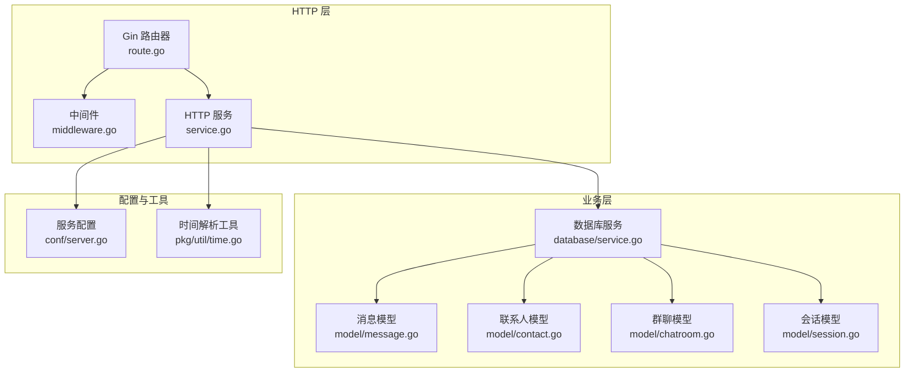
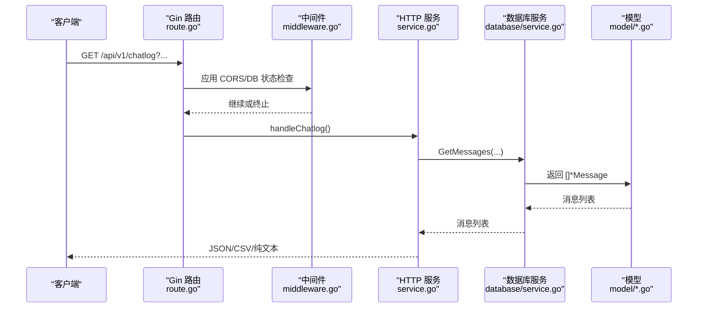
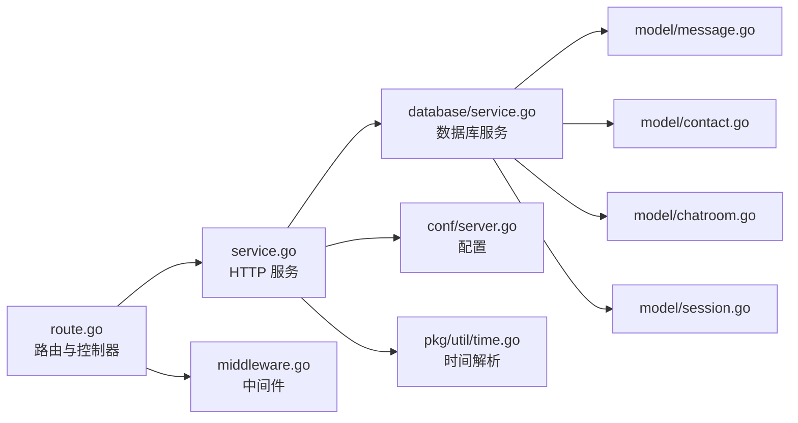

# API 端点概览

<cite>
**本文档引用的文件**
- [route.go](file://internal/chatlog/http/route.go)
- [service.go](file://internal/chatlog/http/service.go)
- [middleware.go](file://internal/chatlog/http/middleware.go)
- [cmd_server.go](file://cmd/chatlog/cmd_server.go)
- [message.go](file://internal/model/message.go)
- [contact.go](file://internal/model/contact.go)
- [chatroom.go](file://internal/model/chatroom.go)
- [session.go](file://internal/model/session.go)
- [http_errors.go](file://internal/errors/http_errors.go)
- [service.go](file://internal/chatlog/database/service.go)
- [server.go](file://internal/chatlog/conf/server.go)
- [time.go](file://pkg/util/time.go)
- [README.md](file://README.md)
</cite>

## 目录
1. [简介](#简介)
2. [项目结构](#项目结构)
3. [核心组件](#核心组件)
4. [架构总览](#架构总览)
5. [详细组件分析](#详细组件分析)
6. [依赖关系分析](#依赖关系分析)
7. [性能考量](#性能考量)
8. [故障排查指南](#故障排查指南)
9. [结论](#结论)
10. [附录](#附录)

## 简介
本文件面向 Chatlog 的 HTTP API，系统性梳理并说明所有 RESTful 接口，包括：
- /api/v1/chatlog：聊天记录查询
- /api/v1/contact：联系人列表
- /api/v1/chatroom：群聊列表
- /api/v1/session：最近会话列表

文档覆盖每个端点的 HTTP 方法、URL 路径、查询参数、请求格式、响应格式、状态码、认证机制、错误处理与最佳实践，并提供时间范围查询、关键词搜索、分页参数等的完整说明及示例。

## 项目结构
Chatlog 的 HTTP 层由 Gin 路由器驱动，路由注册集中在 HTTP 服务模块；数据库访问通过数据库服务封装；模型定义位于 model 包；工具类（如时间解析）位于 pkg/util。

图表来源
- [route.go](file://internal/chatlog/http/route.go#L26-L75)
- [service.go](file://internal/chatlog/http/service.go#L16-L59)
- [middleware.go](file://internal/chatlog/http/middleware.go#L10-L45)
- [service.go](file://internal/chatlog/database/service.go#L90-L105)
- [server.go](file://internal/chatlog/conf/server.go#L7-L61)
- [time.go](file://pkg/util/time.go#L434-L553)

章节来源
- [route.go](file://internal/chatlog/http/route.go#L26-L75)
- [service.go](file://internal/chatlog/http/service.go#L16-L59)
- [middleware.go](file://internal/chatlog/http/middleware.go#L10-L45)
- [service.go](file://internal/chatlog/database/service.go#L90-L105)
- [server.go](file://internal/chatlog/conf/server.go#L7-L61)
- [time.go](file://pkg/util/time.go#L434-L553)

## 核心组件
- HTTP 路由与控制器：负责注册 /api/v1/* 路由、绑定查询参数、调用数据库服务、输出 JSON/CSV/纯文本。
- 数据库服务：封装 GetMessages、GetContacts、GetChatRooms、GetSessions 等查询方法。
- 模型：Message、Contact、ChatRoom、Session 定义了数据结构与序列化字段。
- 中间件：CORS、数据库状态检查、错误恢复与统一错误处理。
- 配置：HTTP 地址、数据目录、工作目录、平台、版本、自动解密等。

章节来源
- [route.go](file://internal/chatlog/http/route.go#L55-L63)
- [service.go](file://internal/chatlog/database/service.go#L90-L105)
- [message.go](file://internal/model/message.go#L108-L126)
- [contact.go](file://internal/model/contact.go#L3-L9)
- [chatroom.go](file://internal/model/chatroom.go#L9-L19)
- [session.go](file://internal/model/session.go#L8-L14)
- [middleware.go](file://internal/chatlog/http/middleware.go#L10-L45)
- [server.go](file://internal/chatlog/conf/server.go#L51-L56)

## 架构总览
HTTP API 的典型请求流程如下：

图表来源
- [route.go](file://internal/chatlog/http/route.go#L90-L156)
- [middleware.go](file://internal/chatlog/http/middleware.go#L26-L45)
- [service.go](file://internal/chatlog/http/service.go#L61-L89)
- [service.go](file://internal/chatlog/database/service.go#L90-L92)
- [message.go](file://internal/model/message.go#L108-L126)

## 详细组件分析

### /api/v1/chatlog（聊天记录）
- 方法与路径：GET /api/v1/chatlog
- 中间件：checkDBStateMiddleware（数据库状态检查）
- 查询参数
  - time：时间范围，支持多种格式（见“时间范围查询”）
  - talker：聊天对象标识（支持 wxid、群聊 ID、备注名、昵称等）
  - sender：发送人标识（可选）
  - keyword：关键词（可选）
  - limit：返回条数（>=0，小于 0 将被置为 0）
  - offset：分页偏移量（>=0，小于 0 将被置为 0）
  - format：输出格式
    - json：JSON 数组
    - csv：CSV 表格（浏览器下载）
    - 默认：纯文本（逐条写入，换行分隔）
- 响应
  - JSON：数组，元素为消息对象
  - CSV：表头 Time, SenderName, Sender, TalkerName, Talker, Content
  - 纯文本：每条消息一行，包含时间、发送人、聊天对象、内容等
- 状态码
  - 200 成功
  - 400 参数无效
  - 500 服务器内部错误
  - 503 数据库未就绪/解密中/错误
- 错误处理
  - time 格式不合法：返回 400
  - 数据库状态异常：返回 503
  - 查询失败：返回 500
- 示例
  - GET /api/v1/chatlog?time=2023-01-01~2023-01-31&talker=wxid_xxx&limit=100&format=json
  - GET /api/v1/chatlog?time=today&keyword=会议&format=csv
  - GET /api/v1/chatlog?time=2023-01-01/15:00~2023-01-01/16:00&format=

章节来源
- [route.go](file://internal/chatlog/http/route.go#L90-L156)
- [middleware.go](file://internal/chatlog/http/middleware.go#L26-L45)
- [http_errors.go](file://internal/errors/http_errors.go#L5-L7)
- [time.go](file://pkg/util/time.go#L434-L553)
- [message.go](file://internal/model/message.go#L108-L126)
- [message.go](file://internal/model/message.go#L534-L544)

### /api/v1/contact（联系人）
- 方法与路径：GET /api/v1/contact
- 查询参数
  - keyword：关键词（可选）
  - limit：返回条数（>=0）
  - offset：分页偏移量（>=0）
  - format：输出格式
    - json：JSON 数组
    - csv 或其他：CSV 表头 UserName,Alias,Remark,NickName
    - 默认：纯文本（逐条写入）
- 响应
  - JSON：数组，元素为联系人对象
  - CSV/纯文本：逐行输出联系人信息
- 状态码
  - 200 成功
  - 500 服务器内部错误
- 示例
  - GET /api/v1/contact?keyword=张三&limit=50&format=json
  - GET /api/v1/contact?format=csv

章节来源
- [route.go](file://internal/chatlog/http/route.go#L158-L201)
- [contact.go](file://internal/model/contact.go#L3-L9)

### /api/v1/chatroom（群聊）
- 方法与路径：GET /api/v1/chatroom
- 查询参数
  - keyword：关键词（可选）
  - limit：返回条数（>=0）
  - offset：分页偏移量（>=0）
  - format：输出格式
    - json：JSON 数组
    - csv 或其他：CSV 表头 Name,Remark,NickName,Owner,UserCount
    - 默认：纯文本（逐条写入）
- 响应
  - JSON：数组，元素为群聊对象
  - CSV/纯文本：逐行输出群聊信息
- 状态码
  - 200 成功
  - 500 服务器内部错误
- 示例
  - GET /api/v1/chatroom?keyword=团队&format=json
  - GET /api/v1/chatroom?limit=100&format=csv

章节来源
- [route.go](file://internal/chatlog/http/route.go#L203-L245)
- [chatroom.go](file://internal/model/chatroom.go#L9-L19)

### /api/v1/session（最近会话）
- 方法与路径：GET /api/v1/session
- 查询参数
  - keyword：关键词（可选）
  - limit：返回条数（>=0）
  - offset：分页偏移量（>=0）
  - format：输出格式
    - json：JSON 数组
    - csv：CSV 表头 UserName,NOrder,NickName,Content,NTime
    - 默认：纯文本（逐条写入）
- 响应
  - JSON：数组，元素为会话对象
  - CSV/纯文本：逐行输出会话摘要
- 状态码
  - 200 成功
  - 500 服务器内部错误
- 示例
  - GET /api/v1/session?keyword=未读&format=json
  - GET /api/v1/session?limit=20&format=csv

章节来源
- [route.go](file://internal/chatlog/http/route.go#L247-L293)
- [session.go](file://internal/model/session.go#L8-L14)

### 时间范围查询（time）
- 支持格式
  - 单个时间点：YYYYMMDD、YYYY-MM-DD、YYYYMMDD/HH:MM、YYYYMMDDHHMMSS、RFC3339、相对时间（如 5h-ago、3d-ago）、自然语言（now、today、yesterday、this-week、last-week、this-month、last-month、this-year、last-year）、年份（YYYY）、月份（YYYYMM 或 YYYY-MM）、季度（YYYYQn）、年月日时分（YYYYMMDDHHMM）
  - 时间区间：start~end、start,end、start to end
  - all：全量时间
- 行为
  - 若为单个时间点，根据粒度扩展为合适的范围（秒/分钟/小时→当天；天→当天；月→当月；季度→当季；年→当年）
  - 若为区间，自动调整起止时间粒度并保证 start ≤ end
  - 若为相对时间（last-Nd、last-Nw、last-Nm、last-Ny），以当前时间为基准计算范围
- 示例
  - today、yesterday、this-week、last-week、this-month、last-month、this-year、last-year
  - 2023-01-01~2023-01-31、2023-01-01,2023-01-31、2023-01-01 to 2023-01-31
  - 2023-01-01/15:00~2023-01-01/16:00
  - 2023-01-01、2023-01-01 15:00:00、2023-01-01T15:00:00Z08:00
  - 5h-ago、3d-ago、1w-ago、1m-ago、1y-ago
  - 2023、202301、2023-01、2023Q1
  - all

章节来源
- [time.go](file://pkg/util/time.go#L434-L553)
- [time.go](file://pkg/util/time.go#L416-L432)

### 关键词搜索与分页
- keyword：支持模糊匹配（由数据库层实现）
- limit/offset：分页控制，均非负数，非法值会被修正为 0
- format：统一支持 json、csv、默认（纯文本）

章节来源
- [route.go](file://internal/chatlog/http/route.go#L90-L156)
- [route.go](file://internal/chatlog/http/route.go#L158-L293)

### 响应格式与输出
- JSON：标准 JSON 数组，字段遵循模型定义
- CSV：浏览器下载，表头按端点定制
- 纯文本：逐条输出，便于直接查看或管道处理

章节来源
- [route.go](file://internal/chatlog/http/route.go#L126-L155)
- [route.go](file://internal/chatlog/http/route.go#L178-L200)
- [route.go](file://internal/chatlog/http/route.go#L223-L244)
- [route.go](file://internal/chatlog/http/route.go#L267-L292)

### 认证机制
- 当前 HTTP API 未内置认证校验（无鉴权中间件）
- 如需安全访问，建议在反向代理层（如 Nginx、Traefik）配置 Basic Auth、Token 校验或 IP 白名单

章节来源
- [service.go](file://internal/chatlog/http/service.go#L42-L48)
- [middleware.go](file://internal/chatlog/http/middleware.go#L10-L24)

### 错误处理与状态码
- 400：参数无效（如 time 格式不合法）
- 500：服务器内部错误（数据库查询失败等）
- 503：数据库未就绪/解密中/错误
- 404：未命中路由且请求路径以 /api 或 /static 开头时返回 JSON 错误

章节来源
- [http_errors.go](file://internal/errors/http_errors.go#L5-L7)
- [middleware.go](file://internal/chatlog/http/middleware.go#L26-L45)
- [route.go](file://internal/chatlog/http/route.go#L77-L88)

### API 调用示例与响应示例
- /api/v1/chatlog
  - 请求：GET /api/v1/chatlog?time=2023-01-01~2023-01-31&talker=wxid_xxx&limit=100&format=json
  - 响应：200 OK，JSON 数组，元素为消息对象（含 seq、time、talker、talkerName、isChatRoom、sender、senderName、isSelf、type、subType、content、contents 等）
- /api/v1/contact
  - 请求：GET /api/v1/contact?keyword=张三&limit=50&format=csv
  - 响应：200 OK，CSV 表头 UserName,Alias,Remark,NickName
- /api/v1/chatroom
  - 请求：GET /api/v1/chatroom?keyword=团队&format=json
  - 响应：200 OK，JSON 数组，元素为群聊对象（含 name、owner、users、remark、nickName 等）
- /api/v1/session
  - 请求：GET /api/v1/session?limit=20&format=csv
  - 响应：200 OK，CSV 表头 UserName,NOrder,NickName,Content,NTime

章节来源
- [route.go](file://internal/chatlog/http/route.go#L90-L156)
- [route.go](file://internal/chatlog/http/route.go#L158-L293)
- [message.go](file://internal/model/message.go#L108-L126)
- [contact.go](file://internal/model/contact.go#L3-L9)
- [chatroom.go](file://internal/model/chatroom.go#L9-L19)
- [session.go](file://internal/model/session.go#L8-L14)

## 依赖关系分析

图表来源
- [route.go](file://internal/chatlog/http/route.go#L26-L75)
- [service.go](file://internal/chatlog/http/service.go#L16-L59)
- [middleware.go](file://internal/chatlog/http/middleware.go#L10-L45)
- [service.go](file://internal/chatlog/database/service.go#L90-L105)
- [server.go](file://internal/chatlog/conf/server.go#L7-L61)
- [time.go](file://pkg/util/time.go#L434-L553)

章节来源
- [route.go](file://internal/chatlog/http/route.go#L26-L75)
- [service.go](file://internal/chatlog/http/service.go#L16-L59)
- [middleware.go](file://internal/chatlog/http/middleware.go#L10-L45)
- [service.go](file://internal/chatlog/database/service.go#L90-L105)
- [server.go](file://internal/chatlog/conf/server.go#L7-L61)
- [time.go](file://pkg/util/time.go#L434-L553)

## 性能考量
- 分页参数：limit/offset 控制返回规模，避免一次性拉取过多数据导致内存压力。
- 时间范围：尽量缩小时间窗口，减少扫描范围。
- 输出格式：CSV/纯文本在大体量数据时可能占用较多带宽，建议优先使用 JSON 并在客户端做二次处理。
- 数据库状态：checkDBStateMiddleware 在数据库未就绪时直接返回 503，避免无效请求堆积。

章节来源
- [route.go](file://internal/chatlog/http/route.go#L112-L118)
- [middleware.go](file://internal/chatlog/http/middleware.go#L26-L45)

## 故障排查指南
- 400 Bad Request：检查 time 格式是否符合规范，keyword/limit/offset 是否为非负数。
- 500 Internal Server Error：查看服务日志，确认数据库连接与查询是否成功。
- 503 Service Unavailable：数据库处于 Init/Decrypting/Error 状态，等待初始化完成或修复错误后重试。
- 404 Not Found：请求路径以 /api 或 /static 开头但未匹配路由，确认端点拼写与参数。

章节来源
- [http_errors.go](file://internal/errors/http_errors.go#L5-L7)
- [middleware.go](file://internal/chatlog/http/middleware.go#L26-L45)
- [route.go](file://internal/chatlog/http/route.go#L77-L88)

## 结论
Chatlog 的 HTTP API 提供了简洁稳定的 REST 接口，覆盖聊天记录、联系人、群聊、会话四大核心数据维度。通过灵活的时间范围、关键词搜索与分页参数，以及多格式输出，满足多样化的数据消费场景。建议在生产环境中结合反向代理增强安全防护，并根据数据体量合理设置分页与时间窗口以优化性能。

## 附录

### 端点一览与参数对照
- /api/v1/chatlog
  - 查询参数：time、talker、sender、keyword、limit、offset、format
  - 响应：JSON/CSV/纯文本
- /api/v1/contact
  - 查询参数：keyword、limit、offset、format
  - 响应：JSON/CSV/纯文本
- /api/v1/chatroom
  - 查询参数：keyword、limit、offset、format
  - 响应：JSON/CSV/纯文本
- /api/v1/session
  - 查询参数：keyword、limit、offset、format
  - 响应：JSON/CSV/纯文本

章节来源
- [route.go](file://internal/chatlog/http/route.go#L55-L63)
- [route.go](file://internal/chatlog/http/route.go#L90-L156)
- [route.go](file://internal/chatlog/http/route.go#L158-L293)

### 模型字段参考
- Message：seq、time、talker、talkerName、isChatRoom、sender、senderName、isSelf、type、subType、content、contents
- Contact：userName、alias、remark、nickName、isFriend
- ChatRoom：name、owner、users、remark、nickName
- Session：userName、nOrder、nickName、content、nTime

章节来源
- [message.go](file://internal/model/message.go#L108-L126)
- [contact.go](file://internal/model/contact.go#L3-L9)
- [chatroom.go](file://internal/model/chatroom.go#L9-L19)
- [session.go](file://internal/model/session.go#L8-L14)