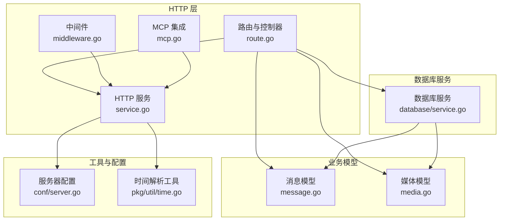
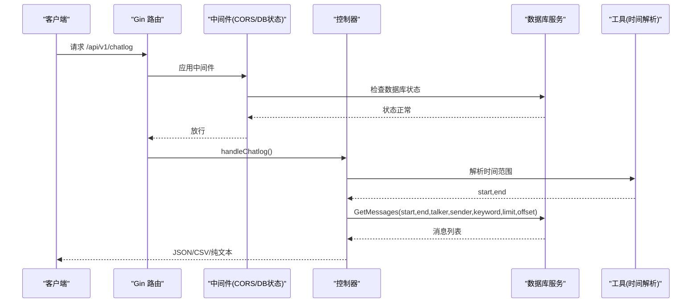
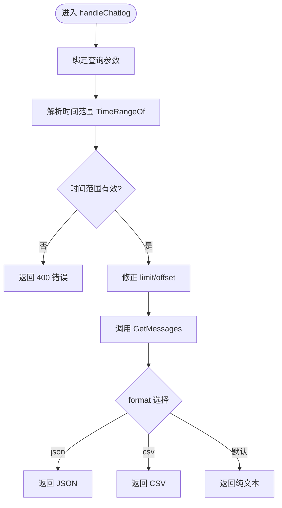
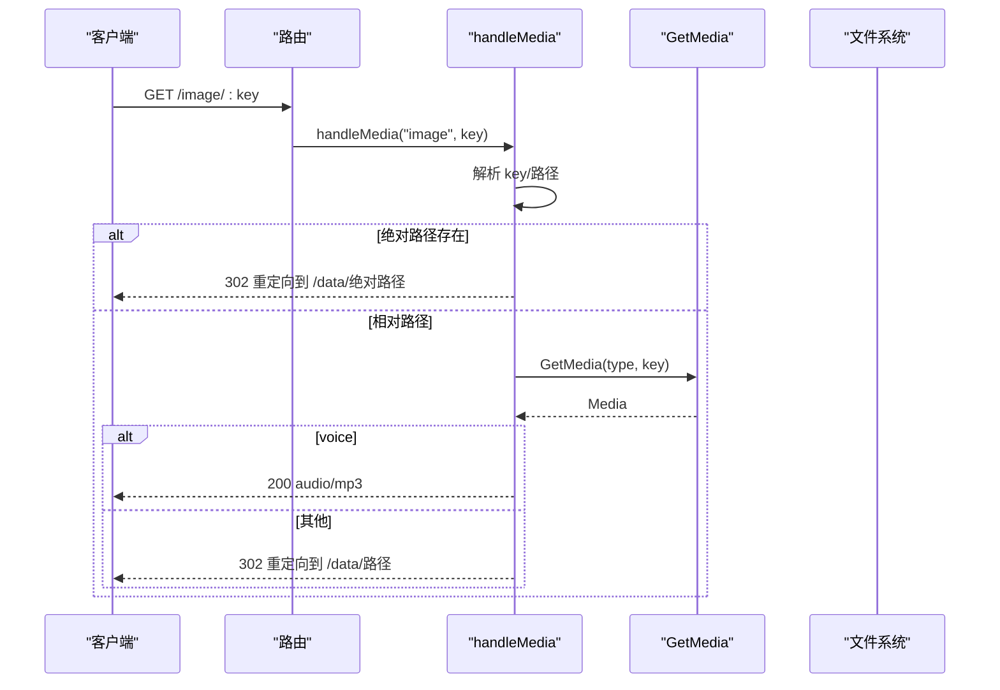
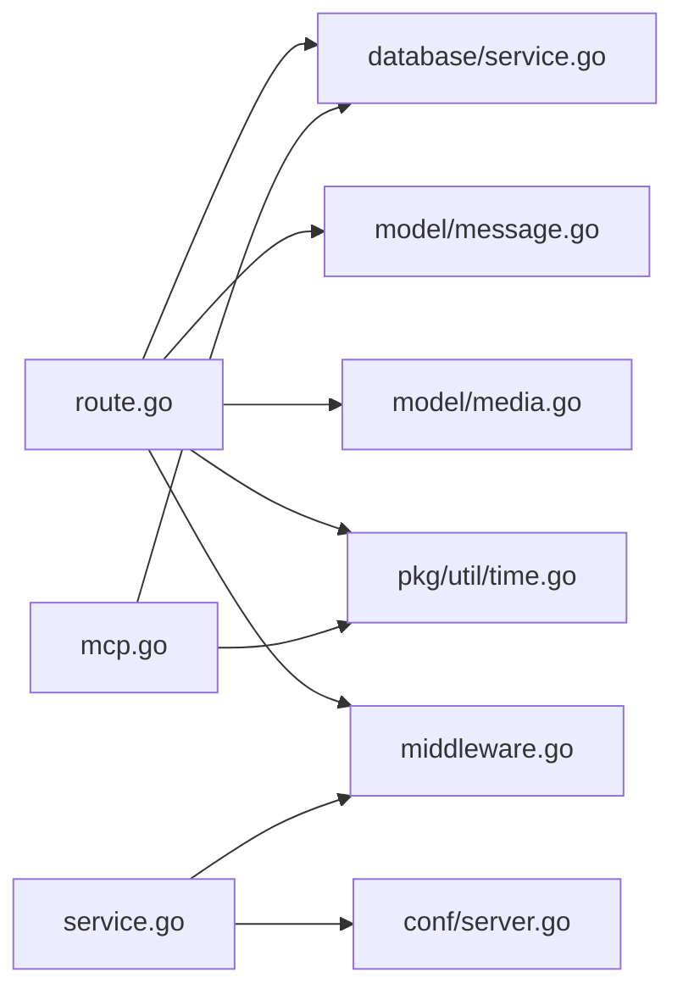

# HTTP API 服务

<cite>
**本文档引用的文件**
- [route.go](file://internal/chatlog/http/route.go)
- [service.go](file://internal/chatlog/http/service.go)
- [middleware.go](file://internal/chatlog/http/middleware.go)
- [mcp.go](file://internal/chatlog/http/mcp.go)
- [message.go](file://internal/model/message.go)
- [media.go](file://internal/model/media.go)
- [server.go](file://internal/chatlog/conf/server.go)
- [http_errors.go](file://internal/errors/http_errors.go)
- [errors.go](file://internal/errors/errors.go)
- [index.htm](file://internal/chatlog/http/static/index.htm)
- [time.go](file://pkg/util/time.go)
- [service.go](file://internal/chatlog/database/service.go)
</cite>

## 目录
1. [简介](#简介)
2. [项目结构](#项目结构)
3. [核心组件](#核心组件)
4. [架构总览](#架构总览)
5. [详细组件分析](#详细组件分析)
6. [依赖关系分析](#依赖关系分析)
7. [性能考量](#性能考量)
8. [故障排查指南](#故障排查指南)
9. [结论](#结论)
10. [附录](#附录)

## 简介
本文件面向 Chatlog HTTP API 服务，提供从接口定义、参数说明、响应格式到安全策略与集成指南的完整文档。服务基于 Gin 框架实现，提供聊天记录查询、联系人管理、群聊管理、会话管理等接口；同时支持多媒体资源访问（图片、语音、视频、文件），并通过静态页面提供在线调试工具。服务还集成了 MCP/SSE，便于与支持 MCP 的 AI 助手进行集成。

## 项目结构
- HTTP 层：路由注册、中间件、媒体资源处理、MCP 集成
- 数据模型层：消息、联系人、群聊、会话、媒体等数据结构
- 数据库服务层：统一数据库服务封装，提供查询能力
- 工具与配置：时间解析工具、服务器配置、错误处理

图表来源
- [route.go](file://internal/chatlog/http/route.go#L26-L75)
- [service.go](file://internal/chatlog/http/service.go#L16-L59)
- [middleware.go](file://internal/chatlog/http/middleware.go#L10-L45)
- [mcp.go](file://internal/chatlog/http/mcp.go#L20-L29)
- [message.go](file://internal/model/message.go#L108-L126)
- [media.go](file://internal/model/media.go#L7-L15)
- [database/service.go](file://internal/chatlog/database/service.go#L22-L43)
- [server.go](file://internal/chatlog/conf/server.go#L7-L21)
- [time.go](file://pkg/util/time.go#L434-L553)

章节来源
- [route.go](file://internal/chatlog/http/route.go#L26-L75)
- [service.go](file://internal/chatlog/http/service.go#L16-L59)

## 核心组件
- HTTP 服务与路由
  - 初始化路由、静态资源、健康检查、404 处理
  - 提供 /api/v1 下的聊天记录、联系人、群聊、会话接口
  - 提供 /image、/video、/file、/voice、/data 等媒体资源访问端点
  - 提供 /mcp、/sse、/message 等 MCP/SSE 端点
- 中间件
  - CORS 允许跨域访问
  - 数据库状态检查中间件，确保数据库可用
- 数据模型
  - Message：消息结构，包含文本、图片、语音、视频、分享、位置、转账等类型
  - Media：媒体结构，包含类型、路径、大小、修改时间等
- 数据库服务
  - 统一封装数据库查询能力，提供消息、联系人、群聊、会话、媒体查询
- 时间解析工具
  - 支持多种时间格式与范围解析，用于聊天记录查询

章节来源
- [route.go](file://internal/chatlog/http/route.go#L26-L75)
- [middleware.go](file://internal/chatlog/http/middleware.go#L10-L45)
- [message.go](file://internal/model/message.go#L108-L126)
- [media.go](file://internal/model/media.go#L7-L15)
- [database/service.go](file://internal/chatlog/database/service.go#L90-L109)
- [time.go](file://pkg/util/time.go#L434-L553)

## 架构总览
HTTP 服务通过 Gin 注册路由，中间件负责 CORS 与数据库状态校验，控制器调用数据库服务获取数据，最终以 JSON、CSV 或纯文本形式返回。媒体资源通过 /data/*path 直接访问或转换后返回，语音资源通过 silk 编码转换为 mp3。

图表来源
- [route.go](file://internal/chatlog/http/route.go#L90-L156)
- [service.go](file://internal/chatlog/http/service.go#L42-L48)
- [middleware.go](file://internal/chatlog/http/middleware.go#L26-L45)
- [time.go](file://pkg/util/time.go#L434-L553)
- [database/service.go](file://internal/chatlog/database/service.go#L90-L92)

## 详细组件分析

### HTTP 路由与控制器
- 基础路由
  - /static、/favicon.ico、/ 以及 /health 健康检查
  - 404 未命中 /api 与 /static 的路径返回 JSON 错误，否则重定向至根路径
- API 路由（/api/v1）
  - GET /chatlog：聊天记录查询
  - GET /contact：联系人查询
  - GET /chatroom：群聊查询
  - GET /session：会话查询
- 媒体路由
  - GET /image/*key、/video/*key、/file/*key、/voice/*key
  - GET /data/*path：直接访问数据目录下的文件，支持 .dat 转换
- MCP/SSE 路由
  - /mcp、/sse、/message：MCP 与 SSE 服务端事件

章节来源
- [route.go](file://internal/chatlog/http/route.go#L33-L88)
- [route.go](file://internal/chatlog/http/route.go#L55-L75)

### 聊天记录查询（/api/v1/chatlog）
- 请求方法与路径
  - GET /api/v1/chatlog
- 查询参数
  - time：时间范围或时间点，支持多种格式与范围
  - talker：聊天对象（联系人或群组 ID/昵称/备注名，可多值逗号分隔）
  - sender：发送者（群聊中限定），可多值逗号分隔
  - keyword：关键词，支持正则
  - limit：返回条数上限
  - offset：偏移量
  - format：输出格式，支持 json、csv、默认为纯文本
- 响应
  - JSON：数组，元素为消息对象
  - CSV：CSV 表头与数据行
  - 纯文本：人类可读格式
- 错误
  - 参数非法：400
  - 数据库不可用：503
  - 查询异常：500

图表来源
- [route.go](file://internal/chatlog/http/route.go#L90-L156)
- [time.go](file://pkg/util/time.go#L434-L553)
- [database/service.go](file://internal/chatlog/database/service.go#L90-L92)

章节来源
- [route.go](file://internal/chatlog/http/route.go#L90-L156)
- [time.go](file://pkg/util/time.go#L434-L553)

### 联系人查询（/api/v1/contact）
- 请求方法与路径
  - GET /api/v1/contact
- 查询参数
  - keyword：关键词
  - limit：返回条数上限
  - offset：偏移量
  - format：输出格式，支持 json、默认为 CSV/纯文本
- 响应
  - JSON：联系人列表
  - CSV/纯文本：表头与数据行

章节来源
- [route.go](file://internal/chatlog/http/route.go#L158-L201)

### 群聊查询（/api/v1/chatroom）
- 请求方法与路径
  - GET /api/v1/chatroom
- 查询参数
  - keyword：关键词
  - limit：返回条数上限
  - offset：偏移量
  - format：输出格式，支持 json、默认为 CSV/纯文本
- 响应
  - JSON：群聊列表
  - CSV/纯文本：表头与数据行

章节来源
- [route.go](file://internal/chatlog/http/route.go#L203-L245)

### 会话查询（/api/v1/session）
- 请求方法与路径
  - GET /api/v1/session
- 查询参数
  - keyword：关键词
  - limit：返回条数上限
  - offset：偏移量
  - format：输出格式，支持 json、csv、默认为纯文本
- 响应
  - JSON：会话列表
  - CSV：表头与数据行
  - 纯文本：人类可读格式

章节来源
- [route.go](file://internal/chatlog/http/route.go#L247-L293)

### 媒体资源访问
- 媒体路由
  - /image/*key、/video/*key、/file/*key、/voice/*key
  - /data/*path：直接访问数据目录
- 处理逻辑
  - 解析 key，支持绝对路径与相对路径
  - 若存在 /data/*path，则直接重定向到该路径
  - 通过数据库查询媒体信息，若为 voice 类型则转换为 mp3，否则重定向到 /data/*path
  - .dat 文件自动转换为图像或视频
- 响应
  - 语音：audio/mp3 或 audio/silk fallback
  - 图像/视频/文件：二进制流或重定向
  - .dat：根据类型返回对应 MIME

图表来源
- [route.go](file://internal/chatlog/http/route.go#L295-L384)
- [route.go](file://internal/chatlog/http/route.go#L386-L423)
- [database/service.go](file://internal/chatlog/database/service.go#L107-L109)

章节来源
- [route.go](file://internal/chatlog/http/route.go#L295-L384)
- [route.go](file://internal/chatlog/http/route.go#L386-L423)
- [media.go](file://internal/model/media.go#L7-L15)

### MCP/SSE 集成
- 端点
  - /mcp：MCP JSON-RPC
  - /sse：SSE 事件流
  - /message：SSE 事件流别名
- 工具
  - query_contact：查询联系人
  - query_chat_room：查询群聊
  - query_recent_chat：查询最近会话
  - query_chat_log：查询聊天记录（支持多步流程与上下文）
  - current_time：获取当前时间
- 流程
  - query_chat_log：支持 keyword/sender/talker/time/limit/offset/format 等参数，严格遵循多步查询流程

章节来源
- [mcp.go](file://internal/chatlog/http/mcp.go#L20-L29)
- [mcp.go](file://internal/chatlog/http/mcp.go#L31-L144)
- [mcp.go](file://internal/chatlog/http/mcp.go#L271-L317)

## 依赖关系分析
- 组件耦合
  - 控制器依赖数据库服务，数据库服务依赖 wechatdb
  - 模型层（Message/Media）被控制器与数据库服务共同使用
  - 工具层（时间解析）被控制器与 MCP 控制器使用
- 外部依赖
  - Gin：HTTP 路由与中间件
  - mark3labs/mcp-go：MCP 与 SSE
  - zerolog：日志
- 安全与中间件
  - CORS：允许任意源访问
  - 数据库状态中间件：在数据库初始化/解密/错误状态下拒绝请求

图表来源
- [route.go](file://internal/chatlog/http/route.go#L26-L75)
- [service.go](file://internal/chatlog/http/service.go#L16-L59)
- [middleware.go](file://internal/chatlog/http/middleware.go#L10-L45)
- [mcp.go](file://internal/chatlog/http/mcp.go#L20-L29)
- [database/service.go](file://internal/chatlog/database/service.go#L22-L43)
- [message.go](file://internal/model/message.go#L108-L126)
- [media.go](file://internal/model/media.go#L7-L15)
- [time.go](file://pkg/util/time.go#L434-L553)
- [server.go](file://internal/chatlog/conf/server.go#L7-L21)

章节来源
- [route.go](file://internal/chatlog/http/route.go#L26-L75)
- [service.go](file://internal/chatlog/http/service.go#L16-L59)
- [middleware.go](file://internal/chatlog/http/middleware.go#L10-L45)
- [mcp.go](file://internal/chatlog/http/mcp.go#L20-L29)
- [database/service.go](file://internal/chatlog/database/service.go#L22-L43)

## 性能考量
- 输出格式选择
  - JSON：适合程序消费，传输体积较大
  - CSV：适合批量导出，浏览器可直接下载
  - 纯文本：体积最小，适合快速浏览
- 媒体资源
  - .dat 文件转换为图像/视频时会产生额外 CPU 开销
  - 语音资源通过 silk 转 mp3，建议缓存以减少重复转换
- 数据库状态
  - 数据库初始化/解密期间返回 503，避免无意义的查询

## 故障排查指南
- 常见错误码
  - 400：参数非法（如时间格式错误）
  - 404：未找到资源（/api 与 /static 未命中）
  - 500：内部错误（数据库查询异常、文件读取异常等）
  - 503：数据库不可用（初始化/解密/错误状态）
- 常见问题
  - 时间参数格式不正确：请参考时间解析支持的格式
  - 媒体资源无法访问：确认 key 是否正确，或使用 /data/*path 直接访问
  - 数据库状态异常：等待解密完成或检查配置
- 日志
  - 服务启动与停止日志，错误堆栈可通过错误处理中间件返回

章节来源
- [http_errors.go](file://internal/errors/http_errors.go#L5-L11)
- [errors.go](file://internal/errors/errors.go#L113-L120)
- [middleware.go](file://internal/chatlog/http/middleware.go#L26-L45)
- [route.go](file://internal/chatlog/http/route.go#L77-L88)

## 结论
Chatlog HTTP API 服务提供了简洁易用的聊天数据查询与媒体资源访问能力，配合 MCP/SSE 可与 AI 助手无缝集成。通过合理的参数设计与多格式输出，满足不同使用场景的需求。建议在生产环境中结合 CORS 与数据库状态中间件，确保安全与稳定性。

## 附录

### API 使用示例与集成指南
- 在线调试
  - 服务自带静态页面，提供交互式 API 测试器，可直接在浏览器中测试各接口
- 基本集成步骤
  - 启动服务后，访问根路径查看调试界面
  - 使用 GET /api/v1/chatlog 查询聊天记录，设置 time、talker、sender、keyword、limit、offset、format
  - 使用 GET /image/*key、/video/*key、/file/*key、/voice/*key 访问媒体资源
  - 使用 /mcp、/sse、/message 与 MCP 兼容的 AI 助手集成

章节来源
- [index.htm](file://internal/chatlog/http/static/index.htm#L340-L525)
- [route.go](file://internal/chatlog/http/route.go#L47-L75)

### 安全与配置
- CORS
  - 允许任意源访问，支持常见方法与头部
- 数据库地址
  - 默认监听 0.0.0.0:5030，可通过配置覆盖
- 数据库状态
  - 初始化、解密、错误三种状态，非就绪状态返回 503

章节来源
- [middleware.go](file://internal/chatlog/http/middleware.go#L10-L24)
- [server.go](file://internal/chatlog/conf/server.go#L3-L56)
- [database/service.go](file://internal/chatlog/database/service.go#L15-L29)