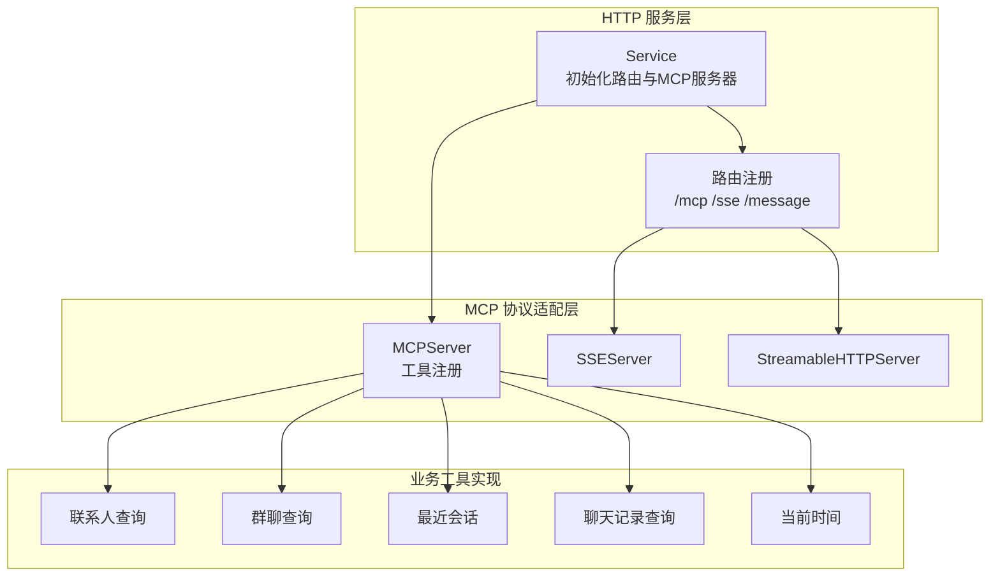
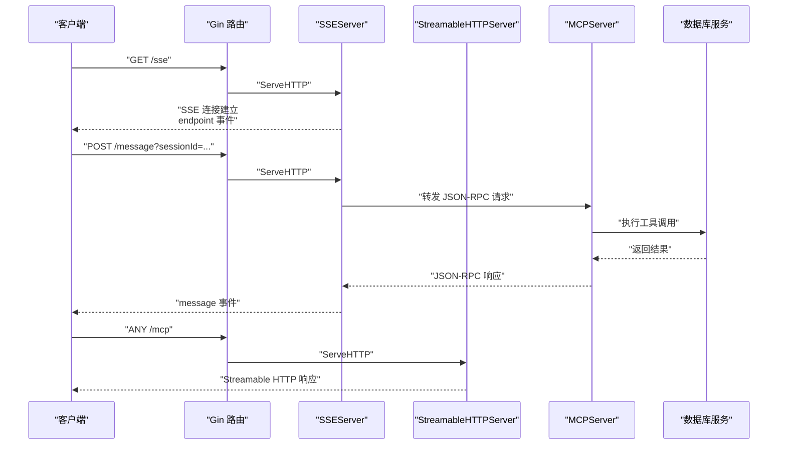
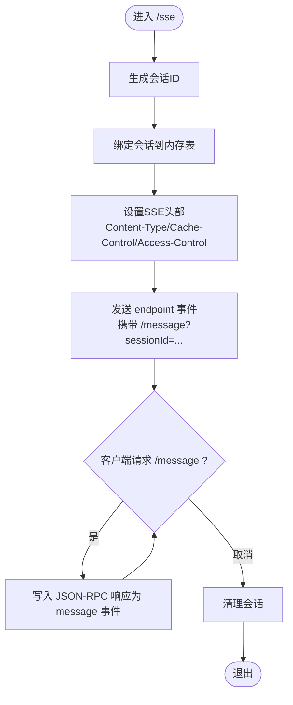
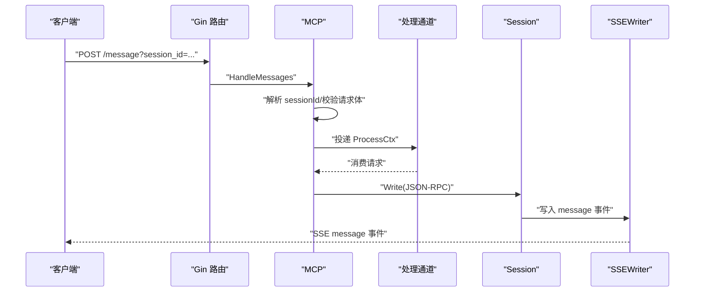
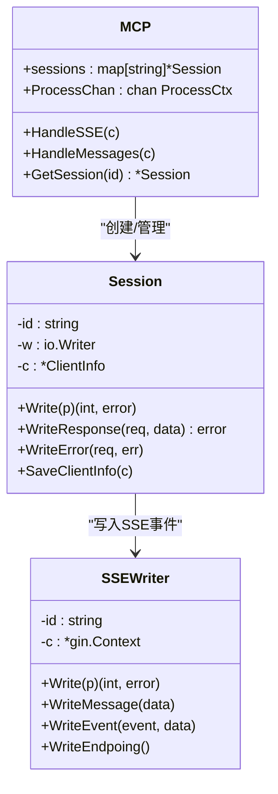
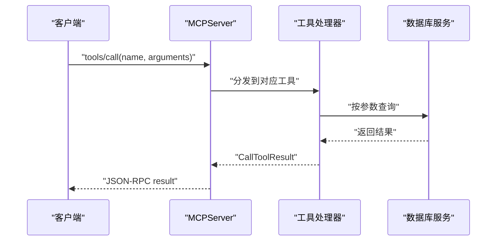
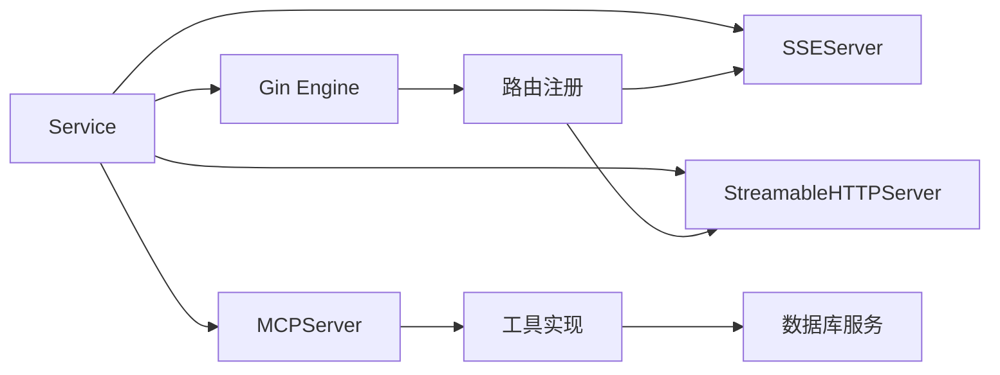

# MCP 协议集成

<cite>
**本文引用的文件**
- [internal/mcp/mcp.go](file://internal/mcp/mcp.go)
- [internal/mcp/session.go](file://internal/mcp/session.go)
- [internal/mcp/jsonrpc.go](file://internal/mcp/jsonrpc.go)
- [internal/mcp/error.go](file://internal/mcp/error.go)
- [internal/mcp/prompt.go](file://internal/mcp/prompt.go)
- [internal/mcp/tool.go](file://internal/mcp/tool.go)
- [internal/mcp/resource.go](file://internal/mcp/resource.go)
- [internal/mcp/initialize.go](file://internal/mcp/initialize.go)
- [internal/mcp/sse.go](file://internal/mcp/sse.go)
- [internal/chatlog/http/route.go](file://internal/chatlog/http/route.go)
- [internal/chatlog/http/service.go](file://internal/chatlog/http/service.go)
- [internal/chatlog/http/mcp.go](file://internal/chatlog/http/mcp.go)
- [internal/errors/mcp.go](file://internal/errors/mcp.go)
- [internal/chatlog/conf/server.go](file://internal/chatlog/conf/server.go)
- [docs/mcp.md](file://docs/mcp.md)
- [main.go](file://main.go)
</cite>

## 目录
1. [简介](#简介)
2. [项目结构](#项目结构)
3. [核心组件](#核心组件)
4. [架构总览](#架构总览)
5. [详细组件分析](#详细组件分析)
6. [依赖关系分析](#依赖关系分析)
7. [性能考量](#性能考量)
8. [故障排除指南](#故障排除指南)
9. [结论](#结论)
10. [附录](#附录)

## 简介
本文件面向希望在应用中集成 MCP（Model Context Protocol）协议的开发者，基于仓库中的实现，系统性地说明以下内容：
- /mcp、/sse、/message 三个端点的实现与使用方法
- Streamable HTTP 协议的工作原理与优势
- Server-Sent Events（SSE）的实现机制与事件推送能力
- MCP 协议的集成示例（Claude Desktop、Monica Code、ChatWise 等第三方应用）
- 会话管理与状态维护机制
- 协议规范要点、消息格式、错误处理与调试技巧
- 完整的集成指南与故障排除方法

## 项目结构
该项目采用“服务层 + 协议适配层 + 协议模型层”的分层组织：
- 服务层负责 HTTP 路由与启动，以及 MCP 服务器实例化与注册工具
- 协议适配层负责将内部业务逻辑映射为 MCP 协议的工具与消息
- 协议模型层定义 MCP 的消息格式、能力、资源与提示词等

图表来源
- [internal/chatlog/http/service.go](file://internal/chatlog/http/service.go#L16-L26)
- [internal/chatlog/http/route.go](file://internal/chatlog/http/route.go#L65-L75)
- [internal/chatlog/http/mcp.go](file://internal/chatlog/http/mcp.go#L20-L29)

章节来源
- [internal/chatlog/http/service.go](file://internal/chatlog/http/service.go#L16-L26)
- [internal/chatlog/http/route.go](file://internal/chatlog/http/route.go#L65-L75)
- [internal/chatlog/http/mcp.go](file://internal/chatlog/http/mcp.go#L20-L29)

## 核心组件
- 协议模型与消息格式
  - JSON-RPC 2.0 请求/响应与通知
  - 初始化与心跳
  - 提示词、工具、资源等协议要素
- 会话与 SSE 推送
  - 会话生命周期与 SSEWriter
  - Ping 保活与事件推送
- HTTP 路由与端点
  - /mcp：Streamable HTTP
  - /sse：SSE
  - /message：SSE 消息入口
- 工具实现
  - 联系人、群聊、最近会话、聊天记录、当前时间等工具

章节来源
- [internal/mcp/jsonrpc.go](file://internal/mcp/jsonrpc.go#L9-L62)
- [internal/mcp/initialize.go](file://internal/mcp/initialize.go#L27-L78)
- [internal/mcp/prompt.go](file://internal/mcp/prompt.go#L5-L137)
- [internal/mcp/tool.go](file://internal/mcp/tool.go#L5-L143)
- [internal/mcp/resource.go](file://internal/mcp/resource.go#L5-L74)
- [internal/mcp/session.go](file://internal/mcp/session.go#L10-L48)
- [internal/mcp/sse.go](file://internal/mcp/sse.go#L16-L100)
- [internal/chatlog/http/route.go](file://internal/chatlog/http/route.go#L65-L75)

## 架构总览
MCP 的接入通过 HTTP 路由将外部请求转交给 MCP Go 的服务器实现，内部工具通过统一的工具接口与数据库交互，最终以 JSON-RPC 消息与 SSE 事件的形式返回给客户端。

图表来源
- [internal/chatlog/http/route.go](file://internal/chatlog/http/route.go#L65-L75)
- [internal/chatlog/http/service.go](file://internal/chatlog/http/service.go#L23-L25)
- [internal/chatlog/http/mcp.go](file://internal/chatlog/http/mcp.go#L20-L29)

## 详细组件分析

### /mcp 端点（Streamable HTTP）
- 实现方式
  - 路由将任意方法请求交由 StreamableHTTPServer 处理，遵循 Streamable HTTP 协议，适合浏览器直连与部分不支持 SSE 的客户端。
- 适用场景
  - 需要通过 HTTP 流式传输的客户端或代理环境；与 mcp-proxy 结合可兼容不支持 SSE 的旧客户端。
- 关键点
  - 与 /sse 共享同一套工具注册与消息处理逻辑，差异在于传输层。

章节来源
- [internal/chatlog/http/route.go](file://internal/chatlog/http/route.go#L65-L75)
- [internal/chatlog/http/service.go](file://internal/chatlog/http/service.go#L23-L25)

### /sse 端点（Server-Sent Events）
- 实现方式
  - 建立长连接，设置标准 SSE 头部，发送 endpoint 事件告知客户端消息入口；周期性发送 ping 事件保活；支持 SSEvent 推送。
- 会话管理
  - 为每个连接生成唯一会话 ID，绑定 SSEWriter；请求结束自动清理。
- 事件推送
  - 通过 SSEWriter.WriteEvent 或 SSESession.SendEvent 发送 message 事件，客户端监听并解析 JSON-RPC 响应。

图表来源
- [internal/mcp/mcp.go](file://internal/mcp/mcp.go#L31-L45)
- [internal/mcp/sse.go](file://internal/mcp/sse.go#L21-L76)
- [internal/mcp/session.go](file://internal/mcp/session.go#L16-L21)

章节来源
- [internal/mcp/mcp.go](file://internal/mcp/mcp.go#L31-L45)
- [internal/mcp/sse.go](file://internal/mcp/sse.go#L21-L76)
- [internal/mcp/session.go](file://internal/mcp/session.go#L16-L21)

### /message 端点（SSE 消息入口）
- 实现方式
  - 从查询参数或路径参数解析 sessionId，校验会话存在性；接收 JSON-RPC 请求体；投递到处理通道；返回 Accepted。
- 处理流程
  - 解析 session_id（兼容 session_id、sessionId、sessionid）
  - 校验请求体 JSON-RPC 格式
  - 投递到 MCP.ProcessChan，阻塞策略为默认丢弃，避免过载
  - 通过 Session.Write 将响应写回 SSE

图表来源
- [internal/mcp/mcp.go](file://internal/mcp/mcp.go#L53-L98)
- [internal/mcp/session.go](file://internal/mcp/session.go#L23-L44)
- [internal/mcp/sse.go](file://internal/mcp/sse.go#L42-L50)

章节来源
- [internal/mcp/mcp.go](file://internal/mcp/mcp.go#L53-L98)
- [internal/mcp/session.go](file://internal/mcp/session.go#L23-L44)

### Streamable HTTP 协议（优势与工作原理）
- 工作原理
  - 以 HTTP 流式响应承载 JSON-RPC 消息，无需长连接，便于代理、缓存与跨域处理。
- 优势
  - 更易被现有 Web 环境与反向代理接受
  - 与 /sse 共用工具链，降低维护成本
- 适用场景
  - 不支持 SSE 的浏览器或网络环境
  - 与 mcp-proxy 等工具配合使用

章节来源
- [internal/chatlog/http/route.go](file://internal/chatlog/http/route.go#L65-L75)
- [docs/mcp.md](file://docs/mcp.md#L18-L31)

### 会话管理与状态维护
- 会话生命周期
  - /sse 建立时创建 Session，绑定 SSEWriter；请求结束或连接断开时清理
- 并发与容量
  - 会话表加锁保护；处理通道具备容量限制，避免过载
- 客户端信息
  - 通过初始化请求保存 ClientInfo，便于后续审计或扩展

图表来源
- [internal/mcp/mcp.go](file://internal/mcp/mcp.go#L17-L29)
- [internal/mcp/session.go](file://internal/mcp/session.go#L10-L14)
- [internal/mcp/sse.go](file://internal/mcp/sse.go#L16-L35)

章节来源
- [internal/mcp/mcp.go](file://internal/mcp/mcp.go#L17-L29)
- [internal/mcp/session.go](file://internal/mcp/session.go#L10-L14)
- [internal/mcp/sse.go](file://internal/mcp/sse.go#L16-L35)

### 协议规范与消息格式
- JSON-RPC 2.0
  - 请求：包含 jsonrpc、id、method、params
  - 响应：包含 jsonrpc、id、result 或 error
  - 通知：无 id，仅 method 与 params
- 初始化与心跳
  - initialize：声明 protocolVersion、capabilities、clientInfo
  - ping：心跳保活
- 提示词（Prompts）
  - prompts/list、prompts/get
- 工具（Tools）
  - tools/list、tools/call
  - 输入参数通过 inputSchema 描述
- 资源（Resources）
  - resources/list、resources/read、subscribe/unsubscribe
  - 通知：list_changed、updated

章节来源
- [internal/mcp/jsonrpc.go](file://internal/mcp/jsonrpc.go#L9-L62)
- [internal/mcp/initialize.go](file://internal/mcp/initialize.go#L27-L78)
- [internal/mcp/prompt.go](file://internal/mcp/prompt.go#L5-L137)
- [internal/mcp/tool.go](file://internal/mcp/tool.go#L5-L143)
- [internal/mcp/resource.go](file://internal/mcp/resource.go#L5-L74)

### 工具实现与业务集成
- 工具注册
  - 在服务启动时注册 Contact、ChatRoom、RecentChat、ChatLog、CurrentTime 等工具
- 参数绑定与校验
  - 使用 JSON 绑定与工具参数校验，错误时返回标准 MCP 工具错误
- 数据查询
  - 联系人、群聊、会话、消息查询均通过数据库服务完成

图表来源
- [internal/chatlog/http/mcp.go](file://internal/chatlog/http/mcp.go#L31-L155)
- [internal/errors/mcp.go](file://internal/errors/mcp.go#L5-L15)

章节来源
- [internal/chatlog/http/mcp.go](file://internal/chatlog/http/mcp.go#L31-L155)
- [internal/errors/mcp.go](file://internal/errors/mcp.go#L5-L15)

### 第三方应用集成示例
- ChatWise
  - 使用 SSE，URL 为 http://127.0.0.1:5030/sse
  - 需要 Pro 权限
- Cherry Studio
  - 添加服务器类型为 SSE，URL 为 http://127.0.0.1:5030/sse
- Claude Desktop
  - 使用 mcp-proxy 将 stdio 转换为 SSE，命令行指向 http://127.0.0.1:5030/sse
- Monica Code
  - 在实验配置中设置 transport 为 stdio，command 指向 mcp-proxy，args 为 http://127.0.0.1:5030/sse

章节来源
- [docs/mcp.md](file://docs/mcp.md#L33-L151)

## 依赖关系分析
- 组件耦合
  - Service 依赖 Gin 路由与 MCP Go 服务器，负责路由注册与工具注册
  - 路由层将请求分发至 SSEServer 或 StreamableHTTPServer
  - 工具层通过统一接口与数据库交互
- 外部依赖
  - mcp-go：提供 MCPServer、SSEServer、StreamableHTTPServer
  - gin：HTTP 路由与中间件
  - zerolog：日志

图表来源
- [internal/chatlog/http/service.go](file://internal/chatlog/http/service.go#L16-L26)
- [internal/chatlog/http/route.go](file://internal/chatlog/http/route.go#L65-L75)
- [internal/chatlog/http/mcp.go](file://internal/chatlog/http/mcp.go#L20-L29)

章节来源
- [internal/chatlog/http/service.go](file://internal/chatlog/http/service.go#L16-L26)
- [internal/chatlog/http/route.go](file://internal/chatlog/http/route.go#L65-L75)
- [internal/chatlog/http/mcp.go](file://internal/chatlog/http/mcp.go#L20-L29)

## 性能考量
- 通道容量与背压
  - 处理通道具备固定容量，避免瞬时高并发导致内存膨胀；可通过调整容量参数平衡吞吐与稳定性
- SSE 保活
  - 定期发送 ping 事件，减少网络中间设备断开连接带来的影响
- 会话清理
  - 连接断开或请求结束及时清理会话，防止内存泄漏
- 日志与可观测性
  - 使用统一日志框架输出请求与错误信息，便于监控与排障

## 故障排除指南
- 常见错误与处理
  - 无效会话 ID：检查 sessionId 查询参数拼写与传递方式（支持 session_id、sessionId、sessionid）
  - 会话不存在：确认 /sse 是否已建立且未过期
  - 请求体非法：确保 JSON-RPC 请求体格式正确
  - 请求过多：处理通道满时返回 Too Many Requests，建议降频或增加容量
- 工具调用失败
  - 工具参数绑定失败或数据库查询异常时，返回标准 MCP 工具错误，包含错误文本
- 代理与跨域
  - SSE 默认允许跨域；若仍遇跨域问题，请检查代理配置
- 与 mcp-proxy 配合
  - 若客户端不支持 SSE，使用 mcp-proxy 将 stdio 转换为 SSE，确保命令行路径正确

章节来源
- [internal/mcp/mcp.go](file://internal/mcp/mcp.go#L53-L98)
- [internal/mcp/error.go](file://internal/mcp/error.go#L23-L44)
- [internal/errors/mcp.go](file://internal/errors/mcp.go#L5-L15)
- [docs/mcp.md](file://docs/mcp.md#L18-L31)

## 结论
本项目通过清晰的分层设计与标准的 MCP 协议实现，提供了稳定可靠的工具与消息能力。结合 SSE 与 Streamable HTTP 两种传输方式，能够覆盖主流客户端与代理环境。建议在生产环境中关注通道容量、会话清理与日志监控，以获得更好的稳定性与可观测性。

## 附录

### 端点与传输对照
- /mcp：Streamable HTTP（推荐用于不支持 SSE 的环境）
- /sse：SSE（推荐用于现代浏览器与桌面客户端）
- /message：SSE 消息入口（由 endpoint 事件指示）

章节来源
- [internal/chatlog/http/route.go](file://internal/chatlog/http/route.go#L65-L75)

### 默认监听地址
- 默认 HTTP 地址：0.0.0.0:5030

章节来源
- [internal/chatlog/conf/server.go](file://internal/chatlog/conf/server.go#L3-L5)
- [internal/chatlog/conf/server.go](file://internal/chatlog/conf/server.go#L51-L56)

### 启动入口
- main 函数调用 chatlog.Execute() 启动服务

章节来源
- [main.go](file://main.go#L9-L12)