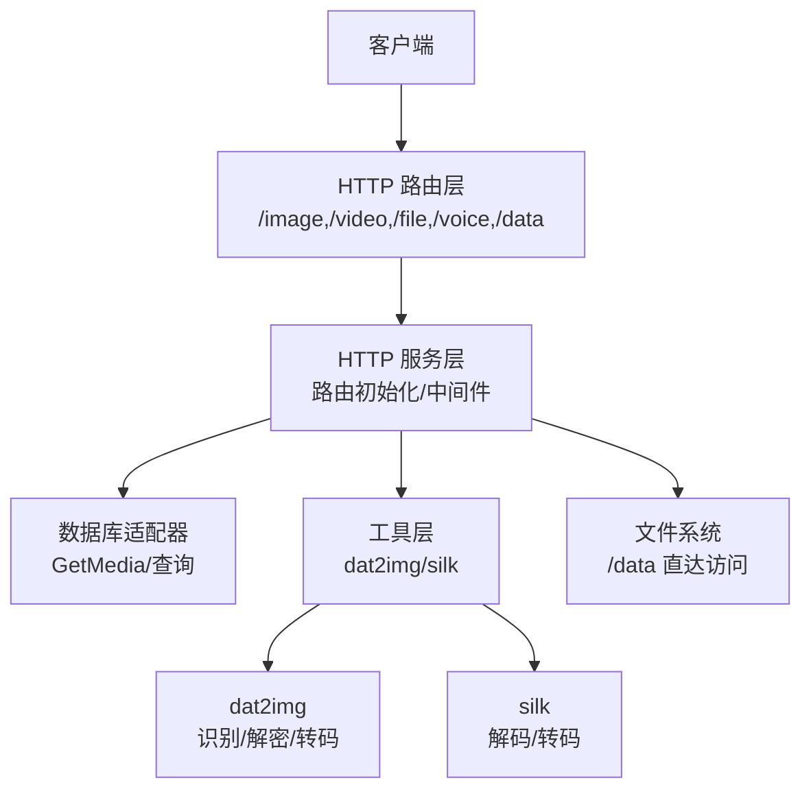
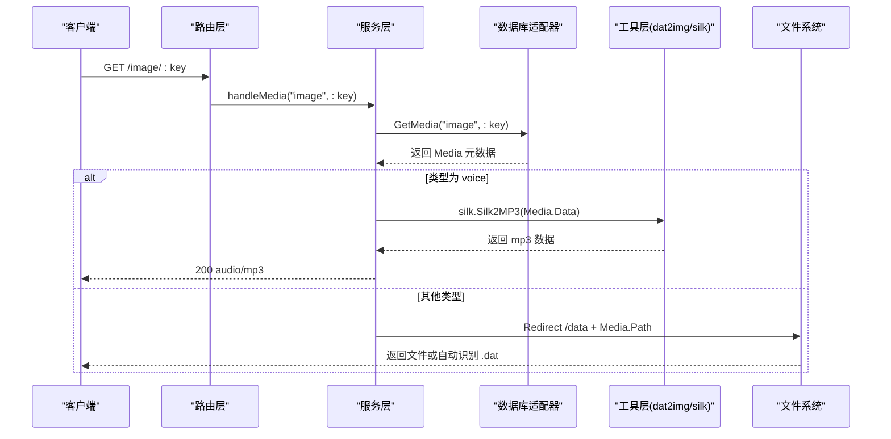
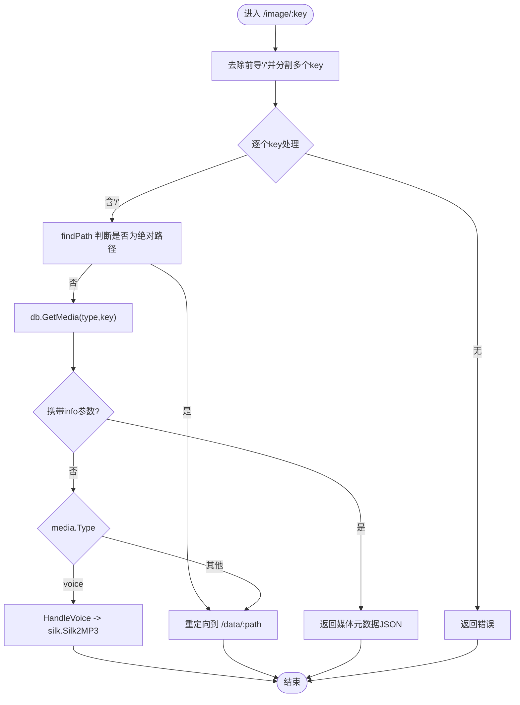
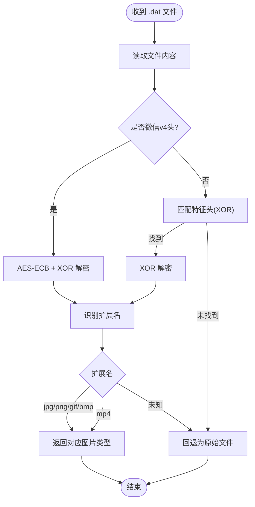
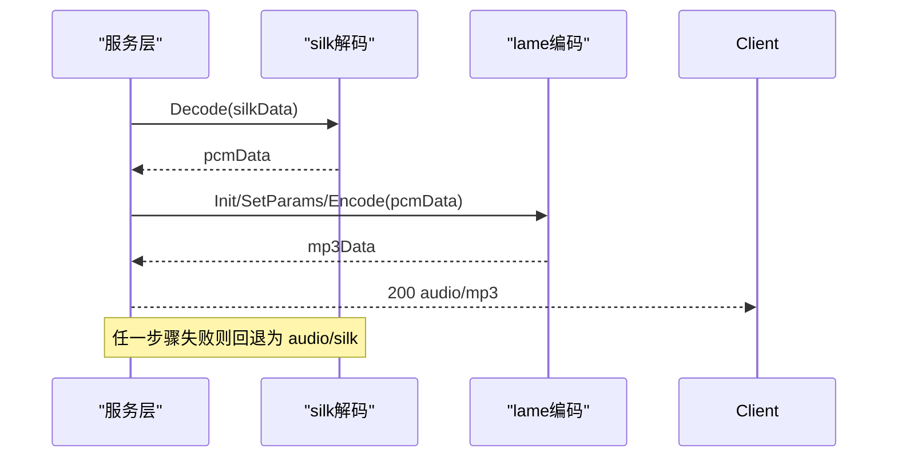
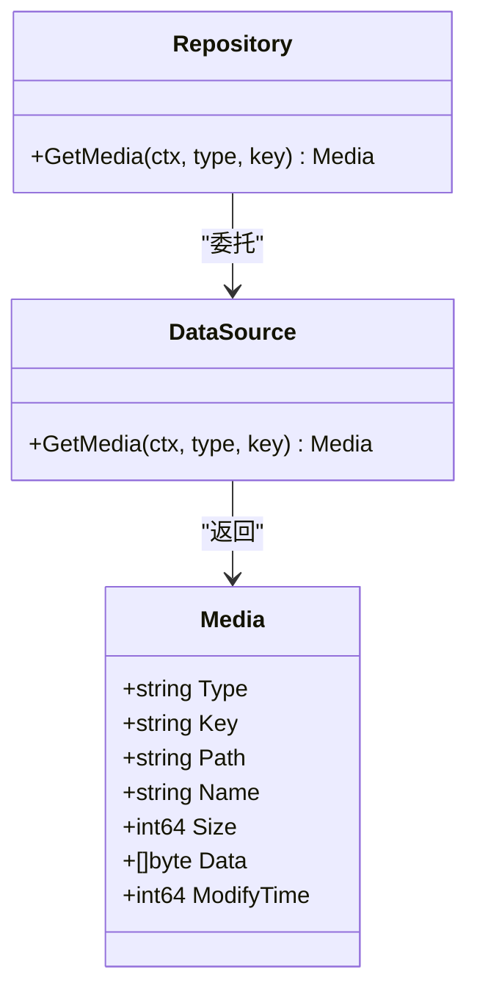
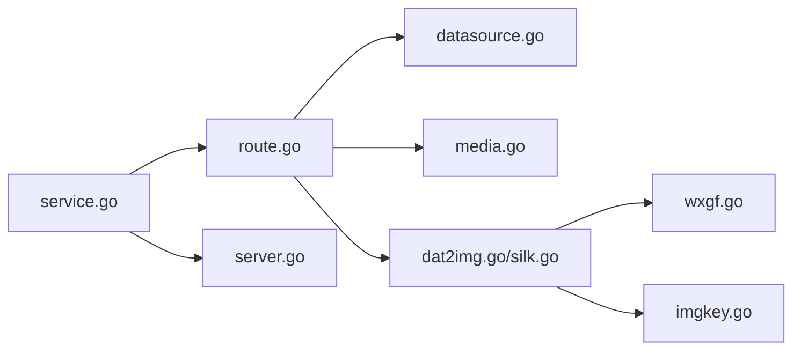

# 多媒体内容处理

<cite>
**本文引用的文件**
- [internal/chatlog/http/route.go](file://internal/chatlog/http/route.go)
- [internal/chatlog/http/service.go](file://internal/chatlog/http/service.go)
- [internal/chatlog/http/middleware.go](file://internal/chatlog/http/middleware.go)
- [pkg/util/dat2img/dat2img.go](file://pkg/util/dat2img/dat2img.go)
- [pkg/util/dat2img/imgkey.go](file://pkg/util/dat2img/imgkey.go)
- [pkg/util/dat2img/wxgf.go](file://pkg/util/dat2img/wxgf.go)
- [pkg/util/silk/silk.go](file://pkg/util/silk/silk.go)
- [internal/model/media.go](file://internal/model/media.go)
- [internal/errors/errors.go](file://internal/errors/errors.go)
- [internal/errors/wechatdb_errors.go](file://internal/errors/wechatdb_errors.go)
- [internal/errors/os_errors.go](file://internal/errors/os_errors.go)
- [internal/chatlog/conf/server.go](file://internal/chatlog/conf/server.go)
- [internal/wechatdb/datasource/datasource.go](file://internal/wechatdb/datasource/datasource.go)
- [internal/wechatdb/repository/media.go](file://internal/wechatdb/repository/media.go)
</cite>

## 目录
1. [简介](#简介)
2. [项目结构](#项目结构)
3. [核心组件](#核心组件)
4. [架构总览](#架构总览)
5. [详细组件分析](#详细组件分析)
6. [依赖关系分析](#依赖关系分析)
7. [性能与缓存策略](#性能与缓存策略)
8. [使用示例](#使用示例)
9. [故障排除指南](#故障排除指南)
10. [结论](#结论)

## 简介
本文件面向多媒体内容处理接口的使用者与维护者，系统化阐述以下能力：
- 多媒体资源访问接口：/image、/video、/file、/voice 的调用方式与行为差异
- dat 文件格式自动识别与转换：图片、视频、语音等不同媒体类型的处理流程
- silk 语音编码到 mp3 的转码实现细节
- 绝对路径与相对路径访问的区别，以及 /data 路径的直接文件访问方式
- 媒体文件的缓存策略、性能优化与错误处理机制
- 完整的使用示例与故障排除指南

## 项目结构
该服务基于 Gin 框架构建，路由层负责对外暴露多媒体访问接口；业务层通过数据库适配器查询媒体元数据；工具层提供 dat 解密与 silk 转码能力。

图表来源
- [internal/chatlog/http/route.go](file://internal/chatlog/http/route.go#L26-L75)
- [internal/chatlog/http/service.go](file://internal/chatlog/http/service.go#L33-L59)

章节来源
- [internal/chatlog/http/route.go](file://internal/chatlog/http/route.go#L26-L75)
- [internal/chatlog/http/service.go](file://internal/chatlog/http/service.go#L33-L59)

## 核心组件
- 路由与控制器
  - /image、/video、/file、/voice：根据 key 查询媒体元数据，按类型进行重定向或直接返回
  - /data：基于相对路径拼接绝对路径，支持 .dat 自动识别与转换
- 工具层
  - dat2img：识别微信 dat 图片/视频（含 wxgf 动漫帧）并解密输出标准格式
  - silk：silk 音频解码为 PCM 后转码为 mp3
- 数据模型与仓库
  - Media：统一的媒体元数据结构，包含类型、键、路径、名称、大小、修改时间等
  - 仓库与数据源：GetMedia 接口屏蔽平台与版本差异
- 中间件与错误处理
  - CORS、数据库状态检查、统一错误响应

章节来源
- [internal/chatlog/http/route.go](file://internal/chatlog/http/route.go#L47-L53)
- [internal/chatlog/http/route.go](file://internal/chatlog/http/route.go#L295-L339)
- [internal/chatlog/http/route.go](file://internal/chatlog/http/route.go#L363-L384)
- [pkg/util/dat2img/dat2img.go](file://pkg/util/dat2img/dat2img.go#L46-L95)
- [pkg/util/silk/silk.go](file://pkg/util/silk/silk.go#L10-L36)
- [internal/model/media.go](file://internal/model/media.go#L7-L15)
- [internal/wechatdb/datasource/datasource.go](file://internal/wechatdb/datasource/datasource.go#L16-L37)

## 架构总览
下图展示从客户端请求到最终响应的关键交互：

图表来源
- [internal/chatlog/http/route.go](file://internal/chatlog/http/route.go#L295-L339)
- [internal/chatlog/http/route.go](file://internal/chatlog/http/route.go#L416-L423)
- [internal/wechatdb/datasource/datasource.go](file://internal/wechatdb/datasource/datasource.go#L30-L31)

## 详细组件分析

### 路由与控制器
- /image、/video、/file、/voice
  - 支持多 key 逗号分隔；若 key 包含“/”，优先尝试绝对路径解析，失败则回退到数据库查询
  - 若携带 info 查询参数，返回媒体元数据 JSON
  - voice 类型走 silk 转码逻辑，其他类型走 /data 重定向
- /data
  - 清理相对路径后拼接到配置的 DataDir
  - 若扩展名为 .dat，调用 dat2img 自动识别并转换为标准格式；否则直接返回文件

图表来源
- [internal/chatlog/http/route.go](file://internal/chatlog/http/route.go#L295-L339)
- [internal/chatlog/http/route.go](file://internal/chatlog/http/route.go#L341-L361)
- [internal/chatlog/http/route.go](file://internal/chatlog/http/route.go#L363-L384)

章节来源
- [internal/chatlog/http/route.go](file://internal/chatlog/http/route.go#L295-L339)
- [internal/chatlog/http/route.go](file://internal/chatlog/http/route.go#L341-L361)
- [internal/chatlog/http/route.go](file://internal/chatlog/http/route.go#L363-L384)

### dat 文件自动识别与转换
- 识别与解密
  - 旧版：通过特征头匹配与 XOR 解密，输出标准图片格式
  - 微信 v4：AES-ECB + XOR 组合加密，先解密再识别
  - 特殊格式 wxgf：可转为 mp4 或 gif（依赖 ffmpeg）
- 自动路径探测
  - 对 image/video 类型，若绝对路径不存在，尝试补充后缀（如 _h.dat、.dat、_t.dat、.mp4、_thumb.jpg）以定位真实文件
- 输出控制
  - 根据识别到的扩展名设置 Content-Type 并返回二进制数据

图表来源
- [pkg/util/dat2img/dat2img.go](file://pkg/util/dat2img/dat2img.go#L46-L95)
- [pkg/util/dat2img/dat2img.go](file://pkg/util/dat2img/dat2img.go#L204-L286)
- [pkg/util/dat2img/wxgf.go](file://pkg/util/dat2img/wxgf.go#L39-L91)

章节来源
- [pkg/util/dat2img/dat2img.go](file://pkg/util/dat2img/dat2img.go#L46-L95)
- [pkg/util/dat2img/dat2img.go](file://pkg/util/dat2img/dat2img.go#L204-L286)
- [pkg/util/dat2img/wxgf.go](file://pkg/util/dat2img/wxgf.go#L39-L91)

### silk 语音编码到 mp3 转码
- 解码流程
  - 使用 silk 解码器将 silk 数据解码为 PCM
  - 初始化 lame 编码器，设置采样率、声道、码率等参数
  - 将 PCM 编码为 mp3
- 失败回退
  - 若任一步骤失败，回退为返回原始 silk 数据

图表来源
- [pkg/util/silk/silk.go](file://pkg/util/silk/silk.go#L10-L36)
- [internal/chatlog/http/route.go](file://internal/chatlog/http/route.go#L416-L423)

章节来源
- [pkg/util/silk/silk.go](file://pkg/util/silk/silk.go#L10-L36)
- [internal/chatlog/http/route.go](file://internal/chatlog/http/route.go#L416-L423)

### 绝对路径与相对路径访问
- 绝对路径
  - 当 key 含“/”时，优先在 DataDir 下查找是否存在该绝对路径；存在则重定向到 /data
  - 对 image/video 类型，若绝对路径不存在，尝试补齐常见后缀以定位真实文件
- 相对路径
  - /data/*path 通过 filepath.Clean 清理后拼接到 DataDir
  - 若 .dat 文件存在，自动识别并转换；否则直接返回文件

章节来源
- [internal/chatlog/http/route.go](file://internal/chatlog/http/route.go#L341-L361)
- [internal/chatlog/http/route.go](file://internal/chatlog/http/route.go#L363-L384)

### 数据模型与仓库
- Media
  - 统一承载媒体类型、键、路径、名称、大小、修改时间、语音数据等字段
- 仓库与数据源
  - GetMedia(ctx, type, key) 屏蔽平台与版本差异，返回 Media

图表来源
- [internal/model/media.go](file://internal/model/media.go#L7-L15)
- [internal/wechatdb/repository/media.go](file://internal/wechatdb/repository/media.go#L9-L11)
- [internal/wechatdb/datasource/datasource.go](file://internal/wechatdb/datasource/datasource.go#L30-L31)

章节来源
- [internal/model/media.go](file://internal/model/media.go#L7-L15)
- [internal/wechatdb/repository/media.go](file://internal/wechatdb/repository/media.go#L9-L11)
- [internal/wechatdb/datasource/datasource.go](file://internal/wechatdb/datasource/datasource.go#L30-L31)

## 依赖关系分析
- 路由层依赖数据库适配器与工具层
- 工具层内部模块相互协作：dat2img 内部包含 wxgf 与 imgkey 辅助
- 服务层通过配置注入 DataDir，保证 /data 访问的安全与一致性

图表来源
- [internal/chatlog/http/route.go](file://internal/chatlog/http/route.go#L17-L18)
- [pkg/util/dat2img/dat2img.go](file://pkg/util/dat2img/dat2img.go#L1-L18)
- [pkg/util/silk/silk.go](file://pkg/util/silk/silk.go#L1-L8)
- [internal/chatlog/http/service.go](file://internal/chatlog/http/service.go#L16-L26)
- [internal/chatlog/conf/server.go](file://internal/chatlog/conf/server.go#L23-L25)

章节来源
- [internal/chatlog/http/route.go](file://internal/chatlog/http/route.go#L17-L18)
- [pkg/util/dat2img/dat2img.go](file://pkg/util/dat2img/dat2img.go#L1-L18)
- [pkg/util/silk/silk.go](file://pkg/util/silk/silk.go#L1-L8)
- [internal/chatlog/http/service.go](file://internal/chatlog/http/service.go#L16-L26)
- [internal/chatlog/conf/server.go](file://internal/chatlog/conf/server.go#L23-L25)

## 性能与缓存策略
- dat 文件识别与转换
  - 采用一次性读取与内存解密/转码，避免多次 IO
  - wxgf 转换在检测到 ffmpeg 可用时优先生成 gif；否则生成 mp4
- 路由与中间件
  - 统一启用 CORS 与日志中间件，减少重复配置
  - 数据库状态检查中间件在 API 路由组生效，避免未就绪时的无效请求
- 文件直返
  - /data 对非 .dat 文件直接返回，减少不必要的处理开销

章节来源
- [pkg/util/dat2img/wxgf.go](file://pkg/util/dat2img/wxgf.go#L28-L37)
- [internal/chatlog/http/middleware.go](file://internal/chatlog/http/middleware.go#L10-L24)
- [internal/chatlog/http/route.go](file://internal/chatlog/http/route.go#L375-L382)

## 使用示例
- 获取图片
  - 请求：GET /image/:key?info=1
  - 行为：返回媒体元数据 JSON；若 key 含“/”，优先绝对路径解析
- 获取语音
  - 请求：GET /voice/:key
  - 行为：若解码/转码成功返回 mp3；失败回退为原始 silk
- 获取文件
  - 请求：GET /file/:key
  - 行为：重定向到 /data/:path 并自动识别 .dat
- 直接访问
  - 请求：GET /data/相对路径
  - 行为：拼接 DataDir 后返回文件；.dat 自动识别并转换

章节来源
- [internal/chatlog/http/route.go](file://internal/chatlog/http/route.go#L295-L339)
- [internal/chatlog/http/route.go](file://internal/chatlog/http/route.go#L363-L384)
- [internal/chatlog/http/route.go](file://internal/chatlog/http/route.go#L416-L423)

## 故障排除指南
- 404 未找到
  - 媒体不存在或路径不正确：检查 key 与 DataDir 配置
- 数据库未就绪
  - API 路由组在数据库初始化/解密中会返回 503，请稍后再试
- 文件读取失败
  - 检查 DataDir 权限与磁盘空间；确认 .dat 文件完整性
- silk 转码失败
  - 回退为原始 silk 数据；检查输入数据有效性
- dat 文件无法识别
  - 确认文件扩展名与实际内容一致；必要时补齐常见后缀

章节来源
- [internal/errors/wechatdb_errors.go](file://internal/errors/wechatdb_errors.go#L11-L13)
- [internal/errors/os_errors.go](file://internal/errors/os_errors.go#L5-L15)
- [internal/chatlog/http/middleware.go](file://internal/chatlog/http/middleware.go#L26-L45)
- [internal/chatlog/http/route.go](file://internal/chatlog/http/route.go#L416-L423)

## 结论
本接口体系以简洁的路由设计覆盖微信多媒体资源的常见访问场景，结合 dat 自动识别与 silk 转码能力，满足跨平台、多格式的媒体处理需求。通过 /data 的直接访问与路径探测机制，兼顾灵活性与易用性；配合统一的错误处理与中间件，保障服务稳定性与可观测性。