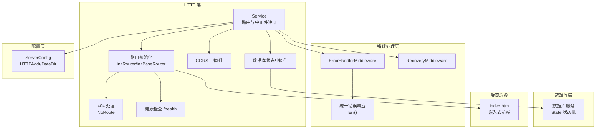
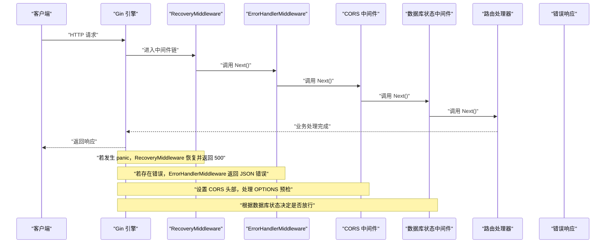
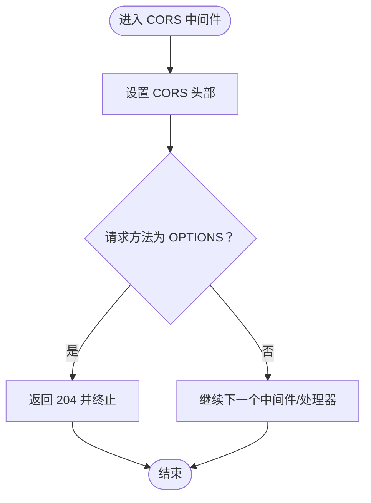
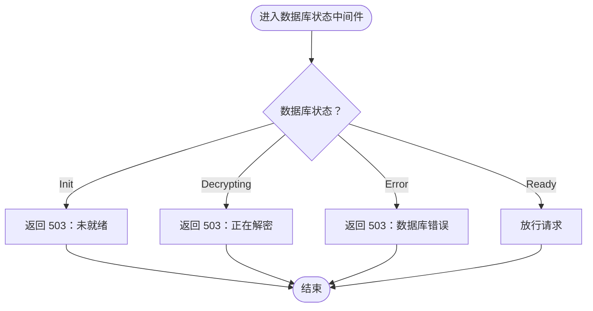
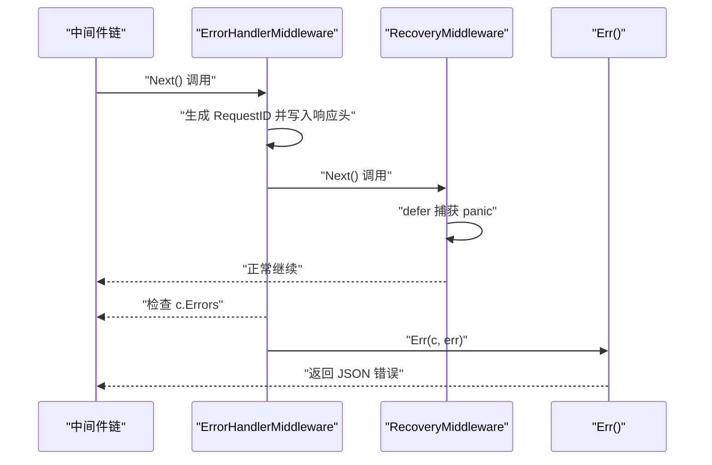
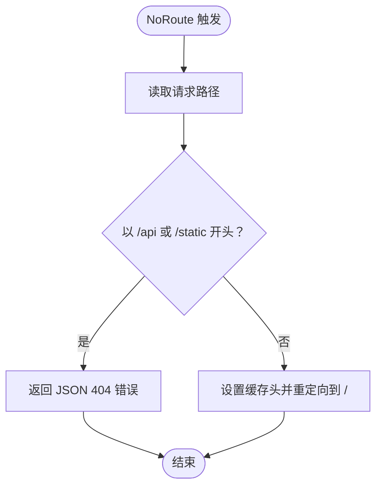
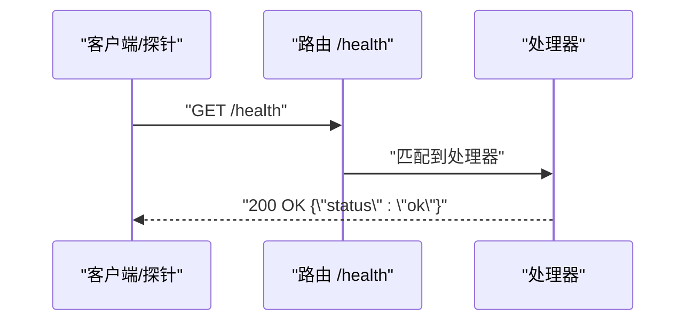
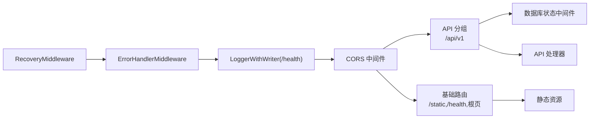

# 安全配置与中间件

<cite>
**本文引用的文件**
- [middleware.go](file://internal/chatlog/http/middleware.go)
- [service.go](file://internal/chatlog/http/service.go)
- [route.go](file://internal/chatlog/http/route.go)
- [errors.go](file://internal/errors/errors.go)
- [middleware.go](file://internal/errors/middleware.go)
- [server.go](file://internal/chatlog/conf/server.go)
- [service.go](file://internal/chatlog/database/service.go)
- [index.htm](file://internal/chatlog/http/static/index.htm)
</cite>

## 目录
1. [简介](#简介)
2. [项目结构](#项目结构)
3. [核心组件](#核心组件)
4. [架构总览](#架构总览)
5. [详细组件分析](#详细组件分析)
6. [依赖关系分析](#依赖关系分析)
7. [性能考量](#性能考量)
8. [故障排查指南](#故障排查指南)
9. [结论](#结论)
10. [附录](#附录)

## 简介
本文件聚焦于 HTTP API 的安全配置与中间件体系，涵盖以下主题：
- CORS 配置与跨域资源共享策略
- 访问控制中间件：数据库状态检查、请求验证与权限控制
- 404 错误处理：区分 API 请求与静态资源请求的不同处理方式
- 健康检查端点 /health 的用途与实现
- 安全最佳实践：输入验证、SQL 注入防护、XSS 防护等
- 安全配置示例与常见安全问题的解决方案

## 项目结构
围绕安全与中间件的关键目录与文件如下：
- HTTP 层：路由初始化、CORS 中间件、访问控制中间件、404 处理、健康检查端点
- 错误处理层：统一错误响应、panic 恢复、请求 ID 关联
- 数据库层：数据库状态机，供访问控制中间件使用
- 配置层：HTTP 地址、数据目录等基础配置
- 静态资源：嵌入式前端页面，包含 API 调试界面

图表来源
- [service.go](file://internal/chatlog/http/service.go#L33-L59)
- [route.go](file://internal/chatlog/http/route.go#L26-L45)
- [middleware.go](file://internal/chatlog/http/middleware.go#L10-L24)
- [middleware.go](file://internal/chatlog/http/middleware.go#L26-L45)
- [errors.go](file://internal/errors/errors.go#L113-L120)
- [middleware.go](file://internal/errors/middleware.go#L14-L36)
- [middleware.go](file://internal/errors/middleware.go#L39-L64)
- [server.go](file://internal/chatlog/conf/server.go#L51-L56)
- [service.go](file://internal/chatlog/database/service.go#L15-L29)
- [index.htm](file://internal/chatlog/http/static/index.htm#L1-L50)

章节来源
- [service.go](file://internal/chatlog/http/service.go#L33-L59)
- [route.go](file://internal/chatlog/http/route.go#L26-L45)
- [middleware.go](file://internal/chatlog/http/middleware.go#L10-L24)
- [middleware.go](file://internal/chatlog/http/middleware.go#L26-L45)
- [errors.go](file://internal/errors/errors.go#L113-L120)
- [middleware.go](file://internal/errors/middleware.go#L14-L36)
- [middleware.go](file://internal/errors/middleware.go#L39-L64)
- [server.go](file://internal/chatlog/conf/server.go#L51-L56)
- [service.go](file://internal/chatlog/database/service.go#L15-L29)
- [index.htm](file://internal/chatlog/http/static/index.htm#L1-L50)

## 核心组件
- CORS 中间件：设置跨域允许的来源、方法与头部，处理预检请求
- 数据库状态中间件：基于数据库状态机进行可用性检查，阻断不可用请求
- 统一错误处理中间件：生成请求 ID、捕获错误并返回标准化错误响应
- panic 恢复中间件：从异常中恢复，记录堆栈并返回 500
- 404 处理：对 API 与静态路径返回 JSON 错误；对其他路径重定向至根路径
- 健康检查端点：/health 提供服务可用性探测
- 配置：HTTP 地址、数据目录等基础配置

章节来源
- [middleware.go](file://internal/chatlog/http/middleware.go#L10-L24)
- [middleware.go](file://internal/chatlog/http/middleware.go#L26-L45)
- [middleware.go](file://internal/errors/middleware.go#L14-L36)
- [middleware.go](file://internal/errors/middleware.go#L39-L64)
- [route.go](file://internal/chatlog/http/route.go#L77-L88)
- [route.go](file://internal/chatlog/http/route.go#L40-L42)
- [server.go](file://internal/chatlog/conf/server.go#L51-L56)

## 架构总览
下图展示了安全相关中间件在请求生命周期中的作用顺序与交互关系。

图表来源
- [service.go](file://internal/chatlog/http/service.go#L42-L48)
- [middleware.go](file://internal/errors/middleware.go#L39-L64)
- [middleware.go](file://internal/errors/middleware.go#L14-L36)
- [middleware.go](file://internal/chatlog/http/middleware.go#L10-L24)
- [middleware.go](file://internal/chatlog/http/middleware.go#L26-L45)

## 详细组件分析

### CORS 配置与跨域资源共享
- 允许来源：通配符允许任意来源访问
- 允许方法：GET、POST、PUT、DELETE、OPTIONS
- 允许头部：Accept、Authorization、Content-Type、X-CSRF-Token
- 预检处理：对 OPTIONS 方法直接返回 204，避免重复逻辑

图表来源
- [middleware.go](file://internal/chatlog/http/middleware.go#L10-L24)

章节来源
- [middleware.go](file://internal/chatlog/http/middleware.go#L10-L24)

### 访问控制中间件：数据库状态检查
- 数据库状态机：
  - 初始化：StateInit
  - 解密中：StateDecrypting
  - 就绪：StateReady
  - 错误：StateError
- 中间件行为：
  - 若数据库处于初始化或解密中，返回 503 且终止请求
  - 若数据库处于错误状态，返回 503 并携带错误消息
  - 否则放行请求

图表来源
- [middleware.go](file://internal/chatlog/http/middleware.go#L26-L45)
- [service.go](file://internal/chatlog/database/service.go#L15-L29)

章节来源
- [middleware.go](file://internal/chatlog/http/middleware.go#L26-L45)
- [service.go](file://internal/chatlog/database/service.go#L15-L29)

### 统一错误处理与请求 ID 关联
- ErrorHandlerMiddleware：
  - 为每个请求生成唯一请求 ID 并写入响应头
  - 在中间件链尾部检查错误队列，若有错误则调用统一错误响应函数并终止
- RecoveryMiddleware：
  - 捕获 panic，构造内部错误并记录堆栈
  - 返回 500 错误并终止后续处理

图表来源
- [middleware.go](file://internal/errors/middleware.go#L14-L36)
- [middleware.go](file://internal/errors/middleware.go#L39-L64)
- [errors.go](file://internal/errors/errors.go#L113-L120)

章节来源
- [middleware.go](file://internal/errors/middleware.go#L14-L36)
- [middleware.go](file://internal/errors/middleware.go#L39-L64)
- [errors.go](file://internal/errors/errors.go#L113-L120)

### 404 错误处理：API 与静态资源区分
- 匹配规则：
  - 若路径以 /api 或 /static 开头：返回 JSON 错误（404）
  - 否则：设置缓存控制头并重定向到根路径 /
- 该策略确保 API 客户端收到结构化错误，而浏览器访问被引导回首页

图表来源
- [route.go](file://internal/chatlog/http/route.go#L77-L88)

章节来源
- [route.go](file://internal/chatlog/http/route.go#L77-L88)

### 健康检查端点 /health
- 实现：在基础路由中注册 GET /health，返回状态为 ok 的 JSON
- 用途：用于容器编排、负载均衡探活与运维监控

图表来源
- [route.go](file://internal/chatlog/http/route.go#L40-L42)

章节来源
- [route.go](file://internal/chatlog/http/route.go#L40-L42)

### 输入验证与安全防护要点
- 输入绑定与校验：
  - API 参数通过结构体绑定，随后进行范围与格式校验（如时间范围、limit/offset 边界）
  - 对非法参数返回标准化错误
- SQL 注入防护：
  - 采用参数化查询与安全的数据访问层（数据库服务封装），避免拼接 SQL 字符串
- XSS 防护：
  - 输出内容遵循最小暴露原则，必要时进行转义或使用安全的渲染方式
- 静态资源安全：
  - 静态文件通过嵌入式文件系统提供，避免直接暴露工作目录
  - 对媒体路径解析进行清理与白名单检查，防止路径穿越

章节来源
- [route.go](file://internal/chatlog/http/route.go#L90-L156)
- [route.go](file://internal/chatlog/http/route.go#L158-L201)
- [route.go](file://internal/chatlog/http/route.go#L203-L245)
- [route.go](file://internal/chatlog/http/route.go#L247-L293)
- [route.go](file://internal/chatlog/http/route.go#L341-L361)
- [route.go](file://internal/chatlog/http/route.go#L363-L384)
- [route.go](file://internal/chatlog/http/route.go#L386-L414)

## 依赖关系分析
- 中间件注册顺序：RecoveryMiddleware -> ErrorHandlerMiddleware -> Logger -> CORS
- 数据库状态中间件挂载在 API 分组上，仅影响 API 请求
- 错误处理与 CORS 作为全局中间件，贯穿所有请求
- 静态资源与健康检查在基础路由中定义，不受数据库状态中间件约束

图表来源
- [service.go](file://internal/chatlog/http/service.go#L42-L48)
- [route.go](file://internal/chatlog/http/route.go#L55-L63)
- [route.go](file://internal/chatlog/http/route.go#L33-L45)

章节来源
- [service.go](file://internal/chatlog/http/service.go#L42-L48)
- [route.go](file://internal/chatlog/http/route.go#L55-L63)
- [route.go](file://internal/chatlog/http/route.go#L33-L45)

## 性能考量
- 中间件链短小精干，避免在中间件中执行耗时操作
- 日志仅对 /health 特定端点启用，减少不必要的 IO
- CORS 预检快速返回，降低跨域请求延迟
- 数据库状态中间件仅做轻量判断，避免阻塞主流程

## 故障排查指南
- 503 数据库不可用：
  - 检查数据库状态机是否处于 Init/Decrypting/Error
  - 确认数据库服务已正确初始化与解密完成
- 404 API/静态资源错误：
  - 确认请求路径是否以 /api 或 /static 开头
  - 对于非 API/静态路径，确认是否期望被重定向到根路径
- 500 服务器错误：
  - 检查 RecoveryMiddleware 是否触发，查看日志中的堆栈
  - 确认 ErrorHandlerMiddleware 是否正确生成并返回请求 ID
- CORS 失败：
  - 检查浏览器开发者工具 Network 面板中的预检请求与响应头
  - 确认 Allow-Origin、Allow-Methods、Allow-Headers 是否满足前端请求

章节来源
- [middleware.go](file://internal/chatlog/http/middleware.go#L26-L45)
- [route.go](file://internal/chatlog/http/route.go#L77-L88)
- [middleware.go](file://internal/errors/middleware.go#L39-L64)
- [middleware.go](file://internal/errors/middleware.go#L14-L36)

## 结论
本项目通过明确的中间件分层与清晰的状态机设计，实现了：
- 跨域访问的最小授权与高效预检处理
- 基于数据库状态的访问控制，保障服务稳定性
- 统一错误处理与请求追踪，提升可观测性
- 区分 API 与静态资源的 404 处理策略，优化用户体验
- 健康检查端点便于自动化运维与监控

建议在生产环境中进一步强化：
- CORS 来源白名单与安全头部（如 CSP、X-Frame-Options、X-Content-Type-Options）
- 请求速率限制与认证授权机制
- 输入参数的更严格校验与参数化查询的全面应用
- 静态资源的缓存与安全头配置

## 附录

### 安全配置示例（概念性）
- CORS 来源白名单：仅允许受信域名，避免通配符
- 安全头部：
  - Content-Security-Policy：限制脚本与资源来源
  - X-Frame-Options：防止点击劫持
  - X-Content-Type-Options：阻止 MIME 类型嗅探
  - Referrer-Policy：控制 referrer 传递策略
- 认证与授权：在数据库状态中间件之上增加鉴权中间件，结合 JWT 或会话管理
- 速率限制：在路由前增加限流中间件，防止滥用

### 常见安全问题与解决方案
- SQL 注入：使用参数化查询与 ORM 封装，避免动态拼接 SQL
- XSS：对输出内容进行 HTML 转义，或使用安全的模板引擎
- 路径遍历：对文件路径进行清理与白名单校验，避免 ../ 等攻击
- 信息泄露：统一错误响应，隐藏内部堆栈细节，仅保留必要字段