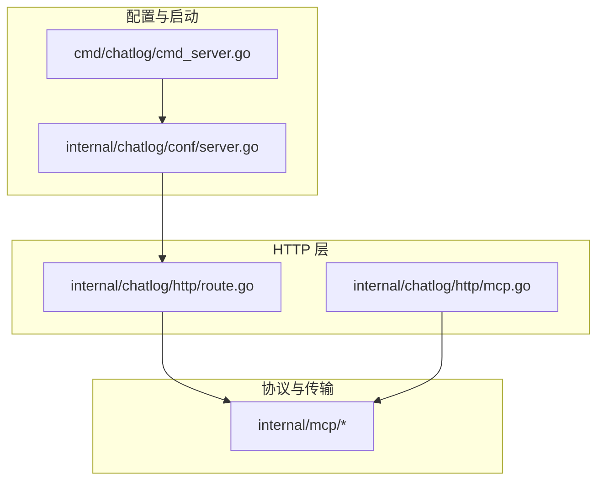
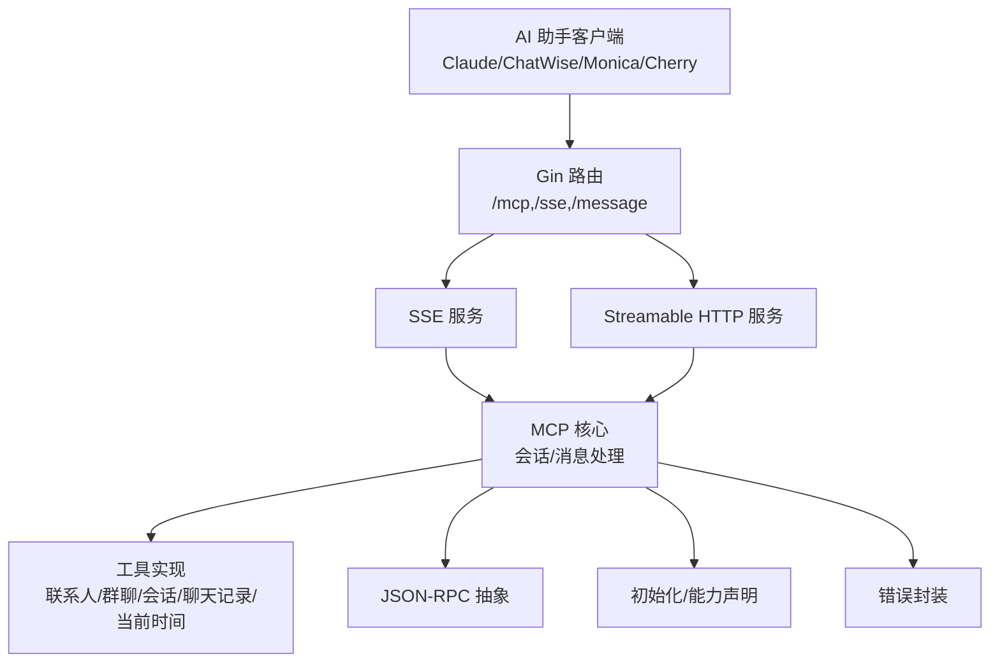
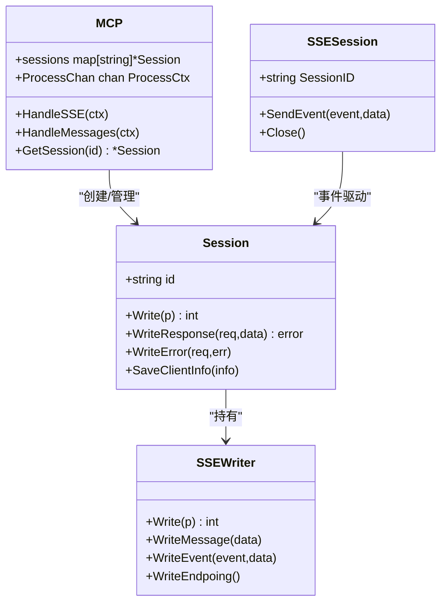
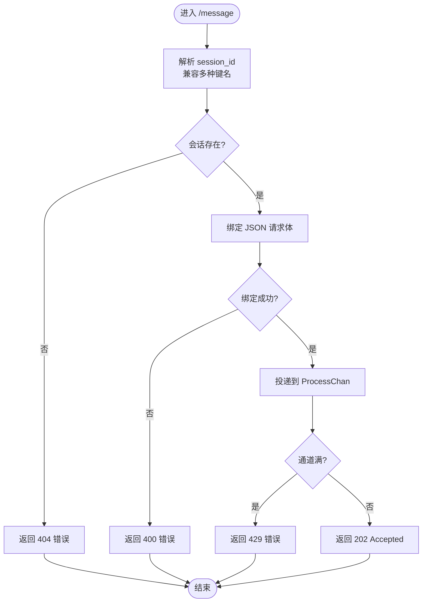
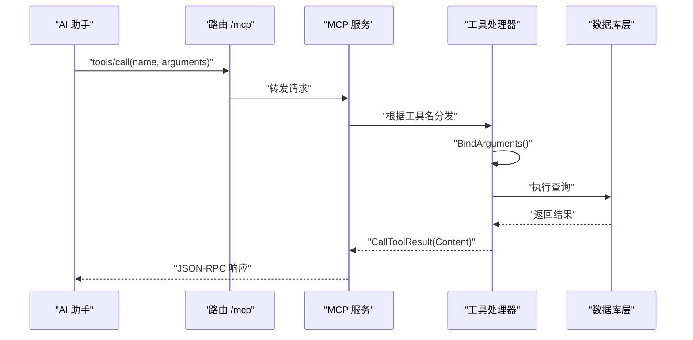
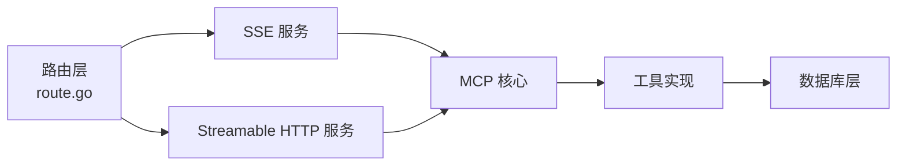

# MCP 协议集成

<cite>
**本文引用的文件**
- [docs/mcp.md](file://docs/mcp.md)
- [internal/mcp/mcp.go](file://internal/mcp/mcp.go)
- [internal/mcp/sse.go](file://internal/mcp/sse.go)
- [internal/mcp/session.go](file://internal/mcp/session.go)
- [internal/mcp/resource.go](file://internal/mcp/resource.go)
- [internal/mcp/tool.go](file://internal/mcp/tool.go)
- [internal/mcp/prompt.go](file://internal/mcp/prompt.go)
- [internal/mcp/jsonrpc.go](file://internal/mcp/jsonrpc.go)
- [internal/mcp/error.go](file://internal/mcp/error.go)
- [internal/mcp/initialize.go](file://internal/mcp/initialize.go)
- [internal/chatlog/http/mcp.go](file://internal/chatlog/http/mcp.go)
- [internal/chatlog/http/route.go](file://internal/chatlog/http/route.go)
- [internal/chatlog/conf/server.go](file://internal/chatlog/conf/server.go)
- [cmd/chatlog/cmd_server.go](file://cmd/chatlog/cmd_server.go)
- [internal/errors/mcp.go](file://internal/errors/mcp.go)
</cite>

## 目录
1. [简介](#简介)
2. [项目结构](#项目结构)
3. [核心组件](#核心组件)
4. [架构总览](#架构总览)
5. [组件详解](#组件详解)
6. [依赖关系分析](#依赖关系分析)
7. [性能考量](#性能考量)
8. [故障排除指南](#故障排除指南)
9. [结论](#结论)
10. [附录](#附录)

## 简介
本文件面向 Chatlog 的 MCP（Model Context Protocol）协议集成，系统性阐述协议基础、SSE 事件推送、会话管理、工具调用、资源与提示词管理等能力，并提供与 Claude Desktop、Monica Code、ChatWise、Cherry Studio 等主流 AI 助手的集成步骤与故障排除建议。读者无需深入底层实现细节亦可按图索骥完成配置与排障。

## 项目结构
Chatlog 的 MCP 集成主要分布在以下模块：
- 协议与传输层：MCP 核心类型、SSE 推送、JSON-RPC 抽象、初始化握手、错误定义
- HTTP 路由与服务：路由注册、SSE/Streamable HTTP 服务接入
- 工具与业务：联系人、群聊、最近会话、聊天记录、当前时间等工具实现
- 配置与启动：HTTP 地址默认值、命令行启动入口

图表来源
- [internal/chatlog/http/route.go](file://internal/chatlog/http/route.go#L65-L75)
- [internal/chatlog/http/mcp.go](file://internal/chatlog/http/mcp.go#L20-L29)
- [internal/mcp/mcp.go](file://internal/mcp/mcp.go#L1-L108)
- [internal/mcp/sse.go](file://internal/mcp/sse.go#L1-L161)
- [internal/mcp/jsonrpc.go](file://internal/mcp/jsonrpc.go#L1-L63)
- [internal/mcp/initialize.go](file://internal/mcp/initialize.go#L1-L79)
- [internal/mcp/error.go](file://internal/mcp/error.go#L1-L56)
- [internal/chatlog/conf/server.go](file://internal/chatlog/conf/server.go#L1-L61)
- [cmd/chatlog/cmd_server.go](file://cmd/chatlog/cmd_server.go#L35-L49)

章节来源
- [internal/chatlog/http/route.go](file://internal/chatlog/http/route.go#L65-L75)
- [internal/chatlog/http/mcp.go](file://internal/chatlog/http/mcp.go#L20-L29)
- [internal/chatlog/conf/server.go](file://internal/chatlog/conf/server.go#L3-L5)
- [cmd/chatlog/cmd_server.go](file://cmd/chatlog/cmd_server.go#L35-L49)

## 核心组件
- MCP 服务与会话管理：负责 SSE 会话生命周期、消息处理通道、会话表维护
- SSE 推送：SSEWriter/SSESession 实现事件推送、心跳 ping、endpoint 告知
- JSON-RPC 抽象：统一请求/响应/通知结构，错误封装
- 初始化与能力声明：initialize/ping、协议版本、能力字典
- 工具与调用：联系人/群聊/最近会话/聊天记录/当前时间等工具定义与实现
- 资源与提示词：资源清单/订阅/读取、模板、提示词列表/获取
- HTTP 路由：/mcp（Streamable HTTP）、/sse、/message（SSE）

章节来源
- [internal/mcp/mcp.go](file://internal/mcp/mcp.go#L17-L51)
- [internal/mcp/sse.go](file://internal/mcp/sse.go#L16-L96)
- [internal/mcp/jsonrpc.go](file://internal/mcp/jsonrpc.go#L17-L41)
- [internal/mcp/initialize.go](file://internal/mcp/initialize.go#L27-L71)
- [internal/mcp/tool.go](file://internal/mcp/tool.go#L88-L92)
- [internal/mcp/resource.go](file://internal/mcp/resource.go#L26-L31)
- [internal/mcp/prompt.go](file://internal/mcp/prompt.go#L24-L28)
- [internal/chatlog/http/route.go](file://internal/chatlog/http/route.go#L65-L75)

## 架构总览
MCP 集成采用“HTTP 路由 -> MCP 服务 -> 工具实现”的分层设计。SSE 与 Streamable HTTP 两种传输同时提供，满足不同客户端需求；会话通过 UUID 建立，消息通过通道异步处理。

图表来源
- [internal/chatlog/http/route.go](file://internal/chatlog/http/route.go#L65-L75)
- [internal/mcp/mcp.go](file://internal/mcp/mcp.go#L31-L98)
- [internal/mcp/sse.go](file://internal/mcp/sse.go#L21-L76)
- [internal/chatlog/http/mcp.go](file://internal/chatlog/http/mcp.go#L20-L29)
- [internal/mcp/jsonrpc.go](file://internal/mcp/jsonrpc.go#L17-L41)
- [internal/mcp/initialize.go](file://internal/mcp/initialize.go#L27-L71)
- [internal/mcp/error.go](file://internal/mcp/error.go#L39-L44)

## 组件详解

### 会话与 SSE 推送
- SSEWriter：设置标准响应头、持续连接、发送 message/endpoint/ping 事件
- SSESession：封装事件通道与停止信号，维持会话状态
- Session：包装 Writer，提供统一写入接口与错误/响应序列化
- HandleSSE：为每个 SSE 连接生成唯一会话 ID，挂载到会话表，连接断开时清理

图表来源
- [internal/mcp/session.go](file://internal/mcp/session.go#L10-L49)
- [internal/mcp/sse.go](file://internal/mcp/sse.go#L16-L96)
- [internal/mcp/mcp.go](file://internal/mcp/mcp.go#L17-L51)

章节来源
- [internal/mcp/sse.go](file://internal/mcp/sse.go#L21-L76)
- [internal/mcp/session.go](file://internal/mcp/session.go#L16-L49)
- [internal/mcp/mcp.go](file://internal/mcp/mcp.go#L31-L51)

### 消息处理与队列
- HandleMessages：解析 session_id（兼容多种命名），校验会话存在性，绑定请求体，投递到 ProcessChan；超载时返回限流错误
- ProcessCtx：承载 Session 与 Request，作为处理单元
- NewMCP：初始化会话表与处理通道，具备背压保护

图表来源
- [internal/mcp/mcp.go](file://internal/mcp/mcp.go#L53-L98)
- [internal/mcp/error.go](file://internal/mcp/error.go#L30-L33)

章节来源
- [internal/mcp/mcp.go](file://internal/mcp/mcp.go#L53-L98)
- [internal/mcp/error.go](file://internal/mcp/error.go#L30-L33)

### 工具调用与实现
- 工具注册：在 HTTP 服务初始化阶段注册 Contact/ChatRoom/RecentChat/ChatLog/CurrentTime 等工具
- 参数与约束：工具参数通过 JSON Schema 定义，包含必填项、类型与描述
- 工具实现：绑定参数、调用数据库层查询、构造 CallToolResult（文本内容），错误通过 ErrMCPTool 包装

图表来源
- [internal/chatlog/http/mcp.go](file://internal/chatlog/http/mcp.go#L20-L29)
- [internal/chatlog/http/mcp.go](file://internal/chatlog/http/mcp.go#L163-L189)
- [internal/chatlog/http/mcp.go](file://internal/chatlog/http/mcp.go#L271-L317)
- [internal/errors/mcp.go](file://internal/errors/mcp.go#L5-L15)

章节来源
- [internal/chatlog/http/mcp.go](file://internal/chatlog/http/mcp.go#L31-L155)
- [internal/chatlog/http/mcp.go](file://internal/chatlog/http/mcp.go#L163-L328)
- [internal/errors/mcp.go](file://internal/errors/mcp.go#L5-L15)

### 资源与提示词
- 资源：定义资源/模板/读取请求与响应结构，支持订阅/取消订阅与变更通知
- 提示词：定义提示词列表/获取请求与响应结构，支持参数化消息构造

章节来源
- [internal/mcp/resource.go](file://internal/mcp/resource.go#L26-L74)
- [internal/mcp/prompt.go](file://internal/mcp/prompt.go#L24-L103)

### 初始化与能力声明
- initialize：客户端发起，携带 protocolVersion、capabilities、clientInfo
- initialize 响应：返回 serverInfo 与 capabilities 字典
- 默认能力：声明 prompts/resources/tools/capabilities 的支持情况

章节来源
- [internal/mcp/initialize.go](file://internal/mcp/initialize.go#L27-L79)

### JSON-RPC 抽象与错误
- Request/Response/Notification：统一 JSON-RPC 结构
- 错误封装：标准码与扩展码，统一 JsonRPC() 输出

章节来源
- [internal/mcp/jsonrpc.go](file://internal/mcp/jsonrpc.go#L17-L62)
- [internal/mcp/error.go](file://internal/mcp/error.go#L16-L56)

## 依赖关系分析
- 路由层依赖 MCP 服务：/mcp 与 /sse 路由将请求交由对应服务处理
- 工具层依赖数据库层：工具实现通过 Service 访问数据库接口
- 会话层依赖路由层：SSE 会话通过 Gin 上下文建立与维护

图表来源
- [internal/chatlog/http/route.go](file://internal/chatlog/http/route.go#L65-L75)
- [internal/chatlog/http/mcp.go](file://internal/chatlog/http/mcp.go#L20-L29)
- [internal/mcp/mcp.go](file://internal/mcp/mcp.go#L17-L51)

章节来源
- [internal/chatlog/http/route.go](file://internal/chatlog/http/route.go#L65-L75)
- [internal/chatlog/http/mcp.go](file://internal/chatlog/http/mcp.go#L20-L29)

## 性能考量
- 通道容量与背压：ProcessChan 容量限制避免过载，超载返回 429
- SSE 心跳：定时 ping 保持长连接活跃，降低中间设备断连风险
- 事件推送：SSEWriter 批量 flush，减少系统调用次数
- 工具实现：参数绑定与数据库查询需注意边界条件与分页参数

章节来源
- [internal/mcp/mcp.go](file://internal/mcp/mcp.go#L13-L28)
- [internal/mcp/sse.go](file://internal/mcp/sse.go#L52-L76)
- [internal/chatlog/http/mcp.go](file://internal/chatlog/http/mcp.go#L271-L317)

## 故障排除指南
- 无法连接 SSE：确认服务监听地址与端口，默认地址见配置
- 400/404/429 错误：检查 session_id 传参、会话是否存在、请求体格式、通道是否过载
- 工具调用失败：查看工具参数绑定与数据库查询日志，错误将以文本形式返回
- 不支持 SSE 的客户端：使用 mcp-proxy 将 stdio 转换为 SSE

章节来源
- [internal/chatlog/conf/server.go](file://internal/chatlog/conf/server.go#L3-L5)
- [internal/mcp/mcp.go](file://internal/mcp/mcp.go#L53-L98)
- [internal/errors/mcp.go](file://internal/errors/mcp.go#L5-L15)
- [docs/mcp.md](file://docs/mcp.md#L18-L31)

## 结论
Chatlog 的 MCP 集成以清晰的分层架构实现了 SSE 与 Streamable HTTP 两种传输模式，配合完善的会话管理、工具调用与错误处理，能够稳定地为多种 AI 助手提供联系人、群聊、会话与聊天记录等能力。通过本文档的配置步骤与排障建议，可快速完成与主流客户端的对接。

## 附录

### 与主流 AI 助手的集成步骤
- ChatWise：使用 MCP SSE，URL 填写 http://127.0.0.1:5030/sse，Pro 权限可用
- Cherry Studio：添加 MCP 服务器，类型选择 SSE，URL 填写 http://127.0.0.1:5030/sse
- Claude Desktop：使用 mcp-proxy，配置 claude_desktop_config.json 的 mcpServers
- Monica Code：在 VS Code 扩展配置中设置 transport 为 stdio，命令指向 mcp-proxy，参数为 http://127.0.0.1:5030/sse

章节来源
- [docs/mcp.md](file://docs/mcp.md#L33-L151)

### 启动与配置
- 默认 HTTP 地址：0.0.0.0:5030
- 命令行启动：server 子命令支持 addr、data-dir、data-key、img-key、work-dir、platform、version、auto-decrypt 等参数

章节来源
- [internal/chatlog/conf/server.go](file://internal/chatlog/conf/server.go#L3-L5)
- [cmd/chatlog/cmd_server.go](file://cmd/chatlog/cmd_server.go#L35-L79)