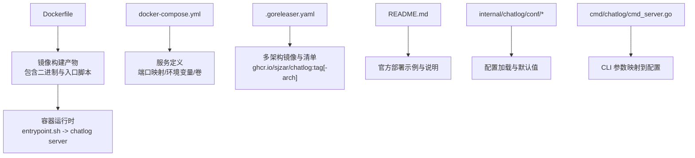
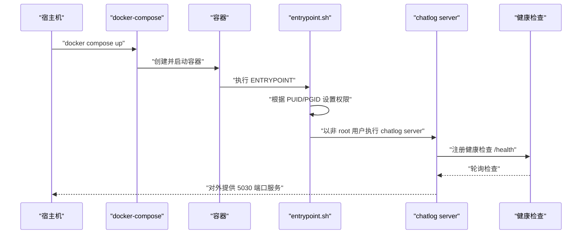
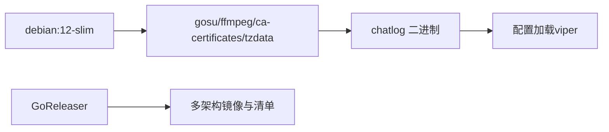

# Docker 部署

<cite>
**本文引用的文件**
- [Dockerfile](file://Dockerfile)
- [docker-compose.yml](file://docker-compose.yml)
- [script/docker-entrypoint.sh](file://script/docker-entrypoint.sh)
- [.goreleaser.yaml](file://.goreleaser.yaml)
- [README.md](file://README.md)
- [internal/chatlog/conf/conf.go](file://internal/chatlog/conf/conf.go)
- [internal/chatlog/conf/server.go](file://internal/chatlog/conf/server.go)
- [cmd/chatlog/cmd_server.go](file://cmd/chatlog/cmd_server.go)
</cite>

## 目录
1. [简介](#简介)
2. [项目结构](#项目结构)
3. [核心组件](#核心组件)
4. [架构总览](#架构总览)
5. [详细组件分析](#详细组件分析)
6. [依赖关系分析](#依赖关系分析)
7. [性能与资源建议](#性能与资源建议)
8. [故障排查指南](#故障排查指南)
9. [结论](#结论)
10. [附录](#附录)

## 简介
本指南面向希望在生产环境中使用 Docker 部署 Chatlog 的用户，覆盖镜像来源、容器运行参数、数据卷挂载、网络与端口映射、健康检查、以及生产最佳实践与安全注意事项。文档同时提供 docker run 与 docker-compose 的完整示例与参数说明，并给出常见问题的排查思路。

## 项目结构
与 Docker 部署相关的关键文件与职责如下：
- Dockerfile：定义基础镜像、环境变量、暴露端口、健康检查与入口点。
- script/docker-entrypoint.sh：容器启动时的初始化脚本，负责权限修正与以非 root 用户执行。
- docker-compose.yml：Compose 文件，定义服务、端口映射、环境变量与数据卷。
- .goreleaser.yaml：CI/CD 构建与镜像发布配置，包含 Docker 镜像模板与多架构清单。
- README.md：官方文档中的 Docker 部署章节，提供镜像拉取与运行示例。
- internal/chatlog/conf/conf.go 与 internal/chatlog/conf/server.go：服务配置加载与默认值，决定环境变量与配置项的映射。
- cmd/chatlog/cmd_server.go：命令行参数与 server 子命令的实现，用于理解 CLI 选项如何映射到配置。

图表来源
- [Dockerfile](file://Dockerfile#L1-L45)
- [docker-compose.yml](file://docker-compose.yml#L1-L39)
- [.goreleaser.yaml](file://.goreleaser.yaml#L92-L159)
- [README.md](file://README.md#L93-L134)
- [internal/chatlog/conf/conf.go](file://internal/chatlog/conf/conf.go#L12-L17)
- [internal/chatlog/conf/server.go](file://internal/chatlog/conf/server.go#L3-L5)
- [cmd/chatlog/cmd_server.go](file://cmd/chatlog/cmd_server.go#L10-L22)

章节来源
- [Dockerfile](file://Dockerfile#L1-L45)
- [docker-compose.yml](file://docker-compose.yml#L1-L39)
- [.goreleaser.yaml](file://.goreleaser.yaml#L92-L159)
- [README.md](file://README.md#L93-L134)
- [internal/chatlog/conf/conf.go](file://internal/chatlog/conf/conf.go#L12-L17)
- [internal/chatlog/conf/server.go](file://internal/chatlog/conf/server.go#L3-L5)
- [cmd/chatlog/cmd_server.go](file://cmd/chatlog/cmd_server.go#L10-L22)

## 核心组件
- 基础镜像与用户
  - 基于 Debian slim，设置 PUID/PGID 环境变量，默认以非 root 用户运行，入口脚本会在容器内将指定目录的属主改为 PUID:PGID，再以 gosu 切换执行。
- 二进制与入口
  - 容器内包含 chatlog 二进制与 ffmpeg，入口为 entrypoint.sh，最终执行 chatlog server。
- 端口与健康检查
  - 默认监听 0.0.0.0:5030，健康检查通过访问 /health。
- 环境变量与配置
  - 通过环境变量 CHATLOG_* 控制服务行为；配置加载优先级与默认值由配置模块决定。
- 数据卷
  - /app/data：微信本地数据目录（必须挂载）
  - /app/work：工作目录（可选持久化卷）

章节来源
- [Dockerfile](file://Dockerfile#L7-L38)
- [script/docker-entrypoint.sh](file://script/docker-entrypoint.sh#L6-L20)
- [Dockerfile](file://Dockerfile#L33-L41)
- [internal/chatlog/conf/server.go](file://internal/chatlog/conf/server.go#L3-L5)
- [internal/chatlog/conf/conf.go](file://internal/chatlog/conf/conf.go#L12-L17)

## 架构总览
下图展示容器启动到服务可用的关键流程与组件交互。

图表来源
- [Dockerfile](file://Dockerfile#L43-L45)
- [script/docker-entrypoint.sh](file://script/docker-entrypoint.sh#L6-L20)
- [Dockerfile](file://Dockerfile#L40-L41)
- [internal/chatlog/conf/server.go](file://internal/chatlog/conf/server.go#L3-L5)

## 详细组件分析

### 镜像来源与多架构支持
- 官方镜像仓库
  - Docker Hub：https://hub.docker.com/r/sjzar/chatlog
  - GitHub Container Registry：https://ghcr.io/sjzar/chatlog
- 多架构镜像
  - 通过 GoReleaser 配置生成 amd64 与 arm64 两套镜像，并合并为同一标签的多架构清单，便于跨平台部署。
- 最新标签
  - ghcr.io/sjzar/chatlog:latest 与 sjzar/chatlog:latest 均指向最新稳定版本。

章节来源
- [README.md](file://README.md#L112-L124)
- [.goreleaser.yaml](file://.goreleaser.yaml#L135-L159)

### 容器运行参数与环境变量
- 端口映射
  - 默认暴露 5030 端口，可通过 -p 映射到宿主机任意端口。
- 环境变量
  - CHATLOG_DATA_DIR：微信数据目录（必填，需挂载）
  - CHATLOG_WORK_DIR：工作目录（可选，建议持久化）
  - CHATLOG_HTTP_ADDR：服务监听地址（默认 0.0.0.0:5030）
  - CHATLOG_PLATFORM、CHATLOG_VERSION、CHATLOG_DATA_KEY、CHATLOG_IMG_KEY、CHATLOG_AUTO_DECRYPT：平台、版本与密钥相关配置
  - TZ：时区（建议设置）
- 用户与权限
  - PUID/PGID：容器内非 root 用户的 UID/GID，默认 1000:1000
  - UMASK：可选，用于设置文件掩码

章节来源
- [Dockerfile](file://Dockerfile#L7-L38)
- [docker-compose.yml](file://docker-compose.yml#L11-L28)
- [internal/chatlog/conf/server.go](file://internal/chatlog/conf/server.go#L3-L5)
- [internal/chatlog/conf/conf.go](file://internal/chatlog/conf/conf.go#L12-L17)
- [script/docker-entrypoint.sh](file://script/docker-entrypoint.sh#L4-L5)

### 数据卷挂载方案
- /app/data（必需）
  - 挂载微信本地数据目录，容器内读取该目录以进行解密与查询。
- /app/work（可选但推荐）
  - 挂载工作目录，用于存放解密后的数据库文件，便于持久化与缓存。
- 建议
  - 使用命名卷或本地目录映射，确保数据在容器重建后仍可保留。
  - 若使用本地目录映射，注意宿主机路径权限与 SELinux/AppArmor 策略。

章节来源
- [docker-compose.yml](file://docker-compose.yml#L29-L35)
- [Dockerfile](file://Dockerfile#L17-L18)

### docker run 完整示例与参数说明
- 基本运行
  - 使用官方镜像，映射 5030 端口，挂载微信数据目录，设置时区与数据/工作目录。
- 关键参数
  - -d：后台运行
  - --name：容器名称
  - -p：端口映射（宿主机:容器）
  - -v：数据卷挂载（宿主机路径:容器路径）
  - -e：环境变量（TZ、CHATLOG_*）
  - --user：可选，指定 PUID:PGID
  - --umask：可选，设置文件掩码
- 健康检查
  - 容器内置健康检查，通过访问 http://localhost:5030/health 判断服务状态。

章节来源
- [README.md](file://README.md#L126-L134)
- [Dockerfile](file://Dockerfile#L40-L41)
- [docker-compose.yml](file://docker-compose.yml#L7-L10)

### docker-compose.yml 配置详解
- 服务定义
  - image：使用官方镜像标签（latest）
  - restart：unless-stopped，容器异常退出时自动重启
  - ports：将宿主机 5030 映射到容器 5030
  - environment：设置时区与关键环境变量（数据/工作目录等）
  - volumes：挂载微信数据目录与工作目录卷
- 卷定义
  - work-dir：命名卷，确保工作目录持久化

章节来源
- [docker-compose.yml](file://docker-compose.yml#L1-L39)

### 配置加载与 CLI 映射
- 环境变量前缀
  - 服务配置通过 CHATLOG_* 环境变量加载，前缀由配置模块定义。
- 默认值与回退
  - 未设置时，HTTP 监听地址默认 0.0.0.0:5030。
- CLI 选项映射
  - server 子命令支持 addr、platform、version、data-dir、data-key、img-key、work-dir、auto-decrypt 等参数，这些参数会被转换为配置项传入服务。

章节来源
- [internal/chatlog/conf/conf.go](file://internal/chatlog/conf/conf.go#L12-L17)
- [internal/chatlog/conf/server.go](file://internal/chatlog/conf/server.go#L3-L5)
- [cmd/chatlog/cmd_server.go](file://cmd/chatlog/cmd_server.go#L10-L22)

### 入口脚本与权限控制
- 权限修正
  - 当容器以 root 运行时，脚本会将 /app 与 /usr/local/bin 目录属主改为 PUID:PGID。
- 切换用户
  - 使用 gosu 切换到指定用户后执行传入的命令（chatlog server）。
- 掩码设置
  - 可通过 UMASK 环境变量调整新建文件的权限掩码。

章节来源
- [script/docker-entrypoint.sh](file://script/docker-entrypoint.sh#L6-L20)

## 依赖关系分析
- 容器层依赖
  - 基础镜像：debian:12-slim
  - 工具链：gosu、ffmpeg、ca-certificates、tzdata
- 应用层依赖
  - chatlog 二进制：通过 Dockerfile COPY 进入镜像
  - 配置模块：通过 viper 加载环境变量与配置文件
- CI/CD 依赖
  - GoReleaser：生成多架构镜像与清单

图表来源
- [Dockerfile](file://Dockerfile#L1-L19)
- [.goreleaser.yaml](file://.goreleaser.yaml#L92-L159)

章节来源
- [Dockerfile](file://Dockerfile#L1-L19)
- [.goreleaser.yaml](file://.goreleaser.yaml#L92-L159)

## 性能与资源建议
- CPU 与内存
  - 解密与多媒体处理可能占用较多 CPU，建议在具备足够 CPU 核心与内存的宿主机上运行。
- 存储
  - 微信数据与解密后的数据库体积较大，建议挂载高性能磁盘并预留充足空间。
- 端口与网络
  - 默认监听 0.0.0.0:5030，若仅内网使用，可限制绑定地址为 127.0.0.1 并通过反向代理暴露。
- 健康检查
  - 健康检查间隔与超时已在镜像中配置，建议结合日志与监控系统观察服务状态。

[本节为通用建议，无需特定文件引用]

## 故障排查指南
- 无法访问服务
  - 检查端口映射是否正确，确认宿主机防火墙放行映射端口。
  - 确认容器健康检查通过，访问 /health。
- 数据目录为空
  - 确认 /app/data 已正确挂载微信数据目录，且容器内可见。
  - 检查 PUID/PGID 与宿主机目录权限，避免权限不足导致读取失败。
- 无法获取密钥或解密失败
  - Docker 环境下不支持密钥获取流程，需在宿主机提前获取密钥并以环境变量注入。
- 日志与诊断
  - 查看容器日志，关注配置加载与启动阶段输出。
  - 如需调试，可临时启用 debug 模式（server 子命令支持 --debug）。

章节来源
- [Dockerfile](file://Dockerfile#L40-L41)
- [docker-compose.yml](file://docker-compose.yml#L7-L10)
- [README.md](file://README.md#L95-L97)

## 结论
通过官方提供的 Docker 镜像与 Compose 文件，用户可以在多种平台上快速部署 Chatlog。建议在生产环境中合理规划数据卷、网络与安全策略，并结合健康检查与日志监控保障服务稳定性。对于需要密钥获取的场景，应在宿主机完成密钥采集后再以环境变量注入容器。

[本节为总结性内容，无需特定文件引用]

## 附录

### A. docker run 完整命令示例（不含具体路径）
- 拉取镜像
  - docker pull ghcr.io/sjzar/chatlog:latest
  - 或 docker pull sjzar/chatlog:latest
- 运行容器
  - docker run -d \
    --name chatlog \
    -p 5030:5030 \
    -v /path/to/your/wechat/data:/app/data \
    -v work-dir:/app/work \
    -e TZ=Asia/Shanghai \
    -e CHATLOG_DATA_DIR=/app/data \
    -e CHATLOG_WORK_DIR=/app/work \
    -e CHATLOG_HTTP_ADDR=0.0.0.0:5030 \
    --user 1000:1000 \
    --umask 022 \
    ghcr.io/sjzar/chatlog:latest

章节来源
- [README.md](file://README.md#L117-L134)
- [docker-compose.yml](file://docker-compose.yml#L5-L35)
- [Dockerfile](file://Dockerfile#L7-L38)

### B. docker-compose.yml 使用说明
- 启动
  - docker compose up -d
- 停止与清理
  - docker compose down
- 查看日志
  - docker compose logs -f

章节来源
- [docker-compose.yml](file://docker-compose.yml#L1-L39)

### C. 环境变量与配置项对照表
- CHATLOG_DATA_DIR：微信数据目录（必填）
- CHATLOG_WORK_DIR：工作目录（可选）
- CHATLOG_HTTP_ADDR：服务监听地址（默认 0.0.0.0:5030）
- CHATLOG_PLATFORM：平台类型（windows/darwin）
- CHATLOG_VERSION：微信版本（3/4）
- CHATLOG_DATA_KEY：数据密钥
- CHATLOG_IMG_KEY：图片密钥
- CHATLOG_AUTO_DECRYPT：自动解密开关
- TZ：时区
- PUID/PGID：容器内用户与组 ID
- UMASK：文件掩码

章节来源
- [internal/chatlog/conf/server.go](file://internal/chatlog/conf/server.go#L7-L18)
- [internal/chatlog/conf/conf.go](file://internal/chatlog/conf/conf.go#L12-L17)
- [Dockerfile](file://Dockerfile#L7-L38)