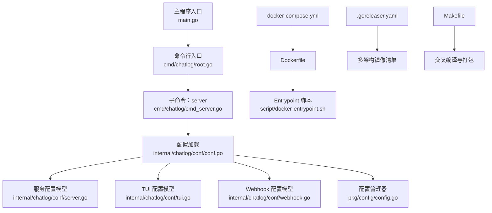
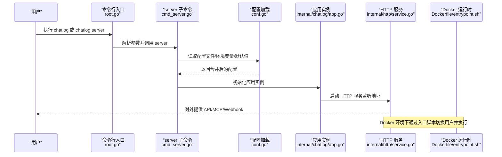
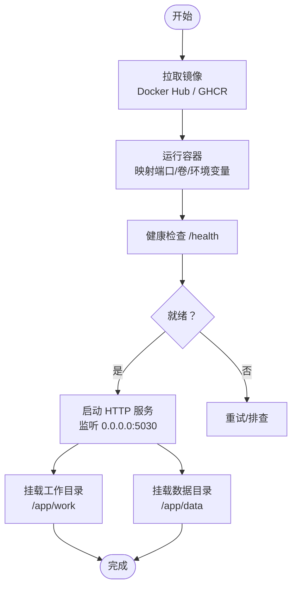
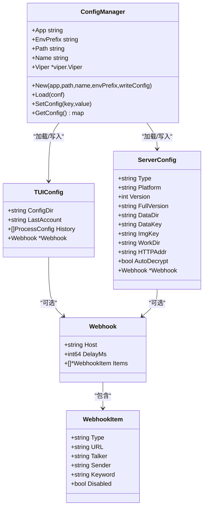
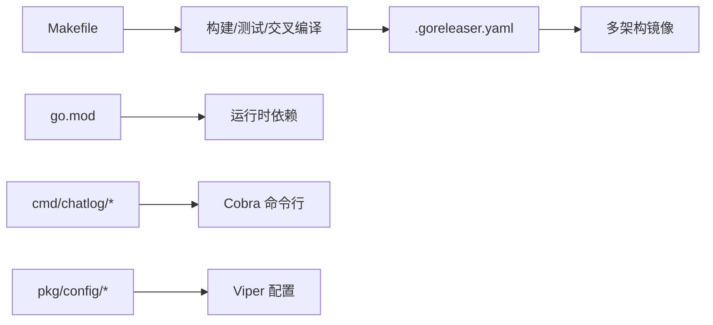

# 安装与部署

<cite>
**本文引用的文件**
- [README.md](file://README.md)
- [Dockerfile](file://Dockerfile)
- [docker-compose.yml](file://docker-compose.yml)
- [.goreleaser.yaml](file://.goreleaser.yaml)
- [Makefile](file://Makefile)
- [go.mod](file://go.mod)
- [script/docker-entrypoint.sh](file://script/docker-entrypoint.sh)
- [cmd/chatlog/root.go](file://cmd/chatlog/root.go)
- [cmd/chatlog/cmd_server.go](file://cmd/chatlog/cmd_server.go)
- [internal/chatlog/conf/conf.go](file://internal/chatlog/conf/conf.go)
- [internal/chatlog/conf/server.go](file://internal/chatlog/conf/server.go)
- [internal/chatlog/conf/tui.go](file://internal/chatlog/conf/tui.go)
- [internal/chatlog/conf/webhook.go](file://internal/chatlog/conf/webhook.go)
- [pkg/config/config.go](file://pkg/config/config.go)
</cite>

## 目录
1. [简介](#简介)
2. [项目结构](#项目结构)
3. [核心组件](#核心组件)
4. [架构总览](#架构总览)
5. [详细组件分析](#详细组件分析)
6. [依赖分析](#依赖分析)
7. [性能考虑](#性能考虑)
8. [故障排查指南](#故障排查指南)
9. [结论](#结论)
10. [附录](#附录)

## 简介
本指南面向希望在本地或生产环境中安装与部署 Chatlog 的用户，覆盖从源码编译安装、下载预编译版本安装、以及 Docker 部署的完整流程；并说明系统要求（Go 环境、C 编译环境、平台依赖）、环境变量与配置文件位置、权限设置、以及生产环境最佳实践与性能优化建议。

## 项目结构
- 顶层入口与构建：主程序入口位于 main.go，命令行子命令由 cmd/chatlog/* 定义；构建与交叉编译由 Makefile 统一管理。
- 配置体系：通过 pkg/config 与 internal/chatlog/conf 实现配置加载、环境变量映射与默认值设定。
- Docker 部署：Dockerfile 定义基础镜像、运行用户、暴露端口、健康检查与入口脚本；docker-compose.yml 提供一键编排示例。
- 发布与打包：.goreleaser.yaml 配置跨平台二进制产物、压缩与多架构 Docker 镜像清单。

图表来源
- [cmd/chatlog/root.go](file://cmd/chatlog/root.go#L1-L43)
- [cmd/chatlog/cmd_server.go](file://cmd/chatlog/cmd_server.go#L1-L79)
- [internal/chatlog/conf/conf.go](file://internal/chatlog/conf/conf.go#L1-L106)
- [internal/chatlog/conf/server.go](file://internal/chatlog/conf/server.go#L1-L61)
- [internal/chatlog/conf/tui.go](file://internal/chatlog/conf/tui.go#L1-L41)
- [internal/chatlog/conf/webhook.go](file://internal/chatlog/conf/webhook.go#L1-L17)
- [pkg/config/config.go](file://pkg/config/config.go#L1-L160)
- [Dockerfile](file://Dockerfile#L1-L45)
- [docker-compose.yml](file://docker-compose.yml#L1-L39)
- [.goreleaser.yaml](file://.goreleaser.yaml#L1-L159)
- [Makefile](file://Makefile#L1-L60)

章节来源
- [README.md](file://README.md#L48-L125)
- [Dockerfile](file://Dockerfile#L1-L45)
- [docker-compose.yml](file://docker-compose.yml#L1-L39)
- [.goreleaser.yaml](file://.goreleaser.yaml#L92-L159)
- [Makefile](file://Makefile#L1-L60)

## 核心组件
- 命令行入口与子命令
  - 根命令负责初始化日志与 TUI 日志钩子，执行主应用实例。
  - 子命令 server 用于启动 HTTP 服务，支持通过命令行参数覆盖配置。
- 配置系统
  - 通过 pkg/config.Manager 统一加载 JSON 配置文件、环境变量与默认值；支持写回配置（可选）。
  - 内部配置模块提供服务配置与 TUI 配置模型，以及 Webhook 结构体。
- Docker 部署
  - Dockerfile 定义非 root 用户运行、数据与工作目录、暴露端口、健康检查与入口脚本。
  - docker-compose.yml 提供端口映射、环境变量与卷挂载示例。

章节来源
- [cmd/chatlog/root.go](file://cmd/chatlog/root.go#L1-L43)
- [cmd/chatlog/cmd_server.go](file://cmd/chatlog/cmd_server.go#L1-L79)
- [pkg/config/config.go](file://pkg/config/config.go#L1-L160)
- [internal/chatlog/conf/conf.go](file://internal/chatlog/conf/conf.go#L1-L106)
- [internal/chatlog/conf/server.go](file://internal/chatlog/conf/server.go#L1-L61)
- [internal/chatlog/conf/tui.go](file://internal/chatlog/conf/tui.go#L1-L41)
- [internal/chatlog/conf/webhook.go](file://internal/chatlog/conf/webhook.go#L1-L17)
- [Dockerfile](file://Dockerfile#L1-L45)
- [docker-compose.yml](file://docker-compose.yml#L1-L39)

## 架构总览
下图展示从命令行到服务启动、配置加载与 Docker 运行的整体流程。

图表来源
- [cmd/chatlog/root.go](file://cmd/chatlog/root.go#L1-L43)
- [cmd/chatlog/cmd_server.go](file://cmd/chatlog/cmd_server.go#L1-L79)
- [internal/chatlog/conf/conf.go](file://internal/chatlog/conf/conf.go#L1-L106)
- [Dockerfile](file://Dockerfile#L1-L45)
- [script/docker-entrypoint.sh](file://script/docker-entrypoint.sh#L1-L21)

## 详细组件分析

### 从源码编译安装
- 系统要求
  - Go 版本：项目 go.mod 指定 1.24.0。
  - C 编译环境：构建配置与发布配置均启用 CGO（CGO_ENABLED=1），部分功能依赖 cgo。
- 编译方式
  - 使用 Makefile 构建当前平台二进制；也可直接 go build。
  - 交叉编译：Makefile 提供多平台构建目标，.goreleaser.yaml 配置多架构 Docker 镜像。
- 关键路径
  - 构建入口：main.go
  - Makefile 目标：build、crossbuild、upx（可选）
  - 发布配置：.goreleaser.yaml

章节来源
- [go.mod](file://go.mod#L1-L82)
- [Makefile](file://Makefile#L1-L60)
- [.goreleaser.yaml](file://.goreleaser.yaml#L8-L66)

### 下载预编译版本安装
- 适用场景：无需本地编译，直接使用官方发布的二进制包。
- 获取方式：访问 Releases 页面下载对应平台与架构的压缩包。
- 注意事项：若需使用特定功能（如 cgo 依赖），请确认系统满足编译要求或优先选择预编译版本。

章节来源
- [README.md](file://README.md#L58-L61)

### Docker 部署
- 镜像拉取
  - 支持 Docker Hub 与 GitHub Container Registry（GHCR）两种镜像源。
  - 镜像标签：latest 与带版本号的标签；.goreleaser.yaml 生成多架构清单。
- 容器运行
  - 默认暴露端口 5030；通过 -p 映射主机端口。
  - 数据目录与工作目录通过 -v 挂载至 /app/data 与 /app/work。
  - 健康检查：内置对 /health 的轮询检查。
- 权限与用户
  - 非 root 用户运行；Entrypoint 脚本在容器内以 PUID/PGID 切换并修改目录属主。
- 环境变量
  - 通过 -e 或 compose 的 environment 字段传入；Dockerfile 中定义默认值。
- 关键路径
  - Dockerfile：基础镜像、用户与目录、环境变量、健康检查、入口点。
  - docker-compose.yml：端口、环境变量、卷挂载示例。
  - Entrypoint：权限修正与用户切换逻辑。

图表来源
- [Dockerfile](file://Dockerfile#L1-L45)
- [docker-compose.yml](file://docker-compose.yml#L1-L39)
- [script/docker-entrypoint.sh](file://script/docker-entrypoint.sh#L1-L21)

章节来源
- [README.md](file://README.md#L93-L134)
- [Dockerfile](file://Dockerfile#L1-L45)
- [docker-compose.yml](file://docker-compose.yml#L1-L39)
- [.goreleaser.yaml](file://.goreleaser.yaml#L92-L159)

### 环境变量与配置文件
- 配置来源与优先级
  - 文件：默认在用户目录下的 .chatlog 目录（TUI）或服务专用配置文件（服务）。
  - 环境变量：通过 Viper 自动映射，前缀统一为 CHATLOG（大小写敏感，点号替换为下划线）。
  - 默认值：通过 viper.SetDefault 设置。
- 服务配置字段
  - 类型、平台、版本、数据目录、数据密钥、图片密钥、工作目录、HTTP 监听地址、自动解密、Webhook。
- TUI 配置字段
  - 上次账户、历史进程配置（含密钥、工作目录、HTTP 开关与地址等）。
- Webhook 配置
  - 主机地址、延迟、监控项（URL、聊天对象、发送者、关键词、禁用标志）。
- 关键路径
  - 配置加载：conf.go 的 LoadTUIConfig/LoadServiceConfig。
  - 配置管理：pkg/config/config.go 的 Manager.New/Load/SetConfig。
  - 配置模型：server.go、tui.go、webhook.go。

图表来源
- [pkg/config/config.go](file://pkg/config/config.go#L1-L160)
- [internal/chatlog/conf/server.go](file://internal/chatlog/conf/server.go#L1-L61)
- [internal/chatlog/conf/tui.go](file://internal/chatlog/conf/tui.go#L1-L41)
- [internal/chatlog/conf/webhook.go](file://internal/chatlog/conf/webhook.go#L1-L17)

章节来源
- [internal/chatlog/conf/conf.go](file://internal/chatlog/conf/conf.go#L1-L106)
- [pkg/config/config.go](file://pkg/config/config.go#L1-L160)
- [internal/chatlog/conf/server.go](file://internal/chatlog/conf/server.go#L1-L61)
- [internal/chatlog/conf/tui.go](file://internal/chatlog/conf/tui.go#L1-L41)
- [internal/chatlog/conf/webhook.go](file://internal/chatlog/conf/webhook.go#L1-L17)

### 生产环境部署最佳实践
- 安全与权限
  - 使用非 root 用户运行；Entrypoint 脚本会依据 PUID/PGID 修改目录属主。
  - 限制容器能力，仅开放必要端口与卷。
- 配置管理
  - 通过环境变量集中管理敏感配置（如密钥），避免硬编码于镜像。
  - 使用独立工作目录存放解密后的数据库文件，便于备份与清理。
- 监控与可观测性
  - 启用健康检查与日志输出；结合外部日志收集系统。
  - 对外 API 与内部服务区分网络策略。
- 性能与资源
  - 合理设置 CPU/内存限制，避免与宿主机争抢资源。
  - 使用只读根文件系统与最小化依赖的基础镜像。

章节来源
- [Dockerfile](file://Dockerfile#L1-L45)
- [script/docker-entrypoint.sh](file://script/docker-entrypoint.sh#L1-L21)
- [docker-compose.yml](file://docker-compose.yml#L1-L39)

## 依赖分析
- 构建与发布
  - Makefile：统一构建、测试、交叉编译与压缩。
  - .goreleaser.yaml：跨平台二进制、压缩、多架构 Docker 镜像清单。
- 运行时依赖
  - Go 1.24.0；CGO 启用；静态链接 FFmpeg（容器内）。
- 配置与命令行
  - Viper 管理配置；Cobra 提供命令行接口。

图表来源
- [Makefile](file://Makefile#L1-L60)
- [.goreleaser.yaml](file://.goreleaser.yaml#L1-L159)
- [go.mod](file://go.mod#L1-L82)
- [cmd/chatlog/root.go](file://cmd/chatlog/root.go#L1-L43)
- [pkg/config/config.go](file://pkg/config/config.go#L1-L160)

章节来源
- [Makefile](file://Makefile#L1-L60)
- [.goreleaser.yaml](file://.goreleaser.yaml#L1-L159)
- [go.mod](file://go.mod#L1-L82)

## 性能考虑
- 二进制体积与启动时间
  - 启用 UPX 压缩（部分平台），减少传输与存储体积。
- 多架构支持
  - 提供 amd64 与 arm64 镜像，适配不同硬件平台。
- 容器层优化
  - 使用 slim 基础镜像与最小化安装，减少镜像体积与攻击面。
- I/O 与缓存
  - 将工作目录与数据目录分离，避免频繁读写冲突；合理规划磁盘与备份策略。

章节来源
- [.goreleaser.yaml](file://.goreleaser.yaml#L60-L66)
- [Dockerfile](file://Dockerfile#L1-L45)

## 故障排查指南
- Docker 权限问题
  - 确认容器内 PUID/PGID 与宿主目录权限一致；Entrypoint 会在 root 权限下尝试修正属主。
- 端口占用
  - 检查主机端口是否被占用；必要时调整 docker-compose 映射端口。
- 配置未生效
  - 确认环境变量前缀与键名符合约定（CHATLOG_*，点号替换为下划线）；检查配置文件路径与权限。
- 健康检查失败
  - 查看容器日志与 /health 接口响应；确认 HTTP 监听地址与防火墙规则。

章节来源
- [script/docker-entrypoint.sh](file://script/docker-entrypoint.sh#L1-L21)
- [Dockerfile](file://Dockerfile#L40-L41)
- [pkg/config/config.go](file://pkg/config/config.go#L78-L83)

## 结论
通过上述安装与部署指南，您可以根据需求选择源码编译或预编译版本，亦可采用 Docker 快速上线。结合环境变量与配置文件管理、严格的权限控制与健康检查机制，可在生产环境中稳定运行 Chatlog，并获得良好的性能与可维护性。

## 附录
- 常用命令与示例
  - 源码安装：使用 go install 安装最新版本。
  - 预编译版本：前往 Releases 页面下载对应平台包。
  - Docker 运行：参考 README 的 Docker 部署小节与 docker-compose.yml 示例。
- 平台特定说明
  - macOS 需临时关闭 SIP；Windows 建议使用 Windows Terminal 以避免界面显示问题。

章节来源
- [README.md](file://README.md#L48-L177)