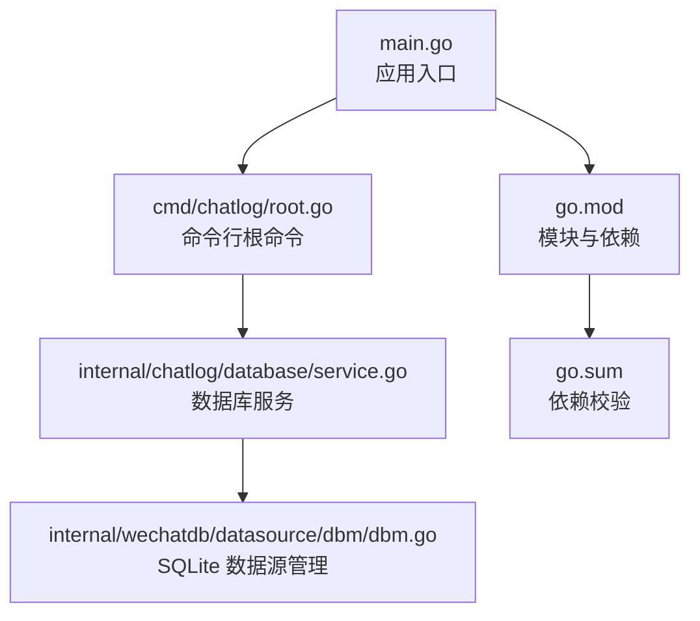
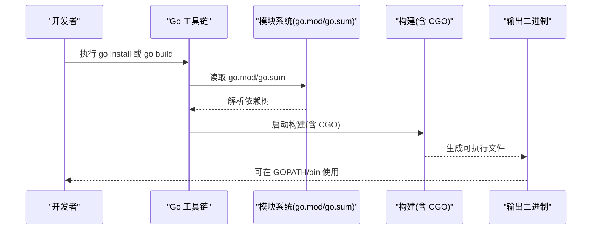
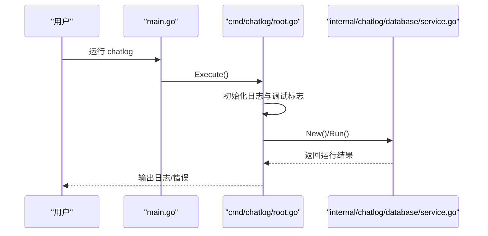
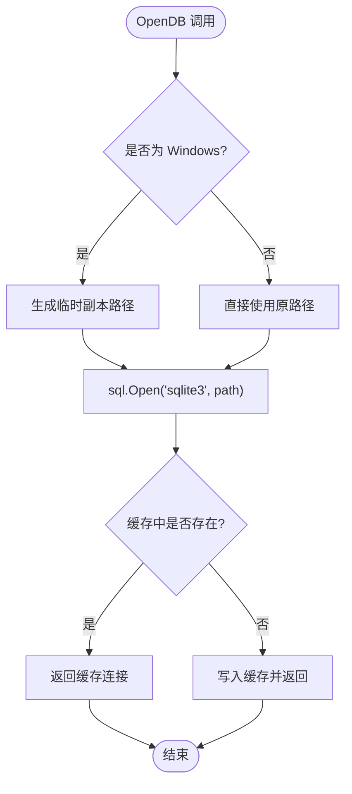
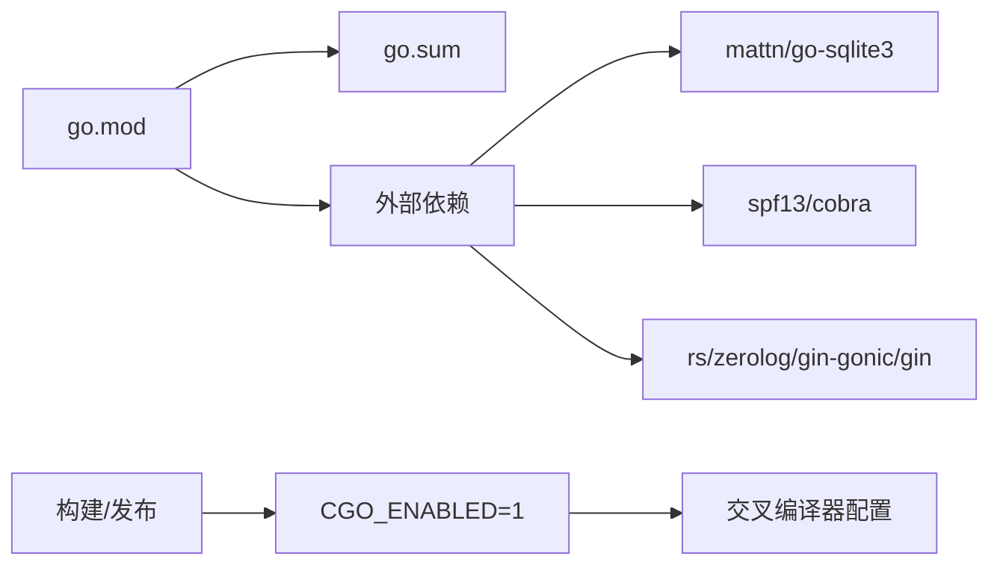

# 源码安装

<cite>
**本文引用的文件**
- [README.md](file://README.md)
- [go.mod](file://go.mod)
- [go.sum](file://go.sum)
- [Makefile](file://Makefile)
- [.goreleaser.yaml](file://.goreleaser.yaml)
- [main.go](file://main.go)
- [cmd/chatlog/root.go](file://cmd/chatlog/root.go)
- [internal/chatlog/database/service.go](file://internal/chatlog/database/service.go)
- [internal/errors/errors.go](file://internal/errors/errors.go)
- [internal/errors/wechat_errors.go](file://internal/errors/wechat_errors.go)
- [internal/wechatdb/datasource/dbm/dbm.go](file://internal/wechatdb/datasource/dbm/dbm.go)
- [Dockerfile](file://Dockerfile)
- [script/package.sh](file://script/package.sh)
</cite>

## 目录
1. [简介](#简介)
2. [项目结构](#项目结构)
3. [核心组件](#核心组件)
4. [架构总览](#架构总览)
5. [详细组件分析](#详细组件分析)
6. [依赖关系分析](#依赖关系分析)
7. [性能考量](#性能考量)
8. [故障排查指南](#故障排查指南)
9. [结论](#结论)
10. [附录](#附录)

## 简介
本指南面向希望从源码安装 Chatlog 的用户，覆盖以下内容：
- 从 GitHub 克隆仓库
- 安装 Go 依赖
- 编译与构建（含 CGO 依赖）
- 不同平台的编译命令与注意事项
- 使用 go install 将二进制安装到 GOPATH/bin
- 常见编译错误的排查与解决方案

## 项目结构
Chatlog 是一个使用 Go 编写的命令行工具，采用模块化组织，核心入口位于根目录的 main.go，命令行子命令由 cmd/chatlog 子包提供；内部业务逻辑分布在 internal 目录下，包含数据库、HTTP 服务、微信数据解密与提取等功能。

图表来源
- [main.go](file://main.go#L1-L13)
- [cmd/chatlog/root.go](file://cmd/chatlog/root.go#L1-L43)
- [internal/chatlog/database/service.go](file://internal/chatlog/database/service.go#L1-L137)
- [internal/wechatdb/datasource/dbm/dbm.go](file://internal/wechatdb/datasource/dbm/dbm.go#L114-L139)
- [go.mod](file://go.mod#L1-L82)
- [go.sum](file://go.sum#L1-L269)

章节来源
- [README.md](file://README.md#L1-L357)
- [go.mod](file://go.mod#L1-L82)
- [go.sum](file://go.sum#L1-L269)
- [main.go](file://main.go#L1-L13)
- [cmd/chatlog/root.go](file://cmd/chatlog/root.go#L1-L43)
- [internal/chatlog/database/service.go](file://internal/chatlog/database/service.go#L1-L137)
- [internal/wechatdb/datasource/dbm/dbm.go](file://internal/wechatdb/datasource/dbm/dbm.go#L114-L139)

## 核心组件
- 应用入口与命令行框架
  - main.go 调用 cmd/chatlog.Execute() 启动 CLI
  - root.go 定义根命令、调试开关、日志初始化与执行流程
- 数据库服务
  - database/service.go 管理数据库状态、启动/停止、回调注册与查询接口
  - dbm.go 实现跨平台 SQLite 连接与文件监控
- 错误体系
  - errors.go 定义统一错误类型与包装
  - wechat_errors.go 定义微信相关错误常量与工厂函数

章节来源
- [main.go](file://main.go#L1-L13)
- [cmd/chatlog/root.go](file://cmd/chatlog/root.go#L1-L43)
- [internal/chatlog/database/service.go](file://internal/chatlog/database/service.go#L1-L137)
- [internal/errors/errors.go](file://internal/errors/errors.go#L1-L125)
- [internal/errors/wechat_errors.go](file://internal/errors/wechat_errors.go#L1-L23)
- [internal/wechatdb/datasource/dbm/dbm.go](file://internal/wechatdb/datasource/dbm/dbm.go#L114-L139)

## 架构总览
下图展示从源码到可执行文件的关键流程，以及跨平台构建与打包脚本的关系。

图表来源
- [README.md](file://README.md#L50-L57)
- [go.mod](file://go.mod#L1-L82)
- [go.sum](file://go.sum#L1-L269)
- [Makefile](file://Makefile#L42-L44)
- [.goreleaser.yaml](file://.goreleaser.yaml#L8-L59)

章节来源
- [README.md](file://README.md#L50-L57)
- [go.mod](file://go.mod#L1-L82)
- [go.sum](file://go.sum#L1-L269)
- [Makefile](file://Makefile#L42-L44)
- [.goreleaser.yaml](file://.goreleaser.yaml#L8-L59)

## 详细组件分析

### 组件一：命令行入口与根命令
- main.go 调用 cmd/chatlog.Execute()，设置日志格式并执行根命令
- root.go 定义根命令、调试标志、日志初始化钩子与执行函数
- Root 函数创建应用实例并运行

图表来源
- [main.go](file://main.go#L9-L12)
- [cmd/chatlog/root.go](file://cmd/chatlog/root.go#L18-L42)
- [internal/chatlog/database/service.go](file://internal/chatlog/database/service.go#L38-L54)

章节来源
- [main.go](file://main.go#L1-L13)
- [cmd/chatlog/root.go](file://cmd/chatlog/root.go#L1-L43)
- [internal/chatlog/database/service.go](file://internal/chatlog/database/service.go#L1-L137)

### 组件二：数据库服务与 SQLite 连接
- Service 负责状态管理、启动/停止、回调注册与查询
- DBManager.OpenDB 在 Windows 平台使用临时副本以规避锁与并发问题
- 通过 fsnotify 监听文件变化，实现动态回调与资源回收

图表来源
- [internal/chatlog/database/service.go](file://internal/chatlog/database/service.go#L45-L54)
- [internal/wechatdb/datasource/dbm/dbm.go](file://internal/wechatdb/datasource/dbm/dbm.go#L114-L139)

章节来源
- [internal/chatlog/database/service.go](file://internal/chatlog/database/service.go#L1-L137)
- [internal/wechatdb/datasource/dbm/dbm.go](file://internal/wechatdb/datasource/dbm/dbm.go#L114-L139)

### 组件三：错误处理与微信相关错误
- errors.go 定义统一错误类型，支持堆栈捕获与包装
- wechat_errors.go 定义微信解密/内存读取/密钥有效性等错误常量
- 便于在构建与运行阶段定位问题

章节来源
- [internal/errors/errors.go](file://internal/errors/errors.go#L1-L125)
- [internal/errors/wechat_errors.go](file://internal/errors/wechat_errors.go#L1-L23)

## 依赖关系分析
- 模块与版本
  - go.mod 指定 Go 版本与依赖清单；go.sum 提供依赖校验
- 关键依赖
  - sqlite3 驱动（mattn/go-sqlite3）用于数据库访问
  - CLI 框架（spf13/cobra）用于命令行定义
  - 日志与 HTTP 服务（rs/zerolog、gin-gonic/gin）等
- CGO 与平台工具链
  - .goreleaser.yaml 显式设置 CGO_ENABLED=1，并为不同平台配置交叉编译器（如 MinGW、clang 等）

图表来源
- [go.mod](file://go.mod#L1-L82)
- [go.sum](file://go.sum#L1-L269)
- [.goreleaser.yaml](file://.goreleaser.yaml#L14-L58)

章节来源
- [go.mod](file://go.mod#L1-L82)
- [go.sum](file://go.sum#L1-L269)
- [.goreleaser.yaml](file://.goreleaser.yaml#L14-L58)

## 性能考量
- 构建优化
  - Makefile 使用 -s -w 去除符号与调试信息，减小体积
  - 可选 UPX 压缩（部分平台）
- 运行时
  - 数据库连接缓存减少重复打开
  - 文件监控与回调机制避免轮询，降低 CPU 占用

章节来源
- [Makefile](file://Makefile#L6-L6)
- [Makefile](file://Makefile#L57-L59)
- [internal/wechatdb/datasource/dbm/dbm.go](file://internal/wechatdb/datasource/dbm/dbm.go#L114-L139)

## 故障排查指南

### 1) CGO 相关错误
- 症状
  - 无法找到 C 编译器或链接失败
- 原因
  - 未安装 C 工具链或未启用 CGO
- 解决方案
  - Windows：安装 MinGW-w64（建议使用 MSYS2 或 TDM-GCC），确保 gcc 可用
  - macOS：安装 Xcode Command Line Tools（xcode-select --install）
  - Linux：安装 gcc/glibc 开发包（如 build-essential）
  - 确保 CGO_ENABLED=1（构建脚本已默认开启）

章节来源
- [README.md](file://README.md#L168-L176)
- [.goreleaser.yaml](file://.goreleaser.yaml#L14-L58)
- [Makefile](file://Makefile#L44-L44)

### 2) 依赖安装失败
- 症状
  - go mod tidy 或 go build 报错，提示找不到模块或校验失败
- 原因
  - go.mod/go.sum 不一致或网络问题
- 解决方案
  - 清理并重装依赖：go clean -modcache && go mod tidy
  - 确认 go.sum 与 go.mod 一致（可参考 .goreleaser.yaml 中的 tidy 钩子）

章节来源
- [.goreleaser.yaml](file://.goreleaser.yaml#L4-L6)
- [go.mod](file://go.mod#L1-L82)
- [go.sum](file://go.sum#L1-L269)

### 3) Windows 平台数据库连接异常
- 症状
  - 打开数据库报错或连接失败
- 原因
  - Windows 平台需要临时文件副本以避免锁冲突
- 解决方案
  - 确认 dbm.OpenDB 路径逻辑正常（临时副本生成与连接）
  - 检查数据目录权限与路径

章节来源
- [internal/wechatdb/datasource/dbm/dbm.go](file://internal/wechatdb/datasource/dbm/dbm.go#L121-L139)

### 4) 微信密钥/解密相关错误
- 症状
  - 获取密钥失败、解密密钥无效、哈希校验失败
- 原因
  - SIP（macOS）未关闭、密钥来源不匹配、版本不支持
- 解决方案
  - macOS：根据 README 提示临时关闭 SIP，并安装 Xcode Command Line Tools
  - 确认密钥与数据库版本匹配
  - 查看 wechat_errors.go 中的错误常量定位问题

章节来源
- [README.md](file://README.md#L154-L176)
- [internal/errors/wechat_errors.go](file://internal/errors/wechat_errors.go#L1-L23)

### 5) 构建产物与交叉编译
- 症状
  - 交叉编译失败或缺少目标平台二进制
- 原因
  - 缺少对应平台交叉编译器或环境变量未设置
- 解决方案
  - 使用 .goreleaser.yaml 中的环境变量配置（MinGW、clang 等）
  - 使用 Makefile 的 crossbuild 目标进行批量构建

章节来源
- [.goreleaser.yaml](file://.goreleaser.yaml#L22-L58)
- [Makefile](file://Makefile#L46-L60)

## 结论
- 从源码安装 Chatlog 的关键在于准备 C 工具链（CGO），并在各平台正确配置交叉编译器
- 使用 go install 可直接安装到 GOPATH/bin，便于全局使用
- 若遇到编译或运行问题，优先检查 CGO、平台工具链与依赖一致性
- 通过错误体系与日志可快速定位问题

## 附录

### A. 从源码安装与构建步骤
- 克隆仓库
  - 使用 git clone 克隆项目至本地
- 安装依赖
  - 运行 go mod tidy 安装依赖
- 构建当前平台二进制
  - 使用 Makefile 的 build 目标（默认启用 CGO）
- 安装到 GOPATH/bin
  - 使用 go install 安装到 GOPATH/bin，随后即可在任意位置运行 chatlog

章节来源
- [README.md](file://README.md#L50-L57)
- [Makefile](file://Makefile#L42-L44)

### B. 不同平台编译命令与注意事项
- Windows
  - 安装 MinGW-w64（MSYS2/TDM-GCC），确保 gcc 可用
  - 使用 go build 或 Makefile crossbuild 目标
- macOS
  - 安装 Xcode Command Line Tools（xcode-select --install）
  - 如需交叉编译，参考 .goreleaser.yaml 中 clang 配置
- Linux
  - 安装 gcc/glibc 开发包（如 build-essential）
  - 使用 go build 或 Makefile crossbuild 目标

章节来源
- [README.md](file://README.md#L168-L176)
- [.goreleaser.yaml](file://.goreleaser.yaml#L22-L58)
- [Makefile](file://Makefile#L46-L60)

### C. Docker 镜像与打包脚本
- Dockerfile
  - 提供运行时环境与健康检查，暴露 5030 端口
- script/package.sh
  - 自动调用 Makefile crossbuild，生成各平台压缩包与校验文件

章节来源
- [Dockerfile](file://Dockerfile#L1-L45)
- [script/package.sh](file://script/package.sh#L13-L56)