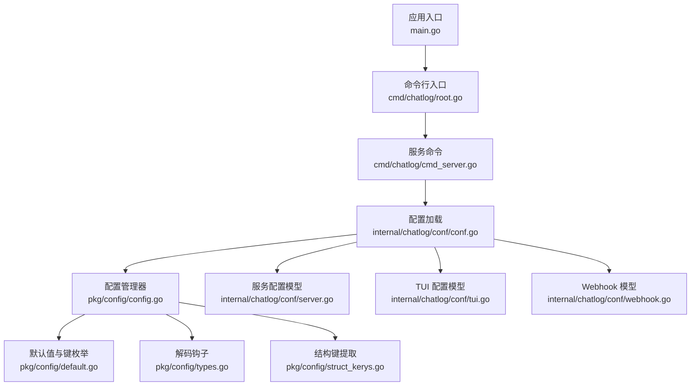
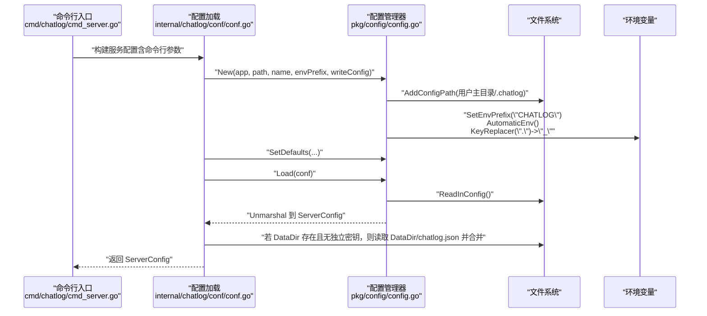
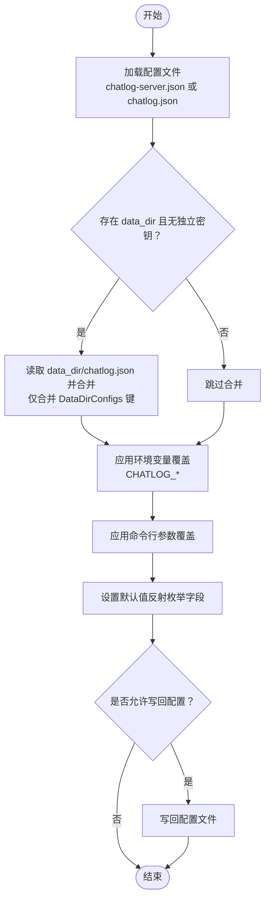
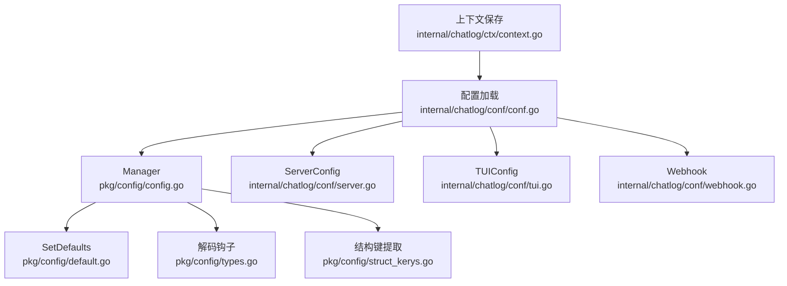

# 环境配置

<cite>
**本文引用的文件**
- [main.go](file://main.go)
- [cmd/chatlog/root.go](file://cmd/chatlog/root.go)
- [cmd/chatlog/cmd_server.go](file://cmd/chatlog/cmd_server.go)
- [pkg/config/config.go](file://pkg/config/config.go)
- [pkg/config/default.go](file://pkg/config/default.go)
- [pkg/config/types.go](file://pkg/config/types.go)
- [pkg/config/struct_kerys.go](file://pkg/config/struct_kerys.go)
- [internal/chatlog/conf/conf.go](file://internal/chatlog/conf/conf.go)
- [internal/chatlog/conf/server.go](file://internal/chatlog/conf/server.go)
- [internal/chatlog/conf/tui.go](file://internal/chatlog/conf/tui.go)
- [internal/chatlog/conf/webhook.go](file://internal/chatlog/conf/webhook.go)
- [internal/chatlog/ctx/context.go](file://internal/chatlog/ctx/context.go)
- [README.md](file://README.md)
</cite>

## 目录
1. [简介](#简介)
2. [项目结构](#项目结构)
3. [核心组件](#核心组件)
4. [架构总览](#架构总览)
5. [详细组件分析](#详细组件分析)
6. [依赖关系分析](#依赖关系分析)
7. [性能考虑](#性能考虑)
8. [故障排查指南](#故障排查指南)
9. [结论](#结论)
10. [附录](#附录)

## 简介
本指南面向 Chatlog 的使用者与运维人员，提供“环境配置”的完整说明。内容涵盖：
- 配置文件位置与格式（$HOME/.chatlog/chatlog.json）
- 环境变量设置方法（CHATLOG_* 前缀）
- 所有可配置参数的含义与用途（服务器端口、数据目录、密钥配置、Webhook 设置等）
- 不同部署场景下的配置示例
- 配置加载优先级与覆盖规则
- 配置验证与常见问题排查

## 项目结构
Chatlog 的配置体系由“配置管理器 + 结构化配置模型 + 环境变量映射”构成，核心流程如下：
- 应用启动时，根据应用名与用户主目录确定配置目录（默认 $HOME/.chatlog）
- 读取配置文件（默认文件名 chatlog-server.json 或 chatlog.json）
- 自动识别并加载环境变量（前缀 CHATLOG_），将点号替换为下划线
- 将配置解码到结构体，支持字符串到结构体、切片、映射的复合转换
- 对于服务模式，还支持从数据目录内嵌配置文件（chatlog.json）合并覆盖

图表来源
- [main.go](file://main.go#L1-L13)
- [cmd/chatlog/root.go](file://cmd/chatlog/root.go#L1-L43)
- [cmd/chatlog/cmd_server.go](file://cmd/chatlog/cmd_server.go#L1-L42)
- [internal/chatlog/conf/conf.go](file://internal/chatlog/conf/conf.go#L1-L106)
- [pkg/config/config.go](file://pkg/config/config.go#L1-L160)
- [pkg/config/default.go](file://pkg/config/default.go#L1-L34)
- [pkg/config/types.go](file://pkg/config/types.go#L1-L122)
- [pkg/config/struct_kerys.go](file://pkg/config/struct_kerys.go#L1-L150)
- [internal/chatlog/conf/server.go](file://internal/chatlog/conf/server.go#L1-L61)
- [internal/chatlog/conf/tui.go](file://internal/chatlog/conf/tui.go#L1-L41)
- [internal/chatlog/conf/webhook.go](file://internal/chatlog/conf/webhook.go#L1-L17)

章节来源
- [main.go](file://main.go#L1-L13)
- [cmd/chatlog/root.go](file://cmd/chatlog/root.go#L1-L43)
- [cmd/chatlog/cmd_server.go](file://cmd/chatlog/cmd_server.go#L1-L42)
- [internal/chatlog/conf/conf.go](file://internal/chatlog/conf/conf.go#L1-L106)
- [pkg/config/config.go](file://pkg/config/config.go#L1-L160)
- [pkg/config/default.go](file://pkg/config/default.go#L1-L34)
- [pkg/config/types.go](file://pkg/config/types.go#L1-L122)
- [pkg/config/struct_kerys.go](file://pkg/config/struct_kerys.go#L1-L150)
- [internal/chatlog/conf/server.go](file://internal/chatlog/conf/server.go#L1-L61)
- [internal/chatlog/conf/tui.go](file://internal/chatlog/conf/tui.go#L1-L41)
- [internal/chatlog/conf/webhook.go](file://internal/chatlog/conf/webhook.go#L1-L17)

## 核心组件
- 配置管理器（Manager）
  - 负责配置文件路径、名称、类型、环境变量前缀设置
  - 提供读取配置、写回配置、设置单个键值、获取全部配置等能力
- 默认值与键枚举
  - 通过反射枚举结构体字段，生成默认键集合，并设置默认值
- 解码钩子
  - 支持字符串到 map、slice、struct 的转换，便于从环境变量或配置文件传入复杂类型
- 结构体模型
  - 服务配置（ServerConfig）、TUI 配置（TUIConfig）、Webhook 配置（Webhook/WebhookItem）

章节来源
- [pkg/config/config.go](file://pkg/config/config.go#L1-L160)
- [pkg/config/default.go](file://pkg/config/default.go#L1-L34)
- [pkg/config/types.go](file://pkg/config/types.go#L1-L122)
- [pkg/config/struct_kerys.go](file://pkg/config/struct_kerys.go#L1-L150)
- [internal/chatlog/conf/server.go](file://internal/chatlog/conf/server.go#L1-L61)
- [internal/chatlog/conf/tui.go](file://internal/chatlog/conf/tui.go#L1-L41)
- [internal/chatlog/conf/webhook.go](file://internal/chatlog/conf/webhook.go#L1-L17)

## 架构总览
配置加载与覆盖的总体流程如下：

图表来源
- [cmd/chatlog/cmd_server.go](file://cmd/chatlog/cmd_server.go#L1-L42)
- [internal/chatlog/conf/conf.go](file://internal/chatlog/conf/conf.go#L1-L106)
- [pkg/config/config.go](file://pkg/config/config.go#L1-L160)

章节来源
- [cmd/chatlog/cmd_server.go](file://cmd/chatlog/cmd_server.go#L1-L42)
- [internal/chatlog/conf/conf.go](file://internal/chatlog/conf/conf.go#L1-L106)
- [pkg/config/config.go](file://pkg/config/config.go#L1-L160)

## 详细组件分析

### 配置文件位置与格式
- 默认配置目录
  - 若未显式指定配置目录，将使用用户主目录下的隐藏目录：$HOME/.chatlog
  - Windows 用户对应：%USERPROFILE%\.chatlog
- 默认配置文件名
  - TUI 模式：chatlog.json
  - 服务模式：chatlog-server.json
- 文件格式
  - JSON 格式，键名为小写字段名或结构体标签指定的 mapstructure 名称
  - 支持通过环境变量覆盖，点号会被替换为下划线

章节来源
- [pkg/config/config.go](file://pkg/config/config.go#L59-L76)
- [internal/chatlog/conf/conf.go](file://internal/chatlog/conf/conf.go#L12-L17)
- [internal/chatlog/conf/conf.go](file://internal/chatlog/conf/conf.go#L22-L26)

### 环境变量设置方法
- 环境变量前缀
  - CHATLOG_
- 键名映射规则
  - 将配置结构中的点号（如 webhook.items）映射为下划线（CHATLOG_WEBHOOK_ITEMS）
- 支持的复杂类型
  - 字符串到 map、slice、struct 的转换由解码钩子完成，便于通过环境变量传递数组、对象等

章节来源
- [pkg/config/config.go](file://pkg/config/config.go#L78-L83)
- [pkg/config/types.go](file://pkg/config/types.go#L13-L75)
- [pkg/config/types.go](file://pkg/config/types.go#L77-L107)

### 可配置参数详解
- 通用参数
  - type：平台类型标识（如 windows、darwin）
  - platform：平台名称（如 wechat）
  - version：版本号（整数）
  - full_version：完整版本字符串
- 数据与工作目录
  - data_dir：微信数据目录
  - work_dir：工作目录
  - data_key：数据解密密钥
  - img_key：图片解密密钥
- 服务与网络
  - http_addr：HTTP 服务监听地址，默认 0.0.0.0:5030
- 自动解密
  - auto_decrypt：是否开启自动解密
- Webhook
  - webhook.host：回调中资源 URL 的 host
  - webhook.delay_ms：回调延迟（毫秒）
  - webhook.items[]：回调规则列表，每项包含：
    - type：消息类型过滤
    - url：回调目标 URL
    - talker：聊天对象过滤（私聊/群聊）
    - sender：发送者过滤
    - keyword：关键词过滤
    - disabled：是否禁用该规则

章节来源
- [internal/chatlog/conf/server.go](file://internal/chatlog/conf/server.go#L7-L19)
- [internal/chatlog/conf/server.go](file://internal/chatlog/conf/server.go#L3-L5)
- [internal/chatlog/conf/webhook.go](file://internal/chatlog/conf/webhook.go#L3-L16)

### 不同部署场景下的配置示例
- TUI 模式（交互界面）
  - 配置文件：$HOME/.chatlog/chatlog.json
  - 可配置字段：webhook、last_account、history 等
  - 参考示例与说明见项目文档
- 服务模式（HTTP API）
  - 配置文件：$HOME/.chatlog/chatlog-server.json
  - 可通过环境变量 CHATLOG_* 覆盖，或直接编辑 JSON 文件
  - Webhook 配置既可写入 TUI 配置文件，也可通过环境变量注入
- Docker 部署
  - 由于容器隔离限制，无法直接获取密钥，需提前在宿主机运行程序获取密钥信息
  - 将数据目录挂载到容器内，并在容器外准备 chatlog-server.json 或通过环境变量注入

章节来源
- [README.md](file://README.md#L93-L135)
- [README.md](file://README.md#L215-L253)
- [internal/chatlog/conf/conf.go](file://internal/chatlog/conf/conf.go#L12-L17)

### 配置优先级与覆盖规则
- 文件优先级
  - 服务模式：先加载 chatlog-server.json，再加载数据目录内的 chatlog.json（仅合并 DataDirConfigs 中的键）
  - TUI 模式：加载 chatlog.json
- 环境变量覆盖
  - 当设置了 CHATLOG_* 环境变量时，会覆盖对应文件中的同名键（点号转下划线）
- 命令行参数
  - 服务命令行参数会先被转换为配置字典，然后写入配置管理器，随后加载文件与环境变量，最终生效
- 默认值
  - 通过反射枚举结构体字段，设置默认值；未显式提供的键将采用默认值或空值

图表来源
- [internal/chatlog/conf/conf.go](file://internal/chatlog/conf/conf.go#L73-L90)
- [pkg/config/config.go](file://pkg/config/config.go#L106-L135)
- [pkg/config/default.go](file://pkg/config/default.go#L25-L33)

章节来源
- [internal/chatlog/conf/conf.go](file://internal/chatlog/conf/conf.go#L73-L90)
- [pkg/config/config.go](file://pkg/config/config.go#L106-L135)
- [pkg/config/default.go](file://pkg/config/default.go#L25-L33)

### 配置验证与故障排查
- 配置验证
  - 可通过结构体键枚举与“required”校验机制检查缺失的必填字段（适用于带校验标签的结构体）
- 常见问题
  - 配置目录不存在或非目录：会尝试创建目录，否则报错
  - 读取配置失败：若允许写回，将尝试安全写入默认配置
  - Webhook 回调异常：检查 webhook.host 与 talker/sender/keyword 规则是否匹配，以及目标 URL 是否可达
  - Docker 部署无法获取密钥：需在宿主机提前获取 data_key 与 img_key，并挂载数据目录
- 日志输出
  - 启用调试模式可输出更详细的日志，便于定位配置加载与运行时问题

章节来源
- [pkg/config/config.go](file://pkg/config/config.go#L144-L159)
- [pkg/config/struct_kerys.go](file://pkg/config/struct_kerys.go#L62-L66)
- [cmd/chatlog/log.go](file://cmd/chatlog/log.go#L1-L45)
- [README.md](file://README.md#L93-L135)

## 依赖关系分析
配置模块之间的依赖关系如下：

图表来源
- [pkg/config/config.go](file://pkg/config/config.go#L1-L160)
- [pkg/config/default.go](file://pkg/config/default.go#L1-L34)
- [pkg/config/types.go](file://pkg/config/types.go#L1-L122)
- [pkg/config/struct_kerys.go](file://pkg/config/struct_kerys.go#L1-L150)
- [internal/chatlog/conf/conf.go](file://internal/chatlog/conf/conf.go#L1-L106)
- [internal/chatlog/conf/server.go](file://internal/chatlog/conf/server.go#L1-L61)
- [internal/chatlog/conf/tui.go](file://internal/chatlog/conf/tui.go#L1-L41)
- [internal/chatlog/conf/webhook.go](file://internal/chatlog/conf/webhook.go#L1-L17)
- [internal/chatlog/ctx/context.go](file://internal/chatlog/ctx/context.go#L297-L298)

章节来源
- [pkg/config/config.go](file://pkg/config/config.go#L1-L160)
- [pkg/config/default.go](file://pkg/config/default.go#L1-L34)
- [pkg/config/types.go](file://pkg/config/types.go#L1-L122)
- [pkg/config/struct_kerys.go](file://pkg/config/struct_kerys.go#L1-L150)
- [internal/chatlog/conf/conf.go](file://internal/chatlog/conf/conf.go#L1-L106)
- [internal/chatlog/conf/server.go](file://internal/chatlog/conf/server.go#L1-L61)
- [internal/chatlog/conf/tui.go](file://internal/chatlog/conf/tui.go#L1-L41)
- [internal/chatlog/conf/webhook.go](file://internal/chatlog/conf/webhook.go#L1-L17)
- [internal/chatlog/ctx/context.go](file://internal/chatlog/ctx/context.go#L297-L298)

## 性能考虑
- 配置读取与解码
  - 使用 Viper 进行配置读取与反序列化，支持多种类型转换，减少手动解析成本
- 写回策略
  - 仅在明确允许写回配置时才写入文件，避免频繁磁盘 IO
- 环境变量覆盖
  - 通过前缀映射与键替换实现高效覆盖，建议在容器或 CI 环境中统一使用环境变量

## 故障排查指南
- 配置文件未生效
  - 检查配置目录是否存在且为目录（非文件）
  - 确认文件名是否正确（服务模式为 chatlog-server.json，TUI 模式为 chatlog.json）
- 环境变量未生效
  - 确认键名使用下划线而非点号（如 CHATLOG_WEBHOOK_ITEMS）
  - 确认环境变量前缀为 CHATLOG_
- Webhook 未触发
  - 检查 webhook.host 与 talker/sender/keyword 规则是否匹配
  - 确认目标 URL 可达且能正确接收回调
- Docker 部署异常
  - 确保数据目录已挂载且包含有效的 chatlog.json
  - 确保 data_key 与 img_key 已正确配置或通过环境变量注入

章节来源
- [pkg/config/config.go](file://pkg/config/config.go#L144-L159)
- [pkg/config/config.go](file://pkg/config/config.go#L106-L135)
- [README.md](file://README.md#L93-L135)
- [internal/chatlog/conf/webhook.go](file://internal/chatlog/conf/webhook.go#L3-L16)

## 结论
通过统一的配置管理器与清晰的覆盖规则，Chatlog 实现了灵活、可移植的配置方案。建议在不同环境中遵循以下实践：
- 生产环境优先使用环境变量覆盖
- 开发与测试环境可结合 JSON 文件与环境变量
- Docker 环境需提前准备密钥与数据目录，并通过挂载或环境变量注入

## 附录
- 配置文件示例与说明可参考项目文档中的 Webhook 与 Docker 部署部分
- 命令行参数与服务模式的配置入口位于服务命令文件中

章节来源
- [README.md](file://README.md#L215-L253)
- [README.md](file://README.md#L93-L135)
- [cmd/chatlog/cmd_server.go](file://cmd/chatlog/cmd_server.go#L1-L42)