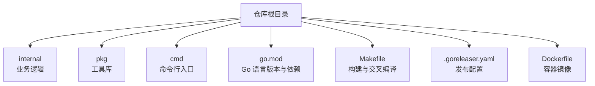
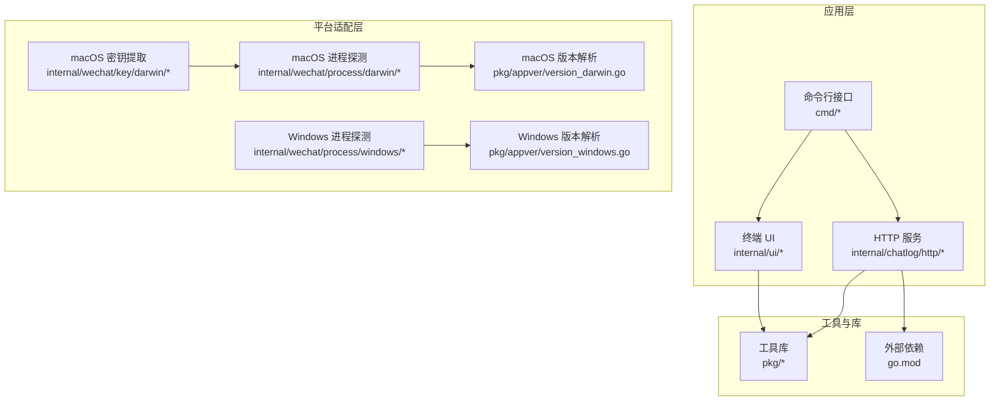
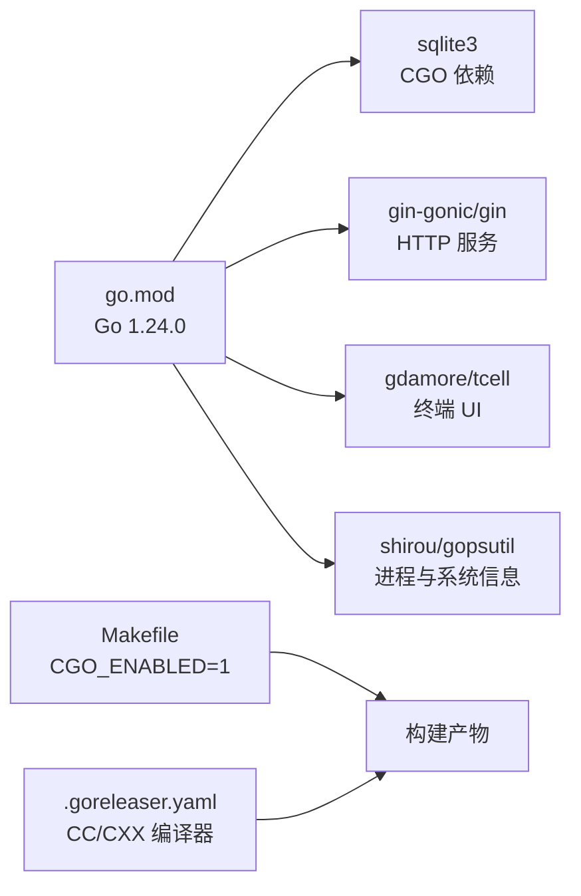
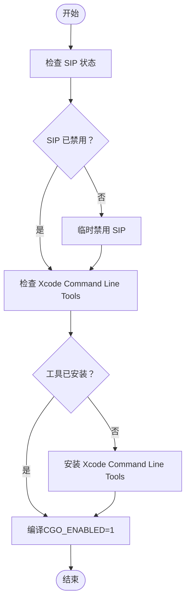

# 系统要求

<cite>
**本文引用的文件**
- [go.mod](file://go.mod)
- [README.md](file://README.md)
- [Makefile](file://Makefile)
- [Dockerfile](file://Dockerfile)
- [.goreleaser.yaml](file://.goreleaser.yaml)
- [internal/wechat/key/darwin/v3.go](file://internal/wechat/key/darwin/v3.go)
- [internal/wechat/key/darwin/glance/sip.go](file://internal/wechat/key/darwin/glance/sip.go)
- [internal/wechat/process/darwin/detector.go](file://internal/wechat/process/darwin/detector.go)
- [internal/wechat/process/windows/detector.go](file://internal/wechat/process/windows/detector.go)
- [internal/ui/style/style_windows.go](file://internal/ui/style/style_windows.go)
- [pkg/appver/version_darwin.go](file://pkg/appver/version_darwin.go)
- [pkg/appver/version_windows.go](file://pkg/appver/version_windows.go)
- [internal/chatlog/http/route.go](file://internal/chatlog/http/route.go)
- [internal/errors/os_errors.go](file://internal/errors/os_errors.go)
- [script/docker-entrypoint.sh](file://script/docker-entrypoint.sh)
</cite>

## 目录
1. [简介](#简介)
2. [项目结构](#项目结构)
3. [核心组件](#核心组件)
4. [架构总览](#架构总览)
5. [详细组件分析](#详细组件分析)
6. [依赖关系分析](#依赖关系分析)
7. [性能考虑](#性能考虑)
8. [故障排查指南](#故障排查指南)
9. [结论](#结论)
10. [附录](#附录)

## 简介
本文件为 Chatlog 的系统要求文档，覆盖操作系统支持、Go 语言版本、C 编译环境依赖、微信版本兼容性、平台特定要求（macOS Xcode Command Line Tools、Windows Visual Studio Build Tools）、硬件最低与推荐配置、系统环境检查清单以及常见问题解决方案。

## 项目结构
- 仓库采用模块化组织，核心功能集中在 internal、pkg、cmd 等目录，分别负责业务逻辑、工具库与命令行入口。
- 构建与发布通过 Makefile、.goreleaser.yaml 配合，支持跨平台交叉编译与压缩。
- Dockerfile 提供容器化部署基础镜像与运行环境。

章节来源
- [go.mod](file://go.mod#L1-L82)
- [Makefile](file://Makefile#L1-L60)
- [.goreleaser.yaml](file://.goreleaser.yaml#L1-L159)
- [Dockerfile](file://Dockerfile#L1-L45)

## 核心组件
- Go 语言版本：项目使用 Go 1.24.0。
- CGO 依赖：构建与部分功能依赖 CGO（例如 sqlite3、某些平台探测与版本读取）。
- 平台支持：官方支持 Windows 与 macOS；Linux 亦在交叉编译矩阵中。
- 微信版本兼容：支持微信 3.x 与 4.x；密钥提取对 macOS 与 Windows 有版本限制说明。
- 组件耦合：HTTP 服务、UI、进程探测、密钥提取、版本解析等模块相互协作。

章节来源
- [go.mod](file://go.mod#L3-L28)
- [README.md](file://README.md#L17-L28)
- [Makefile](file://Makefile#L44-L56)
- [.goreleaser.yaml](file://.goreleaser.yaml#L14-L58)

## 架构总览
系统由命令行入口与 HTTP 服务组成，底层依赖进程探测、版本解析、密钥提取与数据库解密模块。跨平台通过条件编译与平台特定实现完成。

图表来源
- [internal/chatlog/http/route.go](file://internal/chatlog/http/route.go#L26-L45)
- [internal/wechat/process/darwin/detector.go](file://internal/wechat/process/darwin/detector.go#L24-L95)
- [internal/wechat/process/windows/detector.go](file://internal/wechat/process/windows/detector.go#L20-L101)
- [pkg/appver/version_darwin.go](file://pkg/appver/version_darwin.go#L1-L42)
- [pkg/appver/version_windows.go](file://pkg/appver/version_windows.go#L1-L143)
- [internal/wechat/key/darwin/v3.go](file://internal/wechat/key/darwin/v3.go#L1-L193)
- [go.mod](file://go.mod#L1-L82)

章节来源
- [internal/chatlog/http/route.go](file://internal/chatlog/http/route.go#L26-L45)
- [internal/wechat/process/darwin/detector.go](file://internal/wechat/process/darwin/detector.go#L24-L95)
- [internal/wechat/process/windows/detector.go](file://internal/wechat/process/windows/detector.go#L20-L101)
- [pkg/appver/version_darwin.go](file://pkg/appver/version_darwin.go#L1-L42)
- [pkg/appver/version_windows.go](file://pkg/appver/version_windows.go#L1-L143)
- [internal/wechat/key/darwin/v3.go](file://internal/wechat/key/darwin/v3.go#L1-L193)
- [go.mod](file://go.mod#L1-L82)

## 详细组件分析

### 操作系统与平台支持
- 官方支持：Windows 与 macOS；Linux 在交叉编译矩阵中。
- 平台特定实现：
  - macOS：使用 gopsutil 获取进程列表，lsof 读取打开文件，版本解析通过 Info.plist；密钥提取依赖 SIP 状态检查。
  - Windows：使用 gopsutil 获取进程列表，版本解析通过 Win32 版本信息 API；区分 WeChat/Weixin 进程。
- UI 样式在 Windows 上有专门实现。

章节来源
- [internal/wechat/process/darwin/detector.go](file://internal/wechat/process/darwin/detector.go#L17-L22)
- [internal/wechat/process/windows/detector.go](file://internal/wechat/process/windows/detector.go#L13-L18)
- [internal/ui/style/style_windows.go](file://internal/ui/style/style_windows.go#L1-L82)

### Go 语言版本要求
- 项目使用 Go 1.24.0，建议在本地开发与 CI 中保持一致版本，避免编译差异。

章节来源
- [go.mod](file://go.mod#L3-L3)

### C 编译环境依赖
- CGO 启用：构建脚本与发布配置均显式启用 CGO（CGO_ENABLED=1），用于 sqlite3 等依赖。
- macOS：建议安装 Xcode Command Line Tools，以便 clang 等工具可用。
- Windows：建议安装 Visual Studio Build Tools 或 MinGW（发布配置中使用了 mingw 编译器前缀）。
- Linux：交叉编译使用 gcc/g++，需确保相应工具链可用。

章节来源
- [Makefile](file://Makefile#L44-L56)
- [.goreleaser.yaml](file://.goreleaser.yaml#L14-L58)
- [README.md](file://README.md#L56-L56)

### 微信版本兼容性
- 支持微信 3.x 与 4.x。
- 密钥提取对版本有限制：
  - Windows < 4.0.3.36、macOS < 4.0.3.80。
- 进程检测区分 WeChat/Weixin，并根据版本选择数据库文件路径。

章节来源
- [README.md](file://README.md#L20-L22)
- [internal/wechat/process/darwin/detector.go](file://internal/wechat/process/darwin/detector.go#L17-L22)
- [internal/wechat/process/windows/detector.go](file://internal/wechat/process/windows/detector.go#L13-L18)

### 平台特定系统要求

#### macOS
- 必备工具：Xcode Command Line Tools（用于编译与链接）。
- SIP 状态：密钥提取前需临时关闭 SIP（系统完整性保护），完成后可重新启用。
- 终端：建议使用 macOS 自带终端或兼容终端，避免显示异常。

章节来源
- [README.md](file://README.md#L168-L176)
- [internal/wechat/key/darwin/glance/sip.go](file://internal/wechat/key/darwin/glance/sip.go#L8-L37)
- [internal/wechat/key/darwin/v3.go](file://internal/wechat/key/darwin/v3.go#L45-L48)

#### Windows
- 终端：如出现界面显示问题，建议使用 Windows Terminal。
- 构建工具：Visual Studio Build Tools 或 MinGW（发布配置中使用 mingw 编译器前缀）。

章节来源
- [README.md](file://README.md#L148-L151)
- [.goreleaser.yaml](file://.goreleaser.yaml#L35-L46)

### 硬件最低配置与推荐配置
- 最低配置：满足 Go 应用与 SQLite 数据库读写即可，无特殊 GPU/内存硬性要求。
- 推荐配置：根据数据规模与并发访问需求提升 CPU 与内存；若启用 HTTP 服务与 Webhook，建议预留足够网络带宽与磁盘空间。

（本节为通用建议，不直接引用具体文件）

### 系统环境检查清单
- Go 版本：确认为 1.24.0。
- CGO：确保 CGO_ENABLED=1，且 C/C++ 编译器可用。
- macOS：已安装 Xcode Command Line Tools；SIP 可被临时关闭。
- Windows：已安装 Visual Studio Build Tools 或 MinGW；使用 Windows Terminal。
- 权限：具备读取目标数据目录的权限；Docker 部署时确保挂载路径正确。
- 网络：HTTP 服务监听地址与端口（默认 0.0.0.0:5030）可访问。

章节来源
- [go.mod](file://go.mod#L3-L3)
- [Makefile](file://Makefile#L44-L56)
- [README.md](file://README.md#L148-L176)
- [Dockerfile](file://Dockerfile#L35-L38)

## 依赖关系分析

图表来源
- [go.mod](file://go.mod#L1-L82)
- [Makefile](file://Makefile#L44-L56)
- [.goreleaser.yaml](file://.goreleaser.yaml#L35-L46)

章节来源
- [go.mod](file://go.mod#L1-L82)
- [Makefile](file://Makefile#L44-L56)
- [.goreleaser.yaml](file://.goreleaser.yaml#L35-L46)

## 性能考虑
- 并发搜索：macOS 密钥提取使用多 goroutine 搜索内存，CPU 核数越多通常越快，但存在最大工作线程上限。
- I/O 与网络：HTTP 服务与 Webhook 回调受磁盘与网络延迟影响；建议在本地网络环境下测试回调延迟。
- 二进制体积：发布配置包含 UPX 压缩，可减小体积，但需确保目标平台支持。

章节来源
- [internal/wechat/key/darwin/v3.go](file://internal/wechat/key/darwin/v3.go#L18-L20)
- [internal/wechat/key/darwin/v3.go](file://internal/wechat/key/darwin/v3.go#L63-L70)
- [README.md](file://README.md#L219-L219)
- [.goreleaser.yaml](file://.goreleaser.yaml#L60-L66)

## 故障排查指南

### 常见问题与解决方案
- macOS 密钥提取失败：检查 SIP 是否已临时关闭；确认已安装 Xcode Command Line Tools。
- Windows 界面显示异常：改用 Windows Terminal 运行。
- CGO 编译失败：确认已安装 Visual Studio Build Tools 或 MinGW；确保 CGO_ENABLED=1。
- Docker 部署无法获取密钥：容器内无法直接读取宿主微信进程，需在宿主侧先获取密钥再挂载到容器。
- 端口占用：HTTP 服务默认监听 0.0.0.0:5030，如冲突请修改配置或释放端口。

章节来源
- [README.md](file://README.md#L41-L46)
- [README.md](file://README.md#L148-L176)
- [Dockerfile](file://Dockerfile#L35-L38)
- [internal/errors/os_errors.go](file://internal/errors/os_errors.go#L5-L23)

### 关键流程图：macOS 密钥提取前置检查

图表来源
- [internal/wechat/key/darwin/glance/sip.go](file://internal/wechat/key/darwin/glance/sip.go#L8-L37)
- [README.md](file://README.md#L168-L176)
- [Makefile](file://Makefile#L44-L56)

## 结论
- Chatlog 明确支持 Windows 与 macOS，并在 Linux 上提供交叉编译能力。
- 开发与运行需满足 Go 1.24.0、CGO 启用与平台编译工具链要求。
- macOS 需 Xcode Command Line Tools 与可临时关闭的 SIP；Windows 需 Visual Studio Build Tools 或 MinGW，并建议使用 Windows Terminal。
- 微信版本兼容 3.x/4.x，密钥提取存在版本限制，Docker 部署需提前准备密钥。
- 建议按“系统环境检查清单”逐项核验，结合“故障排查指南”快速定位问题。

## 附录

### HTTP 服务与端口
- 默认监听地址：0.0.0.0:5030；可通过配置修改。
- 健康检查：/health 返回状态 ok。

章节来源
- [internal/chatlog/conf/server.go](file://internal/chatlog/conf/server.go#L3-L56)
- [internal/chatlog/http/route.go](file://internal/chatlog/http/route.go#L40-L42)

### Docker 环境要点
- 镜像基于 Debian 12 slim，包含 gosu 与 ffmpeg。
- 默认暴露 5030 端口，健康检查通过 curl 访问 /health。
- 数据与工作目录通过环境变量配置，默认 /app/data 与 /app/work。

章节来源
- [Dockerfile](file://Dockerfile#L1-L45)
- [script/docker-entrypoint.sh](file://script/docker-entrypoint.sh#L1-L21)