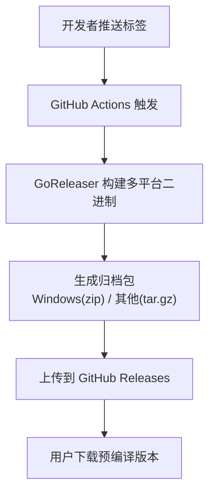
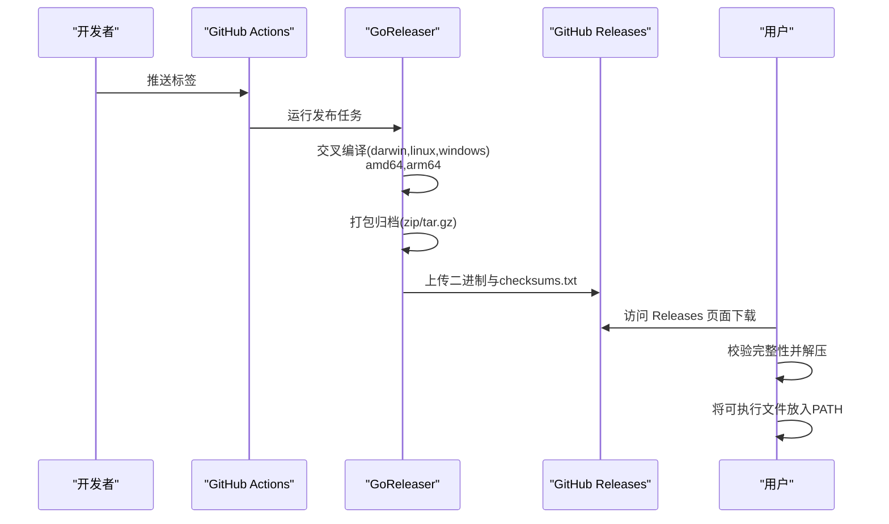
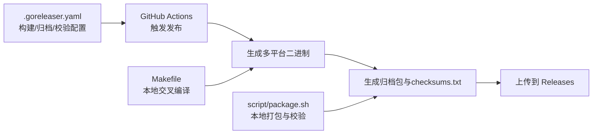

# 预编译版本安装

<cite>
**本文引用的文件**
- [README.md](file://README.md)
- [.github/workflows/release.yml](file://.github/workflows/release.yml)
- [.goreleaser.yaml](file://.goreleaser.yaml)
- [Makefile](file://Makefile)
- [script/package.sh](file://script/package.sh)
- [go.mod](file://go.mod)
</cite>

## 目录
1. [简介](#简介)
2. [项目结构](#项目结构)
3. [核心组件](#核心组件)
4. [架构总览](#架构总览)
5. [详细组件分析](#详细组件分析)
6. [依赖关系分析](#依赖关系分析)
7. [性能考虑](#性能考虑)
8. [故障排除指南](#故障排除指南)
9. [结论](#结论)
10. [附录](#附录)

## 简介
本指南面向希望快速安装并使用 Chatlog 预编译版本的用户，覆盖从 GitHub Releases 页面下载、解压、移动到 PATH、校验完整性以及通过包管理器安装的全流程。文档严格依据仓库中的发布配置与脚本，确保与实际产物一致。

## 项目结构
本项目采用标准 Go 仓库布局，发布流程由 GitHub Actions 结合 GoReleaser 自动化生成多平台二进制包，并在 GitHub Releases 中发布。预编译版本包含：
- Windows/amd64、Windows/arm64
- Linux/amd64、Linux/arm64
- macOS/amd64、macOS/arm64

归档格式：
- Windows：zip
- 其他系统：tar.gz

此外，仓库还提供 checksums.txt 用于完整性校验；同时在 README 中提供了从源码安装与 Docker 部署的参考路径。

图表来源
- [.github/workflows/release.yml](file://.github/workflows/release.yml#L1-L58)
- [.goreleaser.yaml](file://.goreleaser.yaml#L82-L84)

章节来源
- [.github/workflows/release.yml](file://.github/workflows/release.yml#L1-L58)
- [.goreleaser.yaml](file://.goreleaser.yaml#L8-L58)
- [README.md](file://README.md#L58-L61)

## 核心组件
- 发布流水线：GitHub Actions + GoReleaser，负责跨平台交叉编译、打包、上传。
- 归档与校验：GoReleaser 生成 checksums.txt；脚本亦可生成独立校验值。
- 文档与入口：README 提供 Releases 下载链接与基本使用说明。

章节来源
- [.goreleaser.yaml](file://.goreleaser.yaml#L82-L84)
- [script/package.sh](file://script/package.sh#L19-L20)
- [README.md](file://README.md#L58-L61)

## 架构总览
下图展示从触发到用户拿到可执行文件的关键步骤，映射到实际配置文件。

图表来源
- [.github/workflows/release.yml](file://.github/workflows/release.yml#L11-L56)
- [.goreleaser.yaml](file://.goreleaser.yaml#L8-L58)
- [.goreleaser.yaml](file://.goreleaser.yaml#L67-L81)
- [.goreleaser.yaml](file://.goreleaser.yaml#L82-L84)

## 详细组件分析

### 1) 从 GitHub Releases 下载预编译版本
- 打开项目 Releases 页面，根据你的操作系统与 CPU 架构选择对应的归档文件：
  - Windows/amd64：下载 zip 包
  - Windows/arm64：下载 zip 包
  - Linux/amd64：下载 tar.gz 包
  - Linux/arm64：下载 tar.gz 包
  - macOS/amd64：下载 tar.gz 包
  - macOS/arm64：下载 tar.gz 包
- 归档内包含可执行文件与 LICENSE、README 文件。

章节来源
- [README.md](file://README.md#L58-L61)
- [.goreleaser.yaml](file://.goreleaser.yaml#L67-L81)

### 2) 解压与移动到 PATH
- Windows
  - 解压 zip 包至任意目录（例如：C:\Tools\chatlog）
  - 将该目录加入系统 PATH，使 chatlog 可在任意位置调用
- Linux/macOS
  - 解压 tar.gz 包至任意目录（例如：~/tools/chatlog）
  - 将该目录加入 PATH（例如：export PATH="$HOME/tools/chatlog:$PATH"）

章节来源
- [.goreleaser.yaml](file://.goreleaser.yaml#L67-L81)

### 3) 验证下载文件的完整性
- 使用 GoReleaser 生成的 checksums.txt 校验：
  - 在 Releases 页面下载 checksums.txt
  - 使用 sha256sum 对你下载的归档文件进行计算
  - 比较输出结果与 checksums.txt 中对应条目是否一致
- 若无 checksums.txt，也可使用脚本生成的校验值（适用于本地构建场景）：
  - 脚本会在 packages 目录生成独立的 sha256 校验值

章节来源
- [.goreleaser.yaml](file://.goreleaser.yaml#L82-L84)
- [script/package.sh](file://script/package.sh#L19-L20)
- [script/package.sh](file://script/package.sh#L52-L54)

### 4) 不同操作系统与架构的选择指南
- Windows
  - amd64：选择 Windows/amd64 zip 包
  - arm64：选择 Windows/arm64 zip 包
- Linux
  - amd64：选择 Linux/amd64 tar.gz 包
  - arm64：选择 Linux/arm64 tar.gz 包
- macOS
  - amd64：选择 macOS/amd64 tar.gz 包
  - arm64：选择 macOS/arm64 tar.gz 包

章节来源
- [.goreleaser.yaml](file://.goreleaser.yaml#L15-L21)
- [.goreleaser.yaml](file://.goreleaser.yaml#L47-L58)
- [.goreleaser.yaml](file://.goreleaser.yaml#L67-L77)

### 5) 通过包管理器安装
- Chocolatey（Windows）
  - 仓库未提供官方 Chocolatey 包，建议优先使用 Releases 页面的 zip 包
  - 如需通过 Chocolatey 安装，可参考社区维护的包或自建 Chocolatey 包（不在本仓库范围内）
- Homebrew（macOS/Linux）
  - 仓库未提供官方 Homebrew Formula，建议优先使用 Releases 页面的 tar.gz 包
  - 如需通过 Homebrew 安装，可参考社区维护的 Formula 或自建 Formula（不在本仓库范围内）

章节来源
- [README.md](file://README.md#L58-L61)

### 6) 常见安装流程（步骤化）
- Windows
  1) 从 Releases 下载对应 zip 包
  2) 解压到 C:\Tools\chatlog
  3) 将 C:\Tools\chatlog 添加到 PATH
  4) 打开新终端输入 chatlog 验证
- Linux/macOS
  1) 从 Releases 下载对应 tar.gz 包
  2) 解压到 ~/tools/chatlog
  3) 将 ~/tools/chatlog 添加到 PATH
  4) 在终端输入 chatlog 验证

章节来源
- [.goreleaser.yaml](file://.goreleaser.yaml#L67-L81)

## 依赖关系分析
- 发布配置依赖 GoReleaser 的多平台构建能力与归档策略
- GitHub Actions 作为 CI/CD 触发器，负责拉起 GoReleaser 并上传产物
- Makefile 与脚本提供本地交叉编译与打包辅助

图表来源
- [.goreleaser.yaml](file://.goreleaser.yaml#L8-L58)
- [.goreleaser.yaml](file://.goreleaser.yaml#L67-L84)
- [.github/workflows/release.yml](file://.github/workflows/release.yml#L11-L56)
- [Makefile](file://Makefile#L46-L60)
- [script/package.sh](file://script/package.sh#L13-L18)

章节来源
- [.goreleaser.yaml](file://.goreleaser.yaml#L8-L58)
- [.github/workflows/release.yml](file://.github/workflows/release.yml#L11-L56)
- [Makefile](file://Makefile#L46-L60)
- [script/package.sh](file://script/package.sh#L13-L18)

## 性能考虑
- 预编译版本通常经过 UPX 压缩（GoReleaser 配置中启用），体积更小但加载速度与运行性能差异有限
- 选择与系统匹配的架构（amd64/arm64）可避免不必要的兼容层开销
- 保持 PATH 中只存在一个版本，避免重复查找带来的微小延迟

## 故障排除指南
- 下载后无法运行
  - 确认选择的归档与系统架构匹配（zip vs tar.gz）
  - 确认已将可执行文件所在目录加入 PATH
- 校验失败
  - 使用 Releases 页面提供的 checksums.txt 进行比对
  - 若网络问题导致下载损坏，重新下载后再校验
- Windows 终端显示异常
  - 参考 README 中的 Windows 版本说明，使用 Windows Terminal 运行程序

章节来源
- [.goreleaser.yaml](file://.goreleaser.yaml#L82-L84)
- [README.md](file://README.md#L148-L151)

## 结论
通过 GitHub Releases 提供的多平台预编译版本，用户可快速完成安装与验证。建议优先使用官方 Releases 与 checksums.txt 进行完整性校验，并将可执行文件放置于 PATH 中以便全局使用。若需通过包管理器安装，当前仓库未提供官方包，建议使用官方归档包。

## 附录
- 关键配置与脚本位置
  - 发布配置：.goreleaser.yaml
  - 发布工作流：.github/workflows/release.yml
  - 本地交叉编译：Makefile
  - 本地打包与校验：script/package.sh
  - 项目模块：go.mod

章节来源
- [.goreleaser.yaml](file://.goreleaser.yaml#L1-L159)
- [.github/workflows/release.yml](file://.github/workflows/release.yml#L1-L58)
- [Makefile](file://Makefile#L1-L60)
- [script/package.sh](file://script/package.sh#L1-L60)
- [go.mod](file://go.mod#L1-L82)