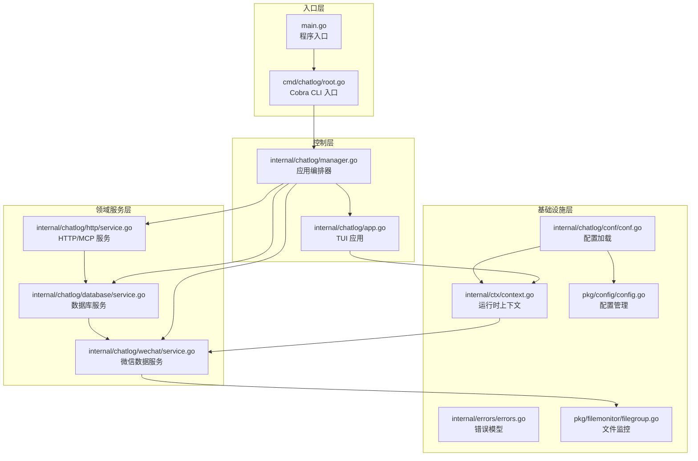
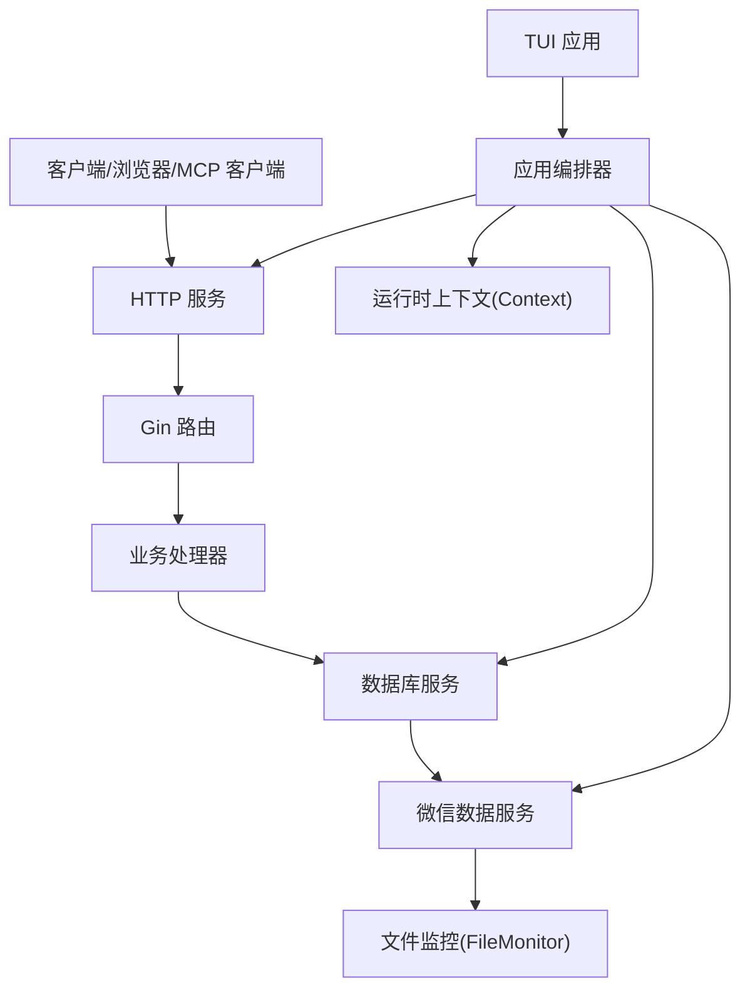
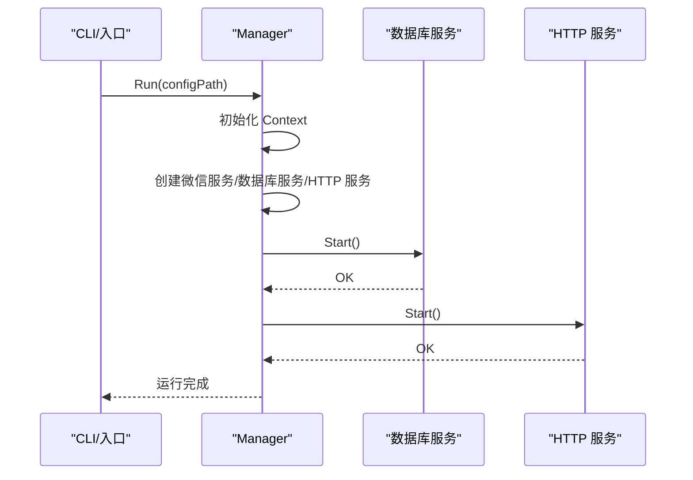
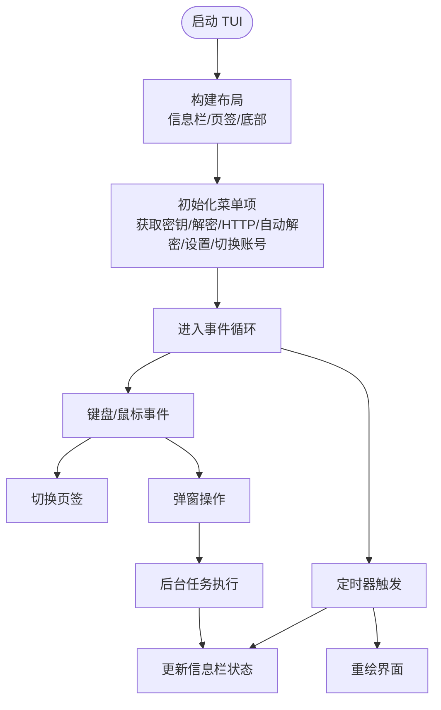
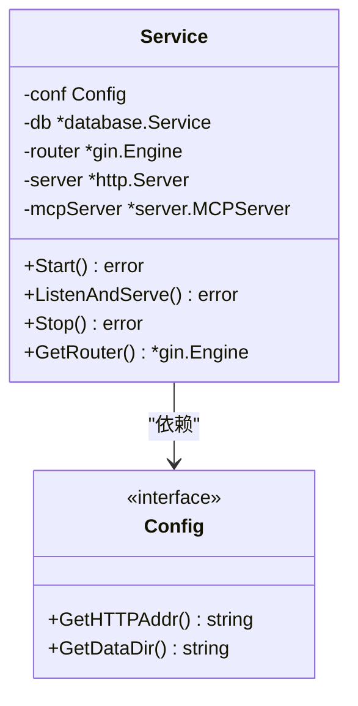
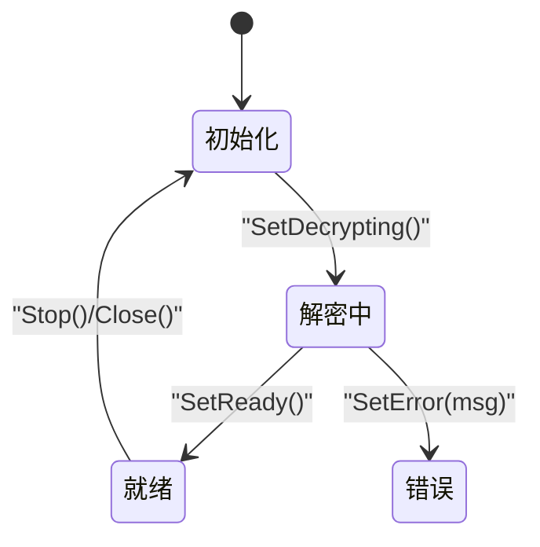
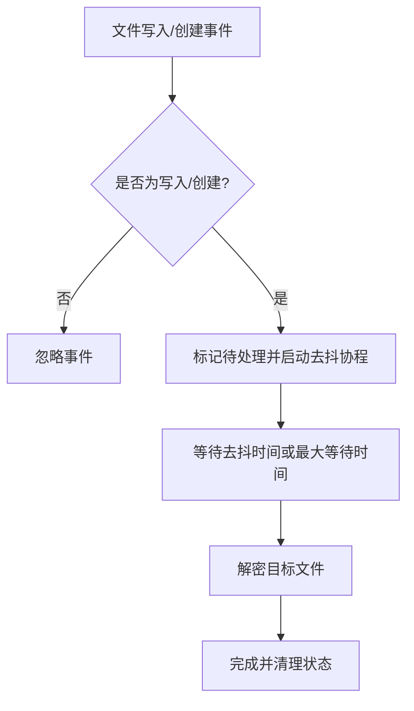
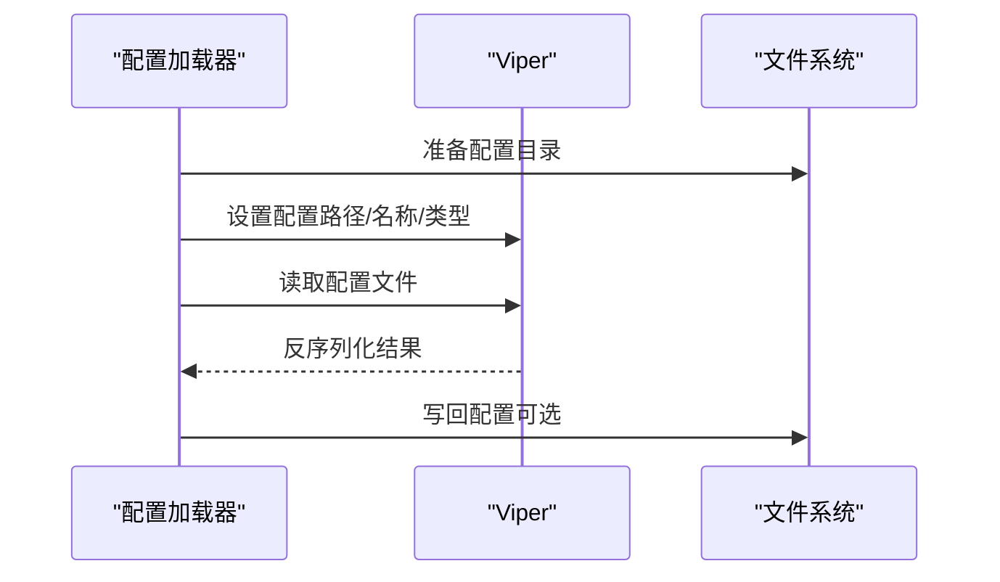
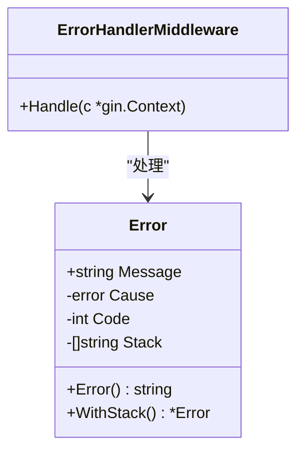
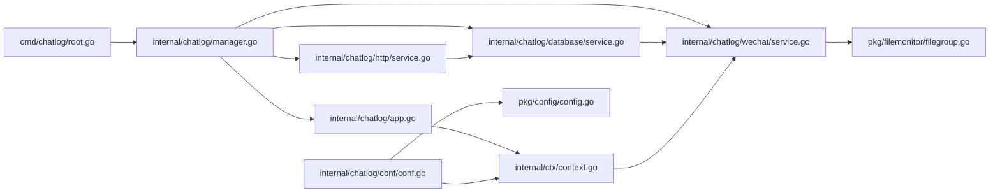

# 代码结构与设计模式

<cite>
**本文档引用的文件**
- [main.go](file://main.go)
- [root.go](file://cmd/chatlog/root.go)
- [app.go](file://internal/chatlog/app.go)
- [manager.go](file://internal/chatlog/manager.go)
- [context.go](file://internal/ctx/context.go)
- [conf.go](file://internal/chatlog/conf/conf.go)
- [service.go](file://internal/chatlog/http/service.go)
- [service.go](file://internal/chatlog/database/service.go)
- [service.go](file://internal/chatlog/wechat/service.go)
- [errors.go](file://internal/errors/errors.go)
- [config.go](file://pkg/config/config.go)
- [filegroup.go](file://pkg/filemonitor/filegroup.go)
</cite>

## 目录
1. [简介](#简介)
2. [项目结构](#项目结构)
3. [核心组件](#核心组件)
4. [架构总览](#架构总览)
5. [详细组件分析](#详细组件分析)
6. [依赖关系分析](#依赖关系分析)
7. [性能考量](#性能考量)
8. [故障排除指南](#故障排除指南)
9. [结论](#结论)

## 简介
本项目是一个基于 Go 的微信聊天日志解密与 HTTP/MCP 服务工具，采用分层架构与模块化设计，支持 TUI 交互、HTTP 服务、MCP 协议、文件监控与自动解密等功能。本文档聚焦于代码结构、设计模式（服务导向架构、工厂模式、观察者模式）、模块间依赖与交互方式，并总结最佳实践与架构决策。

## 项目结构
项目遵循标准 Go 仓库布局，主要目录职责如下：
- cmd/chatlog：命令行入口与 Cobra CLI 定义，负责参数解析与初始化
- internal：核心业务逻辑，按功能域拆分为 chatlog、errors、mcp、model、ui、wechat、wechatdb 等子包
- pkg：可复用的通用库，如配置管理、文件监控、工具函数等
- docs：文档资源
- 资源文件：Dockerfile、docker-compose.yml、Makefile、go.mod 等

**图表来源**
- [main.go](file://main.go#L1-L13)
- [root.go](file://cmd/chatlog/root.go#L1-L43)
- [manager.go](file://internal/chatlog/manager.go#L1-L408)
- [app.go](file://internal/chatlog/app.go#L1-L843)
- [service.go](file://internal/chatlog/http/service.go#L1-L113)
- [service.go](file://internal/chatlog/database/service.go#L1-L137)
- [service.go](file://internal/chatlog/wechat/service.go#L1-L206)
- [conf.go](file://internal/chatlog/conf/conf.go#L1-L106)
- [context.go](file://internal/ctx/context.go#L1-L304)
- [errors.go](file://internal/errors/errors.go#L1-L125)
- [config.go](file://pkg/config/config.go#L1-L160)
- [filegroup.go](file://pkg/filemonitor/filegroup.go#L1-L182)

**章节来源**
- [main.go](file://main.go#L1-L13)
- [root.go](file://cmd/chatlog/root.go#L1-L43)

## 核心组件
- 应用编排器（Manager）：负责初始化上下文、启动/停止服务、协调各子系统
- TUI 应用（App）：基于 tview 构建的终端界面，提供菜单、信息栏、页签等
- HTTP/MCP 服务：基于 Gin 提供 REST 接口，集成 MCP 协议服务端
- 数据库服务：封装 wechatdb，提供消息、联系人、群聊、媒体等查询接口
- 微信数据服务：负责密钥提取、数据库文件解密、文件监控与去抖处理
- 配置系统：统一通过 Viper 管理 TUI 与服务配置，支持环境变量与文件
- 错误模型：统一错误包装与中间件处理，便于 HTTP 返回与日志记录

**章节来源**
- [manager.go](file://internal/chatlog/manager.go#L21-L38)
- [app.go](file://internal/chatlog/app.go#L25-L43)
- [service.go](file://internal/chatlog/http/service.go#L16-L26)
- [service.go](file://internal/chatlog/database/service.go#L22-L36)
- [service.go](file://internal/chatlog/wechat/service.go#L26-L40)
- [conf.go](file://internal/chatlog/conf/conf.go#L19-L45)
- [context.go](file://internal/ctx/context.go#L21-L60)
- [errors.go](file://internal/errors/errors.go#L13-L18)
- [config.go](file://pkg/config/config.go#L38-L46)

## 架构总览
系统采用服务导向架构（SOA），以 Manager 为中心进行编排，各子服务通过接口解耦，支持独立启动/停止与状态管理。TUI 作为前端交互层，HTTP 服务作为后端 API 层，微信数据服务负责底层数据处理与监控。

**图表来源**
- [service.go](file://internal/chatlog/http/service.go#L33-L59)
- [service.go](file://internal/chatlog/database/service.go#L38-L43)
- [service.go](file://internal/chatlog/wechat/service.go#L42-L48)
- [manager.go](file://internal/chatlog/manager.go#L40-L69)
- [app.go](file://internal/chatlog/app.go#L45-L63)
- [context.go](file://internal/ctx/context.go#L62-L77)

## 详细组件分析

### 应用编排器（Manager）
- 职责：初始化上下文、创建并协调 HTTP、数据库、微信数据服务；处理用户操作（启动/停止服务、自动解密、切换账号等）
- 设计要点：依赖注入、按依赖顺序启动/停止、状态同步与配置持久化
- 关键流程：启动服务时先启动数据库，再启动 HTTP；停止服务时反向关闭

**图表来源**
- [manager.go](file://internal/chatlog/manager.go#L40-L69)
- [service.go](file://internal/chatlog/database/service.go#L45-L54)
- [service.go](file://internal/chatlog/http/service.go#L61-L78)

**章节来源**
- [manager.go](file://internal/chatlog/manager.go#L21-L69)

### TUI 应用（App）
- 职责：构建页面与页签、菜单交互、信息栏展示、定时刷新 UI
- 设计要点：事件捕获、页签切换、异步任务与 UI 线程安全更新（QueueUpdateDraw）

**图表来源**
- [app.go](file://internal/chatlog/app.go#L65-L89)
- [app.go](file://internal/chatlog/app.go#L135-L172)
- [app.go](file://internal/chatlog/app.go#L202-L460)

**章节来源**
- [app.go](file://internal/chatlog/app.go#L25-L172)

### HTTP/MCP 服务
- 职责：提供 REST API 与 MCP 协议服务，集成 CORS、日志、错误处理中间件
- 设计要点：优雅关闭（Shutdown）、路由初始化、MCP 子服务初始化

**图表来源**
- [service.go](file://internal/chatlog/http/service.go#L16-L26)
- [service.go](file://internal/chatlog/http/service.go#L33-L59)

**章节来源**
- [service.go](file://internal/chatlog/http/service.go#L1-L113)

### 数据库服务
- 职责：封装 wechatdb，提供消息、联系人、群聊、会话、媒体查询；状态机管理；Webhook 回调注册
- 设计要点：状态机（初始化/解密中/就绪/错误），回调注册与取消

**图表来源**
- [service.go](file://internal/chatlog/database/service.go#L15-L20)
- [service.go](file://internal/chatlog/database/service.go#L69-L84)
- [service.go](file://internal/chatlog/database/service.go#L111-L126)

**章节来源**
- [service.go](file://internal/chatlog/database/service.go#L1-L137)

### 微信数据服务
- 职责：密钥提取、数据库文件解密、文件监控与去抖处理、批量解密
- 设计要点：文件组监控（fsnotify）、去抖算法（DebounceTime/MaxWaitTime）、并发安全（互斥锁）

**图表来源**
- [service.go](file://internal/chatlog/wechat/service.go#L97-L144)
- [service.go](file://internal/chatlog/wechat/service.go#L146-L184)

**章节来源**
- [service.go](file://internal/chatlog/wechat/service.go#L70-L184)
- [filegroup.go](file://pkg/filemonitor/filegroup.go#L157-L182)

### 配置系统
- 职责：统一配置加载与持久化，支持默认值、环境变量、文件路径
- 设计要点：Viper 管理、目录准备、写回配置

**图表来源**
- [config.go](file://pkg/config/config.go#L48-L93)
- [config.go](file://pkg/config/config.go#L95-L110)
- [config.go](file://pkg/config/config.go#L125-L135)

**章节来源**
- [conf.go](file://internal/chatlog/conf/conf.go#L19-L45)
- [conf.go](file://internal/chatlog/conf/conf.go#L47-L96)
- [config.go](file://pkg/config/config.go#L1-L160)

### 错误模型
- 职责：统一错误包装、HTTP 状态码映射、中间件处理
- 设计要点：错误包装与解包、栈追踪、中间件链路

**图表来源**
- [errors.go](file://internal/errors/errors.go#L13-L18)
- [errors.go](file://internal/errors/errors.go#L56-L87)
- [errors.go](file://internal/errors/errors.go#L113-L120)

**章节来源**
- [errors.go](file://internal/errors/errors.go#L1-L125)

## 依赖关系分析
- 控制层依赖：Manager 依赖 Context、HTTP、Database、WeChat 服务；App 依赖 Context 与 UI 组件
- 服务层依赖：HTTP 依赖 Database；Database 依赖 WeChatDB；WeChat 依赖 FileMonitor
- 配置与基础设施：Conf 依赖 Pkg Config；Context 依赖 Conf 与 Pkg Config

**图表来源**
- [root.go](file://cmd/chatlog/root.go#L37-L42)
- [manager.go](file://internal/chatlog/manager.go#L36-L69)
- [app.go](file://internal/chatlog/app.go#L45-L63)
- [service.go](file://internal/chatlog/http/service.go#L33-L59)
- [service.go](file://internal/chatlog/database/service.go#L38-L43)
- [service.go](file://internal/chatlog/wechat/service.go#L42-L48)
- [conf.go](file://internal/chatlog/conf/conf.go#L19-L45)
- [context.go](file://internal/ctx/context.go#L62-L77)
- [filegroup.go](file://pkg/filemonitor/filegroup.go#L31-L48)
- [config.go](file://pkg/config/config.go#L48-L93)

**章节来源**
- [manager.go](file://internal/chatlog/manager.go#L1-L408)
- [app.go](file://internal/chatlog/app.go#L1-L843)

## 性能考量
- 文件监控去抖：通过 DebounceTime 与 MaxWaitTime 平衡实时性与 CPU 占用，避免频繁解密
- 异步处理：HTTP 服务与 UI 刷新使用 goroutine，减少阻塞
- 优雅关闭：HTTP 服务使用带超时的 Shutdown，确保资源释放
- 状态机：数据库服务的状态转换避免重复初始化与无效操作
- 并发安全：微信数据服务对事件与状态使用互斥锁保护

[本节为通用指导，无需特定文件来源]

## 故障排除指南
- HTTP 服务启动失败：检查监听地址与权限，查看日志输出；确认数据库服务已成功启动
- 自动解密无响应：确认数据目录与密钥配置正确；检查文件监控是否启动
- 密钥获取失败：确认微信进程存在且可访问；在 macOS 上注意提示等待时间
- 配置读取异常：检查配置目录权限与文件格式；必要时启用写回配置

**章节来源**
- [service.go](file://internal/chatlog/http/service.go#L61-L78)
- [service.go](file://internal/chatlog/wechat/service.go#L70-L95)
- [errors.go](file://internal/errors/errors.go#L113-L120)

## 结论
本项目通过清晰的分层与模块化设计，实现了微信数据解密、HTTP/MCP 服务与 TUI 交互的统一平台。Manager 作为编排中心，结合接口抽象与状态机管理，提升了系统的可维护性与扩展性。建议在后续迭代中进一步完善单元测试覆盖与可观测性指标，以增强稳定性与可诊断性。