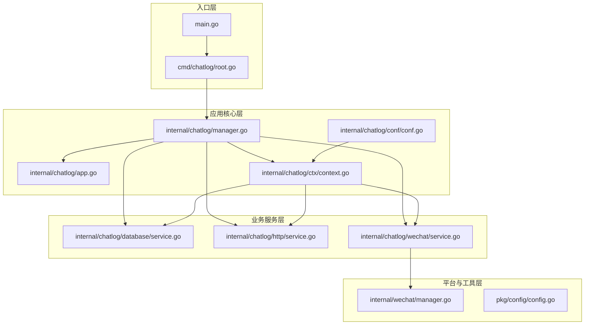
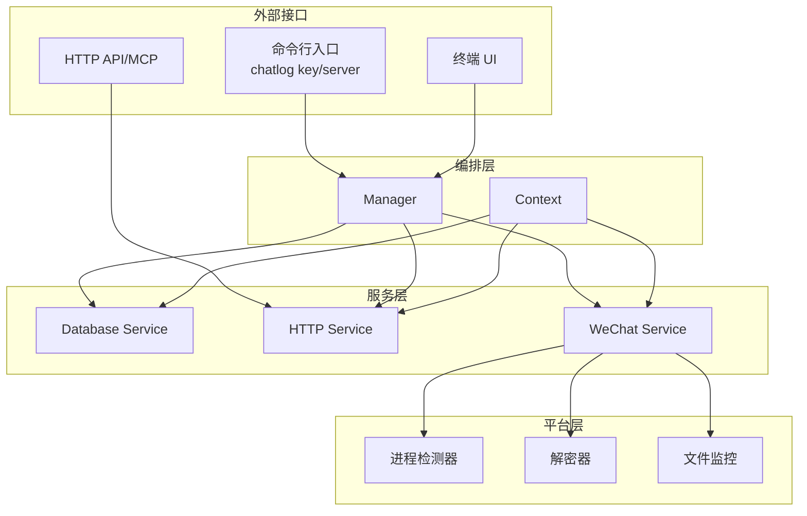
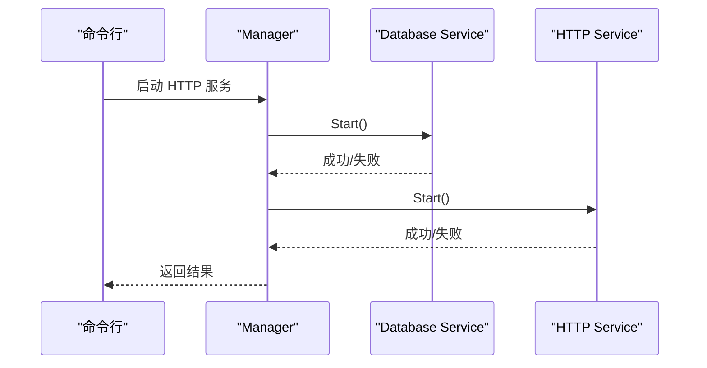
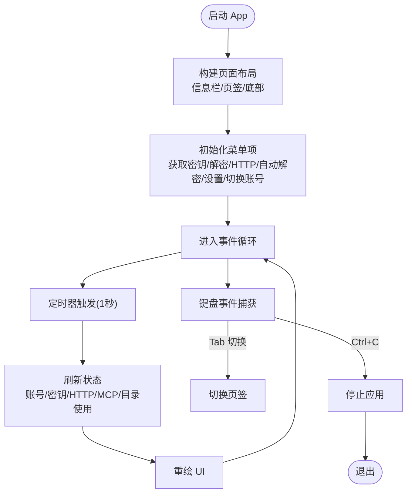
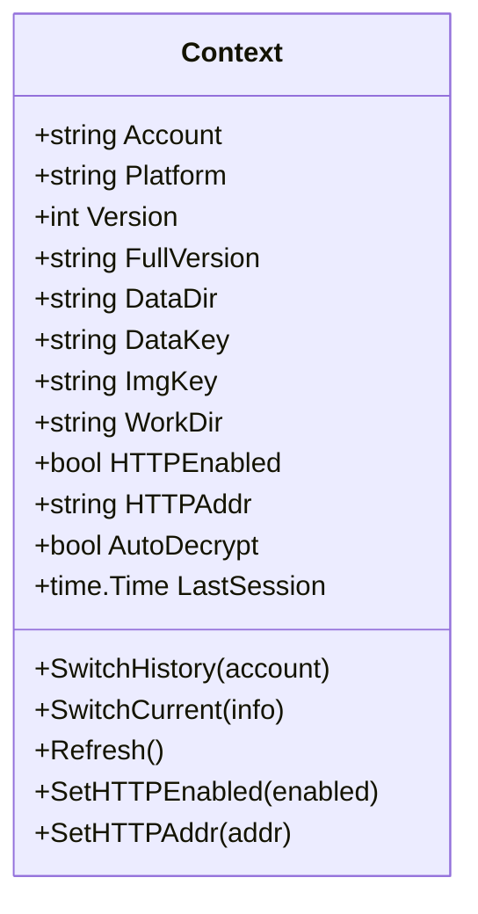
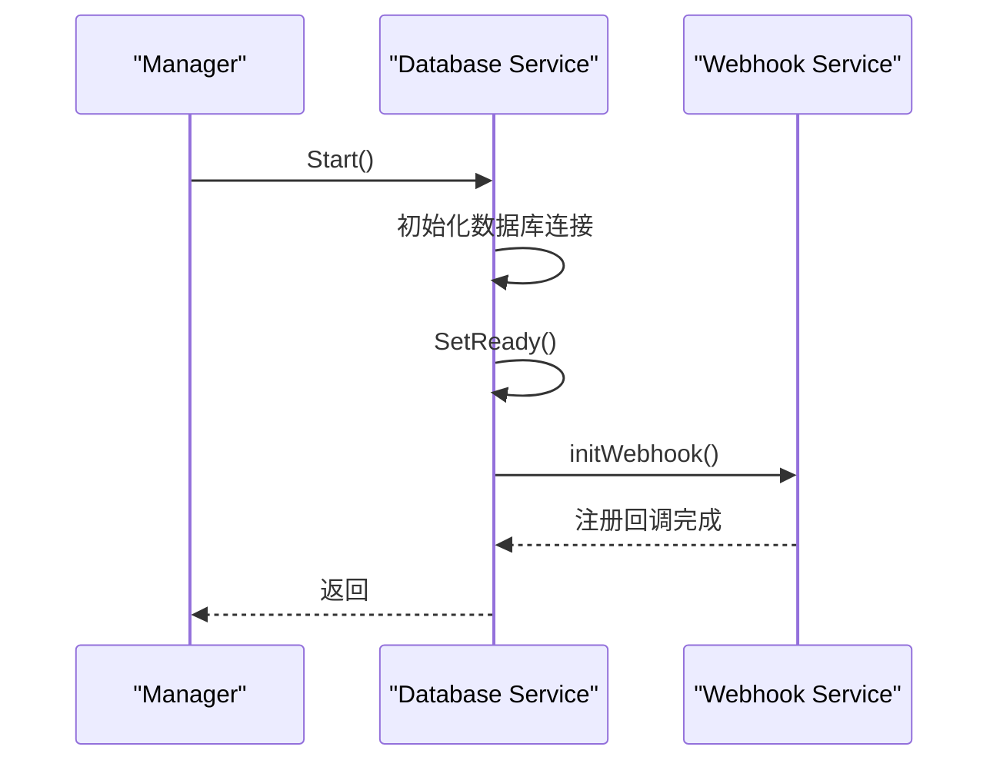
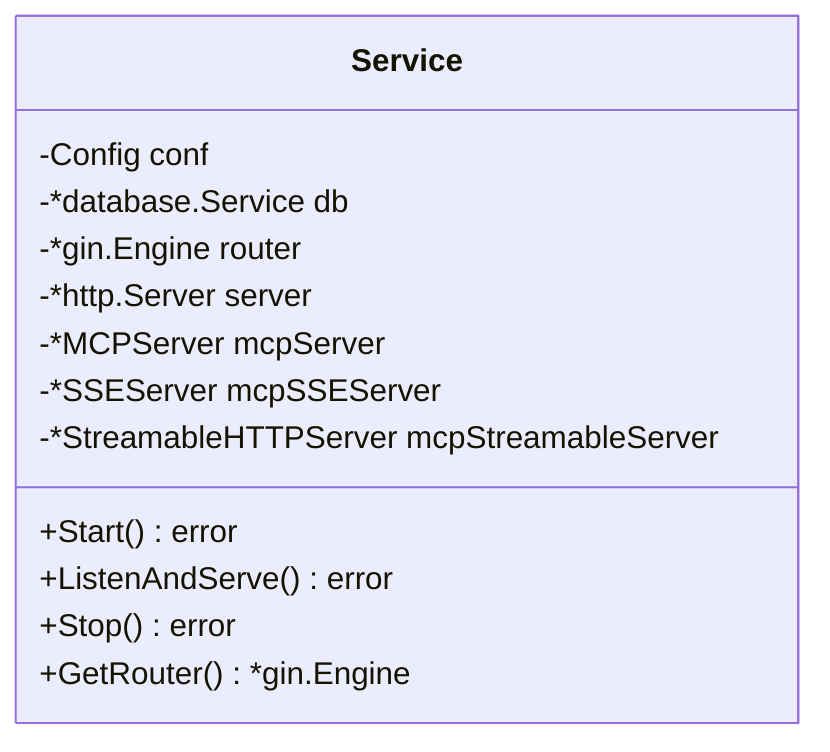
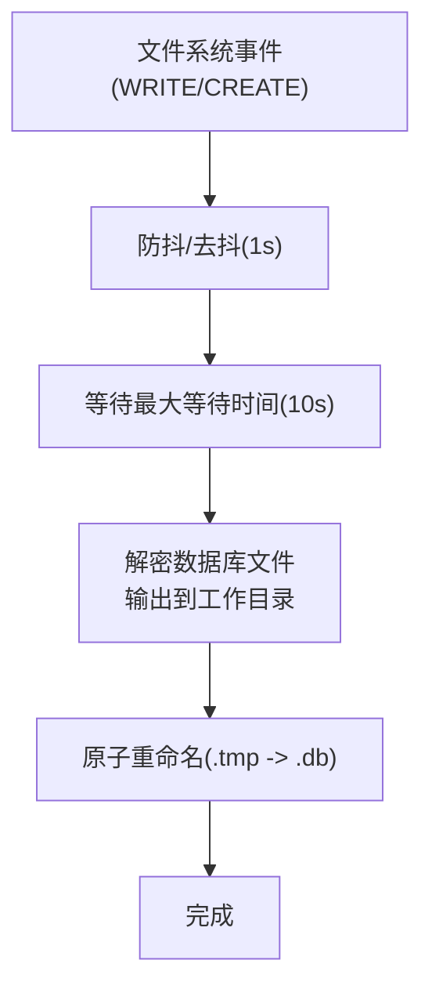
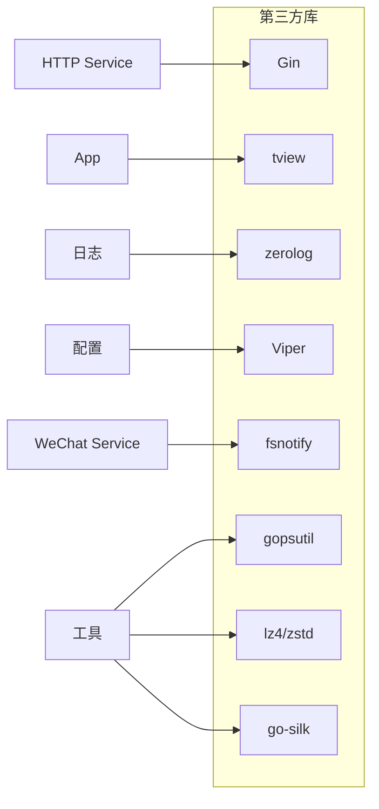

# 架构决策说明

<cite>
**本文档引用的文件**
- [main.go](file://main.go)
- [root.go](file://cmd/chatlog/root.go)
- [app.go](file://internal/chatlog/app.go)
- [manager.go](file://internal/chatlog/manager.go)
- [context.go](file://internal/chatlog/ctx/context.go)
- [conf.go](file://internal/chatlog/conf/conf.go)
- [service.go](file://internal/chatlog/database/service.go)
- [service.go](file://internal/chatlog/http/service.go)
- [service.go](file://internal/chatlog/wechat/service.go)
- [config.go](file://pkg/config/config.go)
- [manager.go](file://internal/wechat/manager.go)
- [go.mod](file://go.mod)
- [README.md](file://README.md)
</cite>

## 目录
1. [引言](#引言)
2. [项目结构](#项目结构)
3. [核心组件](#核心组件)
4. [架构总览](#架构总览)
5. [详细组件分析](#详细组件分析)
6. [依赖关系分析](#依赖关系分析)
7. [性能考量](#性能考量)
8. [故障排查指南](#故障排查指南)
9. [结论](#结论)
10. [附录](#附录)

## 引言
本文件面向 Chatlog 项目的架构决策进行系统性说明，重点阐述以下方面：
- 为什么采用服务导向架构（SOA）而非单体架构
- 如何在功能模块化与性能优化之间取得平衡
- 在不同平台（Windows/macOS）间如何实现代码复用
- 技术栈选择的原因（如 Go 语言、第三方库的评估标准）
- 架构演进过程中的权衡考虑（可维护性、性能、可扩展性）
- 架构决策的评估方法与未来调整方向

## 项目结构
Chatlog 采用分层与领域驱动相结合的组织方式：
- 应用入口与 CLI 层：main.go 与 cmd/chatlog 负责命令行入口与 Cobra 命令树
- 应用核心层：internal/chatlog 包含 App、Manager、Context、配置加载与服务编排
- 业务服务层：database、http、wechat 三大服务，分别负责数据库抽象、HTTP/MCP 服务、微信数据解密与监控
- 平台与工具层：internal/wechat 封装跨平台微信进程发现与密钥提取；pkg/config 提供统一配置管理
- UI 层：internal/ui 提供终端 UI 组件（菜单、表单、信息栏等）

**图表来源**
- [main.go](file://main.go#L1-L13)
- [root.go](file://cmd/chatlog/root.go#L1-L43)
- [app.go](file://internal/chatlog/app.go#L1-L843)
- [manager.go](file://internal/chatlog/manager.go#L1-L408)
- [context.go](file://internal/chatlog/ctx/context.go#L1-L304)
- [conf.go](file://internal/chatlog/conf/conf.go#L1-L106)
- [service.go](file://internal/chatlog/database/service.go#L1-L137)
- [service.go](file://internal/chatlog/http/service.go#L1-L113)
- [service.go](file://internal/chatlog/wechat/service.go#L1-L206)
- [manager.go](file://internal/wechat/manager.go#L1-L111)
- [config.go](file://pkg/config/config.go#L1-L160)

**章节来源**
- [main.go](file://main.go#L1-L13)
- [root.go](file://cmd/chatlog/root.go#L1-L43)
- [app.go](file://internal/chatlog/app.go#L1-L843)
- [manager.go](file://internal/chatlog/manager.go#L1-L408)
- [context.go](file://internal/chatlog/ctx/context.go#L1-L304)
- [conf.go](file://internal/chatlog/conf/conf.go#L1-L106)
- [service.go](file://internal/chatlog/database/service.go#L1-L137)
- [service.go](file://internal/chatlog/http/service.go#L1-L113)
- [service.go](file://internal/chatlog/wechat/service.go#L1-L206)
- [manager.go](file://internal/wechat/manager.go#L1-L111)
- [config.go](file://pkg/config/config.go#L1-L160)

## 核心组件
- 应用编排器（Manager）：负责服务生命周期管理（启动/停止）、服务间依赖顺序控制、状态协调与命令行模式适配
- 应用 UI（App）：基于 tview 的终端 UI，提供菜单、表单、信息栏与页签管理，定时刷新状态
- 上下文（Context）：集中管理账号、密钥、目录、HTTP/MCP 状态等全局配置与运行时状态
- 数据库服务（Database Service）：封装 wechatdb 数据库访问，提供消息、联系人、群聊、会话查询与 Webhook 回调注册
- HTTP/MCP 服务（HTTP Service）：基于 Gin 提供 REST API 与 MCP Streamable HTTP，内置中间件与 CORS
- 微信服务（WeChat Service）：封装微信进程发现、密钥提取、数据库文件解密与文件系统监控（防抖/去抖）
- 配置管理（Config Manager）：基于 Viper 的统一配置加载、环境变量映射与写回机制

**章节来源**
- [manager.go](file://internal/chatlog/manager.go#L21-L34)
- [app.go](file://internal/chatlog/app.go#L25-L43)
- [context.go](file://internal/chatlog/ctx/context.go#L21-L60)
- [service.go](file://internal/chatlog/database/service.go#L22-L43)
- [service.go](file://internal/chatlog/http/service.go#L16-L26)
- [service.go](file://internal/chatlog/wechat/service.go#L26-L40)
- [config.go](file://pkg/config/config.go#L38-L46)

## 架构总览
Chatlog 采用“服务导向架构 + 终端 UI”的混合形态：
- 服务导向：数据库、HTTP/MCP、微信解密与监控作为独立服务，通过 Manager 统一编排
- UI 与服务分离：UI 仅负责展示与交互，业务逻辑下沉至服务层，便于命令行模式与 Docker 部署
- 平台抽象：wechat 子模块屏蔽 Windows/macOS 的差异，统一接口对外暴露
- 配置统一：Viper 负责 JSON 配置与环境变量映射，支持 TUI 与服务模式双配置

**图表来源**
- [manager.go](file://internal/chatlog/manager.go#L40-L69)
- [app.go](file://internal/chatlog/app.go#L65-L89)
- [service.go](file://internal/chatlog/http/service.go#L33-L59)
- [service.go](file://internal/chatlog/wechat/service.go#L42-L48)
- [manager.go](file://internal/wechat/manager.go#L35-L49)

**章节来源**
- [manager.go](file://internal/chatlog/manager.go#L40-L69)
- [app.go](file://internal/chatlog/app.go#L65-L89)
- [service.go](file://internal/chatlog/http/service.go#L33-L59)
- [service.go](file://internal/chatlog/wechat/service.go#L42-L48)
- [manager.go](file://internal/wechat/manager.go#L35-L49)

## 详细组件分析

### 服务编排器（Manager）
- 职责：初始化 Context、构建各服务、按依赖顺序启动/停止服务、处理命令行模式
- 关键流程：
  - 运行模式：Run 中根据 HTTPEnabled 决定是否启动 HTTP 服务，随后启动 UI
  - 服务启动顺序：数据库 → HTTP，停止顺序相反
  - 账号切换：切换前后若服务处于启用状态则先停止再启动
  - 命令行模式：CommandKey/CommandDecrypt/CommandHTTPServer 分别处理密钥、解密、HTTP 服务启动

**图表来源**
- [manager.go](file://internal/chatlog/manager.go#L98-L120)
- [service.go](file://internal/chatlog/database/service.go#L45-L54)
- [service.go](file://internal/chatlog/http/service.go#L61-L78)

**章节来源**
- [manager.go](file://internal/chatlog/manager.go#L40-L69)
- [manager.go](file://internal/chatlog/manager.go#L98-L120)
- [manager.go](file://internal/chatlog/manager.go#L335-L407)

### 终端 UI（App）
- 职责：构建页面布局、菜单、表单与信息栏；定时刷新状态；响应键盘事件
- 关键点：
  - 定时刷新：每秒刷新一次，更新账号、密钥、HTTP/MCP 状态、目录使用情况
  - 菜单交互：支持获取密钥、解密数据、启动/停止 HTTP 服务、自动解密开关、设置与账号切换
  - 状态联动：菜单项名称与描述随 Context 状态动态变化

**图表来源**
- [app.go](file://internal/chatlog/app.go#L65-L89)
- [app.go](file://internal/chatlog/app.go#L135-L172)
- [app.go](file://internal/chatlog/app.go#L174-L200)

**章节来源**
- [app.go](file://internal/chatlog/app.go#L65-L89)
- [app.go](file://internal/chatlog/app.go#L135-L172)
- [app.go](file://internal/chatlog/app.go#L202-L460)

### 上下文（Context）
- 职责：集中存储与同步全局状态（账号、密钥、目录、HTTP/MCP、自动解密、微信实例）
- 设计要点：
  - 读写锁保护并发安全
  - 支持历史账号切换与当前实例刷新
  - 默认 HTTP 地址、环境变量映射由配置管理器提供

**图表来源**
- [context.go](file://internal/chatlog/ctx/context.go#L21-L60)
- [context.go](file://internal/chatlog/ctx/context.go#L85-L125)
- [context.go](file://internal/chatlog/ctx/context.go#L188-L200)

**章节来源**
- [context.go](file://internal/chatlog/ctx/context.go#L62-L77)
- [context.go](file://internal/chatlog/ctx/context.go#L85-L125)
- [context.go](file://internal/chatlog/ctx/context.go#L188-L200)

### 数据库服务（Database Service）
- 职责：封装 wechatdb 数据库连接、状态管理、Webhook 回调注册
- 关键点：
  - 状态机：初始化/解密中/就绪/错误
  - 查询接口：消息、联系人、群聊、会话、媒体
  - Webhook 初始化：在数据库就绪后注册回调

**图表来源**
- [service.go](file://internal/chatlog/database/service.go#L45-L54)
- [service.go](file://internal/chatlog/database/service.go#L111-L126)

**章节来源**
- [service.go](file://internal/chatlog/database/service.go#L45-L54)
- [service.go](file://internal/chatlog/database/service.go#L111-L126)

### HTTP/MCP 服务（HTTP Service）
- 职责：基于 Gin 提供 REST API 与 MCP Streamable HTTP，内置中间件与 CORS
- 关键点：
  - 中间件链：恢复、错误处理、日志、CORS
  - MCP 服务器：支持标准 MCP 与 SSE/Streamable HTTP
  - 优雅关闭：带超时的 Shutdown

**图表来源**
- [service.go](file://internal/chatlog/http/service.go#L16-L26)
- [service.go](file://internal/chatlog/http/service.go#L33-L59)
- [service.go](file://internal/chatlog/http/service.go#L91-L108)

**章节来源**
- [service.go](file://internal/chatlog/http/service.go#L33-L59)
- [service.go](file://internal/chatlog/http/service.go#L91-L108)

### 微信服务（WeChat Service）
- 职责：进程发现、密钥提取、数据库解密、文件系统监控（防抖/去抖）
- 关键点：
  - 文件监控：基于 fsnotify，对数据库文件写入/创建事件进行防抖处理
  - 解密流程：创建临时输出文件，解密后原子重命名
  - 平台抽象：通过 decrypt 包与 wechat 子模块屏蔽平台差异

**图表来源**
- [service.go](file://internal/chatlog/wechat/service.go#L97-L144)
- [service.go](file://internal/chatlog/wechat/service.go#L146-L184)

**章节来源**
- [service.go](file://internal/chatlog/wechat/service.go#L70-L95)
- [service.go](file://internal/chatlog/wechat/service.go#L97-L144)
- [service.go](file://internal/chatlog/wechat/service.go#L146-L184)

### 配置管理（Config Manager）
- 职责：统一配置加载、环境变量映射、默认值设置、配置写回
- 关键点：
  - 支持 TUI 与服务两种配置文件与环境变量前缀
  - 自动环境变量映射（点号转下划线）
  - 目录准备与配置读取失败时的安全写入

**章节来源**
- [config.go](file://pkg/config/config.go#L50-L93)
- [config.go](file://pkg/config/config.go#L95-L110)
- [config.go](file://pkg/config/config.go#L125-L135)

## 依赖关系分析
- 第三方库选择：
  - Web 框架：Gin（高性能 HTTP 框架，适合 REST API 与 MCP）
  - UI 框架：tview（纯 Go 终端 UI，跨平台）
  - 日志：zerolog（结构化日志，性能优异）
  - 配置：Viper（支持多格式配置与环境变量映射）
  - 进程与文件监控：fsnotify（跨平台文件事件）
  - 平台工具：gopsutil（系统信息采集）
  - 压缩与音频：lz4/zstd、go-silk（多媒体解码）
- 依赖注入与接口：
  - Service 层通过 Config 接口解耦配置来源（TUI/服务模式）
  - Manager 作为编排器，聚合服务并控制生命周期

**图表来源**
- [go.mod](file://go.mod#L5-L29)
- [service.go](file://internal/chatlog/http/service.go#L8-L14)
- [app.go](file://internal/chatlog/app.go#L17-L18)
- [service.go](file://internal/chatlog/wechat/service.go#L11-L18)

**章节来源**
- [go.mod](file://go.mod#L5-L29)
- [service.go](file://internal/chatlog/http/service.go#L8-L14)
- [app.go](file://internal/chatlog/app.go#L17-L18)
- [service.go](file://internal/chatlog/wechat/service.go#L11-L18)

## 性能考量
- 服务启动顺序与依赖：数据库先行，避免 HTTP 依赖空数据库导致的错误与重试
- UI 刷新节流：1 秒一次的定时刷新，降低 UI 渲染压力
- 文件监控防抖：1 秒防抖 + 最大等待 10 秒，减少频繁解密与 IO 压力
- 原子重命名：解密完成后临时文件重命名为最终文件，避免部分解密状态
- 压缩与解码：使用 lz4/zstd 与 go-silk 提升多媒体处理效率
- 优雅关闭：HTTP 服务使用带超时的 Shutdown，避免资源泄漏

**章节来源**
- [manager.go](file://internal/chatlog/manager.go#L98-L120)
- [app.go](file://internal/chatlog/app.go#L135-L172)
- [service.go](file://internal/chatlog/wechat/service.go#L21-L24)
- [service.go](file://internal/chatlog/wechat/service.go#L124-L144)
- [service.go](file://internal/chatlog/wechat/service.go#L158-L168)
- [service.go](file://internal/chatlog/http/service.go#L97-L107)

## 故障排查指南
- HTTP 服务启动失败：检查端口占用与权限；查看日志中间件输出；确认配置文件与环境变量
- 密钥获取失败：确认微信进程存在且具备权限；macOS 需临时关闭 SIP；Windows 建议使用 Windows Terminal
- 自动解密无响应：检查数据目录与工作目录权限；确认文件监控是否启动；查看防抖/去抖是否过长
- Docker 环境限制：Docker 内无法直接获取密钥，需在宿主机提前获取并挂载数据目录
- 配置读取失败：确认配置文件路径与权限；必要时启用写回配置以生成默认配置

**章节来源**
- [README.md](file://README.md#L93-L125)
- [README.md](file://README.md#L146-L177)
- [service.go](file://internal/chatlog/http/service.go#L61-L78)
- [service.go](file://internal/chatlog/wechat/service.go#L70-L95)

## 结论
Chatlog 的架构决策体现了以下核心取向：
- 服务导向：将数据库、HTTP/MCP、微信解密与监控抽象为独立服务，提升可维护性与可扩展性
- 平台复用：通过 wechat 子模块与 decrypt 包屏蔽平台差异，统一对外接口
- 性能与体验：通过防抖/去抖、定时刷新、优雅关闭与压缩解码等手段平衡性能与用户体验
- 可观测性：统一日志框架与中间件链，便于问题定位与运维

未来调整方向建议：
- 引入可观测性：增加指标导出（Prometheus）与分布式追踪（OpenTelemetry）
- 服务热插拔：进一步细化服务边界，支持按需启用/禁用服务
- 配置热更新：支持运行时配置变更与回滚
- 多租户与鉴权：在 HTTP 层引入鉴权与访问控制，满足企业级部署需求

## 附录
- 技术栈选择依据：
  - Go：并发模型与生态成熟度，适合网络服务与跨平台工具
  - Gin：简洁高效，适合 REST API 与 MCP
  - tview：纯 Go 终端 UI，跨平台一致性好
  - Viper：配置中心化与环境变量映射，适合 CLI 与容器化部署
  - fsnotify：文件事件监控，满足自动解密场景

**章节来源**
- [README.md](file://README.md#L17-L28)
- [go.mod](file://go.mod#L5-L29)