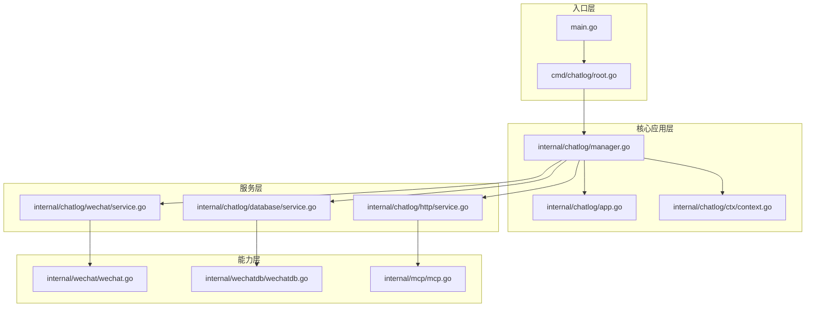
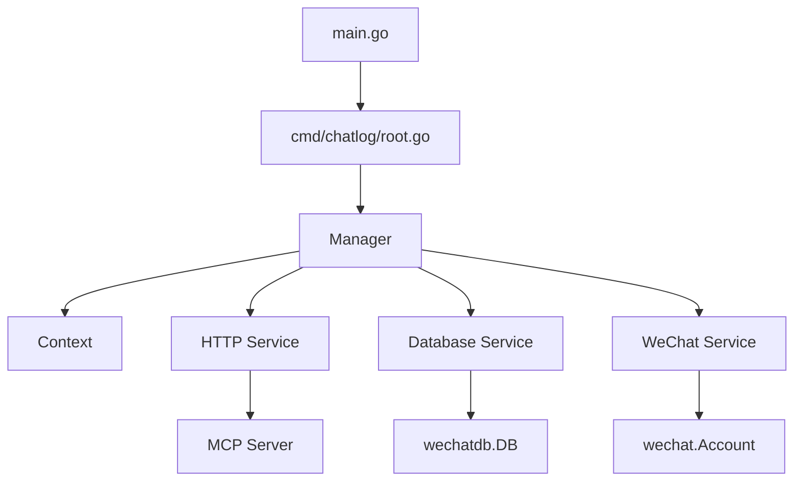
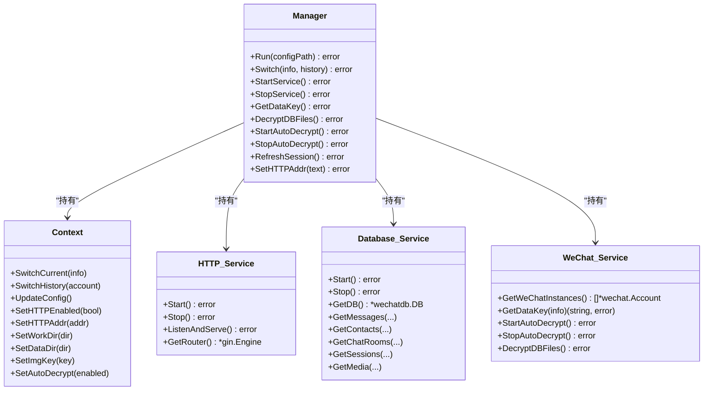
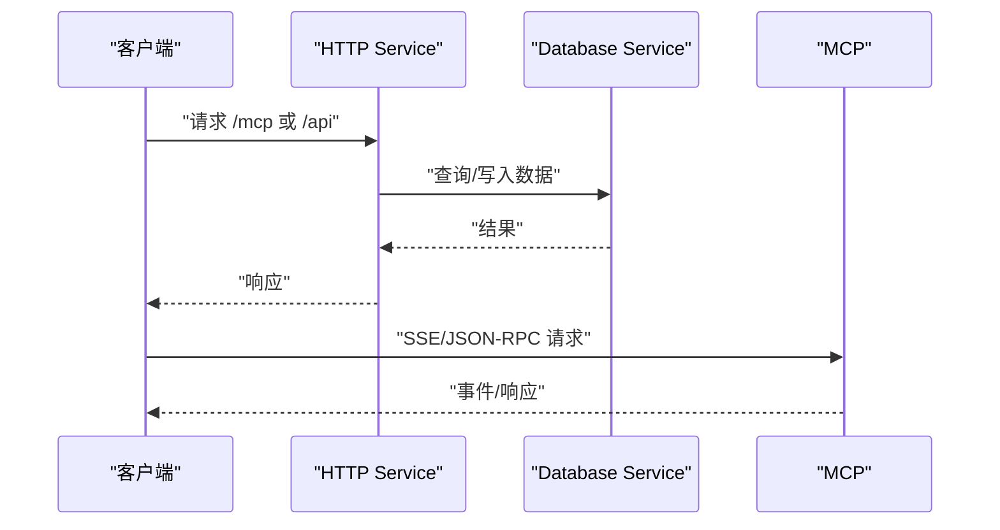
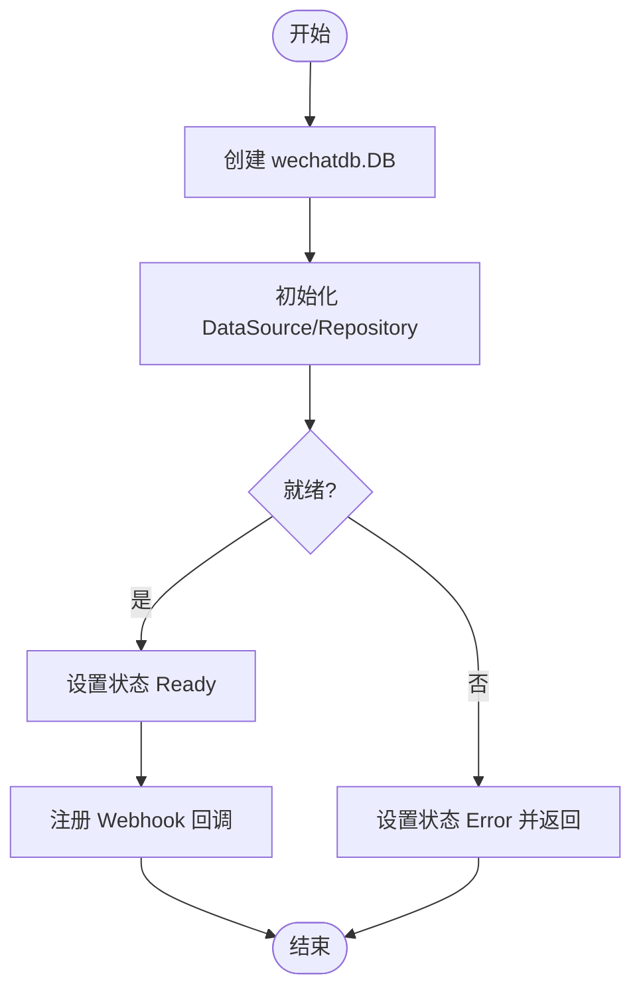
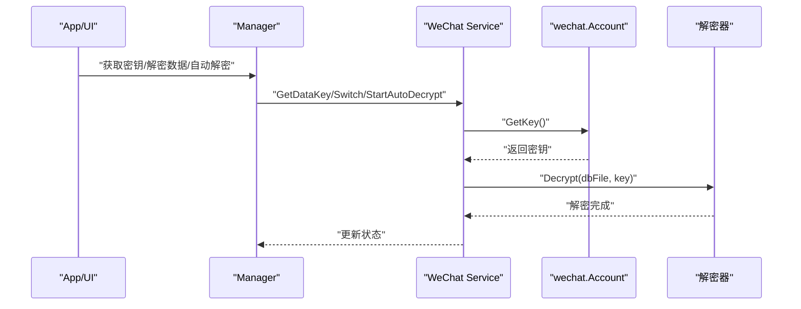
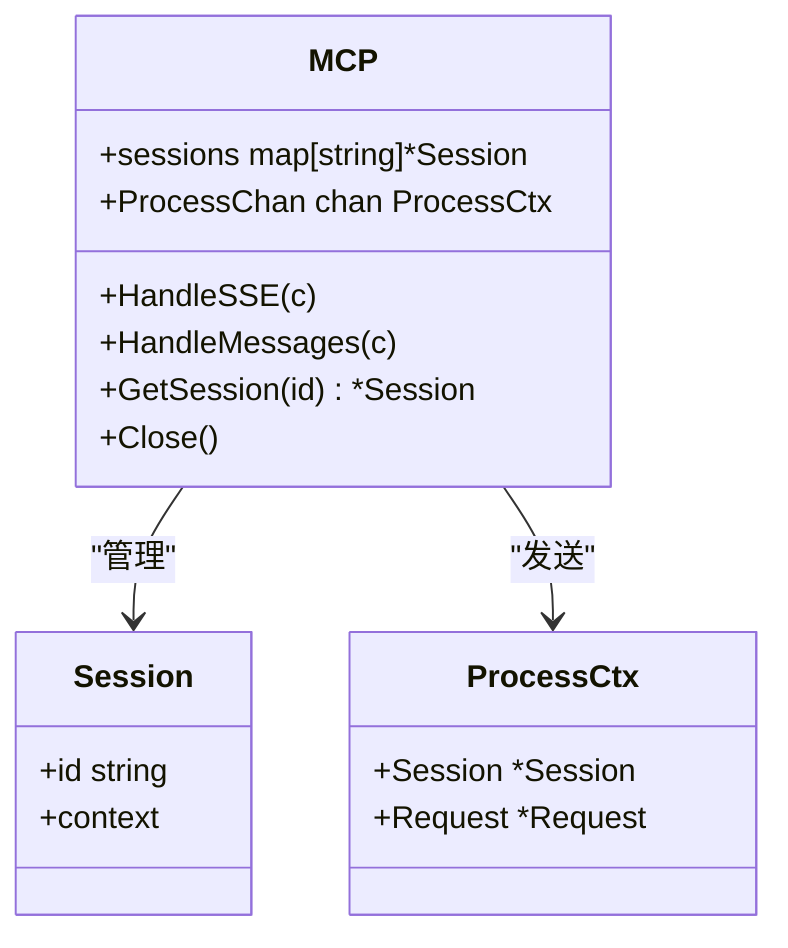
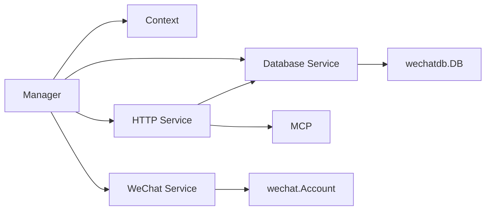

# 模块依赖关系

<cite>
**本文档引用的文件**
- [go.mod](file://go.mod)
- [main.go](file://main.go)
- [cmd/chatlog/root.go](file://cmd/chatlog/root.go)
- [internal/chatlog/app.go](file://internal/chatlog/app.go)
- [internal/chatlog/manager.go](file://internal/chatlog/manager.go)
- [internal/chatlog/ctx/context.go](file://internal/chatlog/ctx/context.go)
- [internal/chatlog/http/service.go](file://internal/chatlog/http/service.go)
- [internal/chatlog/database/service.go](file://internal/chatlog/database/service.go)
- [internal/chatlog/wechat/service.go](file://internal/chatlog/wechat/service.go)
- [internal/mcp/mcp.go](file://internal/mcp/mcp.go)
- [internal/wechat/wechat.go](file://internal/wechat/wechat.go)
- [internal/wechatdb/wechatdb.go](file://internal/wechatdb/wechatdb.go)
</cite>

## 目录
1. [简介](#简介)
2. [项目结构](#项目结构)
3. [核心组件](#核心组件)
4. [架构总览](#架构总览)
5. [详细组件分析](#详细组件分析)
6. [依赖关系分析](#依赖关系分析)
7. [性能考量](#性能考量)
8. [故障排查指南](#故障排查指南)
9. [结论](#结论)

## 简介
本文件聚焦 Chatlog 项目的模块依赖关系，系统梳理内部模块间（chatlog、wechat、wechatdb、mcp）的相互依赖与边界设计，解释如何通过接口抽象与依赖注入实现模块解耦，并总结依赖管理最佳实践、循环依赖规避策略、重构时的依赖处理方法以及模块升级与版本兼容性考虑。

## 项目结构
项目采用按功能域分层的组织方式：命令入口位于 cmd/chatlog，核心业务逻辑集中在 internal/chatlog，底层能力分布在 internal/wechat、internal/wechatdb、internal/mcp 等子模块；同时提供 pkg 层工具与配置管理。

图表来源
- [main.go](file://main.go#L1-L13)
- [cmd/chatlog/root.go](file://cmd/chatlog/root.go#L1-L43)
- [internal/chatlog/manager.go](file://internal/chatlog/manager.go#L1-L408)
- [internal/chatlog/app.go](file://internal/chatlog/app.go#L1-L843)
- [internal/chatlog/ctx/context.go](file://internal/chatlog/ctx/context.go#L1-L304)
- [internal/chatlog/http/service.go](file://internal/chatlog/http/service.go#L1-L113)
- [internal/chatlog/database/service.go](file://internal/chatlog/database/service.go#L1-L137)
- [internal/chatlog/wechat/service.go](file://internal/chatlog/wechat/service.go#L1-L206)
- [internal/wechat/wechat.go](file://internal/wechat/wechat.go#L1-L142)
- [internal/wechatdb/wechatdb.go](file://internal/wechatdb/wechatdb.go#L1-L132)
- [internal/mcp/mcp.go](file://internal/mcp/mcp.go#L1-L108)

章节来源
- [main.go](file://main.go#L1-L13)
- [cmd/chatlog/root.go](file://cmd/chatlog/root.go#L1-L43)

## 核心组件
- 应用入口与命令行：main 调用 cmd/chatlog 执行根命令，初始化日志与运行 Manager。
- Manager：应用编排者，负责 Context 初始化、服务启动顺序控制、HTTP 与数据库服务生命周期管理、自动解密与密钥获取等。
- App：终端 UI，负责菜单、状态栏、标签页与刷新逻辑，调用 Manager 执行业务动作。
- Context：全局状态容器，封装账号、密钥、目录、HTTP 与自动解密状态，并持久化配置。
- HTTP 服务：基于 Gin 的 Web 服务，集成 MCP 子协议服务，路由与中间件由 Service 统一管理。
- 数据库服务：封装 wechatdb.DB，负责状态机、Webhook 回调注册与资源清理。
- 微信服务：封装 wechat.Account 能力，提供密钥提取、数据库解密、文件监控与自动解密。
- wechatdb：数据库访问层，按平台与版本选择数据源与仓库实现。
- wechat：微信进程检测、密钥提取器与解密器工厂，面向 Account 的统一接口。
- mcp：Model Context Protocol 服务端基础设施，提供会话管理与消息处理通道。

章节来源
- [internal/chatlog/manager.go](file://internal/chatlog/manager.go#L1-L408)
- [internal/chatlog/app.go](file://internal/chatlog/app.go#L1-L843)
- [internal/chatlog/ctx/context.go](file://internal/chatlog/ctx/context.go#L1-L304)
- [internal/chatlog/http/service.go](file://internal/chatlog/http/service.go#L1-L113)
- [internal/chatlog/database/service.go](file://internal/chatlog/database/service.go#L1-L137)
- [internal/chatlog/wechat/service.go](file://internal/chatlog/wechat/service.go#L1-L206)
- [internal/wechatdb/wechatdb.go](file://internal/wechatdb/wechatdb.go#L1-L132)
- [internal/wechat/wechat.go](file://internal/wechat/wechat.go#L1-L142)
- [internal/mcp/mcp.go](file://internal/mcp/mcp.go#L1-L108)

## 架构总览
整体采用“入口 -> 编排 -> 服务 -> 能力”的分层架构。Manager 作为编排中心，按依赖顺序启动/停止 HTTP 与数据库服务；App 作为 UI 入口，通过 Manager 触发业务流程；能力层（wechat、wechatdb、mcp）通过接口抽象与工厂模式向服务层暴露能力。

图表来源
- [main.go](file://main.go#L1-L13)
- [cmd/chatlog/root.go](file://cmd/chatlog/root.go#L1-L43)
- [internal/chatlog/manager.go](file://internal/chatlog/manager.go#L1-L408)
- [internal/chatlog/http/service.go](file://internal/chatlog/http/service.go#L1-L113)
- [internal/chatlog/database/service.go](file://internal/chatlog/database/service.go#L1-L137)
- [internal/chatlog/wechat/service.go](file://internal/chatlog/wechat/service.go#L1-L206)
- [internal/wechatdb/wechatdb.go](file://internal/wechatdb/wechatdb.go#L1-L132)
- [internal/wechat/wechat.go](file://internal/wechat/wechat.go#L1-L142)
- [internal/mcp/mcp.go](file://internal/mcp/mcp.go#L1-L108)

## 详细组件分析

### Manager 组件分析
- 职责：应用生命周期编排、服务依赖顺序管理、状态切换与配置更新。
- 关键点：
  - 依赖注入：在 Run 中按顺序创建 Context、WeChat Service、Database Service、HTTP Service，并在 Switch 时根据状态决定是否重启服务。
  - 启停顺序：StartService 先启动数据库，再启动 HTTP；StopService 反向停止。
  - 业务编排：GetDataKey、DecryptDBFiles、StartAutoDecrypt、StopAutoDecrypt 等均委托给对应服务。

图表来源
- [internal/chatlog/manager.go](file://internal/chatlog/manager.go#L1-L408)
- [internal/chatlog/ctx/context.go](file://internal/chatlog/ctx/context.go#L1-L304)
- [internal/chatlog/http/service.go](file://internal/chatlog/http/service.go#L1-L113)
- [internal/chatlog/database/service.go](file://internal/chatlog/database/service.go#L1-L137)
- [internal/chatlog/wechat/service.go](file://internal/chatlog/wechat/service.go#L1-L206)

章节来源
- [internal/chatlog/manager.go](file://internal/chatlog/manager.go#L1-L408)
- [internal/chatlog/ctx/context.go](file://internal/chatlog/ctx/context.go#L1-L304)

### HTTP 服务组件分析
- 职责：提供 Web API 与 MCP 协议支持，集成 CORS、日志与错误处理中间件。
- 关键点：
  - 依赖注入：构造函数接收 Config 与 Database Service，确保运行期只依赖接口。
  - 生命周期：Start/ListenAndServe/Stop 提供优雅启停。
  - MCP 集成：通过 mark3labs/mcp-go 初始化 SSE 与可流式 HTTP 服务器。

图表来源
- [internal/chatlog/http/service.go](file://internal/chatlog/http/service.go#L1-L113)
- [internal/mcp/mcp.go](file://internal/mcp/mcp.go#L1-L108)
- [internal/chatlog/database/service.go](file://internal/chatlog/database/service.go#L1-L137)

章节来源
- [internal/chatlog/http/service.go](file://internal/chatlog/http/service.go#L1-L113)
- [internal/mcp/mcp.go](file://internal/mcp/mcp.go#L1-L108)

### 数据库服务组件分析
- 职责：封装 wechatdb.DB，提供状态机与 Webhook 注册，屏蔽具体数据源差异。
- 关键点：
  - 状态机：Init/Decrypting/Ready/Error，配合 UI 与业务流程反馈。
  - Webhook：在 Start 时注册回调，Stop 时取消。
  - 适配层：向上暴露统一接口，向下对接 wechatdb 的 DataSource 与 Repository。

图表来源
- [internal/chatlog/database/service.go](file://internal/chatlog/database/service.go#L1-L137)
- [internal/wechatdb/wechatdb.go](file://internal/wechatdb/wechatdb.go#L1-L132)

章节来源
- [internal/chatlog/database/service.go](file://internal/chatlog/database/service.go#L1-L137)
- [internal/wechatdb/wechatdb.go](file://internal/wechatdb/wechatdb.go#L1-L132)

### 微信服务组件分析
- 职责：封装微信进程检测、密钥提取、数据库解密与文件监控。
- 关键点：
  - 抽象接口：Config 暴露 GetDataKey/DataDir/WorkDir/Platform/Version，便于注入不同配置源。
  - 文件监控：基于 fsnotify 与 debounce 机制，避免频繁触发。
  - 解密流程：根据平台与版本选择解密器，输出到工作目录。

图表来源
- [internal/chatlog/wechat/service.go](file://internal/chatlog/wechat/service.go#L1-L206)
- [internal/wechat/wechat.go](file://internal/wechat/wechat.go#L1-L142)

章节来源
- [internal/chatlog/wechat/service.go](file://internal/chatlog/wechat/service.go#L1-L206)
- [internal/wechat/wechat.go](file://internal/wechat/wechat.go#L1-L142)

### MCP 组件分析
- 职责：提供 Model Context Protocol 的服务端能力，包括会话管理与消息处理通道。
- 关键点：
  - 会话管理：基于 UUID 生成会话 ID，维护会话集合。
  - 消息处理：从 HTTP 查询参数/路径参数解析 session_id，校验后投递到 ProcessChan。
  - 并发安全：使用互斥锁保护会话集合。

图表来源
- [internal/mcp/mcp.go](file://internal/mcp/mcp.go#L1-L108)

章节来源
- [internal/mcp/mcp.go](file://internal/mcp/mcp.go#L1-L108)

## 依赖关系分析
- 模块边界设计原则
  - 接口优先：各服务通过 Config 接口注入配置，避免硬编码依赖。
  - 依赖倒置：上层（Manager/App）仅依赖抽象接口，具体实现由下层提供。
  - 分层清晰：入口 -> 编排 -> 服务 -> 能力，职责单一，耦合度低。
- 内部模块依赖
  - Manager 依赖 Context、HTTP Service、Database Service、WeChat Service。
  - HTTP Service 依赖 Database Service 与 MCP。
  - Database Service 依赖 wechatdb.DB。
  - WeChat Service 依赖 wechat.Account 与解密器工厂。
  - wechatdb 依赖 DataSource 与 Repository。
- 外部依赖
  - go.mod 中声明第三方库，如 Gin、Zerolog、fsnotify、SQLite 驱动等。

图表来源
- [internal/chatlog/manager.go](file://internal/chatlog/manager.go#L1-L408)
- [internal/chatlog/http/service.go](file://internal/chatlog/http/service.go#L1-L113)
- [internal/chatlog/database/service.go](file://internal/chatlog/database/service.go#L1-L137)
- [internal/chatlog/wechat/service.go](file://internal/chatlog/wechat/service.go#L1-L206)
- [internal/wechatdb/wechatdb.go](file://internal/wechatdb/wechatdb.go#L1-L132)
- [internal/wechat/wechat.go](file://internal/wechat/wechat.go#L1-L142)
- [internal/mcp/mcp.go](file://internal/mcp/mcp.go#L1-L108)

章节来源
- [go.mod](file://go.mod#L1-L82)
- [internal/chatlog/manager.go](file://internal/chatlog/manager.go#L1-L408)

## 性能考量
- 启停顺序优化：先启动数据库，再启动 HTTP，避免 HTTP 访问空数据库导致失败重试。
- 文件监控去抖：WeChat Service 对同一文件的多次事件进行去抖与最大等待时间限制，降低解密频率。
- 并发通道：MCP 使用带缓冲通道处理请求，防止阻塞请求线程。
- 状态机：Database Service 的状态机避免 UI 与业务误判，减少无效操作。

## 故障排查指南
- HTTP 服务无法启动
  - 检查端口占用与权限，确认 Context 中 HTTPAddr 配置正确。
  - 查看 HTTP Service 的启动日志与错误中间件输出。
- 数据库未就绪
  - 确认 Database Service 的状态为 Ready；若为 Error，查看错误消息并检查工作目录与密钥配置。
- 自动解密无效
  - 确认已获取数据密钥且工作目录已设置；检查文件监控是否启动与回调注册是否成功。
- MCP 会话异常
  - 校验 session_id 参数格式；检查会话是否存在与 ProcessChan 是否被阻塞。

章节来源
- [internal/chatlog/http/service.go](file://internal/chatlog/http/service.go#L1-L113)
- [internal/chatlog/database/service.go](file://internal/chatlog/database/service.go#L1-L137)
- [internal/chatlog/wechat/service.go](file://internal/chatlog/wechat/service.go#L1-L206)
- [internal/mcp/mcp.go](file://internal/mcp/mcp.go#L1-L108)

## 结论
本项目通过接口抽象与依赖注入实现了良好的模块解耦：Manager 作为编排中心，按依赖顺序管理服务生命周期；HTTP 与 Database 服务通过接口隔离具体实现；能力层以工厂与抽象接口对外暴露能力。建议在后续演进中持续坚持接口优先、分层清晰的原则，结合单元测试与集成测试保障模块升级与版本兼容性。