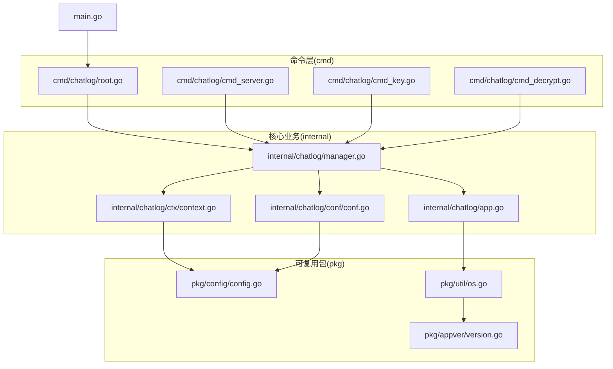
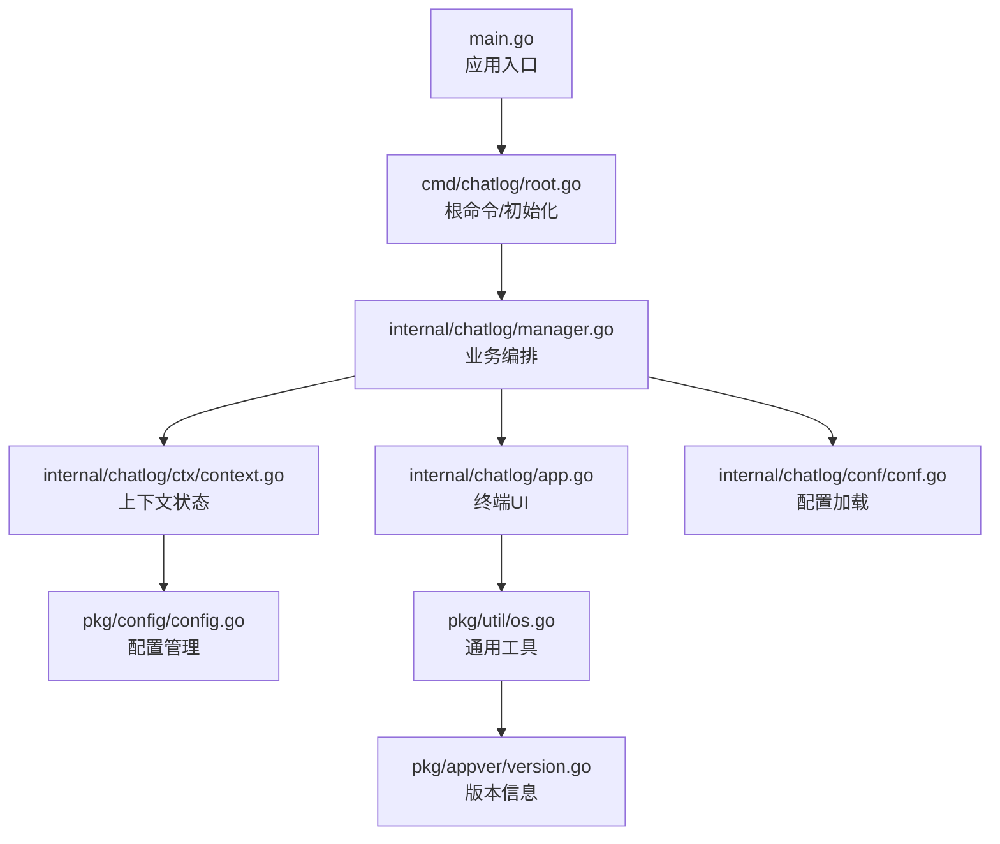
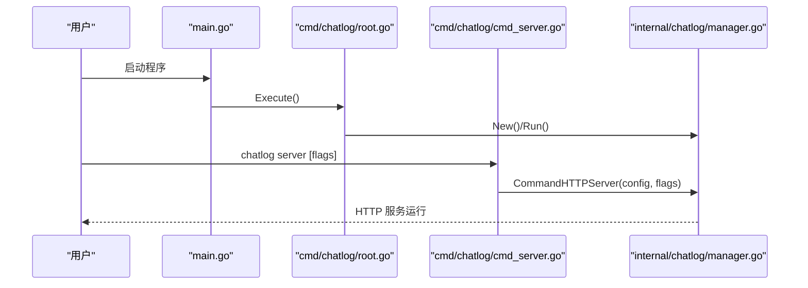
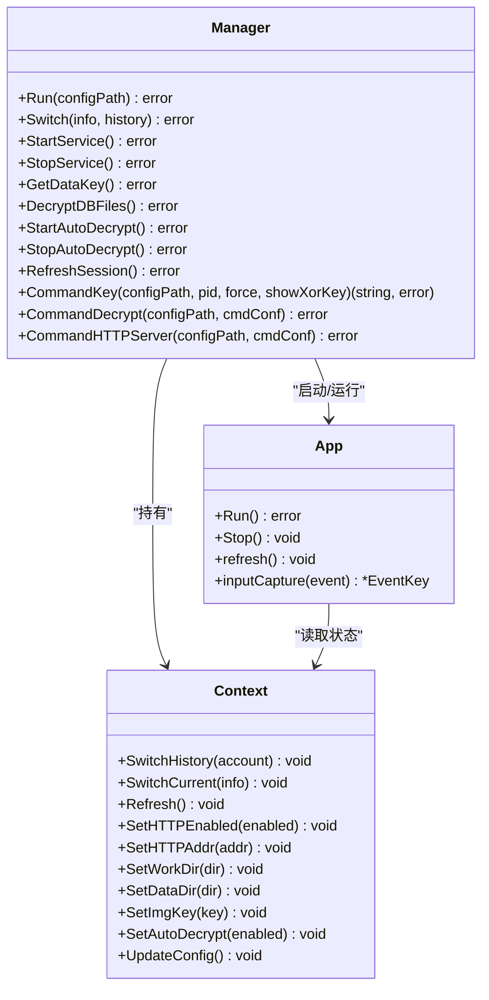
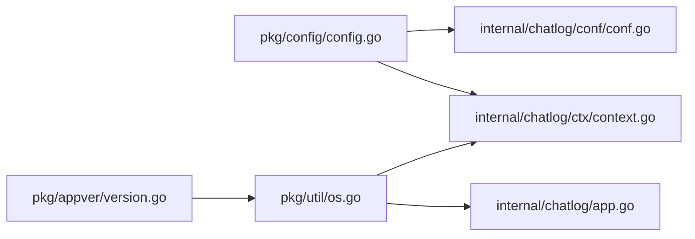
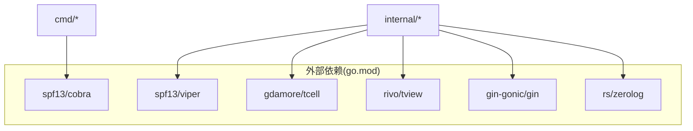

# 目录结构组织

<cite>
**本文引用的文件**
- [main.go](file://main.go)
- [root.go](file://cmd/chatlog/root.go)
- [cmd_server.go](file://cmd/chatlog/cmd_server.go)
- [cmd_key.go](file://cmd/chatlog/cmd_key.go)
- [cmd_decrypt.go](file://cmd/chatlog/cmd_decrypt.go)
- [app.go](file://internal/chatlog/app.go)
- [manager.go](file://internal/chatlog/manager.go)
- [context.go](file://internal/chatlog/ctx/context.go)
- [conf.go](file://internal/chatlog/conf/conf.go)
- [config.go](file://pkg/config/config.go)
- [os.go](file://pkg/util/os.go)
- [version.go](file://pkg/appver/version.go)
- [go.mod](file://go.mod)
- [README.md](file://README.md)
</cite>

## 目录索引
1. [简介](#简介)
2. [项目结构](#项目结构)
3. [核心组件](#核心组件)
4. [架构总览](#架构总览)
5. [组件详解](#组件详解)
6. [依赖关系分析](#依赖关系分析)
7. [性能考量](#性能考量)
8. [故障排查指南](#故障排查指南)
9. [结论](#结论)
10. [附录](#附录)

## 简介
本文件系统性阐述 Chatlog 项目的目录结构组织理念与最佳实践，重点说明：
- internal 目录用于存放核心业务逻辑与领域模型，保证对外部不可见，便于稳定演进与边界清晰
- pkg 目录用于存放可复用的通用包，强调“可导入、可测试、可独立发布”的原则
- cmd 目录用于存放命令行入口与子命令，遵循“单一职责、最小暴露”的原则
- 通过清晰的职责划分与模块化设计，实现高内聚、低耦合与强复用

## 项目结构
项目采用标准 Go 模块化布局，结合功能域与层次化的目录组织，形成“命令入口 → 核心业务 → 可复用包”的清晰层级。

**图示来源**
- [main.go](file://main.go#L1-L13)
- [root.go](file://cmd/chatlog/root.go#L1-L43)
- [cmd_server.go](file://cmd/chatlog/cmd_server.go#L1-L79)
- [cmd_key.go](file://cmd/chatlog/cmd_key.go#L1-L37)
- [cmd_decrypt.go](file://cmd/chatlog/cmd_decrypt.go#L1-L64)
- [app.go](file://internal/chatlog/app.go#L1-L843)
- [manager.go](file://internal/chatlog/manager.go#L1-L408)
- [context.go](file://internal/chatlog/ctx/context.go#L1-L304)
- [conf.go](file://internal/chatlog/conf/conf.go#L1-L106)
- [config.go](file://pkg/config/config.go#L1-L160)
- [os.go](file://pkg/util/os.go#L1-L136)
- [version.go](file://pkg/appver/version.go#L1-L26)

**章节来源**
- [main.go](file://main.go#L1-L13)
- [root.go](file://cmd/chatlog/root.go#L1-L43)
- [cmd_server.go](file://cmd/chatlog/cmd_server.go#L1-L79)
- [cmd_key.go](file://cmd/chatlog/cmd_key.go#L1-L37)
- [cmd_decrypt.go](file://cmd/chatlog/cmd_decrypt.go#L1-L64)
- [app.go](file://internal/chatlog/app.go#L1-L843)
- [manager.go](file://internal/chatlog/manager.go#L1-L408)
- [context.go](file://internal/chatlog/ctx/context.go#L1-L304)
- [conf.go](file://internal/chatlog/conf/conf.go#L1-L106)
- [config.go](file://pkg/config/config.go#L1-L160)
- [os.go](file://pkg/util/os.go#L1-L136)
- [version.go](file://pkg/appver/version.go#L1-L26)

## 核心组件
- 命令入口与 CLI 子命令
  - main.go 作为唯一入口，委托 cmd/chatlog 执行
  - root.go 定义根命令、全局标志与初始化流程
  - server/key/decrypt 子命令分别封装不同运行模式
- 核心业务
  - Manager 统筹上下文、服务与 UI 生命周期
  - App 提供终端 UI 的页面与交互
  - Context 统一管理账号、目录、密钥、HTTP 与自动解密状态
  - conf 负责 TUI 与服务配置加载与合并
- 可复用包
  - config 提供配置文件读写、环境变量映射与默认值注入
  - util 提供通用工具函数（目录扫描、字节单位转换、默认工作目录等）
  - appver 提供应用版本信息结构体与初始化

**章节来源**
- [main.go](file://main.go#L1-L13)
- [root.go](file://cmd/chatlog/root.go#L1-L43)
- [cmd_server.go](file://cmd/chatlog/cmd_server.go#L1-L79)
- [cmd_key.go](file://cmd/chatlog/cmd_key.go#L1-L37)
- [cmd_decrypt.go](file://cmd/chatlog/cmd_decrypt.go#L1-L64)
- [manager.go](file://internal/chatlog/manager.go#L1-L408)
- [app.go](file://internal/chatlog/app.go#L1-L843)
- [context.go](file://internal/chatlog/ctx/context.go#L1-L304)
- [conf.go](file://internal/chatlog/conf/conf.go#L1-L106)
- [config.go](file://pkg/config/config.go#L1-L160)
- [os.go](file://pkg/util/os.go#L1-L136)
- [version.go](file://pkg/appver/version.go#L1-L26)

## 架构总览
整体采用“命令层 → 业务管理层 → 领域服务层 → 可复用包”的分层架构，命令层仅负责参数解析与流程编排；业务管理层负责状态管理与服务编排；领域服务层负责具体功能（数据库、HTTP、微信解密等）；可复用包提供跨模块共享能力。

**图示来源**
- [main.go](file://main.go#L1-L13)
- [root.go](file://cmd/chatlog/root.go#L1-L43)
- [manager.go](file://internal/chatlog/manager.go#L1-L408)
- [app.go](file://internal/chatlog/app.go#L1-L843)
- [context.go](file://internal/chatlog/ctx/context.go#L1-L304)
- [conf.go](file://internal/chatlog/conf/conf.go#L1-L106)
- [config.go](file://pkg/config/config.go#L1-L160)
- [os.go](file://pkg/util/os.go#L1-L136)
- [version.go](file://pkg/appver/version.go#L1-L26)

## 组件详解

### 命令层（cmd）
- root.go
  - 定义根命令、持久化标志与日志初始化
  - 将执行委托给 internal/chatlog.New() 与 Run()
- server/key/decrypt
  - server：解析服务模式所需参数，调用 Manager.CommandHTTPServer
  - key：解析 PID、强制获取与 XOR 密钥展示，调用 Manager.CommandKey
  - decrypt：解析平台、版本、数据目录、密钥与工作目录，调用 Manager.CommandDecrypt

**图示来源**
- [main.go](file://main.go#L1-L13)
- [root.go](file://cmd/chatlog/root.go#L1-L43)
- [cmd_server.go](file://cmd/chatlog/cmd_server.go#L1-L79)
- [manager.go](file://internal/chatlog/manager.go#L335-L408)

**章节来源**
- [root.go](file://cmd/chatlog/root.go#L1-L43)
- [cmd_server.go](file://cmd/chatlog/cmd_server.go#L1-L79)
- [cmd_key.go](file://cmd/chatlog/cmd_key.go#L1-L37)
- [cmd_decrypt.go](file://cmd/chatlog/cmd_decrypt.go#L1-L64)

### 业务管理层（internal/chatlog）
- Manager
  - 负责上下文初始化、服务生命周期（数据库、HTTP、微信）、UI 启动与状态切换
  - 提供命令模式下的专用方法（CommandKey、CommandDecrypt、CommandHTTPServer）
- App
  - 基于 tview 构建终端 UI，包含菜单、帮助、信息栏与页签
  - 负责刷新周期、菜单项状态更新与用户交互
- Context
  - 统一管理账号、平台、版本、数据/工作目录、密钥、HTTP 地址、自动解密与最后会话时间
  - 提供线程安全的状态更新与配置落盘
- conf
  - TUI 配置与服务配置的加载、默认值注入与环境变量覆盖
  - 支持从数据目录读取 chatlog.json 作为部分配置源

**图示来源**
- [manager.go](file://internal/chatlog/manager.go#L1-L408)
- [app.go](file://internal/chatlog/app.go#L1-L843)
- [context.go](file://internal/chatlog/ctx/context.go#L1-L304)

**章节来源**
- [manager.go](file://internal/chatlog/manager.go#L1-L408)
- [app.go](file://internal/chatlog/app.go#L1-L843)
- [context.go](file://internal/chatlog/ctx/context.go#L1-L304)
- [conf.go](file://internal/chatlog/conf/conf.go#L1-L106)

### 可复用包（pkg）
- config
  - 提供配置文件读写、环境变量映射、默认值注入与目录准备
  - 支持按应用名、路径、名称与环境前缀初始化
- util
  - 文件扫描、目录大小统计、字节单位转换、默认工作目录生成、目录准备
- appver
  - 应用版本信息结构体与初始化接口

**图示来源**
- [config.go](file://pkg/config/config.go#L1-L160)
- [os.go](file://pkg/util/os.go#L1-L136)
- [version.go](file://pkg/appver/version.go#L1-L26)
- [context.go](file://internal/chatlog/ctx/context.go#L1-L304)
- [conf.go](file://internal/chatlog/conf/conf.go#L1-L106)
- [app.go](file://internal/chatlog/app.go#L1-L843)

**章节来源**
- [config.go](file://pkg/config/config.go#L1-L160)
- [os.go](file://pkg/util/os.go#L1-L136)
- [version.go](file://pkg/appver/version.go#L1-L26)

## 依赖关系分析
- 内部依赖
  - internal/chatlog 依赖 internal/chatlog/conf、internal/chatlog/ctx、internal/chatlog/database、internal/chatlog/http、internal/chatlog/wechat、pkg/config、pkg/util
  - internal/chatlog/app 依赖 internal/ui/* 与 internal/chatlog/ctx
- 外部依赖
  - go.mod 中声明了大量外部库，涵盖 UI、HTTP、日志、压缩、序列化、系统工具等
- 耦合与内聚
  - cmd 层与 internal 层通过接口清晰分离，内部模块围绕 Manager 与 Context 聚合
  - pkg 层提供纯函数与无副作用的工具，降低业务层复杂度

**图示来源**
- [go.mod](file://go.mod#L1-L82)

**章节来源**
- [go.mod](file://go.mod#L1-L82)

## 性能考量
- UI 刷新与状态更新
  - App.refresh 以固定周期轮询，仅在 HTTP 或自动解密启用时刷新，避免不必要的计算
- 数据库与 HTTP 启停顺序
  - Manager 按依赖顺序启动/停止服务，减少资源竞争与异常传播
- 目录扫描与 IO
  - util 提供目录扫描与大小统计，建议在后台协程执行，避免阻塞 UI
- 配置加载
  - config 支持环境变量与文件混合，优先级明确，减少重复解析成本

[本节为通用指导，无需列出具体文件来源]

## 故障排查指南
- 常见问题定位
  - 命令执行失败：检查 cmd/* 的错误日志输出与返回码
  - HTTP 服务启动失败：检查 Manager.StartService/stopService 的依赖链路
  - 密钥获取失败：检查 Manager.CommandKey 的进程选择与权限
  - 配置读取失败：检查 pkg/config 的配置路径、文件存在性与权限
- 日志与调试
  - root.go 与各命令均使用 zerolog 输出错误日志，便于定位
  - 可通过 --debug 标志开启详细日志

**章节来源**
- [root.go](file://cmd/chatlog/root.go#L1-L43)
- [cmd_server.go](file://cmd/chatlog/cmd_server.go#L1-L79)
- [cmd_key.go](file://cmd/chatlog/cmd_key.go#L1-L37)
- [cmd_decrypt.go](file://cmd/chatlog/cmd_decrypt.go#L1-L64)
- [manager.go](file://internal/chatlog/manager.go#L1-L408)
- [config.go](file://pkg/config/config.go#L1-L160)

## 结论
本项目通过 cmd/internal/pkg 的清晰分层与职责划分，实现了：
- 命令层最小化、业务层集中化、工具层可复用
- 以 Manager/Context 为核心的状态与流程控制
- 以 pkg/config 与 pkg/util 为代表的跨模块共享能力
遵循该结构与最佳实践，可高效扩展新功能模块并保持长期可维护性。

[本节为总结，无需列出具体文件来源]

## 附录

### 目录命名规范与文件组织原则
- cmd
  - 命名：以功能语义命名，如 server/key/decrypt
  - 职责：仅负责参数解析、日志初始化与调用 internal 层
- internal
  - 命名：按领域与功能域组织，如 chatlog、wechat、wechatdb、ui、errors、mcp、model
  - 职责：承载核心业务逻辑、状态管理与服务编排
- pkg
  - 命名：通用能力抽象，如 config、util、appver、filemonitor、filecopy、version
  - 职责：提供可导入、可测试、可独立发布的工具与基础设施
- 文档与脚本
  - docs：用户文档与集成指南
  - script：构建与打包脚本

### 新功能模块添加方式
- 若为命令入口
  - 在 cmd/chatlog 下新增子命令文件，注册到 rootCmd，调用 internal 层方法
- 若为业务功能
  - 在 internal 下新建子包，围绕 Manager/Context 扩展能力，避免直接修改既有模块
- 若为通用工具
  - 在 pkg 下新增包，提供纯函数与结构体，确保无副作用与可测试性

### 现有模块重构策略
- 降低耦合
  - 将 cmd 与 internal 的耦合通过接口抽象，避免直接 import
- 提升内聚
  - 将相近职责的功能聚合到同一子包，减少跨包调用
- 强化配置
  - 使用 internal/chatlog/conf 与 pkg/config 统一配置来源，避免散落的硬编码

**章节来源**
- [README.md](file://README.md#L1-L357)