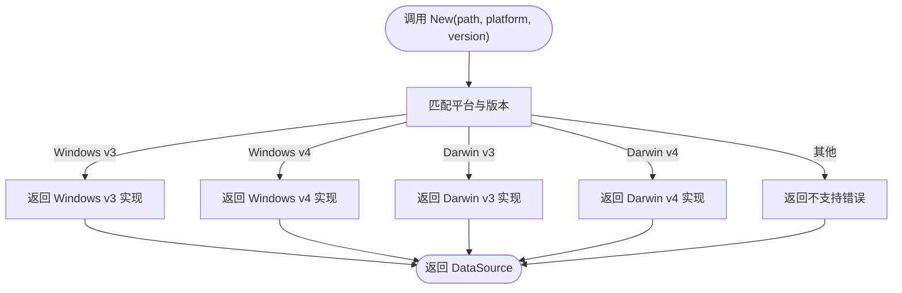

# 设计模式应用

<cite>
**本文引用的文件**
- [main.go](file://main.go)
- [root.go](file://cmd/chatlog/root.go)
- [app.go](file://internal/chatlog/app.go)
- [manager.go](file://internal/chatlog/manager.go)
- [conf.go](file://internal/chatlog/conf/conf.go)
- [service.go](file://internal/chatlog/http/service.go)
- [service.go](file://internal/chatlog/database/service.go)
- [datasource.go](file://internal/wechatdb/datasource/datasource.go)
- [filemonitor.go](file://pkg/filemonitor/filemonitor.go)
- [manager.go](file://internal/wechat/manager.go)
</cite>

## 目录
1. [引言](#引言)
2. [项目结构](#项目结构)
3. [核心组件](#核心组件)
4. [架构总览](#架构总览)
5. [详细组件分析](#详细组件分析)
6. [依赖关系分析](#依赖关系分析)
7. [性能考量](#性能考量)
8. [故障排查指南](#故障排查指南)
9. [结论](#结论)

## 引言
本文件聚焦于 Chatlog 项目中设计模式的实际应用与落地价值，围绕以下主题展开：
- 服务导向架构（SOA）在业务逻辑中的组织方式与边界划分
- 工厂模式在平台与版本适配中的使用场景与收益
- 观察者模式在文件监控与 Webhook 中的实现路径与扩展性

通过对关键模块的源码级分析，给出每种设计模式的适用背景、具体实现、带来的好处以及替代方案对比，帮助读者在类似系统中做出更合理的架构与设计决策。

## 项目结构
项目采用分层与功能域结合的组织方式：
- 入口层：命令行入口与根命令组织
- 应用层：应用生命周期与 UI 控制
- 管理层：业务编排与服务协调
- 配置层：配置加载与默认值注入
- 服务层：HTTP/MCP、数据库、微信相关服务
- 平台适配层：基于平台与版本的工厂选择
- 监控与通知层：文件监控与 Webhook 回调

图表来源
- [main.go](file://main.go#L1-L13)
- [root.go](file://cmd/chatlog/root.go#L1-L43)
- [app.go](file://internal/chatlog/app.go#L1-L843)
- [manager.go](file://internal/chatlog/manager.go#L1-L408)
- [service.go](file://internal/chatlog/http/service.go#L1-L113)
- [service.go](file://internal/chatlog/database/service.go#L1-L137)
- [datasource.go](file://internal/wechatdb/datasource/datasource.go#L1-L53)
- [filemonitor.go](file://pkg/filemonitor/filemonitor.go#L1-L431)

章节来源
- [main.go](file://main.go#L1-L13)
- [root.go](file://cmd/chatlog/root.go#L1-L43)

## 核心组件
- 应用与 UI 控制：App 负责 UI 生命周期、菜单与状态栏更新、定时刷新等；与 Manager 协作完成业务动作。
- 业务编排：Manager 组织 Context、微信服务、数据库服务与 HTTP 服务，负责启动/停止顺序与状态切换。
- 配置加载：统一加载 TUI 与服务配置，支持环境变量与数据目录内配置合并。
- 服务实现：HTTP 服务封装路由与 MCP；数据库服务封装状态机与 Webhook 回调注册。
- 平台适配：DataSource 工厂根据平台与版本返回具体实现。
- 文件监控：FileMonitor 提供多组文件监控、动态增删目录监听、事件转发。

章节来源
- [app.go](file://internal/chatlog/app.go#L1-L843)
- [manager.go](file://internal/chatlog/manager.go#L1-L408)
- [conf.go](file://internal/chatlog/conf/conf.go#L1-L106)
- [service.go](file://internal/chatlog/http/service.go#L1-L113)
- [service.go](file://internal/chatlog/database/service.go#L1-L137)
- [datasource.go](file://internal/wechatdb/datasource/datasource.go#L1-L53)
- [filemonitor.go](file://pkg/filemonitor/filemonitor.go#L1-L431)

## 架构总览
整体采用“管理层编排 + 服务层解耦 + 平台适配工厂 + 监控通知”的 SOA 思路：
- 管理层集中处理业务流程与状态迁移
- 服务层通过接口抽象对外暴露能力
- 平台适配通过工厂按需选择实现
- 监控与通知以观察者风格解耦事件源与订阅者

图表来源
- [manager.go](file://internal/chatlog/manager.go#L1-L408)
- [service.go](file://internal/chatlog/database/service.go#L1-L137)
- [datasource.go](file://internal/wechatdb/datasource/datasource.go#L1-L53)
- [filemonitor.go](file://pkg/filemonitor/filemonitor.go#L1-L431)
- [service.go](file://internal/chatlog/http/service.go#L1-L113)

## 详细组件分析

### 服务导向架构（SOA）在业务逻辑中的应用
- 分层与职责分离
  - 管理层（Manager）负责业务流程编排与服务启动/停止顺序，避免 UI 层直接耦合底层细节。
  - 服务层（HTTP、数据库）通过接口暴露能力，内部可独立演进。
- 依赖注入与配置驱动
  - 通过 Config 接口注入 HTTP 地址、数据目录、平台与版本等参数，便于测试与多环境部署。
- 生命周期与状态机
  - 数据库服务内置状态机（初始化/解密中/就绪/错误），通过状态切换保证资源安全释放与错误提示。
- 事件与回调
  - 数据库服务在启动后注册 Webhook 回调，形成“事件源-订阅者”解耦，便于扩展新事件类型。

图表来源
- [root.go](file://cmd/chatlog/root.go#L1-L43)
- [manager.go](file://internal/chatlog/manager.go#L1-L408)
- [service.go](file://internal/chatlog/database/service.go#L1-L137)
- [service.go](file://internal/chatlog/http/service.go#L1-L113)

章节来源
- [manager.go](file://internal/chatlog/manager.go#L1-L408)
- [service.go](file://internal/chatlog/database/service.go#L1-L137)
- [service.go](file://internal/chatlog/http/service.go#L1-L113)

### 工厂模式在不同平台和版本适配中的使用
- 场景定位
  - 微信数据库在 Windows 与 macOS 上存在差异，且 v3 与 v4 版本结构不同，需要在运行时选择合适的 DataSource 实现。
- 实现方式
  - DataSource 工厂根据平台与版本参数返回对应实现；若不支持则返回错误，避免硬编码分支。
- 好处
  - 降低条件分支复杂度，提升可维护性与可扩展性；新增平台/版本只需实现接口并加入工厂分支。
- 替代方案对比
  - 策略模式：适合同一接口下的多种算法选择，但此处是“构造不同实现”，更适合工厂。
  - 抽象工厂：若未来出现“成对实现”（如同时需要消息与联系人适配），可考虑抽象工厂，但当前仅需单一工厂即可满足。

图表来源
- [datasource.go](file://internal/wechatdb/datasource/datasource.go#L1-L53)

章节来源
- [datasource.go](file://internal/wechatdb/datasource/datasource.go#L1-L53)

### 观察者模式在文件监控和 Webhook 中的实现
- 文件监控（FileMonitor）
  - 事件源：fsnotify.Watcher
  - 订阅者：多个 FileGroup，每个组维护匹配规则与回调
  - 事件分发：FileMonitor 将事件广播给所有订阅者，由订阅者自行判断是否处理
  - 动态管理：支持运行时添加/移除订阅组、动态增删目录监听、黑名单过滤
- Webhook
  - 事件源：数据库层（DataSource）内部事件
  - 订阅者：Webhook Service，按组注册回调
  - 注册时机：数据库服务启动后初始化 Webhook，并将回调注册到数据源
- 好处
  - 松耦合：事件源不关心谁消费事件，订阅者只关注自身领域
  - 可扩展：新增事件类型只需新增订阅者，无需修改事件源
- 替代方案对比
  - 发布/订阅中间件：如 Kafka/RabbitMQ，适合跨进程/分布式场景；本项目为单进程内事件，FileMonitor 已足够。
  - 主动轮询：实时性差、资源消耗高，不适合文件监控场景。

图表来源
- [filemonitor.go](file://pkg/filemonitor/filemonitor.go#L1-L431)

图表来源
- [service.go](file://internal/chatlog/database/service.go#L1-L137)
- [datasource.go](file://internal/wechatdb/datasource/datasource.go#L1-L53)

章节来源
- [filemonitor.go](file://pkg/filemonitor/filemonitor.go#L1-L431)
- [service.go](file://internal/chatlog/database/service.go#L1-L137)
- [datasource.go](file://internal/wechatdb/datasource/datasource.go#L1-L53)

### 配置加载与默认值注入
- TUI 配置与服务配置分别加载，支持环境变量前缀与默认值注入
- 数据目录内配置可与服务配置合并，优先级与覆盖策略清晰
- 通过配置驱动服务启动参数，便于在不同环境复用

章节来源
- [conf.go](file://internal/chatlog/conf/conf.go#L1-L106)

### UI 与业务交互（App 与 Manager 的协作）
- App 负责 UI 生命周期与状态栏更新，定期刷新信息栏
- Manager 提供业务动作（启动/停止服务、切换账号、获取密钥、自动解密等）
- 两者通过方法调用协作，App 保持 UI 与业务解耦

章节来源
- [app.go](file://internal/chatlog/app.go#L1-L843)
- [manager.go](file://internal/chatlog/manager.go#L1-L408)

## 依赖关系分析
- 管理层依赖服务层与 UI 层，但服务层之间无直接依赖，通过接口隔离
- 数据库服务依赖 DataSource 工厂与 Webhook 服务，形成“服务内聚合”
- 文件监控与 Webhook 均作为横切关注点，被服务层复用
- 配置层为所有服务提供参数来源，避免硬编码

图表来源
- [root.go](file://cmd/chatlog/root.go#L1-L43)
- [manager.go](file://internal/chatlog/manager.go#L1-L408)
- [app.go](file://internal/chatlog/app.go#L1-L843)
- [service.go](file://internal/chatlog/http/service.go#L1-L113)
- [service.go](file://internal/chatlog/database/service.go#L1-L137)
- [datasource.go](file://internal/wechatdb/datasource/datasource.go#L1-L53)
- [filemonitor.go](file://pkg/filemonitor/filemonitor.go#L1-L431)
- [conf.go](file://internal/chatlog/conf/conf.go#L1-L106)

章节来源
- [root.go](file://cmd/chatlog/root.go#L1-L43)
- [manager.go](file://internal/chatlog/manager.go#L1-L408)
- [app.go](file://internal/chatlog/app.go#L1-L843)
- [service.go](file://internal/chatlog/http/service.go#L1-L113)
- [service.go](file://internal/chatlog/database/service.go#L1-L137)
- [datasource.go](file://internal/wechatdb/datasource/datasource.go#L1-L53)
- [filemonitor.go](file://pkg/filemonitor/filemonitor.go#L1-L431)
- [conf.go](file://internal/chatlog/conf/conf.go#L1-L106)

## 性能考量
- 定时刷新与并发
  - App 的定时刷新使用 ticker，注意在停止时正确关闭通道与退出 goroutine，避免资源泄漏。
- 文件监控
  - FileMonitor 支持黑名单与动态目录监听，减少无效事件；事件广播给所有订阅者，建议订阅者内部做快速判定以降低处理成本。
- 数据库状态机
  - 通过状态机避免并发访问未就绪的数据库；错误状态可提供明确提示，便于上层快速失败与恢复。
- HTTP 服务优雅停机
  - 使用带超时的上下文优雅关闭，减少请求中断与连接异常。

章节来源
- [app.go](file://internal/chatlog/app.go#L135-L172)
- [filemonitor.go](file://pkg/filemonitor/filemonitor.go#L1-L431)
- [service.go](file://internal/chatlog/database/service.go#L1-L137)
- [service.go](file://internal/chatlog/http/service.go#L1-L113)

## 故障排查指南
- 配置加载失败
  - 检查环境变量与配置目录是否存在；确认数据目录内的配置键是否在允许集合中。
- 服务启动失败
  - 关注数据库服务状态机转换与错误信息；必要时回退到解密流程后再尝试启动。
- 文件监控无效
  - 确认监控器已启动且目录未被黑名单过滤；检查订阅组匹配规则与事件类型。
- Webhook 未触发
  - 确认数据库服务已初始化 Webhook 并成功注册回调；检查事件源是否产生目标事件。

章节来源
- [conf.go](file://internal/chatlog/conf/conf.go#L1-L106)
- [service.go](file://internal/chatlog/database/service.go#L1-L137)
- [filemonitor.go](file://pkg/filemonitor/filemonitor.go#L1-L431)

## 结论
- SOA 在本项目中通过“管理层编排 + 服务层解耦 + 配置驱动”实现了清晰的职责边界与良好的可维护性。
- 工厂模式有效屏蔽了平台与版本差异，降低了条件分支复杂度，提升了扩展性。
- 观察者模式在文件监控与 Webhook 中提供了松耦合的事件分发机制，便于后续扩展新的事件类型与订阅者。
- 建议持续完善错误状态与可观测性，确保在复杂业务流中快速定位问题并进行恢复。