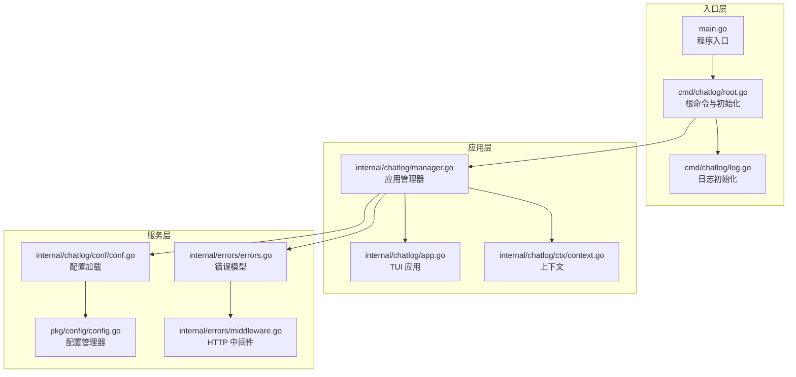
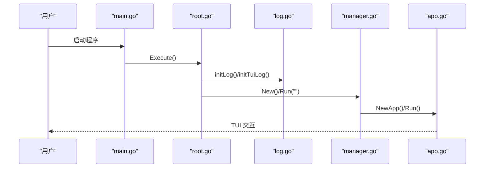
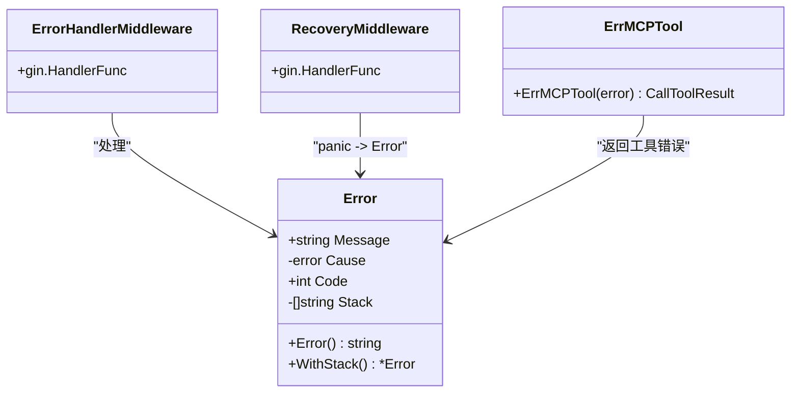
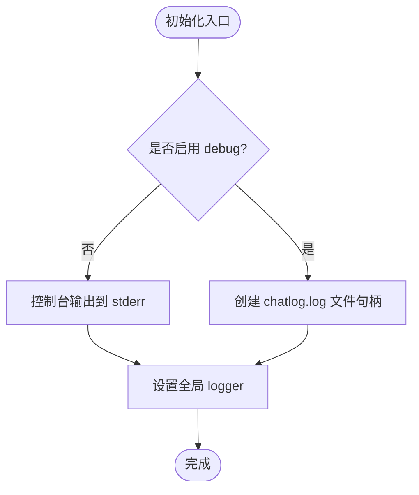
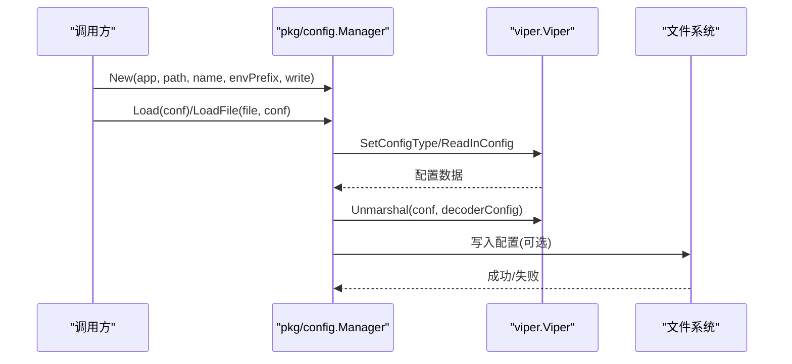
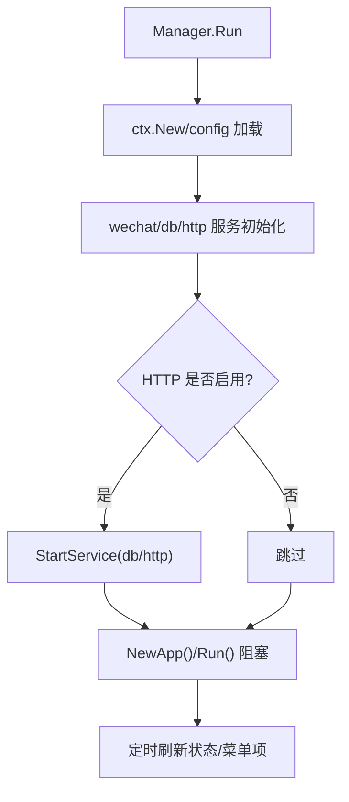
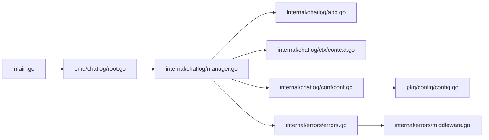

# 代码规范与最佳实践

<cite>
**本文档引用的文件**
- [main.go](file://main.go)
- [go.mod](file://go.mod)
- [README.md](file://README.md)
- [Makefile](file://Makefile)
- [cmd/chatlog/root.go](file://cmd/chatlog/root.go)
- [cmd/chatlog/log.go](file://cmd/chatlog/log.go)
- [internal/chatlog/app.go](file://internal/chatlog/app.go)
- [internal/chatlog/manager.go](file://internal/chatlog/manager.go)
- [internal/chatlog/ctx/context.go](file://internal/chatlog/ctx/context.go)
- [internal/chatlog/conf/conf.go](file://internal/chatlog/conf/conf.go)
- [pkg/config/config.go](file://pkg/config/config.go)
- [internal/errors/errors.go](file://internal/errors/errors.go)
- [internal/errors/middleware.go](file://internal/errors/middleware.go)
- [internal/errors/mcp.go](file://internal/errors/mcp.go)
</cite>

## 目录
1. [简介](#简介)
2. [项目结构](#项目结构)
3. [核心组件](#核心组件)
4. [架构总览](#架构总览)
5. [详细组件分析](#详细组件分析)
6. [依赖关系分析](#依赖关系分析)
7. [性能考虑](#性能考虑)
8. [故障排查指南](#故障排查指南)
9. [结论](#结论)
10. [附录](#附录)

## 简介
本指南面向 Chatlog 项目的开发者，系统性地总结并提炼项目内的 Go 语言编码规范与最佳实践，覆盖命名约定、代码格式化、注释规范、错误处理模式、日志记录规范、配置管理方式、代码审查清单与质量检查标准，并给出常见代码模式与反模式说明及重构建议。目标是帮助团队在保持一致性的同时提升代码质量与可维护性。

## 项目结构
项目采用模块化分层组织，主要分为：
- 入口层：命令行入口与根命令初始化
- 应用层：应用生命周期管理、UI 与业务协调
- 服务层：HTTP 服务、数据库服务、微信数据服务
- 配置层：Viper 配置管理与环境变量映射
- 错误与中间件：统一错误模型与 HTTP 中间件
- 工具与公共库：通用工具、压缩、音频转换等

**图表来源**
- [main.go](file://main.go#L1-L12)
- [cmd/chatlog/root.go](file://cmd/chatlog/root.go#L1-L42)
- [cmd/chatlog/log.go](file://cmd/chatlog/log.go#L1-L45)
- [internal/chatlog/app.go](file://internal/chatlog/app.go#L1-L80)
- [internal/chatlog/manager.go](file://internal/chatlog/manager.go#L1-L60)
- [internal/chatlog/ctx/context.go](file://internal/chatlog/ctx/context.go#L1-L60)
- [internal/chatlog/conf/conf.go](file://internal/chatlog/conf/conf.go#L1-L45)
- [pkg/config/config.go](file://pkg/config/config.go#L1-L60)
- [internal/errors/errors.go](file://internal/errors/errors.go#L1-L40)
- [internal/errors/middleware.go](file://internal/errors/middleware.go#L1-L36)

**章节来源**
- [main.go](file://main.go#L1-L12)
- [cmd/chatlog/root.go](file://cmd/chatlog/root.go#L1-L42)
- [cmd/chatlog/log.go](file://cmd/chatlog/log.go#L1-L45)
- [internal/chatlog/app.go](file://internal/chatlog/app.go#L1-L80)
- [internal/chatlog/manager.go](file://internal/chatlog/manager.go#L1-L60)
- [internal/chatlog/ctx/context.go](file://internal/chatlog/ctx/context.go#L1-L60)
- [internal/chatlog/conf/conf.go](file://internal/chatlog/conf/conf.go#L1-L45)
- [pkg/config/config.go](file://pkg/config/config.go#L1-L60)
- [internal/errors/errors.go](file://internal/errors/errors.go#L1-L40)
- [internal/errors/middleware.go](file://internal/errors/middleware.go#L1-L36)

## 核心组件
- 应用管理器：负责服务启动/停止、账号切换、自动解密、HTTP 服务启停等
- 上下文：集中管理账号、密钥、目录、HTTP 状态等共享状态
- 配置管理：基于 Viper 的配置加载、环境变量映射、默认值注入
- 日志：基于 zerolog 的控制台输出与 TUI 文件输出
- 错误模型：统一错误包装、HTTP 状态码映射、堆栈记录与中间件处理

**章节来源**
- [internal/chatlog/manager.go](file://internal/chatlog/manager.go#L21-L60)
- [internal/chatlog/ctx/context.go](file://internal/chatlog/ctx/context.go#L21-L60)
- [pkg/config/config.go](file://pkg/config/config.go#L38-L93)
- [cmd/chatlog/log.go](file://cmd/chatlog/log.go#L19-L45)
- [internal/errors/errors.go](file://internal/errors/errors.go#L13-L70)

## 架构总览
应用采用“命令行入口 → 根命令初始化 → 应用管理器 → 服务层”的控制流；UI 与 HTTP 服务通过管理器协调启动与停止；配置与错误处理贯穿各层。

**图表来源**
- [main.go](file://main.go#L9-L12)
- [cmd/chatlog/root.go](file://cmd/chatlog/root.go#L18-L42)
- [cmd/chatlog/log.go](file://cmd/chatlog/log.go#L19-L45)
- [internal/chatlog/manager.go](file://internal/chatlog/manager.go#L40-L69)
- [internal/chatlog/app.go](file://internal/chatlog/app.go#L65-L89)

## 详细组件分析

### 命名规范
- 包名：小写、简洁、语义明确（如 internal/chatlog、pkg/config）
- 函数/方法：采用动词短语或名词短语，首字母大写导出（如 New、Run、GetDataKey）
- 变量：采用驼峰命名，避免缩写（如 HTTPEnabled、DataDir、WorkDir）
- 常量：全部大写，单词间下划线分隔（如 DefaultConfigType、DefalutHTTPAddr）

**章节来源**
- [internal/chatlog/manager.go](file://internal/chatlog/manager.go#L21-L34)
- [internal/chatlog/ctx/context.go](file://internal/chatlog/ctx/context.go#L17-L60)
- [pkg/config/config.go](file://pkg/config/config.go#L28-L30)

### 代码格式化与注释规范
- 使用官方工具链：gofmt（格式化）、goimports（导入排序与缺失导入补全）
- 注释位置：函数/类型上方块注释；字段与关键逻辑处行内注释
- 文档注释：对外接口与导出类型/函数提供 godoc 注释
- Makefile 中包含 lint 与 tidy，建议在提交前执行

**章节来源**
- [Makefile](file://Makefile#L30-L40)
- [go.mod](file://go.mod#L1-L10)

### 错误处理模式
- 统一错误模型：内部错误类型封装消息、原始错误、HTTP 状态码与堆栈
- 错误包装与透传：Wrap/New/Newf 用于构造带上下文的错误
- HTTP 层处理：中间件捕获错误并返回 JSON；Recovery 中间件处理 panic
- MCP 工具错误：提供专用错误响应结构

**图表来源**
- [internal/errors/errors.go](file://internal/errors/errors.go#L13-L87)
- [internal/errors/middleware.go](file://internal/errors/middleware.go#L14-L63)
- [internal/errors/mcp.go](file://internal/errors/mcp.go#L5-L15)

**章节来源**
- [internal/errors/errors.go](file://internal/errors/errors.go#L56-L124)
- [internal/errors/middleware.go](file://internal/errors/middleware.go#L14-L63)
- [internal/errors/mcp.go](file://internal/errors/mcp.go#L5-L15)

### 日志记录规范
- 控制台日志：全局级别 Info/Debug；ConsoleWriter 输出到 stderr
- TUI 日志：可选写入文件，便于调试；关闭颜色输出
- 初始化时机：根命令 PreRun 与 PersistentPreRun 分别处理 CLI/TUI 日志

**图表来源**
- [cmd/chatlog/log.go](file://cmd/chatlog/log.go#L19-L45)

**章节来源**
- [cmd/chatlog/log.go](file://cmd/chatlog/log.go#L19-L45)

### 配置管理方式
- 配置来源：文件、环境变量、命令行参数（通过 Viper）
- 默认值注入：SetDefaults 提供默认值
- 环境变量前缀：统一前缀，点号替换为下划线
- 数据目录配置：若提供 DataDir 且无 DataKey，可从该目录读取 chatlog.json 合并配置

**图表来源**
- [pkg/config/config.go](file://pkg/config/config.go#L50-L123)
- [internal/chatlog/conf/conf.go](file://internal/chatlog/conf/conf.go#L20-L96)

**章节来源**
- [pkg/config/config.go](file://pkg/config/config.go#L38-L160)
- [internal/chatlog/conf/conf.go](file://internal/chatlog/conf/conf.go#L19-L96)

### 应用生命周期与状态管理
- 生命周期：Manager.Run → 启动服务 → 启动 TUI → 阻塞运行
- 状态变更：HTTP 启停、自动解密启停、账号切换、目录变更均通过 Context 同步持久化
- UI 刷新：定时刷新信息栏状态，保证用户可见状态一致

**图表来源**
- [internal/chatlog/manager.go](file://internal/chatlog/manager.go#L40-L69)
- [internal/chatlog/app.go](file://internal/chatlog/app.go#L65-L89)

**章节来源**
- [internal/chatlog/manager.go](file://internal/chatlog/manager.go#L40-L120)
- [internal/chatlog/app.go](file://internal/chatlog/app.go#L135-L172)
- [internal/chatlog/ctx/context.go](file://internal/chatlog/ctx/context.go#L188-L248)

## 依赖关系分析
- 外部依赖：gin、tcell/tview、zerolog、viper、cobra 等
- 内部模块：internal/*、pkg/*、cmd/chatlog
- 关键耦合点：Manager 对服务与 UI 的组合；Context 对配置与状态的集中管理；错误模型贯穿服务层

**图表来源**
- [main.go](file://main.go#L1-L12)
- [cmd/chatlog/root.go](file://cmd/chatlog/root.go#L1-L42)
- [internal/chatlog/manager.go](file://internal/chatlog/manager.go#L1-L60)
- [internal/chatlog/app.go](file://internal/chatlog/app.go#L1-L40)
- [internal/chatlog/ctx/context.go](file://internal/chatlog/ctx/context.go#L1-L40)
- [internal/chatlog/conf/conf.go](file://internal/chatlog/conf/conf.go#L1-L45)
- [pkg/config/config.go](file://pkg/config/config.go#L1-L40)
- [internal/errors/errors.go](file://internal/errors/errors.go#L1-L40)
- [internal/errors/middleware.go](file://internal/errors/middleware.go#L1-L36)

**章节来源**
- [go.mod](file://go.mod#L5-L29)

## 性能考虑
- I/O 优化：批量写入配置、避免频繁磁盘 IO；UI 刷新使用定时器节流
- 并发安全：Context 使用读写锁保护共享状态；后台任务通过 goroutine 与通道协调
- 服务启动顺序：先数据库后 HTTP，失败回滚，减少资源占用
- 日志级别：生产默认 Info，仅在 debug 模式输出到文件，降低开销

[本节为通用指导，无需列出具体文件来源]

## 故障排查指南
- 日志定位：CLI 模式查看 stderr 控制台日志；TUI 模式启用 debug 生成 chatlog.log
- HTTP 错误：中间件统一返回 JSON；检查 RequestID 定位请求
- Panic 恢复：Recovery 中间件捕获 panic 并记录堆栈
- 配置问题：确认配置文件存在、权限正确；环境变量前缀与键名映射

**章节来源**
- [cmd/chatlog/log.go](file://cmd/chatlog/log.go#L19-L45)
- [internal/errors/middleware.go](file://internal/errors/middleware.go#L14-L63)
- [internal/errors/errors.go](file://internal/errors/errors.go#L113-L124)

## 结论
本指南总结了 Chatlog 项目在命名、格式化、错误处理、日志与配置等方面的规范与最佳实践。遵循这些约定有助于提升代码一致性、可读性与可维护性。建议在日常开发中结合 Makefile 的 lint/tidy/test 流程，持续改进质量。

[本节为总结性内容，无需列出具体文件来源]

## 附录

### 代码审查清单
- 命名与注释：包名、函数、变量、常量是否符合规范；注释是否清晰
- 错误处理：是否使用统一错误模型；HTTP 层是否包含中间件
- 日志：是否合理使用日志级别；是否记录关键事件
- 配置：是否通过 Viper 管理；默认值与环境变量映射是否完善
- 并发：共享状态是否加锁；goroutine 是否有退出机制
- 可测试性：是否易于单元测试；是否避免全局状态

### 常见模式与反模式
- 推荐模式
  - 使用 Context 集中管理状态与持久化
  - 服务启动按依赖顺序，失败回滚
  - 统一错误包装与 HTTP 响应
- 反模式
  - 直接使用全局变量替代 Context
  - 在 HTTP 路由中直接处理复杂业务逻辑
  - 忽略错误返回，导致静默失败

### 重构建议
- 将重复的状态更新逻辑抽象到 Context 方法中
- 将服务启动/停止流程抽取为独立函数，便于测试
- 引入配置校验器，提前发现无效配置
- 将 UI 与业务逻辑进一步解耦，提高可测试性

**章节来源**
- [internal/chatlog/ctx/context.go](file://internal/chatlog/ctx/context.go#L250-L303)
- [internal/chatlog/manager.go](file://internal/chatlog/manager.go#L98-L151)
- [internal/errors/errors.go](file://internal/errors/errors.go#L56-L87)