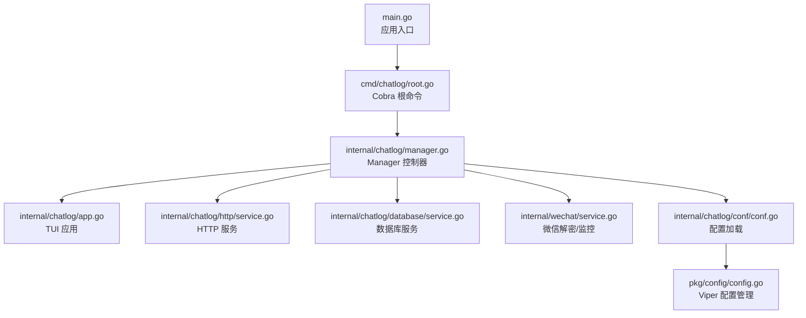
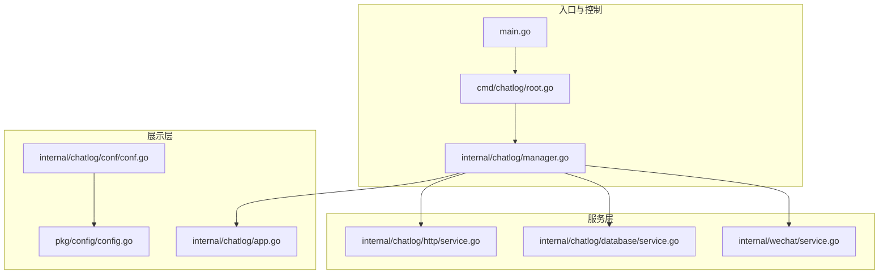
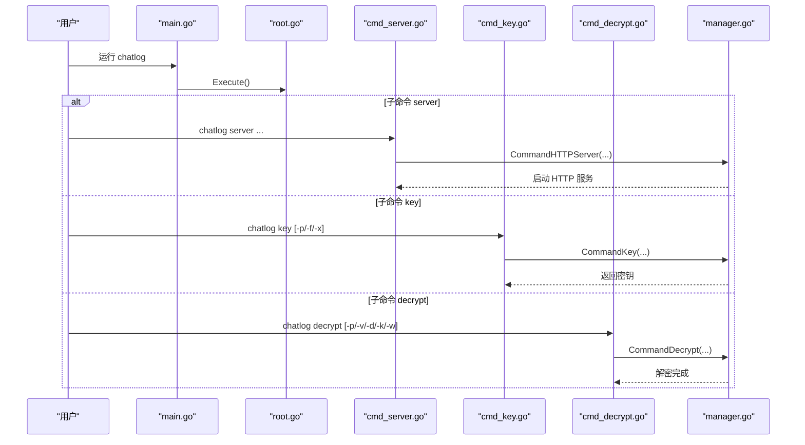
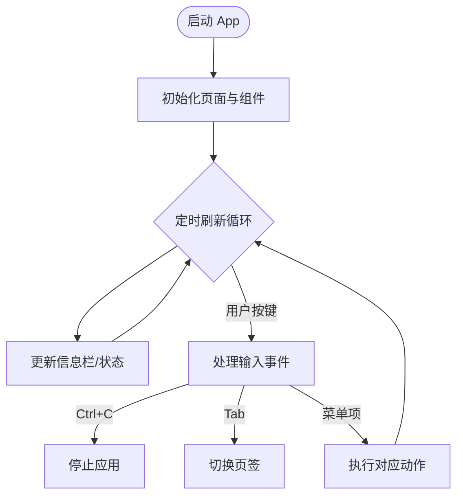
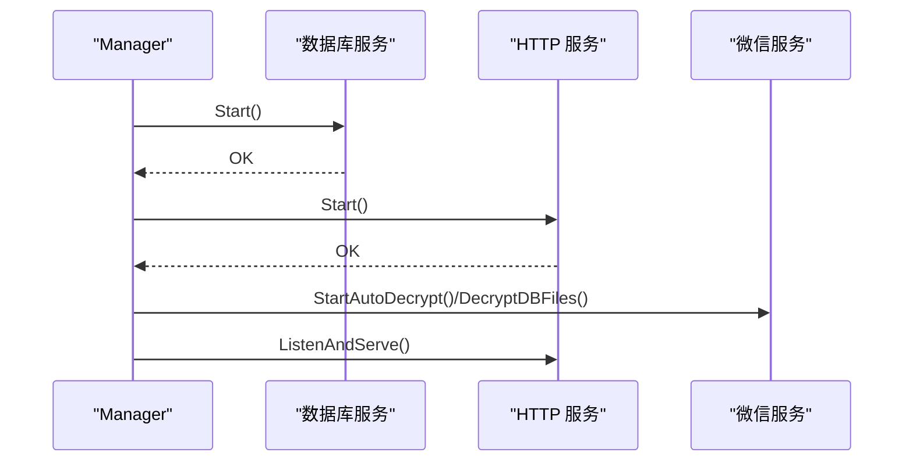
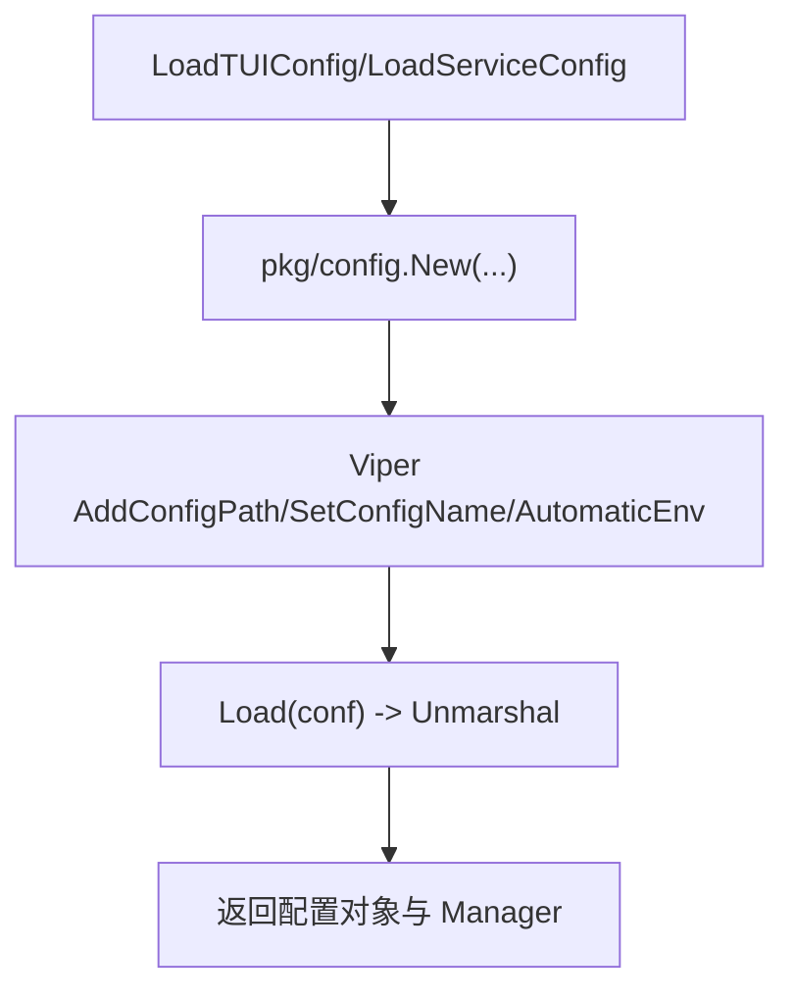
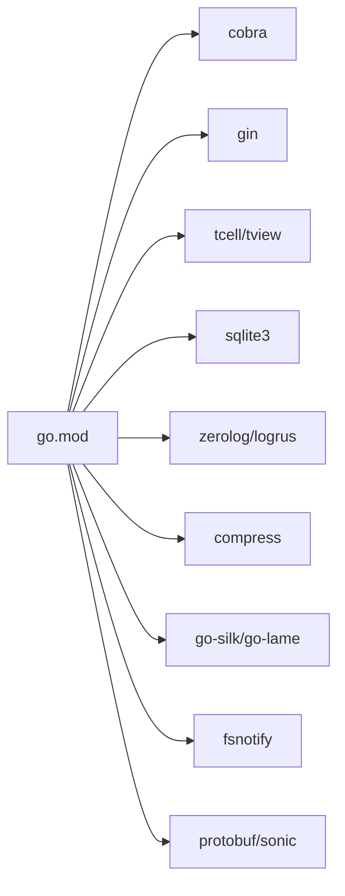

# 开发指南

<cite>
**本文引用的文件**
- [README.md](file://README.md)
- [main.go](file://main.go)
- [go.mod](file://go.mod)
- [Makefile](file://Makefile)
- [.goreleaser.yaml](file://.goreleaser.yaml)
- [Dockerfile](file://Dockerfile)
- [cmd/chatlog/root.go](file://cmd/chatlog/root.go)
- [cmd/chatlog/cmd_server.go](file://cmd/chatlog/cmd_server.go)
- [cmd/chatlog/cmd_key.go](file://cmd/chatlog/cmd_key.go)
- [cmd/chatlog/cmd_decrypt.go](file://cmd/chatlog/cmd_decrypt.go)
- [internal/chatlog/app.go](file://internal/chatlog/app.go)
- [internal/chatlog/manager.go](file://internal/chatlog/manager.go)
- [internal/chatlog/conf/conf.go](file://internal/chatlog/conf/conf.go)
- [pkg/config/config.go](file://pkg/config/config.go)
</cite>

## 目录
1. [简介](#简介)
2. [项目结构](#项目结构)
3. [核心组件](#核心组件)
4. [架构总览](#架构总览)
5. [详细组件分析](#详细组件分析)
6. [依赖关系分析](#依赖关系分析)
7. [性能考虑](#性能考虑)
8. [故障排查指南](#故障排查指南)
9. [结论](#结论)
10. [附录](#附录)

## 简介
本指南面向希望参与 Chatlog 项目开发的工程师，提供从环境搭建、代码结构、模块划分、设计模式、代码规范、测试要求、调试与性能优化，到贡献流程与发布流程的完整说明。Chatlog 是一款支持 Windows/macOS 的本地聊天数据提取与服务化工具，具备终端 UI、HTTP API、MCP 集成、Webhook 回调、多账号管理与跨平台打包能力。

## 项目结构
仓库采用“命令入口 + 内部业务内核 + 外部包”的分层组织方式：
- cmd/chatlog：CLI 子命令与入口初始化
- internal/*：核心业务模块（应用、HTTP、数据库、微信解密、UI、模型、错误处理、MCP）
- pkg/*：可复用的配置、工具、文件监控、多媒体解码等
- docs、script、.github：文档、脚本与 CI 配置
- go.mod/go.sum：依赖清单
- Makefile、.goreleaser.yaml、Dockerfile：构建与发布

图表来源
- [main.go](file://main.go#L1-L13)
- [cmd/chatlog/root.go](file://cmd/chatlog/root.go#L1-L43)
- [internal/chatlog/manager.go](file://internal/chatlog/manager.go#L1-L69)
- [internal/chatlog/app.go](file://internal/chatlog/app.go#L1-L63)
- [internal/chatlog/conf/conf.go](file://internal/chatlog/conf/conf.go#L1-L45)
- [pkg/config/config.go](file://pkg/config/config.go#L1-L93)

章节来源
- [README.md](file://README.md#L1-L357)
- [go.mod](file://go.mod#L1-L82)

## 核心组件
- 应用入口与 CLI
  - main.go 负责初始化日志并调用根命令执行
  - root.go 注册持久标志、日志初始化钩子与根命令
  - 子命令：server、key、decrypt
- Manager 控制器
  - 组合微信、数据库、HTTP 服务，协调生命周期与状态
- TUI 应用
  - 基于 tview 构建菜单、信息栏、页签与底部状态
- 配置系统
  - Viper + 自定义 Manager 实现文件配置与环境变量覆盖
- HTTP 服务
  - 基于 Gin 提供 API 与 MCP 流式接口
- 数据库服务
  - 抽象数据访问层，支持会话、联系人、群聊、消息、媒体等
- 微信解密与监控
  - 跨平台密钥提取、数据库解密、自动监控与 Webhook 回调

章节来源
- [main.go](file://main.go#L1-L13)
- [cmd/chatlog/root.go](file://cmd/chatlog/root.go#L1-L43)
- [cmd/chatlog/cmd_server.go](file://cmd/chatlog/cmd_server.go#L1-L79)
- [cmd/chatlog/cmd_key.go](file://cmd/chatlog/cmd_key.go#L1-L37)
- [cmd/chatlog/cmd_decrypt.go](file://cmd/chatlog/cmd_decrypt.go#L1-L64)
- [internal/chatlog/manager.go](file://internal/chatlog/manager.go#L1-L69)
- [internal/chatlog/app.go](file://internal/chatlog/app.go#L1-L63)
- [internal/chatlog/conf/conf.go](file://internal/chatlog/conf/conf.go#L1-L45)
- [pkg/config/config.go](file://pkg/config/config.go#L1-L93)

## 架构总览
整体采用“控制器驱动 + 多服务组合”的架构，Manager 作为中枢协调微信、数据库与 HTTP 服务；UI 与命令行通过 Manager 对外暴露统一能力；配置系统贯穿全局，支持文件与环境变量双通道。

图表来源
- [main.go](file://main.go#L1-L13)
- [cmd/chatlog/root.go](file://cmd/chatlog/root.go#L1-L43)
- [internal/chatlog/manager.go](file://internal/chatlog/manager.go#L1-L69)
- [internal/chatlog/app.go](file://internal/chatlog/app.go#L1-L63)
- [internal/chatlog/conf/conf.go](file://internal/chatlog/conf/conf.go#L1-L45)
- [pkg/config/config.go](file://pkg/config/config.go#L1-L93)

## 详细组件分析

### 命令行与入口
- 入口函数初始化日志并执行根命令
- 根命令注册 debug 标志与日志钩子，绑定 Root 处理逻辑
- server/key/decrypt 子命令分别封装服务启动、密钥获取与数据库解密

图表来源
- [main.go](file://main.go#L1-L13)
- [cmd/chatlog/root.go](file://cmd/chatlog/root.go#L1-L43)
- [cmd/chatlog/cmd_server.go](file://cmd/chatlog/cmd_server.go#L1-L79)
- [cmd/chatlog/cmd_key.go](file://cmd/chatlog/cmd_key.go#L1-L37)
- [cmd/chatlog/cmd_decrypt.go](file://cmd/chatlog/cmd_decrypt.go#L1-L64)
- [internal/chatlog/manager.go](file://internal/chatlog/manager.go#L335-L407)

章节来源
- [main.go](file://main.go#L1-L13)
- [cmd/chatlog/root.go](file://cmd/chatlog/root.go#L1-L43)
- [cmd/chatlog/cmd_server.go](file://cmd/chatlog/cmd_server.go#L1-L79)
- [cmd/chatlog/cmd_key.go](file://cmd/chatlog/cmd_key.go#L1-L37)
- [cmd/chatlog/cmd_decrypt.go](file://cmd/chatlog/cmd_decrypt.go#L1-L64)

### 应用与 UI（TUI）
- App 封装 tview 页面、菜单、信息栏与底部状态
- 定时刷新信息栏，响应键盘事件（Tab 切换、Ctrl+C 退出）
- 菜单项涵盖获取密钥、解密数据、启动/停止 HTTP 服务、自动解密开关、设置、切换账号、退出

图表来源
- [internal/chatlog/app.go](file://internal/chatlog/app.go#L65-L172)
- [internal/chatlog/app.go](file://internal/chatlog/app.go#L202-L460)

章节来源
- [internal/chatlog/app.go](file://internal/chatlog/app.go#L1-L843)

### 管理器（Manager）
- 负责上下文初始化、服务编排、状态切换与命令行模式执行
- 服务启动顺序：数据库 -> HTTP；停止顺序相反
- 提供密钥获取、解密、自动解密、HTTP 服务启停、会话刷新等能力

图表来源
- [internal/chatlog/manager.go](file://internal/chatlog/manager.go#L98-L151)
- [internal/chatlog/manager.go](file://internal/chatlog/manager.go#L180-L199)
- [internal/chatlog/manager.go](file://internal/chatlog/manager.go#L201-L224)
- [internal/chatlog/manager.go](file://internal/chatlog/manager.go#L335-L407)

章节来源
- [internal/chatlog/manager.go](file://internal/chatlog/manager.go#L1-L408)

### 配置系统
- 通过 pkg/config/config.go 的 Manager 封装 Viper，支持文件与环境变量
- internal/chatlog/conf/conf.go 提供 TUI 与服务配置加载，支持从数据目录合并部分配置

图表来源
- [internal/chatlog/conf/conf.go](file://internal/chatlog/conf/conf.go#L19-L96)
- [pkg/config/config.go](file://pkg/config/config.go#L48-L110)

章节来源
- [internal/chatlog/conf/conf.go](file://internal/chatlog/conf/conf.go#L1-L106)
- [pkg/config/config.go](file://pkg/config/config.go#L1-L160)

## 依赖关系分析
- 语言与工具链
  - Go 1.24+
  - CGO 可用（部分功能依赖）
- 主要外部库
  - CLI：spf13/cobra
  - Web：gin-gonic/gin、mark3labs/mcp-go
  - UI：gdamore/tcell/v2、rivo/tview
  - 数据库：mattn/go-sqlite3
  - 日志：rs/zerolog、sirupsen/logrus
  - 平台工具：shirou/gopsutil/v4、golang.org/x/sys
  - 压缩与音频：klauspost/compress、sjzar/go-silk、sjzar/go-lame
  - 文件监控：fsnotify/fsnotify
  - 序列化：google.golang.org/protobuf、bytedance/sonic

图表来源
- [go.mod](file://go.mod#L5-L29)

章节来源
- [go.mod](file://go.mod#L1-L82)

## 性能考虑
- 构建与压缩
  - Makefile 支持多平台交叉编译与 UPX 压缩（条件启用）
  - .goreleaser.yaml 配置多架构二进制与 Docker 镜像
- 运行时
  - HTTP 服务与数据库服务按依赖顺序启动，避免资源竞争
  - UI 刷新周期固定，避免频繁重绘
  - 自动解密与监控在后台 goroutine 中执行，避免阻塞 UI
- 建议
  - 优先使用静态链接与 UPX 压缩减少体积
  - 对高频 UI 刷新与网络请求进行节流
  - 在解密与监控场景中，合理设置工作目录与缓存策略

章节来源
- [Makefile](file://Makefile#L1-L60)
- [.goreleaser.yaml](file://.goreleaser.yaml#L1-L159)
- [internal/chatlog/app.go](file://internal/chatlog/app.go#L135-L172)
- [internal/chatlog/manager.go](file://internal/chatlog/manager.go#L98-L151)

## 故障排查指南
- 常见问题定位
  - 密钥获取失败：检查微信进程是否运行、平台权限（macOS 需临时关闭 SIP）、是否使用 Windows Terminal（Windows）
  - 解密失败：确认数据密钥与工作目录配置正确，必要时强制重新获取密钥
  - HTTP 服务启动失败：检查端口占用、配置文件与环境变量冲突
  - Docker 部署：容器内不支持密钥获取，需提前在宿主机获取并挂载数据目录
- 日志与调试
  - 启用 debug 标志输出详细日志
  - 使用命令行模式验证密钥与解密流程
- 相关文档
  - 平台特定说明、常见问题快速解决、Docker 部署指南

章节来源
- [README.md](file://README.md#L41-L177)
- [cmd/chatlog/root.go](file://cmd/chatlog/root.go#L10-L16)
- [cmd/chatlog/cmd_server.go](file://cmd/chatlog/cmd_server.go#L10-L22)

## 结论
本指南提供了从环境搭建到开发、测试、调试与发布的全流程指引。建议开发者遵循统一的代码风格与测试规范，充分利用配置系统与服务编排能力，确保在多平台与多版本微信环境下稳定运行。

## 附录

### 开发环境搭建步骤
- 安装 Go 1.24+
- 准备 C/C++ 编译环境（CGO 依赖）
- 克隆仓库并安装依赖
  - 使用 go mod tidy 清理与同步依赖
- 运行与测试
  - 使用 Makefile 提供的任务：lint、test、build、crossbuild
- 构建与发布
  - 使用 .goreleaser.yaml 配置多架构二进制与 Docker 镜像
  - Dockerfile 定义基础镜像、健康检查与默认入口

章节来源
- [README.md](file://README.md#L48-L120)
- [Makefile](file://Makefile#L30-L44)
- [.goreleaser.yaml](file://.goreleaser.yaml#L8-L66)
- [Dockerfile](file://Dockerfile#L1-L45)

### 代码规范与最佳实践
- 命名约定
  - 包名小写、简洁；类型首字母大写；方法与导出常量/变量首字母大写
  - 结构体字段尽量导出以便配置与序列化
- 注释标准
  - 包注释清晰说明职责；导出类型与方法提供简要说明
  - 复杂流程与边界条件补充注释
- 错误处理
  - 使用统一错误类型与包装，保留上下文信息
  - UI 与日志中区分错误级别，便于排查
- 测试要求
  - 关键模块提供单元测试，覆盖边界与异常路径
  - 使用 Makefile 的 test 任务统一执行

章节来源
- [internal/chatlog/manager.go](file://internal/chatlog/manager.go#L1-L69)
- [pkg/config/config.go](file://pkg/config/config.go#L1-L93)

### 调试技巧
- 启用 debug 标志
- 使用命令行模式快速验证密钥与解密流程
- 观察 UI 信息栏状态变化，定位服务启停问题
- Docker 环境下通过 HEALTHCHECK 与日志排查

章节来源
- [cmd/chatlog/root.go](file://cmd/chatlog/root.go#L10-L16)
- [internal/chatlog/app.go](file://internal/chatlog/app.go#L135-L172)
- [Dockerfile](file://Dockerfile#L40-L41)

### 贡献指南与发布流程
- 提交规范
  - 使用语义化提交信息，描述变更类型与影响范围
- 分支与 PR
  - 基于 develop 分支提交 PR，确保通过 lint、test
- 发布流程
  - .goreleaser.yaml 配置多架构产物与 Docker 镜像
  - Makefile 支持本地构建与交叉编译

章节来源
- [.goreleaser.yaml](file://.goreleaser.yaml#L87-L159)
- [Makefile](file://Makefile#L46-L60)