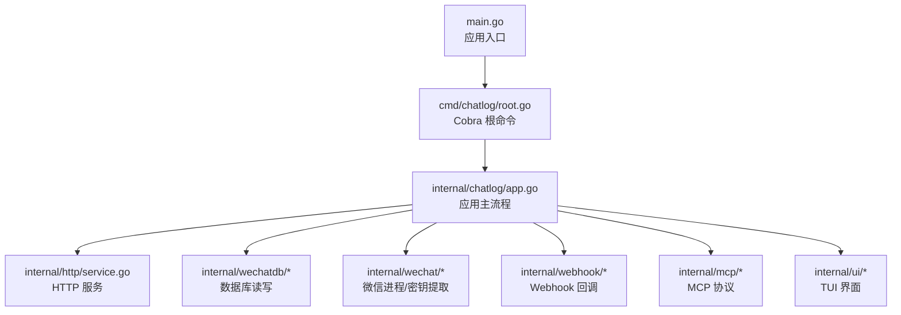
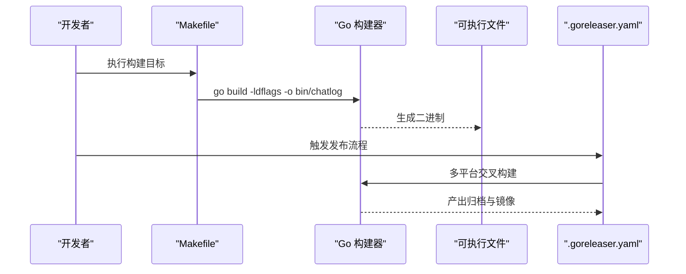
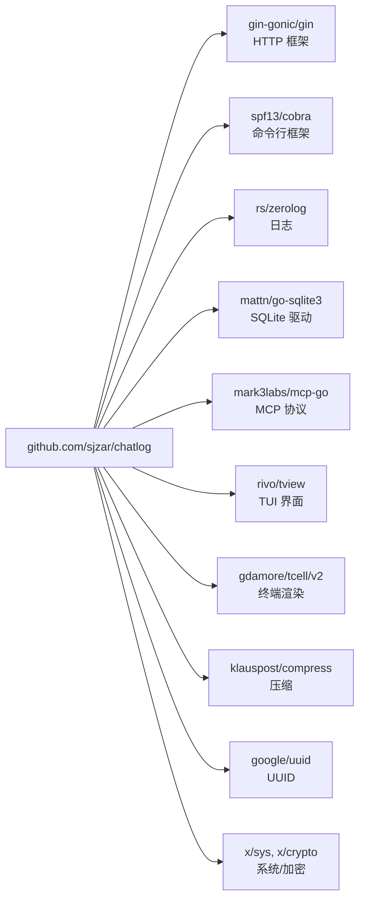

# 开发环境搭建

<cite>
**本文引用的文件**
- [go.mod](file://go.mod)
- [README.md](file://README.md)
- [main.go](file://main.go)
- [Makefile](file://Makefile)
- [.goreleaser.yaml](file://.goreleaser.yaml)
- [Dockerfile](file://Dockerfile)
- [docker-compose.yml](file://docker-compose.yml)
- [cmd/chatlog/root.go](file://cmd/chatlog/root.go)
</cite>

## 目录
1. [简介](#简介)
2. [项目结构](#项目结构)
3. [核心组件](#核心组件)
4. [架构总览](#架构总览)
5. [详细组件分析](#详细组件分析)
6. [依赖分析](#依赖分析)
7. [性能考虑](#性能考虑)
8. [故障排查指南](#故障排查指南)
9. [结论](#结论)
10. [附录](#附录)

## 简介
本指南面向首次参与 Chatlog 项目开发的工程师，目标是帮助你在本地快速完成开发环境搭建与验证。内容覆盖：
- Go 1.24+ 环境配置与模块代理建议
- 项目依赖安装与 go mod tidy 使用
- 开发工具推荐（VS Code、Go 插件、调试配置）
- 克隆项目、初始化环境与验证安装
- 常见环境问题排查与解决方案

## 项目结构
Chatlog 是一个基于 Go 的命令行工具，提供终端 UI、HTTP API、Webhook、MCP 集成等功能。项目采用模块化组织，入口位于 main.go，命令行子命令由 cmd/chatlog 子包提供，业务逻辑分布在 internal、pkg 等目录。

图表来源
- [main.go](file://main.go#L1-L13)
- [cmd/chatlog/root.go](file://cmd/chatlog/root.go#L1-L43)

章节来源
- [main.go](file://main.go#L1-L13)
- [cmd/chatlog/root.go](file://cmd/chatlog/root.go#L1-L43)

## 核心组件
- 应用入口与命令行框架
  - main.go 调用 cmd/chatlog.Execute()，后者基于 Cobra 构建命令树，提供 TUI、server、decrypt、key、version 等子命令。
- 构建与打包
  - Makefile 提供 lint、tidy、test、build、crossbuild 等常用目标；.goreleaser.yaml 配置跨平台构建、压缩与发布。
- 运行与部署
  - Dockerfile 定义容器基础镜像、环境变量与健康检查；docker-compose.yml 提供一键启动示例。

章节来源
- [main.go](file://main.go#L1-L13)
- [cmd/chatlog/root.go](file://cmd/chatlog/root.go#L1-L43)
- [Makefile](file://Makefile#L1-L60)
- [.goreleaser.yaml](file://.goreleaser.yaml#L1-L159)
- [Dockerfile](file://Dockerfile#L1-L45)
- [docker-compose.yml](file://docker-compose.yml#L1-L39)

## 架构总览
下图展示从本地开发到可执行二进制的关键流程：开发者在本地执行构建命令，Makefile 调用 go build，最终生成可执行文件；.goreleaser.yaml 则负责跨平台构建与发布。

图表来源
- [Makefile](file://Makefile#L42-L44)
- [.goreleaser.yaml](file://.goreleaser.yaml#L8-L59)

章节来源
- [Makefile](file://Makefile#L1-L60)
- [.goreleaser.yaml](file://.goreleaser.yaml#L1-L159)

## 详细组件分析

### Go 环境与模块配置
- 版本要求
  - go.mod 明确要求 Go 1.24.0，因此请确保本地 Go 版本满足该要求。
- 模块代理建议
  - 对于中国大陆用户，建议配置官方模块代理镜像以提升依赖拉取速度与稳定性。可参考 README 中“从源码安装”的提示，结合 go env 配置代理。
- GOPATH 与工作区
  - 建议将仓库放置在 GOPATH/src/github.com/sjzar/chatlog 或任意目录（现代 Go 建议使用 Go Modules，无需严格 GOPATH）。
- CGO 依赖
  - README 提示部分功能存在 cgo 依赖，编译前需确认本地具备 C 编译环境（如 GCC、Clang 等）。

章节来源
- [go.mod](file://go.mod#L1-L8)
- [README.md](file://README.md#L50-L57)

### 依赖安装与版本管理
- 初始化与更新
  - 使用 go mod tidy 自动整理依赖，确保 go.mod 与 go.sum 与实际代码一致。
- 依赖来源
  - go.mod 列出直接与间接依赖，涵盖网络、日志、UI、压缩、SQLite、MCP、平台工具等。
- 版本锁定
  - go.sum 记录校验和，保证依赖可复现。

章节来源
- [go.mod](file://go.mod#L1-L82)
- [Makefile](file://Makefile#L34-L36)

### 开发工具推荐（VS Code）
- 插件建议
  - Go（扩展作者 golang）、C/C++（若涉及 CGO）、Docker、YAML、Markdown Preview Github Styling。
- 工作区设置
  - 建议启用 go.work（如使用多模块）或在项目根目录打开 VS Code。
- 调试配置
  - 创建 .vscode/launch.json，配置 Go 启动项，选择 main.go 作为入口，设置环境变量（如 CHATLOG_DATA_DIR、CHATLOG_HTTP_ADDR）与工作目录。
- 代码格式与检查
  - 使用 golangci-lint（Makefile 中已定义 lint 目标），在 VS Code 中配置保存时自动运行。

章节来源
- [Makefile](file://Makefile#L30-L32)

### 克隆、初始化与验证
- 克隆仓库
  - 使用 git clone 克隆到本地后，进入项目目录。
- 安装依赖
  - 执行 go mod tidy 完成依赖安装与校验。
- 构建与运行
  - 使用 make build 生成当前平台二进制；或直接 go run main.go。
  - 使用 make test 运行测试，确保环境正确。
- 验证安装
  - 运行生成的二进制，查看帮助输出与基本功能是否可用。

章节来源
- [Makefile](file://Makefile#L24-L44)
- [main.go](file://main.go#L1-L13)

### 常见环境问题与解决方案
- Go 版本过低
  - 现象：go mod tidy 或 go build 报错。
  - 解决：升级至 Go 1.24+。
- 无法解析模块依赖
  - 现象：go mod tidy 失败或长时间卡住。
  - 解决：配置模块代理（如 GOPROXY），清理缓存后重试。
- CGO 相关错误
  - 现象：构建时报找不到编译器或链接错误。
  - 解决：安装系统 C 工具链（GCC/Clang），确保 CGO_ENABLED=1。
- 权限与路径问题
  - 现象：运行时报权限不足或找不到数据目录。
  - 解决：确保数据目录存在且可读写，必要时调整 CHATLOG_DATA_DIR 环境变量。
- Windows 终端显示异常
  - 现象：界面花屏、乱码。
  - 解决：使用 Windows Terminal 运行程序。
- macOS 密钥获取前需临时关闭 SIP
  - 现象：无法读取密钥。
  - 解决：按 README 的说明临时关闭 SIP，完成后可重新启用。

章节来源
- [README.md](file://README.md#L148-L177)
- [README.md](file://README.md#L50-L57)

## 依赖分析
下图展示项目主要外部依赖与其用途概览（节选）：

图表来源
- [go.mod](file://go.mod#L5-L29)

章节来源
- [go.mod](file://go.mod#L1-L82)

## 性能考虑
- 构建优化
  - 使用 Makefile 的 crossbuild 目标进行多平台构建；.goreleaser.yaml 配置 UPX 压缩以减小体积。
- 运行时性能
  - 合理设置日志级别与输出位置，避免在生产环境产生过多 I/O。
  - 多媒体内容处理（图片、语音）涉及解密与转码，建议在专用工作目录中进行，避免阻塞主服务。

章节来源
- [Makefile](file://Makefile#L46-L60)
- [.goreleaser.yaml](file://.goreleaser.yaml#L60-L66)

## 故障排查指南
- 依赖相关
  - 执行 go mod tidy 清理无效依赖；核对 go.mod 与 go.sum 是否匹配。
- 构建相关
  - 若 CGO 报错，确认系统 C 工具链安装；必要时设置交叉编译工具链（如 Windows MinGW、Linux gcc-aarch64）。
- 运行相关
  - 使用 -debug 参数查看详细日志；检查 HTTP 服务监听地址与端口占用情况。
- 平台特定
  - Windows：使用 Windows Terminal；macOS：按需临时关闭 SIP。

章节来源
- [go.mod](file://go.mod#L1-L8)
- [README.md](file://README.md#L148-L177)
- [cmd/chatlog/root.go](file://cmd/chatlog/root.go#L14-L16)

## 结论
通过本指南，你可以在本地快速完成 Chatlog 的开发环境搭建：安装满足要求的 Go 版本、配置模块代理、安装依赖、构建与运行，并掌握常见问题的排查方法。建议在开发过程中配合 VS Code 的调试与静态检查能力，持续保持代码质量与一致性。

## 附录

### A. 一键构建与测试流程
- 清理与检查
  - make clean
  - make lint
  - make tidy
  - make test
- 本地构建
  - make build
- 多平台交叉构建
  - make crossbuild

章节来源
- [Makefile](file://Makefile#L24-L60)

### B. 发布与打包流程
- 使用 .goreleaser.yaml
  - 在 CI/本地触发构建，自动生成多平台归档与 Docker 镜像清单。

章节来源
- [.goreleaser.yaml](file://.goreleaser.yaml#L1-L159)