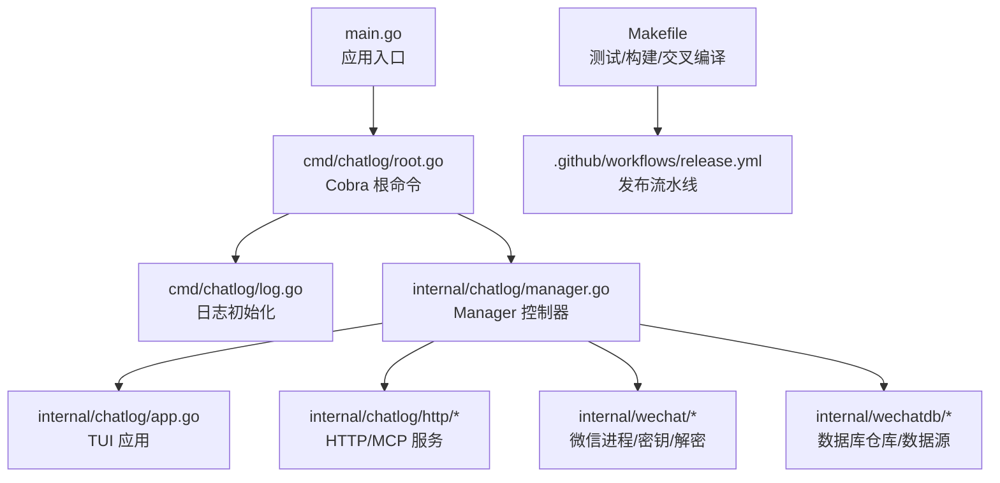
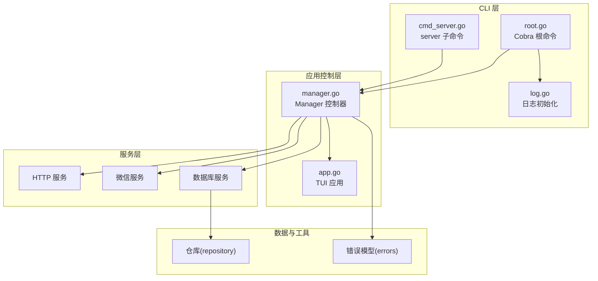
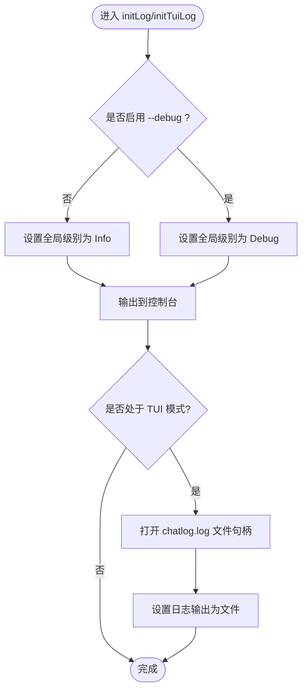
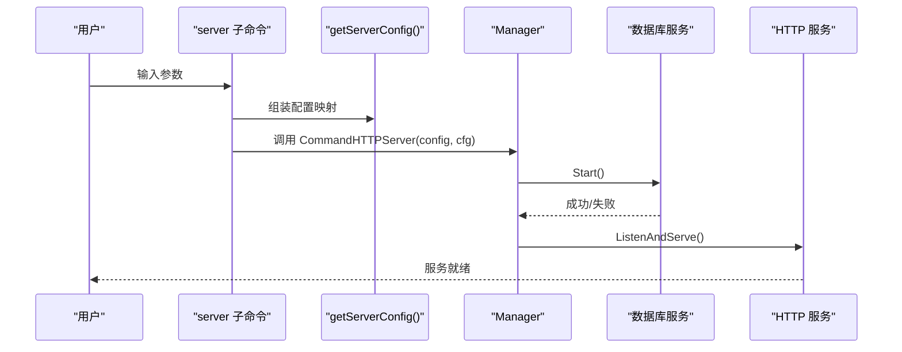
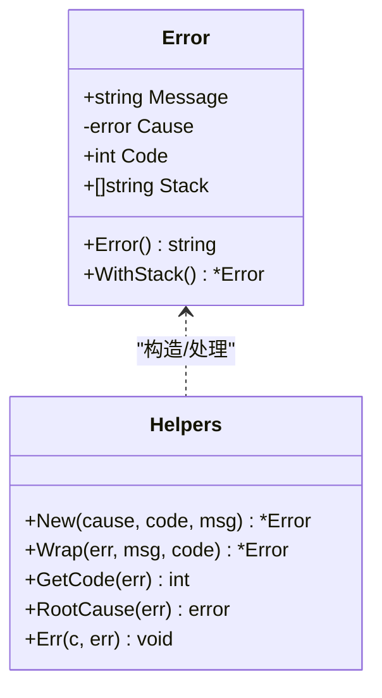
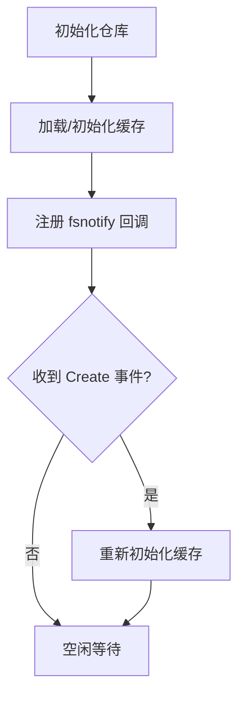
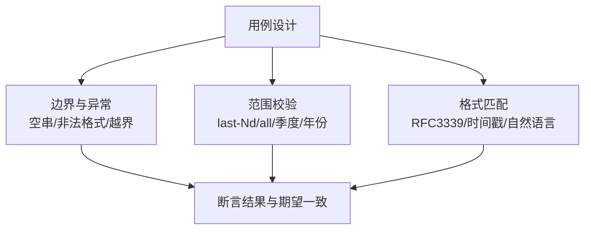
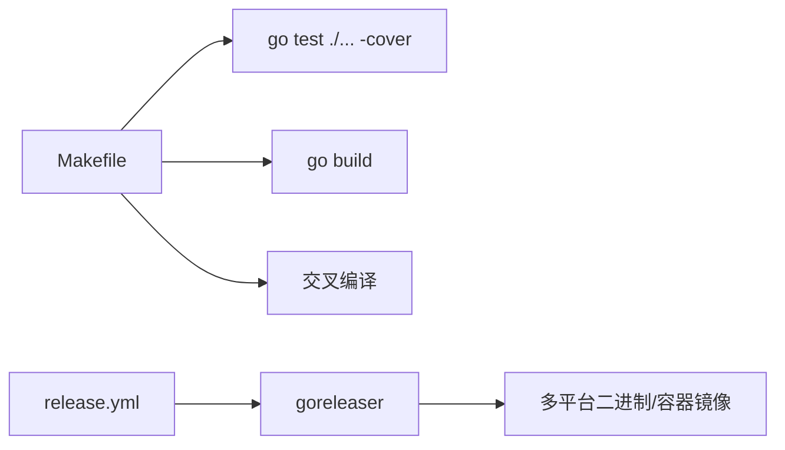

# 调试与测试

<cite>
**本文引用的文件**   
- [go.mod](file://go.mod)
- [Makefile](file://Makefile)
- [.github/workflows/release.yml](file://.github/workflows/release.yml)
- [main.go](file://main.go)
- [cmd/chatlog/root.go](file://cmd/chatlog/root.go)
- [cmd/chatlog/log.go](file://cmd/chatlog/log.go)
- [cmd/chatlog/cmd_server.go](file://cmd/chatlog/cmd_server.go)
- [internal/chatlog/manager.go](file://internal/chatlog/manager.go)
- [internal/chatlog/app.go](file://internal/chatlog/app.go)
- [internal/errors/errors.go](file://internal/errors/errors.go)
- [internal/wechat/manager.go](file://internal/wechat/manager.go)
- [internal/wechatdb/repository/repository.go](file://internal/wechatdb/repository/repository.go)
- [internal/wechatdb/datasource/dbm/dbm_test.go](file://internal/wechatdb/datasource/dbm/dbm_test.go)
- [pkg/util/time_test.go](file://pkg/util/time_test.go)
</cite>

## 目录
1. [简介](#简介)
2. [项目结构](#项目结构)
3. [核心组件](#核心组件)
4. [架构总览](#架构总览)
5. [详细组件分析](#详细组件分析)
6. [依赖分析](#依赖分析)
7. [性能考虑](#性能考虑)
8. [故障排查指南](#故障排查指南)
9. [结论](#结论)
10. [附录](#附录)

## 简介
本指南面向 Chatlog 项目的开发者与维护者，系统性介绍调试与测试方法，覆盖以下主题：
- 调试工具与技巧：Go 调试器使用、日志分析、性能分析工具
- 单元测试编写规范：测试文件组织、测试用例设计、模拟对象使用
- 集成测试与端到端测试：实施策略与落地步骤
- 常见问题的调试流程与故障排除
- 测试覆盖率要求与持续集成配置

## 项目结构
Chatlog 采用模块化分层结构，命令入口位于 cmd/chatlog，业务逻辑集中在 internal，通用工具与配置在 pkg。构建与测试通过 Makefile 统一管理，GitHub Actions 负责发布流水线。

**图表来源**
- [main.go](file://main.go#L1-L12)
- [cmd/chatlog/root.go](file://cmd/chatlog/root.go#L1-L42)
- [cmd/chatlog/log.go](file://cmd/chatlog/log.go#L1-L45)
- [internal/chatlog/manager.go](file://internal/chatlog/manager.go#L1-L408)
- [internal/chatlog/app.go](file://internal/chatlog/app.go#L1-L843)
- [Makefile](file://Makefile#L1-L60)
- [.github/workflows/release.yml](file://.github/workflows/release.yml#L1-L58)

**章节来源**
- [main.go](file://main.go#L1-L12)
- [cmd/chatlog/root.go](file://cmd/chatlog/root.go#L1-L42)
- [cmd/chatlog/log.go](file://cmd/chatlog/log.go#L1-L45)
- [Makefile](file://Makefile#L1-L60)
- [.github/workflows/release.yml](file://.github/workflows/release.yml#L1-L58)

## 核心组件
- 日志系统：基于 zerolog 与 logrus，支持控制台输出与文件落盘；通过命令行开关启用调试级别。
- 命令行与服务：Cobra 提供 server 子命令，支持 HTTP/MCP 服务启动与参数注入。
- 应用控制器：Manager 负责服务生命周期（数据库、HTTP、微信），并协调 UI 与后台任务。
- 错误模型：统一错误包装与堆栈记录，便于定位问题根因。
- 数据访问：仓库模式结合文件系统监控，实现缓存与增量更新。

**章节来源**
- [cmd/chatlog/log.go](file://cmd/chatlog/log.go#L1-L45)
- [cmd/chatlog/cmd_server.go](file://cmd/chatlog/cmd_server.go#L1-L79)
- [internal/chatlog/manager.go](file://internal/chatlog/manager.go#L1-L408)
- [internal/errors/errors.go](file://internal/errors/errors.go#L1-L125)
- [internal/wechatdb/repository/repository.go](file://internal/wechatdb/repository/repository.go#L1-L112)

## 架构总览
下图展示 CLI、Manager、服务与外部依赖之间的交互关系。

**图表来源**
- [cmd/chatlog/root.go](file://cmd/chatlog/root.go#L1-L42)
- [cmd/chatlog/cmd_server.go](file://cmd/chatlog/cmd_server.go#L1-L79)
- [cmd/chatlog/log.go](file://cmd/chatlog/log.go#L1-L45)
- [internal/chatlog/manager.go](file://internal/chatlog/manager.go#L1-L408)
- [internal/chatlog/app.go](file://internal/chatlog/app.go#L1-L843)
- [internal/errors/errors.go](file://internal/errors/errors.go#L1-L125)
- [internal/wechatdb/repository/repository.go](file://internal/wechatdb/repository/repository.go#L1-L112)

## 详细组件分析

### 日志与调试
- 全局日志级别：默认 Info，启用 --debug 切换至 Debug。
- 输出目标：控制台 writer；TUI 模式下可将日志写入工作目录下的 chatlog.log 文件。
- 调试建议：
  - 使用 --debug 观察更细粒度日志；
  - 在 CI 或生产环境可通过环境变量或配置调整日志级别；
  - 关键路径增加带上下文的日志条目，便于回溯。

**图表来源**
- [cmd/chatlog/log.go](file://cmd/chatlog/log.go#L1-L45)

**章节来源**
- [cmd/chatlog/log.go](file://cmd/chatlog/log.go#L1-L45)
- [cmd/chatlog/root.go](file://cmd/chatlog/root.go#L1-L42)

### 服务器命令与参数注入
- server 子命令支持地址、平台、版本、数据目录、密钥、工作目录、自动解密等参数。
- 参数通过 getServerConfig 注入到运行时配置，Manager.CommandHTTPServer 按依赖顺序启动服务。

**图表来源**
- [cmd/chatlog/cmd_server.go](file://cmd/chatlog/cmd_server.go#L1-L79)
- [internal/chatlog/manager.go](file://internal/chatlog/manager.go#L335-L407)

**章节来源**
- [cmd/chatlog/cmd_server.go](file://cmd/chatlog/cmd_server.go#L1-L79)
- [internal/chatlog/manager.go](file://internal/chatlog/manager.go#L335-L407)

### 错误模型与堆栈
- 统一错误类型包含消息、原始错误、HTTP 状态码与调用栈；
- 支持 Wrap 与 RootCause，便于链路错误透传与根因定位；
- HTTP 中间件按错误类型返回对应 JSON。

**图表来源**
- [internal/errors/errors.go](file://internal/errors/errors.go#L1-L125)

**章节来源**
- [internal/errors/errors.go](file://internal/errors/errors.go#L1-L125)

### 数据仓库与回调
- 仓库初始化时建立多维度缓存（联系人、群聊）；
- 通过 fsnotify 监听数据源变更，触发缓存重建；
- 异常以错误模型封装并记录日志。

**图表来源**
- [internal/wechatdb/repository/repository.go](file://internal/wechatdb/repository/repository.go#L1-L112)

**章节来源**
- [internal/wechatdb/repository/repository.go](file://internal/wechatdb/repository/repository.go#L1-L112)

### 单元测试与测试文件组织
- 测试文件命名遵循 Go 标准：*_test.go；
- 测试用例覆盖边界条件与异常分支，如时间解析、时间范围、无效输入等；
- 工具函数测试示例：pkg/util/time_test.go；
- 数据源/仓库行为验证：internal/wechatdb/datasource/dbm/dbm_test.go（演示性用法）。

**图表来源**
- [pkg/util/time_test.go](file://pkg/util/time_test.go#L1-L1005)
- [internal/wechatdb/datasource/dbm/dbm_test.go](file://internal/wechatdb/datasource/dbm/dbm_test.go#L1-L43)

**章节来源**
- [pkg/util/time_test.go](file://pkg/util/time_test.go#L1-L1005)
- [internal/wechatdb/datasource/dbm/dbm_test.go](file://internal/wechatdb/datasource/dbm/dbm_test.go#L1-L43)

### 集成测试与端到端测试
- 集成测试建议：
  - 以 Manager 为入口，组合数据库、HTTP、微信服务，验证启动/停止与状态切换；
  - 使用临时目录与内存数据库，避免污染真实数据；
  - 通过 fsnotify 回调验证缓存更新。
- 端到端测试建议：
  - 通过 server 子命令启动 HTTP 服务，发起请求验证路由与响应；
  - 模拟微信进程与密钥获取，验证解密流程；
  - 覆盖 UI 交互（TUI）的关键路径，如菜单切换、自动解密开关。

[本节为方法论说明，不直接分析具体文件]

## 依赖分析
- 构建与测试：Makefile 提供 test、build、crossbuild 等目标，统一版本注入与二进制产物管理。
- 发布流水线：GitHub Actions 使用 goreleaser 进行跨平台打包与容器镜像推送。
- 依赖声明：go.mod 明确第三方库版本，确保可复现构建。

**图表来源**
- [Makefile](file://Makefile#L1-L60)
- [.github/workflows/release.yml](file://.github/workflows/release.yml#L1-L58)

**章节来源**
- [Makefile](file://Makefile#L1-L60)
- [.github/workflows/release.yml](file://.github/workflows/release.yml#L1-L58)
- [go.mod](file://go.mod#L1-L82)

## 性能考虑
- 日志级别：生产环境建议 Info，避免 Debug 的高开销；
- 服务启动顺序：先数据库后 HTTP，失败时按逆序回滚，减少资源占用；
- UI 刷新：定时器周期性刷新，避免频繁重绘；
- 文件监控：仓库回调仅在 Create 事件触发缓存重建，降低无效开销。

[本节为通用指导，不直接分析具体文件]

## 故障排查指南
- 启动失败
  - 检查日志级别与输出位置（控制台/文件）；
  - 确认 server 子命令参数（数据目录、密钥、工作目录）完整；
  - 若数据库无法启动，尝试先执行解密流程再启动服务。
- HTTP 服务不可用
  - 核对监听地址与端口；
  - 检查防火墙与端口占用；
  - 查看错误模型返回的 HTTP 状态码与消息。
- 自动解密未生效
  - 确认已获取数据密钥与工作目录；
  - 检查微信进程是否存在且版本匹配；
  - 观察 fsnotify 回调是否触发缓存重建。
- UI 卡顿
  - 减少日志输出或降低刷新频率；
  - 检查后台任务并发与阻塞点。

**章节来源**
- [cmd/chatlog/log.go](file://cmd/chatlog/log.go#L1-L45)
- [cmd/chatlog/cmd_server.go](file://cmd/chatlog/cmd_server.go#L1-L79)
- [internal/chatlog/manager.go](file://internal/chatlog/manager.go#L335-L407)
- [internal/errors/errors.go](file://internal/errors/errors.go#L1-L125)
- [internal/wechatdb/repository/repository.go](file://internal/wechatdb/repository/repository.go#L1-L112)

## 结论
通过统一的日志体系、清晰的命令与服务分层、完善的错误模型与仓库缓存机制，Chatlog 形成了可调试、可测试、可维护的架构。建议在开发与 CI 中坚持：
- 使用 --debug 与文件日志辅助定位问题；
- 以单元测试覆盖边界与异常，集成测试验证端到端流程；
- 保持测试覆盖率稳定提升，配合发布流水线自动化交付。

[本节为总结，不直接分析具体文件]

## 附录

### 调试工具与技巧清单
- Go 调试器：dlv attach/launch，结合日志定位协程与阻塞点
- 日志：zerolog/logrus 双通道输出，必要时临时提升级别
- 性能：pprof（net/http/pprof），采集 CPU/内存/阻塞剖析
- 网络：curl/HTTP 客户端验证服务端点与中间件行为
- 文件系统：观察 fsnotify 回调与缓存重建时机

[本节为通用清单，不直接分析具体文件]

### 测试覆盖率与持续集成
- 覆盖率：Makefile 使用 -cover，建议在 CI 中设置阈值并报告差异
- CI：GitHub Actions 使用 goreleaser 进行跨平台构建与发布
- 建议：在 PR 中强制执行 go test -cover 与 linter，确保质量门槛

**章节来源**
- [Makefile](file://Makefile#L38-L40)
- [.github/workflows/release.yml](file://.github/workflows/release.yml#L1-L58)