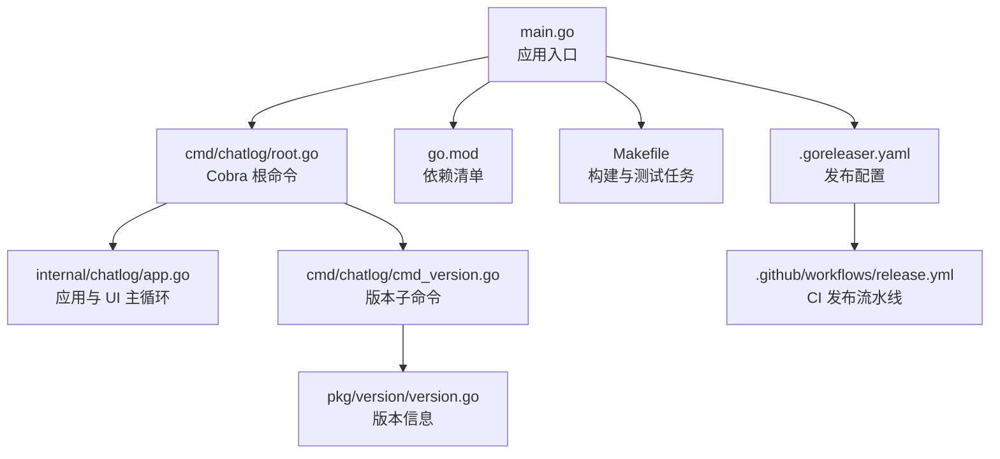
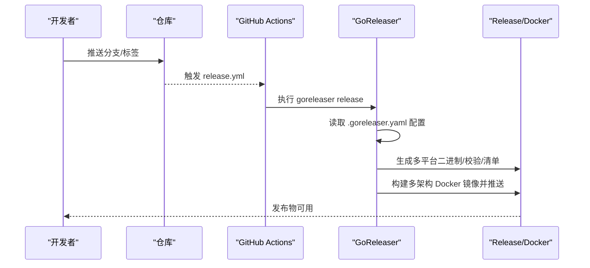
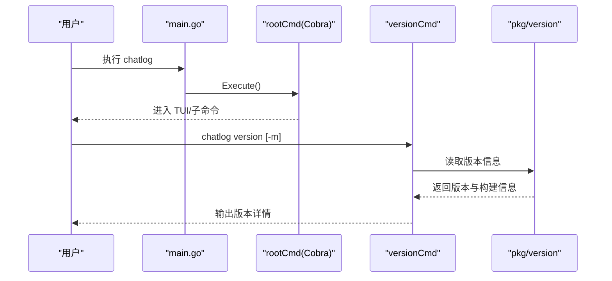
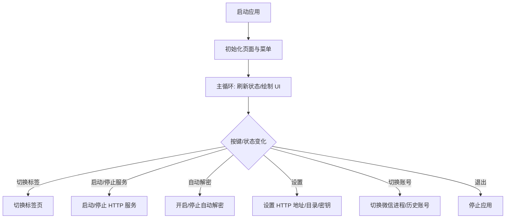
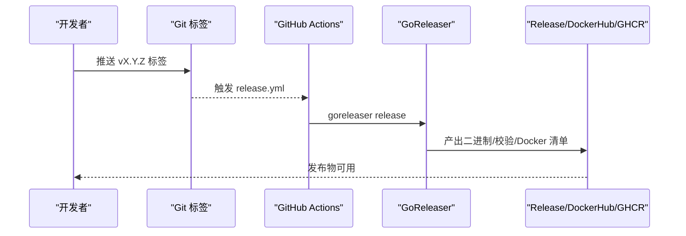
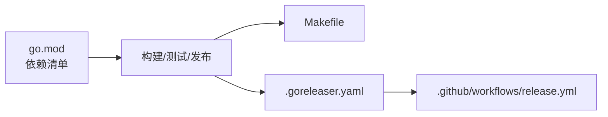

# 贡献指南

<cite>
**本文引用的文件**
- [README.md](file://README.md)
- [.goreleaser.yaml](file://.goreleaser.yaml)
- [.github/workflows/release.yml](file://.github/workflows/release.yml)
- [Makefile](file://Makefile)
- [go.mod](file://go.mod)
- [main.go](file://main.go)
- [cmd/chatlog/root.go](file://cmd/chatlog/root.go)
- [cmd/chatlog/cmd_version.go](file://cmd/chatlog/cmd_version.go)
- [pkg/version/version.go](file://pkg/version/version.go)
- [internal/chatlog/app.go](file://internal/chatlog/app.go)
- [LICENSE](file://LICENSE)
</cite>

## 目录
1. [简介](#简介)
2. [项目结构](#项目结构)
3. [核心组件](#核心组件)
4. [架构总览](#架构总览)
5. [详细组件分析](#详细组件分析)
6. [依赖关系分析](#依赖关系分析)
7. [性能考量](#性能考量)
8. [故障排查指南](#故障排查指南)
9. [结论](#结论)
10. [附录](#附录)

## 简介
本指南面向希望参与 Chatlog 项目开发的贡献者，覆盖从 Fork 项目到提交 PR 的全流程，涵盖代码提交规范、变更日志维护与版本标记建议、代码审查与合并要求、Issue 报告模板与功能请求流程、社区行为准则与沟通渠道，以及发布流程与版本管理策略。目标是帮助新老贡献者高效协作，保持高质量交付。

## 项目结构
Chatlog 是一个用 Go 实现的跨平台聊天记录工具，支持 Windows/macOS，兼容微信 3.x/4.x 数据库，提供命令行、TUI、HTTP API、MCP 集成与 Docker 部署能力。项目采用模块化组织，核心入口位于根目录，CLI 子命令由 Cobra 管理，业务逻辑分布在 internal、pkg 等目录，构建与发布通过 Makefile 与 GoReleaser 配合完成。

图表来源
- [main.go](file://main.go#L1-L13)
- [cmd/chatlog/root.go](file://cmd/chatlog/root.go#L1-L43)
- [cmd/chatlog/cmd_version.go](file://cmd/chatlog/cmd_version.go#L1-L28)
- [pkg/version/version.go](file://pkg/version/version.go#L1-L33)
- [go.mod](file://go.mod#L1-L82)
- [Makefile](file://Makefile#L1-L60)
- [.goreleaser.yaml](file://.goreleaser.yaml#L1-L159)
- [.github/workflows/release.yml](file://.github/workflows/release.yml#L1-L58)

章节来源
- [README.md](file://README.md#L1-L357)
- [main.go](file://main.go#L1-L13)
- [cmd/chatlog/root.go](file://cmd/chatlog/root.go#L1-L43)
- [go.mod](file://go.mod#L1-L82)

## 核心组件
- 应用入口与 CLI
  - 入口函数负责初始化日志并执行根命令。
  - 根命令由 Cobra 提供，包含调试开关、TUI 初始化与主流程入口。
- 版本信息
  - 版本号通过构建时 ldflags 注入，运行时读取构建信息输出版本与环境信息。
- 构建与测试
  - Makefile 提供清理、lint、mod tidy、测试、构建与交叉编译任务。
- 发布与打包
  - GoReleaser 配置多平台二进制、压缩、校验、Docker 镜像与多架构清单。
  - GitHub Actions 触发发布，登录镜像仓库并执行发布。

章节来源
- [main.go](file://main.go#L1-L13)
- [cmd/chatlog/root.go](file://cmd/chatlog/root.go#L1-L43)
- [cmd/chatlog/cmd_version.go](file://cmd/chatlog/cmd_version.go#L1-L28)
- [pkg/version/version.go](file://pkg/version/version.go#L1-L33)
- [Makefile](file://Makefile#L1-L60)
- [.goreleaser.yaml](file://.goreleaser.yaml#L1-L159)
- [.github/workflows/release.yml](file://.github/workflows/release.yml#L1-L58)

## 架构总览
下图展示从用户命令到应用执行、再到发布产物的关键路径：

图表来源
- [.github/workflows/release.yml](file://.github/workflows/release.yml#L1-L58)
- [.goreleaser.yaml](file://.goreleaser.yaml#L1-L159)

## 详细组件分析

### CLI 与命令流
- 根命令负责初始化日志、调试开关与主流程入口。
- 版本子命令支持输出版本与模块信息，便于定位构建环境。

图表来源
- [main.go](file://main.go#L1-L13)
- [cmd/chatlog/root.go](file://cmd/chatlog/root.go#L1-L43)
- [cmd/chatlog/cmd_version.go](file://cmd/chatlog/cmd_version.go#L1-L28)
- [pkg/version/version.go](file://pkg/version/version.go#L1-L33)

章节来源
- [cmd/chatlog/root.go](file://cmd/chatlog/root.go#L1-L43)
- [cmd/chatlog/cmd_version.go](file://cmd/chatlog/cmd_version.go#L1-L28)
- [pkg/version/version.go](file://pkg/version/version.go#L1-L33)

### 应用与 UI 主循环
- 应用封装 TUI 页面、菜单、信息栏与底部栏，负责刷新状态、响应键盘事件与切换账号。
- 菜单项覆盖“获取密钥”“解密数据”“启动 HTTP 服务”“开启自动解密”“设置”“切换账号”等。

图表来源
- [internal/chatlog/app.go](file://internal/chatlog/app.go#L1-L843)

章节来源
- [internal/chatlog/app.go](file://internal/chatlog/app.go#L1-L843)

### 发布与版本管理
- 版本注入：构建时通过 ldflags 注入版本号；运行时读取构建信息输出版本与环境。
- 发布配置：GoReleaser 统一管理多平台二进制、压缩、校验、Docker 镜像与多架构清单。
- CI 触发：推送标签触发发布作业，登录镜像仓库并执行发布。

图表来源
- [.github/workflows/release.yml](file://.github/workflows/release.yml#L1-L58)
- [.goreleaser.yaml](file://.goreleaser.yaml#L1-L159)

章节来源
- [.goreleaser.yaml](file://.goreleaser.yaml#L1-L159)
- [.github/workflows/release.yml](file://.github/workflows/release.yml#L1-L58)
- [Makefile](file://Makefile#L1-L60)
- [pkg/version/version.go](file://pkg/version/version.go#L1-L33)

## 依赖关系分析
- 语言与工具链
  - Go 版本要求与依赖清单由 go.mod 管理。
  - 构建脚本与测试通过 Makefile 统一调度。
- 第三方库
  - UI 与终端交互、HTTP 框架、日志、序列化、压缩、跨平台工具集等。
- 发布与打包
  - GoReleaser 与 GitHub Actions 协同，实现跨平台二进制与 Docker 镜像自动化。

图表来源
- [go.mod](file://go.mod#L1-L82)
- [Makefile](file://Makefile#L1-L60)
- [.goreleaser.yaml](file://.goreleaser.yaml#L1-L159)
- [.github/workflows/release.yml](file://.github/workflows/release.yml#L1-L58)

章节来源
- [go.mod](file://go.mod#L1-L82)
- [Makefile](file://Makefile#L1-L60)

## 性能考量
- 构建优化
  - 使用 UPX 压缩二进制，减少体积；按平台启用压缩。
- 运行时刷新
  - UI 刷新采用定时器，避免频繁重绘；仅在状态变化时更新信息栏与菜单项。
- 多架构支持
  - 发布配置覆盖 amd64/arm64，满足主流桌面与服务器场景。

章节来源
- [.goreleaser.yaml](file://.goreleaser.yaml#L60-L66)
- [internal/chatlog/app.go](file://internal/chatlog/app.go#L135-L172)

## 故障排查指南
- 构建失败
  - 确认本地 Go 版本满足 go.mod 要求；先执行依赖整理与测试。
- 发布失败
  - 检查 CI 密钥与镜像仓库登录信息；确认标签命名符合触发条件。
- 版本信息异常
  - 确认构建时 ldflags 注入是否生效；运行版本命令验证输出。

章节来源
- [Makefile](file://Makefile#L30-L40)
- [.github/workflows/release.yml](file://.github/workflows/release.yml#L42-L56)
- [pkg/version/version.go](file://pkg/version/version.go#L15-L32)

## 结论
本指南提供了从开发到发布的完整流程与最佳实践。建议贡献者遵循统一的提交规范、测试与构建流程，并在发布前确保版本标记与发布配置正确。通过明确的审查与沟通机制，持续提升项目质量与社区协作效率。

## 附录

### 参与开发流程（Fork → 分支 → 提交 → PR）
- Fork 项目至个人仓库
- 新建功能/修复分支，建议以 feat/fix/docs/chore 前缀命名
- 提交前执行：依赖整理、代码检查、单元测试
- 提交信息格式建议：类型(scope): 描述（参考 Conventional Commits）
- 推送分支并发起 Pull Request，填写 PR 模板（见下节）

章节来源
- [Makefile](file://Makefile#L30-L40)

### 代码提交规范
- 提交信息格式
  - 类型: feat、fix、docs、style、refactor、perf、test、build、ci、chore、revert
  - scope: 模块或包名（如 cmd/chatlog、internal/chatlog、pkg/version）
  - 描述: 使用动宾结构，简明扼要说明变更内容
- 变更日志维护
  - 在变更日志中记录重大功能、修复与破坏性变更，标注版本与日期
- 版本标记规则
  - 语义化版本：主版本.次版本.修订版
  - 发布标签：vX.Y.Z，CI 将据此触发发布

章节来源
- [.goreleaser.yaml](file://.goreleaser.yaml#L87-L91)
- [.github/workflows/release.yml](file://.github/workflows/release.yml#L4-L6)

### 代码审查与合并要求
- 至少一名维护者审查并批准
- 通过 CI 检查（lint、test、构建）
- 通过性测试：在目标平台验证核心功能（TUI、HTTP 服务、密钥/解密流程）
- 合并前确保变更日志与版本标记正确

章节来源
- [.goreleaser.yaml](file://.goreleaser.yaml#L87-L91)
- [Makefile](file://Makefile#L30-L40)

### Issue 报告模板与功能请求流程
- 报告 Bug
  - 环境信息：操作系统、Go 版本、程序版本
  - 复现步骤：最小可复现步骤
  - 预期/实际结果：清晰对比
  - 日志与截图：附带关键日志片段与截图
- 功能请求
  - 背景与动机：为什么需要该功能
  - 期望行为：简述功能点
  - 影响范围：是否涉及破坏性变更
  - 优先级：P0/P1/P2/P3

章节来源
- [README.md](file://README.md#L1-L357)

### 社区行为准则与沟通渠道
- 行为准则
  - 尊重与包容：禁止骚扰、歧视与人身攻击
  - 建设性反馈：以事实与数据讨论技术方案
  - 合法合规：遵守法律法规，尊重知识产权
- 沟通渠道
  - Issues：Bug 报告与功能请求
  - Discussions：想法交流与经验分享
  - PR：代码贡献与审查

章节来源
- [README.md](file://README.md#L326-L326)

### 发布流程与版本管理策略
- 版本注入与输出
  - 构建时注入版本号；运行时输出版本与环境信息
- 发布配置
  - 多平台二进制、压缩、校验、Docker 镜像与多架构清单
- CI 触发
  - 推送 v* 标签触发发布作业
- 许可证与免责声明
  - 采用 Apache-2.0 许可证；使用前须阅读免责声明

章节来源
- [pkg/version/version.go](file://pkg/version/version.go#L10-L32)
- [.goreleaser.yaml](file://.goreleaser.yaml#L11-L159)
- [.github/workflows/release.yml](file://.github/workflows/release.yml#L3-L6)
- [LICENSE](file://LICENSE#L1-L202)
- [README.md](file://README.md#L328-L342)