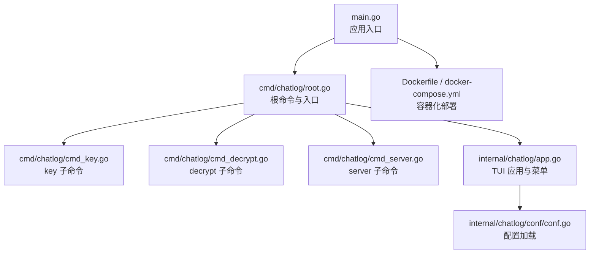
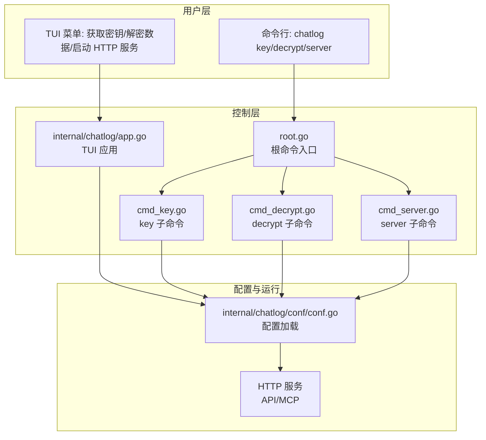
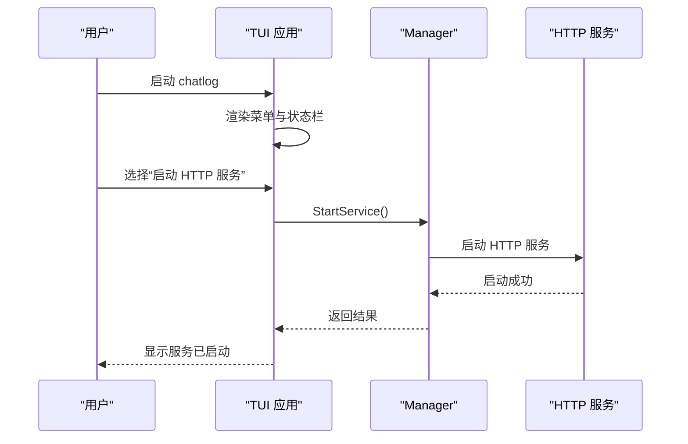
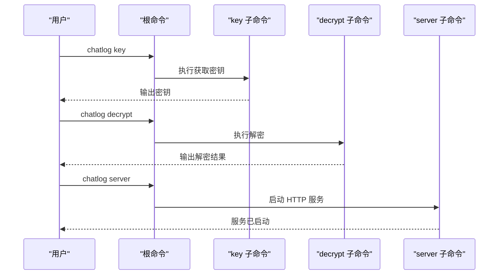
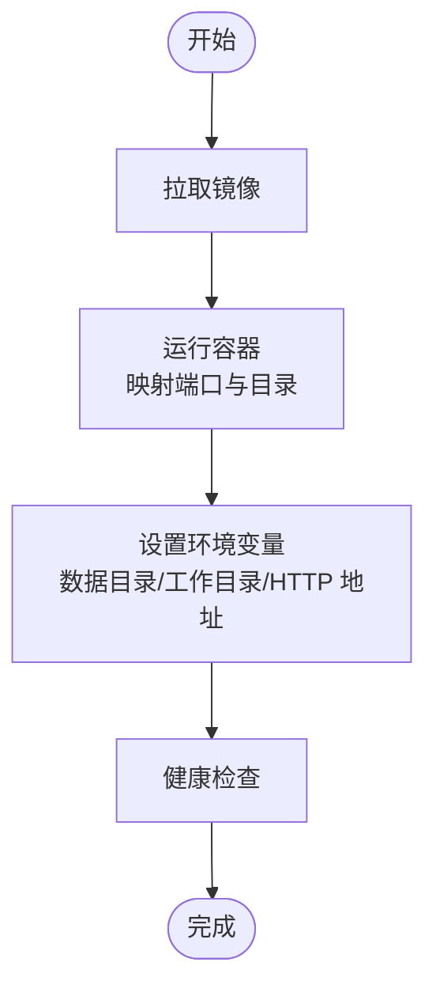
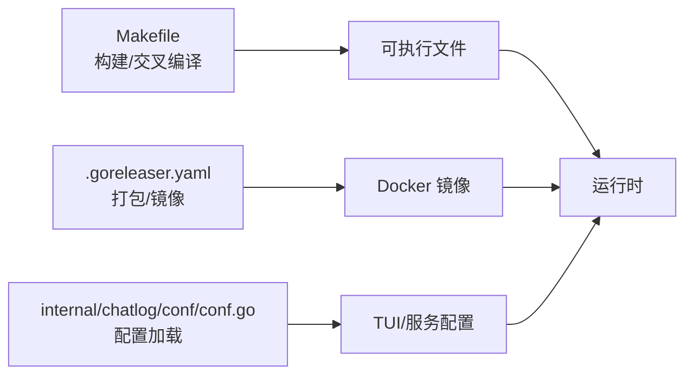
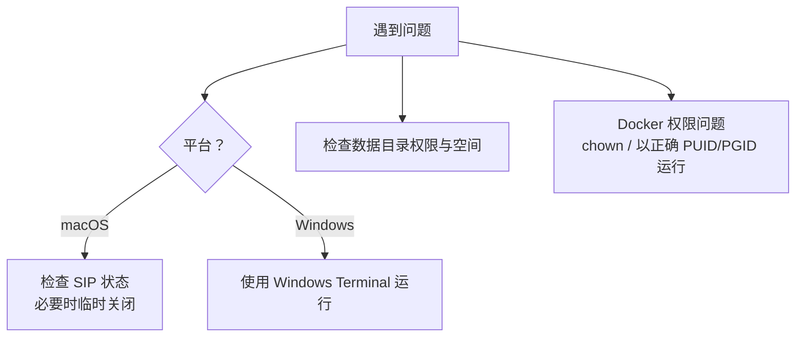

# 快速开始

<cite>
**本文引用的文件**
- [README.md](file://README.md)
- [main.go](file://main.go)
- [cmd/chatlog/root.go](file://cmd/chatlog/root.go)
- [cmd/chatlog/cmd_key.go](file://cmd/chatlog/cmd_key.go)
- [cmd/chatlog/cmd_decrypt.go](file://cmd/chatlog/cmd_decrypt.go)
- [cmd/chatlog/cmd_server.go](file://cmd/chatlog/cmd_server.go)
- [internal/chatlog/app.go](file://internal/chatlog/app.go)
- [internal/chatlog/conf/conf.go](file://internal/chatlog/conf/conf.go)
- [Dockerfile](file://Dockerfile)
- [docker-compose.yml](file://docker-compose.yml)
- [script/docker-entrypoint.sh](file://script/docker-entrypoint.sh)
- [Makefile](file://Makefile)
- [.goreleaser.yaml](file://.goreleaser.yaml)
- [internal/errors/os_errors.go](file://internal/errors/os_errors.go)
- [internal/ui/style/style_windows.go](file://internal/ui/style/style_windows.go)
- [internal/ui/style/style.go](file://internal/ui/style/style.go)
- [internal/wechat/key/darwin/glance/sip.go](file://internal/wechat/key/darwin/glance/sip.go)
</cite>

## 目录
1. [简介](#简介)
2. [项目结构](#项目结构)
3. [核心组件](#核心组件)
4. [架构总览](#架构总览)
5. [详细组件分析](#详细组件分析)
6. [依赖关系分析](#依赖关系分析)
7. [性能与可用性建议](#性能与可用性建议)
8. [故障排查指南](#故障排查指南)
9. [结论](#结论)
10. [附录](#附录)

## 简介
本指南面向新手用户，帮助你在 5 分钟内完成 Chatlog 的安装与基本使用。你将学会：
- 从源码安装或下载预编译版本
- 三种使用模式：Terminal UI 界面、命令行模式、Docker 部署
- 基本操作流程：获取密钥、解密数据、启动 HTTP 服务
- 常见问题快速解决：macOS 关闭 SIP、Windows 界面显示问题

## 项目结构
Chatlog 是一个基于 Go 的命令行工具，提供 Terminal UI、命令行接口与 HTTP 服务，并支持 Docker 部署。核心入口为根命令，通过子命令实现“获取密钥”“解密数据”“启动 HTTP 服务”等功能；TUI 界面提供交互式菜单，便于非技术用户操作。

图示来源
- [main.go](file://main.go#L1-L13)
- [cmd/chatlog/root.go](file://cmd/chatlog/root.go#L1-L43)
- [cmd/chatlog/cmd_key.go](file://cmd/chatlog/cmd_key.go#L1-L37)
- [cmd/chatlog/cmd_decrypt.go](file://cmd/chatlog/cmd_decrypt.go#L1-L64)
- [cmd/chatlog/cmd_server.go](file://cmd/chatlog/cmd_server.go#L1-L79)
- [internal/chatlog/app.go](file://internal/chatlog/app.go#L1-L800)
- [internal/chatlog/conf/conf.go](file://internal/chatlog/conf/conf.go#L1-L106)
- [Dockerfile](file://Dockerfile#L1-L45)
- [docker-compose.yml](file://docker-compose.yml#L1-L39)

章节来源
- [main.go](file://main.go#L1-L13)
- [cmd/chatlog/root.go](file://cmd/chatlog/root.go#L1-L43)
- [cmd/chatlog/cmd_key.go](file://cmd/chatlog/cmd_key.go#L1-L37)
- [cmd/chatlog/cmd_decrypt.go](file://cmd/chatlog/cmd_decrypt.go#L1-L64)
- [cmd/chatlog/cmd_server.go](file://cmd/chatlog/cmd_server.go#L1-L79)
- [internal/chatlog/app.go](file://internal/chatlog/app.go#L1-L800)
- [internal/chatlog/conf/conf.go](file://internal/chatlog/conf/conf.go#L1-L106)
- [Dockerfile](file://Dockerfile#L1-L45)
- [docker-compose.yml](file://docker-compose.yml#L1-L39)

## 核心组件
- 根命令与入口：负责初始化日志、注册子命令、运行应用实例。
- 子命令模块：分别实现“获取密钥”“解密数据”“启动 HTTP 服务”的 CLI 能力。
- TUI 应用：提供菜单驱动的操作体验，支持切换账号、设置、自动解密、HTTP 服务启停等。
- 配置系统：支持环境变量、配置文件与命令行参数组合，覆盖服务与 TUI 配置。
- 容器化：Dockerfile 与 docker-compose 提供一键部署与健康检查。

章节来源
- [cmd/chatlog/root.go](file://cmd/chatlog/root.go#L1-L43)
- [cmd/chatlog/cmd_key.go](file://cmd/chatlog/cmd_key.go#L1-L37)
- [cmd/chatlog/cmd_decrypt.go](file://cmd/chatlog/cmd_decrypt.go#L1-L64)
- [cmd/chatlog/cmd_server.go](file://cmd/chatlog/cmd_server.go#L1-L79)
- [internal/chatlog/app.go](file://internal/chatlog/app.go#L1-L800)
- [internal/chatlog/conf/conf.go](file://internal/chatlog/conf/conf.go#L1-L106)
- [Dockerfile](file://Dockerfile#L1-L45)
- [docker-compose.yml](file://docker-compose.yml#L1-L39)

## 架构总览
下图展示从用户操作到系统响应的关键路径：CLI 子命令与 TUI 菜单最终调用内部业务逻辑，启动 HTTP 服务并提供 API/MCP 能力。

图示来源
- [cmd/chatlog/root.go](file://cmd/chatlog/root.go#L1-L43)
- [cmd/chatlog/cmd_key.go](file://cmd/chatlog/cmd_key.go#L1-L37)
- [cmd/chatlog/cmd_decrypt.go](file://cmd/chatlog/cmd_decrypt.go#L1-L64)
- [cmd/chatlog/cmd_server.go](file://cmd/chatlog/cmd_server.go#L1-L79)
- [internal/chatlog/app.go](file://internal/chatlog/app.go#L1-L800)
- [internal/chatlog/conf/conf.go](file://internal/chatlog/conf/conf.go#L1-L106)

## 详细组件分析

### 安装方式
- 从源码安装：使用 Go 安装最新版本，适用于 Linux/macOS/Windows。
- 下载预编译版本：访问 Releases 页面，选择对应平台的二进制包。
- Docker 部署：拉取官方镜像，挂载微信数据目录，启动容器即可。

章节来源
- [README.md](file://README.md#L48-L61)
- [README.md](file://README.md#L93-L134)
- [Makefile](file://Makefile#L42-L60)
- [.goreleaser.yaml](file://.goreleaser.yaml#L8-L66)

### 使用模式

#### Terminal UI 界面
- 启动：直接运行 chatlog，进入交互式菜单。
- 基本操作：使用方向键选择菜单项，回车确认，Esc 返回，Ctrl+C 退出。
- 主要功能：获取密钥、解密数据、启动/停止 HTTP 服务、自动解密、设置、切换账号等。

图示来源
- [internal/chatlog/app.go](file://internal/chatlog/app.go#L279-L351)
- [internal/chatlog/app.go](file://internal/chatlog/app.go#L294-L317)

章节来源
- [README.md](file://README.md#L64-L77)
- [internal/chatlog/app.go](file://internal/chatlog/app.go#L1-L800)

#### 命令行模式
- 获取密钥：chatlog key
- 解密数据：chatlog decrypt
- 启动 HTTP 服务：chatlog server

图示来源
- [cmd/chatlog/root.go](file://cmd/chatlog/root.go#L18-L42)
- [cmd/chatlog/cmd_key.go](file://cmd/chatlog/cmd_key.go#L24-L36)
- [cmd/chatlog/cmd_decrypt.go](file://cmd/chatlog/cmd_decrypt.go#L29-L43)
- [cmd/chatlog/cmd_server.go](file://cmd/chatlog/cmd_server.go#L35-L49)

章节来源
- [README.md](file://README.md#L78-L91)
- [cmd/chatlog/cmd_key.go](file://cmd/chatlog/cmd_key.go#L1-L37)
- [cmd/chatlog/cmd_decrypt.go](file://cmd/chatlog/cmd_decrypt.go#L1-L64)
- [cmd/chatlog/cmd_server.go](file://cmd/chatlog/cmd_server.go#L1-L79)

#### Docker 部署
- 拉取镜像：支持 Docker Hub 与 GHCR。
- 运行容器：映射端口 5030，挂载微信数据目录与工作目录。
- 环境变量：可配置数据目录、工作目录、HTTP 地址、是否自动解密等。

图示来源
- [Dockerfile](file://Dockerfile#L1-L45)
- [docker-compose.yml](file://docker-compose.yml#L1-L39)
- [script/docker-entrypoint.sh](file://script/docker-entrypoint.sh#L1-L21)

章节来源
- [README.md](file://README.md#L93-L134)
- [Dockerfile](file://Dockerfile#L1-L45)
- [docker-compose.yml](file://docker-compose.yml#L1-L39)
- [script/docker-entrypoint.sh](file://script/docker-entrypoint.sh#L1-L21)

### 基本使用步骤
- 获取密钥：在 TUI 中选择“获取密钥”，或使用命令行 chatlog key。
- 解密数据：在 TUI 中选择“解密数据”，或使用命令行 chatlog decrypt。
- 启动 HTTP 服务：在 TUI 中选择“启动 HTTP 服务”，或使用命令行 chatlog server。
- 访问数据：通过 HTTP API 或 MCP 集成访问聊天记录。

章节来源
- [README.md](file://README.md#L29-L47)
- [README.md](file://README.md#L178-L214)
- [README.md](file://README.md#L295-L319)
- [internal/chatlog/app.go](file://internal/chatlog/app.go#L203-L460)

## 依赖关系分析
- 构建与发布：Makefile 负责构建与交叉编译；.goreleaser.yaml 配置跨平台打包与多架构 Docker 镜像。
- 配置加载：TUI 与服务配置通过统一的配置管理器加载，支持环境变量与数据目录内的配置文件。
- 平台差异：Windows 与非 Windows 的 UI 样式、错误处理存在差异化实现。

图示来源
- [Makefile](file://Makefile#L1-L60)
- [.goreleaser.yaml](file://.goreleaser.yaml#L1-L159)
- [internal/chatlog/conf/conf.go](file://internal/chatlog/conf/conf.go#L1-L106)

章节来源
- [Makefile](file://Makefile#L1-L60)
- [.goreleaser.yaml](file://.goreleaser.yaml#L1-L159)
- [internal/chatlog/conf/conf.go](file://internal/chatlog/conf/conf.go#L1-L106)

## 性能与可用性建议
- 使用 Docker 时，建议将数据目录与工作目录持久化，避免容器重建导致数据丢失。
- 若微信版本为 3.x，自动解密更新可能不够及时，延迟较高；优先使用 4.0 版本以获得更低延迟。
- 在 macOS 上获取密钥前，若 SIP 未禁用，可能无法读取密钥；完成后可重新启用 SIP。

章节来源
- [README.md](file://README.md#L176-L177)
- [internal/chatlog/app.go](file://internal/chatlog/app.go#L378-L382)

## 故障排查指南
- macOS 用户需要临时关闭 SIP：在恢复模式中执行 csrutil disable，完成后可重新启用。
- Windows 用户界面显示异常：建议使用 Windows Terminal 运行程序。
- 文件读写相关错误：常见于权限不足或文件损坏，检查数据目录权限与磁盘空间。
- Docker 权限问题：容器以非 root 运行时，确保数据目录拥有正确的属主与权限。

图示来源
- [internal/wechat/key/darwin/glance/sip.go](file://internal/wechat/key/darwin/glance/sip.go#L1-L37)
- [README.md](file://README.md#L148-L177)
- [internal/ui/style/style_windows.go](file://internal/ui/style/style_windows.go#L1-L81)
- [internal/errors/os_errors.go](file://internal/errors/os_errors.go#L1-L24)
- [script/docker-entrypoint.sh](file://script/docker-entrypoint.sh#L1-L21)

章节来源
- [README.md](file://README.md#L41-L47)
- [README.md](file://README.md#L148-L177)
- [internal/errors/os_errors.go](file://internal/errors/os_errors.go#L1-L24)
- [internal/ui/style/style_windows.go](file://internal/ui/style/style_windows.go#L1-L81)
- [script/docker-entrypoint.sh](file://script/docker-entrypoint.sh#L1-L21)

## 结论
通过本快速开始指南，你已经掌握了 Chatlog 的安装与三种使用模式，并完成了获取密钥、解密数据与启动 HTTP 服务的基本流程。遇到平台相关问题时，可参考故障排查章节快速定位与解决。建议在生产环境中结合 Docker 进行部署，并合理配置数据与工作目录，确保数据安全与服务稳定。

## 附录
- HTTP API 与 MCP 集成详情可参考项目文档与 README 中的相关章节。
- 如需从手机迁移聊天记录，请参考 README 的“从手机迁移聊天记录”部分。

章节来源
- [README.md](file://README.md#L136-L144)
- [README.md](file://README.md#L178-L214)
- [README.md](file://README.md#L295-L319)