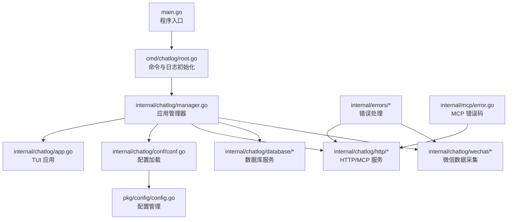
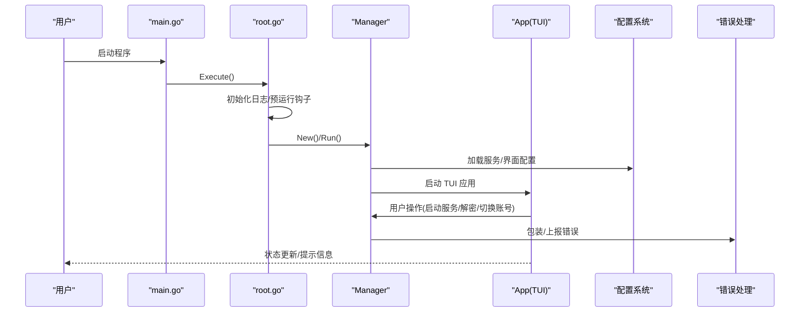
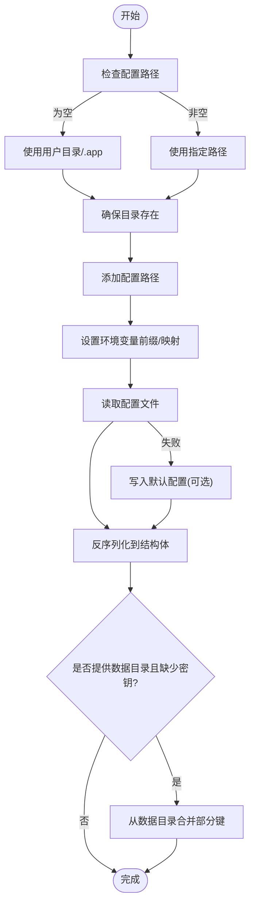
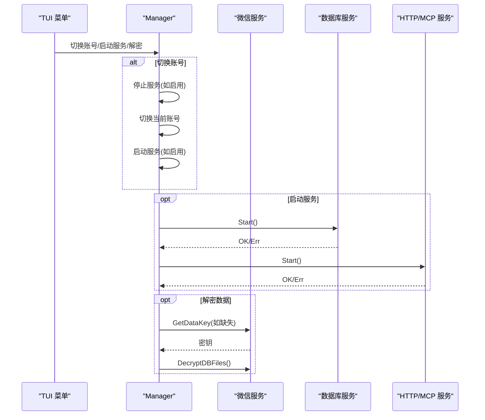
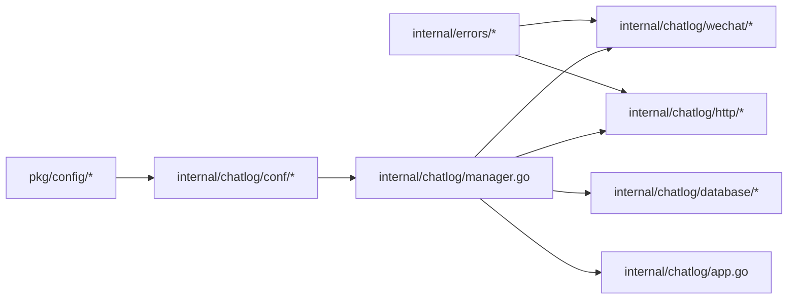

# 故障排除与常见问题

<cite>
**本文引用的文件**
- [main.go](file://main.go)
- [root.go](file://cmd/chatlog/root.go)
- [conf.go](file://internal/chatlog/conf/conf.go)
- [config.go](file://pkg/config/config.go)
- [app.go](file://internal/chatlog/app.go)
- [manager.go](file://internal/chatlog/manager.go)
- [errors.go](file://internal/errors/errors.go)
- [http_errors.go](file://internal/errors/http_errors.go)
- [os_errors.go](file://internal/errors/os_errors.go)
- [wechat_errors.go](file://internal/errors/wechat_errors.go)
- [wechatdb_errors.go](file://internal/errors/wechatdb_errors.go)
- [middleware.go](file://internal/errors/middleware.go)
- [error.go](file://internal/mcp/error.go)
</cite>

## 目录
1. [简介](#简介)
2. [项目结构](#项目结构)
3. [核心组件](#核心组件)
4. [架构总览](#架构总览)
5. [详细组件分析](#详细组件分析)
6. [依赖关系分析](#依赖关系分析)
7. [性能考虑](#性能考虑)
8. [故障排除指南](#故障排除指南)
9. [结论](#结论)

## 简介
本文件面向 Chatlog 用户与运维人员，提供系统化的故障排除与常见问题解答。内容覆盖平台差异、权限与密钥问题、网络与服务问题、性能与稳定性问题，并给出日志分析方法、错误码解读、调试技巧以及预防性维护与优化建议。

## 项目结构
Chatlog 采用模块化分层设计：命令入口负责参数解析与日志初始化；应用管理器协调微信数据采集、数据库服务与 HTTP/MCP 服务；错误处理模块统一包装与输出错误；配置模块负责读取与写入配置文件；UI 层提供 TUI 菜单与状态展示。



图表来源
- [main.go](file://main.go#L1-L13)
- [root.go](file://cmd/chatlog/root.go#L1-L43)
- [manager.go](file://internal/chatlog/manager.go#L1-L200)
- [app.go](file://internal/chatlog/app.go#L1-L200)
- [conf.go](file://internal/chatlog/conf/conf.go#L1-L106)
- [config.go](file://pkg/config/config.go#L1-L160)
- [errors.go](file://internal/errors/errors.go#L1-L125)
- [error.go](file://internal/mcp/error.go#L1-L55)

章节来源
- [main.go](file://main.go#L1-L13)
- [root.go](file://cmd/chatlog/root.go#L1-L43)
- [conf.go](file://internal/chatlog/conf/conf.go#L1-L106)
- [config.go](file://pkg/config/config.go#L1-L160)

## 核心组件
- 应用入口与日志
  - 入口设置日志标志，调用命令执行器。
  - 命令执行器初始化日志、TUI 日志钩子，执行根命令。
- 应用管理器
  - 组织微信服务、数据库服务、HTTP/MCP 服务与 TUI 应用生命周期。
  - 提供启动/停止服务、切换账号、设置地址、获取密钥、解密数据等能力。
- 配置系统
  - 支持环境变量前缀、默认路径、写回配置文件。
  - 支持从数据目录合并部分配置键。
- 错误处理
  - 统一错误包装、带堆栈、HTTP 状态码映射、Gin 中间件捕获与恢复。
  - 分类错误：HTTP 参数、操作系统文件、微信进程与内存、微信数据库、MCP。

章节来源
- [main.go](file://main.go#L1-L13)
- [root.go](file://cmd/chatlog/root.go#L1-L43)
- [manager.go](file://internal/chatlog/manager.go#L1-L200)
- [conf.go](file://internal/chatlog/conf/conf.go#L1-L106)
- [config.go](file://pkg/config/config.go#L1-L160)
- [errors.go](file://internal/errors/errors.go#L1-L125)

## 架构总览
下图展示从命令入口到服务启动、错误处理与 UI 的关键流程。



图表来源
- [main.go](file://main.go#L1-L13)
- [root.go](file://cmd/chatlog/root.go#L1-L43)
- [manager.go](file://internal/chatlog/manager.go#L1-L200)
- [app.go](file://internal/chatlog/app.go#L1-L200)
- [errors.go](file://internal/errors/errors.go#L1-L125)

## 详细组件分析

### 错误处理与中间件
- 统一错误类型与包装
  - 错误包含消息、原始原因、HTTP 状态码与调用栈。
  - 支持格式化构造、包装已有错误、提取根因、获取状态码。
- Gin 中间件
  - 请求级错误捕获与 X-Request-ID 注入。
  - Panic 恢复并记录堆栈，返回 500。
- MCP 错误码
  - 定义标准 JSON-RPC 与扩展错误码，便于 MCP 客户端识别。

```mermaid
classDiagram
class Error {
+string Message
+error Cause
+int Code
+[]string Stack
+Error() string
+WithStack() *Error
+Unwrap() error
}
class ErrorHandlerMiddleware {
+HandlerFunc() gin.HandlerFunc
}
class RecoveryMiddleware {
+HandlerFunc() gin.HandlerFunc
}
class MCP_Error {
+int Code
+string Message
+interface{} Data
+JsonRPC() Response
}
ErrorHandlerMiddleware --> Error : "使用"
RecoveryMiddleware --> Error : "创建/记录"
MCP_Error <.. Error : "与 HTTP 错误区分"
```

图表来源
- [errors.go](file://internal/errors/errors.go#L1-L125)
- [middleware.go](file://internal/errors/middleware.go#L1-L65)
- [error.go](file://internal/mcp/error.go#L1-L55)

章节来源
- [errors.go](file://internal/errors/errors.go#L1-L125)
- [middleware.go](file://internal/errors/middleware.go#L1-L65)
- [error.go](file://internal/mcp/error.go#L1-L55)

### 配置加载与写入
- 默认路径与环境变量
  - 若未指定路径，默认使用用户目录下的应用隐藏目录。
  - 支持通过环境变量前缀自动映射配置键。
- 写回策略
  - 可在读取失败时安全写入默认配置文件（当允许写入时）。
- 数据目录合并
  - 当存在数据目录且缺少密钥时，可从数据目录内配置文件合并部分键。



图表来源
- [config.go](file://pkg/config/config.go#L1-L160)
- [conf.go](file://internal/chatlog/conf/conf.go#L1-L106)

章节来源
- [config.go](file://pkg/config/config.go#L1-L160)
- [conf.go](file://internal/chatlog/conf/conf.go#L1-L106)

### 应用管理器与服务编排
- 生命周期
  - 初始化上下文与微信实例列表，按需启动数据库与 HTTP/MCP 服务。
  - TUI 应用阻塞运行，周期刷新状态栏信息。
- 关键操作
  - 切换账号：支持从进程实例或历史账号切换，必要时先停止服务再重启。
  - 启停服务：按依赖顺序启动/停止，4.0 版本额外设置图片解密相关参数。
  - 设置地址：解析端口/URL，更新上下文。
  - 获取/设置密钥：从微信进程提取密钥，或从用户输入设置。
  - 解密数据：校验密钥与工作目录，触发微信解密流程。



图表来源
- [manager.go](file://internal/chatlog/manager.go#L1-L200)
- [app.go](file://internal/chatlog/app.go#L1-L200)

章节来源
- [manager.go](file://internal/chatlog/manager.go#L1-L200)
- [app.go](file://internal/chatlog/app.go#L1-L200)

## 依赖关系分析
- 组件耦合
  - Manager 作为中枢，依赖配置、微信、数据库、HTTP/MCP 与 TUI。
  - 错误处理模块被 HTTP 与微信相关模块广泛使用。
- 外部依赖
  - Gin、Viper、tcell/tview、mark3labs/mcp-go 等。
- 潜在风险
  - 服务启动顺序不当可能导致资源竞争。
  - 配置写回失败可能影响后续启动。



图表来源
- [errors.go](file://internal/errors/errors.go#L1-L125)
- [conf.go](file://internal/chatlog/conf/conf.go#L1-L106)
- [config.go](file://pkg/config/config.go#L1-L160)
- [manager.go](file://internal/chatlog/manager.go#L1-L200)
- [app.go](file://internal/chatlog/app.go#L1-L200)

章节来源
- [errors.go](file://internal/errors/errors.go#L1-L125)
- [conf.go](file://internal/chatlog/conf/conf.go#L1-L106)
- [config.go](file://pkg/config/config.go#L1-L160)
- [manager.go](file://internal/chatlog/manager.go#L1-L200)
- [app.go](file://internal/chatlog/app.go#L1-L200)

## 性能考虑
- UI 刷新节流
  - TUI 刷新间隔固定，避免频繁刷新导致 CPU 占用过高。
- 服务启动顺序
  - 先数据库后 HTTP，减少连接抖动与失败重试开销。
- 4.0 版本图片解密
  - 后台扫描并设置 XOR/AES 相关参数，避免后续请求阻塞。
- 建议
  - 合理设置数据目录与工作目录，避免跨盘符频繁 IO。
  - 在高并发场景下，限制同时进行的解密任务数量。

章节来源
- [app.go](file://internal/chatlog/app.go#L1-L200)
- [manager.go](file://internal/chatlog/manager.go#L1-L200)

## 故障排除指南

### 一、平台与权限问题
- 症状
  - 获取密钥耗时过长或失败；SIP 启用导致无法读取内存。
- 诊断步骤
  - 确认微信进程在线且版本匹配。
  - macOS 下检查 SIP 状态；Windows 下以管理员权限运行。
  - 检查目标进程是否被其他工具占用。
- 解决方案
  - 按提示等待或重试；必要时关闭冲突软件。
  - macOS 临时关闭 SIP 或更换非 SIP 环境（谨慎评估风险）。
  - Windows 确保以管理员身份运行，检查杀软拦截。

章节来源
- [wechat_errors.go](file://internal/errors/wechat_errors.go#L1-L66)

### 二、密钥与解密问题
- 症状
  - “密钥无效”“哈希校验失败”“数据库已解密”“无有效密钥”。
- 诊断步骤
  - 确认已成功从微信进程获取数据密钥与图片密钥。
  - 校验密钥长度与格式（十六进制），确保未被截断或污染。
  - 检查数据库文件是否已被解密。
- 解决方案
  - 重新执行“获取密钥”，确保微信处于前台且无卡顿。
  - 手动设置正确的数据密钥与图片密钥。
  - 清理或替换损坏的数据库文件后重试。

章节来源
- [wechat_errors.go](file://internal/errors/wechat_errors.go#L1-L66)

### 三、文件与目录问题
- 症状
  - 打开/读取文件失败；统计文件失败；文件组不存在；媒体未找到。
- 诊断步骤
  - 检查数据目录与工作目录是否存在且可读写。
  - 确认数据目录内数据库文件完整，未被外部修改。
  - 检查磁盘空间与权限。
- 解决方案
  - 修正目录路径，确保具备读写权限。
  - 从备份恢复数据库文件或重新导出。
  - 清理临时文件后重试。

章节来源
- [os_errors.go](file://internal/errors/os_errors.go#L1-L24)
- [wechatdb_errors.go](file://internal/errors/wechatdb_errors.go#L1-L67)

### 四、网络与服务问题
- 症状
  - HTTP 服务启动失败；端口被占用；服务意外关闭。
- 诊断步骤
  - 检查监听地址与端口是否合法，避免使用保留端口。
  - 使用系统工具确认端口占用情况。
  - 查看服务启动日志与错误码。
- 解决方案
  - 更换监听地址或端口；确保防火墙放行。
  - 修复配置文件中的非法值；重启服务。
  - 如出现“HTTP 服务关闭”错误，检查上游依赖（数据库）状态。

章节来源
- [http_errors.go](file://internal/errors/http_errors.go#L1-L12)
- [errors.go](file://internal/errors/errors.go#L1-L125)

### 五、数据库与查询问题
- 症状
  - 连接失败；初始化失败；查询失败；扫描行失败；时间范围未找到。
- 诊断步骤
  - 确认数据库文件存在且可访问。
  - 检查查询语句与参数合法性。
  - 校验时间范围格式与边界。
- 解决方案
  - 重新初始化数据库服务；修复配置后重试。
  - 调整查询参数或索引；扩大时间范围。

章节来源
- [wechatdb_errors.go](file://internal/errors/wechatdb_errors.go#L1-L67)

### 六、MCP 与接口错误
- 症状
  - JSON-RPC 错误码：解析错误、请求无效、方法未找到、参数无效、内部错误；会话无效、会话未找到、请求过多。
- 诊断步骤
  - 检查客户端发送的 JSON-RPC 负载与方法名。
  - 核对会话 ID 是否正确传递。
  - 观察限流策略与并发控制。
- 解决方案
  - 修正请求格式与参数；确保会话有效。
  - 降低请求频率或增加重试退避。

章节来源
- [error.go](file://internal/mcp/error.go#L1-L55)

### 七、日志分析与调试技巧
- 请求追踪
  - 中间件为每个请求生成唯一 ID 并注入响应头，便于跨服务关联日志。
- 错误堆栈
  - 统一错误类型附带调用栈，定位问题发生位置。
- 调试要点
  - 开启 debug 模式（命令行参数），观察更详细的日志。
  - 分模块复现：先验证微信进程与密钥，再验证数据库连接，最后验证 HTTP 服务。
  - 使用最小化配置复现问题，逐步加入变量以缩小范围。

章节来源
- [middleware.go](file://internal/errors/middleware.go#L1-L65)
- [errors.go](file://internal/errors/errors.go#L1-L125)
- [root.go](file://cmd/chatlog/root.go#L1-L43)

### 八、常见错误码与含义
- HTTP 状态码
  - 400：参数无效、账号离线、SIP 启用、密钥错误、数据库已解密、无有效密钥、DLL 未找到。
  - 404：媒体未找到、会话未找到、文件组未找到、时间范围未找到。
  - 500：读取内存超时、读取内存失败、打开进程失败、创建管道失败、读取管道失败、运行命令失败、数据库连接/初始化/关闭失败、查询/扫描行失败、缓存初始化失败、HTTP 服务关闭。
- MCP 错误码
  - -32700：解析错误
  - -32600：请求无效
  - -32601：方法未找到
  - -32602：参数无效
  - -32603：内部错误
  - 400：会话 ID 无效
  - 404：找不到会话
  - 429：请求过多

章节来源
- [wechat_errors.go](file://internal/errors/wechat_errors.go#L1-L66)
- [wechatdb_errors.go](file://internal/errors/wechatdb_errors.go#L1-L67)
- [http_errors.go](file://internal/errors/http_errors.go#L1-L12)
- [error.go](file://internal/mcp/error.go#L1-L55)

### 九、预防性维护与性能优化
- 预防性维护
  - 定期备份数据目录与配置文件。
  - 保持微信版本与 Chatlog 版本兼容。
  - 控制并发任务数量，避免磁盘与内存压力过大。
- 性能优化
  - 合理设置刷新间隔与缓存策略。
  - 将工作目录置于高性能磁盘，避免跨盘符复制。
  - 在高负载场景下，优先保证数据库稳定，再启用 HTTP 服务。

章节来源
- [app.go](file://internal/chatlog/app.go#L1-L200)
- [manager.go](file://internal/chatlog/manager.go#L1-L200)

## 结论
通过理解 Chatlog 的模块化架构与统一错误处理机制，结合本文提供的诊断步骤、错误码解读与优化建议，用户可以快速定位并解决大多数使用问题。建议在生产环境中遵循预防性维护策略，并在升级或变更配置前做好备份与测试。