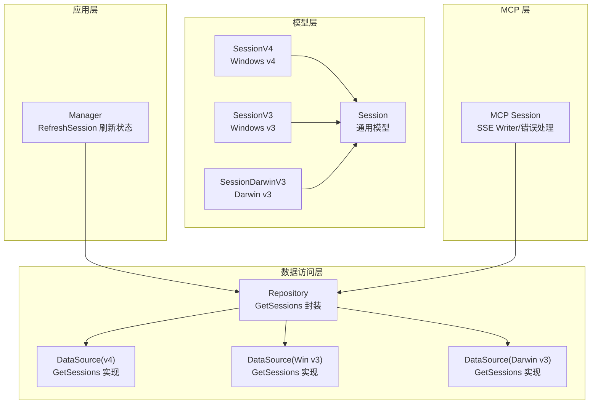
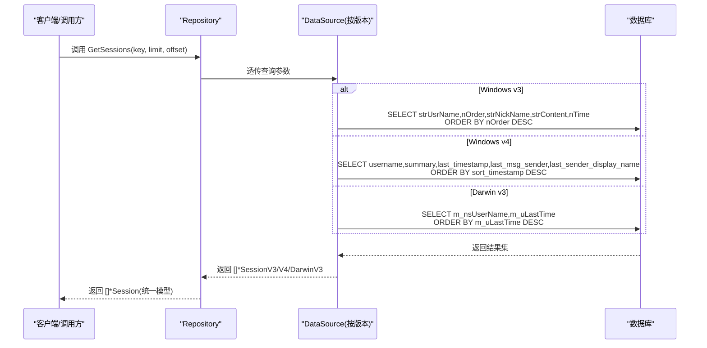
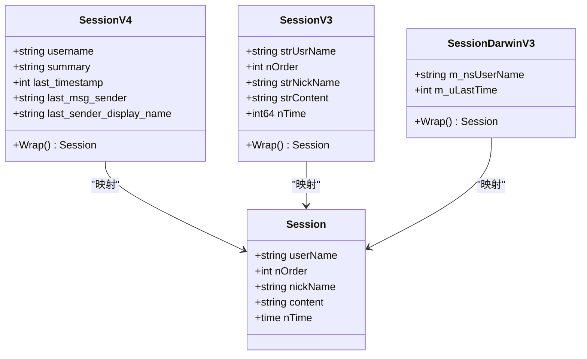

# 会话模型

<cite>
**本文档引用的文件**
- [internal/model/session.go](file://internal/model/session.go)
- [internal/model/session_v4.go](file://internal/model/session_v4.go)
- [internal/model/session_darwinv3.go](file://internal/model/session_darwinv3.go)
- [internal/wechatdb/repository/session.go](file://internal/wechatdb/repository/session.go)
- [internal/wechatdb/datasource/v4/datasource.go](file://internal/wechatdb/datasource/v4/datasource.go)
- [internal/wechatdb/datasource/windowsv3/datasource.go](file://internal/wechatdb/datasource/windowsv3/datasource.go)
- [internal/wechatdb/datasource/darwinv3/datasource.go](file://internal/wechatdb/datasource/darwinv3/datasource.go)
- [internal/chatlog/manager.go](file://internal/chatlog/manager.go)
- [internal/mcp/session.go](file://internal/mcp/session.go)
- [internal/mcp/mcp.go](file://internal/mcp/mcp.go)
</cite>

## 目录
1. [简介](#简介)
2. [项目结构](#项目结构)
3. [核心组件](#核心组件)
4. [架构总览](#架构总览)
5. [详细组件分析](#详细组件分析)
6. [依赖关系分析](#依赖关系分析)
7. [性能考虑](#性能考虑)
8. [故障排除指南](#故障排除指南)
9. [结论](#结论)

## 简介
本文件系统化梳理了会话模型在项目中的设计与实现，覆盖以下关键点：
- Session 结构体字段定义与语义（会话标识、排序权重、显示名称、最后消息内容、最后消息时间）
- 不同版本微信数据库下的会话模型映射（v3/v4/Darwin v3）及差异
- 会话排序与筛选逻辑（按时间倒序、关键词匹配、分页）
- 会话数据的获取流程（仓库层到数据源层）
- 会话与消息、联系人、群聊的关联关系
- 会话状态维护机制（最后消息时间、排序权重、显示名称来源）

## 项目结构
围绕会话模型的关键文件组织如下：
- 模型层：统一的 Session 结构体及各版本适配结构体（v3/v4/Darwin v3）
- 数据访问层：仓库层封装数据源接口；数据源层针对不同平台/版本实现具体查询
- 应用层：管理器负责刷新最新会话时间等状态维护
- MCP 层：会话作为流式通信的载体，支持 SSE 响应与错误处理

图表来源
- [internal/model/session.go](file://internal/model/session.go#L8-L14)
- [internal/model/session_v4.go](file://internal/model/session_v4.go#L25-L44)
- [internal/model/session_darwinv3.go](file://internal/model/session_darwinv3.go#L19-L33)
- [internal/wechatdb/repository/session.go](file://internal/wechatdb/repository/session.go#L9-L11)
- [internal/wechatdb/datasource/v4/datasource.go](file://internal/wechatdb/datasource/v4/datasource.go#L542-L591)
- [internal/wechatdb/datasource/windowsv3/datasource.go](file://internal/wechatdb/datasource/windowsv3/datasource.go#L585-L642)
- [internal/wechatdb/datasource/darwinv3/datasource.go](file://internal/wechatdb/datasource/darwinv3/datasource.go#L525-L582)
- [internal/chatlog/manager.go](file://internal/chatlog/manager.go#L226-L241)
- [internal/mcp/session.go](file://internal/mcp/session.go#L10-L21)

章节来源
- [internal/model/session.go](file://internal/model/session.go#L8-L14)
- [internal/model/session_v4.go](file://internal/model/session_v4.go#L25-L44)
- [internal/model/session_darwinv3.go](file://internal/model/session_darwinv3.go#L19-L33)
- [internal/wechatdb/repository/session.go](file://internal/wechatdb/repository/session.go#L9-L11)
- [internal/wechatdb/datasource/v4/datasource.go](file://internal/wechatdb/datasource/v4/datasource.go#L542-L591)
- [internal/wechatdb/datasource/windowsv3/datasource.go](file://internal/wechatdb/datasource/windowsv3/datasource.go#L585-L642)
- [internal/wechatdb/datasource/darwinv3/datasource.go](file://internal/wechatdb/datasource/darwinv3/datasource.go#L525-L582)
- [internal/chatlog/manager.go](file://internal/chatlog/manager.go#L226-L241)
- [internal/mcp/session.go](file://internal/mcp/session.go#L10-L21)

## 核心组件
- 通用 Session 结构体
  - 字段含义
    - userName：会话唯一标识（用户或群聊 ID）
    - nOrder：排序权重（用于排序，v4 中对应 sort_timestamp）
    - nickName：显示名称（优先来自联系人/群聊信息）
    - content：最后一条消息的内容摘要
    - nTime：最后消息时间（时间戳转换为本地时间）
  - 作用：统一对外暴露的会话数据模型，屏蔽底层版本差异
- v4 会话模型 SessionV4
  - 字段要点：username、summary、last_timestamp、last_msg_sender、last_sender_display_name
  - Wrap()：将 v4 映射为通用 Session，填充 userName/nOrder/nickName/content/nTime
- Darwin v3 会话模型 SessionDarwinV3
  - 字段要点：m_nsUserName、m_uLastTime
  - Wrap()：将 Darwin v3 映射为通用 Session
- Windows v3 会话模型 SessionV3
  - 字段要点：strUsrName、nOrder、strNickName、strContent、nTime
  - Wrap()：将 v3 映射为通用 Session

章节来源
- [internal/model/session.go](file://internal/model/session.go#L8-L14)
- [internal/model/session_v4.go](file://internal/model/session_v4.go#L25-L54)
- [internal/model/session_darwinv3.go](file://internal/model/session_darwinv3.go#L19-L41)

## 架构总览
会话数据从底层数据库到上层应用的流转路径如下：

图表来源
- [internal/wechatdb/repository/session.go](file://internal/wechatdb/repository/session.go#L9-L11)
- [internal/wechatdb/datasource/v4/datasource.go](file://internal/wechatdb/datasource/v4/datasource.go#L542-L591)
- [internal/wechatdb/datasource/windowsv3/datasource.go](file://internal/wechatdb/datasource/windowsv3/datasource.go#L585-L642)
- [internal/wechatdb/datasource/darwinv3/datasource.go](file://internal/wechatdb/datasource/darwinv3/datasource.go#L525-L582)

## 详细组件分析

### 通用 Session 结构体
- 字段定义与用途
  - userName：会话标识，区分单聊、群聊、公众号等场景
  - nOrder：排序权重，用于决定会话列表的先后顺序
  - nickName：显示名称，来源于联系人或群聊解析
  - content：最后一条消息内容摘要，便于快速预览
  - nTime：最后消息时间，统一为本地时间
- 文本化输出
  - 提供 PlainText 方法，按固定格式输出会话摘要（包含昵称、ID、时间、内容），支持截断长度限制

章节来源
- [internal/model/session.go](file://internal/model/session.go#L8-L14)
- [internal/model/session.go](file://internal/model/session.go#L74-L92)

### v4 会话模型（Windows v4）
- 表结构要点
  - username：会话标识
  - summary：最后消息摘要
  - last_timestamp：最后消息时间戳
  - last_msg_sender / last_sender_display_name：发送者信息
  - sort_timestamp：排序时间戳（用于排序）
- 映射策略
  - Wrap() 将 v4 字段映射到通用 Session 的 userName/nOrder/nickName/content/nTime

章节来源
- [internal/model/session_v4.go](file://internal/model/session_v4.go#L6-L24)
- [internal/model/session_v4.go](file://internal/model/session_v4.go#L25-L54)

### Darwin v3 会话模型
- 表结构要点
  - m_nsUserName：会话标识
  - m_uLastTime：最后时间戳
- 映射策略
  - Wrap() 将 m_uLastTime 映射为 nOrder 和 nTime

章节来源
- [internal/model/session_darwinv3.go](file://internal/model/session_darwinv3.go#L5-L18)
- [internal/model/session_darwinv3.go](file://internal/model/session_darwinv3.go#L19-L41)

### Windows v3 会话模型
- 表结构要点
  - strUsrName：会话标识
  - nOrder：排序权重
  - strNickName：显示名称
  - strContent：最后消息内容
  - nTime：最后消息时间戳
- 映射策略
  - Wrap() 将 v3 字段映射到通用 Session

章节来源
- [internal/model/session.go](file://internal/model/session.go#L39-L62)

### 会话排序与筛选逻辑
- Windows v3
  - 排序：按 nOrder 降序
  - 筛选：支持按 userName 或 nickName 关键词精确匹配
  - 分页：LIMIT/OFFSET 控制
- Windows v4
  - 排序：按 sort_timestamp 降序
  - 筛选：支持按 username 或 last_sender_display_name 关键词精确匹配
  - 分页：LIMIT/OFFSET 控制
- Darwin v3
  - 排序：按 m_uLastTime 降序
  - 筛选：支持按 m_nsUserName 关键词精确匹配
  - 分页：LIMIT/OFFSET 控制

章节来源
- [internal/wechatdb/datasource/windowsv3/datasource.go](file://internal/wechatdb/datasource/windowsv3/datasource.go#L585-L642)
- [internal/wechatdb/datasource/v4/datasource.go](file://internal/wechatdb/datasource/v4/datasource.go#L542-L591)
- [internal/wechatdb/datasource/darwinv3/datasource.go](file://internal/wechatdb/datasource/darwinv3/datasource.go#L525-L582)

### 会话数据的获取、更新与删除
- 获取
  - 仓库层：Repository.GetSessions(ctx, key, limit, offset) 透传至 DataSource
  - 数据源层：根据版本选择对应 SQL 查询，返回 []*Session
- 更新
  - 通过 RefreshSession 定位最新会话时间并更新上下文状态
- 删除
  - 代码库未提供会话删除接口；若需实现，可在 DataSource 层增加相应 SQL 并在 Repository 层暴露方法

章节来源
- [internal/wechatdb/repository/session.go](file://internal/wechatdb/repository/session.go#L9-L11)
- [internal/chatlog/manager.go](file://internal/chatlog/manager.go#L226-L241)

### 会话模型与消息、联系人、群聊的关联关系
- 与联系人
  - v3/v4/Darwin v3 数据源在获取会话时，会尝试通过联系人信息补充显示名称（nickName）
- 与群聊
  - 当联系人记录指向群聊（后缀 @chatroom）时，数据源会回查群聊表以获得完整成员信息
- 与消息
  - 会话最后消息内容与时间由会话表字段提供；消息表用于更细粒度的消息检索与展示

章节来源
- [internal/wechatdb/datasource/windowsv3/datasource.go](file://internal/wechatdb/datasource/windowsv3/datasource.go#L585-L642)
- [internal/wechatdb/datasource/v4/datasource.go](file://internal/wechatdb/datasource/v4/datasource.go#L441-L490)
- [internal/wechatdb/datasource/darwinv3/datasource.go](file://internal/wechatdb/datasource/darwinv3/datasource.go#L525-L582)

### 会话状态维护机制
- 最新会话时间
  - Manager.RefreshSession 通过数据库服务获取最新会话条目，并更新上下文中的 LastSession 时间
- 排序权重
  - v3 使用 nOrder；v4 使用 sort_timestamp；Darwin v3 使用 m_uLastTime
- 显示名称来源
  - 优先从联系人/群聊解析得到的昵称，否则保留默认值

章节来源
- [internal/chatlog/manager.go](file://internal/chatlog/manager.go#L226-L241)

## 依赖关系分析

图表来源
- [internal/model/session.go](file://internal/model/session.go#L8-L14)
- [internal/model/session_v4.go](file://internal/model/session_v4.go#L25-L54)
- [internal/model/session_darwinv3.go](file://internal/model/session_darwinv3.go#L19-L41)

## 性能考虑
- 查询优化
  - 使用索引列进行排序与筛选（nOrder/sort_timestamp/m_uLastTime）
  - 仅在需要时补充联系人/群聊信息，避免不必要的二次查询
- 分页策略
  - 通过 LIMIT/OFFSET 控制结果集大小，避免一次性加载过多会话
- 映射成本
  - Wrap() 操作为 O(1)，整体开销较小；注意在高并发场景下避免重复映射

## 故障排除指南
- 会话为空
  - 检查数据库连接与版本是否正确（v3/v4/Darwin v3）
  - 确认关键词筛选是否过于严格导致无匹配
- 显示名称异常
  - 确认联系人/群聊表是否可正常回查
- 排序不正确
  - 确认使用的排序字段与版本一致（nOrder vs sort_timestamp vs m_uLastTime）

## 结论
会话模型通过统一的 Session 结构体屏蔽了不同版本与平台的差异，结合仓库层与数据源层的清晰职责划分，实现了稳定高效的会话数据获取与展示。通过联系人与群聊的补充，进一步提升了会话信息的完整性与可用性。未来可在现有基础上扩展删除与更细粒度的状态控制能力。