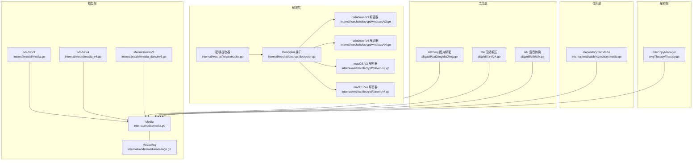
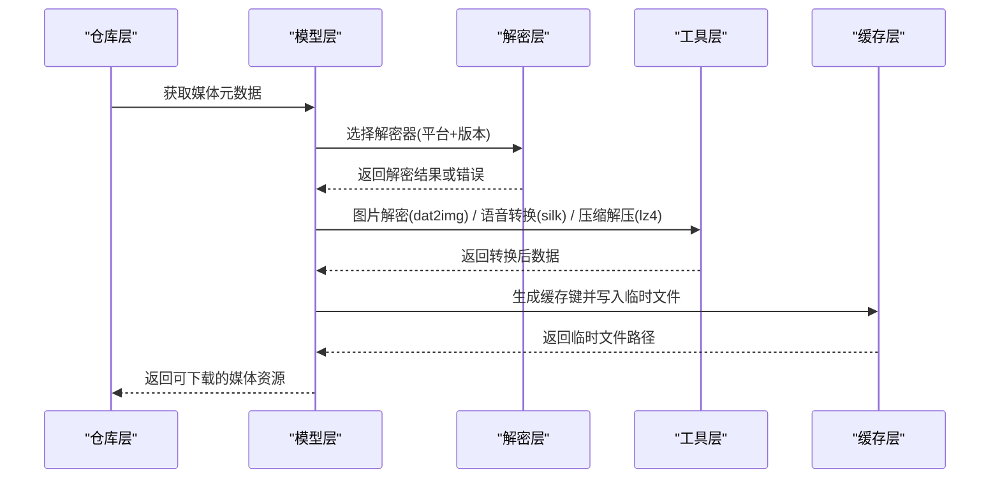
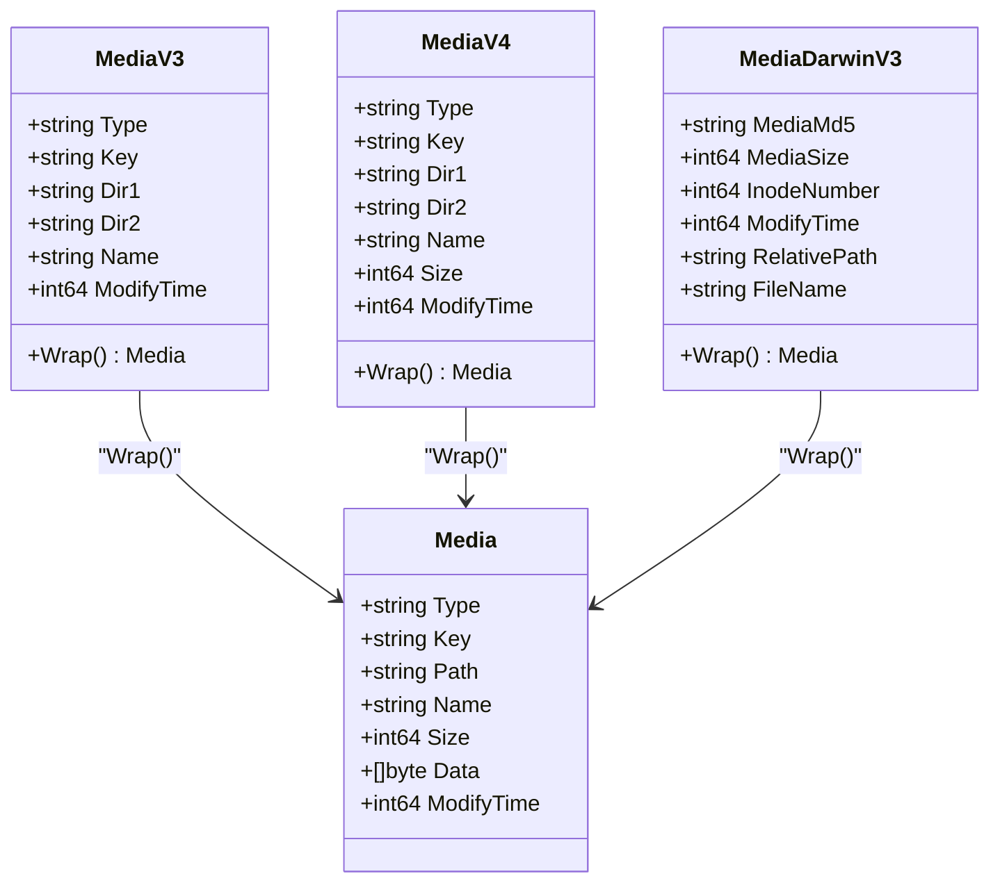
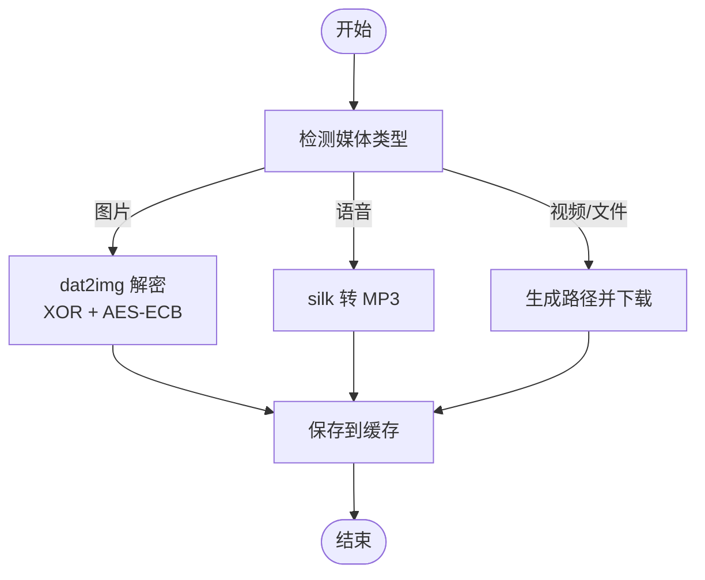
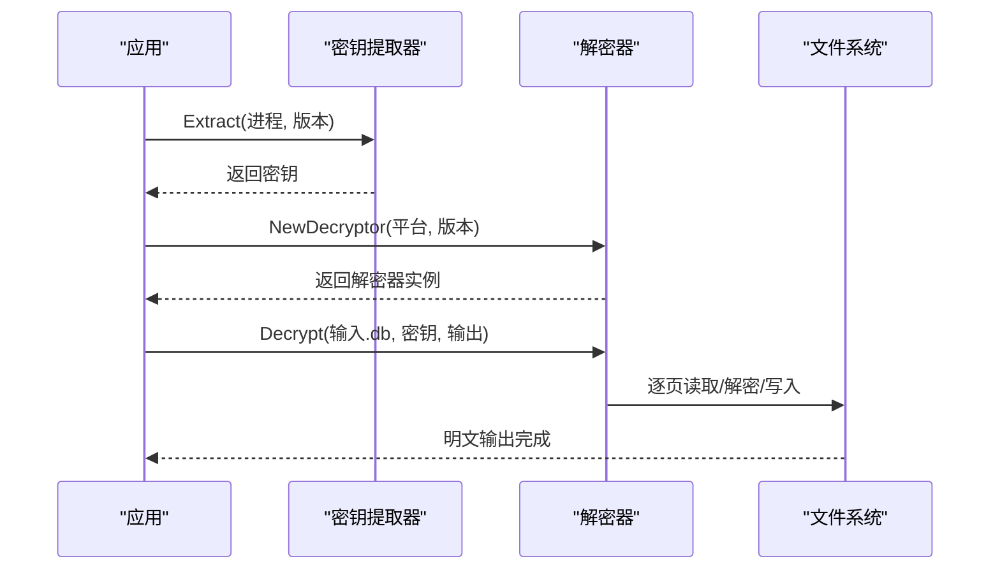
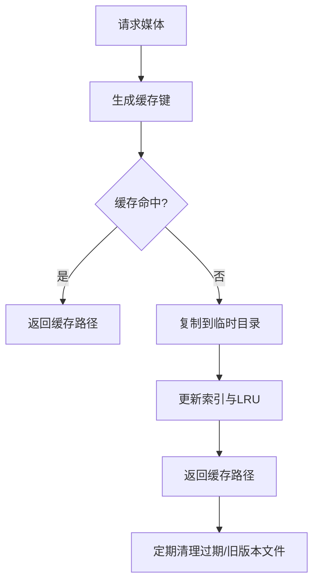
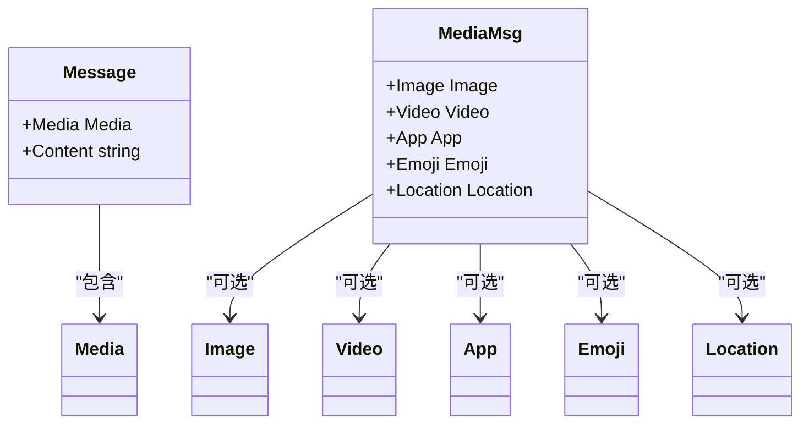
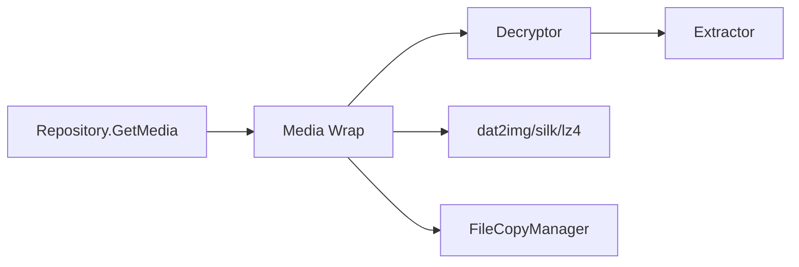

# 媒体模型

<cite>
**本文档引用的文件**
- [internal/model/media.go](file://internal/model/media.go)
- [internal/model/media_v4.go](file://internal/model/media_v4.go)
- [internal/model/media_darwinv3.go](file://internal/model/media_darwinv3.go)
- [internal/model/mediamessage.go](file://internal/model/mediamessage.go)
- [internal/wechat/decrypt/decryptor.go](file://internal/wechat/decrypt/decryptor.go)
- [internal/wechat/decrypt/windows/v3.go](file://internal/wechat/decrypt/windows/v3.go)
- [internal/wechat/decrypt/windows/v4.go](file://internal/wechat/decrypt/windows/v4.go)
- [internal/wechat/decrypt/darwin/v3.go](file://internal/wechat/decrypt/darwin/v3.go)
- [internal/wechat/decrypt/darwin/v4.go](file://internal/wechat/decrypt/darwin/v4.go)
- [internal/wechat/key/extractor.go](file://internal/wechat/key/extractor.go)
- [pkg/util/dat2img/dat2img.go](file://pkg/util/dat2img/dat2img.go)
- [pkg/util/lz4/lz4.go](file://pkg/util/lz4/lz4.go)
- [pkg/util/silk/silk.go](file://pkg/util/silk/silk.go)
- [internal/wechatdb/repository/media.go](file://internal/wechatdb/repository/media.go)
- [pkg/filecopy/filecopy.go](file://pkg/filecopy/filecopy.go)
</cite>

## 目录
1. [简介](#简介)
2. [项目结构](#项目结构)
3. [核心组件](#核心组件)
4. [架构总览](#架构总览)
5. [详细组件分析](#详细组件分析)
6. [依赖关系分析](#依赖关系分析)
7. [性能考量](#性能考量)
8. [故障排查指南](#故障排查指南)
9. [结论](#结论)
10. [附录](#附录)

## 简介
本文件系统化梳理媒体模型的设计与实现，覆盖以下主题：
- Media 结构体字段定义与语义（MD5、路径、大小、类型等）
- 不同媒体类型的处理策略（图片、视频、语音、文件）
- 媒体文件的解密与转换流程
- 下载、缓存与清理机制
- MediaMessage 结构体与普通消息的区别
- 不同微信版本的数据结构差异与兼容性处理

## 项目结构
媒体模型相关代码主要分布在以下模块：
- 模型层：定义媒体与消息的结构体
- 解密层：按平台与版本选择合适的解密器
- 工具层：图片解密、语音转换、压缩解压等
- 仓库层：媒体查询接口
- 缓存层：临时文件复制与缓存管理

**图表来源**
- [internal/model/media.go](file://internal/model/media.go#L7-L45)
- [internal/model/media_v4.go](file://internal/model/media_v4.go#L5-L35)
- [internal/model/media_darwinv3.go](file://internal/model/media_darwinv3.go#L18-L40)
- [internal/model/mediamessage.go](file://internal/model/mediamessage.go#L10-L17)
- [internal/wechat/decrypt/decryptor.go](file://internal/wechat/decrypt/decryptor.go#L12-L48)
- [internal/wechat/decrypt/windows/v3.go](file://internal/wechat/decrypt/windows/v3.go#L24-L51)
- [internal/wechat/decrypt/windows/v4.go](file://internal/wechat/decrypt/windows/v4.go#L23-L50)
- [internal/wechat/decrypt/darwin/v3.go](file://internal/wechat/decrypt/darwin/v3.go#L23-L48)
- [internal/wechat/decrypt/darwin/v4.go](file://internal/wechat/decrypt/darwin/v4.go#L26-L53)
- [internal/wechat/key/extractor.go](file://internal/wechat/key/extractor.go#L13-L39)
- [pkg/util/dat2img/dat2img.go](file://pkg/util/dat2img/dat2img.go#L46-L95)
- [pkg/util/lz4/lz4.go](file://pkg/util/lz4/lz4.go#L7-L16)
- [pkg/util/silk/silk.go](file://pkg/util/silk/silk.go#L10-L36)
- [internal/wechatdb/repository/media.go](file://internal/wechatdb/repository/media.go#L9-L11)
- [pkg/filecopy/filecopy.go](file://pkg/filecopy/filecopy.go#L37-L55)

**章节来源**
- [internal/model/media.go](file://internal/model/media.go#L1-L46)
- [internal/model/media_v4.go](file://internal/model/media_v4.go#L1-L36)
- [internal/model/media_darwinv3.go](file://internal/model/media_darwinv3.go#L1-L41)
- [internal/model/mediamessage.go](file://internal/model/mediamessage.go#L1-L591)
- [internal/wechat/decrypt/decryptor.go](file://internal/wechat/decrypt/decryptor.go#L1-L49)
- [internal/wechat/decrypt/windows/v3.go](file://internal/wechat/decrypt/windows/v3.go#L1-L193)
- [internal/wechat/decrypt/windows/v4.go](file://internal/wechat/decrypt/windows/v4.go#L1-L192)
- [internal/wechat/decrypt/darwin/v3.go](file://internal/wechat/decrypt/darwin/v3.go#L1-L186)
- [internal/wechat/decrypt/darwin/v4.go](file://internal/wechat/decrypt/darwin/v4.go#L1-L195)
- [internal/wechat/key/extractor.go](file://internal/wechat/key/extractor.go#L1-L40)
- [pkg/util/dat2img/dat2img.go](file://pkg/util/dat2img/dat2img.go#L1-L331)
- [pkg/util/lz4/lz4.go](file://pkg/util/lz4/lz4.go#L1-L17)
- [pkg/util/silk/silk.go](file://pkg/util/silk/silk.go#L1-L37)
- [internal/wechatdb/repository/media.go](file://internal/wechatdb/repository/media.go#L1-L12)
- [pkg/filecopy/filecopy.go](file://pkg/filecopy/filecopy.go#L1-L935)

## 核心组件
- Media：统一的媒体对象，包含类型、MD5、路径、名称、大小、原始数据、修改时间等字段，用于对外展示与传输。
- MediaV3/MediaV4/MediaDarwinV3：各版本/平台的媒体元数据结构，通过 Wrap 方法统一到 Media。
- MediaMsg：消息中的媒体信息载体，包含图片、视频、应用附件、表情、位置等标签及属性。

关键字段说明：
- 类型 Type：image、video、voice、file 等
- MD5 Key：媒体唯一标识，用于去重与缓存键
- 路径 Path：媒体文件在本地的相对路径
- 名称 Name：文件名
- 大小 Size：字节大小（V4/V3 中可能来自数据库）
- 修改时间 ModifyTime：文件最后修改时间
- 原始数据 Data：语音等可内嵌的媒体数据

**章节来源**
- [internal/model/media.go](file://internal/model/media.go#L7-L15)
- [internal/model/media_v4.go](file://internal/model/media_v4.go#L5-L13)
- [internal/model/media_darwinv3.go](file://internal/model/media_darwinv3.go#L18-L25)
- [internal/model/mediamessage.go](file://internal/model/mediamessage.go#L10-L17)

## 架构总览
媒体处理的整体流程如下：
- 从仓库层获取媒体元数据（类型、MD5、路径等）
- 根据平台与版本选择解密器，必要时从进程内存提取密钥
- 对图片、语音等进行解密/转换
- 提供下载、缓存与清理能力

**图表来源**
- [internal/wechatdb/repository/media.go](file://internal/wechatdb/repository/media.go#L9-L11)
- [internal/wechat/decrypt/decryptor.go](file://internal/wechat/decrypt/decryptor.go#L33-L48)
- [internal/wechat/key/extractor.go](file://internal/wechat/key/extractor.go#L25-L39)
- [pkg/util/dat2img/dat2img.go](file://pkg/util/dat2img/dat2img.go#L46-L95)
- [pkg/util/silk/silk.go](file://pkg/util/silk/silk.go#L10-L36)
- [pkg/util/lz4/lz4.go](file://pkg/util/lz4/lz4.go#L7-L16)
- [pkg/filecopy/filecopy.go](file://pkg/filecopy/filecopy.go#L37-L55)

## 详细组件分析

### Media 结构体与版本适配
- 统一模型 Media：对外暴露一致的字段集合，便于上层统一处理。
- V3/V4/WIN/MAC：不同版本/平台的媒体元数据差异较大，通过 Wrap 方法映射到 Media。
  - Windows V3/V4：使用 PBKDF2 派生密钥，不同 HMAC/迭代次数与页面大小。
  - macOS V3：直接使用密钥作为加密密钥；V4 与 Windows V4 相似。
- Darwin V3：基于 inode/相对路径/文件名组合生成最终路径，适用于 macOS 的特殊存储布局。

**图表来源**
- [internal/model/media.go](file://internal/model/media.go#L7-L45)
- [internal/model/media_v4.go](file://internal/model/media_v4.go#L5-L35)
- [internal/model/media_darwinv3.go](file://internal/model/media_darwinv3.go#L18-L40)

**章节来源**
- [internal/model/media.go](file://internal/model/media.go#L1-L46)
- [internal/model/media_v4.go](file://internal/model/media_v4.go#L1-L36)
- [internal/model/media_darwinv3.go](file://internal/model/media_darwinv3.go#L1-L41)

### 媒体类型处理策略
- 图片：支持 v3/v4 dat 格式，采用 XOR 与 AES-ECB 组合解密；识别 wxgf 并进一步转换。
- 语音：silk 编码转 MP3，便于播放与导出。
- 视频/文件：通常由数据库元数据驱动，结合 Wrap 生成路径后进行下载与缓存。
- 表情/应用附件：通过 MediaMsg 解析，提取 CDN 地址与密钥，按需下载。

**图表来源**
- [pkg/util/dat2img/dat2img.go](file://pkg/util/dat2img/dat2img.go#L46-L95)
- [pkg/util/silk/silk.go](file://pkg/util/silk/silk.go#L10-L36)
- [internal/model/media_v4.go](file://internal/model/media_v4.go#L15-L35)

**章节来源**
- [pkg/util/dat2img/dat2img.go](file://pkg/util/dat2img/dat2img.go#L1-L331)
- [pkg/util/silk/silk.go](file://pkg/util/silk/silk.go#L1-L37)
- [internal/model/mediamessage.go](file://internal/model/mediamessage.go#L10-L17)

### 媒体文件解密与转换流程
- 解密器选择：根据平台与版本动态创建对应解密器实例。
- 密钥提取：从目标进程内存中提取密钥，验证有效性后再进行解密。
- 页面级解密：逐页读取数据库文件，校验零页，解密并写回明文。
- 图片/语音转换：对 dat 文件进行 XOR/AES 解密，对 silk 进行解码与编码。

**图表来源**
- [internal/wechat/key/extractor.go](file://internal/wechat/key/extractor.go#L25-L39)
- [internal/wechat/decrypt/decryptor.go](file://internal/wechat/decrypt/decryptor.go#L33-L48)
- [internal/wechat/decrypt/windows/v3.go](file://internal/wechat/decrypt/windows/v3.go#L76-L167)
- [internal/wechat/decrypt/windows/v4.go](file://internal/wechat/decrypt/windows/v4.go#L75-L166)
- [internal/wechat/decrypt/darwin/v3.go](file://internal/wechat/decrypt/darwin/v3.go#L74-L165)
- [internal/wechat/decrypt/darwin/v4.go](file://internal/wechat/decrypt/darwin/v4.go#L78-L169)

**章节来源**
- [internal/wechat/key/extractor.go](file://internal/wechat/key/extractor.go#L1-L40)
- [internal/wechat/decrypt/decryptor.go](file://internal/wechat/decrypt/decryptor.go#L1-L49)
- [internal/wechat/decrypt/windows/v3.go](file://internal/wechat/decrypt/windows/v3.go#L1-L193)
- [internal/wechat/decrypt/windows/v4.go](file://internal/wechat/decrypt/windows/v4.go#L1-L192)
- [internal/wechat/decrypt/darwin/v3.go](file://internal/wechat/decrypt/darwin/v3.go#L1-L186)
- [internal/wechat/decrypt/darwin/v4.go](file://internal/wechat/decrypt/darwin/v4.go#L1-L195)

### 下载、缓存与清理机制
- 下载：根据 Media 的路径与类型，定位文件并读取。
- 缓存：FileCopyManager 提供临时文件复制与缓存，支持 LRU 清理、版本去重、最近访问保护等策略。
- 清理：周期性扫描与删除旧版本文件，避免磁盘占用过高。

**图表来源**
- [pkg/filecopy/filecopy.go](file://pkg/filecopy/filecopy.go#L37-L55)
- [pkg/filecopy/filecopy.go](file://pkg/filecopy/filecopy.go#L442-L504)
- [pkg/filecopy/filecopy.go](file://pkg/filecopy/filecopy.go#L520-L560)

**章节来源**
- [internal/wechatdb/repository/media.go](file://internal/wechatdb/repository/media.go#L1-L12)
- [pkg/filecopy/filecopy.go](file://pkg/filecopy/filecopy.go#L1-L935)

### MediaMessage 与普通消息的区别
- 普通消息：通常仅包含文本或简单富文本，媒体信息通过 Media 字段承载。
- 媒体消息：通过 MediaMsg 结构体承载，内部包含多种媒体标签（图片、视频、应用附件、表情、位置等），并携带 CDN 地址、AES Key、MD5 等字段，便于云端下载与解密。

**图表来源**
- [internal/model/mediamessage.go](file://internal/model/mediamessage.go#L10-L17)
- [internal/model/mediamessage.go](file://internal/model/mediamessage.go#L19-L61)
- [internal/model/mediamessage.go](file://internal/model/mediamessage.go#L63-L111)
- [internal/model/mediamessage.go](file://internal/model/mediamessage.go#L113-L130)

**章节来源**
- [internal/model/mediamessage.go](file://internal/model/mediamessage.go#L1-L591)

### 不同微信版本的数据结构差异与兼容性处理
- Windows V3：PBKDF2 迭代次数较低，HMAC-SHA1，页面大小固定。
- Windows V4：PBKDF2 迭代次数更高，HMAC-SHA512，页面大小更大。
- macOS V3：加密密钥直接使用，不进行 PBKDF2 派生；V4 与 Windows V4 类似。
- V3/V4 路径差异：Windows 与 macOS 的媒体存储路径前缀不同，Wrap 时根据类型拼接正确路径。
- Darwin V3：通过 inode/相对路径/文件名组合生成最终路径，适配 macOS 特殊存储。

**章节来源**
- [internal/wechat/decrypt/windows/v3.go](file://internal/wechat/decrypt/windows/v3.go#L17-L51)
- [internal/wechat/decrypt/windows/v4.go](file://internal/wechat/decrypt/windows/v4.go#L17-L50)
- [internal/wechat/decrypt/darwin/v3.go](file://internal/wechat/decrypt/darwin/v3.go#L17-L48)
- [internal/wechat/decrypt/darwin/v4.go](file://internal/wechat/decrypt/darwin/v4.go#L17-L53)
- [internal/model/media_v4.go](file://internal/model/media_v4.go#L15-L35)
- [internal/model/media_darwinv3.go](file://internal/model/media_darwinv3.go#L27-L40)

## 依赖关系分析
- 模型层依赖仓库层提供的媒体元数据。
- 解密层依赖密钥提取器与平台/版本信息。
- 工具层为图片、语音、压缩等提供专用转换函数。
- 缓存层为媒体下载提供临时文件管理与清理。

**图表来源**
- [internal/wechatdb/repository/media.go](file://internal/wechatdb/repository/media.go#L9-L11)
- [internal/model/media.go](file://internal/model/media.go#L26-L45)
- [internal/wechat/decrypt/decryptor.go](file://internal/wechat/decrypt/decryptor.go#L33-L48)
- [internal/wechat/key/extractor.go](file://internal/wechat/key/extractor.go#L25-L39)
- [pkg/util/dat2img/dat2img.go](file://pkg/util/dat2img/dat2img.go#L46-L95)
- [pkg/util/silk/silk.go](file://pkg/util/silk/silk.go#L10-L36)
- [pkg/util/lz4/lz4.go](file://pkg/util/lz4/lz4.go#L7-L16)
- [pkg/filecopy/filecopy.go](file://pkg/filecopy/filecopy.go#L37-L55)

**章节来源**
- [internal/wechatdb/repository/media.go](file://internal/wechatdb/repository/media.go#L1-L12)
- [internal/model/media.go](file://internal/model/media.go#L1-L46)
- [internal/wechat/decrypt/decryptor.go](file://internal/wechat/decrypt/decryptor.go#L1-L49)
- [internal/wechat/key/extractor.go](file://internal/wechat/key/extractor.go#L1-L40)
- [pkg/util/dat2img/dat2img.go](file://pkg/util/dat2img/dat2img.go#L1-L331)
- [pkg/util/silk/silk.go](file://pkg/util/silk/silk.go#L1-L37)
- [pkg/util/lz4/lz4.go](file://pkg/util/lz4/lz4.go#L1-L17)
- [pkg/filecopy/filecopy.go](file://pkg/filecopy/filecopy.go#L1-L935)

## 性能考量
- 解密性能：Windows V4 使用更高强度的 PBKDF2 与 HMAC-SHA512，解密速度较慢但更安全；macOS V3 不进行 PBKDF2 派生，更快。
- 缓存策略：LRU 清理与版本去重降低重复 IO；近期文件保护避免频繁重建缓存。
- 压缩与转换：lz4 解压与 silk 转 MP3 为 CPU 密集型操作，建议批量处理与并发控制。

[本节为通用指导，无需列出具体文件来源]

## 故障排查指南
- 解密失败：检查密钥长度与格式，确认平台/版本匹配；验证密钥有效性。
- 图片无法显示：确认 dat2img 的 XOR/AES 密钥设置正确；检查 wxgf 转换流程。
- 语音播放异常：确认 silk 解码成功且 MP3 编码参数正确。
- 缓存文件缺失：检查缓存目录权限与空间；确认 LRU 清理策略未误删。

**章节来源**
- [internal/wechat/decrypt/windows/v3.go](file://internal/wechat/decrypt/windows/v3.go#L66-L74)
- [internal/wechat/decrypt/windows/v4.go](file://internal/wechat/decrypt/windows/v4.go#L65-L73)
- [internal/wechat/decrypt/darwin/v3.go](file://internal/wechat/decrypt/darwin/v3.go#L64-L72)
- [internal/wechat/decrypt/darwin/v4.go](file://internal/wechat/decrypt/darwin/v4.go#L68-L76)
- [pkg/util/dat2img/dat2img.go](file://pkg/util/dat2img/dat2img.go#L192-L202)
- [pkg/util/silk/silk.go](file://pkg/util/silk/silk.go#L10-L36)
- [pkg/filecopy/filecopy.go](file://pkg/filecopy/filecopy.go#L520-L560)

## 结论
媒体模型通过统一的 Media 结构体屏蔽了不同版本与平台的差异，配合解密器、密钥提取器与工具层转换函数，实现了对图片、语音、视频、文件等多类型媒体的完整处理链路。结合缓存与清理机制，既保证了性能也兼顾了资源占用。未来可在以下方面持续优化：
- 更细粒度的并发与批处理策略
- 更强健的错误恢复与重试机制
- 对新版本协议的快速适配

[本节为总结性内容，无需列出具体文件来源]

## 附录
- 常用工具函数
  - 图片解密：dat2img
  - 语音转换：silk → MP3
  - 压缩解压：lz4
- 关键配置
  - 缓存最大条目数、LRU 清理比例、近期文件保护窗口等

**章节来源**
- [pkg/util/dat2img/dat2img.go](file://pkg/util/dat2img/dat2img.go#L1-L331)
- [pkg/util/silk/silk.go](file://pkg/util/silk/silk.go#L1-L37)
- [pkg/util/lz4/lz4.go](file://pkg/util/lz4/lz4.go#L1-L17)
- [pkg/filecopy/filecopy.go](file://pkg/filecopy/filecopy.go#L37-L55)