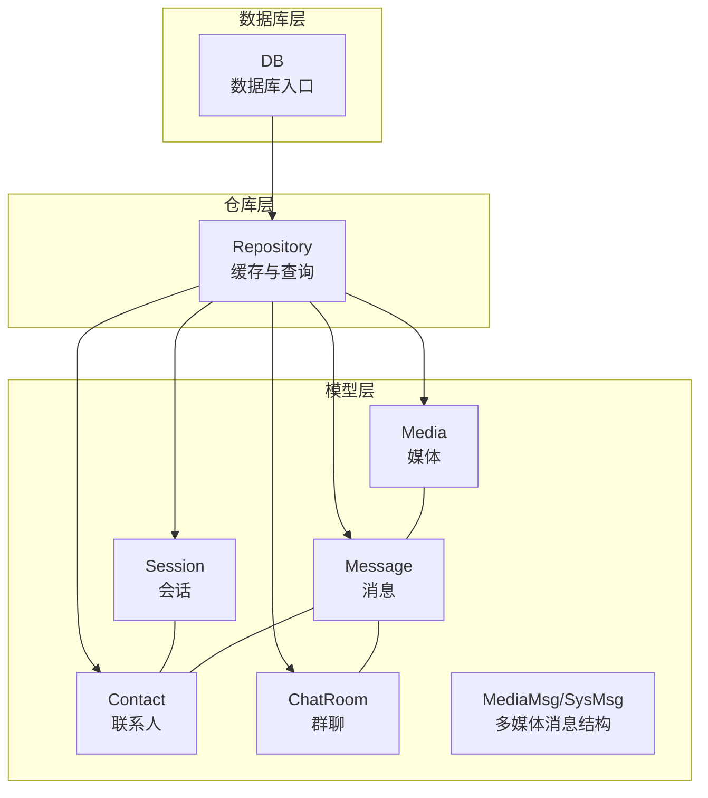
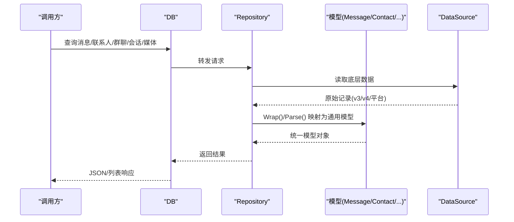
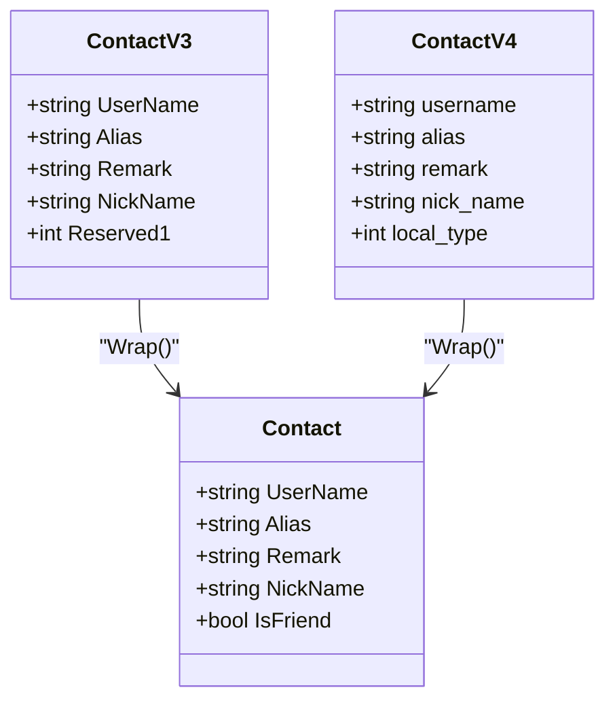
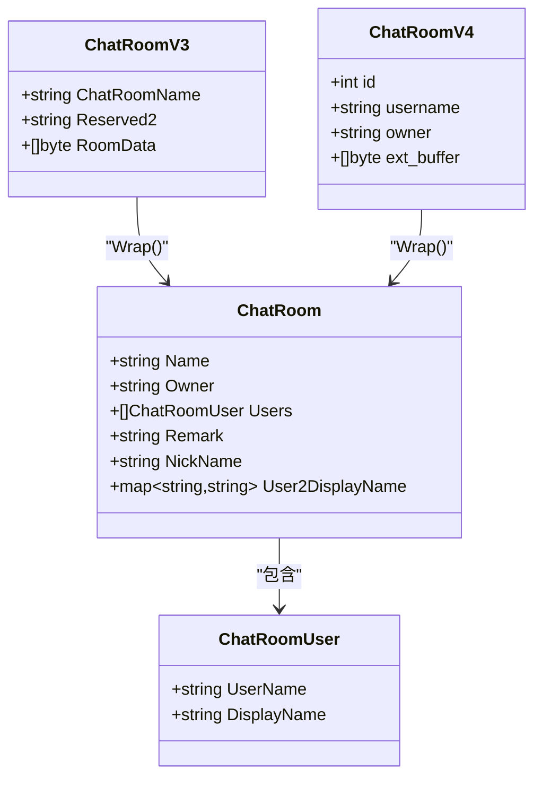
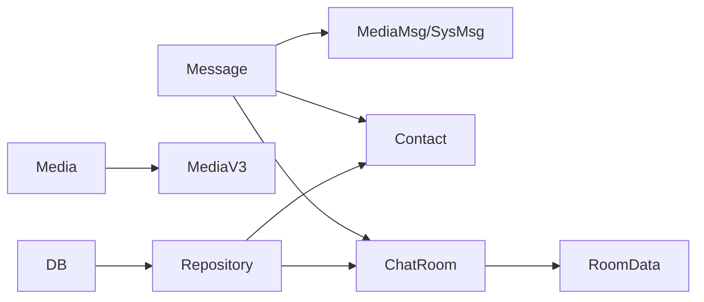

# 数据模型

<cite>
**本文档引用的文件**
- [message.go](file://internal/model/message.go)
- [mediamessage.go](file://internal/model/mediamessage.go)
- [message_v3.go](file://internal/model/message_v3.go)
- [message_v4.go](file://internal/model/message_v4.go)
- [contact.go](file://internal/model/contact.go)
- [contact_v4.go](file://internal/model/contact_v4.go)
- [chatroom.go](file://internal/model/chatroom.go)
- [chatroom_v4.go](file://internal/model/chatroom_v4.go)
- [session.go](file://internal/model/session.go)
- [media.go](file://internal/model/media.go)
- [repository.go](file://internal/wechatdb/repository/repository.go)
- [wechatdb.go](file://internal/wechatdb/wechatdb.go)
- [bytesextra.proto](file://internal/model/wxproto/bytesextra.proto)
- [packedinfo.proto](file://internal/model/wxproto/packedinfo.proto)
- [roomdata.proto](file://internal/model/wxproto/roomdata.proto)
</cite>

## 目录
1. [简介](#简介)
2. [项目结构](#项目结构)
3. [核心组件](#核心组件)
4. [架构总览](#架构总览)
5. [详细组件分析](#详细组件分析)
6. [依赖分析](#依赖分析)
7. [性能考虑](#性能考虑)
8. [故障排查指南](#故障排查指南)
9. [结论](#结论)
10. [附录](#附录)

## 简介
本文件系统性梳理 Chatlog 的数据模型，覆盖消息(Message)、联系人(Contact)、群聊(ChatRoom)、会话(Session)、媒体(Media)等核心实体，并结合仓库层与数据库层的设计，说明字段语义、数据类型、约束与业务规则，以及实体间的关系与关联查询方式。同时提供使用示例、最佳实践与性能优化建议。

## 项目结构
数据模型主要位于 internal/model 目录，按功能模块划分：
- 消息相关：message.go、mediamessage.go、message_v3.go、message_v4.go
- 联系人与群聊：contact.go、contact_v4.go、chatroom.go、chatroom_v4.go
- 会话与媒体：session.go、media.go
- 仓库与数据库接口：repository.go、wechatdb.go
- Protobuf 定义：bytesextra.proto、packedinfo.proto、roomdata.proto



图表来源
- [message.go](file://internal/model/message.go#L108-L126)
- [contact.go](file://internal/model/contact.go#L3-L9)
- [chatroom.go](file://internal/model/chatroom.go#L9-L19)
- [session.go](file://internal/model/session.go#L8-L14)
- [media.go](file://internal/model/media.go#L7-L15)
- [repository.go](file://internal/wechatdb/repository/repository.go#L14-L39)
- [wechatdb.go](file://internal/wechatdb/wechatdb.go#L15-L21)

章节来源
- [message.go](file://internal/model/message.go#L1-L545)
- [mediamessage.go](file://internal/model/mediamessage.go#L1-L591)
- [message_v3.go](file://internal/model/message_v3.go#L1-L141)
- [message_v4.go](file://internal/model/message_v4.go#L1-L111)
- [contact.go](file://internal/model/contact.go#L1-L71)
- [contact_v4.go](file://internal/model/contact_v4.go#L1-L44)
- [chatroom.go](file://internal/model/chatroom.go#L1-L116)
- [chatroom_v4.go](file://internal/model/chatroom_v4.go#L1-L37)
- [session.go](file://internal/model/session.go#L1-L93)
- [media.go](file://internal/model/media.go#L1-L46)
- [repository.go](file://internal/wechatdb/repository/repository.go#L1-L112)
- [wechatdb.go](file://internal/wechatdb/wechatdb.go#L1-L132)

## 核心组件
本节对各数据实体进行字段级说明，涵盖类型、含义、约束与业务规则。

- Message（消息）
  - 字段概览：版本标识、序号、时间、聊天对象、是否群聊、发送人、是否自己、类型、子类型、内容、多媒体内容字典、调试用原始消息结构
  - 关键规则：
    - 类型与子类型枚举覆盖文本、图片、语音、名片、视频、动画表情、位置、分享、语音通话、系统消息等
    - 群聊消息的发送人解析依赖额外数据（v3 通过 BytesExtra，v4 通过 PackedInfo）
    - 媒体消息解析通过 XML 结构提取关键字段，填充到 Contents 字典
  - 典型用途：渲染纯文本、CSV 导出、Markdown 展示

- Contact（联系人）
  - 字段概览：用户名、别名、备注、昵称、是否好友
  - 扩展版本：ContactV3、ContactV4 提供不同数据库版本的字段映射，并提供 Wrap() 统一为通用 Contact

- ChatRoom（群聊）
  - 字段概览：群名、群主、成员列表、显示名映射；从 Contact 扩展的备注与昵称
  - 成员解析：通过 Protobuf RoomData 解析成员列表与显示名映射

- Session（会话）
  - 字段概览：用户名、排序、昵称、最后一条内容、最后时间
  - 用途：最近会话列表展示与摘要输出

- Media（媒体）
  - 字段概览：类型、键(MD5)、路径、名称、大小、语音数据、修改时间
  - 版本映射：MediaV3 通过目录结构推导实际路径，统一为 Media

章节来源
- [message.go](file://internal/model/message.go#L108-L126)
- [mediamessage.go](file://internal/model/mediamessage.go#L10-L131)
- [message_v3.go](file://internal/model/message_v3.go#L42-L53)
- [message_v4.go](file://internal/model/message_v4.go#L36-L45)
- [contact.go](file://internal/model/contact.go#L3-L9)
- [contact_v4.go](file://internal/model/contact_v4.go#L27-L33)
- [chatroom.go](file://internal/model/chatroom.go#L9-L19)
- [chatroom_v4.go](file://internal/model/chatroom_v4.go#L9-L14)
- [session.go](file://internal/model/session.go#L8-L14)
- [media.go](file://internal/model/media.go#L7-L15)

## 架构总览
数据模型通过仓库层与数据库层解耦，支持多平台与多版本（v3/v4/darwinv3）的微信数据库适配。



图表来源
- [wechatdb.go](file://internal/wechatdb/wechatdb.go#L61-L71)
- [repository.go](file://internal/wechatdb/repository/repository.go#L14-L39)
- [message_v3.go](file://internal/model/message_v3.go#L55-L113)
- [message_v4.go](file://internal/model/message_v4.go#L47-L102)
- [contact.go](file://internal/model/contact.go#L52-L60)
- [chatroom.go](file://internal/model/chatroom.go#L65-L85)

## 详细组件分析

### Message（消息）模型
- 字段与类型
  - Version: 内部版本标识（wechatv3/wechatv4/wechatdarwinv3）
  - Seq: int64，消息序号（10位时间戳+3位序号）
  - Time: time.Time，消息创建时间
  - Talker/TalkerName: 聊天对象与名称（用户ID或群ID）
  - IsChatRoom: bool，是否群聊消息
  - Sender/SenderName: 发送人与显示名
  - IsSelf: bool，是否自己发送
  - Type/SubType: int64，消息类型与子类型
  - Content: string，文本内容
  - Contents: map[string]interface{}，多媒体内容键值
  - MediaMsg/SysMsg: 调试用原始结构
- 业务规则
  - 群聊消息的发送人解析：v3 通过 BytesExtra，v4 通过 PackedInfo 或消息前缀分割
  - 媒体消息解析：根据 Type/SubType 解析 XML 结构，提取 MD5、CDN URL、位置坐标、小程序/视频号信息等
  - 语音消息：在 v3 中通过 MsgSvrID，在 v4 中通过 ServerID 标识
- 关联查询
  - 与 Contact：通过 Talker/Sender 关联联系人信息（仓库层维护缓存）
  - 与 ChatRoom：当 IsChatRoom 为真时，通过 Talker 关联群聊成员显示名映射
  - 与 Media：通过 Contents 中的 md5/rawmd5/path 等键关联媒体资源

```mermaid
classDiagram
class Message {
    +string Version
    +int64 Seq
    +time.Time Time
    +string Talker
    +string TalkerName
    +bool IsChatRoom
    +string Sender
    +string SenderName
    +bool IsSelf
    +int64 Type
    +int64 SubType
    +string Content
    +map[string]interface{} Contents
}
class MediaMsg {
    +Image Image
    +Video Video
    +App App
    +Emoji Emoji
    +Location Location
}
class SysMsg {
    +string Type
    +DelChatRoomMember DelChatRoomMember
    +SysMsgTemplate SysMsgTemplate
    +RevokeMsg RevokeMsg
}
Message --> MediaMsg : "解析"
Message --> SysMsg : "解析"
```

图表来源
- [message.go](file://internal/model/message.go#L108-L126)
- [mediamessage.go](file://internal/model/mediamessage.go#L10-L17)

章节来源
- [message.go](file://internal/model/message.go#L108-L126)
- [mediamessage.go](file://internal/model/mediamessage.go#L10-L131)
- [message_v3.go](file://internal/model/message_v3.go#L55-L113)
- [message_v4.go](file://internal/model/message_v4.go#L47-L102)

### Contact（联系人）模型
- 字段与类型
  - UserName: string
  - Alias: string
  - Remark: string
  - NickName: string
  - IsFriend: bool
- 版本映射
  - ContactV3：包含 Reserved1 用于区分“自己好友/自己加入的群聊”与“群聊成员”
  - ContactV4：包含 LocalType，用于区分群聊成员类型
- 业务规则
  - DisplayName 优先级：Remark > NickName > 空



图表来源
- [contact.go](file://internal/model/contact.go#L3-L9)
- [contact.go](file://internal/model/contact.go#L44-L60)
- [contact_v4.go](file://internal/model/contact_v4.go#L27-L43)

章节来源
- [contact.go](file://internal/model/contact.go#L3-L9)
- [contact_v4.go](file://internal/model/contact_v4.go#L27-L43)

### ChatRoom（群聊）模型
- 字段与类型
  - Name: string
  - Owner: string
  - Users: []ChatRoomUser
  - Remark/NickName: string（来自 Contact 扩展）
  - User2DisplayName: map[string]string（成员ID->显示名）
- 成员解析
  - 通过 RoomData（Protobuf）解析用户列表与显示名
  - 支持 v3/v4 的扩展缓冲区差异



图表来源
- [chatroom.go](file://internal/model/chatroom.go#L9-L19)
- [chatroom.go](file://internal/model/chatroom.go#L44-L85)
- [chatroom_v4.go](file://internal/model/chatroom_v4.go#L9-L36)

章节来源
- [chatroom.go](file://internal/model/chatroom.go#L9-L19)
- [chatroom_v4.go](file://internal/model/chatroom_v4.go#L9-L36)

### Session（会话）模型
- 字段与类型
  - UserName: string
  - NOrder: int
  - NickName: string
  - Content: string
  - NTime: time.Time
- 业务规则
  - PlainText 截断输出，便于会话列表展示

章节来源
- [session.go](file://internal/model/session.go#L8-L14)
- [session.go](file://internal/model/session.go#L74-L92)

### Media（媒体）模型
- 字段与类型
  - Type: string（image/video/voice/file）
  - Key: string（MD5）
  - Path/Name/Size: string/int64
  - Data: []byte（语音）
  - ModifyTime: int64
- 版本映射
  - MediaV3 通过目录结构推导实际路径，Wrap() 生成 Media

章节来源
- [media.go](file://internal/model/media.go#L7-L15)
- [media.go](file://internal/model/media.go#L26-L45)

### Protobuf 支撑结构
- BytesExtra（v3）
  - 用于解析消息额外字段（如发送人、图片/视频路径），包含头部与若干键值项
- PackedInfo（v4）
  - 用于解析消息压缩内容中的图片/视频哈希，辅助定位媒体文件
- RoomData（v3/v4 通用）
  - 用于解析群成员列表与显示名

章节来源
- [bytesextra.proto](file://internal/model/wxproto/bytesextra.proto#L5-L18)
- [packedinfo.proto](file://internal/model/wxproto/boxedinfo.proto#L5-L19)
- [roomdata.proto](file://internal/model/wxproto/roomdata.proto#L6-L16)

## 依赖分析
- 模型到仓库层
  - Repository 维护联系人与群聊缓存，加速关联查询
  - 通过回调监听底层数据源变化，自动刷新缓存
- 仓库层到数据库层
  - DB 作为统一入口，委派至 Repository，再由 DataSource 读取具体数据库版本与平台
- 模型到模型
  - Message 依赖 MediaMsg/SysMsg 进行内容解析
  - ChatRoom 依赖 RoomData 进行成员解析
  - Media 依赖 MediaV3 的路径推导



图表来源
- [message.go](file://internal/model/message.go#L128-L290)
- [mediamessage.go](file://internal/model/mediamessage.go#L10-L131)
- [chatroom.go](file://internal/model/chatroom.go#L87-L105)
- [media.go](file://internal/model/media.go#L26-L45)
- [repository.go](file://internal/wechatdb/repository/repository.go#L14-L39)
- [wechatdb.go](file://internal/wechatdb/wechatdb.go#L15-L21)

章节来源
- [repository.go](file://internal/wechatdb/repository/repository.go#L14-L39)
- [wechatdb.go](file://internal/wechatdb/wechatdb.go#L15-L21)

## 性能考虑
- 缓存策略
  - 仓库层维护联系人与群聊缓存，减少重复查询
  - 通过回调监听底层文件变化，及时刷新缓存
- 查询优化
  - 优先使用索引字段（如用户名、群名、时间范围）进行过滤
  - 对大字段（如压缩内容）仅在必要时解压
- I/O 优化
  - 媒体路径解析尽量避免跨盘访问，优先使用本地映射
  - 语音/视频等大文件采用流式读取或 CDN 直链

## 故障排查指南
- 媒体路径为空
  - 检查 v3 的 BytesExtra 或 v4 的 PackedInfo 是否正确解析
  - 确认 FileStorage 目录结构与权限
- 群成员显示名缺失
  - 核对 RoomData 的扩展缓冲区是否完整
  - 检查 User2DisplayName 映射是否建立
- 会话内容截断
  - 调整 PlainText 的 limit 参数
- 系统消息解析异常
  - 检查 SysMsg 的类型分支与 XML 结构一致性

章节来源
- [message_v3.go](file://internal/model/message_v3.go#L115-L141)
- [message_v4.go](file://internal/model/message_v4.go#L104-L111)
- [chatroom.go](file://internal/model/chatroom.go#L87-L105)
- [session.go](file://internal/model/session.go#L74-L92)
- [mediamessage.go](file://internal/model/mediamessage.go#L443-L591)

## 结论
本数据模型以通用结构为核心，通过版本化与平台化的适配层（v3/v4/darwinv3）实现对多数据库的统一抽象。仓库层提供缓存与快速索引，支撑高效关联查询。建议在生产环境中启用缓存、合理使用索引、谨慎处理大字段与媒体文件，以获得稳定与高性能的体验。

## 附录
- 使用示例（步骤说明）
  - 查询消息：调用 DB.GetMessages，传入时间范围、聊天对象、关键词、分页参数，返回 Message 列表
  - 获取联系人：DB.GetContacts，支持关键字与分页
  - 获取群聊：DB.GetChatRooms，支持关键字与分页
  - 获取会话：DB.GetSessions，返回 Session 列表
  - 获取媒体：DB.GetMedia，按类型与键检索
- 最佳实践
  - 优先使用 Wrap() 方法将底层记录转换为通用模型
  - 在 UI 层使用 PlainText/CSV/Markdown 输出时，确保 Host 与 CDN 地址配置正确
  - 对于群聊消息，优先通过 User2DisplayName 映射显示成员昵称
  - 对压缩内容（v3 Lz4、v4 Zstd）仅在渲染时解压，避免阻塞