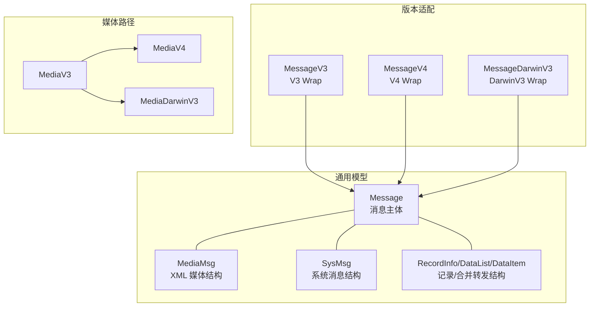
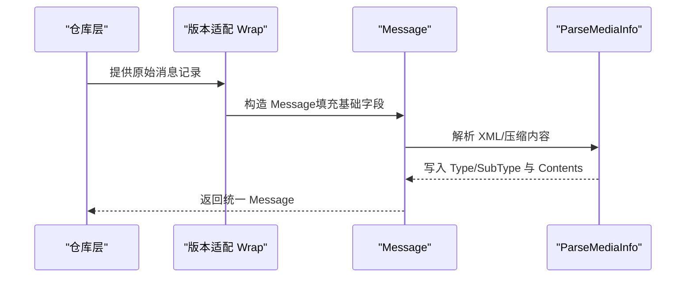
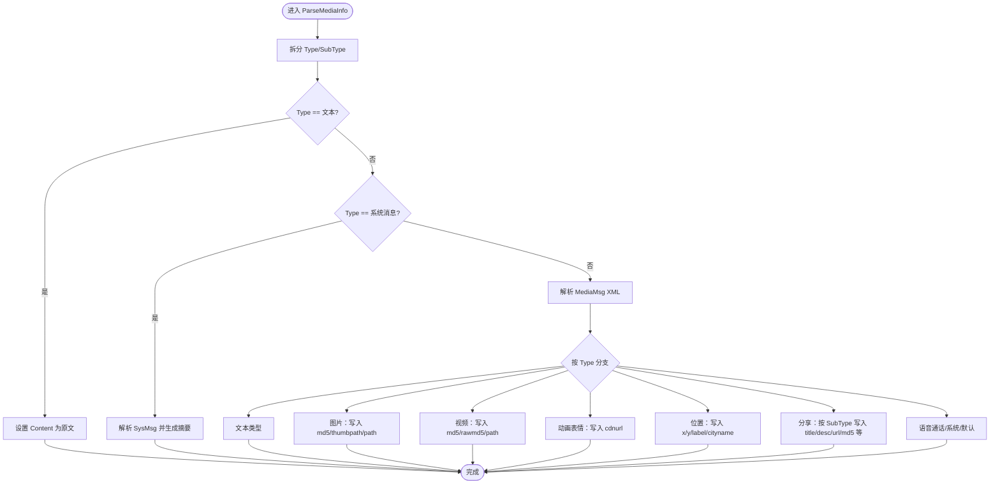
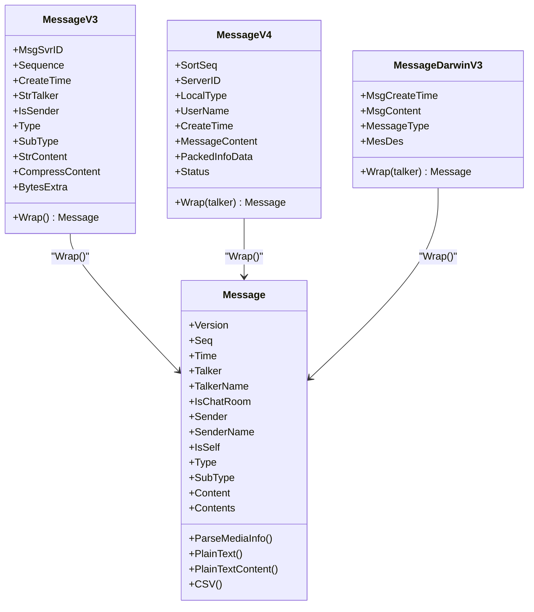
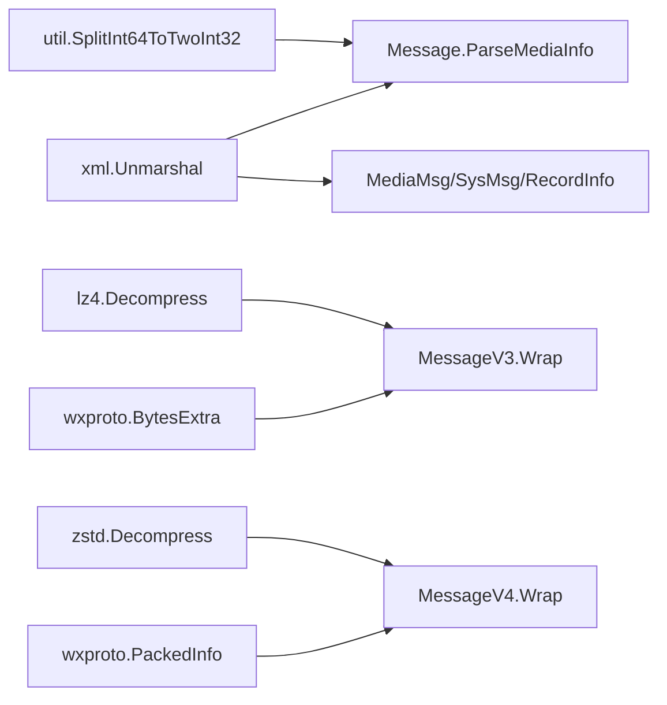

# 消息模型

<cite>
**本文引用的文件**
- [internal/model/message.go](file://internal/model/message.go)
- [internal/model/mediamessage.go](file://internal/model/mediamessage.go)
- [internal/model/message_v3.go](file://internal/model/message_v3.go)
- [internal/model/message_v4.go](file://internal/model/message_v4.go)
- [internal/model/message_darwinv3.go](file://internal/model/message_darwinv3.go)
- [internal/model/media.go](file://internal/model/media.go)
- [internal/model/media_v4.go](file://internal/model/media_v4.go)
- [internal/model/media_darwinv3.go](file://internal/model/media_darwinv3.go)
- [internal/model/wxproto/packedinfo.pb.go](file://internal/model/wxproto/packedinfo.pb.go)
</cite>

## 目录
1. [简介](#简介)
2. [项目结构](#项目结构)
3. [核心组件](#核心组件)
4. [架构总览](#架构总览)
5. [详细组件分析](#详细组件分析)
6. [依赖关系分析](#依赖关系分析)
7. [性能考量](#性能考量)
8. [故障排查指南](#故障排查指南)
9. [结论](#结论)

## 简介
本文件系统性阐述消息模型的设计与实现，覆盖以下关键主题：
- Message 结构体各字段语义与用途
- 消息类型常量与消息子类型常量的定义与分类
- ParseMediaInfo 的工作原理与多媒体消息解析流程
- 内容格式化方法 PlainText、PlainTextContent、CSV 的使用要点
- 不同微信版本（V3/V4/DarwinV3）的消息模型差异与适配机制

## 项目结构
消息模型相关代码主要位于 internal/model 目录，按“通用模型 + 版本适配 + 媒体结构”三层组织：
- 通用模型：Message、Media、各类 XML/Proto 解析结构体
- 版本适配：MessageV3、MessageV4、MessageDarwinV3 的 Wrap 流程
- 媒体路径：MediaV3/MediaV4/MediaDarwinV3 的 Wrap 路径映射

图表来源
- [internal/model/message.go](file://internal/model/message.go#L108-L126)
- [internal/model/mediamessage.go](file://internal/model/mediamessage.go#L10-L17)
- [internal/model/message_v3.go](file://internal/model/message_v3.go#L42-L53)
- [internal/model/message_v4.go](file://internal/model/message_v4.go#L36-L45)
- [internal/model/message_darwinv3.go](file://internal/model/message_darwinv3.go#L25-L30)
- [internal/model/media.go](file://internal/model/media.go#L7-L15)
- [internal/model/media_v4.go](file://internal/model/media_v4.go#L5-L13)
- [internal/model/media_darwinv3.go](file://internal/model/media_darwinv3.go#L18-L25)

章节来源
- [internal/model/message.go](file://internal/model/message.go#L108-L126)
- [internal/model/mediamessage.go](file://internal/model/mediamessage.go#L10-L17)
- [internal/model/message_v3.go](file://internal/model/message_v3.go#L42-L53)
- [internal/model/message_v4.go](file://internal/model/message_v4.go#L36-L45)
- [internal/model/message_darwinv3.go](file://internal/model/message_darwinv3.go#L25-L30)
- [internal/model/media.go](file://internal/model/media.go#L7-L15)
- [internal/model/media_v4.go](file://internal/model/media_v4.go#L5-L13)
- [internal/model/media_darwinv3.go](file://internal/model/media_darwinv3.go#L18-L25)

## 核心组件
本节聚焦 Message 结构体及其关键方法，解释字段语义与解析流程。

- 字段语义
  - Version：消息版本标识，用于区分 V3/V4/DarwinV3
  - Seq：消息序号，通常由 10 位时间戳 + 3 位序号组成
  - Time：消息创建时间（Unix 秒）
  - Talker/TalkerName：聊天对象 ID 与名称；群聊 ID 以 @chatroom 结尾
  - IsChatRoom：是否为群聊消息
  - Sender/SenderName：实际发送者 ID 与名称；群聊中可能与 Talker 不同
  - IsSelf：是否为当前账号本人发送
  - Type/SubType：消息类型与子类型，用于区分文本、图片、语音、视频、分享、系统等
  - Content：纯文本内容或系统消息摘要
  - Contents：多媒体消息的灵活键值存储，便于格式化输出
  - MediaMsg/SysMsg：调试用的原始 XML 结构缓存

- 关键方法
  - ParseMediaInfo：解析 XML 内容，填充 Type/SubType，并将多媒体元数据写入 Contents
  - PlainText/PlainTextContent：将消息格式化为人类可读文本
  - CSV：导出为 CSV 行（时间、发送者、接收者、内容等）

章节来源
- [internal/model/message.go](file://internal/model/message.go#L108-L126)
- [internal/model/message.go](file://internal/model/message.go#L128-L290)
- [internal/model/message.go](file://internal/model/message.go#L299-L343)
- [internal/model/message.go](file://internal/model/message.go#L345-L532)
- [internal/model/message.go](file://internal/model/message.go#L534-L544)

## 架构总览
消息从数据库读取后，经由各版本适配器 Wrap 成统一的 Message 对象，再通过 ParseMediaInfo 完成多媒体解析与内容提取，最终支持 PlainText/CSV 等多种输出。

图表来源
- [internal/model/message_v3.go](file://internal/model/message_v3.go#L55-L113)
- [internal/model/message_v4.go](file://internal/model/message_v4.go#L47-L102)
- [internal/model/message_darwinv3.go](file://internal/model/message_darwinv3.go#L32-L57)
- [internal/model/message.go](file://internal/model/message.go#L128-L290)

## 详细组件分析

### Message 结构体与字段语义
- Version：区分微信版本，影响后续解析细节
- Seq/Time：排序与时间戳，用于日志与检索
- Talker/TalkerName/IsChatRoom：群聊识别与名称展示
- Sender/SenderName/IsSelf：区分实际发送者与当前账号
- Type/SubType：消息类型与子类型，决定内容解析与格式化策略
- Content/Contents：纯文本与多媒体键值对，用于格式化输出
- MediaMsg/SysMsg：调试用的原始 XML 缓存

章节来源
- [internal/model/message.go](file://internal/model/message.go#L108-L126)

### 消息类型与子类型常量
- 文本类
  - MessageTypeText：普通文本
  - MessageSubTypeText/MessageSubTypeLink/MessageSubTypeLink2/MessageSubTypeNote/MessageSubTypeMiniProgram/MessageSubTypeMiniProgram2/MessageSubTypeChannel/MessageSubTypeChannelLive/MessageSubTypeQuote/MessageSubTypePat/MessageSubTypeMusic/MessageSubTypePay/MessageSubTypeRedEnvelope/MessageSubTypeRedEnvelopeCover 等
- 媒体类
  - MessageTypeImage/MessageTypeVideo/MessageTypeVoice/MessageTypeAnimation/MessageTypeLocation/MessageTypeCard/MessageTypeShare/MessageTypeVOIP/MessageTypeSystem

章节来源
- [internal/model/message.go](file://internal/model/message.go#L20-L106)

### ParseMediaInfo 解析流程
该方法负责将 XML 内容解析为结构化消息，并根据 Type/SubType 写入 Contents，同时处理系统消息与引用消息等特殊情况。

图表来源
- [internal/model/message.go](file://internal/model/message.go#L128-L290)
- [internal/model/mediamessage.go](file://internal/model/mediamessage.go#L10-L17)

章节来源
- [internal/model/message.go](file://internal/model/message.go#L128-L290)

### 内容格式化方法
- PlainText：生成带时间、发送者、群聊标识与正文的纯文本输出
- PlainTextContent：按消息类型生成人类可读的摘要文本，支持图片/语音/视频/位置/分享/系统等
- CSV：导出为 CSV 行，包含时间、发送者、接收者、内容等字段

章节来源
- [internal/model/message.go](file://internal/model/message.go#L299-L343)
- [internal/model/message.go](file://internal/model/message.go#L345-L532)
- [internal/model/message.go](file://internal/model/message.go#L534-L544)

### 版本适配机制（V3/V4/DarwinV3）
- MessageV3
  - 从 CompressContent 解压（如 Type=49），从 BytesExtra 提取发送者与媒体路径
  - 语音消息写入 voice 键
- MessageV4
  - 识别 zstd 压缩头，解压后解析；群聊消息通过冒号前缀分离发送者
  - 通过 PackedInfo 提取媒体哈希并拼装路径
- MessageDarwinV3
  - 直接解析 MsgContent，群聊消息通过冒号前缀分离发送者

图表来源
- [internal/model/message_v3.go](file://internal/model/message_v3.go#L42-L113)
- [internal/model/message_v4.go](file://internal/model/message_v4.go#L36-L102)
- [internal/model/message_darwinv3.go](file://internal/model/message_darwinv3.go#L25-L57)
- [internal/model/message.go](file://internal/model/message.go#L108-L126)

章节来源
- [internal/model/message_v3.go](file://internal/model/message_v3.go#L42-L113)
- [internal/model/message_v4.go](file://internal/model/message_v4.go#L36-L102)
- [internal/model/message_darwinv3.go](file://internal/model/message_darwinv3.go#L25-L57)

### 媒体路径与资源定位
- MediaV3/MediaV4/MediaDarwinV3 提供不同版本的媒体路径映射规则
- V3：基于 BytesExtra 的目录与文件名组合
- V4：基于 PackedInfo 的哈希与时间目录组合
- DarwinV3：基于相对路径与文件名的拼接

章节来源
- [internal/model/media.go](file://internal/model/media.go#L26-L45)
- [internal/model/media_v4.go](file://internal/model/media_v4.go#L15-L35)
- [internal/model/media_darwinv3.go](file://internal/model/media_darwinv3.go#L27-L40)

## 依赖关系分析
- Message 依赖 util.SplitInt64ToTwoInt32 进行类型拆分
- V3 依赖 lz4 解压与 protobuf 解析 BytesExtra
- V4 依赖 zstd 解压与 protobuf 解析 PackedInfo
- 通用解析依赖 xml 解析 MediaMsg/SysMsg/RecordInfo 等结构

图表来源
- [internal/model/message.go](file://internal/model/message.go#L128-L130)
- [internal/model/message_v3.go](file://internal/model/message_v3.go#L74-L77)
- [internal/model/message_v4.go](file://internal/model/message_v4.go#L64-L70)
- [internal/model/wxproto/packedinfo.pb.go](file://internal/model/wxproto/packedinfo.pb.go#L64-L90)
- [internal/model/mediamessage.go](file://internal/model/mediamessage.go#L10-L17)

章节来源
- [internal/model/message.go](file://internal/model/message.go#L128-L130)
- [internal/model/message_v3.go](file://internal/model/message_v3.go#L74-L77)
- [internal/model/message_v4.go](file://internal/model/message_v4.go#L64-L70)
- [internal/model/wxproto/packedinfo.pb.go](file://internal/model/wxproto/packedinfo.pb.go#L64-L90)
- [internal/model/mediamessage.go](file://internal/model/mediamessage.go#L10-L17)

## 性能考量
- 压缩内容解压：V3 使用 lz4，V4 使用 zstd，注意仅在必要时解压，避免重复操作
- XML 解析：ParseMediaInfo 会解析 MediaMsg/SysMsg，建议在 Debug=false 时减少冗余结构缓存
- 群聊发送者解析：V3 通过 BytesExtra，V4 通过 PackedInfo，尽量复用解析结果
- 输出格式化：PlainText/CSV 会遍历 Contents，建议在上游只写入必要键值，降低格式化成本

## 故障排查指南
- 解析失败
  - 检查 Type/SubType 拆分是否正确（SplitInt64ToTwoInt32）
  - 确认 XML 内容是否完整，必要时启用 Debug 查看 MediaMsg/SysMsg
- 媒体资源缺失
  - V3：确认 BytesExtra 是否存在且包含期望键值
  - V4：确认 PackedInfo 是否存在且包含媒体哈希
- 群聊发送者错误
  - V3：检查 IsChatRoom 与 BytesExtra 的 Sender 提取
  - V4：检查冒号前缀分割逻辑
- 导出异常
  - PlainText/CSV 依赖 Contents 中的 host 与具体键值，确保 SetContent("host", ...) 已调用

章节来源
- [internal/model/message.go](file://internal/model/message.go#L128-L130)
- [internal/model/message_v3.go](file://internal/model/message_v3.go#L87-L110)
- [internal/model/message_v4.go](file://internal/model/message_v4.go#L87-L99)
- [internal/model/mediamessage.go](file://internal/model/mediamessage.go#L238-L305)

## 结论
消息模型通过统一的 Message 结构与版本适配器，实现了对多版本微信消息的兼容解析。ParseMediaInfo 将复杂 XML/压缩内容转化为简洁的 Contents，配合 PlainText/PlainTextContent/CSV 提供多样化的输出能力。针对不同版本的差异（V3/V4/DarwinV3），通过 BytesExtra/PackedInfo 等机制进行适配，保证了跨平台与跨版本的一致体验。