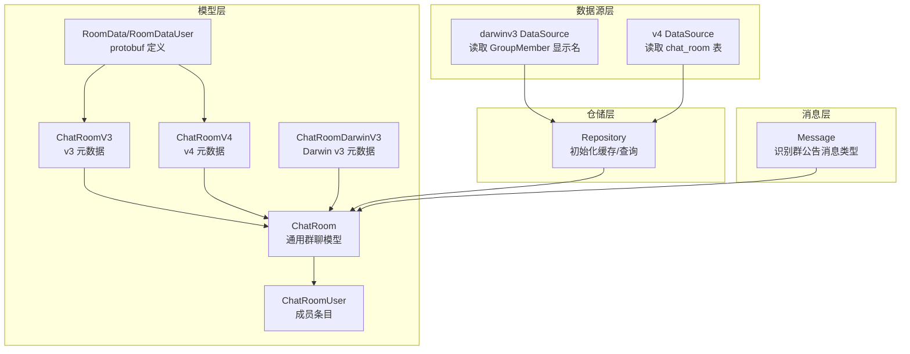
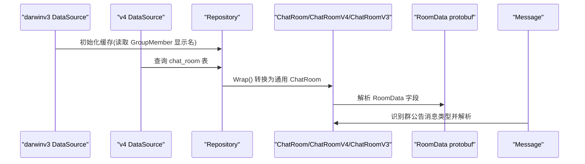
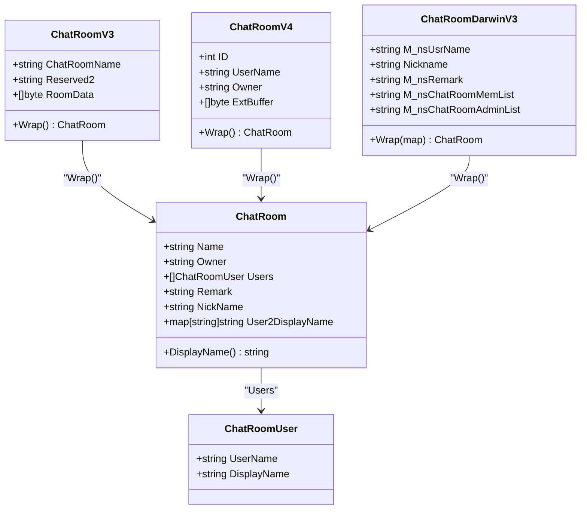
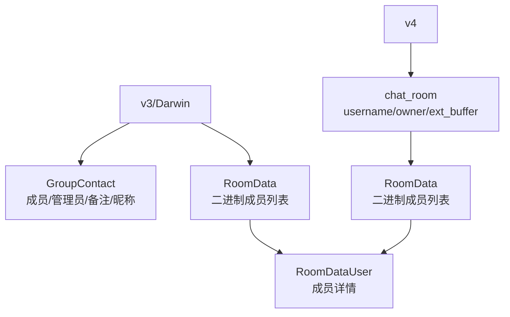
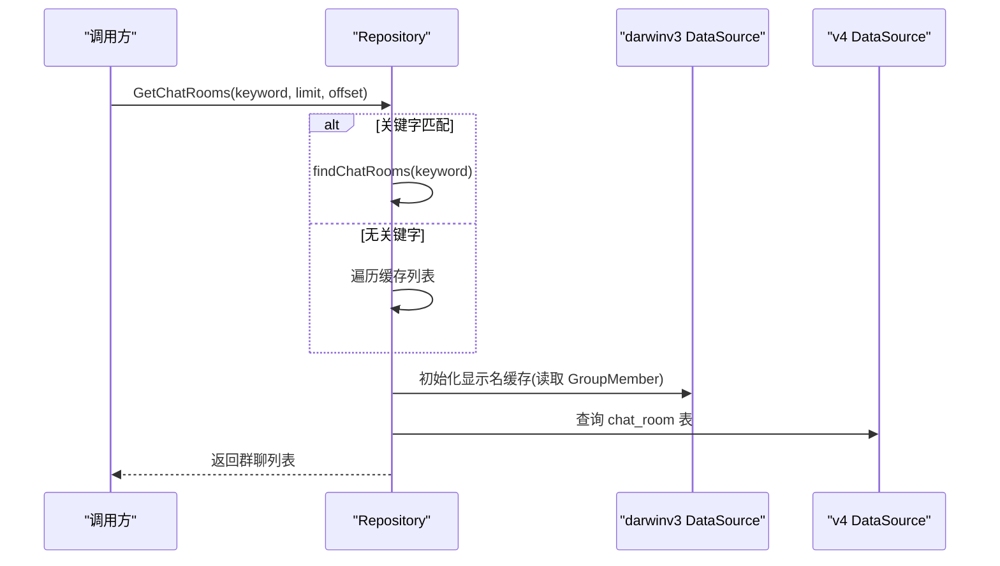
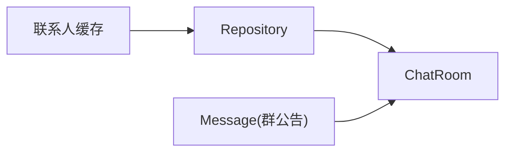
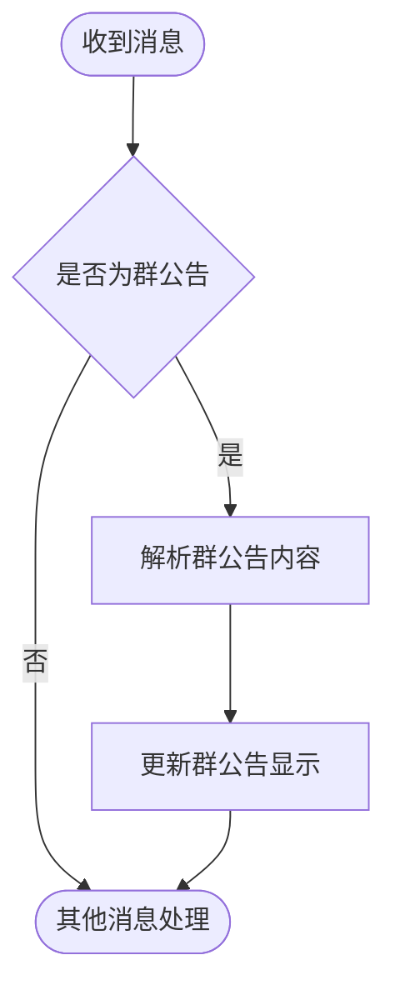
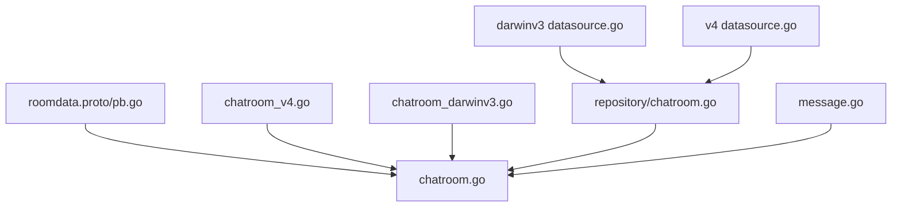

# 群聊模型

<cite>
**本文引用的文件**
- [chatroom.go](file://internal/model/chatroom.go)
- [chatroom_v4.go](file://internal/model/chatroom_v4.go)
- [chatroom_darwinv3.go](file://internal/model/chatroom_darwinv3.go)
- [roomdata.proto](file://internal/model/wxproto/roomdata.proto)
- [roomdata.pb.go](file://internal/model/wxproto/roomdata.pb.go)
- [chatroom.go](file://internal/wechatdb/repository/chatroom.go)
- [datasource.go (darwinv3)](file://internal/wechatdb/datasource/darwinv3/datasource.go)
- [datasource.go (v4)](file://internal/wechatdb/datasource/v4/datasource.go)
- [message.go](file://internal/model/message.go)
</cite>

## 目录
1. [简介](#简介)
2. [项目结构](#项目结构)
3. [核心组件](#核心组件)
4. [架构总览](#架构总览)
5. [详细组件分析](#详细组件分析)
6. [依赖分析](#依赖分析)
7. [性能考量](#性能考量)
8. [故障排查指南](#故障排查指南)
9. [结论](#结论)
10. [附录](#附录)

## 简介
本文件系统性梳理“群聊模型”的设计与实现，覆盖以下要点：
- ChatRoom 结构体字段定义：群组 ID、群名称、群主、成员列表、群公告等信息的来源与映射关系
- 成员权限管理：管理员与普通成员的识别与区分
- 不同微信版本的数据结构差异：v3 与 v4 的差异及 Darwin 平台差异
- 群聊信息的增删改查操作示例：基于仓库层与数据源层的调用流程
- 群聊与消息、联系人的关联关系：如何从联系人补充群信息，如何解析群公告消息
- 群聊通知处理机制：群公告消息类型的识别与解析

## 项目结构
围绕群聊模型的关键目录与文件如下：
- 模型层：定义通用群聊结构与各版本差异结构，以及成员显示名映射
- 协议层：定义群成员数据的 protobuf 消息结构
- 数据源层：按平台与版本读取群聊元数据与成员信息
- 仓储层：统一缓存与查询群聊，提供模糊匹配与分页能力
- 消息层：识别群公告消息类型并解析其内容

图表来源
- [chatroom.go](file://internal/model/chatroom.go#L9-L116)
- [chatroom_v4.go](file://internal/model/chatroom_v4.go#L1-L37)
- [chatroom_darwinv3.go](file://internal/model/chatroom_darwinv3.go#L1-L98)
- [roomdata.proto](file://internal/model/wxproto/roomdata.proto#L1-L17)
- [roomdata.pb.go](file://internal/model/wxproto/roomdata.pb.go#L26-L86)
- [datasource.go (darwinv3)](file://internal/wechatdb/datasource/darwinv3/datasource.go#L162-L192)
- [datasource.go (v4)](file://internal/wechatdb/datasource/v4/datasource.go#L423-L499)
- [chatroom.go](file://internal/wechatdb/repository/chatroom.go#L14-L97)
- [message.go](file://internal/model/message.go#L92-L106)

章节来源
- [chatroom.go](file://internal/model/chatroom.go#L1-L116)
- [chatroom_v4.go](file://internal/model/chatroom_v4.go#L1-L37)
- [chatroom_darwinv3.go](file://internal/model/chatroom_darwinv3.go#L1-L98)
- [roomdata.proto](file://internal/model/wxproto/roomdata.proto#L1-L17)
- [roomdata.pb.go](file://internal/model/wxproto/roomdata.pb.go#L26-L86)
- [datasource.go (darwinv3)](file://internal/wechatdb/datasource/darwinv3/datasource.go#L162-L192)
- [datasource.go (v4)](file://internal/wechatdb/datasource/v4/datasource.go#L423-L499)
- [chatroom.go](file://internal/wechatdb/repository/chatroom.go#L14-L97)
- [message.go](file://internal/model/message.go#L92-L106)

## 核心组件
- ChatRoom：通用群聊模型，包含群名称、群主、成员列表、备注与昵称等字段，并维护用户到显示名的映射
- ChatRoomUser：成员条目，包含用户标识与显示名
- ChatRoomV3/ChatRoomV4/ChatRoomDarwinV3：各版本/平台的群聊元数据结构，均通过 Wrap 方法转换为通用 ChatRoom
- RoomData/RoomDataUser：protobuf 定义的群成员数据结构，用于解析 RoomData 字段
- Repository：负责初始化群聊缓存、模糊匹配与分页查询
- DataSource：按平台与版本读取群聊元数据与成员信息

章节来源
- [chatroom.go](file://internal/model/chatroom.go#L9-L116)
- [chatroom_v4.go](file://internal/model/chatroom_v4.go#L1-L37)
- [chatroom_darwinv3.go](file://internal/model/chatroom_darwinv3.go#L39-L98)
- [roomdata.proto](file://internal/model/wxproto/roomdata.proto#L6-L16)
- [roomdata.pb.go](file://internal/model/wxproto/roomdata.pb.go#L26-L86)
- [chatroom.go](file://internal/wechatdb/repository/chatroom.go#L14-L97)

## 架构总览
下图展示从数据源到仓储再到模型的整体流程，以及群公告消息的识别路径。

图表来源
- [datasource.go (darwinv3)](file://internal/wechatdb/datasource/darwinv3/datasource.go#L162-L192)
- [datasource.go (v4)](file://internal/wechatdb/datasource/v4/datasource.go#L423-L499)
- [chatroom.go](file://internal/wechatdb/repository/chatroom.go#L14-L97)
- [chatroom.go](file://internal/model/chatroom.go#L65-L105)
- [roomdata.proto](file://internal/model/wxproto/roomdata.proto#L6-L16)
- [message.go](file://internal/model/message.go#L92-L106)

## 详细组件分析

### ChatRoom 结构体与字段定义
- 字段说明
  - Name：群名称/群 ID
  - Owner：群主标识
  - Users：成员列表，每项包含用户标识与显示名
  - Remark/NickName：来自联系人信息的备注与昵称，用于显示优先级
  - User2DisplayName：用户标识到显示名的映射，便于快速显示
- 显示名优先级：Remark > NickName > 空字符串
- 成员列表来源
  - v3：RoomData 字段解析为 RoomDataUser 列表
  - v4：ExtBuffer 字段解析为 RoomDataUser 列表
  - Darwin v3：从 GroupContact 的成员列表字段拆分得到基础成员列表，并结合显示名缓存补全

图表来源
- [chatroom.go](file://internal/model/chatroom.go#L9-L116)
- [chatroom_v4.go](file://internal/model/chatroom_v4.go#L9-L36)
- [chatroom_darwinv3.go](file://internal/model/chatroom_darwinv3.go#L39-L98)

章节来源
- [chatroom.go](file://internal/model/chatroom.go#L9-L116)
- [chatroom_darwinv3.go](file://internal/model/chatroom_darwinv3.go#L39-L98)

### 成员权限管理：管理员与普通成员
- Darwin v3：从 GroupContact 的管理员列表字段直接获取群主与管理员集合
- v3/v4：RoomDataUser 中包含状态字段，protobuf 注释说明状态码范围为 0-9；当前仓库未对状态码进行显式解析与区分
- 实践建议
  - 若需严格区分管理员与普通成员，可在 Wrap 过程中解析 RoomDataUser 的状态字段，并维护管理员集合
  - 当前实现仅保留成员列表与显示名映射，不包含管理员标识

章节来源
- [chatroom_darwinv3.go](file://internal/model/chatroom_darwinv3.go#L42-L44)
- [roomdata.proto](file://internal/model/wxproto/roomdata.proto#L11-L16)

### 不同微信版本的数据结构差异
- v3（Darwin）：群聊元数据存储于 GroupContact 表，成员列表与管理员列表为文本字段；RoomData 字段为二进制，需解析为 RoomData
- v4：群聊元数据存储于 chat_room 表，ExtBuffer 为二进制字段，需解析为 RoomData
- Darwin v3：额外包含昵称、备注等联系人信息字段，可作为显示名来源

图表来源
- [chatroom_darwinv3.go](file://internal/model/chatroom_darwinv3.go#L5-L38)
- [chatroom_v4.go](file://internal/model/chatroom_v4.go#L3-L14)
- [roomdata.proto](file://internal/model/wxproto/roomdata.proto#L6-L16)

章节来源
- [chatroom_darwinv3.go](file://internal/model/chatroom_darwinv3.go#L5-L38)
- [chatroom_v4.go](file://internal/model/chatroom_v4.go#L3-L14)
- [roomdata.proto](file://internal/model/wxproto/roomdata.proto#L6-L16)

### 群聊信息的增删改查操作示例
- 查询群聊列表
  - 无关键字：按名称排序返回，支持分页
  - 有关键字：按名称、备注、昵称模糊匹配，支持分页
- 查询单个群聊
  - 支持按名称、备注、昵称精确或模糊匹配
- 缓存策略
  - 初始化时加载全部群聊，建立名称、备注、昵称到群聊的索引
  - 同时从联系人缓存补充备注与昵称信息

图表来源
- [chatroom.go](file://internal/wechatdb/repository/chatroom.go#L99-L136)
- [chatroom.go](file://internal/wechatdb/repository/chatroom.go#L154-L178)
- [datasource.go (darwinv3)](file://internal/wechatdb/datasource/darwinv3/datasource.go#L162-L192)
- [datasource.go (v4)](file://internal/wechatdb/datasource/v4/datasource.go#L423-L499)

章节来源
- [chatroom.go](file://internal/wechatdb/repository/chatroom.go#L14-L97)
- [chatroom.go](file://internal/wechatdb/repository/chatroom.go#L99-L136)
- [chatroom.go](file://internal/wechatdb/repository/chatroom.go#L154-L178)
- [datasource.go (darwinv3)](file://internal/wechatdb/datasource/darwinv3/datasource.go#L162-L192)
- [datasource.go (v4)](file://internal/wechatdb/datasource/v4/datasource.go#L423-L499)

### 群聊与消息、联系人的关联关系
- 联系人补充：仓储层在初始化缓存时，会从联系人缓存中补充群聊的备注与昵称
- 群公告消息：消息类型中包含“群公告”子类型，消息层会解析该类消息的内容

图表来源
- [chatroom.go](file://internal/wechatdb/repository/chatroom.go#L147-L152)
- [message.go](file://internal/model/message.go#L92-L106)

章节来源
- [chatroom.go](file://internal/wechatdb/repository/chatroom.go#L147-L152)
- [message.go](file://internal/model/message.go#L92-L106)

### 群聊通知的处理机制
- 群公告消息类型：消息子类型中包含“群公告”，消息层会将其识别并解析为可读内容
- 展示逻辑：群聊显示名优先使用备注，其次昵称，最后回退为空

图表来源
- [message.go](file://internal/model/message.go#L92-L106)
- [chatroom.go](file://internal/model/chatroom.go#L107-L116)

章节来源
- [message.go](file://internal/model/message.go#L92-L106)
- [chatroom.go](file://internal/model/chatroom.go#L107-L116)

## 依赖分析
- 模型层依赖 protobuf 定义的 RoomData/RoomDataUser，用于解析成员列表
- 数据源层分别对接 Darwin v3 与 v4 的数据库结构，提供统一的查询接口
- 仓储层聚合数据源结果，构建缓存并提供查询方法
- 消息层依赖仓储层提供的群聊模型，识别并解析群公告消息

图表来源
- [roomdata.proto](file://internal/model/wxproto/roomdata.proto#L6-L16)
- [roomdata.pb.go](file://internal/model/wxproto/roomdata.pb.go#L26-L86)
- [chatroom.go](file://internal/model/chatroom.go#L65-L105)
- [chatroom_v4.go](file://internal/model/chatroom_v4.go#L16-L36)
- [chatroom_darwinv3.go](file://internal/model/chatroom_darwinv3.go#L75-L98)
- [datasource.go (darwinv3)](file://internal/wechatdb/datasource/darwinv3/datasource.go#L162-L192)
- [datasource.go (v4)](file://internal/wechatdb/datasource/v4/datasource.go#L423-L499)
- [chatroom.go](file://internal/wechatdb/repository/chatroom.go#L14-L97)
- [message.go](file://internal/model/message.go#L92-L106)

章节来源
- [roomdata.proto](file://internal/model/wxproto/roomdata.proto#L6-L16)
- [roomdata.pb.go](file://internal/model/wxproto/roomdata.pb.go#L26-L86)
- [chatroom.go](file://internal/model/chatroom.go#L65-L105)
- [chatroom_v4.go](file://internal/model/chatroom_v4.go#L16-L36)
- [chatroom_darwinv3.go](file://internal/model/chatroom_darwinv3.go#L75-L98)
- [datasource.go (darwinv3)](file://internal/wechatdb/datasource/darwinv3/datasource.go#L162-L192)
- [datasource.go (v4)](file://internal/wechatdb/datasource/v4/datasource.go#L423-L499)
- [chatroom.go](file://internal/wechatdb/repository/chatroom.go#L14-L97)
- [message.go](file://internal/model/message.go#L92-L106)

## 性能考量
- 缓存策略：仓储层在初始化时加载全部群聊并建立多维索引，避免重复查询
- 分页与过滤：仓储层支持分页与模糊匹配，减少一次性返回大量数据
- 数据库访问：数据源层按平台与版本选择对应表，避免跨版本误读
- 显示名映射：Darwin v3 数据源预先读取 GroupMember 的昵称映射，Wrap 时可直接应用

章节来源
- [chatroom.go](file://internal/wechatdb/repository/chatroom.go#L14-L97)
- [datasource.go (darwinv3)](file://internal/wechatdb/datasource/darwinv3/datasource.go#L162-L192)

## 故障排查指南
- 群聊未显示备注/昵称
  - 检查联系人缓存是否正确加载
  - 确认仓储层的补充逻辑是否执行
- 群成员列表为空
  - 确认 RoomData/ExtBuffer 是否存在且可解析
  - 检查 protobuf 版本与字段兼容性
- 查询无结果
  - 确认关键字是否匹配名称、备注或昵称
  - 检查分页参数是否合理
- 群公告未识别
  - 确认消息子类型是否为群公告
  - 检查消息内容解析逻辑

章节来源
- [chatroom.go](file://internal/wechatdb/repository/chatroom.go#L147-L152)
- [chatroom.go](file://internal/model/chatroom.go#L87-L105)
- [message.go](file://internal/model/message.go#L92-L106)

## 结论
本群聊模型通过通用 ChatRoom 抽象，统一了 v3 与 v4、Darwin 与 Windows 的差异，实现了：
- 成员列表与显示名映射的标准化
- 群主与管理员的可扩展识别入口
- 群公告消息的识别与解析
- 缓存与查询的高效实现

后续可进一步完善管理员状态解析与权限控制，以满足更复杂的业务场景。

## 附录
- 关键字段与来源对照
  - Name：v3/Darwin v3 的群名称字段；v4 的 username 字段
  - Owner：v3/Darwin v3 的管理员列表字段；v4 的 owner 字段
  - Users：RoomData/ExtBuffer 解析出的成员列表
  - Remark/NickName：联系人缓存补充
- 常见问题
  - RoomData/ExtBuffer 为空：表示尚未拉取或解析失败
  - 群公告消息未显示：检查消息类型与解析逻辑