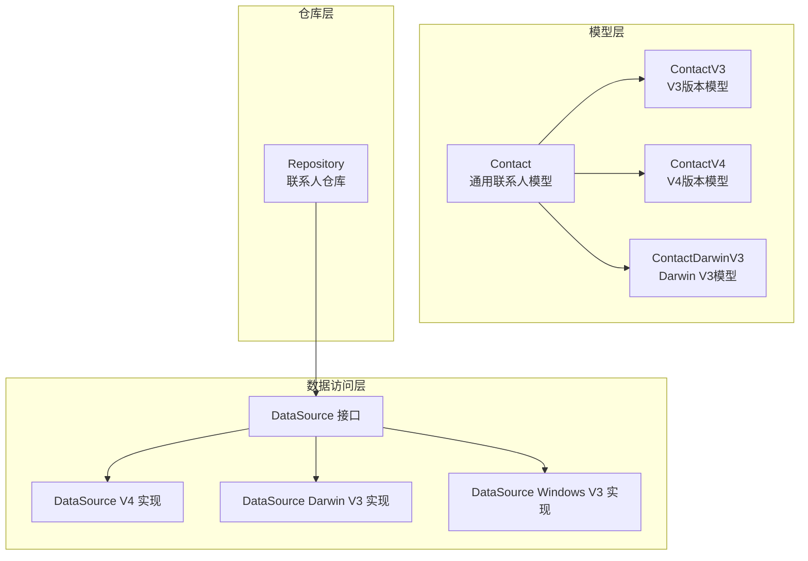
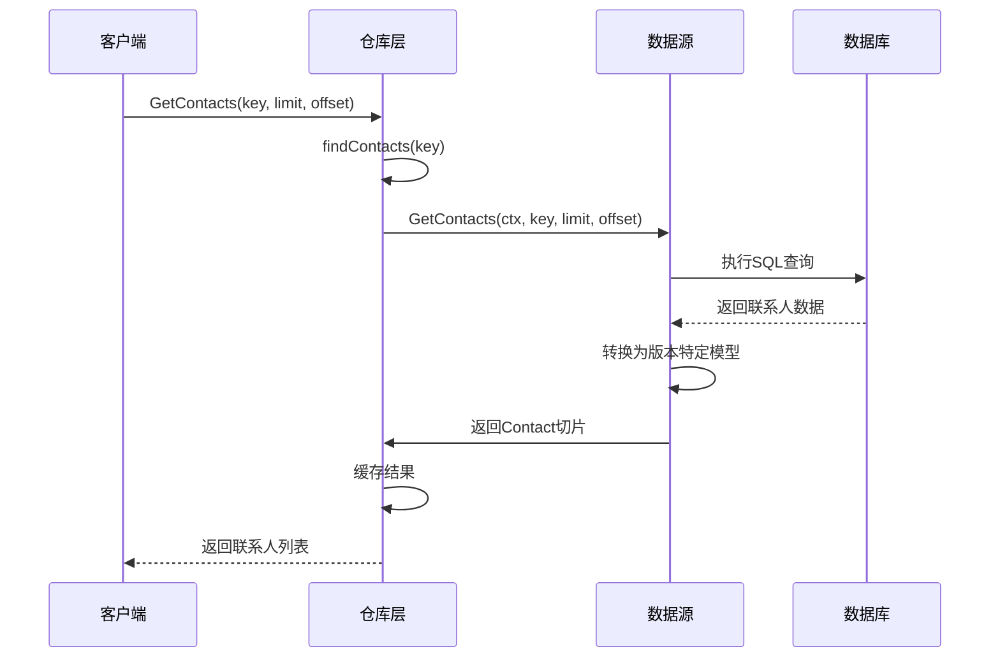
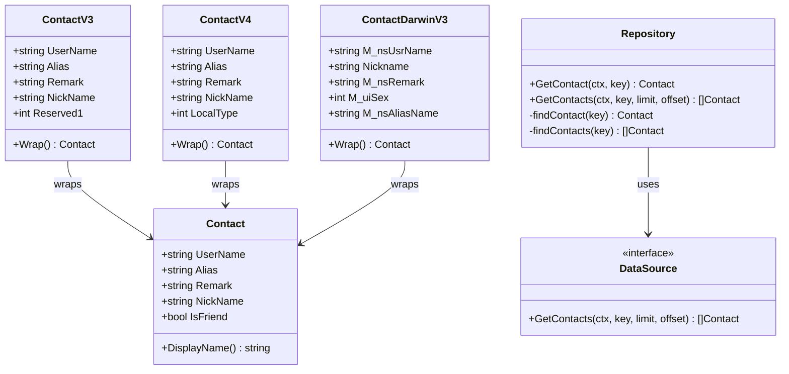

# 联系人模型

<cite>
**本文档引用的文件**
- [contact.go](file://internal/model/contact.go)
- [contact_v4.go](file://internal/model/contact_v4.go)
- [contact_darwinv3.go](file://internal/model/contact_darwinv3.go)
- [contact.go](file://internal/wechatdb/repository/contact.go)
- [datasource.go](file://internal/wechatdb/datasource/datasource.go)
- [datasource.go](file://internal/wechatdb/datasource/v4/datasource.go)
- [datasource.go](file://internal/wechatdb/datasource/darwinv3/datasource.go)
- [datasource.go](file://internal/wechatdb/datasource/windowsv3/datasource.go)
</cite>

## 目录
1. [简介](#简介)
2. [项目结构](#项目结构)
3. [核心组件](#核心组件)
4. [架构概览](#架构概览)
5. [详细组件分析](#详细组件分析)
6. [依赖关系分析](#依赖关系分析)
7. [性能考虑](#性能考虑)
8. [故障排除指南](#故障排除指南)
9. [结论](#结论)

## 简介
本文档详细介绍了微信联系人模型的设计与实现，包括跨平台、跨版本的数据结构差异，以及联系人状态的表示方法。文档重点说明了 Contact 结构体的字段定义，解释了在不同微信版本（V3/V4）和操作系统（Windows/Darwin）中的数据结构变化，提供了联系人数据的获取、更新和查询方法的使用示例，并阐述了联系人模型与其他实体（消息、群聊）的关系。

## 项目结构
联系人模型位于 internal/model 目录下，包含通用 Contact 结构体以及针对不同版本和平台的特定实现。数据访问层位于 internal/wechatdb 目录，提供统一的 DataSource 接口和具体实现。

**图表来源**
- [contact.go](file://internal/model/contact.go#L1-L71)
- [contact_v4.go](file://internal/model/contact_v4.go#L1-L44)
- [contact_darwinv3.go](file://internal/model/contact_darwinv3.go#L1-L54)
- [datasource.go](file://internal/wechatdb/datasource/datasource.go#L16-L37)

**章节来源**
- [contact.go](file://internal/model/contact.go#L1-L71)
- [datasource.go](file://internal/wechatdb/datasource/datasource.go#L1-L53)

## 核心组件
联系人模型的核心由三个层次组成：通用 Contact 结构体、版本特定模型和数据访问接口。

### 通用 Contact 结构体
通用 Contact 结构体定义了联系人的基本属性：
- 用户名（UserName）
- 昵称（NickName）
- 备注（Remark）
- 别名（Alias）
- 好友状态（IsFriend）

该结构体提供了显示名称计算方法，优先使用备注，其次使用昵称。

### 版本特定模型
针对不同微信版本和平台，实现了专门的联系人模型：

#### V3 版本模型
- Windows V3：使用 Reserved1 字段区分好友状态
- Darwin V3：包含性别、别名等额外字段

#### V4 版本模型  
- 统一的 username、alias、remark、nick_name 字段
- 使用 LocalType 字段标识联系人类型

**章节来源**
- [contact.go](file://internal/model/contact.go#L3-L9)
- [contact.go](file://internal/model/contact.go#L44-L60)
- [contact_v4.go](file://internal/model/contact_v4.go#L27-L43)
- [contact_darwinv3.go](file://internal/model/contact_darwinv3.go#L37-L53)

## 架构概览
联系人数据访问采用分层架构，通过 DataSource 接口抽象不同平台和版本的差异。

**图表来源**
- [contact.go](file://internal/wechatdb/repository/contact.go#L105-L139)
- [datasource.go](file://internal/wechatdb/datasource/v4/datasource.go#L367-L421)

## 详细组件分析

### Contact 结构体详解
Contact 是统一的联系人模型，用于跨版本和跨平台的数据交换。

#### 字段定义
- **UserName**: 联系人唯一标识符
- **Alias**: 联系人别名
- **Remark**: 联系人备注
- **NickName**: 联系人昵称  
- **IsFriend**: 是否为好友状态

#### 状态表示方法
联系人状态通过 IsFriend 字段统一表示：
- 好友：IsFriend = true
- 黑名单/非好友：IsFriend = false

不同版本的映射规则：
- V3 版本：根据 Reserved1 字段判断（1 表示好友）
- V4 版本：根据 LocalType 字段判断（3 表示群聊成员，非好友）
- Darwin V3 版本：默认设置为好友

**章节来源**
- [contact.go](file://internal/model/contact.go#L3-L9)
- [contact.go](file://internal/model/contact.go#L52-L60)
- [contact_v4.go](file://internal/model/contact_v4.go#L35-L43)
- [contact_darwinv3.go](file://internal/model/contact_darwinv3.go#L45-L53)

### 数据结构差异对比

#### V3 版本差异
**Windows V3 数据库结构**：
- 使用 Reserved1 字段标识好友状态
- 支持群聊成员识别
- 包含额外的标签和域名信息字段

**Darwin V3 数据库结构**：
- 包含性别（M_uiSex）字段
- 支持别名（M_nsAliasName）和备注（M_nsRemark）
- 提供头像相关信息字段

#### V4 版本差异
**统一字段设计**：
- username、alias、remark、nick_name 四个核心字段
- local_type 字段标识联系人类型
- 统一的头像 URL 和 MD5 字段

**类型标识**：
- 2：群聊
- 3：群聊成员（非好友）
- 5,6：企业微信

**章节来源**
- [contact_v4.go](file://internal/model/contact_v4.go#L3-L26)
- [contact_darwinv3.go](file://internal/model/contact_darwinv3.go#L3-L36)

### 数据访问层实现

#### DataSource 接口
DataSource 接口定义了统一的数据访问方法：
- GetContacts：获取联系人列表
- GetChatRooms：获取群聊信息
- GetMessages：获取消息数据
- SetCallback：设置回调函数

#### 平台特定实现

**V4 版本实现**：
- 支持 SQLite 数据库
- 动态数据库管理
- 文件监控机制

**Darwin V3 实现**：
- 支持 wccontact_new2.db 数据库
- 群聊成员数据库集成
- 会话显示名映射

**Windows V3 实现**：
- 支持 MicroMsg.db 主数据库
- 硬链接数据库支持
- 多数据库文件管理

**章节来源**
- [datasource.go](file://internal/wechatdb/datasource/datasource.go#L16-L37)
- [datasource.go](file://internal/wechatdb/datasource/v4/datasource.go#L67-L73)
- [datasource.go](file://internal/wechatdb/datasource/darwinv3/datasource.go#L59-L65)
- [datasource.go](file://internal/wechatdb/datasource/windowsv3/datasource.go#L73-L79)

### 仓库层缓存机制

#### 初始化流程
仓库层在初始化时建立多种索引：
- 用户名精确匹配
- 别名索引
- 备注索引  
- 昵称索引
- 群聊成员索引
- 群聊内部联系人索引

#### 查询优化
- 支持精确匹配和模糊匹配
- 多字段联合查询
- 分页和排序支持
- 缓存命中优先策略

**章节来源**
- [contact.go](file://internal/wechatdb/repository/contact.go#L14-L94)
- [contact.go](file://internal/wechatdb/repository/contact.go#L141-L172)

## 依赖关系分析

**图表来源**
- [contact.go](file://internal/model/contact.go#L3-L70)
- [contact_v4.go](file://internal/model/contact_v4.go#L27-L43)
- [contact_darwinv3.go](file://internal/model/contact_darwinv3.go#L37-L53)
- [contact.go](file://internal/wechatdb/repository/contact.go#L96-L139)

### 关键依赖关系
- **模型层依赖**：所有版本特定模型都封装到通用 Contact 结构体
- **仓库层依赖**：Repository 依赖 DataSource 接口实现数据访问
- **数据源依赖**：不同平台和版本实现 DataSource 接口
- **缓存依赖**：Repository 维护多级索引缓存

**章节来源**
- [contact.go](file://internal/model/contact.go#L52-L60)
- [contact_v4.go](file://internal/model/contact_v4.go#L35-L43)
- [contact_darwinv3.go](file://internal/model/contact_darwinv3.go#L45-L53)

## 性能考虑
联系人查询系统采用了多层次的性能优化策略：

### 缓存策略
- **内存缓存**：完整的联系人映射表
- **索引缓存**：基于别名、备注、昵称的快速查找索引
- **排序缓存**：预排序的用户名列表

### 查询优化
- **精确匹配优先**：优先使用精确匹配减少查询范围
- **模糊匹配降级**：精确匹配失败后使用模糊匹配
- **分页查询**：支持大数据量的分页处理
- **排序优化**：预排序避免运行时排序开销

### 并发安全
- **线程安全**：缓存操作使用互斥锁保护
- **不可变对象**：查询结果返回不可变的联系人对象
- **原子操作**：关键操作使用原子操作保证一致性

## 故障排除指南

### 常见问题及解决方案

#### 联系人状态异常
**问题**：联系人状态显示不正确
**原因**：版本映射规则不一致
**解决**：检查 LocalType 或 Reserved1 字段值，确认映射逻辑

#### 查询性能问题
**问题**：联系人查询响应缓慢
**原因**：缓存未初始化或索引缺失
**解决**：确保 Repository 正确初始化，检查索引构建过程

#### 数据库连接问题
**问题**：无法连接到微信数据库
**原因**：数据库文件不存在或权限不足
**解决**：验证数据库路径，检查文件权限，确认微信进程状态

**章节来源**
- [contact.go](file://internal/wechatdb/repository/contact.go#L14-L94)
- [datasource.go](file://internal/wechatdb/datasource/v4/datasource.go#L367-L421)

## 结论
联系人模型通过分层架构设计，成功解决了跨平台、跨版本的兼容性问题。通用 Contact 结构体提供了统一的数据交换格式，版本特定模型负责处理平台差异，仓库层实现了高效的缓存和查询机制。该设计既保证了系统的可维护性，又提供了良好的性能表现。

未来可以考虑的改进方向：
- 增加更多的状态字段支持
- 优化缓存策略以适应更大的数据集
- 扩展对新版本微信的支持
- 增强错误处理和日志记录能力