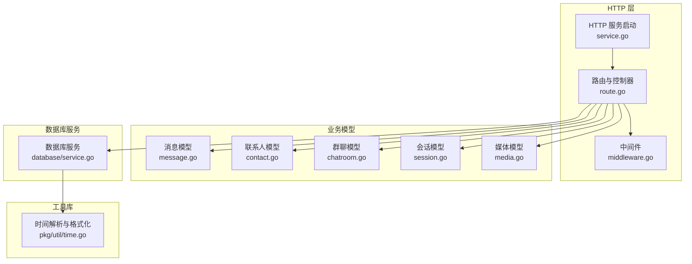
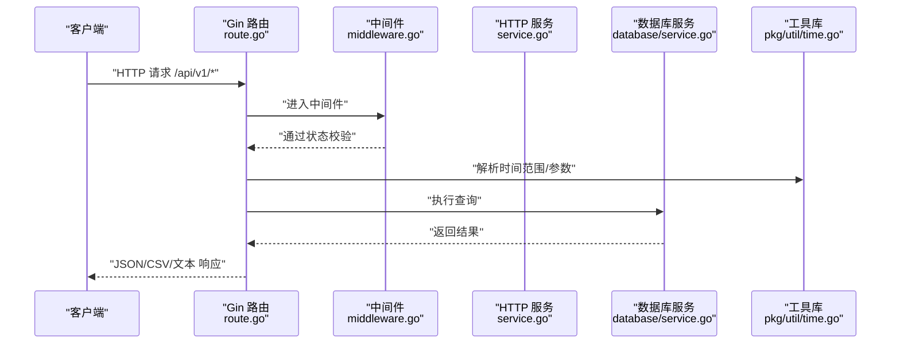
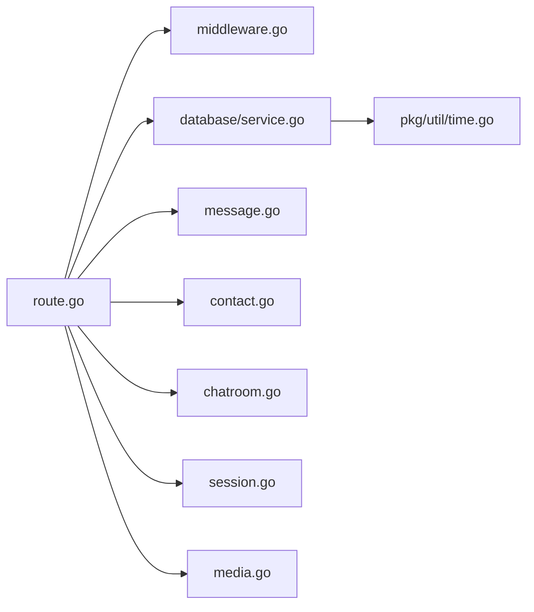

# API 端点

<cite>
**本文引用的文件**
- [route.go](file://internal/chatlog/http/route.go)
- [service.go](file://internal/chatlog/http/service.go)
- [middleware.go](file://internal/chatlog/http/middleware.go)
- [message.go](file://internal/model/message.go)
- [contact.go](file://internal/model/contact.go)
- [chatroom.go](file://internal/model/chatroom.go)
- [session.go](file://internal/model/session.go)
- [media.go](file://internal/model/media.go)
- [service.go](file://internal/chatlog/database/service.go)
- [time.go](file://pkg/util/time.go)
- [http_errors.go](file://internal/errors/http_errors.go)
- [index.htm](file://internal/chatlog/http/static/index.htm)
- [cmd_server.go](file://cmd/chatlog/cmd_server.go)
</cite>

## 目录
1. [简介](#简介)
2. [项目结构](#项目结构)
3. [核心组件](#核心组件)
4. [架构总览](#架构总览)
5. [详细组件分析](#详细组件分析)
6. [依赖关系分析](#依赖关系分析)
7. [性能与可扩展性](#性能与可扩展性)
8. [故障排查指南](#故障排查指南)
9. [结论](#结论)
10. [附录](#附录)

## 简介
本文件面向使用者与开发者，系统化梳理本项目的 RESTful API 端点，覆盖聊天记录查询、联系人管理、群聊管理、会话管理以及媒体内容处理等能力。文档同时说明：
- API 版本管理策略
- 分页与过滤机制
- 请求与响应格式
- 错误处理与状态码
- 实际调用示例（含 cURL 与客户端集成要点）

## 项目结构
围绕 HTTP 层路由与服务层实现，API 主要由以下模块构成：
- 路由与中间件：定义 /api/v1 下的资源端点、CORS、数据库状态校验等
- 业务模型：消息、联系人、群聊、会话、媒体等数据结构
- 数据库服务：封装查询接口，统一状态管理
- 工具库：时间范围解析、格式化等

图表来源
- [route.go](file://internal/chatlog/http/route.go#L26-L75)
- [service.go](file://internal/chatlog/http/service.go#L33-L59)
- [middleware.go](file://internal/chatlog/http/middleware.go#L10-L45)
- [message.go](file://internal/model/message.go#L108-L126)
- [contact.go](file://internal/model/contact.go#L3-L9)
- [chatroom.go](file://internal/model/chatroom.go#L9-L19)
- [session.go](file://internal/model/session.go#L8-L14)
- [media.go](file://internal/model/media.go#L7-L15)
- [service.go](file://internal/chatlog/database/service.go#L90-L109)
- [time.go](file://pkg/util/time.go#L434-L553)

章节来源
- [route.go](file://internal/chatlog/http/route.go#L26-L75)
- [service.go](file://internal/chatlog/http/service.go#L33-L59)
- [middleware.go](file://internal/chatlog/http/middleware.go#L10-L45)

## 核心组件
- 路由与控制器
  - /api/v1 下的资源端点：聊天记录、联系人、群聊、会话
  - 媒体端点：图像、视频、文件、语音、原始数据
  - MCP/SSE/Messages 端点（非 REST）
- 中间件
  - CORS 允许跨域
  - 数据库状态检查：未就绪/解密中/错误时拒绝请求
- 业务模型
  - 统一的消息、联系人、群聊、会话、媒体结构
- 数据库服务
  - 提供 GetMessages、GetContacts、GetChatRooms、GetSessions、GetMedia 等查询
- 工具库
  - 时间范围解析 TimeRangeOf，支持多种时间表达与相对时间
  - 输出格式化：CSV、JSON、纯文本

章节来源
- [route.go](file://internal/chatlog/http/route.go#L55-L75)
- [middleware.go](file://internal/chatlog/http/middleware.go#L10-L45)
- [message.go](file://internal/model/message.go#L108-L126)
- [contact.go](file://internal/model/contact.go#L3-L9)
- [chatroom.go](file://internal/model/chatroom.go#L9-L19)
- [session.go](file://internal/model/session.go#L8-L14)
- [media.go](file://internal/model/media.go#L7-L15)
- [service.go](file://internal/chatlog/database/service.go#L90-L109)
- [time.go](file://pkg/util/time.go#L434-L553)

## 架构总览
下图展示从客户端到数据库的典型调用链路，以及媒体处理流程。

图表来源
- [route.go](file://internal/chatlog/http/route.go#L90-L156)
- [middleware.go](file://internal/chatlog/http/middleware.go#L26-L45)
- [service.go](file://internal/chatlog/http/service.go#L33-L59)
- [service.go](file://internal/chatlog/database/service.go#L90-L109)
- [time.go](file://pkg/util/time.go#L434-L553)

## 详细组件分析

### API 版本管理
- 版本前缀：/api/v1
- 该版本仅包含上述资源端点；后续可通过新增版本路径扩展

章节来源
- [route.go](file://internal/chatlog/http/route.go#L55-L62)

### 聊天记录查询 /api/v1/chatlog
- 方法与路径
  - GET /api/v1/chatlog
- 查询参数
  - time: 时间范围字符串，支持多种格式与相对时间
  - talker: 会话标识（如联系人或群 ID），可为多个以逗号分隔
  - sender: 发送者微信 ID（可选）
  - keyword: 关键词（可选）
  - limit: 结果数量上限（非负整数）
  - offset: 偏移量（非负整数）
  - format: 输出格式
    - json：返回 JSON 数组
    - csv：返回 CSV 文件（浏览器下载）
    - 默认：纯文本逐条输出
- 响应
  - JSON：数组，元素为消息对象
  - CSV：列头 Time、SenderName、Sender、TalkerName、Talker、Content
  - 纯文本：每条消息一行，包含时间、发送者、会话名、内容等
- 状态码
  - 200 成功
  - 400 参数无效
  - 422 数据库未就绪/解密中/错误
  - 500 服务器内部错误
- 示例
  - cURL
    - curl "http://HOST:PORT/api/v1/chatlog?time=2024-01-01~2024-01-31&talker=wxid_123&limit=100&format=json"
    - curl "http://HOST:PORT/api/v1/chatlog?time=today&talker=wxid_a,wxid_b&keyword=会议&format=csv" -o logs.csv
- 错误处理
  - time 格式不合法返回 400
  - 数据库状态异常返回 422
  - 查询异常返回 500

章节来源
- [route.go](file://internal/chatlog/http/route.go#L90-L156)
- [message.go](file://internal/model/message.go#L534-L544)
- [middleware.go](file://internal/chatlog/http/middleware.go#L26-L45)
- [time.go](file://pkg/util/time.go#L434-L553)

### 联系人管理 /api/v1/contact
- 方法与路径
  - GET /api/v1/contact
- 查询参数
  - keyword: 关键词（可选）
  - limit: 上限（非负）
  - offset: 偏移（非负）
  - format: 输出格式
    - json：返回 JSON
    - csv：返回 CSV（浏览器下载）
    - 默认：纯文本
- 响应
  - JSON：数组，元素为联系人对象（字段见模型）
  - CSV：列头 UserName、Alias、Remark、NickName
  - 纯文本：每行逗号分隔字段
- 状态码
  - 200 成功
  - 422 数据库未就绪/解密中/错误
  - 500 服务器内部错误

章节来源
- [route.go](file://internal/chatlog/http/route.go#L158-L201)
- [contact.go](file://internal/model/contact.go#L3-L9)

### 群聊管理 /api/v1/chatroom
- 方法与路径
  - GET /api/v1/chatroom
- 查询参数
  - keyword: 关键词（可选）
  - limit: 上限（非负）
  - offset: 偏移（非负）
  - format: 输出格式
    - json：返回 JSON
    - csv：返回 CSV（浏览器下载）
    - 默认：纯文本
- 响应
  - JSON：数组，元素为群聊对象（字段见模型）
  - CSV：列头 Name、Remark、NickName、Owner、UserCount
  - 纯文本：每行逗号分隔字段
- 状态码
  - 200 成功
  - 422 数据库未就绪/解密中/错误
  - 500 服务器内部错误

章节来源
- [route.go](file://internal/chatlog/http/route.go#L203-L245)
- [chatroom.go](file://internal/model/chatroom.go#L9-L19)

### 会话管理 /api/v1/session
- 方法与路径
  - GET /api/v1/session
- 查询参数
  - keyword: 关键词（可选）
  - limit: 上限（非负）
  - offset: 偏移（非负）
  - format: 输出格式
    - json：返回 JSON
    - csv：返回 CSV（浏览器下载）
    - 默认：纯文本
- 响应
  - JSON：数组，元素为会话对象（字段见模型）
  - CSV：列头 UserName、NOrder、NickName、Content、NTime
  - 纯文本：每行格式化后的摘要
- 状态码
  - 200 成功
  - 422 数据库未就绪/解密中/错误
  - 500 服务器内部错误

章节来源
- [route.go](file://internal/chatlog/http/route.go#L247-L293)
- [session.go](file://internal/model/session.go#L8-L14)

### 媒体内容处理
- 图像/视频/文件/语音
  - GET /image/:key
  - GET /video/:key
  - GET /file/:key
  - GET /voice/:key
  - 参数
    - key：媒体键（MD5 或绝对路径）
    - info：携带时返回媒体元信息 JSON
  - 行为
    - 若 key 包含 "/"，优先尝试在数据目录定位绝对路径
    - 否则按类型查询数据库并重定向至 /data/:path 或直接返回语音转换后的 MP3
- 原始数据访问
  - GET /data/:path
  - 行为
    - 若路径为 .dat 文件，尝试转换为图片/视频并返回对应 MIME
    - 否则直接返回文件
- 状态码
  - 200 成功
  - 404 未找到
  - 400 参数无效
  - 500 服务器内部错误

章节来源
- [route.go](file://internal/chatlog/http/route.go#L47-L53)
- [route.go](file://internal/chatlog/http/route.go#L295-L384)
- [media.go](file://internal/model/media.go#L7-L15)

### MCP/SSE/Messages 端点（非 REST）
- /mcp：支持任意方法
- /sse：支持任意方法
- /message：支持任意方法
- 用途：MCP 协议与事件推送通道

章节来源
- [route.go](file://internal/chatlog/http/route.go#L65-L75)

## 依赖关系分析
- 路由层依赖中间件进行 CORS 与数据库状态校验
- 控制器层依赖数据库服务进行查询
- 消息模型负责内容解析与输出格式化
- 工具库提供时间范围解析与格式化

图表来源
- [route.go](file://internal/chatlog/http/route.go#L26-L75)
- [middleware.go](file://internal/chatlog/http/middleware.go#L10-L45)
- [service.go](file://internal/chatlog/database/service.go#L90-L109)
- [message.go](file://internal/model/message.go#L108-L126)
- [contact.go](file://internal/model/contact.go#L3-L9)
- [chatroom.go](file://internal/model/chatroom.go#L9-L19)
- [session.go](file://internal/model/session.go#L8-L14)
- [media.go](file://internal/model/media.go#L7-L15)
- [time.go](file://pkg/util/time.go#L434-L553)

## 性能与可扩展性
- 分页与过滤
  - 通过 limit/offset 控制结果规模
  - 通过 keyword/talker/sender/time 精确过滤
- 时间范围解析
  - 支持多种格式与相对时间，减少前端复杂度
- 输出格式
  - JSON 适合程序消费；CSV/纯文本便于导出与人工阅读
- 媒体处理
  - 语音自动转码为 MP3；.dat 文件按需转换
- 扩展建议
  - 新增版本路径（如 /api/v2）以兼容破坏性变更
  - 引入缓存与索引优化高频查询
  - 增加并发控制与速率限制

[本节为通用指导，无需特定文件引用]

## 故障排查指南
- 常见错误与状态码
  - 400：参数无效（如 time 格式错误）
  - 404：未找到（如媒体文件不存在）
  - 422：数据库未就绪/解密中/错误
  - 500：服务器内部错误
- 排查步骤
  - 检查 /health 健康检查
  - 确认数据库状态中间件返回正常
  - 校验时间范围解析是否正确
  - 验证媒体 key 与数据目录路径
- 错误处理
  - 控制器统一通过错误中间件返回 JSON 错误

章节来源
- [http_errors.go](file://internal/errors/http_errors.go#L5-L11)
- [middleware.go](file://internal/chatlog/http/middleware.go#L26-L45)
- [route.go](file://internal/chatlog/http/route.go#L77-L88)

## 结论
本项目以 /api/v1 为版本前缀，提供了简洁稳定的 RESTful 能力，覆盖聊天记录、联系人、群聊、会话与媒体处理。通过统一的中间件与错误处理机制，确保了接口的一致性与可靠性。建议在生产环境中结合分页、缓存与速率限制进一步提升性能与稳定性。

[本节为总结，无需特定文件引用]

## 附录

### API 调用示例（cURL）
- 获取今日聊天记录（JSON）
  - curl "http://HOST:PORT/api/v1/chatlog?time=today&format=json"
- 导出某时间段聊天记录（CSV）
  - curl "http://HOST:PORT/api/v1/chatlog?time=2024-01-01~2024-01-31&format=csv" -o logs.csv
- 查询联系人（CSV）
  - curl "http://HOST:PORT/api/v1/contact?keyword=张三&format=csv" -o contacts.csv
- 查询群聊（JSON）
  - curl "http://HOST:PORT/api/v1/chatroom?keyword=项目组&format=json"
- 查询会话（纯文本）
  - curl "http://HOST:PORT/api/v1/session?limit=50&format=text"
- 获取媒体信息
  - curl "http://HOST:PORT/image/abc123?info=1"
- 获取媒体文件
  - curl "http://HOST:PORT/image/abc123" -O
- 获取原始数据
  - curl "http://HOST:PORT/data/FileStorage/MsgAttach/xx/yy/Image/zz.jpg" -O

### 客户端集成要点
- 基础配置
  - 服务器地址与端口通过命令行参数或配置注入
  - 建议在客户端缓存时间范围解析结果
- 分页与过滤
  - 使用 keyword、time、talker、sender、limit、offset 组合
- 媒体访问
  - 语音自动转码为 MP3；图片/视频/文件按需转换
  - .dat 文件通过 /data 路由转换后再读取
- 错误处理
  - 对 422 状态提示用户等待数据库就绪
  - 对 404 状态提示资源不存在

章节来源
- [cmd_server.go](file://cmd/chatlog/cmd_server.go#L51-L78)
- [index.htm](file://internal/chatlog/http/static/index.htm#L356-L425)