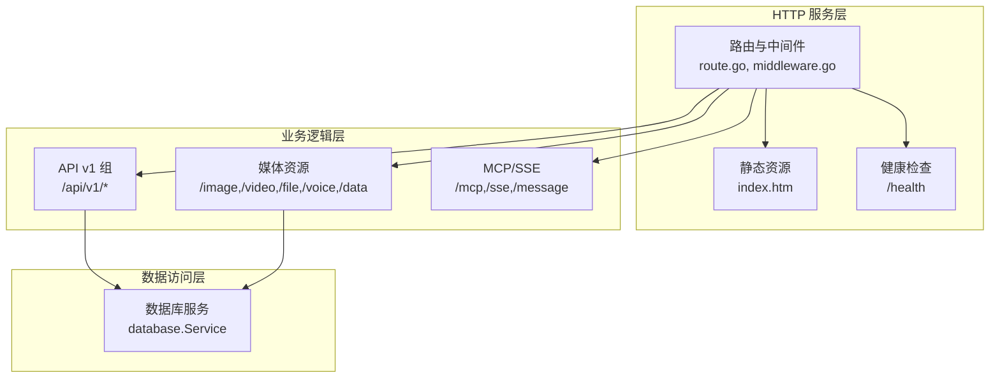
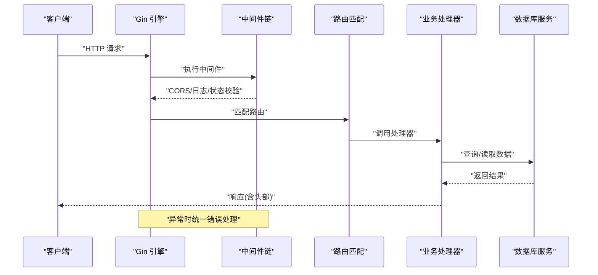
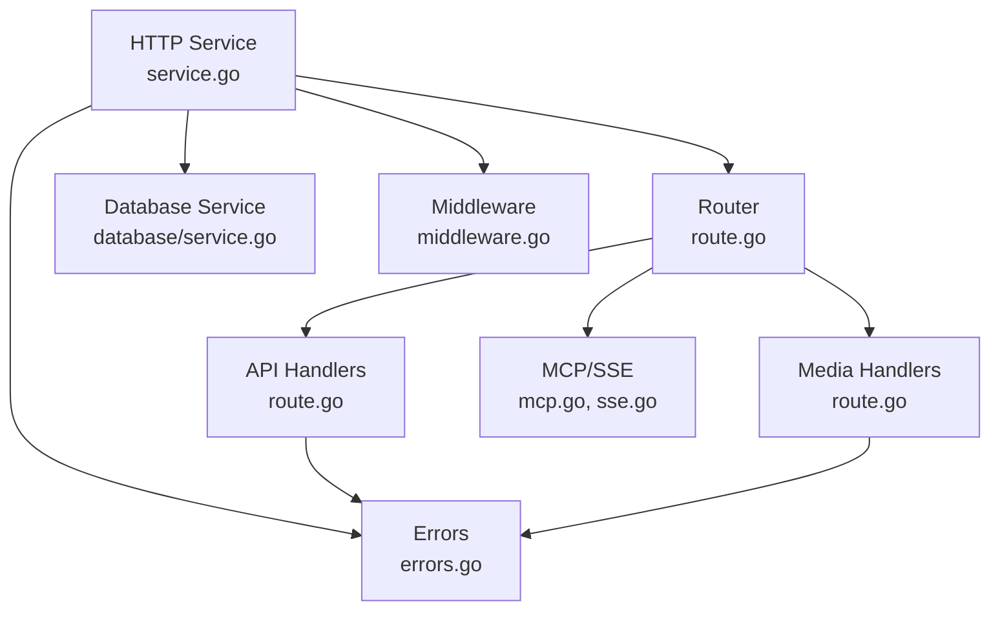

# HTTP API 服务

<cite>
**本文档引用的文件**
- [route.go](file://internal/chatlog/http/route.go)
- [service.go](file://internal/chatlog/http/service.go)
- [middleware.go](file://internal/chatlog/http/middleware.go)
- [index.htm](file://internal/chatlog/http/static/index.htm)
- [cmd_server.go](file://cmd/chatlog/cmd_server.go)
- [app.go](file://internal/chatlog/app.go)
- [errors.go](file://internal/errors/errors.go)
- [http_errors.go](file://internal/errors/http_errors.go)
- [service.go](file://internal/chatlog/database/service.go)
- [message.go](file://internal/model/message.go)
- [conf.go](file://internal/chatlog/conf/conf.go)
- [sse.go](file://internal/mcp/sse.go)
- [mcp.go](file://internal/mcp/mcp.go)
</cite>

## 目录
1. [简介](#简介)
2. [项目结构](#项目结构)
3. [核心组件](#核心组件)
4. [架构总览](#架构总览)
5. [详细组件分析](#详细组件分析)
6. [依赖关系分析](#依赖关系分析)
7. [性能考虑](#性能考虑)
8. [故障排除指南](#故障排除指南)
9. [结论](#结论)
10. [附录](#附录)

## 简介
本文件为 HTTP API 服务的综合技术文档，覆盖 RESTful API 设计与实现、中间件机制、CORS 配置、安全头设置、访问控制、静态资源服务、健康检查端点、API 版本管理、错误处理、认证与访问控制、媒体资源服务、MCP/SSE 集成等。文档同时提供 API 使用指南、参数说明、响应示例与集成建议，帮助开发者快速上手并稳定集成。

## 项目结构
HTTP API 服务基于 Gin 框架构建，采用分层组织：
- 路由层：集中定义路由与静态资源映射
- 中间件层：统一处理 CORS、数据库状态校验、错误恢复与日志
- 业务层：各 API 端点的具体实现
- 数据访问层：通过数据库服务封装底层查询
- 静态资源层：内嵌前端页面与样式
- MCP/SSE 层：提供 MCP 协议与 SSE 事件流能力

图表来源
- [route.go](file://internal/chatlog/http/route.go#L26-L75)
- [service.go](file://internal/chatlog/http/service.go#L33-L59)
- [service.go](file://internal/chatlog/database/service.go#L90-L109)

章节来源
- [route.go](file://internal/chatlog/http/route.go#L26-L75)
- [service.go](file://internal/chatlog/http/service.go#L33-L59)

## 核心组件
- HTTP 服务初始化与中间件注册
  - 初始化 Gin 引擎，设置可信代理
  - 注册中间件：恢复、错误处理、日志、CORS
  - 启动 HTTP 服务器，支持优雅关闭
- 路由初始化
  - 基础路由：静态资源、根路径、健康检查、404 处理
  - API v1 路由组：受数据库状态中间件保护
  - 媒体路由：统一处理图片/视频/文件/语音与原始数据访问
  - MCP/SSE 路由：提供 MCP 协议与 SSE 事件流
- 错误处理与状态码
  - 统一错误包装与 JSON 响应
  - 数据库状态中间件拦截未就绪/解密中/错误状态
- 静态资源与前端调试页
  - 内嵌前端页面，提供 API 调试与示例

章节来源
- [service.go](file://internal/chatlog/http/service.go#L33-L108)
- [route.go](file://internal/chatlog/http/route.go#L26-L75)
- [middleware.go](file://internal/chatlog/http/middleware.go#L10-L45)
- [errors.go](file://internal/errors/errors.go#L56-L120)

## 架构总览
HTTP 服务采用“中间件 + 路由 + 业务处理 + 数据库”的清晰分层，配合内嵌静态资源与前端调试页，形成完整的本地服务体验。

图表来源
- [service.go](file://internal/chatlog/http/service.go#L42-L48)
- [route.go](file://internal/chatlog/http/route.go#L55-L63)
- [middleware.go](file://internal/chatlog/http/middleware.go#L26-L45)

## 详细组件分析

### 路由与端点设计
- 基础路由
  - 静态资源：/static、/favicon.ico、根路径
  - 健康检查：/health 返回 {"status":"ok"}
  - 404 处理：对 /api 与 /static 前缀返回 JSON 错误；其他重定向至根路径
- API v1 路由组（受数据库状态中间件保护）
  - GET /api/v1/chatlog
  - GET /api/v1/contact
  - GET /api/v1/chatroom
  - GET /api/v1/session
- 媒体资源路由
  - GET /image/*key
  - GET /video/*key
  - GET /file/*key
  - GET /voice/*key
  - GET /data/*path
- MCP/SSE 路由
  - ANY /mcp
  - ANY /sse
  - ANY /message

章节来源
- [route.go](file://internal/chatlog/http/route.go#L33-L88)
- [route.go](file://internal/chatlog/http/route.go#L55-L75)

### 中间件机制
- CORS 中间件
  - 允许任意源、凭证、常用方法与头部
  - OPTIONS 预检直接返回 204
- 数据库状态中间件
  - StateInit：503，提示数据库未就绪
  - StateDecrypting：503，提示数据库正在解密
  - StateError：503，携带错误消息
  - 其他：放行
- 错误处理与恢复
  - RecoveryMiddleware：捕获 panic 并返回 500
  - ErrorHandlerMiddleware：统一错误包装与日志
  - 日志中间件：对 /health 路径跳过

章节来源
- [middleware.go](file://internal/chatlog/http/middleware.go#L10-L24)
- [middleware.go](file://internal/chatlog/http/middleware.go#L26-L45)
- [service.go](file://internal/chatlog/http/service.go#L42-L48)
- [errors.go](file://internal/errors/errors.go#L56-L120)

### 静态资源与健康检查
- 静态资源
  - /static：内嵌 static 目录
  - /favicon.ico：内嵌 favicon
  - /：内嵌 index.htm
- 健康检查
  - /health：返回 {"status":"ok"}

章节来源
- [route.go](file://internal/chatlog/http/route.go#L33-L44)
- [index.htm](file://internal/chatlog/http/static/index.htm#L1-L50)

### API v1 端点详解

#### GET /api/v1/chatlog
- 功能：查询指定时间范围内与特定联系人或群聊的聊天记录
- 查询参数
  - time: 必填，时间范围字符串（支持单日或起止范围）
  - talker: 必填，聊天对象标识（wxid、群ID、备注名或昵称）
  - sender: 可选，指定消息发送者
  - keyword: 可选，搜索消息内容中的关键词
  - limit: 可选，返回数量（负数视为 0）
  - offset: 可选，偏移量（负数视为 0）
  - format: 可选，输出格式
    - json：返回 JSON 数组
    - csv：返回 CSV 文件（浏览器下载）
    - 默认：纯文本逐条输出
- 响应
  - 成功：根据 format 返回相应格式
  - 失败：错误包装 JSON
- 示例
  - curl -s "http://localhost:8080/api/v1/chatlog?time=2023-01-01&talker=wxid123&format=json"

章节来源
- [route.go](file://internal/chatlog/http/route.go#L90-L156)
- [message.go](file://internal/model/message.go#L108-L126)

#### GET /api/v1/contact
- 功能：查询联系人列表
- 查询参数
  - keyword: 可选，关键词
  - limit: 可选
  - offset: 可选
  - format: 可选
    - json：返回 JSON
    - 默认：CSV 或纯文本
- 响应
  - 成功：根据 format 返回相应格式
  - 失败：错误包装 JSON

章节来源
- [route.go](file://internal/chatlog/http/route.go#L158-L201)

#### GET /api/v1/chatroom
- 功能：查询群聊列表
- 查询参数
  - keyword: 可选，关键词
  - limit: 可选
  - offset: 可选
  - format: 可选
    - json：返回 JSON
    - 默认：CSV 或纯文本
- 响应
  - 成功：根据 format 返回相应格式
  - 失败：错误包装 JSON

章节来源
- [route.go](file://internal/chatlog/http/route.go#L203-L245)

#### GET /api/v1/session
- 功能：查询最近会话列表
- 查询参数
  - keyword: 可选，关键词
  - limit: 可选
  - offset: 可选
  - format: 可选
    - json：返回 JSON
    - csv：返回 CSV
    - 默认：纯文本
- 响应
  - 成功：根据 format 返回相应格式
  - 失败：错误包装 JSON

章节来源
- [route.go](file://internal/chatlog/http/route.go#L247-L293)

### 媒体资源服务

#### GET /image/*key, /video/*key, /file/*key, /voice/*key
- 功能：根据 key 解析并返回媒体资源
- 参数
  - key：支持逗号分隔的多个 key；若包含 "/" 则尝试绝对路径解析
- 行为
  - 若带 info 查询参数：返回媒体元信息 JSON
  - voice 类型：转换为 MP3 输出
  - 其他类型：重定向到 /data/<path> 或直接返回文件
- 路径查找策略
  - 绝对路径存在则直接返回
  - 图片：尝试 _h.dat、.dat、_t.dat
  - 视频：尝试 .mp4、_thumb.jpg
- 响应
  - 成功：根据类型返回文件或 JSON
  - 失败：错误包装 JSON

章节来源
- [route.go](file://internal/chatlog/http/route.go#L295-L384)
- [route.go](file://internal/chatlog/http/route.go#L341-L361)
- [route.go](file://internal/chatlog/http/route.go#L416-L423)

#### GET /data/*path
- 功能：直接访问数据目录下的文件
- 行为
  - .dat 文件：尝试转换为图像后返回
  - 其他：直接返回文件
- 响应
  - 成功：文件内容
  - 失败：404 JSON

章节来源
- [route.go](file://internal/chatlog/http/route.go#L363-L384)
- [route.go](file://internal/chatlog/http/route.go#L386-L414)

### MCP/SSE 集成
- /mcp：MCP 协议入口
- /sse：SSE 事件流入口
- /message：MCP 消息处理入口
- SSE 写入器
  - 设置 Content-Type、Cache-Control、Connection、CORS
  - 定期发送 ping 事件保持连接
- 会话管理
  - 生成 session id
  - 处理消息队列与并发控制

章节来源
- [route.go](file://internal/chatlog/http/route.go#L65-L75)
- [sse.go](file://internal/mcp/sse.go#L16-L64)
- [mcp.go](file://internal/mcp/mcp.go#L31-L98)

### 错误处理与状态码
- 统一错误包装
  - 错误结构包含 message、code、stack
  - 支持 Wrap 与 Newf
- HTTP 状态码
  - 数据库未就绪/解密中/错误：503
  - 参数无效：400
  - 其他错误：500
- 404 处理
  - 对 /api 与 /static 前缀返回 JSON 错误
  - 其他路径重定向至根路径

章节来源
- [errors.go](file://internal/errors/errors.go#L56-L120)
- [http_errors.go](file://internal/errors/http_errors.go#L5-L11)
- [middleware.go](file://internal/chatlog/http/middleware.go#L28-L41)
- [route.go](file://internal/chatlog/http/route.go#L77-L88)

### 启动与配置
- 命令行参数
  - --addr/-a：HTTP 服务地址
  - --data-dir/-d：数据目录
  - --data-key/-k：数据密钥
  - --img-key/-i：图片密钥
  - --work-dir/-w：工作目录
  - --platform/-p：平台
  - --version/-v：版本
  - --auto-decrypt：自动解密
- 服务启动流程
  - 通过命令行配置构建服务配置
  - 启动 HTTP 服务与 MCP/SSE 服务
  - 提供 UI 菜单控制服务启停

章节来源
- [cmd_server.go](file://cmd/chatlog/cmd_server.go#L10-L79)
- [app.go](file://internal/chatlog/app.go#L279-L350)
- [conf.go](file://internal/chatlog/conf/conf.go#L47-L96)

## 依赖关系分析

图表来源
- [service.go](file://internal/chatlog/http/service.go#L33-L59)
- [route.go](file://internal/chatlog/http/route.go#L26-L75)
- [service.go](file://internal/chatlog/database/service.go#L38-L105)
- [middleware.go](file://internal/chatlog/http/middleware.go#L10-L45)
- [errors.go](file://internal/errors/errors.go#L56-L120)
- [mcp.go](file://internal/mcp/mcp.go#L17-L51)
- [sse.go](file://internal/mcp/sse.go#L16-L35)

## 性能考虑
- 中间件顺序
  - Recovery 与 ErrorHandler 应置于前，确保异常被正确捕获与格式化
  - Logger 对 /health 路径跳过，减少日志开销
- 媒体资源
  - voice 转换为 MP3 后输出，避免客户端额外转换
  - .dat 文件优先尝试转换，失败回退为原文件
- SSE 连接
  - 定期 ping 保持连接活跃，避免代理中断
- 数据库状态
  - 通过中间件在请求早期拦截，避免无效查询

## 故障排除指南
- 503 数据库未就绪/解密中
  - 等待数据库初始化或解密完成后再发起请求
- 400 参数无效
  - 检查 time 与 talker 等必填参数是否符合格式要求
- 404 资源不存在
  - 确认媒体 key 或路径正确；对于 /data/*path，检查绝对路径是否存在
- CORS 问题
  - 服务端允许任意源，如遇浏览器限制，检查客户端跨域配置
- 服务无法启动
  - 检查 --addr 参数与端口占用；查看日志输出

章节来源
- [middleware.go](file://internal/chatlog/http/middleware.go#L28-L41)
- [http_errors.go](file://internal/errors/http_errors.go#L5-L11)
- [route.go](file://internal/chatlog/http/route.go#L363-L384)

## 结论
该 HTTP API 服务以清晰的分层架构、完善的中间件体系与统一的错误处理机制，提供了稳定的 RESTful 接口与丰富的媒体资源服务能力，并集成了 MCP/SSE，便于与 AI 助手进行实时交互。通过内嵌前端调试页与明确的参数规范，开发者可以快速完成集成与测试。

## 附录

### API 使用指南与示例
- 启动服务
  - 使用命令行参数配置地址与密钥后启动
- 健康检查
  - GET /health
- 查询聊天记录
  - GET /api/v1/chatlog?time=YYYY-MM-DD&talker=wxid123&format=json
- 下载联系人 CSV
  - GET /api/v1/contact?format=csv
- 获取群聊列表
  - GET /api/v1/chatroom?keyword=群名&format=json
- 最近会话
  - GET /api/v1/session?format=text
- 媒体资源
  - GET /image/abc.dat
  - GET /voice/123
  - GET /data/avatar.jpg

章节来源
- [cmd_server.go](file://cmd/chatlog/cmd_server.go#L35-L79)
- [route.go](file://internal/chatlog/http/route.go#L40-L42)
- [route.go](file://internal/chatlog/http/route.go#L58-L62)
- [route.go](file://internal/chatlog/http/route.go#L48-L52)
- [route.go](file://internal/chatlog/http/route.go#L295-L339)