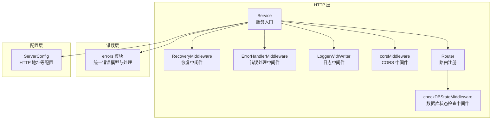
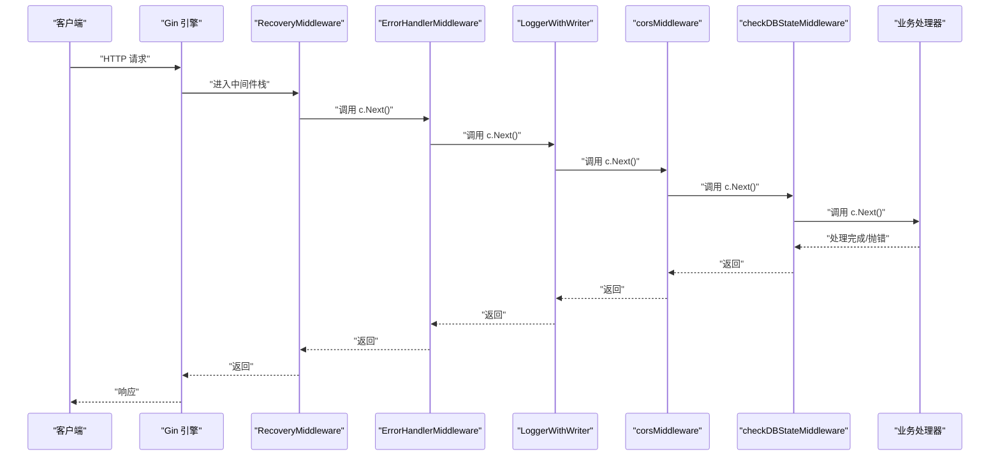
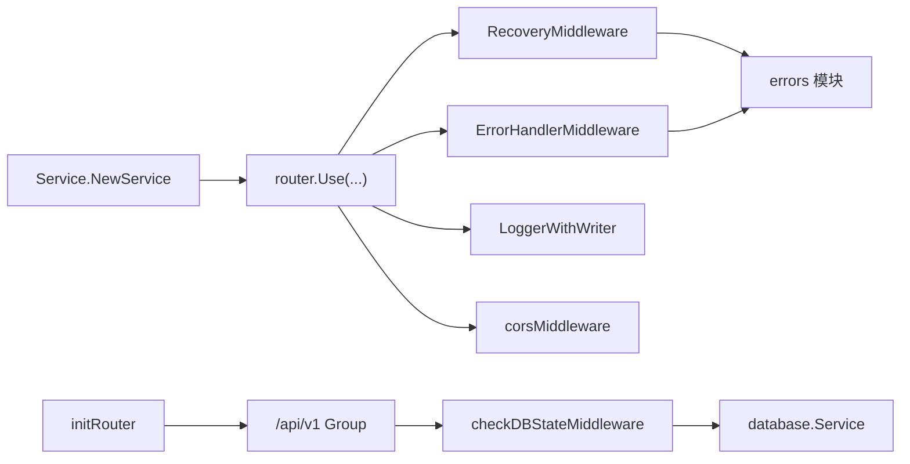

# 中间件配置

<cite>
**本文引用的文件**
- [internal/chatlog/http/middleware.go](file://internal/chatlog/http/middleware.go)
- [internal/chatlog/http/service.go](file://internal/chatlog/http/service.go)
- [internal/chatlog/http/route.go](file://internal/chatlog/http/route.go)
- [internal/errors/middleware.go](file://internal/errors/middleware.go)
- [internal/errors/errors.go](file://internal/errors/errors.go)
- [internal/chatlog/database/service.go](file://internal/chatlog/database/service.go)
- [internal/chatlog/conf/server.go](file://internal/chatlog/conf/server.go)
- [cmd/chatlog/cmd_server.go](file://cmd/chatlog/cmd_server.go)
- [cmd/chatlog/log.go](file://cmd/chatlog/log.go)
</cite>

## 目录
1. [简介](#简介)
2. [项目结构](#项目结构)
3. [核心组件](#核心组件)
4. [架构总览](#架构总览)
5. [详细组件分析](#详细组件分析)
6. [依赖关系分析](#依赖关系分析)
7. [性能考量](#性能考量)
8. [故障排查指南](#故障排查指南)
9. [结论](#结论)
10. [附录](#附录)

## 简介
本文件系统性梳理 HTTP 服务器的中间件配置，重点覆盖以下方面：
- 中间件栈的组成与执行顺序
- CORS 中间件的功能、配置与扩展
- 错误处理中间件与恢复中间件的工作机制
- 日志中间件与请求链路追踪
- 数据库状态检查中间件
- 统一错误响应格式与异常捕获策略
- 中间件自定义与扩展指南

## 项目结构
HTTP 服务器位于 internal/chatlog/http 包内，核心由服务初始化、路由注册、中间件装配与数据库状态检查构成；错误处理与恢复逻辑集中在 internal/errors 包中；配置来源于 internal/chatlog/conf。

图表来源
- [internal/chatlog/http/service.go](file://internal/chatlog/http/service.go#L33-L59)
- [internal/chatlog/http/middleware.go](file://internal/chatlog/http/middleware.go#L10-L24)
- [internal/errors/middleware.go](file://internal/errors/middleware.go#L14-L64)
- [internal/chatlog/database/service.go](file://internal/chatlog/database/service.go#L15-L29)
- [internal/chatlog/conf/server.go](file://internal/chatlog/conf/server.go#L7-L19)

章节来源
- [internal/chatlog/http/service.go](file://internal/chatlog/http/service.go#L33-L59)
- [internal/chatlog/http/route.go](file://internal/chatlog/http/route.go#L26-L31)

## 核心组件
- 服务初始化与中间件装配：在服务构造函数中完成 Gin 引擎创建、信任代理设置、中间件注册与路由初始化。
- CORS 中间件：统一设置跨域头，处理预检请求。
- 错误处理中间件：为每个请求生成唯一请求 ID，收集并转换错误为统一响应。
- 恢复中间件：捕获 panic 并返回 500 错误，同时记录堆栈。
- 日志中间件：基于 zerolog 输出请求日志，健康检查路径除外。
- 数据库状态检查中间件：在 API 分组上启用，确保数据库处于就绪状态。
- 统一错误模型：定义错误结构体与辅助函数，支持错误码提取与根因定位。

章节来源
- [internal/chatlog/http/service.go](file://internal/chatlog/http/service.go#L33-L59)
- [internal/chatlog/http/middleware.go](file://internal/chatlog/http/middleware.go#L10-L45)
- [internal/errors/middleware.go](file://internal/errors/middleware.go#L14-L64)
- [internal/errors/errors.go](file://internal/errors/errors.go#L13-L125)
- [internal/chatlog/database/service.go](file://internal/chatlog/database/service.go#L15-L29)

## 架构总览
下图展示中间件在请求生命周期中的调用顺序与职责分工。

图表来源
- [internal/chatlog/http/service.go](file://internal/chatlog/http/service.go#L42-L48)
- [internal/errors/middleware.go](file://internal/errors/middleware.go#L14-L36)
- [internal/chatlog/http/middleware.go](file://internal/chatlog/http/middleware.go#L10-L24)
- [internal/chatlog/http/route.go](file://internal/chatlog/http/route.go#L55-L63)

## 详细组件分析

### CORS 中间件
- 功能概述
  - 设置 Access-Control-Allow-Origin、Access-Control-Allow-Credentials、Access-Control-Allow-Methods、Access-Control-Allow-Headers。
  - 对 OPTIONS 预检请求直接返回 204，避免后续处理。
  - 仅对非预检请求放行至下游中间件与处理器。
- 执行顺序
  - 在错误处理与日志中间件之后，业务处理器之前。
- 配置要点
  - 允许来源：通配符（生产环境建议改为具体域名）。
  - 允许方法：GET、POST、PUT、DELETE、OPTIONS。
  - 允许头部：Accept、Authorization、Content-Type、X-CSRF-Token。
- 自定义与扩展
  - 若需动态来源校验，可在中间件中增加白名单校验逻辑。
  - 若需支持凭证场景，确保前端携带正确的凭据策略并与后端一致。

章节来源
- [internal/chatlog/http/middleware.go](file://internal/chatlog/http/middleware.go#L10-L24)

### 错误处理中间件
- 功能概述
  - 为每个请求生成唯一请求 ID，并写入响应头与上下文。
  - 在 c.Next() 后检查是否存在错误集合，若有则调用统一错误处理函数并终止请求。
- 错误响应格式
  - 若为应用自定义错误类型，返回其内部错误码与消息。
  - 否则返回 500 与错误字符串。
- 与恢复中间件的关系
  - 错误处理中间件负责“发现并转换”错误；恢复中间件负责“捕获 panic”。
- 自定义与扩展
  - 可在业务处理器中向 c.Errors 追加错误，以被该中间件识别。
  - 可结合请求 ID 进行日志关联与问题定位。

章节来源
- [internal/errors/middleware.go](file://internal/errors/middleware.go#L14-L36)
- [internal/errors/errors.go](file://internal/errors/errors.go#L113-L125)

### 恢复中间件
- 功能概述
  - 使用 defer 捕获 panic，构造统一错误对象，记录堆栈日志，并返回 500 响应。
- 异常捕获
  - 支持 error 与任意类型两种 panic 内容，统一映射为内部错误。
- 自定义与扩展
  - 可根据需要调整日志级别或输出格式。
  - 可在生产环境屏蔽堆栈详情，仅记录摘要。

章节来源
- [internal/errors/middleware.go](file://internal/errors/middleware.go#L39-L64)

### 日志中间件
- 功能概述
  - 基于 zerolog 输出请求日志，针对 /health 路径进行豁免，避免噪声。
  - 与全局日志级别与输出设备联动（控制台或文件）。
- 配置要点
  - 日志级别可通过命令行开关调整。
  - 控制台输出与 TUI 日志输出分离，便于不同运行模式下的日志管理。

章节来源
- [internal/chatlog/http/service.go](file://internal/chatlog/http/service.go#L46-L46)
- [cmd/chatlog/log.go](file://cmd/chatlog/log.go#L19-L45)

### 数据库状态检查中间件
- 功能概述
  - 在 API 分组上启用，拦截数据库未就绪、解密中或错误状态的请求，返回 503 与相应提示。
- 生效范围
  - 仅对 /api/v1 分组生效，静态资源与媒体接口不受影响。
- 状态枚举
  - 初始化、解密中、就绪、错误。

章节来源
- [internal/chatlog/http/middleware.go](file://internal/chatlog/http/middleware.go#L26-L45)
- [internal/chatlog/http/route.go](file://internal/chatlog/http/route.go#L55-L63)
- [internal/chatlog/database/service.go](file://internal/chatlog/database/service.go#L15-L29)

### 统一错误模型
- 结构与能力
  - 包含消息、原始错误、HTTP 码、堆栈等字段。
  - 提供 New/Newf/Wrap/GetCode/RootCause 等辅助函数。
  - 支持错误包装与根因提取。
- 与中间件协作
  - 错误处理中间件通过 Err 函数将错误转换为 JSON 响应。
  - 恢复中间件将 panic 转换为统一错误对象。

章节来源
- [internal/errors/errors.go](file://internal/errors/errors.go#L13-L125)

## 依赖关系分析
- 中间件依赖
  - Service 在初始化时注册中间件，形成稳定的执行顺序。
  - CORS 与数据库状态检查中间件分别作用于全局与特定分组。
- 错误处理链
  - 恢复中间件负责兜底，错误处理中间件负责统一格式化与响应。
- 配置与运行
  - HTTP 地址来自配置结构体，命令行参数可覆盖默认值。
  - 日志初始化在命令执行前完成，影响中间件日志输出行为。

图表来源
- [internal/chatlog/http/service.go](file://internal/chatlog/http/service.go#L42-L48)
- [internal/chatlog/http/route.go](file://internal/chatlog/http/route.go#L55-L63)
- [internal/chatlog/database/service.go](file://internal/chatlog/database/service.go#L15-L29)

章节来源
- [internal/chatlog/http/service.go](file://internal/chatlog/http/service.go#L33-L59)
- [internal/chatlog/http/route.go](file://internal/chatlog/http/route.go#L26-L31)

## 性能考量
- 中间件顺序
  - 将快速失败的中间件（如 CORS、数据库状态检查）置于靠前位置，减少无效处理开销。
- 日志成本
  - 日志中间件对吞吐有一定影响，建议在高并发场景下调低日志级别或优化输出设备。
- 错误处理
  - 统一错误模型与中间件配合，避免重复封装与格式化逻辑，降低响应时间波动。
- 数据库状态
  - 在 API 分组上启用状态检查，可提前阻断无效请求，避免数据库压力。

## 故障排查指南
- 常见问题与定位
  - 503 数据库不可用：检查数据库状态机是否处于初始化、解密中或错误状态。
  - 404 非 API 路由：NoRoute 逻辑区分 /api 与 /static，其他路径重定向至根。
  - 500 服务器错误：检查恢复中间件日志中的堆栈信息。
  - CORS 失败：确认来源、方法与头部配置是否匹配前端请求。
- 关键日志与指标
  - 请求 ID：通过响应头 X-Request-ID 与日志上下文关联，便于问题回溯。
  - 健康检查：/health 路径不受日志中间件影响，便于独立观测。
- 配置核对
  - HTTP 地址与平台版本、数据目录等配置是否正确加载。

章节来源
- [internal/chatlog/http/route.go](file://internal/chatlog/http/route.go#L77-L88)
- [internal/errors/middleware.go](file://internal/errors/middleware.go#L14-L36)
- [internal/chatlog/conf/server.go](file://internal/chatlog/conf/server.go#L51-L56)
- [cmd/chatlog/cmd_server.go](file://cmd/chatlog/cmd_server.go#L51-L78)

## 结论
本项目的中间件栈以“恢复兜底 + 统一错误 + 日志记录 + CORS + 数据库状态检查”的组合实现，既保证了稳定性与可观测性，又提供了清晰的错误反馈与跨域支持。通过在 API 分组上启用数据库状态检查，有效避免了无效请求对数据库造成压力。建议在生产环境中进一步细化 CORS 来源与头部策略，并结合请求 ID 与日志系统建立完善的监控与告警体系。

## 附录

### CORS 配置示例与最佳实践
- 允许的来源
  - 开发环境：通配符（*）
  - 生产环境：明确指定可信域名，避免通配符带来的安全风险
- 允许的方法
  - GET、POST、PUT、DELETE、OPTIONS
- 允许的头部
  - Accept、Authorization、Content-Type、X-CSRF-Token
- 预检请求处理
  - OPTIONS 请求直接返回 204，避免额外处理

章节来源
- [internal/chatlog/http/middleware.go](file://internal/chatlog/http/middleware.go#L10-L24)

### 错误处理机制与响应格式
- 统一错误模型
  - 字段：消息、原始错误、HTTP 码、堆栈
  - 辅助：New/Newf/Wrap/GetCode/RootCause
- 响应格式
  - 应用自定义错误：返回其内部错误码与消息
  - 其他错误：返回 500 与错误字符串
- 请求 ID
  - 每个请求生成唯一 ID，写入响应头与上下文，便于日志关联

章节来源
- [internal/errors/errors.go](file://internal/errors/errors.go#L13-L125)
- [internal/errors/middleware.go](file://internal/errors/middleware.go#L14-L36)

### 中间件自定义与扩展指南
- 新增中间件
  - 在 Service.NewService 中通过 router.Use 注册，注意执行顺序与职责边界
- 修改 CORS
  - 在 corsMiddleware 中调整允许来源、方法与头部
- 数据库状态检查
  - 可在 checkDBStateMiddleware 中扩展更多状态分支或提示信息
- 错误处理
  - 在业务处理器中向 c.Errors 追加错误，交由 ErrorHandlerMiddleware 统一处理
- 日志
  - 可通过全局日志初始化调整输出目标与级别

章节来源
- [internal/chatlog/http/service.go](file://internal/chatlog/http/service.go#L42-L48)
- [internal/chatlog/http/middleware.go](file://internal/chatlog/http/middleware.go#L26-L45)
- [internal/errors/middleware.go](file://internal/errors/middleware.go#L14-L36)