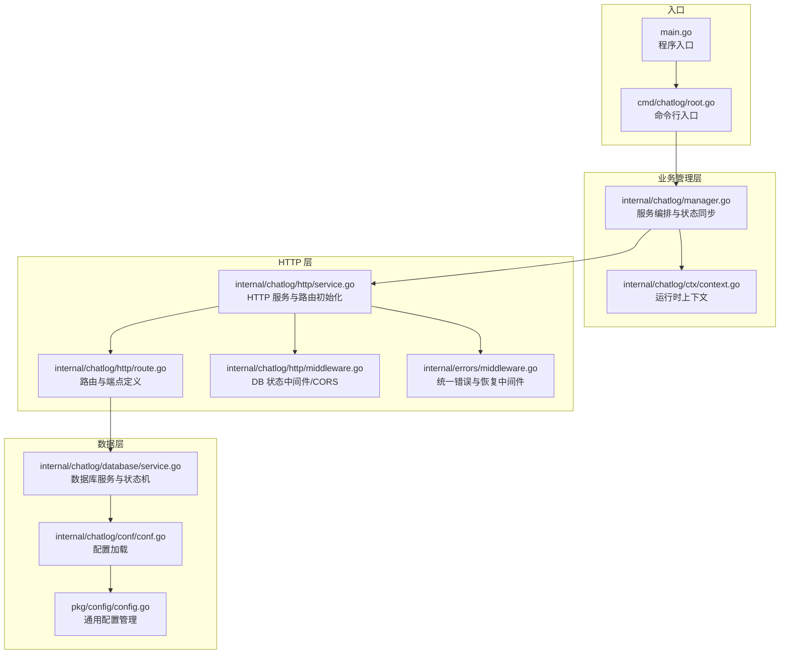
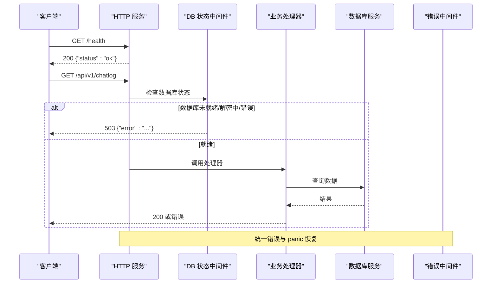
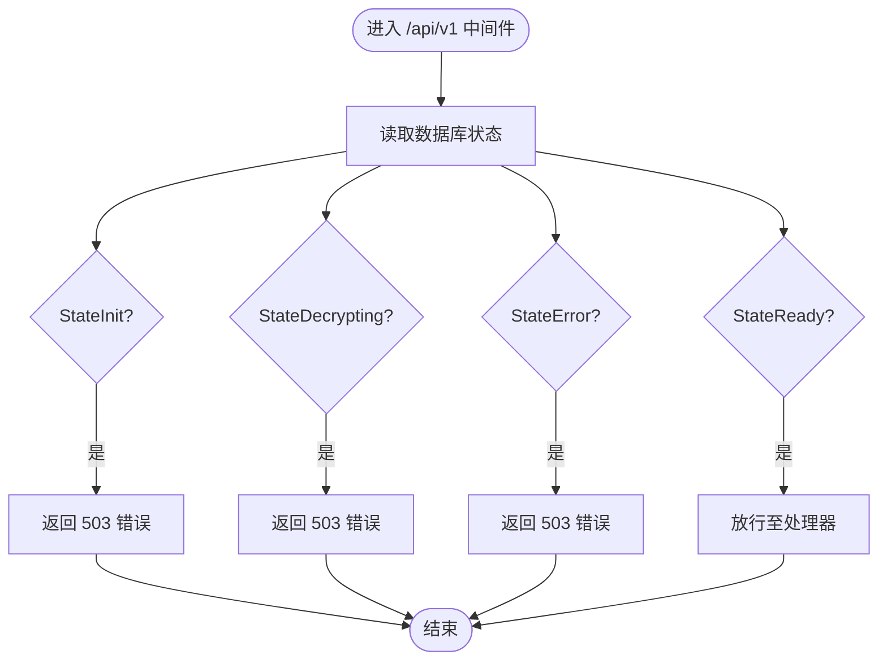
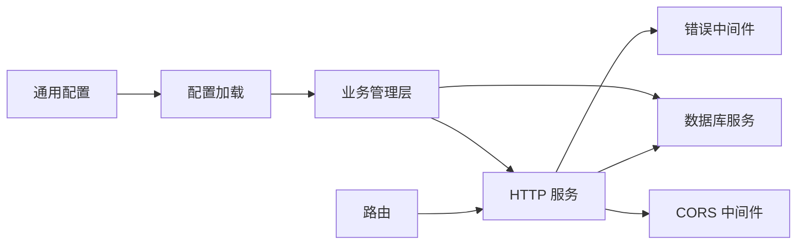

# 健康检查与监控

<cite>
**本文档引用的文件**
- [internal/chatlog/http/route.go](file://internal/chatlog/http/route.go)
- [internal/chatlog/http/service.go](file://internal/chatlog/http/service.go)
- [internal/chatlog/http/middleware.go](file://internal/chatlog/http/middleware.go)
- [internal/chatlog/database/service.go](file://internal/chatlog/database/service.go)
- [internal/chatlog/manager.go](file://internal/chatlog/manager.go)
- [internal/chatlog/ctx/context.go](file://internal/chatlog/ctx/context.go)
- [internal/errors/middleware.go](file://internal/errors/middleware.go)
- [internal/errors/errors.go](file://internal/errors/errors.go)
- [internal/chatlog/conf/conf.go](file://internal/chatlog/conf/conf.go)
- [pkg/config/config.go](file://pkg/config/config.go)
- [cmd/chatlog/root.go](file://cmd/chatlog/root.go)
- [main.go](file://main.go)
</cite>

## 目录
1. [简介](#简介)
2. [项目结构](#项目结构)
3. [核心组件](#核心组件)
4. [架构总览](#架构总览)
5. [详细组件分析](#详细组件分析)
6. [依赖关系分析](#依赖关系分析)
7. [性能考虑](#性能考虑)
8. [故障排查指南](#故障排查指南)
9. [结论](#结论)
10. [附录](#附录)

## 简介
本文件聚焦于系统的健康检查与监控能力，涵盖以下内容：
- 健康检查端点的实现与使用：服务状态检查、数据库连接状态检查、外部依赖检查（通过中间件与状态机）。
- 监控指标收集与性能统计：基于现有中间件与日志框架的可观测性能力。
- 告警机制：结合错误中间件与状态码返回，为外部监控系统提供可消费的信号。
- 健康检查 API 调用示例与响应格式：提供标准 HTTP 接口与响应约定。
- 第三方监控工具集成建议：Prometheus/Grafana、APM 等。
- 自定义监控指标扩展：状态机、错误计数、请求耗时等。
- 故障检测与自动恢复策略：基于状态机与中间件的保护与降级。

## 项目结构
系统采用分层架构，HTTP 层负责路由与中间件，数据库层负责数据访问与状态管理，业务管理层协调服务生命周期与状态同步。

**图表来源**
- [main.go](file://main.go#L1-L12)
- [cmd/chatlog/root.go](file://cmd/chatlog/root.go#L1-L43)
- [internal/chatlog/manager.go](file://internal/chatlog/manager.go#L1-L408)
- [internal/chatlog/http/service.go](file://internal/chatlog/http/service.go#L1-L113)
- [internal/chatlog/http/route.go](file://internal/chatlog/http/route.go#L1-L424)
- [internal/chatlog/http/middleware.go](file://internal/chatlog/http/middleware.go#L1-L46)
- [internal/errors/middleware.go](file://internal/errors/middleware.go#L1-L65)
- [internal/chatlog/database/service.go](file://internal/chatlog/database/service.go#L1-L137)
- [internal/chatlog/conf/conf.go](file://internal/chatlog/conf/conf.go#L1-L106)
- [pkg/config/config.go](file://pkg/config/config.go#L1-L160)

**章节来源**
- [main.go](file://main.go#L1-L12)
- [cmd/chatlog/root.go](file://cmd/chatlog/root.go#L1-L43)
- [internal/chatlog/manager.go](file://internal/chatlog/manager.go#L1-L408)
- [internal/chatlog/http/service.go](file://internal/chatlog/http/service.go#L1-L113)
- [internal/chatlog/http/route.go](file://internal/chatlog/http/route.go#L1-L424)
- [internal/chatlog/http/middleware.go](file://internal/chatlog/http/middleware.go#L1-L46)
- [internal/errors/middleware.go](file://internal/errors/middleware.go#L1-L65)
- [internal/chatlog/database/service.go](file://internal/chatlog/database/service.go#L1-L137)
- [internal/chatlog/conf/conf.go](file://internal/chatlog/conf/conf.go#L1-L106)
- [pkg/config/config.go](file://pkg/config/config.go#L1-L160)

## 核心组件
- 健康检查端点
  - 路由定义位于 HTTP 层，提供基础健康检查接口。
- 数据库状态中间件
  - 通过数据库服务的状态机拦截 API 请求，确保仅在就绪状态下允许访问。
- 统一错误与恢复中间件
  - 提供请求 ID、错误包装、panic 恢复与统一错误响应。
- 运行时上下文与配置
  - 维护 HTTP 地址、数据库状态、自动解密等运行时信息。
- 服务编排
  - 管理数据库与 HTTP 服务的启动/停止顺序与状态同步。

**章节来源**
- [internal/chatlog/http/route.go](file://internal/chatlog/http/route.go#L40-L42)
- [internal/chatlog/http/middleware.go](file://internal/chatlog/http/middleware.go#L26-L45)
- [internal/errors/middleware.go](file://internal/errors/middleware.go#L14-L64)
- [internal/chatlog/database/service.go](file://internal/chatlog/database/service.go#L15-L84)
- [internal/chatlog/ctx/context.go](file://internal/chatlog/ctx/context.go#L17-L60)
- [internal/chatlog/manager.go](file://internal/chatlog/manager.go#L98-L151)

## 架构总览
系统通过 HTTP 服务暴露健康检查端点，并在 API 路由上挂载数据库状态中间件进行前置校验。统一错误中间件保证异常场景下的稳定输出。数据库服务维护状态机，驱动中间件行为与 UI/CLI 的状态展示。

**图表来源**
- [internal/chatlog/http/route.go](file://internal/chatlog/http/route.go#L40-L42)
- [internal/chatlog/http/middleware.go](file://internal/chatlog/http/middleware.go#L26-L45)
- [internal/errors/middleware.go](file://internal/errors/middleware.go#L14-L64)
- [internal/chatlog/database/service.go](file://internal/chatlog/database/service.go#L86-L105)

## 详细组件分析

### 健康检查端点
- 端点定义
  - 路由：/health
  - 方法：GET
  - 响应：200 OK，JSON 对象包含状态键值
- 使用方法
  - 通过 HTTP 客户端访问 /health，若返回 200 且状态为 ok，则服务处于健康状态
- 响应格式
  - 成功：{"status":"ok"}
  - 失败：由统一错误中间件处理，返回带错误信息的 JSON

**章节来源**
- [internal/chatlog/http/route.go](file://internal/chatlog/http/route.go#L40-L42)

### 数据库状态检查与中间件
- 状态机
  - 初始化：StateInit
  - 解密中：StateDecrypting
  - 就绪：StateReady
  - 错误：StateError（携带错误消息）
- 中间件逻辑
  - 拦截 /api/v1/* 路由组
  - 若数据库状态为初始化/解密中/错误，返回 503 并终止请求
  - 否则放行至业务处理器
- 外部依赖检查
  - 通过数据库状态间接反映外部依赖（如数据目录、密钥、工作目录）是否满足要求

**图表来源**
- [internal/chatlog/http/middleware.go](file://internal/chatlog/http/middleware.go#L26-L45)
- [internal/chatlog/database/service.go](file://internal/chatlog/database/service.go#L15-L84)

**章节来源**
- [internal/chatlog/http/middleware.go](file://internal/chatlog/http/middleware.go#L26-L45)
- [internal/chatlog/database/service.go](file://internal/chatlog/database/service.go#L15-L84)

### 统一错误与恢复中间件
- 错误处理中间件
  - 为每个请求生成唯一 Request ID，注入响应头与上下文
  - 捕获并转换错误为统一 JSON 响应
- 恢复中间件
  - 捕获 panic，记录堆栈并返回 500 错误
- 与健康检查的关系
  - 健康检查端点不经过统一错误中间件（直接返回），但其他端点在异常时会通过该中间件输出一致的错误格式

**章节来源**
- [internal/errors/middleware.go](file://internal/errors/middleware.go#L14-L64)
- [internal/errors/errors.go](file://internal/errors/errors.go#L113-L120)

### HTTP 服务与路由初始化
- 服务启动
  - 初始化 Gin 引擎，设置信任代理
  - 注册中间件：恢复、错误处理、日志、CORS
  - 初始化路由：静态资源、/health、API、MCP/SSE
- 优雅停机
  - 提供 Stop 方法，使用超时上下文优雅关闭 HTTP 服务器

**章节来源**
- [internal/chatlog/http/service.go](file://internal/chatlog/http/service.go#L33-L108)
- [internal/chatlog/http/route.go](file://internal/chatlog/http/route.go#L26-L75)

### 服务编排与状态同步
- 启动顺序
  - 先启动数据库服务，再启动 HTTP 服务；失败时回滚并停止数据库
- 停止顺序
  - 先停止 HTTP 服务，再停止数据库服务
- 状态同步
  - 通过上下文维护 HTTP 启停状态、数据库状态、自动解密状态等

**章节来源**
- [internal/chatlog/manager.go](file://internal/chatlog/manager.go#L98-L151)
- [internal/chatlog/ctx/context.go](file://internal/chatlog/ctx/context.go#L188-L248)

### 配置与环境
- 配置加载
  - 支持从配置目录加载 TUI 与服务配置，支持环境变量前缀映射
- 默认 HTTP 地址
  - 若未设置，使用默认地址

**章节来源**
- [internal/chatlog/conf/conf.go](file://internal/chatlog/conf/conf.go#L47-L96)
- [pkg/config/config.go](file://pkg/config/config.go#L48-L93)
- [internal/chatlog/ctx/context.go](file://internal/chatlog/ctx/context.go#L17-L182)

## 依赖关系分析
- 组件耦合
  - HTTP 服务依赖数据库服务的状态机
  - 业务处理器依赖数据库服务提供的查询接口
  - 统一错误中间件被所有路由共享
- 外部依赖
  - Gin 作为 HTTP 框架
  - Viper 作为配置管理
  - Zerolog 作为日志框架

**图表来源**
- [internal/chatlog/http/service.go](file://internal/chatlog/http/service.go#L33-L58)
- [internal/chatlog/http/middleware.go](file://internal/chatlog/http/middleware.go#L10-L24)
- [internal/chatlog/database/service.go](file://internal/chatlog/database/service.go#L38-L54)
- [internal/chatlog/manager.go](file://internal/chatlog/manager.go#L40-L69)
- [internal/chatlog/conf/conf.go](file://internal/chatlog/conf/conf.go#L47-L96)
- [pkg/config/config.go](file://pkg/config/config.go#L48-L93)

**章节来源**
- [internal/chatlog/http/service.go](file://internal/chatlog/http/service.go#L33-L58)
- [internal/chatlog/http/middleware.go](file://internal/chatlog/http/middleware.go#L10-L24)
- [internal/chatlog/database/service.go](file://internal/chatlog/database/service.go#L38-L54)
- [internal/chatlog/manager.go](file://internal/chatlog/manager.go#L40-L69)
- [internal/chatlog/conf/conf.go](file://internal/chatlog/conf/conf.go#L47-L96)
- [pkg/config/config.go](file://pkg/config/config.go#L48-L93)

## 性能考虑
- 日志与中间件开销
  - 统一日志中间件会为每个请求写入日志，建议在生产环境合理设置日志级别
- 中间件链路
  - 错误与恢复中间件在异常时会增加一次错误封装与 JSON 序列化
- 数据库状态检查
  - 中间件仅读取状态字段，开销极低
- 建议
  - 对高频端点可考虑缓存热点数据（需在业务层实现）
  - 使用异步方式处理非关键路径的 IO（如媒体文件）

[本节为通用指导，无需特定文件引用]

## 故障排查指南
- 健康检查返回非 200
  - 检查 HTTP 服务是否正常启动
  - 检查数据库服务状态（初始化/解密中/错误）
- API 返回 503
  - 数据库尚未就绪或处于解密中，等待完成后重试
- API 返回 500
  - 查看请求 ID，定位日志堆栈，确认是否存在 panic 或未捕获异常
- 常见排查步骤
  - 确认配置文件与环境变量正确加载
  - 检查数据目录与密钥是否有效
  - 观察数据库状态变化（初始化 -> 解密中 -> 就绪）

**章节来源**
- [internal/chatlog/http/middleware.go](file://internal/chatlog/http/middleware.go#L26-L45)
- [internal/errors/middleware.go](file://internal/errors/middleware.go#L14-L64)
- [internal/chatlog/database/service.go](file://internal/chatlog/database/service.go#L69-L84)
- [internal/chatlog/conf/conf.go](file://internal/chatlog/conf/conf.go#L47-L96)

## 结论
本系统提供了基础的健康检查端点与数据库状态保护机制，配合统一错误中间件与日志框架，能够满足基本的可观测性需求。对于更完善的监控体系，建议引入第三方监控工具，扩展自定义指标与告警规则，并在业务层补充性能统计与指标上报。

[本节为总结，无需特定文件引用]

## 附录

### 健康检查 API 调用示例与响应格式
- 健康检查
  - 请求：GET /health
  - 成功响应：200 {"status":"ok"}
  - 失败响应：由错误中间件统一处理，包含错误信息
- 数据库状态保护
  - 请求：GET /api/v1/chatlog
  - 503 响应：{"error":"database is not ready"} 或对应状态的错误信息
  - 200 响应：业务数据或相应错误（由处理器决定）

**章节来源**
- [internal/chatlog/http/route.go](file://internal/chatlog/http/route.go#L40-L42)
- [internal/chatlog/http/middleware.go](file://internal/chatlog/http/middleware.go#L26-L45)

### 监控指标与告警建议
- 指标类型
  - 服务可用性：/health 响应状态
  - 数据库状态：StateInit/StateDecrypting/StateReady/StateError
  - 错误计数：按 HTTP 状态码分类（4xx/5xx）
  - 请求耗时：通过日志时间戳计算或接入 APM
- 告警规则
  - /health 连续 N 次返回非 200
  - 数据库长时间处于 StateDecrypting 或 StateError
  - 5xx 错误率超过阈值
- 集成方式
  - Prometheus 抓取 /health 与自定义指标端点
  - Grafana 可视化与告警
  - APM（如 Jaeger/Zipkin）追踪请求链路

[本节为概念性建议，无需特定文件引用]

### 自定义监控指标扩展
- 状态机指标
  - 将数据库状态映射为指标（ready/error/unavailable）
- 错误指标
  - 统计各路由的错误分布与错误码占比
- 性能指标
  - 记录关键处理器的耗时直方图
- 实现要点
  - 在处理器前后埋点，聚合到指标系统
  - 保持指标命名规范与标签一致性

[本节为概念性建议，无需特定文件引用]

### 故障检测与自动恢复策略
- 故障检测
  - 健康检查端点与数据库状态中间件共同构成第一道防线
  - 错误中间件捕获异常并输出统一错误
- 自动恢复
  - 重启数据库服务后自动回到就绪状态
  - HTTP 服务优雅停机与重启，避免请求中断
- 建议
  - 在业务层增加重试与熔断策略
  - 对外部依赖（数据目录/密钥）增加校验与告警

**章节来源**
- [internal/chatlog/http/middleware.go](file://internal/chatlog/http/middleware.go#L26-L45)
- [internal/errors/middleware.go](file://internal/errors/middleware.go#L14-L64)
- [internal/chatlog/manager.go](file://internal/chatlog/manager.go#L133-L151)