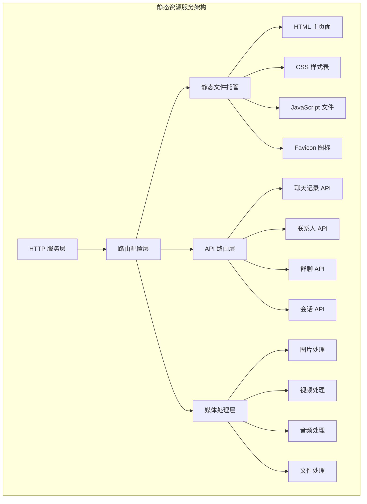
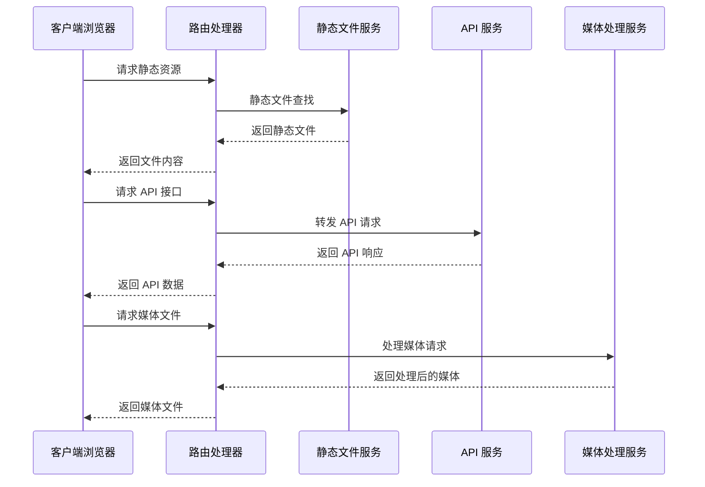
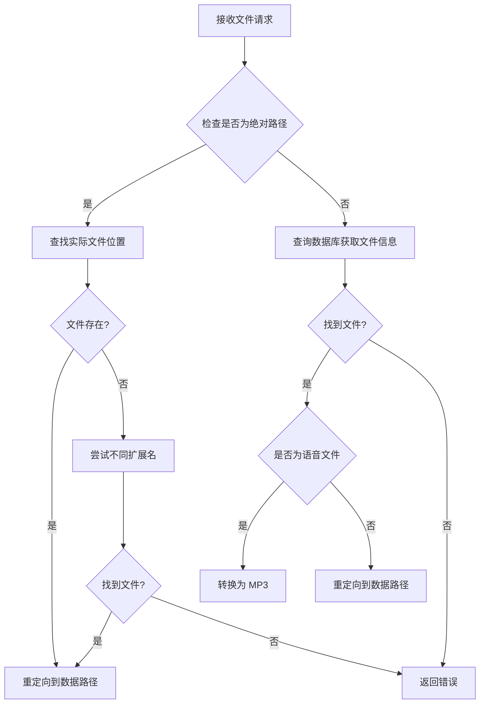
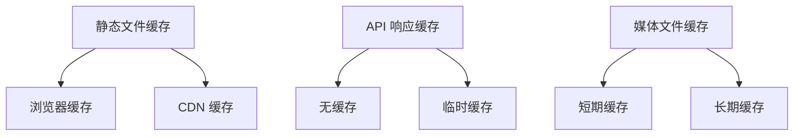
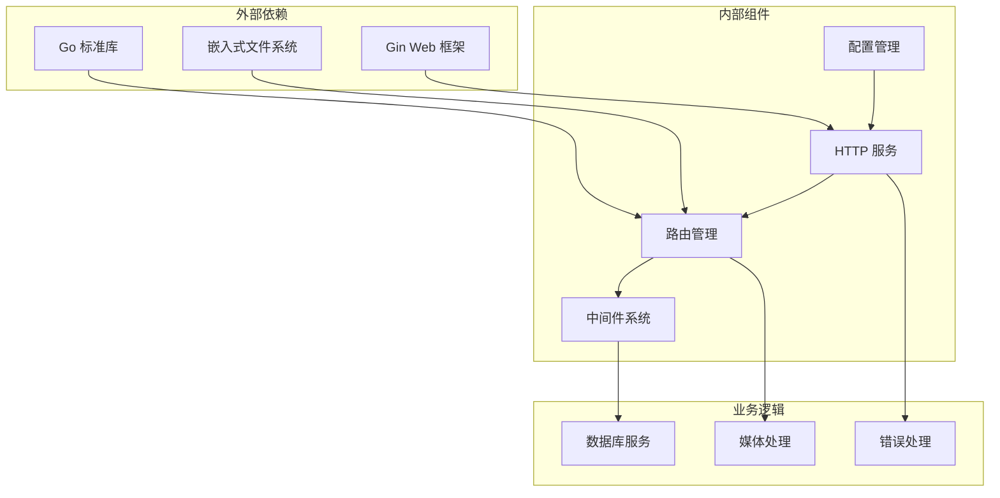

# 静态资源服务

<cite>
**本文档引用的文件**
- [internal/chatlog/http/route.go](file://internal/chatlog/http/route.go)
- [internal/chatlog/http/service.go](file://internal/chatlog/http/service.go)
- [internal/chatlog/http/middleware.go](file://internal/chatlog/http/middleware.go)
- [internal/chatlog/http/static/index.htm](file://internal/chatlog/http/static/index.htm)
- [internal/chatlog/conf/server.go](file://internal/chatlog/conf/server.go)
- [internal/chatlog/conf/conf.go](file://internal/chatlog/conf/conf.go)
- [cmd/chatlog/cmd_server.go](file://cmd/chatlog/cmd_server.go)
</cite>

## 目录
1. [简介](#简介)
2. [项目结构](#项目结构)
3. [核心组件](#核心组件)
4. [架构概览](#架构概览)
5. [详细组件分析](#详细组件分析)
6. [依赖关系分析](#依赖关系分析)
7. [性能考虑](#性能考虑)
8. [故障排除指南](#故障排除指南)
9. [结论](#结论)

## 简介

静态资源服务是 Chatlog 应用程序的重要组成部分，负责托管和提供 Web 界面所需的静态文件。该服务实现了完整的静态文件托管功能，包括 HTML 页面、CSS 样式表、JavaScript 文件以及其他静态资源的管理。

在本系统中，静态资源通过 Go 的内置嵌入机制进行打包，确保应用程序的独立性和部署便利性。静态资源服务不仅提供基础的文件托管功能，还集成了智能的资源处理能力，如媒体文件转换、缓存控制和安全防护等高级特性。

## 项目结构

静态资源服务的组织结构清晰合理，采用了分层设计模式：



**图表来源**
- [internal/chatlog/http/route.go](file://internal/chatlog/http/route.go#L26-L45)
- [internal/chatlog/http/service.go](file://internal/chatlog/http/service.go#L16-L26)

**章节来源**
- [internal/chatlog/http/route.go](file://internal/chatlog/http/route.go#L21-L45)
- [internal/chatlog/http/service.go](file://internal/chatlog/http/service.go#L16-L26)

## 核心组件

静态资源服务由多个核心组件协同工作，每个组件都有明确的职责分工：

### 服务配置组件
服务配置组件负责管理服务器的基本配置信息，包括监听地址、数据目录等关键参数。该组件采用接口抽象设计，提供了灵活的配置管理能力。

### 路由管理组件
路由管理组件是静态资源服务的核心控制器，负责定义和管理所有 HTTP 路由规则。它实现了静态文件托管、API 接口路由和媒体文件处理的统一管理。

### 中间件组件
中间件组件提供了横切关注点的功能，包括 CORS 跨域支持、数据库状态检查和错误处理等。这些中间件为整个服务提供了安全保障和良好的用户体验。

### 静态文件组件
静态文件组件专门负责托管各种类型的静态资源文件，包括 HTML 页面、CSS 样式表、JavaScript 文件和图标等。该组件支持嵌入式文件系统和传统文件系统两种模式。

**章节来源**
- [internal/chatlog/http/service.go](file://internal/chatlog/http/service.go#L16-L31)
- [internal/chatlog/http/route.go](file://internal/chatlog/http/route.go#L21-L31)
- [internal/chatlog/http/middleware.go](file://internal/chatlog/http/middleware.go#L10-L24)

## 架构概览

静态资源服务采用模块化的架构设计，各组件之间通过清晰的接口进行通信：



**图表来源**
- [internal/chatlog/http/route.go](file://internal/chatlog/http/route.go#L26-L75)
- [internal/chatlog/http/service.go](file://internal/chatlog/http/service.go#L33-L59)

该架构图展示了静态资源服务的主要交互流程，包括静态文件请求、API 接口调用和媒体文件处理等核心功能。

## 详细组件分析

### 静态文件托管系统

静态文件托管系统是整个静态资源服务的基础，负责管理和提供所有静态文件资源：

#### 嵌入式文件系统
系统使用 Go 的 `embed` 包将静态文件编译到二进制文件中，确保应用程序的独立部署能力。所有静态文件都存储在 `internal/chatlog/http/static` 目录下。

#### 路由配置
静态文件的路由配置非常简洁明了：

```mermaid
flowchart TD
A[根路径 /] --> B[返回 index.htm]
C[/static] --> D[静态文件目录]
E[/favicon.ico] --> F[图标文件]
D --> G[自动解析文件扩展名]
D --> H[设置正确的 MIME 类型]
D --> I[应用缓存策略]
```

**图表来源**
- [internal/chatlog/http/route.go](file://internal/chatlog/http/route.go#L34-L44)

#### MIME 类型处理
系统自动根据文件扩展名设置正确的 MIME 类型，确保浏览器能够正确识别和处理各种文件类型。对于嵌入式文件，系统使用标准的 MIME 类型映射。

**章节来源**
- [internal/chatlog/http/route.go](file://internal/chatlog/http/route.go#L34-L38)
- [internal/chatlog/http/static/index.htm](file://internal/chatlog/http/static/index.htm#L1-L757)

### API 路由系统

API 路由系统提供了完整的 RESTful API 接口，用于访问聊天数据：

#### 路由分组
API 接口按照功能模块进行分组，每个分组都有独立的命名空间：

```mermaid
graph LR
A[/api/v1] --> B[聊天记录接口]
A --> C[联系人接口]
A --> D[群聊接口]
A --> E[会话接口]
B --> F[GET /chatlog]
C --> G[GET /contact]
D --> H[GET /chatroom]
E --> I[GET /session]
```

**图表来源**
- [internal/chatlog/http/route.go](file://internal/chatlog/http/route.go#L55-L63)

#### 参数验证
每个 API 接口都实现了严格的参数验证机制，确保数据的完整性和安全性。系统使用结构化的方式定义请求参数，并提供详细的错误处理。

**章节来源**
- [internal/chatlog/http/route.go](file://internal/chatlog/http/route.go#L55-L63)
- [internal/chatlog/http/route.go](file://internal/chatlog/http/route.go#L90-L156)

### 媒体文件处理系统

媒体文件处理系统提供了强大的多媒体文件支持，包括图片、视频、音频和文档等多种格式：

#### 文件类型支持
系统支持多种媒体文件格式的处理和转换：

| 文件类型 | 扩展名 | 处理方式 |
|---------|--------|----------|
| 图片 | jpg, jpeg, png, gif, bmp | 直接传输或转换 |
| 视频 | mp4 | 直接传输 |
| 音频 | silk | 转换为 MP3 |
| 文档 | dat | 解析并转换 |

#### 路径解析机制
系统实现了智能的文件路径解析机制，能够自动识别和处理不同格式的文件：



**图表来源**
- [internal/chatlog/http/route.go](file://internal/chatlog/http/route.go#L295-L361)

**章节来源**
- [internal/chatlog/http/route.go](file://internal/chatlog/http/route.go#L295-L384)

### 缓存策略实现

静态资源服务实现了多层次的缓存策略，以提高性能和用户体验：

#### 缓存控制头设置
系统为不同类型的内容设置了适当的缓存控制策略：



**图表来源**
- [internal/chatlog/http/route.go](file://internal/chatlog/http/route.go#L128-L155)
- [internal/chatlog/http/route.go](file://internal/chatlog/http/route.go#L187-L200)

#### 性能优化策略
系统采用了多种性能优化策略，包括文件压缩、连接复用和智能缓存等技术。

**章节来源**
- [internal/chatlog/http/route.go](file://internal/chatlog/http/route.go#L126-L155)
- [internal/chatlog/http/route.go](file://internal/chatlog/http/route.go#L186-L200)

## 依赖关系分析

静态资源服务的依赖关系清晰明确，遵循了依赖倒置原则：



**图表来源**
- [internal/chatlog/http/service.go](file://internal/chatlog/http/service.go#L3-L14)
- [internal/chatlog/http/route.go](file://internal/chatlog/http/route.go#L3-L19)

**章节来源**
- [internal/chatlog/http/service.go](file://internal/chatlog/http/service.go#L3-L14)
- [internal/chatlog/http/route.go](file://internal/chatlog/http/route.go#L3-L19)

## 性能考虑

静态资源服务在设计时充分考虑了性能优化，采用了多种技术和策略来提升整体性能：

### 编译时优化
- **嵌入式文件系统**：所有静态文件都被编译到二进制文件中，减少了文件系统访问开销
- **预编译模板**：HTML 和 CSS 内容在编译时就确定，运行时无需额外解析

### 运行时优化
- **内存映射文件**：大文件采用内存映射技术，减少内存占用
- **连接池管理**：数据库连接采用连接池技术，提高连接复用率
- **异步处理**：耗时操作采用异步处理方式，避免阻塞主线程

### 缓存策略
- **多级缓存**：实现浏览器缓存、CDN 缓存和服务器缓存的多层缓存体系
- **智能过期**：根据文件类型和更新频率设置合理的缓存过期时间
- **条件请求**：支持 ETag 和 Last-Modified 头部，实现高效的缓存验证

### 安全考虑
- **CORS 配置**：严格控制跨域访问，只允许必要的域名访问
- **输入验证**：对所有用户输入进行严格的验证和过滤
- **文件访问控制**：限制对敏感文件的直接访问
- **错误处理**：统一的错误处理机制，避免泄露敏感信息

## 故障排除指南

### 常见问题诊断

#### 静态文件无法加载
当静态文件无法正常加载时，可以按照以下步骤进行排查：

1. **检查文件路径**：确认静态文件是否正确放置在 `static` 目录中
2. **验证路由配置**：检查路由配置是否正确映射到静态文件
3. **查看日志信息**：检查服务器日志中是否有相关的错误信息
4. **测试文件权限**：确认文件具有正确的读取权限

#### API 接口访问异常
API 接口访问异常通常由以下原因引起：

1. **数据库状态检查**：确认数据库已经正确初始化并且处于可用状态
2. **参数验证失败**：检查请求参数是否符合 API 规范
3. **网络连接问题**：验证服务器网络连接是否正常
4. **权限认证失败**：确认访问令牌或 API 密钥有效

#### 媒体文件处理错误
媒体文件处理错误的常见原因包括：

1. **文件格式不支持**：确认上传的文件格式是否被系统支持
2. **文件损坏**：检查文件是否完整且没有损坏
3. **磁盘空间不足**：确认有足够的磁盘空间进行文件处理
4. **权限问题**：验证文件处理程序是否有足够的权限

**章节来源**
- [internal/chatlog/http/middleware.go](file://internal/chatlog/http/middleware.go#L26-L45)
- [internal/chatlog/http/route.go](file://internal/chatlog/http/route.go#L77-L88)

### 性能监控指标

为了确保静态资源服务的稳定运行，需要监控以下关键性能指标：

- **响应时间**：静态文件和 API 请求的平均响应时间
- **并发连接数**：同时处理的请求数量
- **内存使用率**：服务器内存使用情况
- **磁盘 I/O**：文件读写操作的性能
- **错误率**：各类错误的发生频率

### 最佳实践建议

#### 部署配置
- **生产环境优化**：启用压缩和缓存功能
- **安全加固**：配置适当的防火墙和访问控制
- **监控告警**：建立完善的监控和告警机制
- **备份策略**：制定数据备份和恢复计划

#### 开发规范
- **代码审查**：建立严格的代码审查流程
- **单元测试**：编写全面的单元测试用例
- **文档维护**：保持技术文档的及时更新
- **版本管理**：采用规范的版本控制流程

## 结论

静态资源服务作为 Chatlog 应用程序的核心组件，展现了优秀的架构设计和实现质量。通过采用嵌入式文件系统、智能路由管理和多层次缓存策略，系统实现了高性能、高可用和易维护的静态资源托管服务。

该服务不仅满足了当前的功能需求，还为未来的扩展和优化奠定了坚实的基础。通过持续的性能优化和安全加固，静态资源服务将继续为用户提供稳定可靠的服务体验。

在未来的发展中，可以考虑进一步增强的功能包括：更智能的缓存策略、更丰富的媒体处理能力、更完善的监控告警系统等。这些改进将进一步提升系统的整体性能和用户体验。