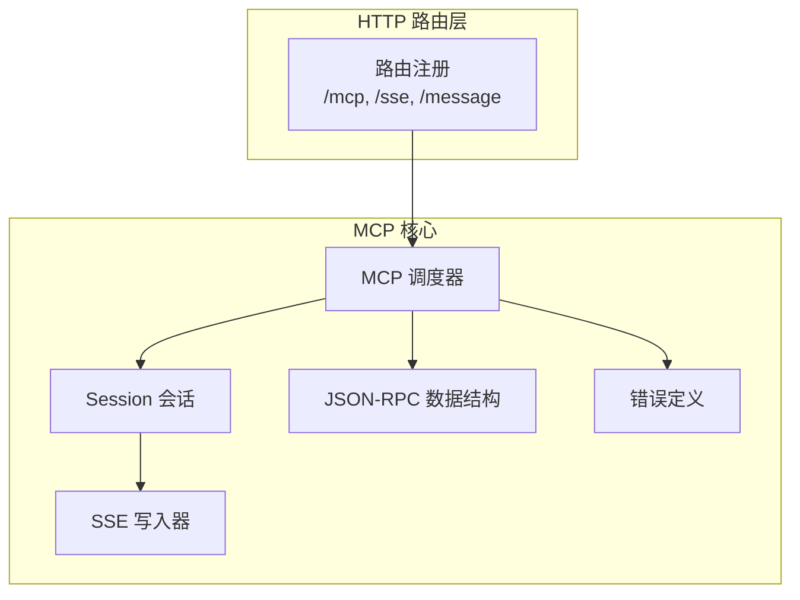
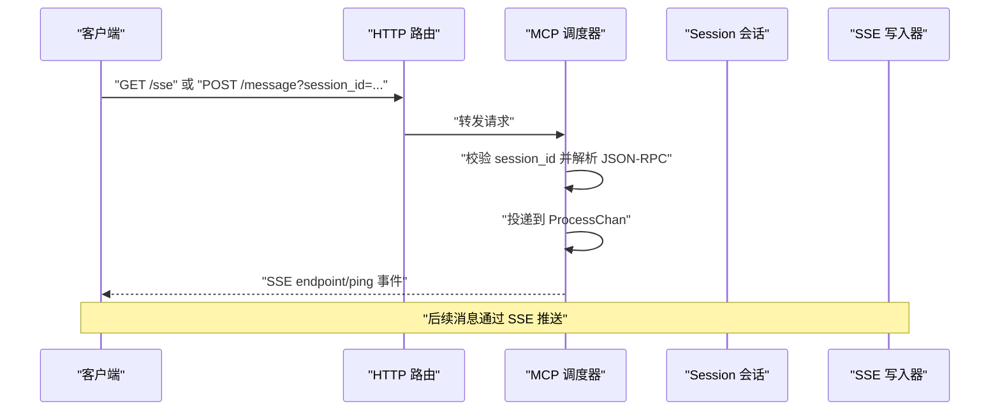
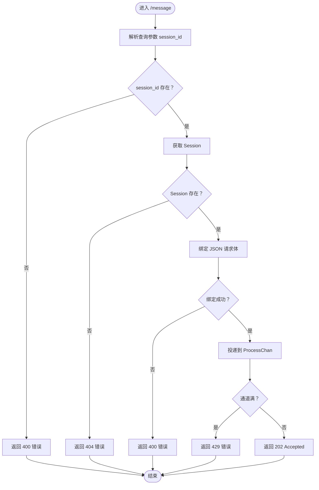
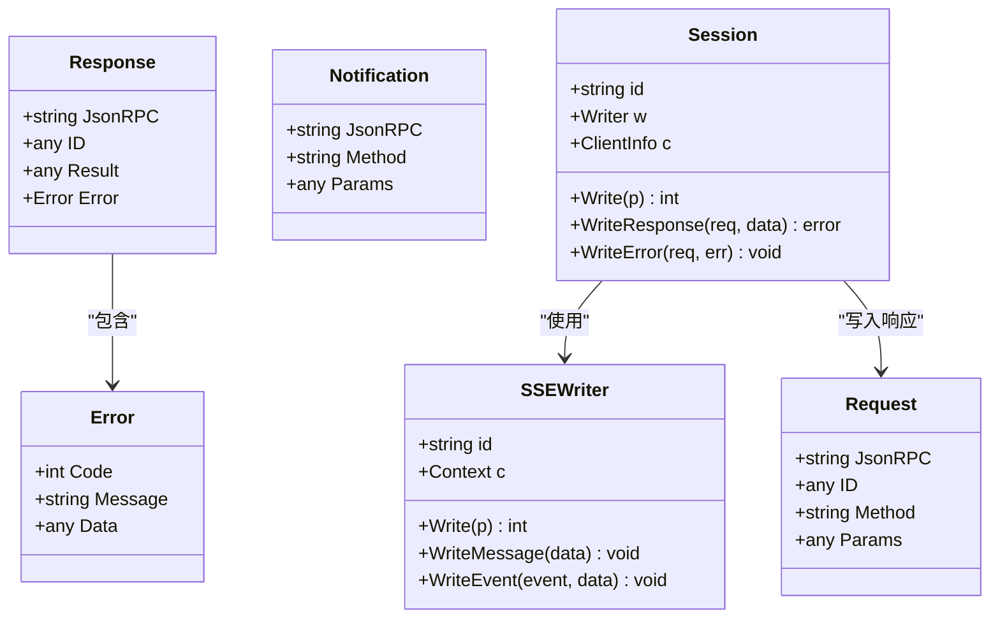
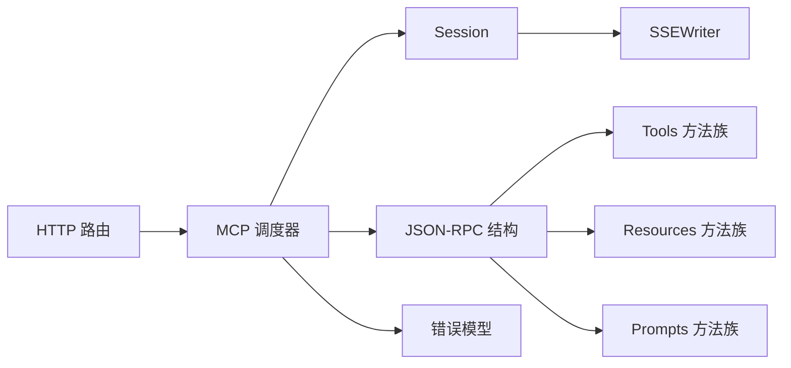

# JSON-RPC 集成

<cite>
**本文引用的文件**
- [internal/mcp/jsonrpc.go](file://internal/mcp/jsonrpc.go)
- [internal/mcp/error.go](file://internal/mcp/error.go)
- [internal/mcp/initialize.go](file://internal/mcp/initialize.go)
- [internal/mcp/prompt.go](file://internal/mcp/prompt.go)
- [internal/mcp/resource.go](file://internal/mcp/resource.go)
- [internal/mcp/tool.go](file://internal/mcp/tool.go)
- [internal/mcp/session.go](file://internal/mcp/session.go)
- [internal/mcp/sse.go](file://internal/mcp/sse.go)
- [internal/mcp/mcp.go](file://internal/mcp/mcp.go)
- [internal/chatlog/http/route.go](file://internal/chatlog/http/route.go)
- [docs/mcp.md](file://docs/mcp.md)
</cite>

## 目录
1. [简介](#简介)
2. [项目结构](#项目结构)
3. [核心组件](#核心组件)
4. [架构总览](#架构总览)
5. [详细组件分析](#详细组件分析)
6. [依赖关系分析](#依赖关系分析)
7. [性能考量](#性能考量)
8. [故障排查指南](#故障排查指南)
9. [结论](#结论)
10. [附录](#附录)

## 简介
本文件系统化阐述本仓库中 MCP（Model Context Protocol）的 JSON-RPC 2.0 集成方案。内容覆盖协议规范、请求/响应格式、方法调用机制、错误处理、调度器与消息路由、支持的方法清单、参数与返回值约定、调试与测试方法，以及与标准 JSON-RPC 的兼容性与迁移建议。

## 项目结构
MCP 的 JSON-RPC 实现主要位于 internal/mcp 目录，HTTP 路由与入口在 internal/chatlog/http/route.go 中注册。文档 docs/mcp.md 提供了外部使用示例与客户端对接指引。

图表来源
- [internal/chatlog/http/route.go](file://internal/chatlog/http/route.go#L65-L75)
- [internal/mcp/mcp.go](file://internal/mcp/mcp.go#L17-L29)
- [internal/mcp/session.go](file://internal/mcp/session.go#L10-L21)
- [internal/mcp/sse.go](file://internal/mcp/sse.go#L16-L35)
- [internal/mcp/jsonrpc.go](file://internal/mcp/jsonrpc.go#L17-L41)
- [internal/mcp/error.go](file://internal/mcp/error.go#L16-L33)

章节来源
- [internal/chatlog/http/route.go](file://internal/chatlog/http/route.go#L65-L75)

## 核心组件
- JSON-RPC 数据结构：统一的 Request/Response/Notification 结构体及版本常量，确保与标准 JSON-RPC 2.0 兼容。
- 错误模型：内置标准错误码与扩展错误码，提供统一的错误响应封装。
- 初始化与能力声明：initialize/ping 方法与默认能力集，便于客户端协商。
- 会话与 SSE：基于 SSE 的长连接传输，支持 endpoint/ping 事件与消息推送。
- 方法族：tools、resources、prompts 三大概念域的方法集合，涵盖列出、读取、调用与订阅等操作。

章节来源
- [internal/mcp/jsonrpc.go](file://internal/mcp/jsonrpc.go#L3-L62)
- [internal/mcp/error.go](file://internal/mcp/error.go#L16-L55)
- [internal/mcp/initialize.go](file://internal/mcp/initialize.go#L3-L78)
- [internal/mcp/session.go](file://internal/mcp/session.go#L10-L48)
- [internal/mcp/sse.go](file://internal/mcp/sse.go#L16-L76)

## 架构总览
MCP 的 JSON-RPC 通过 HTTP 路由接入，SSE 作为传输通道承载消息；MCP 调度器负责解析请求、校验会话、投递到处理通道，并通过 Session 将结果或通知回推给客户端。

图表来源
- [internal/chatlog/http/route.go](file://internal/chatlog/http/route.go#L65-L75)
- [internal/mcp/mcp.go](file://internal/mcp/mcp.go#L31-L98)
- [internal/mcp/sse.go](file://internal/mcp/sse.go#L63-L76)
- [internal/mcp/session.go](file://internal/mcp/session.go#L23-L44)

## 详细组件分析

### JSON-RPC 数据模型与协议规范
- 版本与字段
  - jsonrpc: 固定为 "2.0"
  - id: 数字或字符串，用于请求与响应匹配
  - method: 方法名，如 "initialize"、"ping"、"tools/list" 等
  - params: 可选参数对象
  - result/error: 响应体二选一，标准错误结构包含 code/message/data
- 请求/响应/通知的结构体定义与序列化规则
- 通知：无 id 字段，仅携带 jsonrpc/method/params

章节来源
- [internal/mcp/jsonrpc.go](file://internal/mcp/jsonrpc.go#L9-L62)

### 错误处理与错误码
- 标准 JSON-RPC 错误码：解析失败(-32700)、非法请求(-32600)、方法未找到(-32601)、参数无效(-32602)、内部错误(-32603)
- 扩展错误码：会话 ID 无效(400)、会话不存在(404)、请求过多(429)
- 错误响应封装：统一生成包含 jsonrpc 与 error 的响应对象

章节来源
- [internal/mcp/error.go](file://internal/mcp/error.go#L23-L55)

### 初始化与心跳
- initialize：客户端发起，携带 protocolVersion、capabilities、clientInfo；服务端返回 serverInfo 与 capabilities
- ping：用于保活与健康探测
- 默认能力集：包含 experimental、prompts、resources、tools 的基础能力声明

章节来源
- [internal/mcp/initialize.go](file://internal/mcp/initialize.go#L3-L78)

### 会话与 SSE 传输
- 会话建立：/sse 创建新会话，分配唯一 session_id，并向客户端推送 endpoint 事件，包含 /message 的访问地址
- 心跳：定期发送 ": ping" 注释行，维持连接活跃
- 写入：Session 将 JSON-RPC 响应序列化后通过 SSE 发送

章节来源
- [internal/mcp/sse.go](file://internal/mcp/sse.go#L63-L76)
- [internal/mcp/session.go](file://internal/mcp/session.go#L16-L44)

### 方法族：Tools（工具）
- 支持方法
  - tools/list：列出可用工具及其 inputSchema
  - tools/call：调用指定工具，参数包括 name 与 arguments
- 请求/响应结构
  - tools/call 请求包含 name 与 arguments
  - 响应包含 content 列表与 isError 标记

章节来源
- [internal/mcp/tool.go](file://internal/mcp/tool.go#L5-L144)

### 方法族：Resources（资源）
- 支持方法
  - resources/list：列出直连资源
  - resources/templates/list：列出资源模板
  - resources/read：读取资源内容（文本或 base64 二进制）
  - resources/subscribe / resources/unsubscribe：订阅/取消订阅资源变更
- 通知
  - notifications/resources/list_changed：资源列表变化
  - notifications/resources/updated：资源更新

章节来源
- [internal/mcp/resource.go](file://internal/mcp/resource.go#L5-L74)

### 方法族：Prompts（提示词）
- 支持方法
  - prompts/list：列出可用提示词
  - prompts/get：根据名称与参数获取提示词消息结构
- 请求/响应结构
  - prompts/get 请求包含 name 与 arguments
  - 响应包含 description 与 messages（role/content）

章节来源
- [internal/mcp/prompt.go](file://internal/mcp/prompt.go#L5-L137)

### 调度器与消息路由
- 会话管理：维护 session_id -> Session 映射，线程安全
- 消息入口
  - /message：接收 JSON-RPC 请求，解析并投递到 ProcessChan
  - /sse：建立 SSE 会话，推送 endpoint/ping
- 路由注册：/mcp、/sse、/message 由 HTTP 服务统一转发至 MCP 服务器

图表来源
- [internal/mcp/mcp.go](file://internal/mcp/mcp.go#L53-L98)

章节来源
- [internal/mcp/mcp.go](file://internal/mcp/mcp.go#L17-L107)
- [internal/chatlog/http/route.go](file://internal/chatlog/http/route.go#L65-L75)

### 类图：核心数据结构

图表来源
- [internal/mcp/jsonrpc.go](file://internal/mcp/jsonrpc.go#L17-L62)
- [internal/mcp/session.go](file://internal/mcp/session.go#L10-L48)
- [internal/mcp/sse.go](file://internal/mcp/sse.go#L16-L50)

## 依赖关系分析
- 路由层依赖 MCP 服务器实例，将 /mcp、/sse、/message 转发
- MCP 调度器依赖 Session/SSEWriter 进行消息推送
- 方法族（tools/resources/prompts）通过统一的 Request/Response 模型与错误体系协作

图表来源
- [internal/chatlog/http/route.go](file://internal/chatlog/http/route.go#L65-L75)
- [internal/mcp/mcp.go](file://internal/mcp/mcp.go#L17-L29)
- [internal/mcp/session.go](file://internal/mcp/session.go#L10-L21)
- [internal/mcp/jsonrpc.go](file://internal/mcp/jsonrpc.go#L17-L41)
- [internal/mcp/error.go](file://internal/mcp/error.go#L16-L33)

章节来源
- [internal/chatlog/http/route.go](file://internal/chatlog/http/route.go#L65-L75)
- [internal/mcp/mcp.go](file://internal/mcp/mcp.go#L17-L29)

## 性能考量
- 通道容量：MCP.ProcessChan 容量为 1000，避免高并发下的阻塞；建议结合业务峰值评估扩容
- SSE 心跳：每 30 秒发送一次 ping，降低空闲连接断开风险
- 序列化开销：Session 写入采用 JSON 序列化，建议控制单次响应大小与频率
- 会话生命周期：/sse 建立后等待请求中断自动清理，避免内存泄漏

## 故障排查指南
- 400 无效会话 ID：检查 /message 的 session_id 参数（支持 session_id、sessionId、sessionid 三种形式）
- 404 会话不存在：确认 /sse 是否已建立且未过期
- 400 非法请求：检查 JSON-RPC 请求体格式与字段完整性
- 429 请求过多：ProcessChan 满载，建议降频或增加容量
- SSE 连接异常：确认客户端支持 SSE，必要时使用 mcp-proxy 将 stdio 转换为 SSE

章节来源
- [internal/mcp/mcp.go](file://internal/mcp/mcp.go#L53-L98)
- [docs/mcp.md](file://docs/mcp.md#L18-L31)

## 结论
本实现严格遵循 JSON-RPC 2.0 规范，结合 MCP 的初始化、能力协商与三类方法族，提供了完整的工具、资源与提示词能力。通过 SSE 传输与统一的错误模型，具备良好的兼容性与可扩展性。建议在生产环境关注通道容量、SSE 心跳与响应体积，确保稳定与低延迟。

## 附录

### 支持的 JSON-RPC 方法清单
- initialize：客户端初始化，服务端返回 serverInfo 与 capabilities
- ping：保活与健康检查
- tools/list：列出工具
- tools/call：调用工具
- resources/list：列出资源
- resources/templates/list：列出资源模板
- resources/read：读取资源
- resources/subscribe / resources/unsubscribe：订阅/取消订阅资源
- prompts/list：列出提示词
- prompts/get：获取提示词消息

章节来源
- [internal/mcp/initialize.go](file://internal/mcp/initialize.go#L3-L78)
- [internal/mcp/tool.go](file://internal/mcp/tool.go#L5-L144)
- [internal/mcp/resource.go](file://internal/mcp/resource.go#L5-L74)
- [internal/mcp/prompt.go](file://internal/mcp/prompt.go#L5-L137)

### 参数验证与返回值格式
- initialize
  - 请求：protocolVersion、capabilities、clientInfo
  - 响应：protocolVersion、capabilities、serverInfo
- tools/call
  - 请求：name、arguments
  - 响应：content[]、isError
- resources/read
  - 请求：uri
  - 响应：contents[]（text 或 blob）
- prompts/get
  - 请求：name、arguments
  - 响应：description、messages[]（role、content）

章节来源
- [internal/mcp/initialize.go](file://internal/mcp/initialize.go#L27-L71)
- [internal/mcp/tool.go](file://internal/mcp/tool.go#L117-L138)
- [internal/mcp/resource.go](file://internal/mcp/resource.go#L65-L74)
- [internal/mcp/prompt.go](file://internal/mcp/prompt.go#L84-L103)

### JSON-RPC 调试与测试
- 使用浏览器或 curl 访问 /sse 获取 endpoint 地址
- 通过 /message 发送 JSON-RPC 请求进行测试
- 关注 SSE 控制台输出的 endpoint/ping 事件
- 如客户端不支持 SSE，可使用 mcp-proxy 将 stdio 转换为 SSE

章节来源
- [internal/mcp/sse.go](file://internal/mcp/sse.go#L63-L76)
- [docs/mcp.md](file://docs/mcp.md#L18-L31)

### 与标准 JSON-RPC 的兼容性与迁移
- 兼容性
  - 严格遵循 JSON-RPC 2.0 的请求/响应结构与字段命名
  - 支持标准错误码与扩展错误码
  - SSE 传输符合事件流规范
- 迁移建议
  - 若从其他实现迁移，优先保证方法名与参数结构一致
  - 对于不支持 SSE 的客户端，推荐使用 mcp-proxy
  - 自定义错误码需与客户端约定映射关系

章节来源
- [internal/mcp/jsonrpc.go](file://internal/mcp/jsonrpc.go#L9-L41)
- [internal/mcp/error.go](file://internal/mcp/error.go#L23-L33)
- [docs/mcp.md](file://docs/mcp.md#L18-L31)