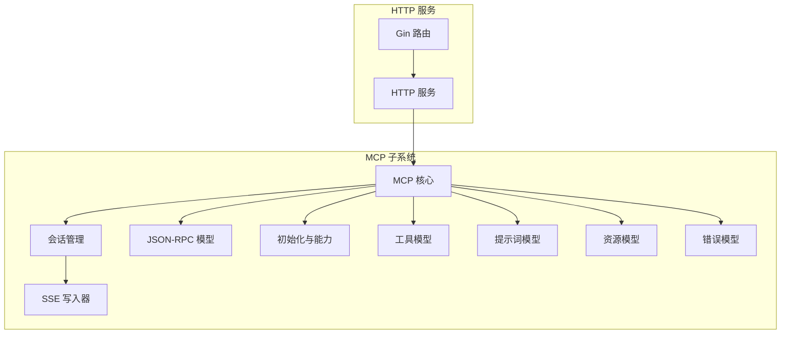
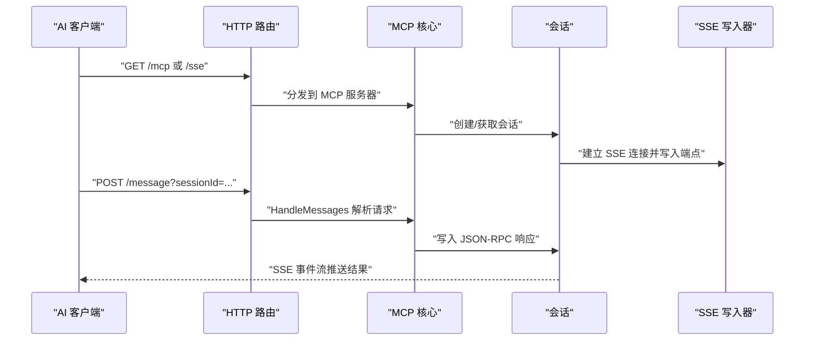
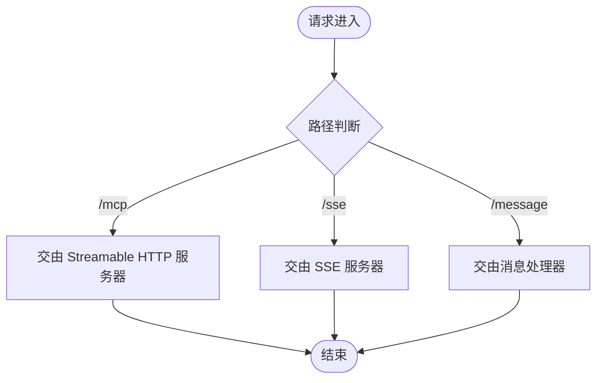
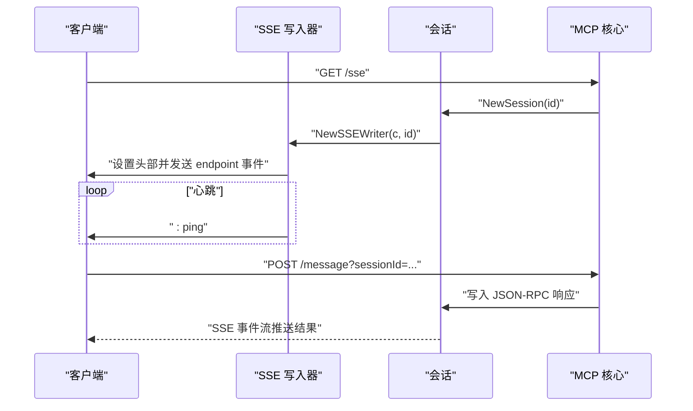
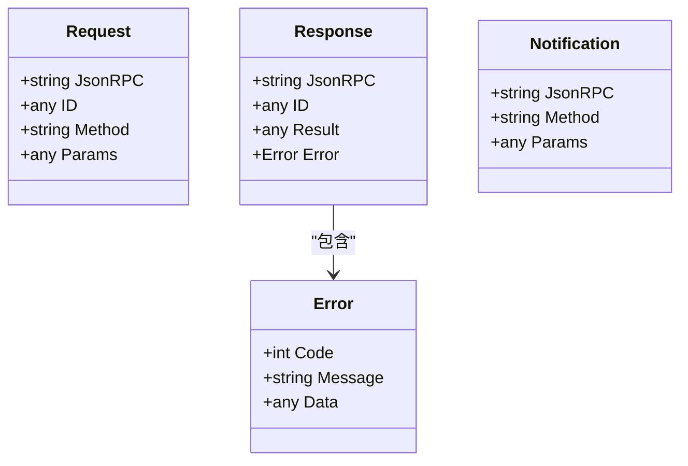
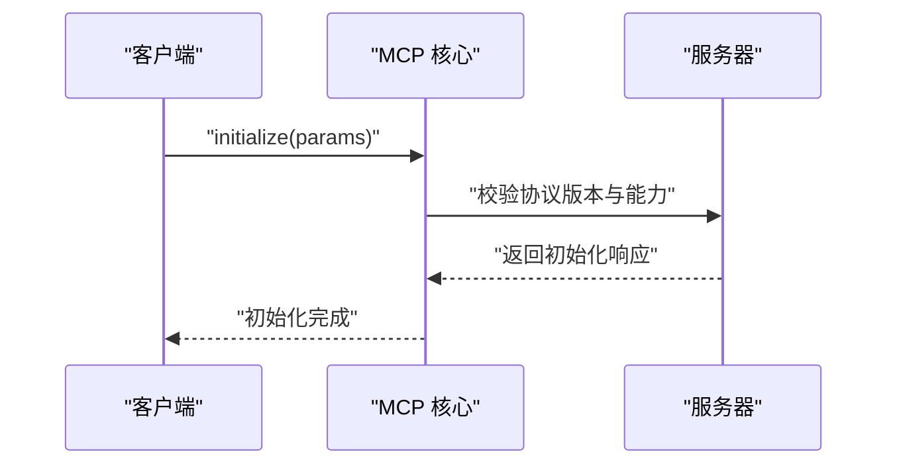
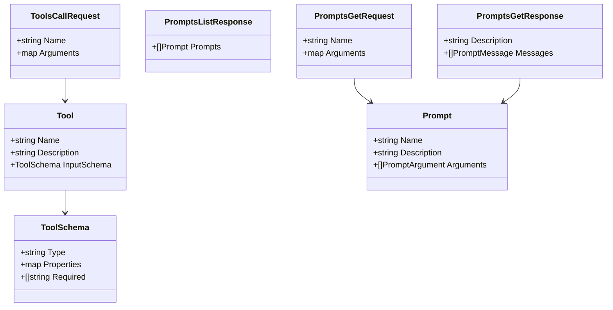
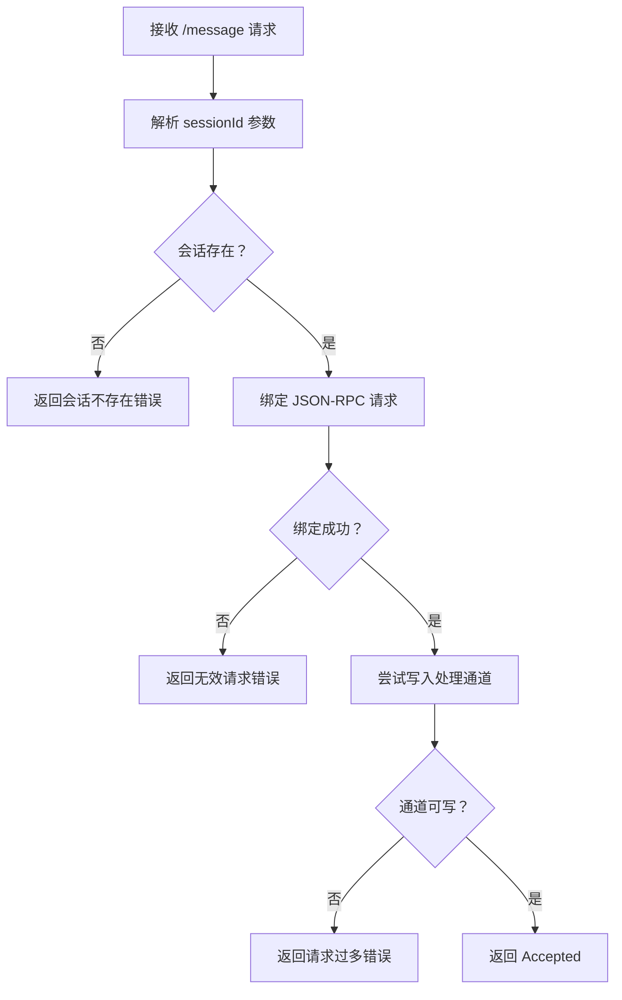
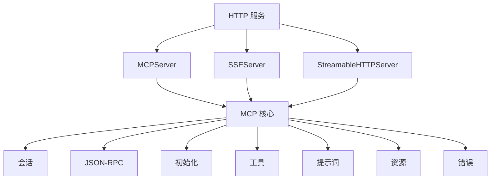

# MCP 协议概述

<cite>
**本文档引用的文件**
- [README.md](file://README.md)
- [docs/mcp.md](file://docs/mcp.md)
- [internal/mcp/mcp.go](file://internal/mcp/mcp.go)
- [internal/mcp/sse.go](file://internal/mcp/sse.go)
- [internal/mcp/jsonrpc.go](file://internal/mcp/jsonrpc.go)
- [internal/mcp/session.go](file://internal/mcp/session.go)
- [internal/mcp/resource.go](file://internal/mcp/resource.go)
- [internal/mcp/tool.go](file://internal/mcp/tool.go)
- [internal/mcp/prompt.go](file://internal/mcp/prompt.go)
- [internal/mcp/initialize.go](file://internal/mcp/initialize.go)
- [internal/mcp/error.go](file://internal/mcp/error.go)
- [internal/chatlog/http/service.go](file://internal/chatlog/http/service.go)
- [internal/chatlog/http/route.go](file://internal/chatlog/http/route.go)
</cite>

## 目录
1. [引言](#引言)
2. [项目结构](#项目结构)
3. [核心组件](#核心组件)
4. [架构总览](#架构总览)
5. [详细组件分析](#详细组件分析)
6. [依赖关系分析](#依赖关系分析)
7. [性能考虑](#性能考虑)
8. [故障排除指南](#故障排除指南)
9. [结论](#结论)
10. [附录](#附录)

## 引言
本文件面向希望理解并集成 MCP（Model Context Protocol）的开发者与使用者，系统性阐述 MCP 协议在本项目中的实现与应用。MCP 是一种标准化的“模型上下文协议”，允许 AI 助手通过统一接口访问外部资源、工具与提示词，从而实现更安全、可控且可扩展的智能体能力。本项目通过 Streamable HTTP 与 SSE（Server-Sent Events）两种传输方式，为多种桌面与编辑器客户端提供 MCP 服务，使本地微信聊天数据能够被 AI 助手以协议化的方式检索与分析。

与传统 REST API 的区别在于：
- 协议化：MCP 明确定义了方法命名、参数结构与响应格式，便于跨客户端一致性交互。
- 传输抽象：支持 SSE 与 Streamable HTTP，满足不同客户端的适配需求。
- 能力声明：通过 initialize 流程声明能力集，客户端可按能力动态启用功能。
- 资源与工具：提供资源读取、订阅与工具调用的标准模型，便于 AI 助手在上下文中直接使用。

选择 MCP 的价值：
- 降低集成成本：统一的协议与传输方式减少适配工作量。
- 增强安全性：通过会话与能力声明控制访问范围。
- 提升可扩展性：资源、工具与提示词均可按需扩展与订阅。

## 项目结构
本项目的 MCP 实现主要位于 internal/mcp 目录，HTTP 服务与路由位于 internal/chatlog/http 目录。整体结构围绕 Gin 路由与 mark3labs/mcp-go 的服务器组件展开，提供 /mcp、/sse、/message 等端点，分别对应 Streamable HTTP 与 SSE 传输。

图表来源
- [internal/chatlog/http/route.go](file://internal/chatlog/http/route.go#L65-L75)
- [internal/chatlog/http/service.go](file://internal/chatlog/http/service.go#L16-L26)
- [internal/mcp/mcp.go](file://internal/mcp/mcp.go#L17-L29)
- [internal/mcp/session.go](file://internal/mcp/session.go#L10-L21)
- [internal/mcp/sse.go](file://internal/mcp/sse.go#L16-L35)
- [internal/mcp/jsonrpc.go](file://internal/mcp/jsonrpc.go#L17-L41)
- [internal/mcp/initialize.go](file://internal/mcp/initialize.go#L27-L78)
- [internal/mcp/tool.go](file://internal/mcp/tool.go#L88-L98)
- [internal/mcp/prompt.go](file://internal/mcp/prompt.go#L24-L34)
- [internal/mcp/resource.go](file://internal/mcp/resource.go#L26-L31)
- [internal/mcp/error.go](file://internal/mcp/error.go#L16-L33)

章节来源
- [internal/chatlog/http/route.go](file://internal/chatlog/http/route.go#L65-L75)
- [internal/chatlog/http/service.go](file://internal/chatlog/http/service.go#L16-L26)

## 核心组件
- MCP 核心：负责会话生命周期管理、消息处理与并发控制，维护会话映射与处理通道。
- 会话管理：封装 SSE 写入器，向客户端推送事件与响应。
- SSE 写入器：实现事件流输出、心跳 ping、端点通知等。
- JSON-RPC 模型：定义请求、响应与通知的结构，统一错误包装。
- 初始化与能力：声明协议版本、客户端与服务器信息、默认能力集。
- 工具模型：描述工具名称、输入参数结构与调用结果。
- 提示词模型：描述提示词列表、参数与消息结构。
- 资源模型：描述资源、模板与读取请求。
- 错误模型：标准化错误码与 JSON-RPC 错误响应。

章节来源
- [internal/mcp/mcp.go](file://internal/mcp/mcp.go#L17-L29)
- [internal/mcp/session.go](file://internal/mcp/session.go#L10-L21)
- [internal/mcp/sse.go](file://internal/mcp/sse.go#L16-L35)
- [internal/mcp/jsonrpc.go](file://internal/mcp/jsonrpc.go#L17-L41)
- [internal/mcp/initialize.go](file://internal/mcp/initialize.go#L27-L78)
- [internal/mcp/tool.go](file://internal/mcp/tool.go#L88-L98)
- [internal/mcp/prompt.go](file://internal/mcp/prompt.go#L24-L34)
- [internal/mcp/resource.go](file://internal/mcp/resource.go#L26-L31)
- [internal/mcp/error.go](file://internal/mcp/error.go#L16-L33)

## 架构总览
MCP 在本项目中的架构分为三层：
- 传输层：/mcp（Streamable HTTP）、/sse（SSE）、/message（SSE 消息端点）。
- 协议层：JSON-RPC 2.0 请求/响应模型，方法命名遵循 MCP 规范。
- 业务层：会话管理、工具、提示词、资源与错误处理。

图表来源
- [internal/chatlog/http/route.go](file://internal/chatlog/http/route.go#L65-L75)
- [internal/mcp/mcp.go](file://internal/mcp/mcp.go#L31-L45)
- [internal/mcp/mcp.go](file://internal/mcp/mcp.go#L53-L98)
- [internal/mcp/session.go](file://internal/mcp/session.go#L16-L21)
- [internal/mcp/sse.go](file://internal/mcp/sse.go#L63-L76)

## 详细组件分析

### 传输与路由
- /mcp：Streamable HTTP 端点，供直接支持该传输的客户端接入。
- /sse：SSE 端点，用于向客户端推送事件与响应。
- /message：SSE 消息端点，接收客户端通过 sessionId 发送的 JSON-RPC 请求。

图表来源
- [internal/chatlog/http/route.go](file://internal/chatlog/http/route.go#L65-L75)

章节来源
- [internal/chatlog/http/route.go](file://internal/chatlog/http/route.go#L65-L75)

### 会话与 SSE 机制
- 会话创建：每次 /sse 请求生成唯一会话 ID，并在请求结束时清理。
- SSE 写入：设置 Content-Type、Cache-Control、Connection 等头部；周期性发送 ping；首次发送 endpoint 事件告知客户端消息端点。
- 事件推送：通过 SSE 事件流向客户端推送 message 事件与结果。

图表来源
- [internal/mcp/mcp.go](file://internal/mcp/mcp.go#L31-L45)
- [internal/mcp/session.go](file://internal/mcp/session.go#L16-L21)
- [internal/mcp/sse.go](file://internal/mcp/sse.go#L21-L35)
- [internal/mcp/sse.go](file://internal/mcp/sse.go#L52-L76)

章节来源
- [internal/mcp/mcp.go](file://internal/mcp/mcp.go#L31-L45)
- [internal/mcp/session.go](file://internal/mcp/session.go#L16-L21)
- [internal/mcp/sse.go](file://internal/mcp/sse.go#L21-L35)
- [internal/mcp/sse.go](file://internal/mcp/sse.go#L52-L76)

### JSON-RPC 与错误处理
- 请求/响应模型：统一的 jsonrpc、id、method、params/result/error 字段。
- 通知模型：用于服务器向客户端推送事件。
- 错误模型：标准 JSON-RPC 错误码与自定义错误（如无效会话 ID、会话不存在、请求过多）。

图表来源
- [internal/mcp/jsonrpc.go](file://internal/mcp/jsonrpc.go#L17-L41)
- [internal/mcp/error.go](file://internal/mcp/error.go#L16-L33)

章节来源
- [internal/mcp/jsonrpc.go](file://internal/mcp/jsonrpc.go#L17-L41)
- [internal/mcp/error.go](file://internal/mcp/error.go#L16-L33)

### 初始化与能力声明
- initialize 方法：客户端发起，携带 protocolVersion、capabilities、clientInfo。
- 服务器响应：返回 protocolVersion、capabilities、serverInfo。
- 默认能力：声明 prompts、resources、tools 等能力开关。

图表来源
- [internal/mcp/initialize.go](file://internal/mcp/initialize.go#L27-L78)

章节来源
- [internal/mcp/initialize.go](file://internal/mcp/initialize.go#L27-L78)

### 工具与提示词
- 工具模型：包含工具名称、描述与输入参数的 JSON Schema；调用请求包含名称与参数。
- 提示词模型：包含提示词列表、参数与消息结构；支持资源引用。

图表来源
- [internal/mcp/tool.go](file://internal/mcp/tool.go#L88-L98)
- [internal/mcp/tool.go](file://internal/mcp/tool.go#L117-L120)
- [internal/mcp/prompt.go](file://internal/mcp/prompt.go#L24-L34)
- [internal/mcp/prompt.go](file://internal/mcp/prompt.go#L53-L55)
- [internal/mcp/prompt.go](file://internal/mcp/prompt.go#L84-L87)
- [internal/mcp/prompt.go](file://internal/mcp/prompt.go#L89-L92)

章节来源
- [internal/mcp/tool.go](file://internal/mcp/tool.go#L88-L98)
- [internal/mcp/tool.go](file://internal/mcp/tool.go#L117-L120)
- [internal/mcp/prompt.go](file://internal/mcp/prompt.go#L24-L34)
- [internal/mcp/prompt.go](file://internal/mcp/prompt.go#L53-L55)
- [internal/mcp/prompt.go](file://internal/mcp/prompt.go#L84-L87)
- [internal/mcp/prompt.go](file://internal/mcp/prompt.go#L89-L92)

### 资源与订阅
- 资源模型：资源 URI、名称、描述、MIME 类型；模板遵循 RFC 6570。
- 读取请求：根据 URI 读取资源内容，支持文本与二进制（base64）。
- 订阅与变更：支持订阅资源变更与列表更新通知。

章节来源
- [internal/mcp/resource.go](file://internal/mcp/resource.go#L26-L31)
- [internal/mcp/resource.go](file://internal/mcp/resource.go#L41-L46)
- [internal/mcp/resource.go](file://internal/mcp/resource.go#L61-L74)

### 消息处理与并发控制
- 会话 ID 解析：兼容 session_id、sessionId、sessionid 三种查询参数。
- 请求校验：JSON 绑定失败返回无效请求错误。
- 并发控制：通过带缓冲通道限制处理速率，避免过载。

图表来源
- [internal/mcp/mcp.go](file://internal/mcp/mcp.go#L53-L98)

章节来源
- [internal/mcp/mcp.go](file://internal/mcp/mcp.go#L53-L98)

## 依赖关系分析
- HTTP 层依赖 mark3labs/mcp-go 的 MCPServer、SSEServer、StreamableHTTPServer，统一暴露 /mcp、/sse、/message 端点。
- MCP 层内部通过会话、SSE 写入器、JSON-RPC 模型与能力声明协作，形成清晰的职责边界。
- 客户端通过 SSE 或 Streamable HTTP 与服务器交互，SSE 适用于不支持直接 TCP 的场景，Streamable HTTP 则提供更直接的传输。

图表来源
- [internal/chatlog/http/service.go](file://internal/chatlog/http/service.go#L23-L25)
- [internal/chatlog/http/route.go](file://internal/chatlog/http/route.go#L65-L75)
- [internal/mcp/mcp.go](file://internal/mcp/mcp.go#L17-L29)

章节来源
- [internal/chatlog/http/service.go](file://internal/chatlog/http/service.go#L23-L25)
- [internal/chatlog/http/route.go](file://internal/chatlog/http/route.go#L65-L75)

## 性能考虑
- 通道容量：处理通道与 SSE 事件通道均设置固定容量，避免内存无限增长。
- 心跳机制：定期发送 ping 事件，维持连接活跃，防止中间代理断开。
- 并发控制：在消息处理处采用非阻塞写入策略，超过容量返回限流错误，保障系统稳定性。
- 传输选择：对不支持 SSE 的客户端，推荐使用 mcp-proxy 将 stdio 转换为 SSE，提升兼容性。

## 故障排除指南
- 无效会话 ID：检查请求参数是否包含正确的 sessionId，支持多种拼写形式。
- 会话不存在：确认 /sse 已建立且会话未过期。
- 请求过多：处理通道已满，建议降低请求频率或增加容量。
- JSON 绑定失败：检查请求体是否符合 JSON-RPC 结构，字段是否齐全。

章节来源
- [internal/mcp/mcp.go](file://internal/mcp/mcp.go#L53-L98)
- [internal/mcp/error.go](file://internal/mcp/error.go#L23-L33)

## 结论
本项目通过 MCP 协议实现了与多种 AI 助手的标准化集成，结合 Streamable HTTP 与 SSE 传输，既满足现代客户端的直接接入，也兼容不支持直接传输的场景。借助统一的 JSON-RPC 模型、能力声明与资源/工具/提示词模型，MCP 为本地聊天数据的检索与分析提供了安全、可控且可扩展的能力边界。建议在生产环境中合理配置通道容量与心跳间隔，并优先使用官方文档提供的集成步骤，以获得最佳兼容性与稳定性。

## 附录
- 官方文档与集成指南：参见项目根目录 README 的 MCP 集成部分与 docs/mcp.md。
- 快速开始：启动 HTTP 服务后，使用 /mcp 或 /sse 端点接入支持 MCP 的客户端；若客户端不支持 SSE，可使用 mcp-proxy 进行转换。

章节来源
- [README.md](file://README.md#L295-L318)
- [docs/mcp.md](file://docs/mcp.md#L1-L152)