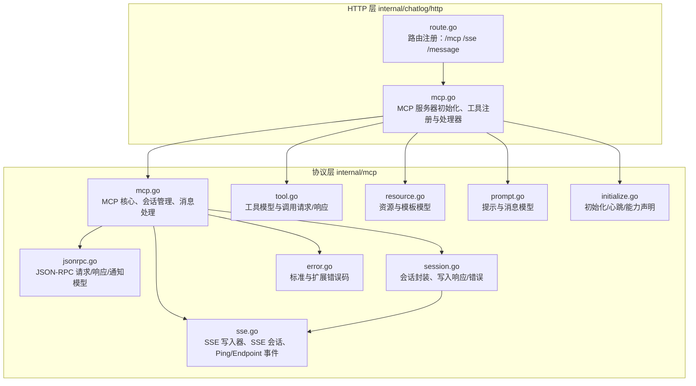
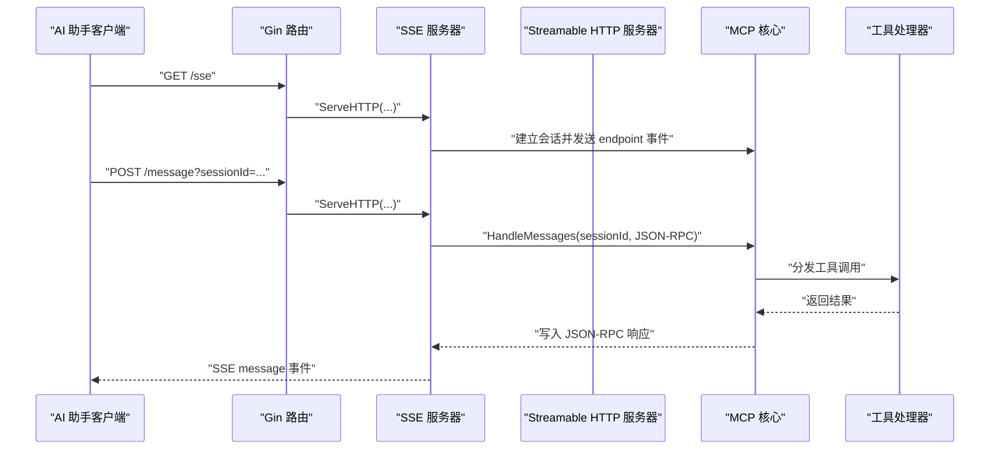
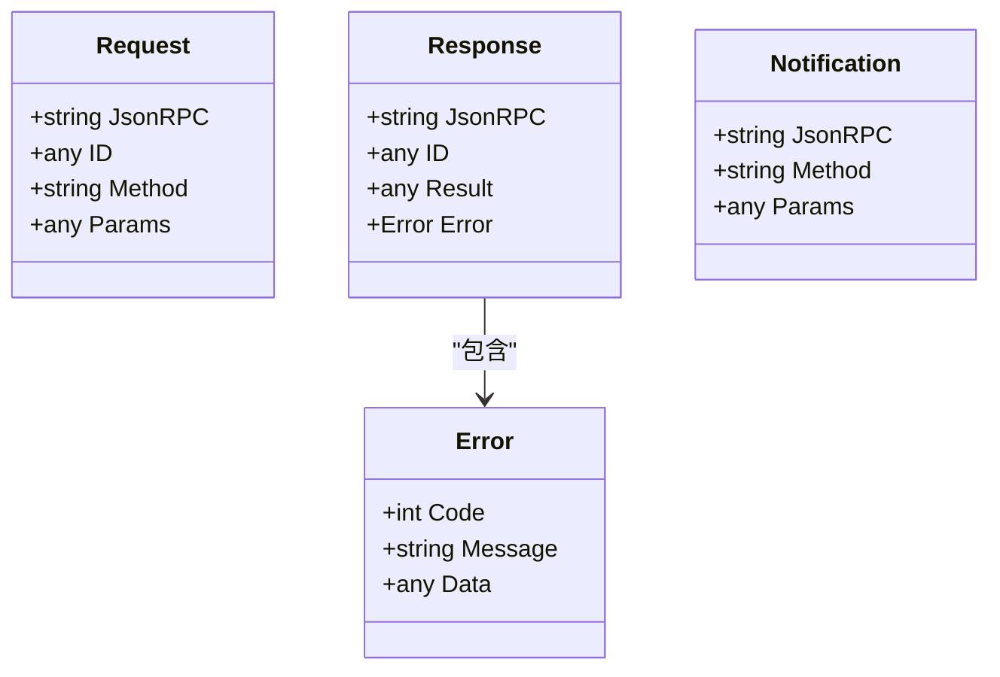
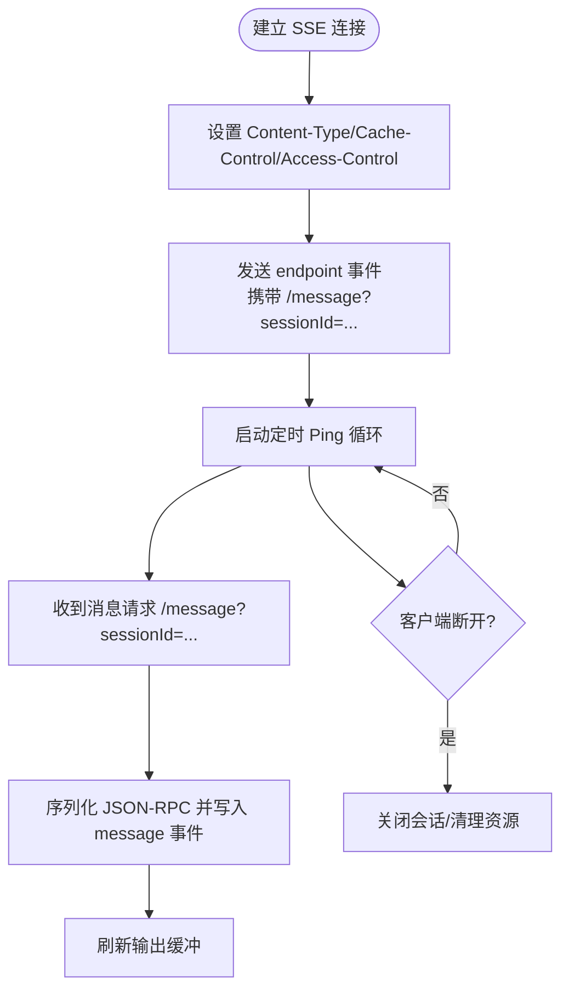
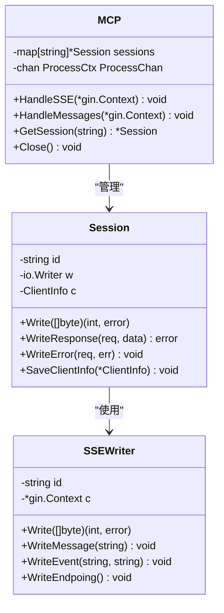
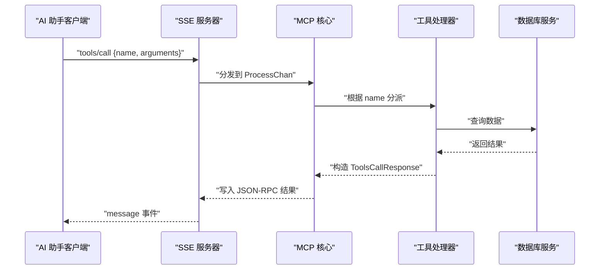
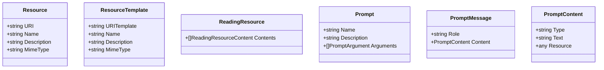
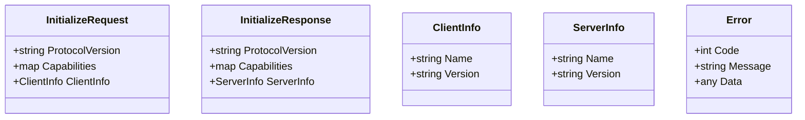
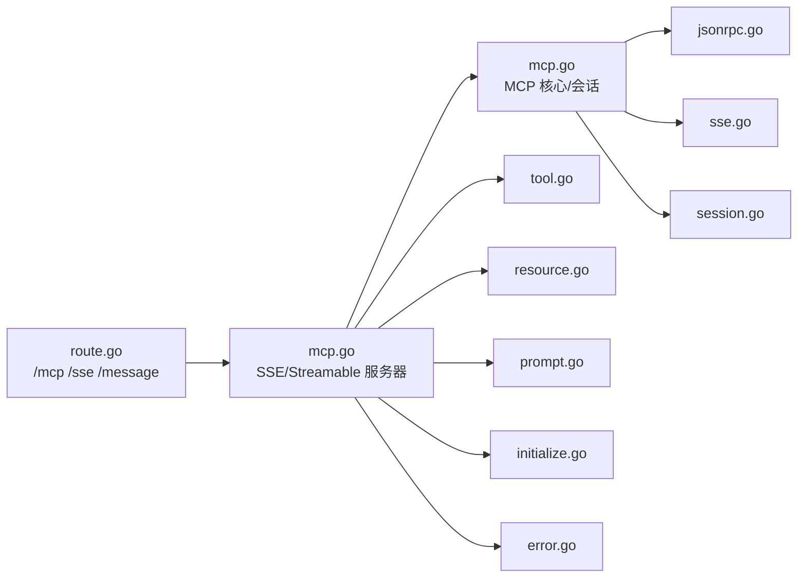

# MCP 协议集成

<cite>
**本文引用的文件**
- [internal/mcp/mcp.go](file://internal/mcp/mcp.go)
- [internal/mcp/jsonrpc.go](file://internal/mcp/jsonrpc.go)
- [internal/mcp/sse.go](file://internal/mcp/sse.go)
- [internal/mcp/session.go](file://internal/mcp/session.go)
- [internal/mcp/tool.go](file://internal/mcp/tool.go)
- [internal/mcp/resource.go](file://internal/mcp/resource.go)
- [internal/mcp/prompt.go](file://internal/mcp/prompt.go)
- [internal/mcp/error.go](file://internal/mcp/error.go)
- [internal/mcp/initialize.go](file://internal/mcp/initialize.go)
- [internal/chatlog/http/mcp.go](file://internal/chatlog/http/mcp.go)
- [internal/chatlog/http/route.go](file://internal/chatlog/http/route.go)
- [docs/mcp.md](file://docs/mcp.md)
</cite>

## 目录
1. [简介](#简介)
2. [项目结构](#项目结构)
3. [核心组件](#核心组件)
4. [架构总览](#架构总览)
5. [组件详解](#组件详解)
6. [依赖关系分析](#依赖关系分析)
7. [性能考量](#性能考量)
8. [故障排查指南](#故障排查指南)
9. [结论](#结论)
10. [附录](#附录)

## 简介
本文件面向希望在应用中集成 MCP（Model Context Protocol）协议的开发者，系统性阐述 MCP 协议的工作原理、Streamable HTTP 机制与 SSE 支持，以及会话管理、工具调用、资源管理与 JSON-RPC 支持。文档同时提供与 Claude Desktop、Monica Code、ChatWise 等 AI 助手的集成指南，涵盖 MCP 配置方法、工具定义、资源模板与实际集成示例，并解释 MCP 协议的优势与适用场景。

## 项目结构
本项目的 MCP 集成主要分布在两部分：
- 协议层（internal/mcp）：实现 JSON-RPC 数据模型、SSE 写入器与会话、工具与资源/提示模型、初始化与错误处理等。
- HTTP 层（internal/chatlog/http）：注册路由、桥接 MCP 服务器（SSE/Streamable HTTP），并实现具体工具函数（联系人、群聊、会话、聊天记录、当前时间）。

图表来源
- [internal/mcp/mcp.go](file://internal/mcp/mcp.go#L1-L108)
- [internal/mcp/sse.go](file://internal/mcp/sse.go#L1-L161)
- [internal/mcp/session.go](file://internal/mcp/session.go#L1-L49)
- [internal/mcp/jsonrpc.go](file://internal/mcp/jsonrpc.go#L1-L63)
- [internal/mcp/tool.go](file://internal/mcp/tool.go#L1-L144)
- [internal/mcp/resource.go](file://internal/mcp/resource.go#L1-L75)
- [internal/mcp/prompt.go](file://internal/mcp/prompt.go#L1-L138)
- [internal/mcp/error.go](file://internal/mcp/error.go#L1-L56)
- [internal/mcp/initialize.go](file://internal/mcp/initialize.go#L1-L79)
- [internal/chatlog/http/route.go](file://internal/chatlog/http/route.go#L65-L75)
- [internal/chatlog/http/mcp.go](file://internal/chatlog/http/mcp.go#L20-L29)

章节来源
- [internal/mcp/mcp.go](file://internal/mcp/mcp.go#L1-L108)
- [internal/mcp/sse.go](file://internal/mcp/sse.go#L1-L161)
- [internal/mcp/session.go](file://internal/mcp/session.go#L1-L49)
- [internal/mcp/jsonrpc.go](file://internal/mcp/jsonrpc.go#L1-L63)
- [internal/mcp/tool.go](file://internal/mcp/tool.go#L1-L144)
- [internal/mcp/resource.go](file://internal/mcp/resource.go#L1-L75)
- [internal/mcp/prompt.go](file://internal/mcp/prompt.go#L1-L138)
- [internal/mcp/error.go](file://internal/mcp/error.go#L1-L56)
- [internal/mcp/initialize.go](file://internal/mcp/initialize.go#L1-L79)
- [internal/chatlog/http/route.go](file://internal/chatlog/http/route.go#L65-L75)
- [internal/chatlog/http/mcp.go](file://internal/chatlog/http/mcp.go#L20-L29)

## 核心组件
- JSON-RPC 模型：统一的请求/响应/通知结构，确保与 MCP 客户端的兼容性。
- SSE 写入器与会话：负责向客户端推送事件（endpoint/message/ping），维持长连接与心跳。
- 会话管理：基于 UUID 的会话生命周期管理，提供消息处理通道与响应写入。
- 工具与资源/提示模型：标准化工具定义、资源模板与提示消息结构，便于客户端发现与调用。
- 初始化与错误处理：协议版本、能力声明、客户端/服务器信息，以及标准与扩展错误码。

章节来源
- [internal/mcp/jsonrpc.go](file://internal/mcp/jsonrpc.go#L17-L62)
- [internal/mcp/sse.go](file://internal/mcp/sse.go#L16-L100)
- [internal/mcp/mcp.go](file://internal/mcp/mcp.go#L17-L51)
- [internal/mcp/tool.go](file://internal/mcp/tool.go#L88-L144)
- [internal/mcp/resource.go](file://internal/mcp/resource.go#L26-L74)
- [internal/mcp/prompt.go](file://internal/mcp/prompt.go#L24-L137)
- [internal/mcp/initialize.go](file://internal/mcp/initialize.go#L27-L78)
- [internal/mcp/error.go](file://internal/mcp/error.go#L16-L55)

## 架构总览
MCP 集成通过 HTTP 路由暴露两个入口：
- /mcp：Streamable HTTP 入口，适配不支持 SSE 的客户端。
- /sse 与 /message：SSE 入口，向客户端推送 endpoint 与消息事件。

HTTP 层初始化 MCP 服务器（SSE/Streamable HTTP），并将工具注册到服务器。工具处理器从数据库查询数据并以文本内容形式返回给客户端。

图表来源
- [internal/chatlog/http/route.go](file://internal/chatlog/http/route.go#L65-L75)
- [internal/chatlog/http/mcp.go](file://internal/chatlog/http/mcp.go#L20-L29)
- [internal/mcp/mcp.go](file://internal/mcp/mcp.go#L31-L98)
- [internal/mcp/sse.go](file://internal/mcp/sse.go#L63-L111)

## 组件详解

### JSON-RPC 支持
- 请求模型包含 jsonrpc 版本、id、method 与 params。
- 响应模型包含 jsonrpc 版本、id、result 或 error。
- 通知模型用于单向事件推送（如资源更新）。

图表来源
- [internal/mcp/jsonrpc.go](file://internal/mcp/jsonrpc.go#L17-L62)
- [internal/mcp/error.go](file://internal/mcp/error.go#L16-L21)

章节来源
- [internal/mcp/jsonrpc.go](file://internal/mcp/jsonrpc.go#L17-L62)
- [internal/mcp/error.go](file://internal/mcp/error.go#L16-L55)

### SSE 与 Streamable HTTP
- SSE 写入器负责设置响应头、发送 endpoint 事件、消息事件与 ping 心跳。
- SSE 会话维护事件通道与停止信号，支持并发事件推送。
- Streamable HTTP 作为 SSE 的替代传输，适配不支持 SSE 的客户端。

图表来源
- [internal/mcp/sse.go](file://internal/mcp/sse.go#L21-L76)
- [internal/mcp/sse.go](file://internal/mcp/sse.go#L91-L100)

章节来源
- [internal/mcp/sse.go](file://internal/mcp/sse.go#L10-L161)

### 会话管理
- 会话通过 UUID 标识，绑定 SSE 写入器。
- 提供写入响应与错误的能力，统一 JSON-RPC 输出格式。
- MCP 核心维护会话映射，按 sessionId 查找并投递处理任务。

图表来源
- [internal/mcp/session.go](file://internal/mcp/session.go#L10-L49)
- [internal/mcp/sse.go](file://internal/mcp/sse.go#L16-L35)
- [internal/mcp/mcp.go](file://internal/mcp/mcp.go#L17-L51)

章节来源
- [internal/mcp/session.go](file://internal/mcp/session.go#L10-L49)
- [internal/mcp/mcp.go](file://internal/mcp/mcp.go#L17-L51)

### 工具调用
- 工具模型包含名称、描述与输入模式（JSON Schema）。
- 工具调用请求包含名称与参数；调用响应包含内容数组与错误标记。
- HTTP 层注册多个工具（联系人、群聊、最近会话、聊天记录、当前时间），并实现对应处理器。

图表来源
- [internal/mcp/tool.go](file://internal/mcp/tool.go#L88-L144)
- [internal/chatlog/http/mcp.go](file://internal/chatlog/http/mcp.go#L31-L155)
- [internal/chatlog/http/mcp.go](file://internal/chatlog/http/mcp.go#L163-L328)

章节来源
- [internal/mcp/tool.go](file://internal/mcp/tool.go#L88-L144)
- [internal/chatlog/http/mcp.go](file://internal/chatlog/http/mcp.go#L31-L155)
- [internal/chatlog/http/mcp.go](file://internal/chatlog/http/mcp.go#L163-L328)

### 资源与提示
- 资源模型支持直接资源与 URI 模板，读取响应包含文本或二进制内容。
- 提示模型支持列出与获取提示，消息内容支持文本与资源两种类型。

图表来源
- [internal/mcp/resource.go](file://internal/mcp/resource.go#L26-L74)
- [internal/mcp/prompt.go](file://internal/mcp/prompt.go#L24-L137)

章节来源
- [internal/mcp/resource.go](file://internal/mcp/resource.go#L18-L74)
- [internal/mcp/prompt.go](file://internal/mcp/prompt.go#L11-L137)

### 初始化与错误处理
- 初始化请求包含协议版本、能力声明与客户端信息；响应包含服务器信息与能力声明。
- 错误模型覆盖标准 JSON-RPC 错误码与扩展错误码（如无效会话 ID、请求过多）。

图表来源
- [internal/mcp/initialize.go](file://internal/mcp/initialize.go#L27-L78)
- [internal/mcp/error.go](file://internal/mcp/error.go#L16-L55)

章节来源
- [internal/mcp/initialize.go](file://internal/mcp/initialize.go#L27-L78)
- [internal/mcp/error.go](file://internal/mcp/error.go#L16-L55)

## 依赖关系分析
- HTTP 路由层依赖 MCP 服务器（SSE/Streamable HTTP）与工具注册。
- MCP 核心依赖 JSON-RPC 模型、SSE 写入器与会话管理。
- 工具处理器依赖数据库服务与工具模型。

图表来源
- [internal/chatlog/http/route.go](file://internal/chatlog/http/route.go#L65-L75)
- [internal/chatlog/http/mcp.go](file://internal/chatlog/http/mcp.go#L20-L29)
- [internal/mcp/mcp.go](file://internal/mcp/mcp.go#L17-L51)

章节来源
- [internal/chatlog/http/route.go](file://internal/chatlog/http/route.go#L65-L75)
- [internal/chatlog/http/mcp.go](file://internal/chatlog/http/mcp.go#L20-L29)
- [internal/mcp/mcp.go](file://internal/mcp/mcp.go#L17-L51)

## 性能考量
- 会话与处理通道容量：MCP 核心维护固定容量的处理通道，避免过载；当通道满时返回请求过多错误。
- SSE 心跳：定期发送 ping 事件，防止代理/网络中间设备中断连接。
- 响应序列化：统一 JSON 序列化，减少解析开销；错误与成功路径均返回标准 JSON-RPC 结构。
- 工具调用：处理器按需查询数据库，建议结合分页与索引优化查询性能。

章节来源
- [internal/mcp/mcp.go](file://internal/mcp/mcp.go#L13-L15)
- [internal/mcp/mcp.go](file://internal/mcp/mcp.go#L89-L95)
- [internal/mcp/sse.go](file://internal/mcp/sse.go#L52-L76)

## 故障排查指南
- 无效会话 ID：当 sessionId 参数缺失或不匹配时，返回无效会话 ID 错误。
- 会话不存在：找不到对应会话时返回未找到错误。
- 请求过多：处理通道阻塞或溢出时返回请求过多错误。
- JSON 解析错误：请求体无法解析为 JSON-RPC 时返回无效请求错误。
- 工具参数错误：工具调用参数绑定失败时返回工具调用错误。

章节来源
- [internal/mcp/mcp.go](file://internal/mcp/mcp.go#L57-L95)
- [internal/mcp/error.go](file://internal/mcp/error.go#L23-L44)

## 结论
本项目通过清晰的协议层与 HTTP 层分离，实现了 MCP 协议的完整支持，包括 JSON-RPC、SSE 与 Streamable HTTP 传输、会话管理、工具与资源/提示模型。配合工具处理器与路由注册，能够与多种 AI 助手（Claude Desktop、Monica Code、ChatWise 等）顺畅集成，满足复杂查询与上下文检索场景。

## 附录

### 与 AI 助手的集成指南
- ChatWise：使用 SSE 请求工具，URL 指向本地 /sse，启用自动执行工具验证连接。
- Cherry Studio：在 MCP 服务器中添加 SSE 类型服务器，URL 指向本地 /sse。
- Claude Desktop：通过 mcp-proxy 将 SSE 转换为 stdio，配置命令与参数指向本地 /sse。
- Monica Code：在插件配置中设置 transport 为 stdio，命令为 mcp-proxy，参数为本地 /sse。

章节来源
- [docs/mcp.md](file://docs/mcp.md#L33-L151)

### MCP 配置要点
- 服务器能力声明：默认能力包含 prompts、resources、tools 等，可按需调整。
- 协议版本：使用固定协议版本，确保客户端与服务器兼容。
- 客户端信息：记录客户端名称与版本，便于诊断与统计。

章节来源
- [internal/mcp/initialize.go](file://internal/mcp/initialize.go#L73-L78)
- [internal/mcp/initialize.go](file://internal/mcp/initialize.go#L27-L71)