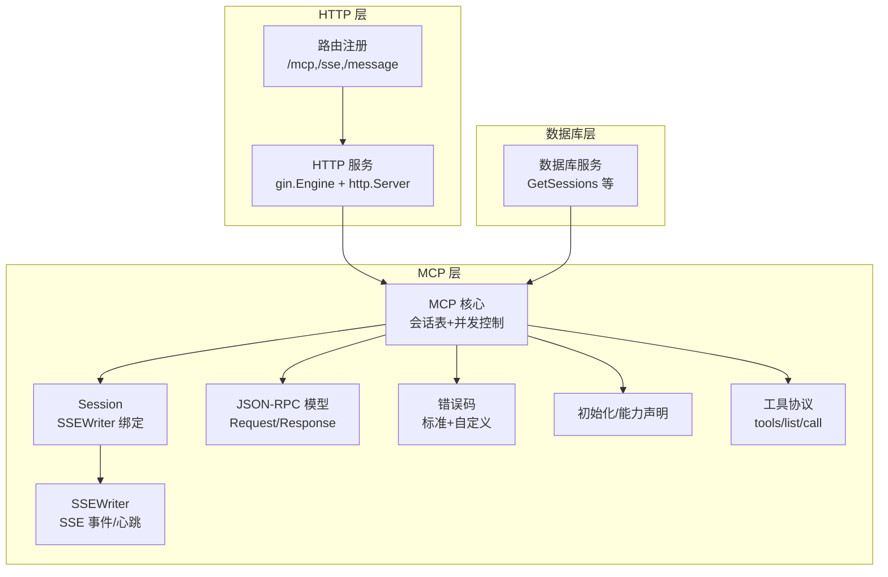
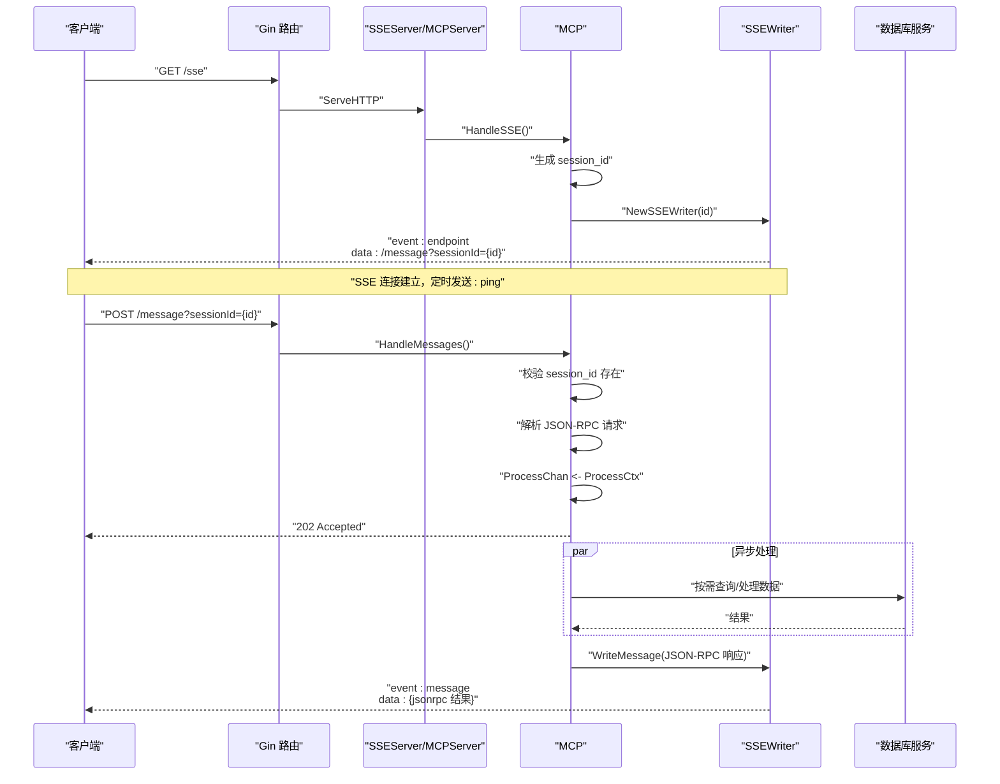
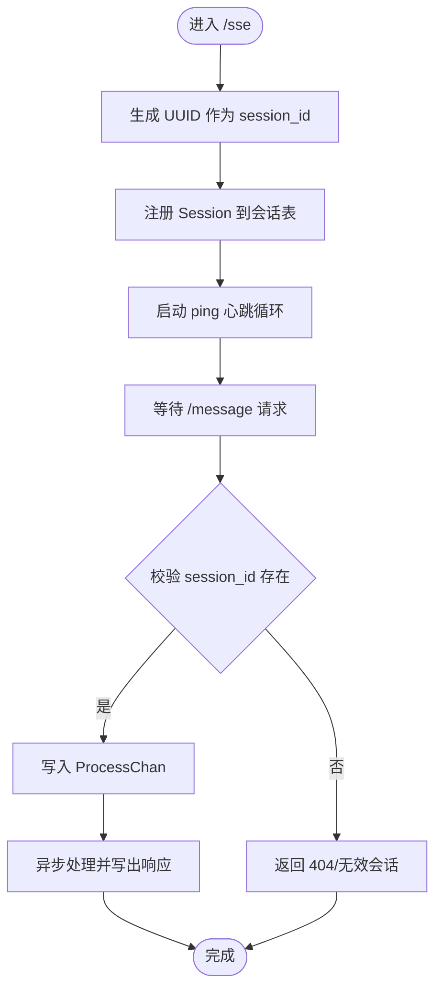
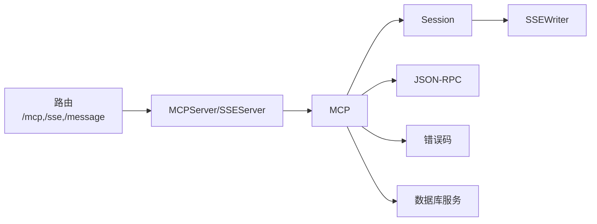

# 会话管理

<cite>
**本文引用的文件**
- [internal/mcp/mcp.go](file://internal/mcp/mcp.go)
- [internal/mcp/session.go](file://internal/mcp/session.go)
- [internal/mcp/sse.go](file://internal/mcp/sse.go)
- [internal/mcp/jsonrpc.go](file://internal/mcp/jsonrpc.go)
- [internal/mcp/error.go](file://internal/mcp/error.go)
- [internal/mcp/initialize.go](file://internal/mcp/initialize.go)
- [internal/mcp/tool.go](file://internal/mcp/tool.go)
- [internal/chatlog/http/mcp.go](file://internal/chatlog/http/mcp.go)
- [internal/chatlog/http/route.go](file://internal/chatlog/http/route.go)
- [internal/chatlog/http/service.go](file://internal/chatlog/http/service.go)
- [internal/chatlog/database/service.go](file://internal/chatlog/database/service.go)
- [internal/chatlog/conf/server.go](file://internal/chatlog/conf/server.go)
- [internal/model/session.go](file://internal/model/session.go)
- [internal/wechatdb/repository/session.go](file://internal/wechatdb/repository/session.go)
</cite>

## 目录
1. [简介](#简介)
2. [项目结构](#项目结构)
3. [核心组件](#核心组件)
4. [架构总览](#架构总览)
5. [组件详解](#组件详解)
6. [依赖关系分析](#依赖关系分析)
7. [性能考量](#性能考量)
8. [故障排除指南](#故障排除指南)
9. [结论](#结论)
10. [附录](#附录)

## 简介
本文件聚焦于 MCP（Model Context Protocol）会话管理，系统性阐述会话生命周期、创建、维护与销毁；解释会话 ID 的生成与校验策略；梳理会话状态跟踪与并发控制；阐明会话与 HTTP 请求的绑定关系；并给出超时与异常处理、配置项、性能优化与故障排除建议。目标是帮助开发者与运维人员快速理解并稳定运行会话管理功能。

## 项目结构
围绕会话管理的关键模块分布如下：
- HTTP 层：路由注册、MCPServer/SSEServer 绑定、工具方法处理入口
- MCP 层：会话对象、SSE 写入器、JSON-RPC 请求/响应模型、错误码定义、初始化与工具协议
- 数据库层：会话数据读取接口封装
- 配置层：HTTP 地址等服务配置

图表来源
- [internal/chatlog/http/route.go](file://internal/chatlog/http/route.go#L65-L75)
- [internal/chatlog/http/service.go](file://internal/chatlog/http/service.go#L16-L26)
- [internal/mcp/mcp.go](file://internal/mcp/mcp.go#L17-L29)
- [internal/mcp/session.go](file://internal/mcp/session.go#L10-L14)
- [internal/mcp/sse.go](file://internal/mcp/sse.go#L16-L14)
- [internal/mcp/jsonrpc.go](file://internal/mcp/jsonrpc.go#L17-L41)
- [internal/mcp/error.go](file://internal/mcp/error.go#L16-L33)
- [internal/mcp/initialize.go](file://internal/mcp/initialize.go#L27-L66)
- [internal/mcp/tool.go](file://internal/mcp/tool.go#L88-L98)
- [internal/chatlog/database/service.go](file://internal/chatlog/database/service.go#L102-L105)

章节来源
- [internal/chatlog/http/route.go](file://internal/chatlog/http/route.go#L65-L75)
- [internal/chatlog/http/service.go](file://internal/chatlog/http/service.go#L16-L26)
- [internal/mcp/mcp.go](file://internal/mcp/mcp.go#L17-L29)
- [internal/mcp/session.go](file://internal/mcp/session.go#L10-L14)
- [internal/mcp/sse.go](file://internal/mcp/sse.go#L16-L14)
- [internal/mcp/jsonrpc.go](file://internal/mcp/jsonrpc.go#L17-L41)
- [internal/mcp/error.go](file://internal/mcp/error.go#L16-L33)
- [internal/mcp/initialize.go](file://internal/mcp/initialize.go#L27-L66)
- [internal/mcp/tool.go](file://internal/mcp/tool.go#L88-L98)
- [internal/chatlog/database/service.go](file://internal/chatlog/database/service.go#L102-L105)

## 核心组件
- 会话对象 Session：封装 SSE 写入器与客户端信息，负责 JSON-RPC 响应/错误写出
- MCP：维护会话映射与并发安全，接收消息请求并投递到处理通道
- SSEWriter：建立并维持 SSE 连接，发送 endpoint/ping 事件，周期性心跳
- JSON-RPC：统一请求/响应结构，配合错误包装
- 工具协议与初始化：声明能力、工具清单与调用
- HTTP 路由与服务：暴露 /mcp、/sse、/message 接口，集成 MCPServer/SSEServer

章节来源
- [internal/mcp/session.go](file://internal/mcp/session.go#L10-L48)
- [internal/mcp/mcp.go](file://internal/mcp/mcp.go#L17-L51)
- [internal/mcp/sse.go](file://internal/mcp/sse.go#L16-L76)
- [internal/mcp/jsonrpc.go](file://internal/mcp/jsonrpc.go#L17-L41)
- [internal/mcp/tool.go](file://internal/mcp/tool.go#L88-L98)
- [internal/mcp/initialize.go](file://internal/mcp/initialize.go#L27-L66)
- [internal/chatlog/http/route.go](file://internal/chatlog/http/route.go#L65-L75)

## 架构总览
下图展示从 HTTP 请求到会话创建、消息处理与响应写出的整体流程。

图表来源
- [internal/mcp/mcp.go](file://internal/mcp/mcp.go#L31-L45)
- [internal/mcp/mcp.go](file://internal/mcp/mcp.go#L53-L98)
- [internal/mcp/sse.go](file://internal/mcp/sse.go#L21-L76)
- [internal/chatlog/http/route.go](file://internal/chatlog/http/route.go#L65-L75)
- [internal/chatlog/http/mcp.go](file://internal/chatlog/http/mcp.go#L163-L189)

## 组件详解

### 会话生命周期管理
- 创建：客户端发起 /sse，服务端在 HandleSSE 中生成唯一 session_id，并将 Session 注册进会话表
- 维护：SSEWriter 在后台定时发送 : ping，保持连接活跃；Session 绑定 SSEWriter，可向客户端推送消息
- 销毁：当客户端断开或上下文取消时，HandleSSE 中删除会话表项，释放资源

图表来源
- [internal/mcp/mcp.go](file://internal/mcp/mcp.go#L31-L45)
- [internal/mcp/mcp.go](file://internal/mcp/mcp.go#L53-L98)
- [internal/mcp/sse.go](file://internal/mcp/sse.go#L52-L76)

章节来源
- [internal/mcp/mcp.go](file://internal/mcp/mcp.go#L31-L45)
- [internal/mcp/mcp.go](file://internal/mcp/mcp.go#L53-L98)
- [internal/mcp/sse.go](file://internal/mcp/sse.go#L52-L76)

### 会话 ID 的生成与验证机制
- 生成：HandleSSE 使用唯一标识符生成 session_id
- 校验：HandleMessages 依次尝试从 query/param 获取 session_id，若缺失或不存在则返回相应错误码
- 作用域：session_id 通过 URL 参数传递，绑定后续 /message 请求与 SSE 连接

章节来源
- [internal/mcp/mcp.go](file://internal/mcp/mcp.go#L32-L35)
- [internal/mcp/mcp.go](file://internal/mcp/mcp.go#L61-L72)
- [internal/mcp/mcp.go](file://internal/mcp/mcp.go#L74-L79)

### 会话状态跟踪与并发控制
- 会话表：MCP 内部以 map[string]*Session 存储会话
- 并发：使用互斥锁保护会话表的读写；处理通道 ProcessChan 限制积压，避免过载
- 资源回收：SSE 连接断开时清理会话表项

章节来源
- [internal/mcp/mcp.go](file://internal/mcp/mcp.go#L17-L29)
- [internal/mcp/mcp.go](file://internal/mcp/mcp.go#L33-L35)
- [internal/mcp/mcp.go](file://internal/mcp/mcp.go#L42-L44)

### 会话与 HTTP 请求的绑定关系
- /sse：建立 SSE 连接，返回 endpoint 与 session_id
- /message：携带 session_id，服务端据此定位 Session 并处理请求
- /mcp：透传至 MCPServer，供 MCP 协议客户端使用

章节来源
- [internal/chatlog/http/route.go](file://internal/chatlog/http/route.go#L65-L75)
- [internal/mcp/sse.go](file://internal/mcp/sse.go#L63-L70)
- [internal/mcp/mcp.go](file://internal/mcp/mcp.go#L61-L72)

### 会话超时与异常处理
- 连接保活：SSEWriter 定期发送 : ping，维持长连接
- 请求异常：校验失败、会话不存在、队列满等情况返回对应 JSON-RPC/HTTP 错误
- 资源释放：连接断开自动清理会话

章节来源
- [internal/mcp/sse.go](file://internal/mcp/sse.go#L74-L76)
- [internal/mcp/error.go](file://internal/mcp/error.go#L23-L33)
- [internal/mcp/mcp.go](file://internal/mcp/mcp.go#L68-L95)

### 会话与工具调用
- 工具清单与调用：通过 tools/list 与 tools/call 协议交互
- 初始化：客户端发送 initialize，声明协议版本与能力，服务端返回默认能力集合
- 响应：工具调用返回 JSON-RPC result，包含 content/isError 字段

章节来源
- [internal/mcp/tool.go](file://internal/mcp/tool.go#L88-L98)
- [internal/mcp/tool.go](file://internal/mcp/tool.go#L117-L120)
- [internal/mcp/tool.go](file://internal/mcp/tool.go#L135-L138)
- [internal/mcp/initialize.go](file://internal/mcp/initialize.go#L27-L66)

### 会话与数据库交互
- 会话列表：HTTP 层提供 /api/v1/session，内部调用数据库服务的 GetSessions
- 数据模型：会话实体包含用户名、排序、昵称、内容、时间等字段

章节来源
- [internal/chatlog/http/route.go](file://internal/chatlog/http/route.go#L247-L293)
- [internal/chatlog/database/service.go](file://internal/chatlog/database/service.go#L102-L105)
- [internal/model/session.go](file://internal/model/session.go#L8-L14)

## 依赖关系分析
- HTTP 路由将 /mcp、/sse、/message 交由 MCPServer/SSEServer 处理
- MCP 核心持有会话表与处理通道，Session 绑定 SSEWriter
- JSON-RPC 模型与错误码贯穿请求/响应与异常路径
- 数据库服务提供会话与消息查询能力

图表来源
- [internal/chatlog/http/route.go](file://internal/chatlog/http/route.go#L65-L75)
- [internal/mcp/mcp.go](file://internal/mcp/mcp.go#L17-L29)
- [internal/mcp/session.go](file://internal/mcp/session.go#L10-L14)
- [internal/mcp/sse.go](file://internal/mcp/sse.go#L16-L14)
- [internal/mcp/jsonrpc.go](file://internal/mcp/jsonrpc.go#L17-L41)
- [internal/mcp/error.go](file://internal/mcp/error.go#L16-L33)
- [internal/chatlog/database/service.go](file://internal/chatlog/database/service.go#L102-L105)

章节来源
- [internal/chatlog/http/route.go](file://internal/chatlog/http/route.go#L65-L75)
- [internal/mcp/mcp.go](file://internal/mcp/mcp.go#L17-L29)
- [internal/mcp/session.go](file://internal/mcp/session.go#L10-L14)
- [internal/mcp/sse.go](file://internal/mcp/sse.go#L16-L14)
- [internal/mcp/jsonrpc.go](file://internal/mcp/jsonrpc.go#L17-L41)
- [internal/mcp/error.go](file://internal/mcp/error.go#L16-L33)
- [internal/chatlog/database/service.go](file://internal/chatlog/database/service.go#L102-L105)

## 性能考量
- 处理通道容量：ProcessChanCap 控制积压上限，避免内存膨胀
- SSE 心跳间隔：SSEPingIntervalS 控制 ping 发送频率，平衡保活与开销
- 会话并发：sessionMu 串行化会话表操作，保证一致性
- HTTP 服务器：ReleaseMode、中间件与优雅关闭减少阻塞
- 数据查询：合理设置 limit/offset，避免一次性拉取大量会话

章节来源
- [internal/mcp/mcp.go](file://internal/mcp/mcp.go#L13-L15)
- [internal/mcp/sse.go](file://internal/mcp/sse.go#L10-L14)
- [internal/chatlog/http/service.go](file://internal/chatlog/http/service.go#L34-L48)

## 故障排除指南
- 无效会话 ID
  - 现象：/message 返回 400 或 404
  - 排查：确认 session_id 是否随 URL 参数传递，是否与 /sse 返回一致
- 请求过载
  - 现象：返回 429 Too Many Requests
  - 排查：检查 ProcessChan 是否积压，适当增大容量或限流
- 连接中断
  - 现象：客户端收不到消息或频繁断连
  - 排查：确认网络代理与超时设置；检查 SSEWriter 的 ping 是否持续
- 初始化失败
  - 现象：客户端无法获取工具列表
  - 排查：核对 initialize 请求的 protocolVersion 与 capabilities

章节来源
- [internal/mcp/mcp.go](file://internal/mcp/mcp.go#L61-L72)
- [internal/mcp/mcp.go](file://internal/mcp/mcp.go#L74-L79)
- [internal/mcp/mcp.go](file://internal/mcp/mcp.go#L89-L95)
- [internal/mcp/sse.go](file://internal/mcp/sse.go#L52-L60)
- [internal/mcp/initialize.go](file://internal/mcp/initialize.go#L27-L66)

## 结论
该会话管理体系以 SSE 为基础，结合 MCP 协议与 JSON-RPC，实现了从连接建立、请求处理到响应推送的完整闭环。通过会话表与互斥锁保障并发安全，借助处理通道与心跳机制提升稳定性。配合合理的配置与监控，可在生产环境中可靠地支撑会话管理需求。

## 附录

### 会话配置选项
- HTTP 地址：服务监听地址，默认值见配置常量
- 其他：可通过配置加载机制扩展（如日志、跨域等）

章节来源
- [internal/chatlog/conf/server.go](file://internal/chatlog/conf/server.go#L3-L5)
- [internal/chatlog/conf/server.go](file://internal/chatlog/conf/server.go#L51-L56)

### 最佳实践
- 明确区分 /mcp、/sse、/message 的职责边界
- 严格校验 session_id 来源，避免跨会话混淆
- 控制处理通道容量与业务处理耗时，防止队列积压
- 使用 SSE ping 保持连接健康，及时发现断连
- 对工具调用进行参数校验与超时控制

### 常见问题与解决
- 会话找不到：确认 session_id 是否正确传递且未过期
- 响应延迟：检查处理通道是否拥塞，必要时扩容
- 跨域问题：确保 CORS 中间件正确配置
- 数据量过大：分页查询 limit/offset，避免一次性传输过多数据