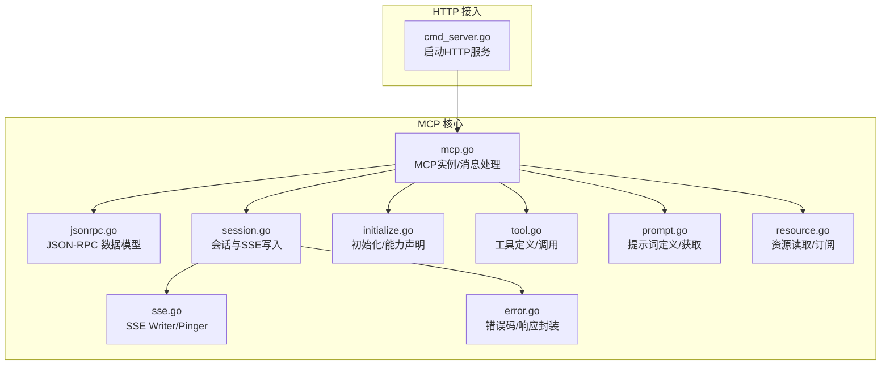
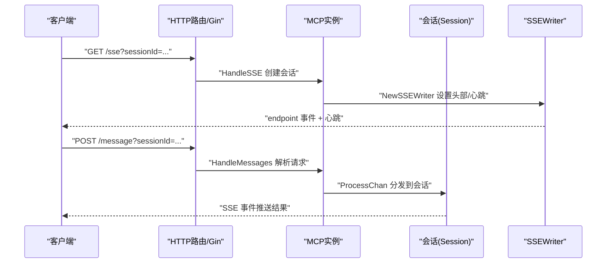
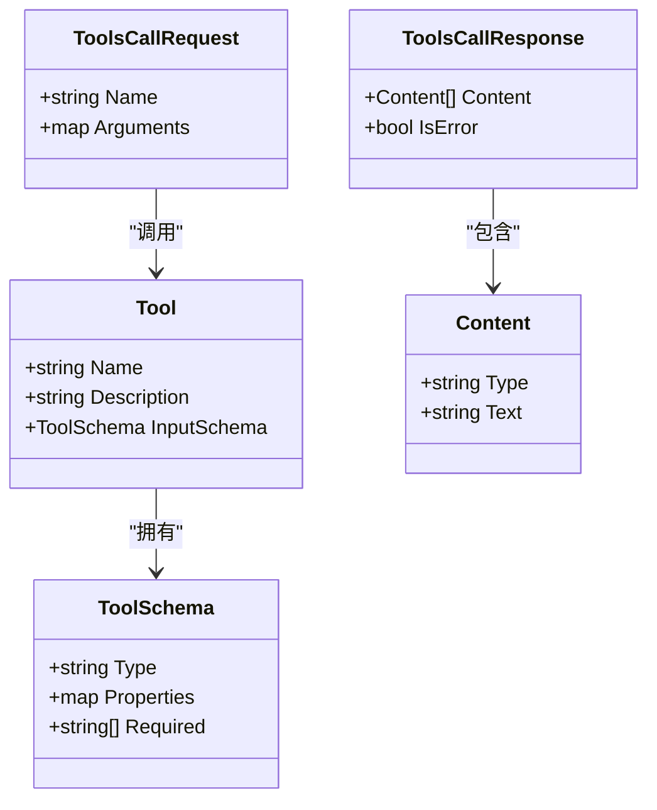
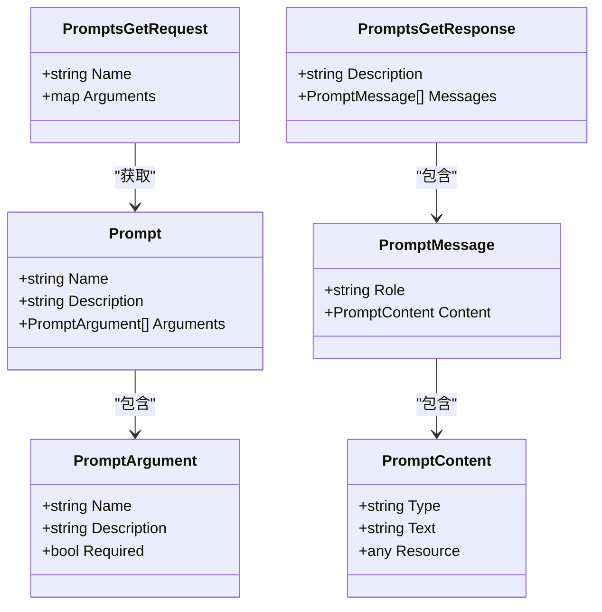
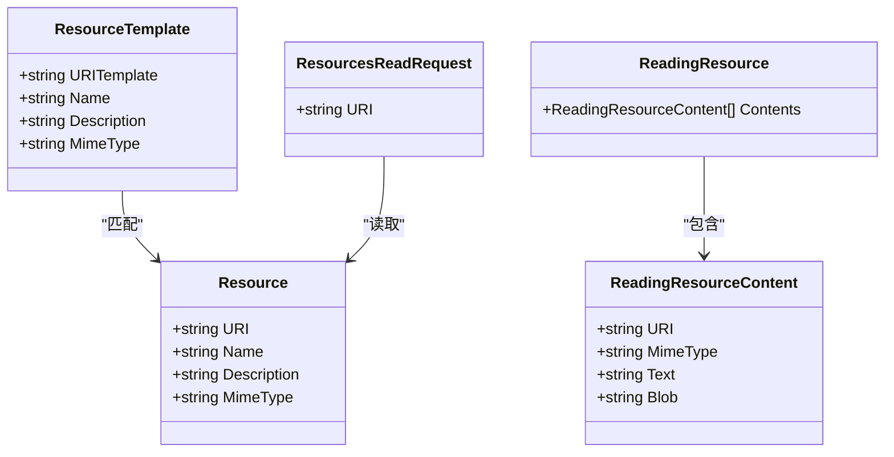
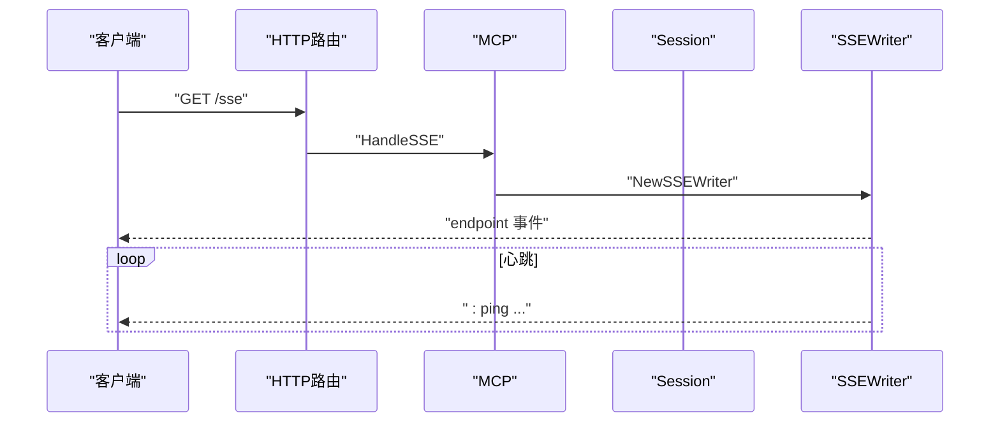
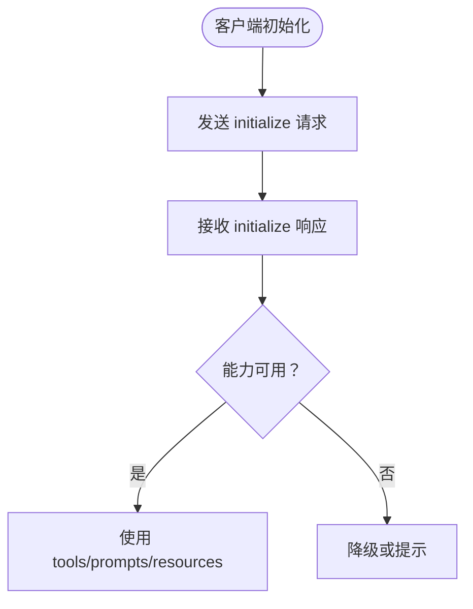
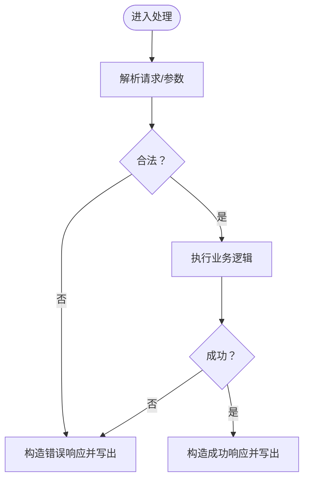
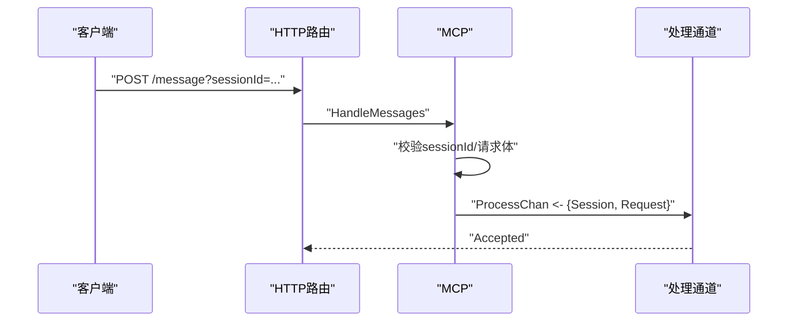
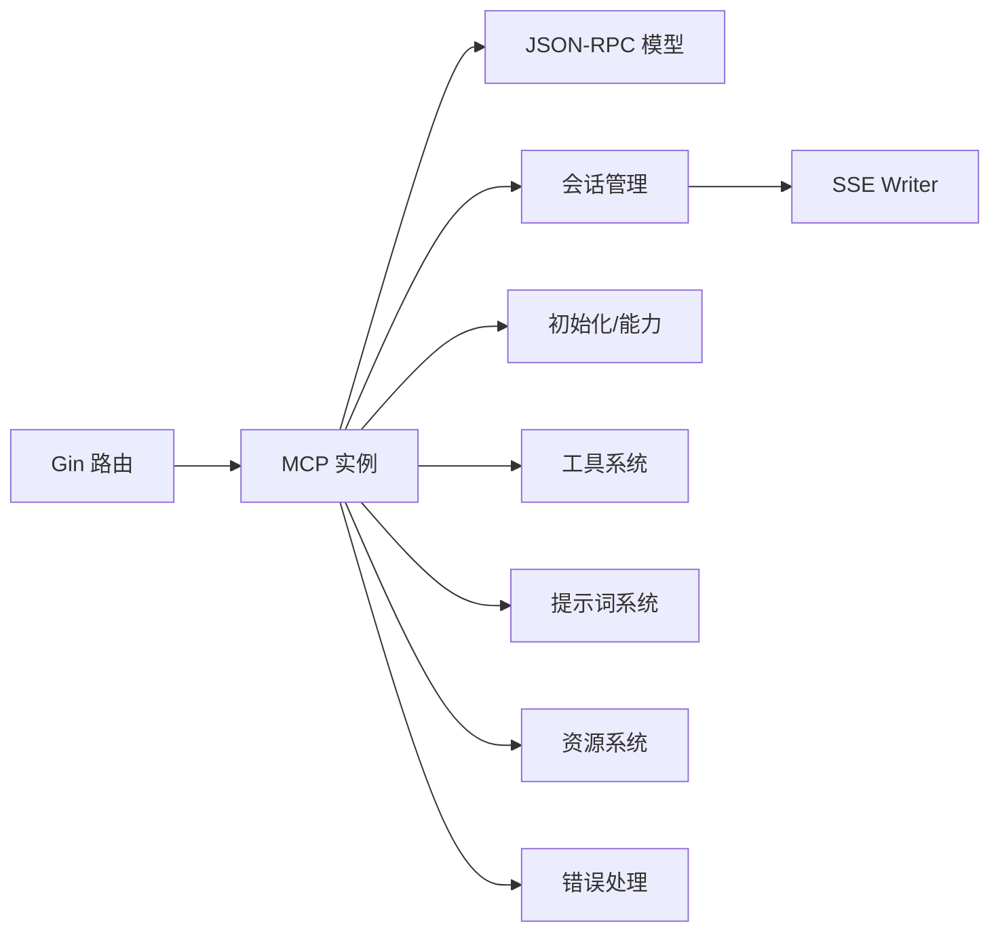

# 工具集成

<cite>
**本文引用的文件**
- [internal/mcp/tool.go](file://internal/mcp/tool.go)
- [internal/mcp/prompt.go](file://internal/mcp/prompt.go)
- [internal/mcp/resource.go](file://internal/mcp/resource.go)
- [internal/mcp/jsonrpc.go](file://internal/mcp/jsonrpc.go)
- [internal/mcp/session.go](file://internal/mcp/session.go)
- [internal/mcp/sse.go](file://internal/mcp/sse.go)
- [internal/mcp/error.go](file://internal/mcp/error.go)
- [internal/mcp/initialize.go](file://internal/mcp/initialize.go)
- [internal/mcp/mcp.go](file://internal/mcp/mcp.go)
- [docs/mcp.md](file://docs/mcp.md)
- [docs/prompt.md](file://docs/prompt.md)
- [cmd/chatlog/cmd_server.go](file://cmd/chatlog/cmd_server.go)
</cite>

## 目录
1. [简介](#简介)
2. [项目结构](#项目结构)
3. [核心组件](#核心组件)
4. [架构总览](#架构总览)
5. [组件详解](#组件详解)
6. [依赖关系分析](#依赖关系分析)
7. [性能考量](#性能考量)
8. [故障排查指南](#故障排查指南)
9. [结论](#结论)
10. [附录](#附录)

## 简介
本文件面向希望在系统中集成 MCP（Model Context Protocol）工具链的开发者与使用者，系统性阐述工具的定义、注册与调用机制；明确工具接口规范、参数传递与结果处理流程；解释提示词（Prompt）管理系统的实现与使用方法；覆盖内置工具能力说明、自定义工具开发指南与工具配置选项；并提供实际调用示例、错误处理策略与性能优化建议，以及工具安全与权限控制要点。

## 项目结构
围绕 MCP 的实现主要集中在 internal/mcp 目录，涵盖 JSON-RPC 请求/响应、SSE 传输、会话管理、工具与提示词的数据模型，以及初始化与错误处理等模块。HTTP 层通过 Gin 路由接入，MCP 实例负责消息分发与会话生命周期管理。

图表来源
- [internal/mcp/jsonrpc.go](file://internal/mcp/jsonrpc.go#L1-L63)
- [internal/mcp/session.go](file://internal/mcp/session.go#L1-L49)
- [internal/mcp/sse.go](file://internal/mcp/sse.go#L1-L161)
- [internal/mcp/initialize.go](file://internal/mcp/initialize.go#L1-L79)
- [internal/mcp/tool.go](file://internal/mcp/tool.go#L1-L144)
- [internal/mcp/prompt.go](file://internal/mcp/prompt.go#L1-L138)
- [internal/mcp/resource.go](file://internal/mcp/resource.go#L1-L75)
- [internal/mcp/error.go](file://internal/mcp/error.go#L1-L56)
- [internal/mcp/mcp.go](file://internal/mcp/mcp.go#L1-L108)
- [cmd/chatlog/cmd_server.go](file://cmd/chatlog/cmd_server.go#L1-L79)

章节来源
- [internal/mcp/mcp.go](file://internal/mcp/mcp.go#L1-L108)
- [internal/mcp/jsonrpc.go](file://internal/mcp/jsonrpc.go#L1-L63)
- [internal/mcp/session.go](file://internal/mcp/session.go#L1-L49)
- [internal/mcp/sse.go](file://internal/mcp/sse.go#L1-L161)
- [internal/mcp/initialize.go](file://internal/mcp/initialize.go#L1-L79)
- [internal/mcp/tool.go](file://internal/mcp/tool.go#L1-L144)
- [internal/mcp/prompt.go](file://internal/mcp/prompt.go#L1-L138)
- [internal/mcp/resource.go](file://internal/mcp/resource.go#L1-L75)
- [internal/mcp/error.go](file://internal/mcp/error.go#L1-L56)
- [cmd/chatlog/cmd_server.go](file://cmd/chatlog/cmd_server.go#L1-L79)

## 核心组件
- JSON-RPC 数据模型：统一请求/响应/通知结构，保证与 MCP 协议兼容。
- 会话与传输：基于 SSE 的长连接会话，支持心跳与端点下发。
- 初始化与能力：声明协议版本与服务端能力，供客户端协商。
- 工具系统：工具清单与调用，参数采用 JSON Schema 校验，返回内容为多段文本。
- 提示词系统：提示词清单与获取，支持参数化模板与消息序列。
- 资源系统：资源与模板的列举、读取与订阅变更通知。
- 错误处理：标准 JSON-RPC 错误码与扩展错误，统一封装响应。

章节来源
- [internal/mcp/jsonrpc.go](file://internal/mcp/jsonrpc.go#L1-L63)
- [internal/mcp/session.go](file://internal/mcp/session.go#L1-L49)
- [internal/mcp/sse.go](file://internal/mcp/sse.go#L1-L161)
- [internal/mcp/initialize.go](file://internal/mcp/initialize.go#L1-L79)
- [internal/mcp/tool.go](file://internal/mcp/tool.go#L1-L144)
- [internal/mcp/prompt.go](file://internal/mcp/prompt.go#L1-L138)
- [internal/mcp/resource.go](file://internal/mcp/resource.go#L1-L75)
- [internal/mcp/error.go](file://internal/mcp/error.go#L1-L56)

## 架构总览
MCP 通过 HTTP 接入，SSE 作为默认传输。客户端发起初始化握手后，服务端返回能力声明；随后客户端可查询工具清单、调用工具或获取提示词。所有消息均以 JSON-RPC 2.0 格式承载，错误与响应均有统一结构。

图表来源
- [internal/mcp/mcp.go](file://internal/mcp/mcp.go#L31-L98)
- [internal/mcp/session.go](file://internal/mcp/session.go#L16-L44)
- [internal/mcp/sse.go](file://internal/mcp/sse.go#L21-L76)

章节来源
- [internal/mcp/mcp.go](file://internal/mcp/mcp.go#L1-L108)
- [internal/mcp/sse.go](file://internal/mcp/sse.go#L1-L161)
- [internal/mcp/session.go](file://internal/mcp/session.go#L1-L49)

## 组件详解

### 工具（Tools）
- 工具定义：包含唯一名称、可选描述与输入参数的 JSON Schema。调用时通过 tools/call 方法提交名称与参数对象。
- 参数校验：inputSchema.type 为 object，properties 定义字段，required 列表声明必填项。
- 调用响应：tools/call 返回 content 数组（每项含 type 与 text），以及 isError 标志位。
- 注册机制：客户端通过 tools/list 获取可用工具清单；服务端在初始化阶段声明工具能力。
- 结果处理：content 支持多段文本，便于流式或分段输出；isError 为 true 时表示调用失败。

图表来源
- [internal/mcp/tool.go](file://internal/mcp/tool.go#L88-L144)

章节来源
- [internal/mcp/tool.go](file://internal/mcp/tool.go#L1-L144)
- [internal/mcp/initialize.go](file://internal/mcp/initialize.go#L73-L79)

### 提示词（Prompts）
- 提示词定义：包含名称、可选描述与参数列表（名称、描述、是否必填）。
- 列表与获取：prompts/list 返回可用提示词清单；prompts/get 根据名称与参数返回描述与消息序列。
- 消息结构：每条消息包含 role 与 content（text 或 resource），支持资源型内容。
- 使用方法：客户端在对话中通过 prompts/get 获取模板化消息，再交由模型推理。

图表来源
- [internal/mcp/prompt.go](file://internal/mcp/prompt.go#L24-L103)

章节来源
- [internal/mcp/prompt.go](file://internal/mcp/prompt.go#L1-L138)

### 资源（Resources）
- 资源与模板：支持直接资源（URI、名称、MIME）与 URI 模板两类；模板遵循 RFC 6570。
- 读取与订阅：resources/read 读取指定资源；resources/subscribe 与 resources/unsubscribe 控制订阅；服务端通过 notifications 发出 list_changed 与 updated 通知。
- 应用场景：结合提示词与工具，将日志、代码片段等作为资源注入模型上下文。

图表来源
- [internal/mcp/resource.go](file://internal/mcp/resource.go#L26-L75)

章节来源
- [internal/mcp/resource.go](file://internal/mcp/resource.go#L1-L75)

### 会话与传输（SSE）
- 会话创建：HandleSSE 生成 session_id 并绑定 SSE Writer；客户端收到 endpoint 事件，携带 /message 的查询参数。
- 心跳与保活：SSEWriter 定期发送 ping 事件，维持连接活性。
- 写入与关闭：Session.Write/WriteResponse/WriteError 统一 JSON-RPC 响应写入；会话结束清理。

图表来源
- [internal/mcp/mcp.go](file://internal/mcp/mcp.go#L31-L45)
- [internal/mcp/sse.go](file://internal/mcp/sse.go#L63-L76)
- [internal/mcp/session.go](file://internal/mcp/session.go#L16-L44)

章节来源
- [internal/mcp/sse.go](file://internal/mcp/sse.go#L1-L161)
- [internal/mcp/session.go](file://internal/mcp/session.go#L1-L49)
- [internal/mcp/mcp.go](file://internal/mcp/mcp.go#L1-L108)

### 初始化与能力声明
- 初始化请求：包含 protocolVersion、capabilities 与 clientInfo。
- 初始化响应：包含 protocolVersion、capabilities 与 serverInfo；默认声明 prompts、resources、tools 能力。
- 能力协商：客户端可据此决定是否启用相应功能。

图表来源
- [internal/mcp/initialize.go](file://internal/mcp/initialize.go#L27-L79)

章节来源
- [internal/mcp/initialize.go](file://internal/mcp/initialize.go#L1-L79)

### 错误处理
- 标准错误码：遵循 JSON-RPC 2.0 标准错误码范围。
- 扩展错误：包含无效会话 ID、会话未找到、请求过多等。
- 统一封装：NewErrorResponse 生成带 id 的错误响应；Session.WriteError 用于直接写出错误。

图表来源
- [internal/mcp/error.go](file://internal/mcp/error.go#L23-L55)
- [internal/mcp/session.go](file://internal/mcp/session.go#L27-L44)

章节来源
- [internal/mcp/error.go](file://internal/mcp/error.go#L1-L56)
- [internal/mcp/session.go](file://internal/mcp/session.go#L1-L49)

### JSON-RPC 与消息处理
- 请求/响应/通知：Request/Response/Notification 统一结构，ID 可为数字或字符串。
- 消息入口：HandleMessages 解析 sessionId，查找会话，投递到 ProcessChan；默认阻塞队列容量有限，避免过载。
- 会话管理：GetSession 提供并发安全访问；Close 关闭处理通道。

图表来源
- [internal/mcp/mcp.go](file://internal/mcp/mcp.go#L53-L98)
- [internal/mcp/jsonrpc.go](file://internal/mcp/jsonrpc.go#L17-L62)

章节来源
- [internal/mcp/mcp.go](file://internal/mcp/mcp.go#L1-L108)
- [internal/mcp/jsonrpc.go](file://internal/mcp/jsonrpc.go#L1-L63)

## 依赖关系分析
- 模块内聚：各子系统（工具、提示词、资源、会话、传输、错误）边界清晰，通过 JSON-RPC 与会话耦合。
- 外部依赖：Gin 用于 HTTP 路由与 SSE 写入；UUID 用于会话标识；ZeroLog 用于日志。
- 并发与背压：ProcessChan 限制处理速率，防止过载；SSE 心跳保障连接健康。

图表来源
- [internal/mcp/mcp.go](file://internal/mcp/mcp.go#L1-L108)
- [internal/mcp/sse.go](file://internal/mcp/sse.go#L1-L161)
- [internal/mcp/initialize.go](file://internal/mcp/initialize.go#L1-L79)
- [internal/mcp/tool.go](file://internal/mcp/tool.go#L1-L144)
- [internal/mcp/prompt.go](file://internal/mcp/prompt.go#L1-L138)
- [internal/mcp/resource.go](file://internal/mcp/resource.go#L1-L75)
- [internal/mcp/error.go](file://internal/mcp/error.go#L1-L56)

章节来源
- [internal/mcp/mcp.go](file://internal/mcp/mcp.go#L1-L108)

## 性能考量
- 传输选择：SSE 适合实时双向事件推送；若客户端不支持 SSE，可借助代理将 stdio 转换为 SSE。
- 会话与通道：合理设置 ProcessChanCap，避免阻塞；SSEPingIntervalS 降低心跳频率可节省带宽但需权衡连接保活。
- 背压与限流：HandleMessages 对通道满载返回 429，避免系统过载；建议在上游增加限速与熔断。
- 日志与可观测性：使用 ZeroLog 记录关键事件；在高并发场景下减少冗余日志级别。

## 故障排查指南
- 无效会话 ID：当 sessionId 为空或不匹配时，返回 400；确认客户端传参与路由查询参数一致。
- 会话未找到：当 sessionId 不存在于内存映射中，返回 404；检查 /sse 是否已建立且未超时。
- 请求过多：ProcessChan 满载返回 429；建议前端重试退避与节流。
- JSON 解析错误：HandleMessages 对请求体解析失败返回 400；检查 JSON 格式与字段命名。
- SSE 连接中断：检查客户端网络与代理；确认服务端 ping 事件持续发送。

章节来源
- [internal/mcp/mcp.go](file://internal/mcp/mcp.go#L53-L98)
- [internal/mcp/error.go](file://internal/mcp/error.go#L23-L33)
- [internal/mcp/sse.go](file://internal/mcp/sse.go#L52-L76)

## 结论
本实现严格遵循 MCP 协议，提供工具、提示词与资源三大能力的完整数据模型与传输层支撑。通过 SSE 与 JSON-RPC 的组合，既满足实时交互需求，又具备良好的扩展性与安全性基础。建议在生产环境配合限流、鉴权与审计机制，确保稳定与合规。

## 附录

### 工具接口规范与调用示例
- 工具清单：客户端通过 tools/list 获取可用工具；服务端在初始化阶段声明工具能力。
- 工具调用：客户端发送 tools/call，包含 name 与 arguments；服务端按 inputSchema 校验参数，返回 content 数组与 isError 标志。
- 示例参考：见工具定义注释中的 JSON 示例与调用示例。

章节来源
- [internal/mcp/tool.go](file://internal/mcp/tool.go#L1-L144)
- [internal/mcp/initialize.go](file://internal/mcp/initialize.go#L73-L79)

### 提示词管理使用方法
- 列表与获取：prompts/list 与 prompts/get；arguments 支持必填参数校验。
- 消息序列：返回 messages 数组，每条包含 role 与 content（text 或 resource）。
- 使用建议：结合资源系统将外部数据注入消息，提升上下文质量。

章节来源
- [internal/mcp/prompt.go](file://internal/mcp/prompt.go#L1-L138)

### 自定义工具开发指南
- 定义工具：在服务端注册 Tool，提供唯一 name、可读描述与 inputSchema。
- 参数设计：使用 JSON Schema 的 properties 与 required 精确约束参数。
- 调用实现：在工具调用入口根据 arguments 执行业务逻辑，组装 Content 数组返回。
- 错误处理：出现异常时设置 isError=true，并在 content 中提供可读错误摘要。

章节来源
- [internal/mcp/tool.go](file://internal/mcp/tool.go#L88-L144)
- [internal/mcp/error.go](file://internal/mcp/error.go#L39-L55)

### 工具配置选项与部署
- 启动 HTTP 服务：通过命令行参数配置监听地址、平台、版本、数据目录、密钥、工作目录与自动解密开关。
- 客户端对接：支持 SSE 与 stdio（通过代理）两种传输；详见文档示例与截图指引。

章节来源
- [cmd/chatlog/cmd_server.go](file://cmd/chatlog/cmd_server.go#L1-L79)
- [docs/mcp.md](file://docs/mcp.md#L1-L152)

### 安全考虑与权限控制
- 会话隔离：每个 SSE 连接对应独立 session_id，避免跨会话干扰。
- 参数校验：inputSchema 与 prompts.get 的 arguments 字段用于参数合法性约束。
- 传输安全：建议在反向代理层启用 TLS；对敏感参数与返回内容进行脱敏处理。
- 权限控制：可在 HandleMessages 前增加鉴权中间件，仅授权用户可创建会话与调用工具。

章节来源
- [internal/mcp/mcp.go](file://internal/mcp/mcp.go#L53-L98)
- [internal/mcp/tool.go](file://internal/mcp/tool.go#L94-L98)
- [internal/mcp/prompt.go](file://internal/mcp/prompt.go#L30-L34)