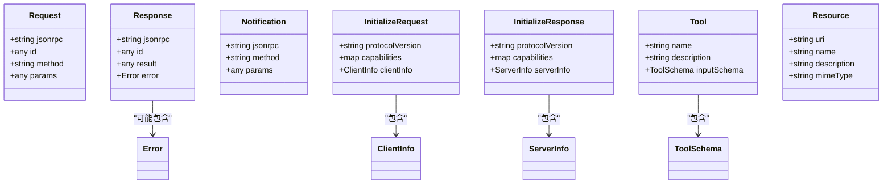

# 流式传输支持

<cite>
**本文引用的文件**
- [internal/mcp/sse.go](file://internal/mcp/sse.go)
- [internal/mcp/session.go](file://internal/mcp/session.go)
- [internal/mcp/mcp.go](file://internal/mcp/mcp.go)
- [internal/mcp/jsonrpc.go](file://internal/mcp/jsonrpc.go)
- [internal/mcp/tool.go](file://internal/mcp/tool.go)
- [internal/mcp/resource.go](file://internal/mcp/resource.go)
- [internal/mcp/initialize.go](file://internal/mcp/initialize.go)
- [internal/chatlog/http/mcp.go](file://internal/chatlog/http/mcp.go)
- [internal/chatlog/http/route.go](file://internal/chatlog/http/route.go)
- [internal/chatlog/conf/server.go](file://internal/chatlog/conf/server.go)
- [docs/mcp.md](file://docs/mcp.md)
- [internal/errors/mcp.go](file://internal/errors/mcp.go)
</cite>

## 目录
1. [简介](#简介)
2. [项目结构](#项目结构)
3. [核心组件](#核心组件)
4. [架构总览](#架构总览)
5. [组件详解](#组件详解)
6. [依赖关系分析](#依赖关系分析)
7. [性能考量](#性能考量)
8. [故障排查指南](#故障排查指南)
9. [结论](#结论)
10. [附录](#附录)

## 简介
本文件聚焦于 MCP（Model Context Protocol）在本项目中的流式传输支持，重点覆盖：
- SSE（Server-Sent Events）的工作原理与实现机制
- 流式数据传输的建立、维护与关闭流程
- STDIO 传输方式的实现现状与使用场景
- 流式传输的配置参数、缓冲区管理与性能调优
- 错误处理策略、重连机制与监控方法
- 实际示例与调试技巧

## 项目结构
围绕 MCP 流式传输的关键模块分布如下：
- HTTP 层：路由注册与服务桥接，负责将 SSE/STDIO 请求转发至 MCP 核心
- MCP 核心层：SSE 写入器、会话管理、JSON-RPC 数据模型与处理通道
- 工具与资源：工具定义、资源模型与初始化协议
- 文档与配置：MCP 使用指南与默认 HTTP 地址配置

图表来源
- [internal/chatlog/http/route.go](file://internal/chatlog/http/route.go#L65-L75)
- [internal/mcp/mcp.go](file://internal/mcp/mcp.go#L17-L29)
- [internal/mcp/session.go](file://internal/mcp/session.go#L10-L21)
- [internal/mcp/sse.go](file://internal/mcp/sse.go#L16-L35)
- [internal/mcp/jsonrpc.go](file://internal/mcp/jsonrpc.go#L17-L41)
- [internal/mcp/tool.go](file://internal/mcp/tool.go#L88-L98)
- [internal/mcp/resource.go](file://internal/mcp/resource.go#L26-L46)
- [internal/mcp/initialize.go](file://internal/mcp/initialize.go#L27-L61)

章节来源
- [internal/chatlog/http/route.go](file://internal/chatlog/http/route.go#L65-L75)
- [internal/chatlog/conf/server.go](file://internal/chatlog/conf/server.go#L3-L5)

## 核心组件
- SSEWriter：负责向客户端写入 SSE 事件，包含消息事件、端点事件与心跳 ping
- SSESession：基于 Gin 的 SSE 会话封装，提供事件发送与关闭
- Session：MCP 会话包装，将 JSON-RPC 响应写入底层 SSEWriter
- MCP：全局管理器，维护会话表与处理通道，处理消息请求
- JSON-RPC 模型：Request/Response/Notification 的结构化定义
- 工具与资源：工具清单与调用、资源清单与订阅
- 初始化协议：initialize/ping 等协议交互

章节来源
- [internal/mcp/sse.go](file://internal/mcp/sse.go#L16-L100)
- [internal/mcp/session.go](file://internal/mcp/session.go#L10-L49)
- [internal/mcp/mcp.go](file://internal/mcp/mcp.go#L17-L51)
- [internal/mcp/jsonrpc.go](file://internal/mcp/jsonrpc.go#L17-L62)
- [internal/mcp/tool.go](file://internal/mcp/tool.go#L88-L144)
- [internal/mcp/resource.go](file://internal/mcp/resource.go#L26-L74)
- [internal/mcp/initialize.go](file://internal/mcp/initialize.go#L27-L61)

## 架构总览
MCP 流式传输通过 HTTP 路由将请求分发到 SSE 或 Streamable HTTP 服务器，再由 MCP 管理器创建会话并写回事件。

图表来源
- [internal/chatlog/http/route.go](file://internal/chatlog/http/route.go#L65-L75)
- [internal/mcp/mcp.go](file://internal/mcp/mcp.go#L31-L45)
- [internal/mcp/session.go](file://internal/mcp/session.go#L16-L25)
- [internal/mcp/sse.go](file://internal/mcp/sse.go#L21-L76)

## 组件详解

### SSE 写入器与会话
- SSEWriter
  - 设置响应头为 text/event-stream，禁用缓存，保持长连接
  - 首次写入 endpoint 事件，携带会话 ID 参数
  - 提供 Write/WriteMessage/WriteEvent 接口，逐条 flush
  - 后台定时发送 ping 心跳，直到请求上下文取消
- SSESession
  - 基于 Gin 的 SSEvent 接口发送事件
  - 提供 Close 方法关闭会话

图表来源
- [internal/mcp/sse.go](file://internal/mcp/sse.go#L16-L100)

章节来源
- [internal/mcp/sse.go](file://internal/mcp/sse.go#L16-L100)

### 会话与消息处理
- Session
  - 包装 SSEWriter，提供 Write/WriteResponse/WriteError
  - 保存客户端信息以便后续使用
- MCP
  - 维护会话映射与处理通道
  - HandleSSE 创建会话并保持连接生命周期
  - HandleMessages 校验会话 ID、解析 JSON-RPC 请求并投递到处理通道
  - Close 关闭处理通道

图表来源
- [internal/mcp/mcp.go](file://internal/mcp/mcp.go#L53-L98)

章节来源
- [internal/mcp/session.go](file://internal/mcp/session.go#L16-L49)
- [internal/mcp/mcp.go](file://internal/mcp/mcp.go#L31-L98)

### JSON-RPC 模型与协议
- Request/Response/Notification 结构体定义
- 初始化与 Ping 协议版本与能力声明
- 工具与资源相关常量与结构

图表来源
- [internal/mcp/jsonrpc.go](file://internal/mcp/jsonrpc.go#L17-L62)
- [internal/mcp/initialize.go](file://internal/mcp/initialize.go#L27-L61)
- [internal/mcp/tool.go](file://internal/mcp/tool.go#L88-L98)
- [internal/mcp/resource.go](file://internal/mcp/resource.go#L26-L46)

章节来源
- [internal/mcp/jsonrpc.go](file://internal/mcp/jsonrpc.go#L17-L62)
- [internal/mcp/initialize.go](file://internal/mcp/initialize.go#L27-L61)
- [internal/mcp/tool.go](file://internal/mcp/tool.go#L88-L144)
- [internal/mcp/resource.go](file://internal/mcp/resource.go#L26-L74)

### HTTP 路由与服务桥接
- /mcp：交由 Streamable HTTP 服务器处理
- /sse 与 /message：交由 SSE 服务器处理
- 默认 HTTP 地址为 0.0.0.0:5030

图表来源
- [internal/chatlog/http/route.go](file://internal/chatlog/http/route.go#L65-L75)
- [internal/chatlog/conf/server.go](file://internal/chatlog/conf/server.go#L3-L5)

章节来源
- [internal/chatlog/http/route.go](file://internal/chatlog/http/route.go#L65-L75)
- [internal/chatlog/conf/server.go](file://internal/chatlog/conf/server.go#L51-L56)

### STDIO 传输方式
- 当前仓库中 STDIO 相关文件存在但内容为空，表明尚未实现 STDIO 传输
- 文档中提供了使用 mcp-proxy 将 STDIO 转换为 SSE 的方案，适用于不支持 SSE 的客户端

章节来源
- [internal/mcp/stdio.go](file://internal/mcp/stdio.go#L1-L2)
- [docs/mcp.md](file://docs/mcp.md#L18-L31)

## 依赖关系分析
- HTTP 路由依赖 MCP 管理器与 SSE/Streamable 服务器
- Session 依赖 SSEWriter 完成事件写入
- MCP 管理器依赖 Session 与处理通道
- 工具与资源模型为 MCP 协议扩展提供基础

图表来源
- [internal/chatlog/http/route.go](file://internal/chatlog/http/route.go#L65-L75)
- [internal/mcp/mcp.go](file://internal/mcp/mcp.go#L17-L29)
- [internal/mcp/session.go](file://internal/mcp/session.go#L16-L25)
- [internal/mcp/tool.go](file://internal/mcp/tool.go#L88-L98)
- [internal/mcp/resource.go](file://internal/mcp/resource.go#L26-L46)
- [internal/mcp/initialize.go](file://internal/mcp/initialize.go#L27-L61)

章节来源
- [internal/chatlog/http/route.go](file://internal/chatlog/http/route.go#L65-L75)
- [internal/mcp/mcp.go](file://internal/mcp/mcp.go#L17-L29)
- [internal/mcp/session.go](file://internal/mcp/session.go#L16-L25)
- [internal/mcp/tool.go](file://internal/mcp/tool.go#L88-L98)
- [internal/mcp/resource.go](file://internal/mcp/resource.go#L26-L46)
- [internal/mcp/initialize.go](file://internal/mcp/initialize.go#L27-L61)

## 性能考量
- SSE 心跳间隔：默认每 30 秒发送一次 ping，有助于维持连接活跃
- 事件写入：每次写入后立即 flush，确保低延迟事件推送
- 处理通道容量：全局处理通道容量为 1000，避免过载时阻塞请求
- 会话生命周期：通过上下文取消自动清理，避免资源泄漏
- 建议
  - 根据客户端数量与并发请求量调整处理通道容量
  - 对高频事件进行合并或节流，减少 flush 次数
  - 在高延迟网络环境下适当缩短心跳间隔，但需平衡服务器负载

章节来源
- [internal/mcp/sse.go](file://internal/mcp/sse.go#L10-L14)
- [internal/mcp/mcp.go](file://internal/mcp/mcp.go#L13-L15)

## 故障排查指南
- 会话 ID 无效
  - 现象：返回 400 InvalidSessionID
  - 排查：确认 URL 查询参数 session_id/sessionId 或路径参数 sessionid 存在且有效
- 会话不存在
  - 现象：返回 404 SessionNotFound
  - 排查：确认会话已通过 /sse 建立，且未被关闭
- 请求解析失败
  - 现象：返回 400 InvalidRequest
  - 排查：检查 JSON 格式与字段完整性
- 处理通道过载
  - 现象：返回 429 TooManyRequests
  - 排查：降低请求频率或增加处理通道容量
- SSE 连接中断
  - 现象：客户端收不到事件或频繁断开
  - 排查：检查心跳 ping 是否持续；确认客户端网络环境与代理设置
- STDIO 客户端兼容性
  - 方案：使用 mcp-proxy 将 STDIO 转换为 SSE

章节来源
- [internal/mcp/mcp.go](file://internal/mcp/mcp.go#L53-L98)
- [docs/mcp.md](file://docs/mcp.md#L18-L31)
- [internal/errors/mcp.go](file://internal/errors/mcp.go#L5-L15)

## 结论
本项目通过 Gin 与 SSE 实现了 MCP 的流式传输能力，具备清晰的会话管理与事件写入机制。对于不支持 SSE 的客户端，可通过 mcp-proxy 实现 STDIO 到 SSE 的转换。建议结合业务流量特征对处理通道容量与心跳策略进行调优，并完善监控与告警以保障稳定性。

## 附录

### 配置参数与默认值
- HTTP 监听地址：默认 0.0.0.0:5030
- SSE 心跳间隔：30 秒
- 处理通道容量：1000
- SSE 写入缓冲：事件通道容量 100

章节来源
- [internal/chatlog/conf/server.go](file://internal/chatlog/conf/server.go#L3-L5)
- [internal/mcp/sse.go](file://internal/mcp/sse.go#L10-L14)
- [internal/mcp/mcp.go](file://internal/mcp/mcp.go#L13-L15)

### 使用示例与调试技巧
- 使用指南与客户端配置参见文档
- 调试建议
  - 使用浏览器开发者工具观察 SSE 连接与事件流
  - 记录会话 ID 与请求日志，便于定位问题
  - 对高并发场景进行压测，评估处理通道与心跳策略

章节来源
- [docs/mcp.md](file://docs/mcp.md#L14-L152)