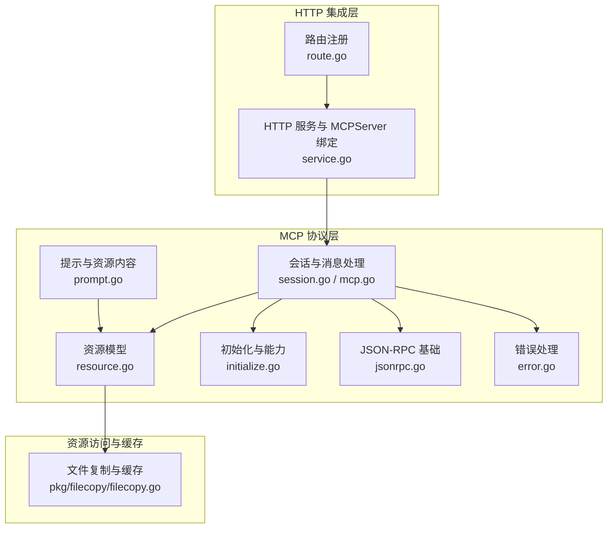
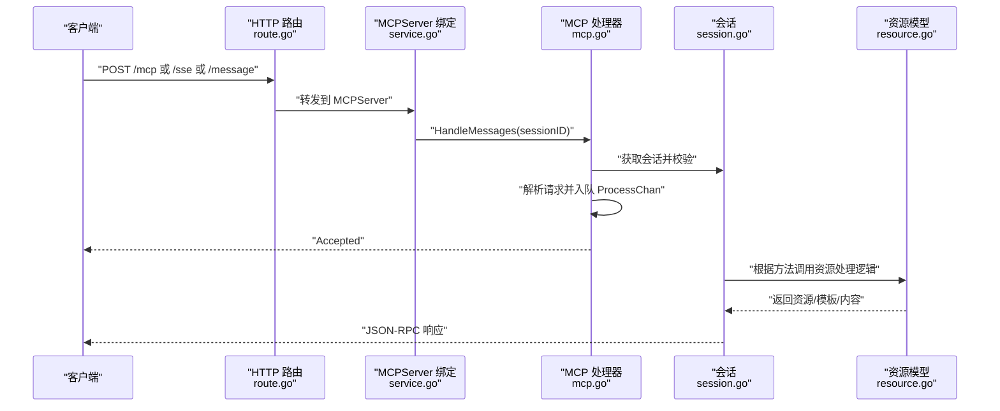
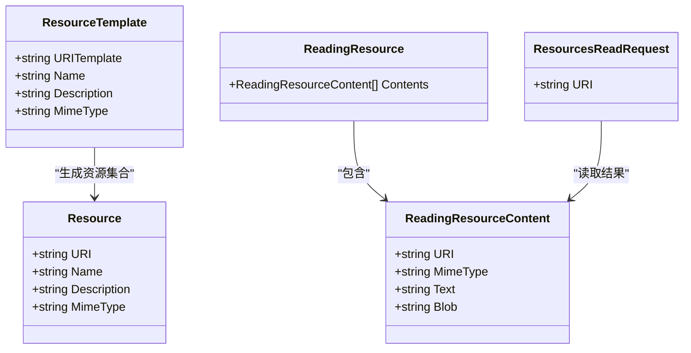
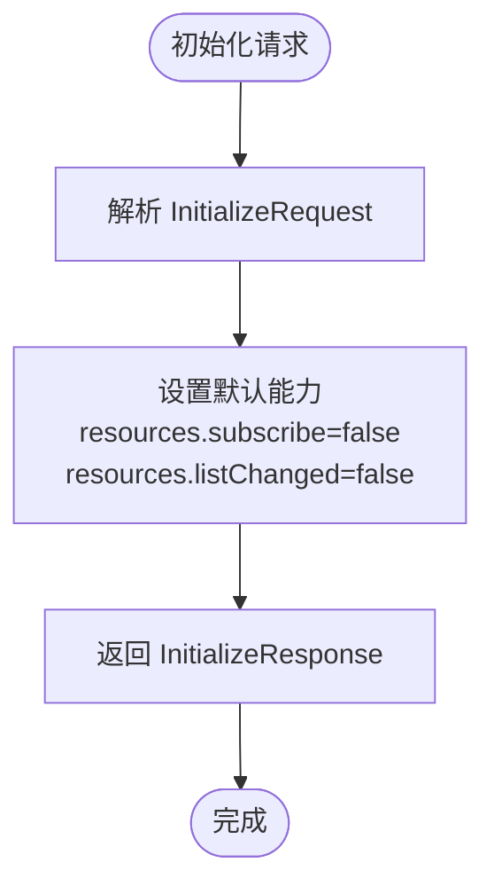
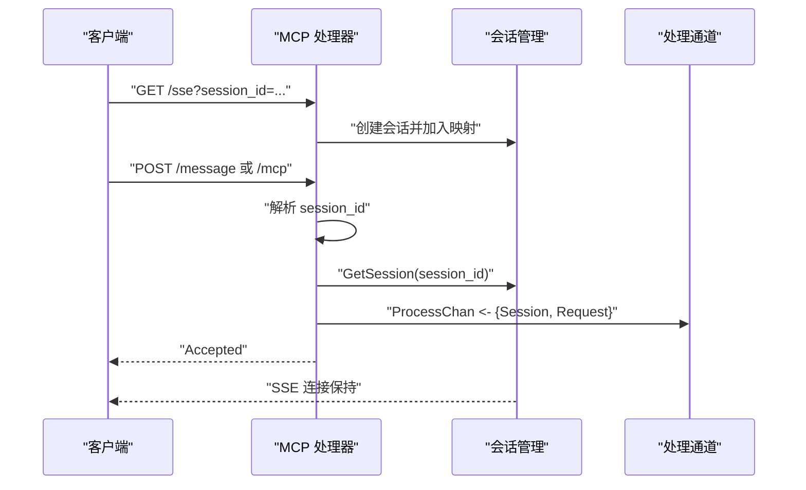
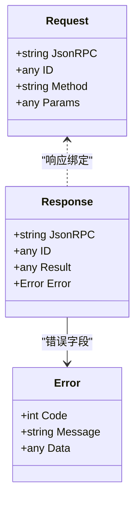
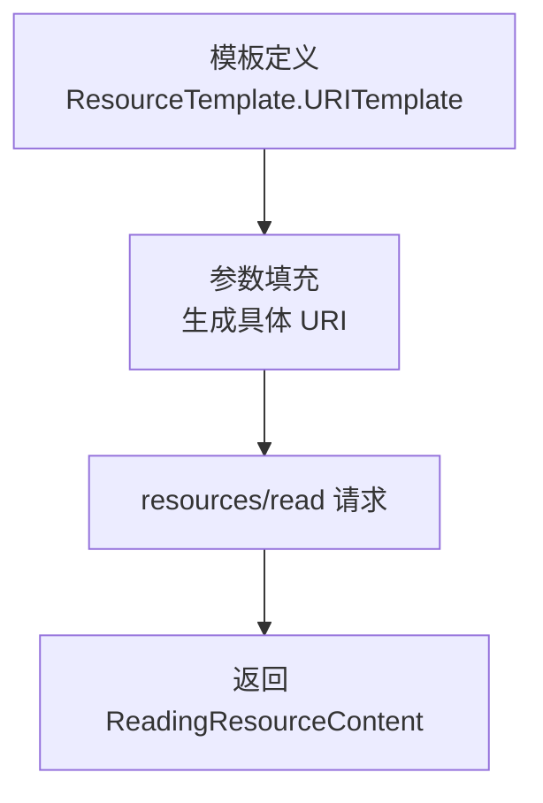
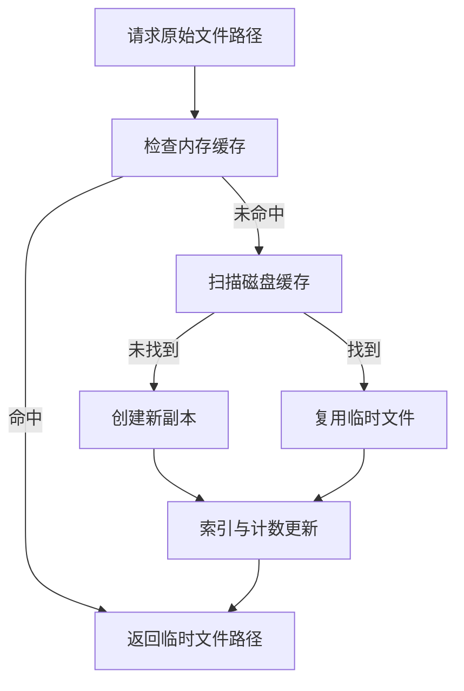
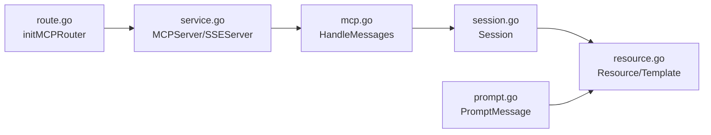

# 资源管理

<cite>
**本文引用的文件**
- [internal/mcp/resource.go](file://internal/mcp/resource.go)
- [internal/mcp/initialize.go](file://internal/mcp/initialize.go)
- [internal/mcp/jsonrpc.go](file://internal/mcp/jsonrpc.go)
- [internal/mcp/session.go](file://internal/mcp/session.go)
- [internal/mcp/mcp.go](file://internal/mcp/mcp.go)
- [internal/mcp/error.go](file://internal/mcp/error.go)
- [internal/mcp/prompt.go](file://internal/mcp/prompt.go)
- [internal/chatlog/http/route.go](file://internal/chatlog/http/route.go)
- [internal/chatlog/http/service.go](file://internal/chatlog/http/service.go)
- [pkg/filecopy/filecopy.go](file://pkg/filecopy/filecopy.go)
</cite>

## 目录
1. [简介](#简介)
2. [项目结构](#项目结构)
3. [核心组件](#核心组件)
4. [架构总览](#架构总览)
5. [组件详解](#组件详解)
6. [依赖关系分析](#依赖关系分析)
7. [性能考量](#性能考量)
8. [故障排除指南](#故障排除指南)
9. [结论](#结论)
10. [附录](#附录)

## 简介
本文件围绕 MCP（Model Context Protocol）在本项目中的资源管理能力进行系统化说明，重点覆盖以下方面：
- 资源的定义与数据模型：资源类型、模板与读取响应结构
- 资源发现与访问机制：方法命名规范、URI 规范与访问控制
- 初始化流程与资源加载策略：协议版本、能力声明与默认能力
- 资源模板系统：URI 模板与匹配规则
- 动态资源生成与缓存机制：临时文件复制与持久化缓存
- 最佳实践、性能优化与故障排除
- 安全策略与访问控制实现建议

## 项目结构
与资源管理直接相关的模块主要分布在以下位置：
- MCP 协议与资源模型定义：internal/mcp/*
- HTTP 路由与服务集成：internal/chatlog/http/*
- 文件复制与缓存工具：pkg/filecopy/*

**图示来源**
- [internal/mcp/resource.go](file://internal/mcp/resource.go#L1-L75)
- [internal/mcp/initialize.go](file://internal/mcp/initialize.go#L1-L79)
- [internal/mcp/jsonrpc.go](file://internal/mcp/jsonrpc.go#L1-L63)
- [internal/mcp/session.go](file://internal/mcp/session.go#L1-L49)
- [internal/mcp/mcp.go](file://internal/mcp/mcp.go#L1-L108)
- [internal/mcp/error.go](file://internal/mcp/error.go#L1-L56)
- [internal/mcp/prompt.go](file://internal/mcp/prompt.go#L1-L138)
- [internal/chatlog/http/route.go](file://internal/chatlog/http/route.go#L65-L75)
- [internal/chatlog/http/service.go](file://internal/chatlog/http/service.go#L16-L26)
- [pkg/filecopy/filecopy.go](file://pkg/filecopy/filecopy.go#L76-L89)

**章节来源**
- [internal/mcp/resource.go](file://internal/mcp/resource.go#L1-L75)
- [internal/mcp/initialize.go](file://internal/mcp/initialize.go#L1-L79)
- [internal/mcp/jsonrpc.go](file://internal/mcp/jsonrpc.go#L1-L63)
- [internal/mcp/session.go](file://internal/mcp/session.go#L1-L49)
- [internal/mcp/mcp.go](file://internal/mcp/mcp.go#L1-L108)
- [internal/mcp/error.go](file://internal/mcp/error.go#L1-L56)
- [internal/mcp/prompt.go](file://internal/mcp/prompt.go#L1-L138)
- [internal/chatlog/http/route.go](file://internal/chatlog/http/route.go#L65-L75)
- [internal/chatlog/http/service.go](file://internal/chatlog/http/service.go#L16-L26)
- [pkg/filecopy/filecopy.go](file://pkg/filecopy/filecopy.go#L76-L89)

## 核心组件
- 资源模型与方法
  - 资源与模板：资源对象、URI 模板、读取请求与内容载体
  - 方法常量：资源列表、模板列表、读取、订阅与取消订阅；以及两类通知
- 初始化与能力
  - 协议版本与能力声明：resources.subscribe 与 resources.listChanged 的默认值
- JSON-RPC 基础
  - 请求、响应与通知结构，统一的 JSON-RPC 版本号
- 会话与消息处理
  - SSE 会话建立、消息接收与处理通道
- 错误处理
  - 标准与自定义错误码，统一错误响应格式
- 提示与资源内容
  - PromptMessage/PromptContent 中可嵌入资源或资源模板

**章节来源**
- [internal/mcp/resource.go](file://internal/mcp/resource.go#L5-L16)
- [internal/mcp/resource.go](file://internal/mcp/resource.go#L26-L46)
- [internal/mcp/resource.go](file://internal/mcp/resource.go#L61-L74)
- [internal/mcp/initialize.go](file://internal/mcp/initialize.go#L3-L7)
- [internal/mcp/initialize.go](file://internal/mcp/initialize.go#L73-L78)
- [internal/mcp/jsonrpc.go](file://internal/mcp/jsonrpc.go#L17-L41)
- [internal/mcp/session.go](file://internal/mcp/session.go#L10-L21)
- [internal/mcp/mcp.go](file://internal/mcp/mcp.go#L17-L29)
- [internal/mcp/error.go](file://internal/mcp/error.go#L23-L33)
- [internal/mcp/prompt.go](file://internal/mcp/prompt.go#L94-L103)

## 架构总览
MCP 资源管理通过 HTTP/SSE 接收客户端请求，经会话与处理通道分发到具体处理逻辑，最终返回资源列表、模板或读取内容。资源内容可来自数据库、静态文件或动态转换后的媒体。

**图示来源**
- [internal/chatlog/http/route.go](file://internal/chatlog/http/route.go#L65-L75)
- [internal/chatlog/http/service.go](file://internal/chatlog/http/service.go#L23-L26)
- [internal/mcp/mcp.go](file://internal/mcp/mcp.go#L53-L98)
- [internal/mcp/session.go](file://internal/mcp/session.go#L36-L44)
- [internal/mcp/resource.go](file://internal/mcp/resource.go#L6-L16)

## 组件详解

### 资源模型与方法
- 资源（Resource）
  - 字段：URI、名称、描述、MIME 类型
  - 用途：直接标识一个可读取的资源条目
- 资源模板（ResourceTemplate）
  - 字段：URI 模板（遵循 RFC 6570）、名称、描述、MIME 类型
  - 用途：用于动态生成一组资源条目
- 读取请求与内容
  - 读取请求：按 URI 读取
  - 内容载体：支持文本或二进制（base64）两种形式
- 方法与通知
  - 列表：resources/list、resources/templates/list
  - 读取：resources/read
  - 订阅：resources/subscribe、resources/unsubscribe
  - 通知：list_changed、updated

**图示来源**
- [internal/mcp/resource.go](file://internal/mcp/resource.go#L26-L46)
- [internal/mcp/resource.go](file://internal/mcp/resource.go#L61-L74)
- [internal/mcp/resource.go](file://internal/mcp/resource.go#L65-L67)

**章节来源**
- [internal/mcp/resource.go](file://internal/mcp/resource.go#L18-L46)
- [internal/mcp/resource.go](file://internal/mcp/resource.go#L48-L74)

### 初始化流程与能力声明
- 协议版本：固定字符串
- 能力声明：resources.subscribe 与 resources.listChanged 默认为 false
- 客户端信息与服务器信息：用于握手与能力协商

**图示来源**
- [internal/mcp/initialize.go](file://internal/mcp/initialize.go#L27-L31)
- [internal/mcp/initialize.go](file://internal/mcp/initialize.go#L62-L66)
- [internal/mcp/initialize.go](file://internal/mcp/initialize.go#L73-L78)

**章节来源**
- [internal/mcp/initialize.go](file://internal/mcp/initialize.go#L3-L7)
- [internal/mcp/initialize.go](file://internal/mcp/initialize.go#L27-L31)
- [internal/mcp/initialize.go](file://internal/mcp/initialize.go#L62-L66)
- [internal/mcp/initialize.go](file://internal/mcp/initialize.go#L73-L78)

### 会话与消息处理
- 会话建立：SSE 场景下为每个连接分配唯一会话 ID，并维护会话映射
- 消息处理：从查询参数或路径参数解析 session_id，校验后将请求投递到处理通道
- 并发与背压：处理通道容量限制，避免过载

**图示来源**
- [internal/mcp/mcp.go](file://internal/mcp/mcp.go#L31-L45)
- [internal/mcp/mcp.go](file://internal/mcp/mcp.go#L53-L98)
- [internal/mcp/session.go](file://internal/mcp/session.go#L16-L21)

**章节来源**
- [internal/mcp/mcp.go](file://internal/mcp/mcp.go#L17-L29)
- [internal/mcp/mcp.go](file://internal/mcp/mcp.go#L31-L45)
- [internal/mcp/mcp.go](file://internal/mcp/mcp.go#L53-L98)
- [internal/mcp/session.go](file://internal/mcp/session.go#L10-L21)

### JSON-RPC 与错误处理
- 请求/响应/通知结构：统一的 jsonrpc 与 id 字段
- 错误码：标准 JSON-RPC 错误与自定义错误（如会话无效、请求过多等）

**图示来源**
- [internal/mcp/jsonrpc.go](file://internal/mcp/jsonrpc.go#L17-L41)
- [internal/mcp/error.go](file://internal/mcp/error.go#L17-L21)
- [internal/mcp/error.go](file://internal/mcp/error.go#L23-L33)

**章节来源**
- [internal/mcp/jsonrpc.go](file://internal/mcp/jsonrpc.go#L9-L41)
- [internal/mcp/error.go](file://internal/mcp/error.go#L17-L33)

### 资源模板系统与动态资源生成
- 模板语法：遵循 RFC 6570 的 URI 模板
- 动态生成：基于模板参数生成具体资源 URI，再由读取方法返回内容
- 应用场景：日志片段、聊天记录片段、媒体派生资源等

**图示来源**
- [internal/mcp/resource.go](file://internal/mcp/resource.go#L33-L46)
- [internal/mcp/resource.go](file://internal/mcp/resource.go#L65-L74)

**章节来源**
- [internal/mcp/resource.go](file://internal/mcp/resource.go#L33-L46)
- [internal/mcp/resource.go](file://internal/mcp/resource.go#L65-L74)

### 动态资源生成与缓存机制
- 临时文件复制：通过文件复制管理器实现实例隔离、持久化缓存与并发安全
- 生命周期：带 TTL 清理、原子计数与删除内联处理
- 性能特性：O(1) 查找、磁盘复用与去重

**图示来源**
- [pkg/filecopy/filecopy.go](file://pkg/filecopy/filecopy.go#L76-L89)
- [pkg/filecopy/filecopy.go](file://pkg/filecopy/filecopy.go#L571-L593)

**章节来源**
- [pkg/filecopy/filecopy.go](file://pkg/filecopy/filecopy.go#L76-L89)
- [pkg/filecopy/filecopy.go](file://pkg/filecopy/filecopy.go#L571-L593)

### 访问权限控制与安全策略
- 会话校验：必须提供有效的 session_id，否则返回错误
- 背压保护：处理通道满时拒绝请求，避免系统过载
- 资源访问：读取资源前需确保 URI 合法且可解析（结合模板与实际资源）
- 建议策略
  - 对敏感资源增加鉴权中间件
  - 限制模板参数范围，防止路径穿越
  - 对媒体资源进行 MIME 类型白名单校验
  - 对订阅与列表变更通知进行速率限制

**章节来源**
- [internal/mcp/mcp.go](file://internal/mcp/mcp.go#L61-L72)
- [internal/mcp/mcp.go](file://internal/mcp/mcp.go#L89-L95)
- [internal/mcp/error.go](file://internal/mcp/error.go#L30-L33)

## 依赖关系分析
- 路由与服务绑定
  - HTTP 路由将 /mcp、/sse、/message 转发给 MCPServer
  - 服务启动时初始化 MCPServer 与 SSEServer
- 会话与处理通道
  - HandleMessages 将请求放入 ProcessChan，供后台处理
- 资源与提示
  - PromptMessage/PromptContent 支持资源或资源模板作为消息内容

**图示来源**
- [internal/chatlog/http/route.go](file://internal/chatlog/http/route.go#L65-L75)
- [internal/chatlog/http/service.go](file://internal/chatlog/http/service.go#L23-L26)
- [internal/mcp/mcp.go](file://internal/mcp/mcp.go#L53-L98)
- [internal/mcp/session.go](file://internal/mcp/session.go#L10-L21)
- [internal/mcp/resource.go](file://internal/mcp/resource.go#L26-L46)
- [internal/mcp/prompt.go](file://internal/mcp/prompt.go#L94-L103)

**章节来源**
- [internal/chatlog/http/route.go](file://internal/chatlog/http/route.go#L65-L75)
- [internal/chatlog/http/service.go](file://internal/chatlog/http/service.go#L23-L26)
- [internal/mcp/mcp.go](file://internal/mcp/mcp.go#L53-L98)
- [internal/mcp/session.go](file://internal/mcp/session.go#L10-L21)
- [internal/mcp/resource.go](file://internal/mcp/resource.go#L26-L46)
- [internal/mcp/prompt.go](file://internal/mcp/prompt.go#L94-L103)

## 性能考量
- 通道容量与背压：合理设置 ProcessChanCap，避免阻塞与丢弃
- 缓存策略：利用文件复制管理器的持久化缓存减少重复 IO
- 并发安全：使用互斥锁与原子操作保证索引一致性
- 媒体转换：对大文件采用流式输出，避免一次性加载到内存
- 会话生命周期：及时清理无效会话，释放资源

[本节为通用指导，无需列出具体文件来源]

## 故障排除指南
- 会话无效或不存在
  - 现象：返回 Invalid session ID 或 Could not find session
  - 排查：确认 session_id 查询参数或路径参数是否正确传递
- 请求过多被拒绝
  - 现象：Too many requests
  - 排查：降低请求频率或增大处理通道容量
- JSON 解析失败
  - 现象：Invalid Request
  - 排查：检查请求体格式与字段完整性
- 资源读取异常
  - 现象：内部错误或找不到资源
  - 排查：核对 URI 是否符合模板规则，目标资源是否存在

**章节来源**
- [internal/mcp/mcp.go](file://internal/mcp/mcp.go#L61-L72)
- [internal/mcp/mcp.go](file://internal/mcp/mcp.go#L89-L95)
- [internal/mcp/error.go](file://internal/mcp/error.go#L23-L33)

## 结论
本项目的 MCP 资源管理以清晰的数据模型与方法体系为基础，结合会话与处理通道实现了稳定的资源发现与读取能力。通过资源模板与动态生成机制，能够灵活适配多种资源类型。配合文件复制与缓存工具，可在保证安全性的同时提升性能。建议在生产环境中进一步强化鉴权、速率限制与输入校验，确保资源访问的安全与稳定。

[本节为总结性内容，无需列出具体文件来源]

## 附录

### 资源类型与 URI 规范
- 资源类型
  - 直接资源：明确的 URI、名称、描述与 MIME 类型
  - 资源模板：URI 模板（RFC 6570），用于批量生成资源
- URI 规范
  - 建议使用明确的命名空间前缀区分资源域（如 logs://、file://）
  - 模板参数应进行白名单校验，避免路径穿越

**章节来源**
- [internal/mcp/resource.go](file://internal/mcp/resource.go#L18-L46)

### 访问权限控制最佳实践
- 会话与令牌：为每个会话绑定访问令牌，校验后再放行
- 资源白名单：仅允许访问受控目录或已授权的资源
- 速率限制：对 resources/read 与订阅接口进行限速
- 审计日志：记录资源访问事件，便于追踪与审计

[本节为通用指导，无需列出具体文件来源]