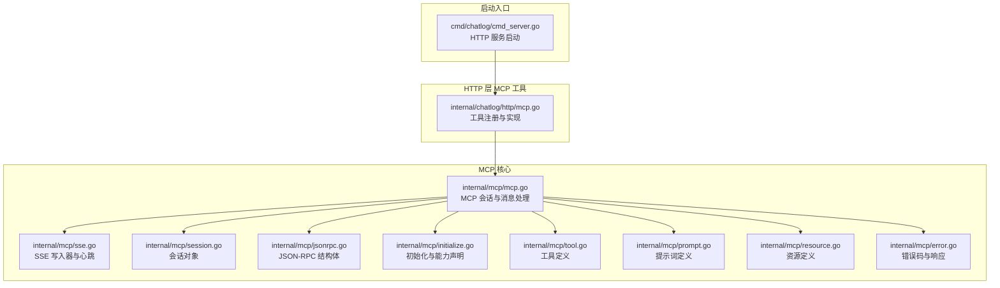
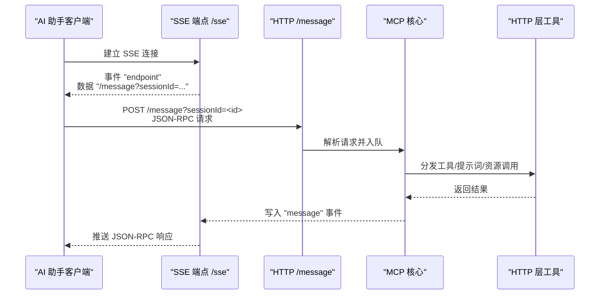
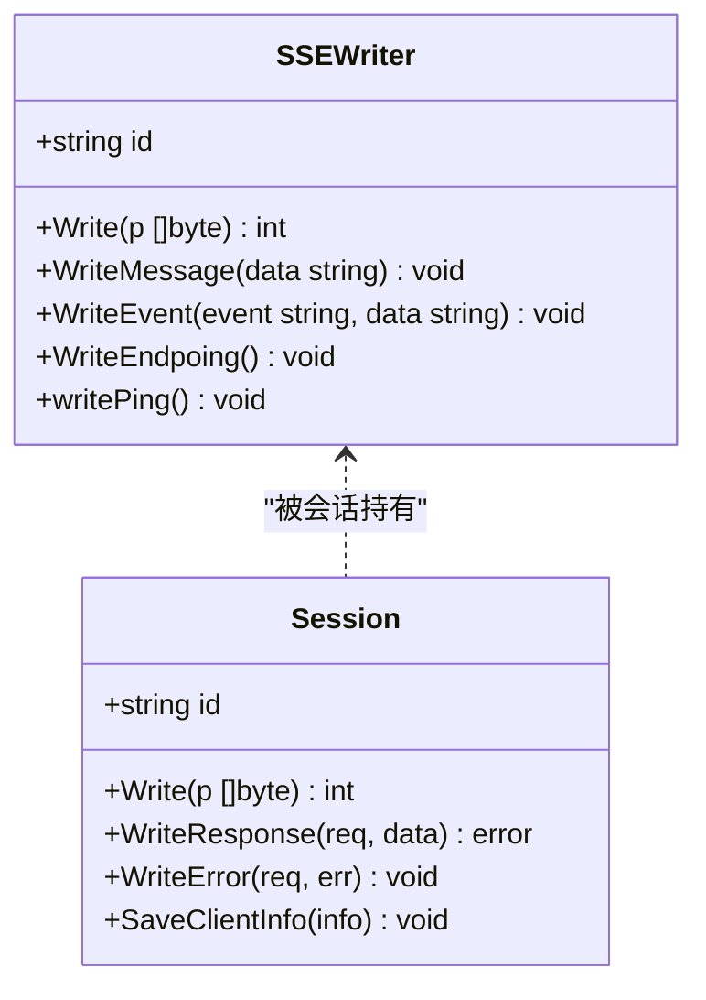
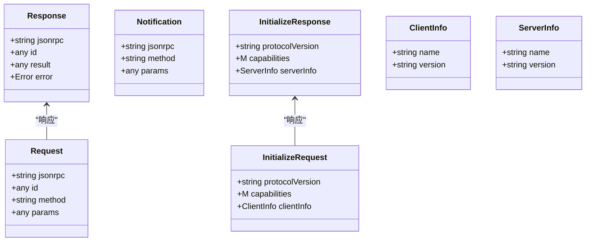
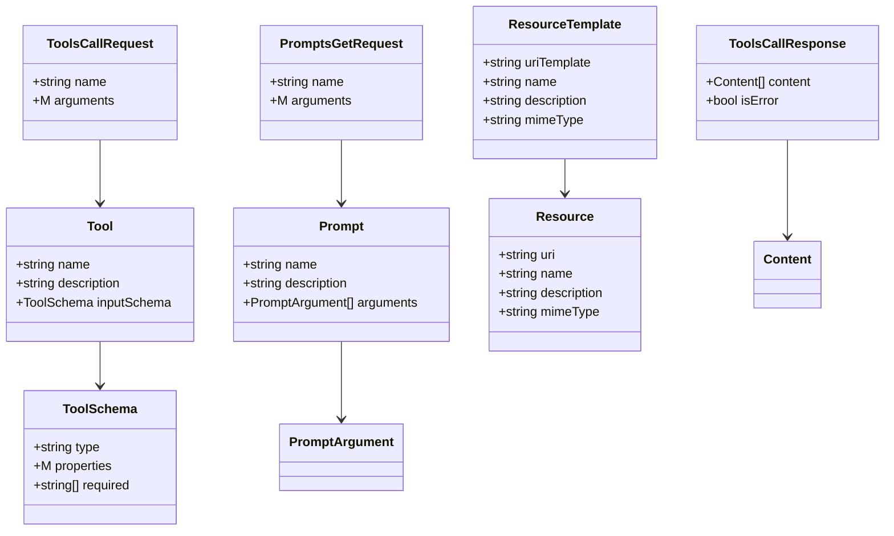
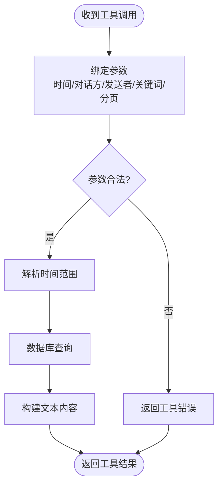
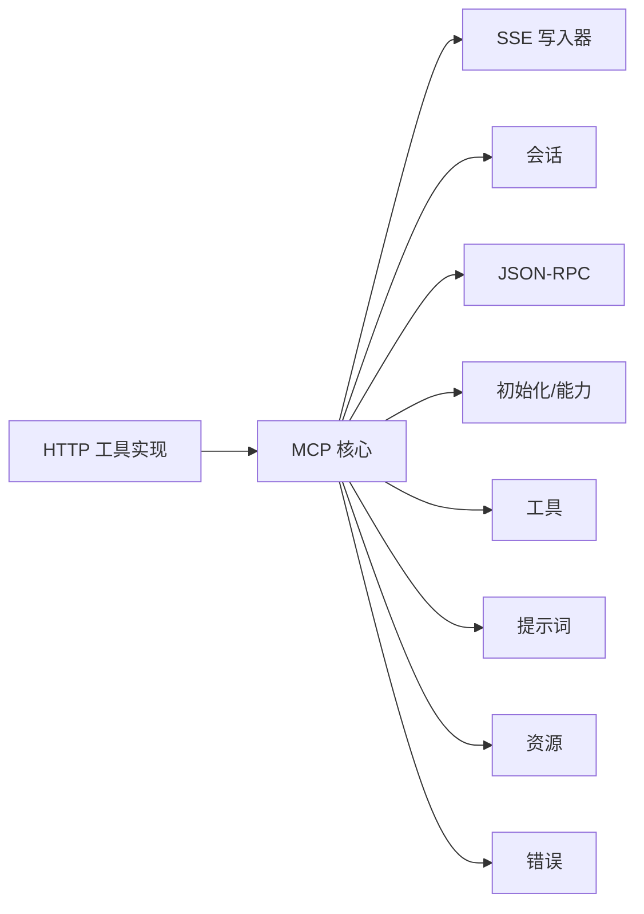

# 集成指南

<cite>
**本文引用的文件**
- [docs/mcp.md](file://docs/mcp.md)
- [internal/mcp/mcp.go](file://internal/mcp/mcp.go)
- [internal/mcp/initialize.go](file://internal/mcp/initialize.go)
- [internal/mcp/jsonrpc.go](file://internal/mcp/jsonrpc.go)
- [internal/mcp/session.go](file://internal/mcp/session.go)
- [internal/mcp/tool.go](file://internal/mcp/tool.go)
- [internal/mcp/prompt.go](file://internal/mcp/prompt.go)
- [internal/mcp/resource.go](file://internal/mcp/resource.go)
- [internal/mcp/error.go](file://internal/mcp/error.go)
- [internal/mcp/sse.go](file://internal/mcp/sse.go)
- [internal/chatlog/http/mcp.go](file://internal/chatlog/http/mcp.go)
- [cmd/chatlog/cmd_server.go](file://cmd/chatlog/cmd_server.go)
</cite>

## 目录
1. [简介](#简介)
2. [项目结构](#项目结构)
3. [核心组件](#核心组件)
4. [架构总览](#架构总览)
5. [详细组件分析](#详细组件分析)
6. [依赖关系分析](#依赖关系分析)
7. [性能考量](#性能考量)
8. [故障排查指南](#故障排查指南)
9. [结论](#结论)
10. [附录](#附录)

## 简介
本指南面向希望将本项目接入 MCP（Model Context Protocol）生态的开发者与使用者，覆盖与 Claude Desktop、Monica Code、ChatWise 等主流 AI 助手的集成步骤、配置要点与注意事项。文档同时提供端到端的集成示例、配置模板、测试方法、常见问题与解决方案、验证工具与调试技巧，以及性能优化与监控建议。

## 项目结构
本项目的 MCP 能力由两部分组成：
- 内部 MCP 核心实现：负责协议编解码、会话管理、SSE 推送、工具与提示词能力声明与处理。
- HTTP 层 MCP 工具实现：封装数据库查询能力，暴露联系人、群聊、最近会话、聊天记录、当前时间等工具。

图表来源
- [internal/mcp/mcp.go](file://internal/mcp/mcp.go#L1-L108)
- [internal/mcp/sse.go](file://internal/mcp/sse.go#L1-L161)
- [internal/mcp/session.go](file://internal/mcp/session.go#L1-L49)
- [internal/mcp/jsonrpc.go](file://internal/mcp/jsonrpc.go#L1-L63)
- [internal/mcp/initialize.go](file://internal/mcp/initialize.go#L1-L79)
- [internal/mcp/tool.go](file://internal/mcp/tool.go#L1-L144)
- [internal/mcp/prompt.go](file://internal/mcp/prompt.go#L1-L138)
- [internal/mcp/resource.go](file://internal/mcp/resource.go#L1-L75)
- [internal/mcp/error.go](file://internal/mcp/error.go#L1-L56)
- [internal/chatlog/http/mcp.go](file://internal/chatlog/http/mcp.go#L1-L329)
- [cmd/chatlog/cmd_server.go](file://cmd/chatlog/cmd_server.go#L1-L79)

章节来源
- [internal/mcp/mcp.go](file://internal/mcp/mcp.go#L1-L108)
- [internal/mcp/sse.go](file://internal/mcp/sse.go#L1-L161)
- [internal/mcp/session.go](file://internal/mcp/session.go#L1-L49)
- [internal/mcp/jsonrpc.go](file://internal/mcp/jsonrpc.go#L1-L63)
- [internal/mcp/initialize.go](file://internal/mcp/initialize.go#L1-L79)
- [internal/mcp/tool.go](file://internal/mcp/tool.go#L1-L144)
- [internal/mcp/prompt.go](file://internal/mcp/prompt.go#L1-L138)
- [internal/mcp/resource.go](file://internal/mcp/resource.go#L1-L75)
- [internal/mcp/error.go](file://internal/mcp/error.go#L1-L56)
- [internal/chatlog/http/mcp.go](file://internal/chatlog/http/mcp.go#L1-L329)
- [cmd/chatlog/cmd_server.go](file://cmd/chatlog/cmd_server.go#L1-L79)

## 核心组件
- MCP 会话与消息处理：维护会话表、接收客户端消息、转发到处理通道。
- SSE 写入器：向客户端推送事件流，包含 endpoint、message、ping 心跳。
- JSON-RPC 结构体：统一请求/响应/通知的数据结构。
- 初始化与能力声明：声明协议版本、客户端信息、默认能力集。
- 工具与提示词/资源：定义工具签名、输入模式、提示词与资源读取接口。
- 错误处理：标准 JSON-RPC 错误码与扩展错误码。
- HTTP 层工具实现：注册并实现联系人、群聊、最近会话、聊天记录、当前时间等工具。

章节来源
- [internal/mcp/mcp.go](file://internal/mcp/mcp.go#L1-L108)
- [internal/mcp/sse.go](file://internal/mcp/sse.go#L1-L161)
- [internal/mcp/jsonrpc.go](file://internal/mcp/jsonrpc.go#L1-L63)
- [internal/mcp/initialize.go](file://internal/mcp/initialize.go#L1-L79)
- [internal/mcp/tool.go](file://internal/mcp/tool.go#L1-L144)
- [internal/mcp/prompt.go](file://internal/mcp/prompt.go#L1-L138)
- [internal/mcp/resource.go](file://internal/mcp/resource.go#L1-L75)
- [internal/mcp/error.go](file://internal/mcp/error.go#L1-L56)
- [internal/chatlog/http/mcp.go](file://internal/chatlog/http/mcp.go#L1-L329)

## 架构总览
MCP 集成采用“HTTP 服务 + SSE 传输”的方案，客户端通过 SSE 订阅 endpoint，随后通过 /message 发送 JSON-RPC 请求；服务端解析请求、派发到处理通道，最终通过会话 writer 回写响应。

图表来源
- [internal/mcp/sse.go](file://internal/mcp/sse.go#L63-L161)
- [internal/mcp/mcp.go](file://internal/mcp/mcp.go#L53-L98)
- [internal/chatlog/http/mcp.go](file://internal/chatlog/http/mcp.go#L20-L29)

## 详细组件分析

### SSE 与会话管理
- SSEWriter 负责：
  - 设置响应头、保持连接、发送 endpoint 事件（包含 /message 的会话参数）。
  - 周期性发送 ping 事件维持连接活性。
  - 将 JSON-RPC 文本包装为 SSE message 事件写出。
- Session 封装会话状态与 writer，提供写入响应/错误的能力。

图表来源
- [internal/mcp/sse.go](file://internal/mcp/sse.go#L16-L77)
- [internal/mcp/session.go](file://internal/mcp/session.go#L10-L49)

章节来源
- [internal/mcp/sse.go](file://internal/mcp/sse.go#L1-L161)
- [internal/mcp/session.go](file://internal/mcp/session.go#L1-L49)

### JSON-RPC 与初始化
- Request/Response/Notification 统一 JSON-RPC 数据结构。
- InitializeRequest/InitializeResponse 定义初始化握手，包含协议版本、客户端/服务端信息与能力声明。
- 默认能力集包含 prompts、resources、tools 等能力开关。

图表来源
- [internal/mcp/jsonrpc.go](file://internal/mcp/jsonrpc.go#L17-L62)
- [internal/mcp/initialize.go](file://internal/mcp/initialize.go#L27-L71)

章节来源
- [internal/mcp/jsonrpc.go](file://internal/mcp/jsonrpc.go#L1-L63)
- [internal/mcp/initialize.go](file://internal/mcp/initialize.go#L1-L79)

### 工具、提示词与资源
- 工具（tools）：定义工具名称、描述与输入模式（JSON Schema），支持 tools/list 与 tools/call。
- 提示词（prompts）：支持 prompts/list 与 prompts/get，返回结构化消息数组。
- 资源（resources）：支持资源列表、模板、读取与订阅/退订事件。

图表来源
- [internal/mcp/tool.go](file://internal/mcp/tool.go#L88-L144)
- [internal/mcp/prompt.go](file://internal/mcp/prompt.go#L24-L138)
- [internal/mcp/resource.go](file://internal/mcp/resource.go#L26-L75)

章节来源
- [internal/mcp/tool.go](file://internal/mcp/tool.go#L1-L144)
- [internal/mcp/prompt.go](file://internal/mcp/prompt.go#L1-L138)
- [internal/mcp/resource.go](file://internal/mcp/resource.go#L1-L75)

### HTTP 层工具实现与数据库交互
- 注册工具：contact、chatroom、recentchat、chatlog、currenttime。
- 参数绑定与校验：对时间范围、talker、sender、keyword 等参数进行解析与限制。
- 数据访问：通过数据库层获取联系人、群聊、会话与消息，输出文本内容供工具返回。

图表来源
- [internal/chatlog/http/mcp.go](file://internal/chatlog/http/mcp.go#L261-L329)

章节来源
- [internal/chatlog/http/mcp.go](file://internal/chatlog/http/mcp.go#L1-L329)

### 集成平台与配置步骤

#### 前期准备
- 启动 HTTP 服务，完成数据解密并开启本地服务。
- 若客户端不支持 SSE，可使用 mcp-proxy 将 stdio 转换为 SSE。

章节来源
- [docs/mcp.md](file://docs/mcp.md#L14-L31)
- [cmd/chatlog/cmd_server.go](file://cmd/chatlog/cmd_server.go#L35-L49)

#### ChatWise
- 使用方式：MCP SSE
- 特殊要求：需要 Pro 权限
- 步骤：
  1) 新建“SSE 请求”工具，URL 填写本地 SSE 地址，勾选“自动执行工具”，检查连接。
  2) 选择支持 MCP 的模型，打开 chatlog 工具选项。
  3) 执行测试，确认可用。

章节来源
- [docs/mcp.md](file://docs/mcp.md#L33-L54)

#### Cherry Studio
- 使用方式：MCP SSE
- 步骤：
  1) 添加服务器，类型选择“服务器发送事件(sse)”，URL 填写本地 SSE 地址。
  2) 选择支持 MCP 的模型，打开 chatlog 工具选项。
  3) 执行测试。

章节来源
- [docs/mcp.md](file://docs/mcp.md#L55-L71)

#### Claude Desktop
- 使用方式：mcp-proxy
- 步骤：
  1) 安装 mcp-proxy。
  2) 打开 Claude Desktop 开发者配置，编辑配置文件，添加 chatlog 服务器项，command 指向 mcp-proxy，args 为本地 SSE 地址。
  3) 保存并重启 Claude Desktop，确认已添加。
  4) 执行测试。

章节来源
- [docs/mcp.md](file://docs/mcp.md#L72-L105)

#### Monica Code
- 使用方式：mcp-proxy
- 步骤：
  1) 安装 mcp-proxy。
  2) 在 VS Code 扩展目录中找到 Monica Code，编辑其配置文件，设置 transport 为 stdio，command 指向 mcp-proxy，args 为本地 SSE 地址。
  3) 重启 VS Code，确认已添加。
  4) 执行测试。

章节来源
- [docs/mcp.md](file://docs/mcp.md#L107-L151)

## 依赖关系分析
- MCP 核心模块相互协作：MCP 负责会话与消息分发，SSE 写入器负责事件推送，Session 负责响应写出，JSON-RPC 定义数据契约，初始化模块声明能力，工具/提示词/资源模块定义能力边界，错误模块统一错误语义。
- HTTP 层工具实现依赖 MCP 核心模块，通过注册工具与实现回调函数，完成数据库查询与结果返回。

图表来源
- [internal/mcp/mcp.go](file://internal/mcp/mcp.go#L1-L108)
- [internal/mcp/sse.go](file://internal/mcp/sse.go#L1-L161)
- [internal/mcp/session.go](file://internal/mcp/session.go#L1-L49)
- [internal/mcp/jsonrpc.go](file://internal/mcp/jsonrpc.go#L1-L63)
- [internal/mcp/initialize.go](file://internal/mcp/initialize.go#L1-L79)
- [internal/mcp/tool.go](file://internal/mcp/tool.go#L1-L144)
- [internal/mcp/prompt.go](file://internal/mcp/prompt.go#L1-L138)
- [internal/mcp/resource.go](file://internal/mcp/resource.go#L1-L75)
- [internal/mcp/error.go](file://internal/mcp/error.go#L1-L56)
- [internal/chatlog/http/mcp.go](file://internal/chatlog/http/mcp.go#L1-L329)

章节来源
- [internal/mcp/mcp.go](file://internal/mcp/mcp.go#L1-L108)
- [internal/mcp/sse.go](file://internal/mcp/sse.go#L1-L161)
- [internal/mcp/session.go](file://internal/mcp/session.go#L1-L49)
- [internal/mcp/jsonrpc.go](file://internal/mcp/jsonrpc.go#L1-L63)
- [internal/mcp/initialize.go](file://internal/mcp/initialize.go#L1-L79)
- [internal/mcp/tool.go](file://internal/mcp/tool.go#L1-L144)
- [internal/mcp/prompt.go](file://internal/mcp/prompt.go#L1-L138)
- [internal/mcp/resource.go](file://internal/mcp/resource.go#L1-L75)
- [internal/mcp/error.go](file://internal/mcp/error.go#L1-L56)
- [internal/chatlog/http/mcp.go](file://internal/chatlog/http/mcp.go#L1-L329)

## 性能考量
- 会话并发与背压：MCP 内部维护处理通道与会话表，避免过多并发请求导致阻塞；若出现“Too many requests”，需降低并发或增加缓冲容量。
- SSE 心跳与保活：定期发送 ping 事件，确保长连接稳定；客户端断连重试策略需与服务端心跳周期匹配。
- 工具调用批量化：对于高频查询，建议合并小范围查询，减少往返次数。
- 数据库查询优化：合理使用时间范围、talker/sender/keyword 等参数，避免全量扫描；必要时在数据库层增加索引。
- 日志与监控：启用调试日志，记录请求/响应与耗时；结合外部监控系统观察连接数、QPS、错误率。

## 故障排查指南
- 无效会话 ID 或会话不存在：检查 /message 的 session_id 参数是否正确传递，或确认 SSE 连接是否建立。
- 请求过于频繁：服务端返回“Too many requests”，适当降低并发或增大处理通道容量。
- JSON-RPC 解析失败：检查请求体格式与字段完整性，确保 jsonrpc、id、method、params 符合规范。
- 工具调用异常：查看工具实现的日志输出，确认参数绑定与数据库查询是否成功。
- SSE 连接中断：确认客户端支持 SSE，或改用 mcp-proxy；检查网络与防火墙策略。

章节来源
- [internal/mcp/mcp.go](file://internal/mcp/mcp.go#L53-L98)
- [internal/mcp/error.go](file://internal/mcp/error.go#L23-L56)
- [internal/mcp/jsonrpc.go](file://internal/mcp/jsonrpc.go#L17-L62)
- [internal/chatlog/http/mcp.go](file://internal/chatlog/http/mcp.go#L271-L329)

## 结论
通过 SSE 与 JSON-RPC 的组合，本项目实现了与主流 AI 助手的 MCP 集成。按照本文档的步骤与配置要点，可在 ChatWise、Cherry Studio、Claude Desktop、Monica Code 等平台上顺利启用 chatlog 工具与能力。建议在生产环境中关注并发控制、SSE 心跳、数据库查询优化与日志监控，以获得稳定高效的体验。

## 附录

### 集成验证与调试技巧
- 使用浏览器或 curl 直接访问本地 SSE 端点，确认 endpoint 事件与 /message 路由可用。
- 在 Claude Desktop/VS Code 中启用 MCP 调试日志，观察握手与工具调用过程。
- 逐步测试工具：先测试 current_time，再测试 contact/chatroom/recentchat，最后测试 chatlog 的多步查询流程。

### 配置文件模板（示例）
- Claude Desktop 配置模板（路径与参数示例见文档）
- VS Code（Monica Code）配置模板（transport stdio + mcp-proxy）

章节来源
- [docs/mcp.md](file://docs/mcp.md#L82-L96)
- [docs/mcp.md](file://docs/mcp.md#L115-L142)