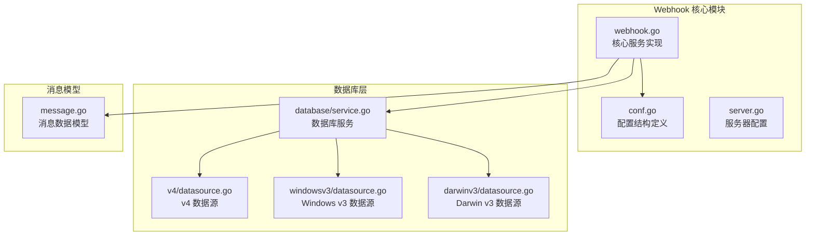
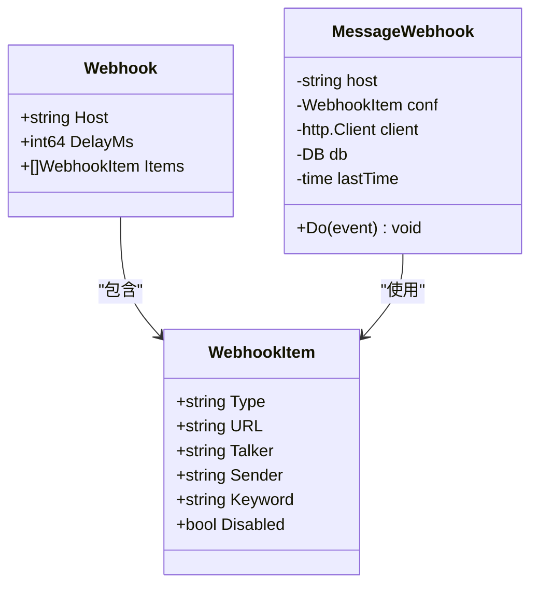
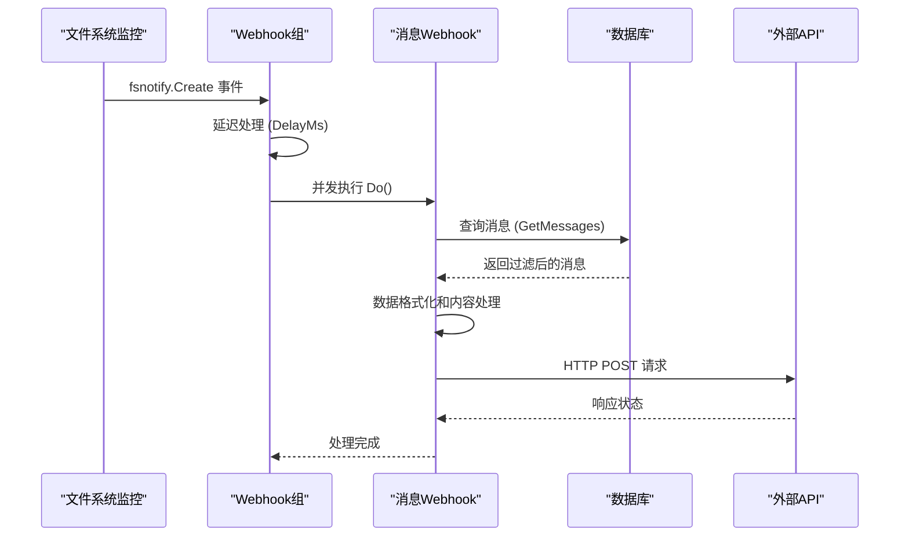
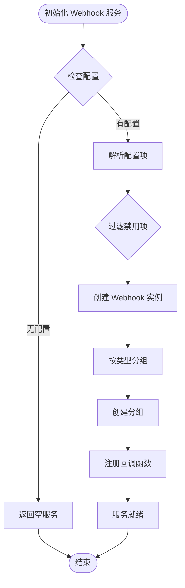
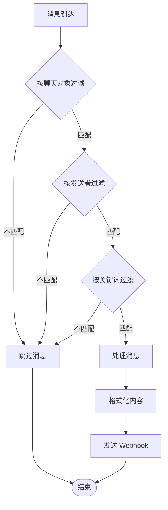
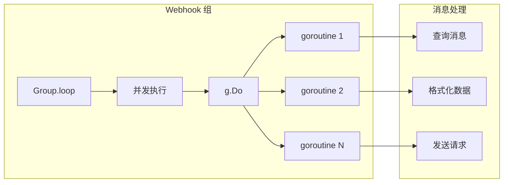
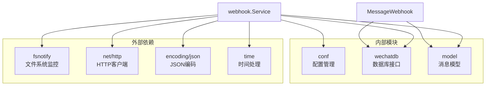

# Webhook 通知系统

<cite>
**本文档引用的文件**
- [internal/chatlog/webhook/webhook.go](file://internal/chatlog/webhook/webhook.go)
- [internal/chatlog/conf/webhook.go](file://internal/chatlog/conf/webhook.go)
- [internal/chatlog/conf/server.go](file://internal/chatlog/conf/server.go)
- [internal/chatlog/database/service.go](file://internal/chatlog/database/service.go)
- [internal/model/message.go](file://internal/model/message.go)
- [internal/wechatdb/datasource/v4/datasource.go](file://internal/wechatdb/datasource/v4/datasource.go)
- [internal/wechatdb/datasource/windowsv3/datasource.go](file://internal/wechatdb/datasource/windowsv3/datasource.go)
- [internal/wechatdb/datasource/darwinv3/datasource.go](file://internal/wechatdb/datasource/darwinv3/datasource.go)
- [README.md](file://README.md)
</cite>

## 目录
1. [简介](#简介)
2. [项目结构](#项目结构)
3. [核心组件](#核心组件)
4. [架构概览](#架构概览)
5. [详细组件分析](#详细组件分析)
6. [依赖关系分析](#依赖关系分析)
7. [性能考虑](#性能考虑)
8. [故障排除指南](#故障排除指南)
9. [结论](#结论)

## 简介

Webhook 通知系统是 Chatlog 项目中的一个重要功能模块，它能够在检测到特定微信消息时，自动通过 HTTP POST 请求将消息数据推送到配置的回调地址。该系统支持消息过滤、数据格式化、延迟机制和并发处理等功能。

## 项目结构

Webhook 系统主要分布在以下关键文件中：

**图表来源**
- [internal/chatlog/webhook/webhook.go](file://internal/chatlog/webhook/webhook.go#L1-L200)
- [internal/chatlog/conf/webhook.go](file://internal/chatlog/conf/webhook.go#L1-L17)
- [internal/chatlog/database/service.go](file://internal/chatlog/database/service.go#L1-L136)

**章节来源**
- [internal/chatlog/webhook/webhook.go](file://internal/chatlog/webhook/webhook.go#L1-L200)
- [internal/chatlog/conf/webhook.go](file://internal/chatlog/conf/webhook.go#L1-L17)
- [internal/chatlog/conf/server.go](file://internal/chatlog/conf/server.go#L1-L61)

## 核心组件

### Webhook 配置结构

Webhook 系统的核心配置由两个主要结构组成：

**图表来源**
- [internal/chatlog/conf/webhook.go](file://internal/chatlog/conf/webhook.go#L3-L16)
- [internal/chatlog/webhook/webhook.go](file://internal/chatlog/webhook/webhook.go#L140-L157)

### 服务架构

Webhook 系统采用分层架构设计：

1. **配置层**: 定义 Webhook 配置结构和验证规则
2. **服务层**: 管理 Webhook 实例和回调处理
3. **数据库层**: 提供消息数据查询和过滤功能
4. **网络层**: 处理 HTTP 请求和响应

**章节来源**
- [internal/chatlog/webhook/webhook.go](file://internal/chatlog/webhook/webhook.go#L25-L78)
- [internal/chatlog/conf/webhook.go](file://internal/chatlog/conf/webhook.go#L1-L17)

## 架构概览

Webhook 系统的整体架构如下：

**图表来源**
- [internal/chatlog/webhook/webhook.go](file://internal/chatlog/webhook/webhook.go#L100-L138)
- [internal/chatlog/webhook/webhook.go](file://internal/chatlog/webhook/webhook.go#L159-L199)

## 详细组件分析

### Webhook 服务实现

Webhook 服务负责管理所有配置的回调规则：

**图表来源**
- [internal/chatlog/webhook/webhook.go](file://internal/chatlog/webhook/webhook.go#L30-L78)

### 消息过滤机制

Webhook 系统支持多维度的消息过滤：

**图表来源**
- [internal/chatlog/webhook/webhook.go](file://internal/chatlog/webhook/webhook.go#L159-L199)
- [internal/wechatdb/datasource/v4/datasource.go](file://internal/wechatdb/datasource/v4/datasource.go#L208-L345)

### 数据格式化处理

消息数据在发送前会经过格式化处理：

| 字段 | 类型 | 描述 | 示例 |
|------|------|------|------|
| seq | int64 | 消息序列号 | 1756225000000 |
| time | datetime | 消息时间 | 2025-08-27T00:00:00+08:00 |
| talker | string | 聊天对象ID | wxid_123 |
| talkerName | string | 聊天对象名称 | Name |
| isChatRoom | bool | 是否群聊 | false |
| sender | string | 发送者ID | wxid_123 |
| senderName | string | 发送者名称 | Name |
| isSelf | bool | 是否自己发送 | false |
| type | int64 | 消息类型 | 1 |
| subType | int64 | 消息子类型 | 0 |
| content | string | 消息内容 | "测试消息" |
| contents | map | 多媒体内容信息 | {"host": "localhost:5030"} |

**章节来源**
- [internal/model/message.go](file://internal/model/message.go#L108-L126)
- [internal/model/message.go](file://internal/model/message.go#L292-L343)

### 并发处理机制

Webhook 系统采用 goroutine 并发处理多个回调：

**图表来源**
- [internal/chatlog/webhook/webhook.go](file://internal/chatlog/webhook/webhook.go#L117-L138)
- [internal/chatlog/webhook/webhook.go](file://internal/chatlog/webhook/webhook.go#L134-L137)

**章节来源**
- [internal/chatlog/webhook/webhook.go](file://internal/chatlog/webhook/webhook.go#L88-L138)

## 依赖关系分析

Webhook 系统的依赖关系如下：

**图表来源**
- [internal/chatlog/webhook/webhook.go](file://internal/chatlog/webhook/webhook.go#L3-L15)
- [internal/chatlog/database/service.go](file://internal/chatlog/database/service.go#L31-L36)

**章节来源**
- [internal/chatlog/webhook/webhook.go](file://internal/chatlog/webhook/webhook.go#L1-L200)
- [internal/chatlog/database/service.go](file://internal/chatlog/database/service.go#L1-L136)

## 性能考虑

### 延迟机制

Webhook 系统提供了可配置的延迟机制：

- **延迟配置**: 通过 `delay_ms` 参数控制消息推送延迟
- **默认行为**: 当延迟大于 0 时，系统会在处理前等待指定毫秒数
- **应用场景**: 避免消息过于频繁地触发回调，减少外部服务压力

### 内存管理

- **缓冲区大小**: Webhook 组使用容量为 1 的通道，避免内存无限增长
- **上下文取消**: 支持通过 context 取消正在进行的处理
- **资源清理**: 正确关闭 HTTP 连接和数据库连接

### 错误处理

系统实现了多层次的错误处理机制：

1. **配置验证**: 检查 Webhook 配置的有效性
2. **网络异常**: 处理 HTTP 请求失败的情况
3. **数据库错误**: 处理消息查询失败的情况
4. **超时控制**: 为 HTTP 请求设置合理的超时时间

## 故障排除指南

### 常见问题及解决方案

| 问题类型 | 症状 | 可能原因 | 解决方案 |
|----------|------|----------|----------|
| Webhook 未触发 | 消息到达但无回调 | 配置错误或过滤条件不匹配 | 检查 talker、sender、keyword 配置 |
| HTTP 请求失败 | 日志显示请求错误 | 网络连接问题或目标服务不可达 | 检查目标 URL 和网络连通性 |
| 消息格式异常 | 接收端收到格式错误的数据 | 数据库查询结果为空或格式化失败 | 验证数据库连接和消息模型 |
| 性能问题 | 处理延迟过高 | 过多的并发请求或数据库查询缓慢 | 调整 delay_ms 参数和并发设置 |

### 调试建议

1. **启用详细日志**: 检查系统日志中的 Webhook 相关信息
2. **验证配置文件**: 确认 JSON 配置格式正确且语法有效
3. **测试网络连接**: 验证目标服务器的可达性和响应时间
4. **监控资源使用**: 关注 CPU、内存和网络带宽的使用情况

**章节来源**
- [internal/chatlog/webhook/webhook.go](file://internal/chatlog/webhook/webhook.go#L159-L199)

## 结论

Webhook 通知系统为 Chatlog 项目提供了强大的消息推送能力。通过合理配置和使用，用户可以实现与各种外部系统的无缝集成。系统的设计充分考虑了性能、可靠性和易用性，能够满足大多数 Webhook 集成场景的需求。

主要特点包括：
- 灵活的消息过滤机制
- 可配置的延迟处理
- 并发安全的处理架构
- 完善的错误处理和日志记录
- 支持多种消息类型的格式化输出

通过本文档的指导，用户可以有效地配置和使用 Webhook 功能，实现个性化的消息推送需求。