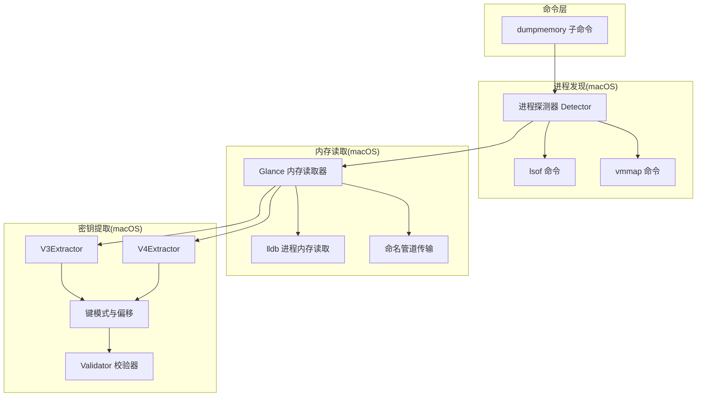
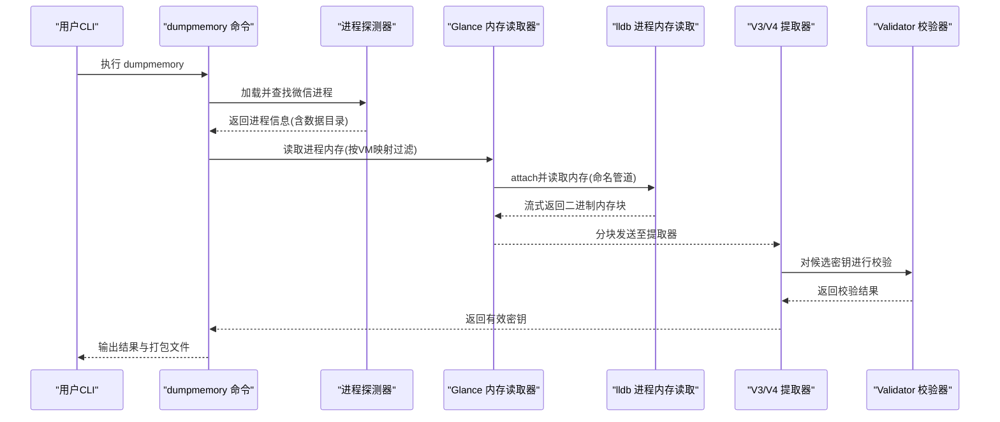
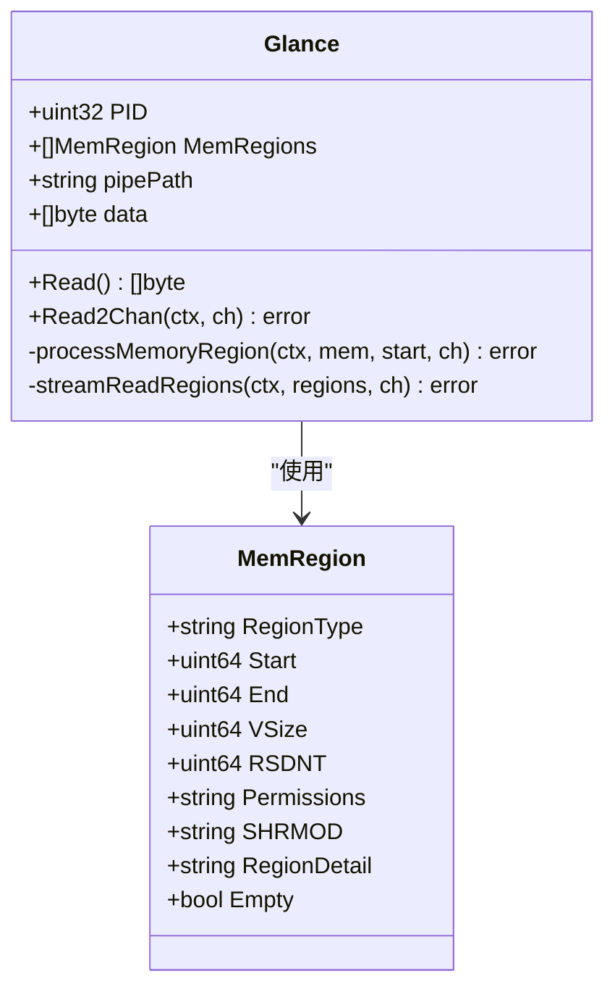
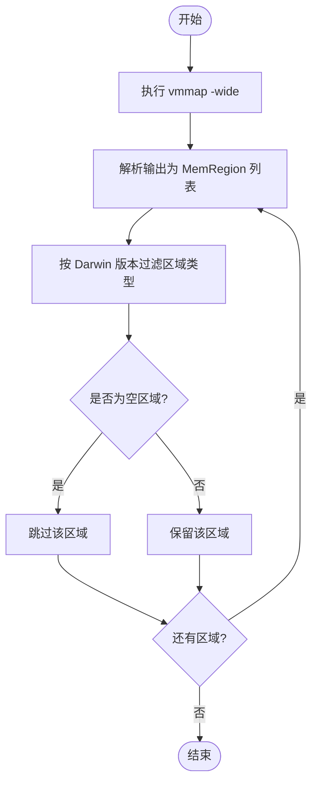
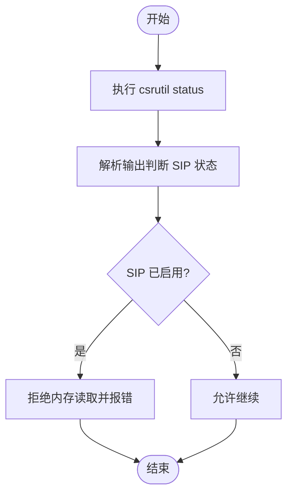
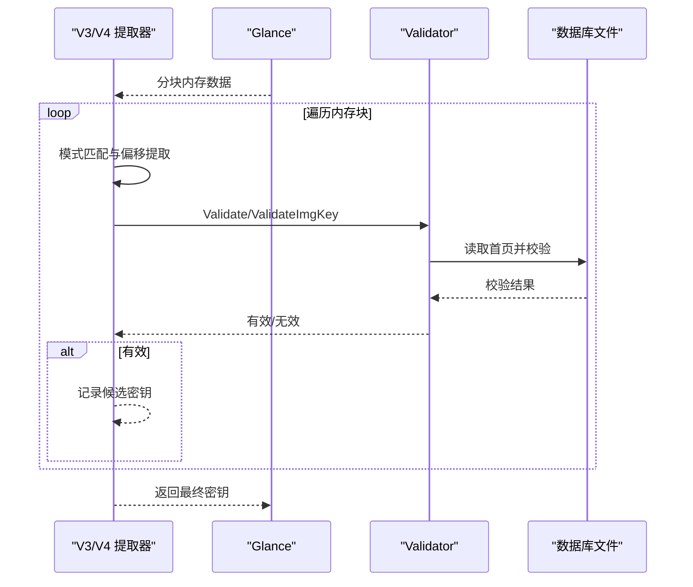
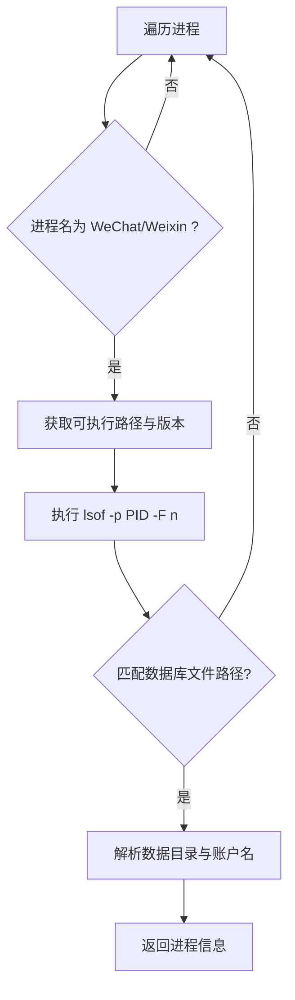
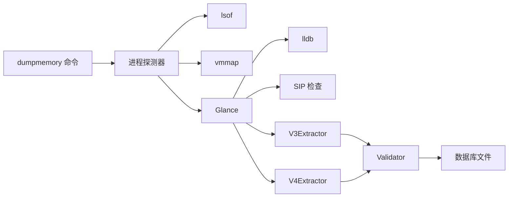

# 内存扫描技术

<cite>
**本文引用的文件**
- [cmd_dumpmemory.go](file://cmd/chatlog/cmd_dumpmemory.go)
- [sip.go](file://internal/wechat/key/darwin/glance/sip.go)
- [vmmap.go](file://internal/wechat/key/darwin/glance/vmmap.go)
- [glance.go](file://internal/wechat/key/darwin/glance/glance.go)
- [v3.go](file://internal/wechat/key/darwin/v3.go)
- [v4.go](file://internal/wechat/key/darwin/v4.go)
- [detector.go](file://internal/wechat/process/darwin/detector.go)
- [process.go](file://internal/wechat/model/process.go)
- [validator.go](file://internal/wechat/decrypt/validator.go)
- [errors.go](file://internal/errors/errors.go)
- [v3_windows.go](file://internal/wechat/key/windows/v3_windows.go)
- [v4_windows.go](file://internal/wechat/key/windows/v4_windows.go)
</cite>

## 目录
1. [引言](#引言)
2. [项目结构](#项目结构)
3. [核心组件](#核心组件)
4. [架构总览](#架构总览)
5. [详细组件分析](#详细组件分析)
6. [依赖关系分析](#依赖关系分析)
7. [性能考量](#性能考量)
8. [故障排查指南](#故障排查指南)
9. [结论](#结论)
10. [附录](#附录)

## 引言
本文件系统性阐述本仓库中的内存扫描技术实现，重点覆盖以下方面：
- 内存扫描算法与地址定位策略
- 数据提取方法与键值校验流程
- macOS 平台的内存扫描实现细节（VM 映射分析、SIP 状态检查、进程内存读取）
- 性能优化、稳定性保障与安全注意事项
- 跨平台差异与挑战（macOS 与 Windows）

## 项目结构
围绕“内存扫描”这一核心能力，相关模块主要分布在如下位置：
- 命令层：提供 dumpmemory 子命令，驱动整个扫描与打包流程
- 进程发现与信息采集：在 macOS 上通过 lsof 和 vmmap 获取微信进程及其数据目录
- 内存读取与分块：基于 vmmap 结果，使用 lldb 将目标进程内存读取到本地管道，并按策略切分为可处理的块
- 密钥提取：在内存块上进行模式匹配与键值校验，最终得到有效的数据库密钥
- 验证器：对候选密钥进行数据库页头校验，确保有效性
- 错误封装：统一错误类型与上下文，便于日志与调试

图表来源
- [cmd_dumpmemory.go](file://cmd/chatlog/cmd_dumpmemory.go#L23-L147)
- [detector.go](file://internal/wechat/process/darwin/detector.go#L32-L165)
- [vmmap.go](file://internal/wechat/key/darwin/glance/vmmap.go#L35-L141)
- [glance.go](file://internal/wechat/key/darwin/glance/glance.go#L41-L154)
- [v3.go](file://internal/wechat/key/darwin/v3.go#L40-L112)
- [v4.go](file://internal/wechat/key/darwin/v4.go#L55-L147)
- [validator.go](file://internal/wechat/decrypt/validator.go#L51-L60)

章节来源
- [cmd_dumpmemory.go](file://cmd/chatlog/cmd_dumpmemory.go#L23-L147)
- [detector.go](file://internal/wechat/process/darwin/detector.go#L32-L165)

## 核心组件
- 命令入口：dumpmemory 子命令负责加载微信进程、读取内存、复制数据库文件并打包
- 进程探测器：在 macOS 上通过进程名匹配与 lsof 文件句柄解析，定位数据目录与账户名
- VM 映射解析：解析 vmmap 输出，过滤可写内存区域，适配不同 Darwin 版本的区域类型
- 内存读取器：通过 lldb attach 目标进程，使用命名管道将二进制内存数据流式读取
- 密钥提取器：V3/V4 提取器在内存块上进行模式匹配与偏移提取，结合 Validator 校验
- 验证器：对候选密钥进行数据库页头校验，确保可解密性；V4 同时支持图片密钥校验

章节来源
- [cmd_dumpmemory.go](file://cmd/chatlog/cmd_dumpmemory.go#L23-L147)
- [detector.go](file://internal/wechat/process/darwin/detector.go#L32-L165)
- [vmmap.go](file://internal/wechat/key/darwin/glance/vmmap.go#L35-L141)
- [glance.go](file://internal/wechat/key/darwin/glance/glance.go#L41-L154)
- [v3.go](file://internal/wechat/key/darwin/v3.go#L40-L112)
- [v4.go](file://internal/wechat/key/darwin/v4.go#L55-L147)
- [validator.go](file://internal/wechat/decrypt/validator.go#L51-L60)

## 架构总览
下图展示了从命令入口到内存读取与密钥提取的整体流程。

图表来源
- [cmd_dumpmemory.go](file://cmd/chatlog/cmd_dumpmemory.go#L23-L147)
- [detector.go](file://internal/wechat/process/darwin/detector.go#L32-L165)
- [glance.go](file://internal/wechat/key/darwin/glance/glance.go#L132-L154)
- [v3.go](file://internal/wechat/key/darwin/v3.go#L40-L112)
- [v4.go](file://internal/wechat/key/darwin/v4.go#L55-L147)
- [validator.go](file://internal/wechat/decrypt/validator.go#L51-L60)

## 详细组件分析

### 组件A：内存读取器（macOS）
- 功能概述
  - 通过 vmmap 获取目标进程的可写内存区域
  - 使用 lldb attach 目标进程，将内存以二进制形式写入命名管道
  - 支持单次读取 Read 与流式分块读取 Read2Chan
- 关键设计点
  - VM 映射过滤：根据 Darwin 内核版本选择合适的区域类型（MALLOC_NANO 或 MALLOC_SMALL），并剔除空区域
  - 流式处理：单个 lldb 实例顺序读取多个区域，每个区域独立命名管道，边读取边分块
  - 分块策略：固定块数乘子与最小块大小控制，末块包含余量，首块追加重叠避免边界漏检
  - 超时与取消：对 lldb 进程设置超时与上下文取消，保证资源回收
- 复杂度与性能
  - 时间复杂度近似 O(N)（N 为内存区域数量），分块读取避免一次性大内存拷贝
  - 空间复杂度受块大小与通道缓冲影响，通过通道背压与上下文取消控制内存峰值

图表来源
- [glance.go](file://internal/wechat/key/darwin/glance/glance.go#L27-L386)
- [vmmap.go](file://internal/wechat/key/darwin/glance/vmmap.go#L23-L141)

章节来源
- [glance.go](file://internal/wechat/key/darwin/glance/glance.go#L41-L154)
- [vmmap.go](file://internal/wechat/key/darwin/glance/vmmap.go#L35-L141)

### 组件B：VM 映射分析与地址定位
- VM 映射解析
  - 解析 vmmap -wide 输出，跳过头部，逐行匹配区域信息
  - 提取起止地址、虚拟大小、驻留大小、权限、共享/私有标记、区域详情等字段
- 区域过滤
  - 根据 uname -r 判断 Darwin 版本，选择 MALLOC_NANO 或 MALLOC_SMALL 类型
  - 过滤空区域，保留可写且非空的内存段
- 地址定位
  - 通过过滤后的 MemRegion 列表作为后续 lldb 读取的目标范围
  - 为每个区域生成独立命名管道，实现并行流式读取

图表来源
- [vmmap.go](file://internal/wechat/key/darwin/glance/vmmap.go#L35-L141)

章节来源
- [vmmap.go](file://internal/wechat/key/darwin/glance/vmmap.go#L35-L141)

### 组件C：SIP 状态检查与平台约束
- SIP 检查
  - 通过 csrutil status 判断系统完整性保护状态
  - 若 SIP 未禁用，则在 macOS 上禁止直接读取进程内存
- 平台差异
  - macOS：依赖 lldb 与 vmmap，需 SIP 禁用
  - Windows：通过 VirtualQueryEx 与 ReadProcessMemory 遍历与读取内存区域

图表来源
- [sip.go](file://internal/wechat/key/darwin/glance/sip.go#L10-L37)

章节来源
- [sip.go](file://internal/wechat/key/darwin/glance/sip.go#L10-L37)
- [v3.go](file://internal/wechat/key/darwin/v3.go#L45-L48)
- [v4.go](file://internal/wechat/key/darwin/v4.go#L60-L63)

### 组件D：密钥提取与数据校验（macOS）
- V3 提取器
  - 使用固定模式与偏移在内存块中向后搜索
  - 提取固定长度字节后交由 Validator 校验
  - 多协程并发消费内存块，生产者单线程推送
- V4 提取器
  - 支持数据密钥与图片密钥两类模式
  - 使用零填充对齐与去零逻辑，避免误判
  - 并发工作池，使用线程安全 map 去重已处理的候选密钥
  - 任一密钥找到即优先上报，双密钥齐全时提前取消其余任务
- 校验器
  - 通过数据库首页校验候选密钥的有效性
  - V4 另提供图片密钥专用校验器

图表来源
- [v3.go](file://internal/wechat/key/darwin/v3.go#L114-L188)
- [v4.go](file://internal/wechat/key/darwin/v4.go#L149-L356)
- [validator.go](file://internal/wechat/decrypt/validator.go#L51-L60)

章节来源
- [v3.go](file://internal/wechat/key/darwin/v3.go#L40-L188)
- [v4.go](file://internal/wechat/key/darwin/v4.go#L55-L356)
- [validator.go](file://internal/wechat/decrypt/validator.go#L51-L60)

### 组件E：进程发现与数据目录定位（macOS）
- 进程发现
  - 遍历进程列表，按名称匹配官方版或测试版微信
  - 获取可执行路径与版本信息
- 数据目录定位
  - 通过 lsof -F n 获取进程打开的文件列表
  - 根据版本选择不同数据库文件路径，解析出数据目录与账户名

图表来源
- [detector.go](file://internal/wechat/process/darwin/detector.go#L32-L165)
- [process.go](file://internal/wechat/model/process.go#L3-L12)

章节来源
- [detector.go](file://internal/wechat/process/darwin/detector.go#L32-L165)
- [process.go](file://internal/wechat/model/process.go#L3-L12)

### 组件F：跨平台内存扫描差异与挑战
- macOS
  - 依赖 vmmap 与 lldb，需 SIP 禁用才可读取其他进程内存
  - 使用命名管道实现 lldb 与 Go 进程之间的二进制数据传输
- Windows
  - 通过 VirtualQueryEx 与 ReadProcessMemory 遍历与读取内存区域
  - V3/V4 提取器在 Windows 中仍采用模式匹配与校验流程，但底层 API 不同
- 共同点
  - 均采用多协程并发扫描与分块处理，提升吞吐
  - 均通过 Validator 校验候选密钥，确保可用性

章节来源
- [v3_windows.go](file://internal/wechat/key/windows/v3_windows.go#L53-L182)
- [v4_windows.go](file://internal/wechat/key/windows/v4_windows.go#L115-L224)

## 依赖关系分析
- 组件耦合
  - 命令层依赖进程探测器与内存读取器
  - 提取器依赖内存读取器提供的内存块与 Validator
  - 内存读取器依赖 VM 映射解析与 SIP 检查
- 外部依赖
  - macOS：vmmap、lldb、lsof、csrutil
  - Windows：VirtualQueryEx、ReadProcessMemory
- 错误传播
  - 统一通过内部错误包装类型传递，便于日志与上层处理

图表来源
- [cmd_dumpmemory.go](file://cmd/chatlog/cmd_dumpmemory.go#L23-L147)
- [detector.go](file://internal/wechat/process/darwin/detector.go#L32-L165)
- [glance.go](file://internal/wechat/key/darwin/glance/glance.go#L41-L154)
- [sip.go](file://internal/wechat/key/darwin/glance/sip.go#L10-L37)
- [v3.go](file://internal/wechat/key/darwin/v3.go#L40-L112)
- [v4.go](file://internal/wechat/key/darwin/v4.go#L55-L147)
- [validator.go](file://internal/wechat/decrypt/validator.go#L51-L60)

章节来源
- [errors.go](file://internal/errors/errors.go#L56-L125)

## 性能考量
- 分块与重叠
  - 固定块数乘子与最小块大小控制吞吐与内存占用
  - 首块追加重叠避免跨边界模式遗漏
- 并发模型
  - 生产者-消费者模型，通道缓冲与 WaitGroup 控制生命周期
  - 最大工作协程数限制，避免过度竞争
- I/O 与超时
  - 命名管道与 lldb 流式读取，减少内存峰值
  - lldb 进程设置超时与上下文取消，防止资源泄漏
- 校验去重
  - V4 使用线程安全 map 去重候选密钥，降低重复校验成本

章节来源
- [glance.go](file://internal/wechat/key/darwin/glance/glance.go#L156-L228)
- [v3.go](file://internal/wechat/key/darwin/v3.go#L70-L112)
- [v4.go](file://internal/wechat/key/darwin/v4.go#L77-L147)

## 故障排查指南
- 常见错误类型
  - 无内存区域：vmmap 未返回可写区域或过滤后为空
  - 读取超时：lldb 进程卡死或目标进程不可访问
  - SIP 启用：macOS 上未禁用 SIP 导致无法读取内存
  - 校验失败：候选密钥不匹配数据库首页
- 排查步骤
  - 确认 SIP 状态：执行 csrutil status 并确保返回“disabled”
  - 检查 vmmap 输出：确认存在可写区域且未被过滤为空
  - 观察 lldb 日志：检查 attach 与 memory read 命令执行情况
  - 调整通道缓冲与最大工作协程数，观察内存与 CPU 使用
- 错误封装与日志
  - 统一错误包装，包含消息、原因、HTTP 码与调用栈，便于定位

章节来源
- [errors.go](file://internal/errors/errors.go#L56-L125)
- [sip.go](file://internal/wechat/key/darwin/glance/sip.go#L10-L37)
- [glance.go](file://internal/wechat/key/darwin/glance/glance.go#L112-L130)
- [v3.go](file://internal/wechat/key/darwin/v3.go#L45-L52)
- [v4.go](file://internal/wechat/key/darwin/v4.go#L60-L67)

## 结论
本仓库在 macOS 平台上实现了完整的内存扫描链路：进程发现、VM 映射分析、SIP 状态检查、流式内存读取与分块处理、模式匹配与密钥校验。通过并发与分块策略，兼顾了性能与稳定性；通过统一错误封装与日志记录，提升了可观测性。跨平台方面，Windows 采用不同的底层 API 实现相同的目标，体现了抽象接口与平台适配的设计思想。

## 附录
- 代码示例路径（不展示具体代码内容）
  - macOS 内存读取入口：[glance.Read](file://internal/wechat/key/darwin/glance/glance.go#L41-L130)
  - 流式分块读取：[glance.Read2Chan](file://internal/wechat/key/darwin/glance/glance.go#L132-L154)
  - VM 映射解析与过滤：[vmmap.GetVmmap/LoadVmmap/MemRegionsFilter](file://internal/wechat/key/darwin/glance/vmmap.go#L35-L141)
  - SIP 状态检查：[sip.IsSIPDisabled](file://internal/wechat/key/darwin/glance/sip.go#L10-L37)
  - V3 密钥提取：[v3.Extract/SearchKey](file://internal/wechat/key/darwin/v3.go#L40-L188)
  - V4 密钥提取：[v4.Extract/SearchKey/SearchImgKey](file://internal/wechat/key/darwin/v4.go#L55-L356)
  - 进程发现与数据目录：[detector.FindProcesses/getOpenFiles](file://internal/wechat/process/darwin/detector.go#L32-L165)
  - 密钥校验：[validator.Validate/ValidateImgKey](file://internal/wechat/decrypt/validator.go#L51-L60)
  - Windows 内存扫描（参考）：[v3_windows.findMemoryV3](file://internal/wechat/key/windows/v3_windows.go#L104-L157)，[v4_windows.findMemoryV4](file://internal/wechat/key/windows/v4_windows.go#L115-L166)