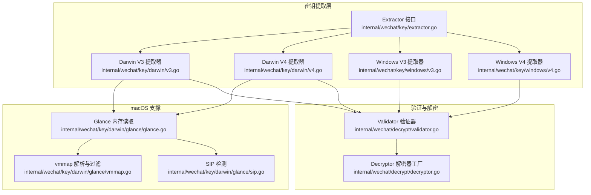
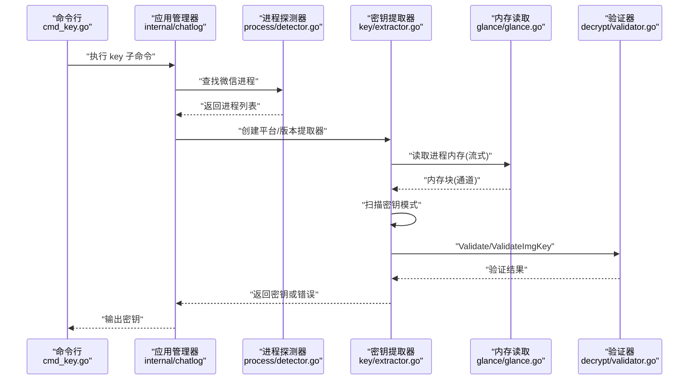
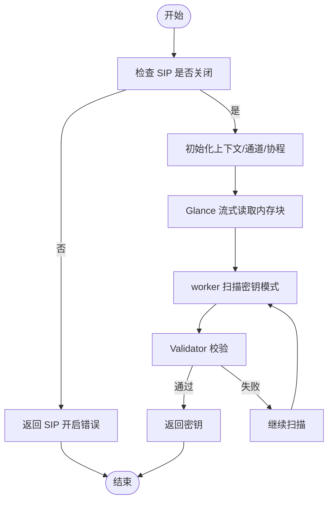
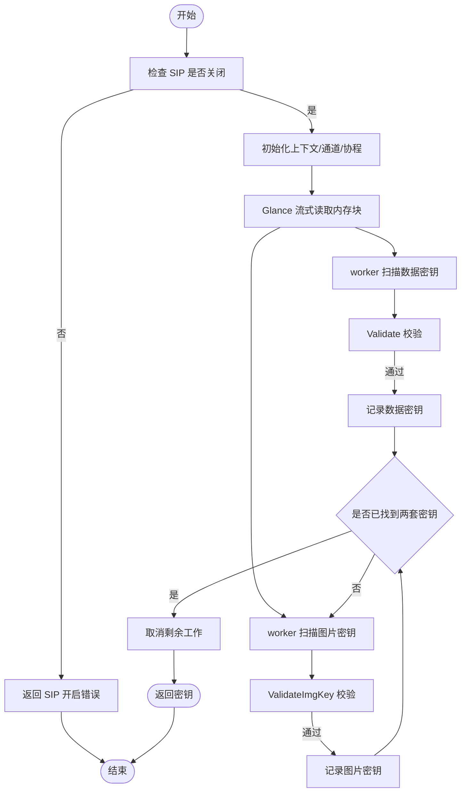
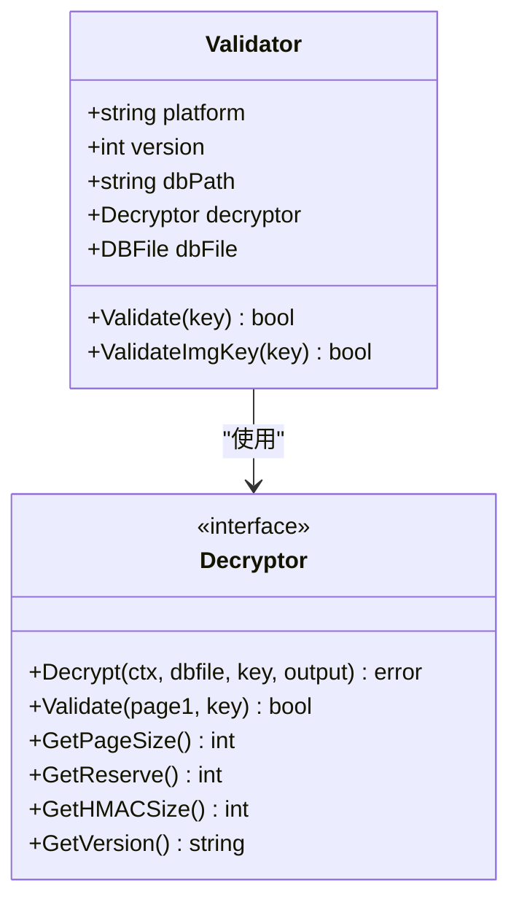
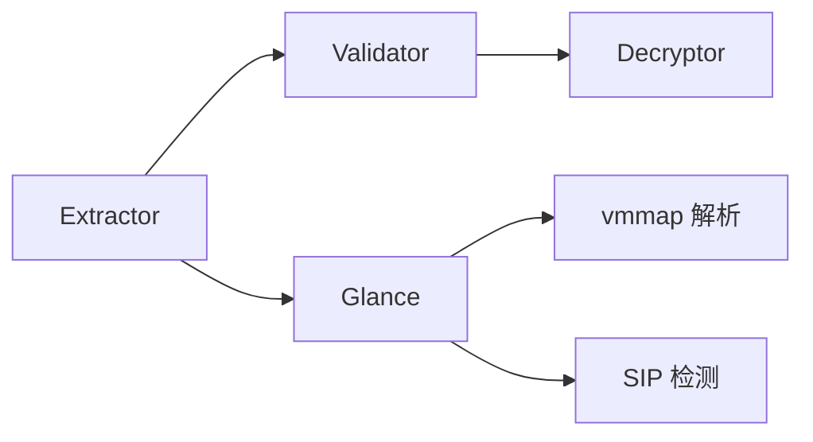

# 密钥管理系统

<cite>
**本文档引用的文件**
- [internal/wechat/key/extractor.go](file://internal/wechat/key/extractor.go)
- [internal/wechat/key/darwin/v3.go](file://internal/wechat/key/darwin/v3.go)
- [internal/wechat/key/darwin/v4.go](file://internal/wechat/key/darwin/v4.go)
- [internal/wechat/key/windows/v3.go](file://internal/wechat/key/windows/v3.go)
- [internal/wechat/key/windows/v4.go](file://internal/wechat/key/windows/v4.go)
- [internal/wechat/key/windows/v3_others.go](file://internal/wechat/key/windows/v3_others.go)
- [internal/wechat/key/windows/v4_others.go](file://internal/wechat/key/windows/v4_others.go)
- [internal/wechat/key/darwin/glance/glance.go](file://internal/wechat/key/darwin/glance/glance.go)
- [internal/wechat/key/darwin/glance/sip.go](file://internal/wechat/key/darwin/glance/sip.go)
- [internal/wechat/key/darwin/glance/vmmap.go](file://internal/wechat/key/darwin/glance/vmmap.go)
- [internal/wechat/decrypt/validator.go](file://internal/wechat/decrypt/validator.go)
- [internal/wechat/decrypt/decryptor.go](file://internal/wechat/decrypt/decryptor.go)
- [internal/wechat/process/detector.go](file://internal/wechat/process/detector.go)
- [cmd/chatlog/cmd_key.go](file://cmd/chatlog/cmd_key.go)
</cite>

## 目录
1. [简介](#简介)
2. [项目结构](#项目结构)
3. [核心组件](#核心组件)
4. [架构总览](#架构总览)
5. [详细组件分析](#详细组件分析)
6. [依赖关系分析](#依赖关系分析)
7. [性能考量](#性能考量)
8. [故障排除指南](#故障排除指南)
9. [结论](#结论)
10. [附录：使用示例与最佳实践](#附录使用示例与最佳实践)

## 简介
本文件为密钥管理系统的综合技术文档，聚焦于平台特定的密钥提取机制，覆盖 Windows 与 macOS 平台、V3/V4 版本差异、密钥验证与存储流程、安全注意事项、密钥格式与用途、最佳实践与故障排除。文档同时提供可直接定位到源码的路径示例，帮助开发者快速理解与集成。

## 项目结构
密钥管理功能主要位于 internal/wechat/key 与 internal/wechat/decrypt 目录，按平台与版本分层组织：
- 提取器接口与工厂：internal/wechat/key/extractor.go
- macOS 提取器（V3/V4）：internal/wechat/key/darwin/v3.go, internal/wechat/key/darwin/v4.go
- Windows 提取器（V3/V4）：internal/wechat/key/windows/v3.go, internal/wechat/key/windows/v4.go
- Windows 非 Windows 实现占位：internal/wechat/key/windows/v3_others.go, internal/wechat/key/windows/v4_others.go
- macOS 内存读取与 SIP 检测：internal/wechat/key/darwin/glance/*
- 密钥验证器：internal/wechat/decrypt/validator.go, internal/wechat/decrypt/decryptor.go
- 进程探测器：internal/wechat/process/detector.go
- 命令入口：cmd/chatlog/cmd_key.go

**图表来源**
- [internal/wechat/key/extractor.go](file://internal/wechat/key/extractor.go#L25-L39)
- [internal/wechat/key/darwin/v3.go](file://internal/wechat/key/darwin/v3.go#L40-L112)
- [internal/wechat/key/darwin/v4.go](file://internal/wechat/key/darwin/v4.go#L55-L147)
- [internal/wechat/key/windows/v3.go](file://internal/wechat/key/windows/v3.go#L13-L24)
- [internal/wechat/key/windows/v4.go](file://internal/wechat/key/windows/v4.go#L13-L24)
- [internal/wechat/key/darwin/glance/glance.go](file://internal/wechat/key/darwin/glance/glance.go#L135-L154)
- [internal/wechat/key/darwin/glance/vmmap.go](file://internal/wechat/key/darwin/glance/vmmap.go#L122-L141)
- [internal/wechat/key/darwin/glance/sip.go](file://internal/wechat/key/darwin/glance/sip.go#L10-L37)
- [internal/wechat/decrypt/validator.go](file://internal/wechat/decrypt/validator.go#L51-L60)
- [internal/wechat/decrypt/decryptor.go](file://internal/wechat/decrypt/decryptor.go#L34-L48)

**章节来源**
- [internal/wechat/key/extractor.go](file://internal/wechat/key/extractor.go#L1-L40)
- [internal/wechat/key/darwin/v3.go](file://internal/wechat/key/darwin/v3.go#L1-L193)
- [internal/wechat/key/darwin/v4.go](file://internal/wechat/key/darwin/v4.go#L1-L366)
- [internal/wechat/key/windows/v3.go](file://internal/wechat/key/windows/v3.go#L1-L25)
- [internal/wechat/key/windows/v4.go](file://internal/wechat/key/windows/v4.go#L1-L25)
- [internal/wechat/key/windows/v3_others.go](file://internal/wechat/key/windows/v3_others.go#L11-L13)
- [internal/wechat/key/windows/v4_others.go](file://internal/wechat/key/windows/v4_others.go#L11-L13)
- [internal/wechat/key/darwin/glance/glance.go](file://internal/wechat/key/darwin/glance/glance.go#L1-L386)
- [internal/wechat/key/darwin/glance/sip.go](file://internal/wechat/key/darwin/glance/sip.go#L1-L38)
- [internal/wechat/key/darwin/glance/vmmap.go](file://internal/wechat/key/darwin/glance/vmmap.go#L1-L187)
- [internal/wechat/decrypt/validator.go](file://internal/wechat/decrypt/validator.go#L1-L76)
- [internal/wechat/decrypt/decryptor.go](file://internal/wechat/decrypt/decryptor.go#L1-L49)
- [internal/wechat/process/detector.go](file://internal/wechat/process/detector.go#L1-L37)
- [cmd/chatlog/cmd_key.go](file://cmd/chatlog/cmd_key.go#L1-L37)

## 核心组件
- 提取器接口与工厂
  - 提供统一的 Extract(ctx, proc) 与 SearchKey(ctx, memory) 能力，并通过 NewExtractor(platform, version) 返回对应平台版本的实现。
  - 参考路径：[internal/wechat/key/extractor.go](file://internal/wechat/key/extractor.go#L14-L39)

- macOS 提取器（V3/V4）
  - V3：基于 Glance 读取内存，多协程扫描密钥模式，使用 Validator 校验。
  - V4：支持数据密钥与图片密钥双通道搜索，带去重与并发优化。
  - 参考路径：
    - [internal/wechat/key/darwin/v3.go](file://internal/wechat/key/darwin/v3.go#L40-L112)
    - [internal/wechat/key/darwin/v4.go](file://internal/wechat/key/darwin/v4.go#L55-L147)

- Windows 提取器（V3/V4）
  - 当前实现为占位，V3/V4 的 Extract/SearchKey 方法返回未实现状态；实际逻辑需在 v3_windows.go/v4_windows.go 中实现。
  - 参考路径：
    - [internal/wechat/key/windows/v3.go](file://internal/wechat/key/windows/v3.go#L17-L20)
    - [internal/wechat/key/windows/v4.go](file://internal/wechat/key/windows/v4.go#L17-L20)
    - [internal/wechat/key/windows/v3_others.go](file://internal/wechat/key/windows/v3_others.go#L11-L13)
    - [internal/wechat/key/windows/v4_others.go](file://internal/wechat/key/windows/v4_others.go#L11-L13)

- macOS 内存读取与环境检查
  - Glance：通过 lldb 流式读取进程内存，按块切分并发送至通道，支持超时与错误处理。
  - vmmap：解析 vmmap 输出，过滤可写内存区域，适配不同 Darwin 版本。
  - SIP：检测系统完整性保护状态，确保具备内存读取权限。
  - 参考路径：
    - [internal/wechat/key/darwin/glance/glance.go](file://internal/wechat/key/darwin/glance/glance.go#L135-L154)
    - [internal/wechat/key/darwin/glance/vmmap.go](file://internal/wechat/key/darwin/glance/vmmap.go#L122-L141)
    - [internal/wechat/key/darwin/glance/sip.go](file://internal/wechat/key/darwin/glance/sip.go#L10-L37)

- 密钥验证与存储
  - Validator：根据平台与版本选择数据库文件，构造 Decryptor，提供 Validate 与 ValidateImgKey。
  - Decryptor：按平台与版本返回具体解密器，提供 Validate、GetPageSize 等能力。
  - 参考路径：
    - [internal/wechat/decrypt/validator.go](file://internal/wechat/decrypt/validator.go#L51-L60)
    - [internal/wechat/decrypt/decryptor.go](file://internal/wechat/decrypt/decryptor.go#L34-L48)

**章节来源**
- [internal/wechat/key/extractor.go](file://internal/wechat/key/extractor.go#L14-L39)
- [internal/wechat/key/darwin/v3.go](file://internal/wechat/key/darwin/v3.go#L40-L112)
- [internal/wechat/key/darwin/v4.go](file://internal/wechat/key/darwin/v4.go#L55-L147)
- [internal/wechat/key/windows/v3.go](file://internal/wechat/key/windows/v3.go#L17-L20)
- [internal/wechat/key/windows/v4.go](file://internal/wechat/key/windows/v4.go#L17-L20)
- [internal/wechat/key/windows/v3_others.go](file://internal/wechat/key/windows/v3_others.go#L11-L13)
- [internal/wechat/key/windows/v4_others.go](file://internal/wechat/key/windows/v4_others.go#L11-L13)
- [internal/wechat/key/darwin/glance/glance.go](file://internal/wechat/key/darwin/glance/glance.go#L135-L154)
- [internal/wechat/key/darwin/glance/vmmap.go](file://internal/wechat/key/darwin/glance/vmmap.go#L122-L141)
- [internal/wechat/key/darwin/glance/sip.go](file://internal/wechat/key/darwin/glance/sip.go#L10-L37)
- [internal/wechat/decrypt/validator.go](file://internal/wechat/decrypt/validator.go#L51-L60)
- [internal/wechat/decrypt/decryptor.go](file://internal/wechat/decrypt/decryptor.go#L34-L48)

## 架构总览
下图展示密钥提取的整体流程：命令入口触发，选择平台与版本提取器，读取进程内存，扫描密钥模式并通过验证器校验，最终返回密钥。

**图表来源**
- [cmd/chatlog/cmd_key.go](file://cmd/chatlog/cmd_key.go#L24-L36)
- [internal/wechat/process/detector.go](file://internal/wechat/process/detector.go#L13-L25)
- [internal/wechat/key/extractor.go](file://internal/wechat/key/extractor.go#L25-L39)
- [internal/wechat/key/darwin/glance/glance.go](file://internal/wechat/key/darwin/glance/glance.go#L135-L154)
- [internal/wechat/decrypt/validator.go](file://internal/wechat/decrypt/validator.go#L51-L60)

## 详细组件分析

### macOS V3 提取器
- 关键点
  - 使用 Glance.Read2Chan 流式读取内存，多协程 worker 并发扫描。
  - 通过 KeyPatternInfo 模式匹配，从内存末尾向前查找，定位密钥偏移并校验。
  - 依赖 Validator.Validate 校验密钥有效性。
  - 必须在 SIP 关闭状态下运行，否则拒绝提取。
- 复杂度与性能
  - 时间复杂度近似 O(N×M)，N 为内存块数量，M 为模式匹配次数；通过多协程与通道流水线提升吞吐。
  - 内存占用受通道缓冲与块大小影响，已做超时与取消控制。
- 错误处理
  - 进程离线、SIP 开启、验证器未设置、无有效密钥等场景均有明确错误返回。

**图表来源**
- [internal/wechat/key/darwin/v3.go](file://internal/wechat/key/darwin/v3.go#L40-L112)
- [internal/wechat/key/darwin/glance/glance.go](file://internal/wechat/key/darwin/glance/glance.go#L135-L154)
- [internal/wechat/decrypt/validator.go](file://internal/wechat/decrypt/validator.go#L51-L53)

**章节来源**
- [internal/wechat/key/darwin/v3.go](file://internal/wechat/key/darwin/v3.go#L40-L112)
- [internal/wechat/key/darwin/glance/glance.go](file://internal/wechat/key/darwin/glance/glance.go#L135-L154)
- [internal/wechat/key/darwin/glance/sip.go](file://internal/wechat/key/darwin/glance/sip.go#L10-L37)
- [internal/wechat/decrypt/validator.go](file://internal/wechat/decrypt/validator.go#L51-L53)

### macOS V4 提取器
- 关键点
  - 同时搜索数据密钥与图片密钥，分别维护 processedDataKeys 与 processedImgKeys 去重。
  - 对零填充模式进行对齐处理，避免误匹配。
  - 优先返回完整密钥组合，支持提前取消剩余工作。
- 复杂度与性能
  - 与 V3 类似，但双通道扫描与去重带来额外开销；通过线程安全 map 降低重复计算。
- 错误处理
  - 与 V3 一致，增加 ValidateImgKey 校验。

**图表来源**
- [internal/wechat/key/darwin/v4.go](file://internal/wechat/key/darwin/v4.go#L55-L147)
- [internal/wechat/key/darwin/glance/glance.go](file://internal/wechat/key/darwin/glance/glance.go#L135-L154)
- [internal/wechat/decrypt/validator.go](file://internal/wechat/decrypt/validator.go#L55-L59)

**章节来源**
- [internal/wechat/key/darwin/v4.go](file://internal/wechat/key/darwin/v4.go#L55-L147)
- [internal/wechat/key/darwin/glance/glance.go](file://internal/wechat/key/darwin/glance/glance.go#L135-L154)
- [internal/wechat/decrypt/validator.go](file://internal/wechat/decrypt/validator.go#L55-L59)

### Windows 提取器（V3/V4）
- 当前状态
  - V3/V4 的 Extract/SearchKey 为占位实现，返回未实现状态；实际逻辑需在 v3_windows.go/v4_windows.go 中补充。
  - 非 Windows 平台构建时，Extract 返回空结果。
- 建议
  - 参考 macOS 实现，结合平台特性（如 Windows API 或第三方工具）设计内存读取与密钥扫描策略。
  - 保持与 Validator 的接口一致性，确保 Validate/ValidateImgKey 能正确校验密钥。

**章节来源**
- [internal/wechat/key/windows/v3.go](file://internal/wechat/key/windows/v3.go#L17-L20)
- [internal/wechat/key/windows/v4.go](file://internal/wechat/key/windows/v4.go#L17-L20)
- [internal/wechat/key/windows/v3_others.go](file://internal/wechat/key/windows/v3_others.go#L11-L13)
- [internal/wechat/key/windows/v4_others.go](file://internal/wechat/key/windows/v4_others.go#L11-L13)

### 验证器与解密器
- Validator
  - 根据平台与版本选择数据库文件，构造 Decryptor，提供 Validate 与 ValidateImgKey。
  - V4 时加载图片密钥验证器以支持图片密钥校验。
- Decryptor
  - 工厂函数按平台与版本返回具体实现，提供 Validate、GetPageSize、GetReserve、GetHMACSize、GetVersion 等能力。

**图表来源**
- [internal/wechat/decrypt/validator.go](file://internal/wechat/decrypt/validator.go#L10-L49)
- [internal/wechat/decrypt/decryptor.go](file://internal/wechat/decrypt/decryptor.go#L12-L31)

**章节来源**
- [internal/wechat/decrypt/validator.go](file://internal/wechat/decrypt/validator.go#L10-L49)
- [internal/wechat/decrypt/decryptor.go](file://internal/wechat/decrypt/decryptor.go#L12-L31)

## 依赖关系分析
- 组件耦合
  - Extractor 依赖 Validator 与平台内存读取（macOS 通过 Glance）。
  - Glance 依赖 vmmap 解析与 SIP 检测。
  - Validator 依赖 Decryptor 与数据库文件。
- 平台差异
  - macOS：通过 lldb 流式读取内存，需要 SIP 关闭。
  - Windows：当前未实现，需补充平台特定逻辑。
- 循环依赖
  - 未发现循环导入；各模块职责清晰，接口边界明确。

**图表来源**
- [internal/wechat/key/extractor.go](file://internal/wechat/key/extractor.go#L25-L39)
- [internal/wechat/key/darwin/glance/glance.go](file://internal/wechat/key/darwin/glance/glance.go#L135-L154)
- [internal/wechat/key/darwin/glance/vmmap.go](file://internal/wechat/key/darwin/glance/vmmap.go#L122-L141)
- [internal/wechat/key/darwin/glance/sip.go](file://internal/wechat/key/darwin/glance/sip.go#L10-L37)
- [internal/wechat/decrypt/validator.go](file://internal/wechat/decrypt/validator.go#L51-L60)
- [internal/wechat/decrypt/decryptor.go](file://internal/wechat/decrypt/decryptor.go#L34-L48)

**章节来源**
- [internal/wechat/key/extractor.go](file://internal/wechat/key/extractor.go#L25-L39)
- [internal/wechat/key/darwin/glance/glance.go](file://internal/wechat/key/darwin/glance/glance.go#L135-L154)
- [internal/wechat/key/darwin/glance/vmmap.go](file://internal/wechat/key/darwin/glance/vmmap.go#L122-L141)
- [internal/wechat/key/darwin/glance/sip.go](file://internal/wechat/key/darwin/glance/sip.go#L10-L37)
- [internal/wechat/decrypt/validator.go](file://internal/wechat/decrypt/validator.go#L51-L60)
- [internal/wechat/decrypt/decryptor.go](file://internal/wechat/decrypt/decryptor.go#L34-L48)

## 性能考量
- 并发与流水线
  - macOS 提取器使用多 worker 协程与通道流水线，显著提升扫描吞吐。
  - 建议根据 CPU 核数动态调整 worker 数量，避免过度并发导致上下文切换开销。
- 内存块切分
  - 采用固定块数与重叠边界策略，平衡扫描精度与性能。
  - 对大内存区域进行分块，减少单次分配与拷贝。
- 校验与去重
  - V4 提取器对已处理密钥进行去重，避免重复校验。
  - Validate/ValidateImgKey 应尽量轻量，必要时引入缓存或短生命周期校验器。
- 超时与取消
  - 所有长耗时操作均支持 context 取消与超时，防止资源泄露。

[本节为通用性能建议，不直接分析具体文件]

## 故障排除指南
- macOS 提示 SIP 开启
  - 现象：提取器直接返回 SIP 开启错误。
  - 处理：关闭 SIP 后重试；可通过 sip.go 的 IsSIPDisabled 判断。
  - 参考路径：[internal/wechat/key/darwin/glance/sip.go](file://internal/wechat/key/darwin/glance/sip.go#L10-L37)
- 无内存区域可读
  - 现象：vmmap 解析后无可用内存区域。
  - 处理：确认进程状态、Darwin 版本适配、过滤规则是否正确。
  - 参考路径：[internal/wechat/key/darwin/glance/vmmap.go](file://internal/wechat/key/darwin/glance/vmmap.go#L122-L141)
- lldb 读取超时或失败
  - 现象：内存读取超时或命令执行失败。
  - 处理：检查 lldb 可用性、权限、进程是否存在；适当增大超时时间。
  - 参考路径：[internal/wechat/key/darwin/glance/glance.go](file://internal/wechat/key/darwin/glance/glance.go#L113-L128)
- 未找到有效密钥
  - 现象：扫描完成仍返回无有效密钥。
  - 处理：确认密钥模式配置、验证器是否正确初始化、进程是否在线。
  - 参考路径：[internal/wechat/key/darwin/v3.go](file://internal/wechat/key/darwin/v3.go#L111-L111), [internal/wechat/key/darwin/v4.go](file://internal/wechat/key/darwin/v4.go#L129-L129)
- Windows 未实现
  - 现象：V3/V4 提取器返回未实现。
  - 处理：补充 v3_windows.go/v4_windows.go 的 Extract/SearchKey 实现。
  - 参考路径：[internal/wechat/key/windows/v3.go](file://internal/wechat/key/windows/v3.go#L17-L20), [internal/wechat/key/windows/v4.go](file://internal/wechat/key/windows/v4.go#L17-L20)

**章节来源**
- [internal/wechat/key/darwin/glance/sip.go](file://internal/wechat/key/darwin/glance/sip.go#L10-L37)
- [internal/wechat/key/darwin/glance/vmmap.go](file://internal/wechat/key/darwin/glance/vmmap.go#L122-L141)
- [internal/wechat/key/darwin/glance/glance.go](file://internal/wechat/key/darwin/glance/glance.go#L113-L128)
- [internal/wechat/key/darwin/v3.go](file://internal/wechat/key/darwin/v3.go#L111-L111)
- [internal/wechat/key/darwin/v4.go](file://internal/wechat/key/darwin/v4.go#L129-L129)
- [internal/wechat/key/windows/v3.go](file://internal/wechat/key/windows/v3.go#L17-L20)
- [internal/wechat/key/windows/v4.go](file://internal/wechat/key/windows/v4.go#L17-L20)

## 结论
本密钥管理系统在 macOS 上提供了成熟的内存扫描与密钥验证流程，具备良好的并发与容错能力；在 Windows 平台上尚处于扩展阶段，需补充平台特定实现。通过 Validator 与 Decryptor 的清晰分离，系统具备良好的可维护性与可扩展性。建议在生产环境中严格遵循安全规范，谨慎处理密钥与日志。

[本节为总结性内容，不直接分析具体文件]

## 附录：使用示例与最佳实践

### 命令行使用
- 获取密钥
  - 示例命令：chatlog key --pid <进程ID> [--force] [--xor-key]
  - 参数说明：
    - --pid/-p：目标进程 ID
    - --force/-f：强制模式（由业务决定）
    - --xor-key/-x：显示 XOR 密钥（如适用）
  - 参考路径：[cmd/chatlog/cmd_key.go](file://cmd/chatlog/cmd_key.go#L24-L36)

**章节来源**
- [cmd/chatlog/cmd_key.go](file://cmd/chatlog/cmd_key.go#L24-L36)

### 最佳实践
- 平台与版本选择
  - 使用 NewExtractor 自动选择平台与版本实现，避免硬编码分支。
  - 参考路径：[internal/wechat/key/extractor.go](file://internal/wechat/key/extractor.go#L25-L39)
- 安全与合规
  - macOS 必须在 SIP 关闭环境下运行；Windows 需满足平台权限要求。
  - 参考路径：[internal/wechat/key/darwin/glance/sip.go](file://internal/wechat/key/darwin/glance/sip.go#L10-L37)
- 性能优化
  - 控制 worker 数量，合理设置通道缓冲；对重复密钥进行去重。
  - 参考路径：[internal/wechat/key/darwin/v4.go](file://internal/wechat/key/darwin/v4.go#L77-L84), [internal/wechat/key/darwin/v4.go](file://internal/wechat/key/darwin/v4.go#L261-L264)
- 错误处理
  - 明确区分“无有效密钥”、“SIP 开启”、“进程离线”等错误类型，便于上层处理。
  - 参考路径：[internal/wechat/key/darwin/v3.go](file://internal/wechat/key/darwin/v3.go#L41-L52), [internal/wechat/key/darwin/v4.go](file://internal/wechat/key/darwin/v4.go#L56-L67)

### 密钥格式与用途
- 数据密钥（V3/V4）
  - 长度通常为 32 字节，用于数据库解密。
  - 通过 Validator.Validate 校验。
  - 参考路径：[internal/wechat/decrypt/validator.go](file://internal/wechat/decrypt/validator.go#L51-L53)
- 图片密钥（V4）
  - 长度通常为 16 字节，用于图片解密。
  - 通过 Validator.ValidateImgKey 校验。
  - 参考路径：[internal/wechat/decrypt/validator.go](file://internal/wechat/decrypt/validator.go#L55-L59)

### 代码示例（路径指引）
- 创建提取器并提取密钥（macOS V3/V4）
  - NewExtractor → Extract → SearchKey → Validator.Validate/ValidateImgKey
  - 参考路径：
    - [internal/wechat/key/extractor.go](file://internal/wechat/key/extractor.go#L25-L39)
    - [internal/wechat/key/darwin/v3.go](file://internal/wechat/key/darwin/v3.go#L40-L112)
    - [internal/wechat/key/darwin/v4.go](file://internal/wechat/key/darwin/v4.go#L55-L147)
- 流式内存读取（macOS）
  - Glance.Read2Chan → processMemoryRegion → channel 分发
  - 参考路径：[internal/wechat/key/darwin/glance/glance.go](file://internal/wechat/key/darwin/glance/glance.go#L135-L154), [internal/wechat/key/darwin/glance/glance.go](file://internal/wechat/key/darwin/glance/glance.go#L157-L228)
- 验证密钥
  - Validator.Validate/ValidateImgKey → Decryptor.Validate
  - 参考路径：[internal/wechat/decrypt/validator.go](file://internal/wechat/decrypt/validator.go#L51-L60), [internal/wechat/decrypt/decryptor.go](file://internal/wechat/decrypt/decryptor.go#L34-L48)