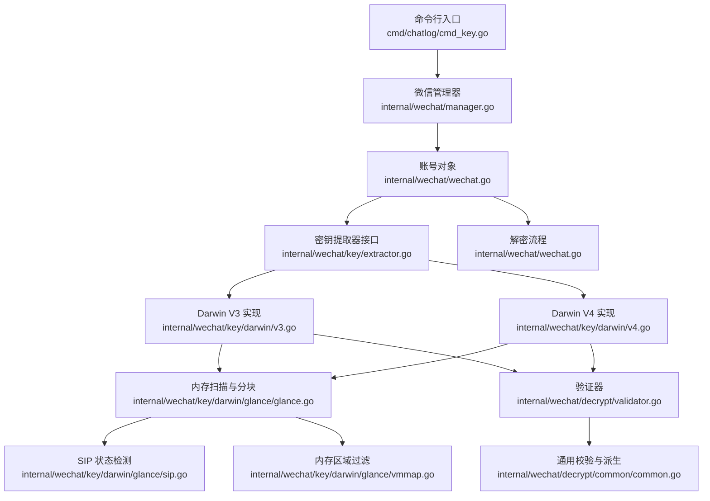
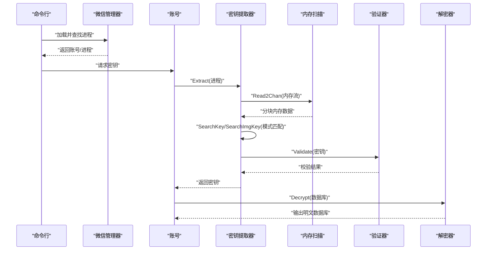
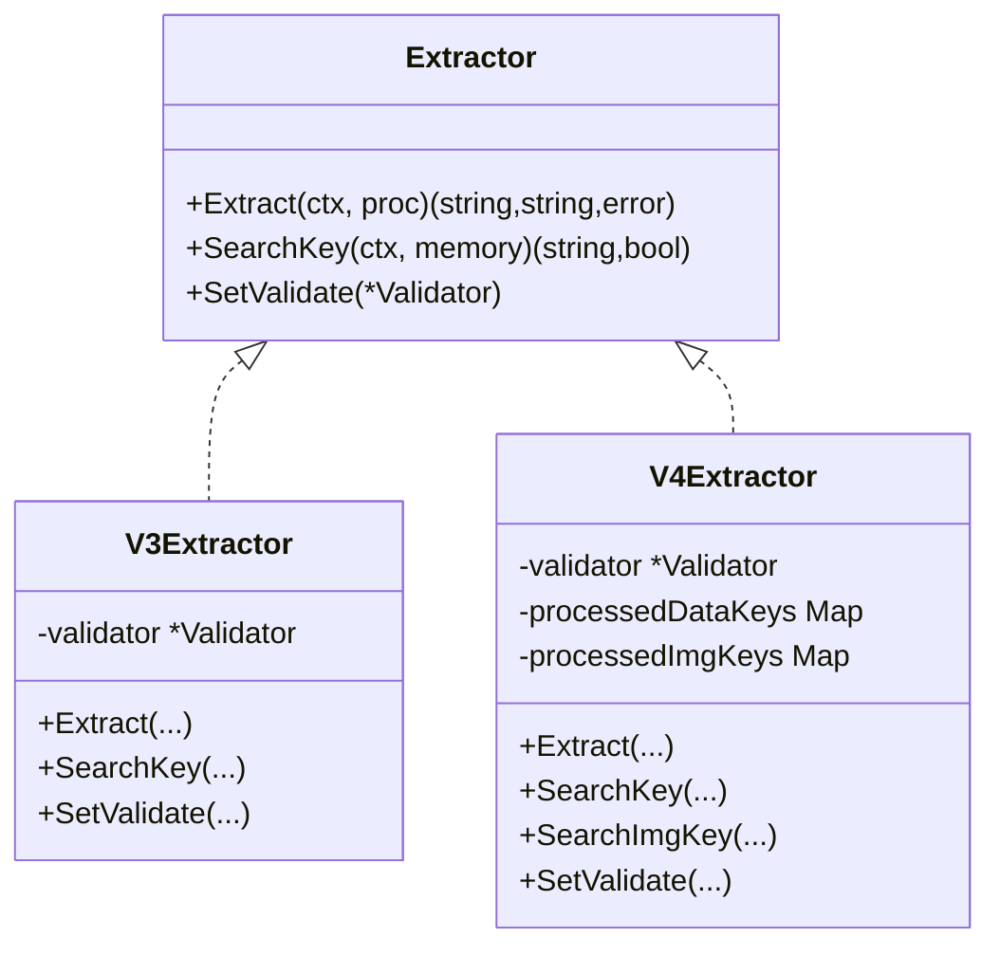
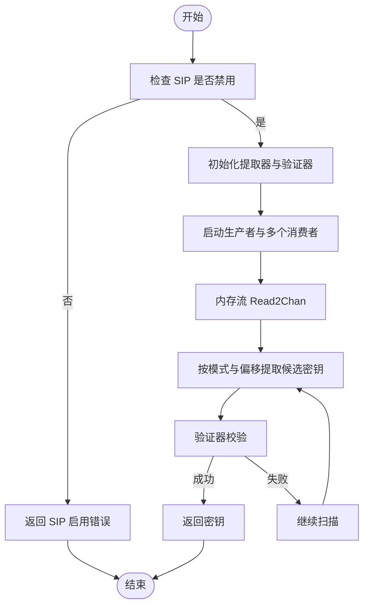
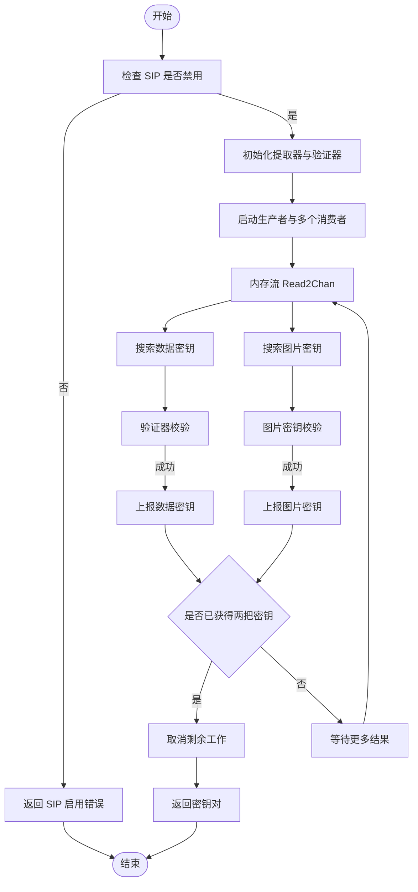
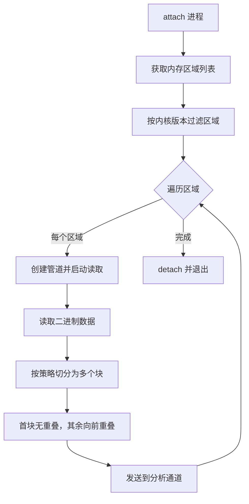
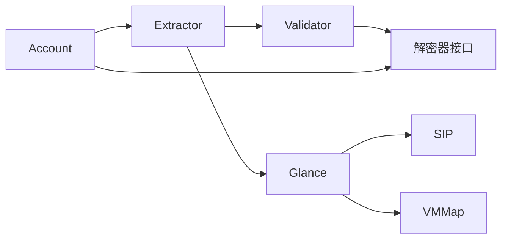

# 密钥验证与存储

<cite>
**本文引用的文件**
- [cmd_key.go](file://cmd/chatlog/cmd_key.go)
- [extractor.go](file://internal/wechat/key/extractor.go)
- [v3.go（darwin）](file://internal/wechat/key/darwin/v3.go)
- [v4.go（darwin）](file://internal/wechat/key/darwin/v4.go)
- [glance.go](file://internal/wechat/key/darwin/glance/glance.go)
- [sip.go](file://internal/wechat/key/darwin/glance/sip.go)
- [vmmap.go](file://internal/wechat/key/darwin/glance/vmmap.go)
- [validator.go](file://internal/wechat/decrypt/validator.go)
- [common.go](file://internal/wechat/decrypt/common/common.go)
- [manager.go](file://internal/wechat/manager.go)
- [wechat.go](file://internal/wechat/wechat.go)
</cite>

## 目录
1. [简介](#简介)
2. [项目结构](#项目结构)
3. [核心组件](#核心组件)
4. [架构总览](#架构总览)
5. [组件详解](#组件详解)
6. [依赖关系分析](#依赖关系分析)
7. [性能考量](#性能考量)
8. [故障排查指南](#故障排查指南)
9. [结论](#结论)
10. [附录](#附录)

## 简介
本文件系统性梳理密钥验证与存储机制，覆盖以下主题：
- 密钥验证算法与格式校验
- 解密测试流程与数据库一致性校验
- 密钥存储策略、缓存与安全存储选项
- 密钥生命周期管理、轮换与销毁
- 错误处理、性能优化与安全注意事项
- 提供可落地的实现参考路径（以源码路径代替具体代码）

## 项目结构
围绕“密钥提取—验证—解密”的主链路，关键模块如下：
- 命令入口：解析用户参数并调用业务逻辑
- 平台化密钥提取器：按平台与版本选择具体实现
- 内存扫描与模式匹配：在目标进程内存中定位密钥候选
- 验证器：基于数据库首页与派生算法进行密钥有效性校验
- 解密器：完成数据库解密与输出
- 进程与账号管理：发现进程、构建账号上下文



**图表来源**
- [cmd_key.go](file://cmd/chatlog/cmd_key.go#L24-L36)
- [manager.go](file://internal/wechat/manager.go#L35-L49)
- [wechat.go](file://internal/wechat/wechat.go#L103-L141)
- [extractor.go](file://internal/wechat/key/extractor.go#L13-L23)
- [v3.go（darwin）](file://internal/wechat/key/darwin/v3.go#L29-L38)
- [v4.go（darwin）](file://internal/wechat/key/darwin/v4.go#L40-L53)
- [glance.go](file://internal/wechat/key/darwin/glance/glance.go#L132-L154)
- [sip.go](file://internal/wechat/key/darwin/glance/sip.go#L8-L37)
- [vmmap.go](file://internal/wechat/key/darwin/glance/vmmap.go#L35-L45)
- [validator.go](file://internal/wechat/decrypt/validator.go#L10-L17)
- [common.go](file://internal/wechat/decrypt/common/common.go#L79-L98)

**章节来源**
- [cmd_key.go](file://cmd/chatlog/cmd_key.go#L12-L36)
- [manager.go](file://internal/wechat/manager.go#L35-L76)
- [wechat.go](file://internal/wechat/wechat.go#L103-L141)

## 核心组件
- 密钥提取器接口与工厂
  - 接口定义了从进程提取密钥、在内存中搜索、设置验证器的能力
  - 工厂根据平台与版本返回对应实现（Darwin V3/V4）
- Darwin V3/V4 提取器
  - V3：基于模式匹配与验证器校验，多协程并发扫描内存
  - V4：同时搜索数据密钥与图片密钥，带去重与优先返回策略
- 内存扫描与分块
  - 通过 lldb 读取进程内存，按固定数量与最小块大小切分，叠加边界重叠避免漏检
  - 过滤可写内存区域，适配不同内核版本
- 验证器
  - 基于数据库首页盐值与派生函数，计算并比对 HMAC，确保密钥与数据库一致
- 解密器与解密流程
  - 依据平台与版本选择解密器，先校验再解密输出

**章节来源**
- [extractor.go](file://internal/wechat/key/extractor.go#L13-L39)
- [v3.go（darwin）](file://internal/wechat/key/darwin/v3.go#L29-L112)
- [v4.go（darwin）](file://internal/wechat/key/darwin/v4.go#L40-L147)
- [glance.go](file://internal/wechat/key/darwin/glance/glance.go#L132-L228)
- [vmmap.go](file://internal/wechat/key/darwin/glance/vmmap.go#L122-L141)
- [validator.go](file://internal/wechat/decrypt/validator.go#L10-L49)
- [common.go](file://internal/wechat/decrypt/common/common.go#L79-L98)
- [wechat.go](file://internal/wechat/wechat.go#L118-L141)

## 架构总览
下图展示密钥提取到验证再到解密的关键交互。



**图表来源**
- [cmd_key.go](file://cmd/chatlog/cmd_key.go#L24-L36)
- [manager.go](file://internal/wechat/manager.go#L52-L76)
- [wechat.go](file://internal/wechat/wechat.go#L103-L141)
- [extractor.go](file://internal/wechat/key/extractor.go#L13-L23)
- [v3.go（darwin）](file://internal/wechat/key/darwin/v3.go#L40-L112)
- [v4.go（darwin）](file://internal/wechat/key/darwin/v4.go#L55-L147)
- [glance.go](file://internal/wechat/key/darwin/glance/glance.go#L132-L154)
- [validator.go](file://internal/wechat/decrypt/validator.go#L51-L60)

## 组件详解

### 密钥提取器接口与工厂
- 接口职责
  - Extract：从进程提取数据密钥与图片密钥
  - SearchKey/SearchImgKey：在内存块中按模式偏移提取候选密钥
  - SetValidate：注入验证器
- 工厂选择
  - Windows V3/V4 与 Darwin V3/V4 分支实例化
  - 不支持的组合返回错误



**图表来源**
- [extractor.go](file://internal/wechat/key/extractor.go#L13-L23)
- [v3.go（darwin）](file://internal/wechat/key/darwin/v3.go#L9-L24)
- [v4.go（darwin）](file://internal/wechat/key/darwin/v4.go#L40-L46)

**章节来源**
- [extractor.go](file://internal/wechat/key/extractor.go#L13-L39)

### Darwin V3 密钥提取
- 流程要点
  - 检查 SIP 状态；未禁用则拒绝提取
  - 设置验证器后，启动生产者协程读取内存，消费者协程并发扫描
  - 模式匹配从内存末尾向前搜索，按偏移提取固定长度密钥
  - 通过验证器校验，命中即返回
- 并发模型
  - CPU 数量决定工作协程上限，最多 8 个
  - 使用通道与 WaitGroup 协调生产/消费与收尾



**图表来源**
- [v3.go（darwin）](file://internal/wechat/key/darwin/v3.go#L40-L112)
- [glance.go](file://internal/wechat/key/darwin/glance/glance.go#L132-L154)
- [sip.go](file://internal/wechat/key/darwin/glance/sip.go#L8-L37)

**章节来源**
- [v3.go（darwin）](file://internal/wechat/key/darwin/v3.go#L40-L188)

### Darwin V4 密钥提取
- 流程要点
  - 同时搜索数据密钥与图片密钥，分别维护去重表
  - 一旦任一密钥被发现立即上报，若两者均就绪则取消其余工作
  - 支持零填充对齐与边界修正，避免误报
- 并发模型
  - 与 V3 类似，但双通道并行搜索，结果聚合后返回



**图表来源**
- [v4.go（darwin）](file://internal/wechat/key/darwin/v4.go#L55-L147)
- [glance.go](file://internal/wechat/key/darwin/glance/glance.go#L132-L154)
- [sip.go](file://internal/wechat/key/darwin/glance/sip.go#L8-L37)

**章节来源**
- [v4.go（darwin）](file://internal/wechat/key/darwin/v4.go#L55-L356)

### 内存扫描与分块策略
- 读取方式
  - 使用 lldb 逐区段读取，每个区段独立管道，边读边处理
  - 通过一次性 attach 进程，减少开销
- 分块与重叠
  - 固定块数策略，结合最小块大小动态调整
  - 首块无前向重叠，其余块向前扩展重叠字节，保证跨边界匹配
- 区域过滤
  - 根据内核版本选择不同区域类型，过滤空区域与不可写区域



**图表来源**
- [glance.go](file://internal/wechat/key/darwin/glance/glance.go#L230-L385)
- [vmmap.go](file://internal/wechat/key/darwin/glance/vmmap.go#L122-L141)

**章节来源**
- [glance.go](file://internal/wechat/key/darwin/glance/glance.go#L132-L228)
- [vmmap.go](file://internal/wechat/key/darwin/glance/vmmap.go#L35-L141)

### 密钥验证算法与格式检查
- 验证流程
  - 从数据库首页读取盐值，使用派生函数生成加密与 MAC 密钥
  - 基于页面内容与页号计算 HMAC，并与存储的 HMAC 比较
- 格式要求
  - 密钥长度固定，且与数据库页大小、保留区等字段一致
- 图片密钥校验
  - V4 额外提供图片密钥专用校验器

```mermaid
flowchart TD
ReadFirst["读取数据库首页"] --> Derive["派生加密与MAC密钥"]
Derive --> Calc["计算HMAC(含页号)"
Calc --> Compare{"与存储HMAC一致?"}
Compare --> |是| Valid["密钥有效"]
Compare --> |否| Invalid["密钥无效"]
```

**图表来源**
- [validator.go](file://internal/wechat/decrypt/validator.go#L51-L60)
- [common.go](file://internal/wechat/decrypt/common/common.go#L79-L98)

**章节来源**
- [validator.go](file://internal/wechat/decrypt/validator.go#L10-L60)
- [common.go](file://internal/wechat/decrypt/common/common.go#L79-L98)

### 解密测试流程
- 步骤
  - 读取数据库首页，校验密钥有效性
  - 按页解密并写入输出，验证完整性
- 输出
  - 成功后输出明文数据库文件

**章节来源**
- [wechat.go](file://internal/wechat/wechat.go#L118-L141)

### 密钥存储策略、缓存与安全存储
- 存储位置
  - 账号对象持有密钥，后续解密直接使用
- 缓存机制
  - V4 提取器内部使用线程安全映射记录已处理的密钥，避免重复验证
- 安全存储建议
  - 将密钥保存在受限权限目录，避免持久化明文
  - 使用系统安全存储或加密容器（建议做法，非现有实现）
- 生命周期管理
  - 获取密钥后立即用于解密，不长期驻留内存
  - 解密完成后及时清理敏感数据

**章节来源**
- [v4.go（darwin）](file://internal/wechat/key/darwin/v4.go#L44-L46)
- [wechat.go](file://internal/wechat/wechat.go#L103-L116)

### 密钥轮换与安全销毁
- 轮换策略
  - 当数据库重新加密或密钥更新时，重新执行提取与验证流程
- 安全销毁
  - 清理内存中的密钥副本，避免被转储
  - 删除临时文件与管道

**章节来源**
- [v3.go（darwin）](file://internal/wechat/key/darwin/v3.go#L101-L112)
- [v4.go（darwin）](file://internal/wechat/key/darwin/v4.go#L119-L146)

## 依赖关系分析
- 组件耦合
  - 提取器依赖验证器与内存扫描工具
  - 验证器依赖解密器与数据库首页
  - 账号对象协调提取器与解密器
- 外部依赖
  - macOS lldb 用于内存读取
  - 系统完整性保护状态影响内存访问能力



**图表来源**
- [extractor.go](file://internal/wechat/key/extractor.go#L13-L23)
- [validator.go](file://internal/wechat/decrypt/validator.go#L10-L17)
- [glance.go](file://internal/wechat/key/darwin/glance/glance.go#L132-L154)
- [sip.go](file://internal/wechat/key/darwin/glance/sip.go#L8-L37)
- [vmmap.go](file://internal/wechat/key/darwin/glance/vmmap.go#L122-L141)
- [wechat.go](file://internal/wechat/wechat.go#L103-L141)

**章节来源**
- [manager.go](file://internal/wechat/manager.go#L35-L76)

## 性能考量
- 并发与吞吐
  - 工作协程数与 CPU 核数相关，上限 8，平衡 I/O 与 CPU 利用
- 内存分块
  - 固定块数策略与最小块大小控制内存占用与匹配精度
  - 重叠边界提升召回率，降低误判
- I/O 与命令开销
  - lldb attach/read/quit 的成本较高，尽量减少不必要的重试
- 验证成本
  - 派生与 HMAC 计算为 CPU 密集型，建议批量验证时复用中间态

[本节为通用性能讨论，无需列出具体文件来源]

## 故障排查指南
- 常见错误与定位
  - SIP 启用：在 macOS 上需禁用 SIP 才能读取内存
  - 无内存区域：进程内存映射为空或被过滤
  - 未设置验证器：提取器缺少验证器导致无法校验
  - 未找到有效密钥：模式不匹配或密钥已被释放
  - 平台/版本不支持：工厂返回不支持的组合
- 建议排查步骤
  - 确认 SIP 状态
  - 检查进程在线状态与权限
  - 观察日志输出，确认内存读取与分块过程
  - 校验密钥长度与格式

**章节来源**
- [v3.go（darwin）](file://internal/wechat/key/darwin/v3.go#L40-L52)
- [v4.go（darwin）](file://internal/wechat/key/darwin/v4.go#L55-L67)
- [glance.go](file://internal/wechat/key/darwin/glance/glance.go#L132-L154)
- [sip.go](file://internal/wechat/key/darwin/glance/sip.go#L8-L37)
- [extractor.go](file://internal/wechat/key/extractor.go#L36-L38)

## 结论
该系统通过平台化提取器、内存流式扫描与数据库首页 HMAC 校验，实现了高鲁棒性的密钥提取与验证。并发模型与内存分块策略兼顾了准确性与性能。建议在实际部署中强化密钥的短期驻留与安全存储，并建立完善的轮换与销毁流程。

[本节为总结性内容，无需列出具体文件来源]

## 附录

### 命令行入口与密钥获取
- 入口命令注册与参数解析
- 调用业务层获取密钥并打印

**章节来源**
- [cmd_key.go](file://cmd/chatlog/cmd_key.go#L12-L36)

### 关键实现参考路径
- 密钥提取器接口与工厂
  - [extractor.go](file://internal/wechat/key/extractor.go#L13-L39)
- Darwin V3 提取器
  - [v3.go（darwin）](file://internal/wechat/key/darwin/v3.go#L29-L112)
- Darwin V4 提取器
  - [v4.go（darwin）](file://internal/wechat/key/darwin/v4.go#L40-L147)
- 内存扫描与分块
  - [glance.go](file://internal/wechat/key/darwin/glance/glance.go#L132-L228)
  - [vmmap.go](file://internal/wechat/key/darwin/glance/vmmap.go#L122-L141)
  - [sip.go](file://internal/wechat/key/darwin/glance/sip.go#L8-L37)
- 验证器与通用校验
  - [validator.go](file://internal/wechat/decrypt/validator.go#L10-L60)
  - [common.go](file://internal/wechat/decrypt/common/common.go#L79-L98)
- 账号与解密流程
  - [wechat.go](file://internal/wechat/wechat.go#L103-L141)
- 进程与账号管理
  - [manager.go](file://internal/wechat/manager.go#L35-L76)