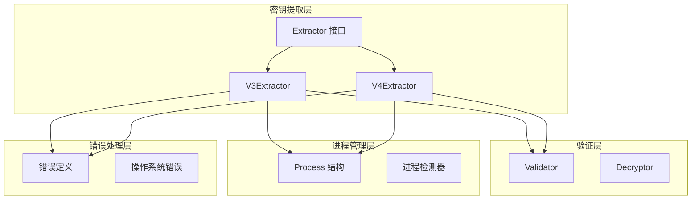
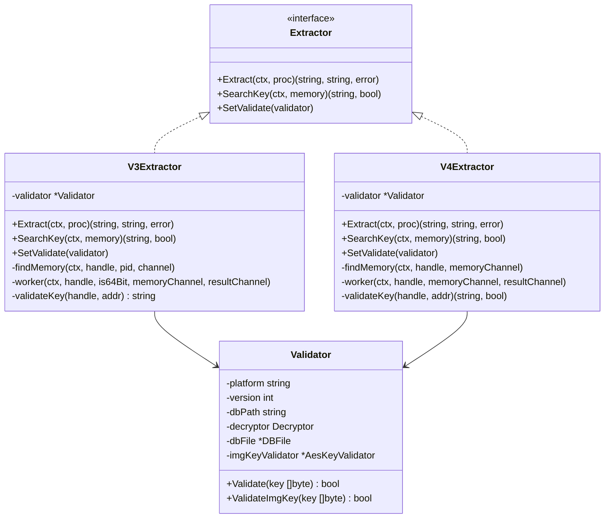
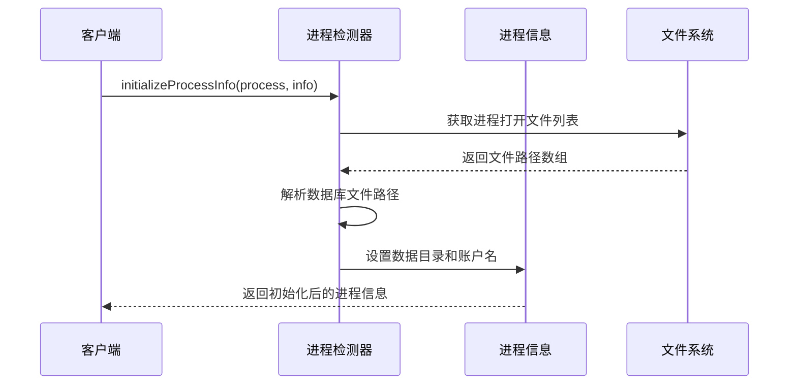
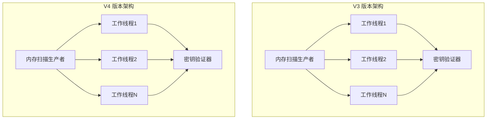
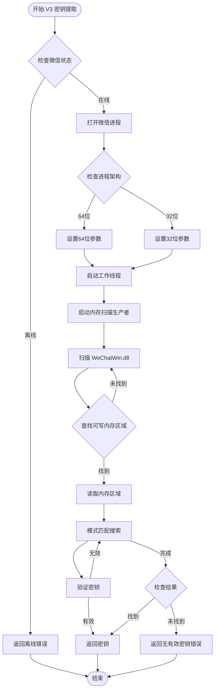
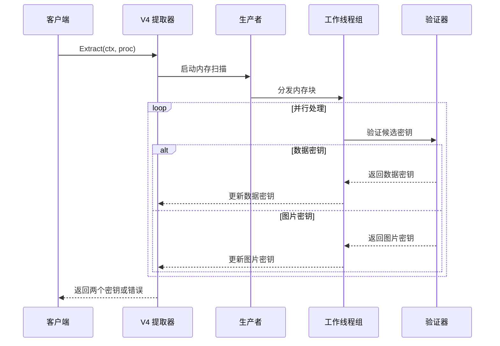
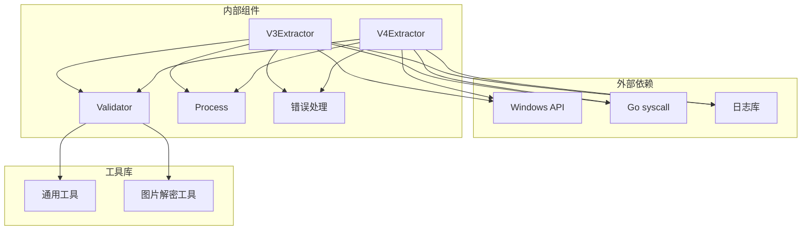
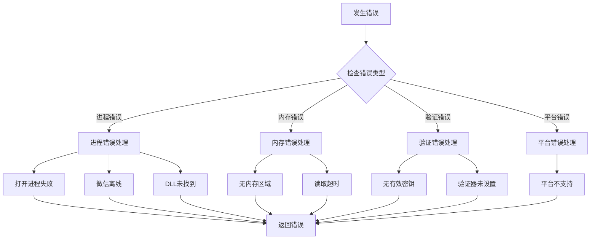

# Windows 平台密钥提取

<cite>
**本文档引用的文件**
- [internal/wechat/key/windows/v3.go](file://internal/wechat/key/windows/v3.go)
- [internal/wechat/key/windows/v4.go](file://internal/wechat/key/windows/v4.go)
- [internal/wechat/key/windows/v3_others.go](file://internal/wechat/key/windows/v3_others.go)
- [internal/wechat/key/windows/v4_others.go](file://internal/wechat/key/windows/v4_others.go)
- [internal/wechat/key/windows/v3_windows.go](file://internal/wechat/key/windows/v3_windows.go)
- [internal/wechat/key/windows/v4_windows.go](file://internal/wechat/key/windows/v4_windows.go)
- [internal/wechat/key/extractor.go](file://internal/wechat/key/extractor.go)
- [internal/wechat/decrypt/validator.go](file://internal/wechat/decrypt/validator.go)
- [internal/errors/wechat_errors.go](file://internal/errors/wechat_errors.go)
- [internal/wechat/process/windows/detector_windows.go](file://internal/wechat/process/windows/detector_windows.go)
- [internal/wechat/process/windows/detector_others.go](file://internal/wechat/process/windows/detector_others.go)
</cite>

## 目录
1. [简介](#简介)
2. [项目结构](#项目结构)
3. [核心组件](#核心组件)
4. [架构概览](#架构概览)
5. [详细组件分析](#详细组件分析)
6. [依赖关系分析](#依赖关系分析)
7. [性能考虑](#性能考虑)
8. [故障排除指南](#故障排除指南)
9. [结论](#结论)

## 简介

本文档详细介绍了 Windows 平台下微信 V3 和 V4 版本的密钥提取机制。该系统采用多线程内存扫描算法，通过进程注入技术读取微信进程内存，识别密钥存储位置并进行验证。文档涵盖了 Windows 特有的实现策略，包括不同 Windows 版本的兼容性处理、进程权限要求、内存布局分析等。

## 项目结构

该项目采用分层架构设计，主要包含以下核心模块：

**图表来源**
- [internal/wechat/key/extractor.go](file://internal/wechat/key/extractor.go#L1-L40)
- [internal/wechat/key/windows/v3.go](file://internal/wechat/key/windows/v3.go#L1-L25)
- [internal/wechat/key/windows/v4.go](file://internal/wechat/key/windows/v4.go#L1-L25)

**章节来源**
- [internal/wechat/key/extractor.go](file://internal/wechat/key/extractor.go#L1-L40)
- [internal/wechat/key/windows/v3.go](file://internal/wechat/key/windows/v3.go#L1-L25)
- [internal/wechat/key/windows/v4.go](file://internal/wechat/key/windows/v4.go#L1-L25)

## 核心组件

### 密钥提取器接口

系统定义了统一的密钥提取器接口，支持跨平台扩展：

**图表来源**
- [internal/wechat/key/extractor.go](file://internal/wechat/key/extractor.go#L13-L23)
- [internal/wechat/key/windows/v3.go](file://internal/wechat/key/windows/v3.go#L9-L24)
- [internal/wechat/key/windows/v4.go](file://internal/wechat/key/windows/v4.go#L9-L24)
- [internal/wechat/decrypt/validator.go](file://internal/wechat/decrypt/validator.go#L10-L17)

### 进程管理组件

系统提供了专门的进程检测和信息初始化功能：

**图表来源**
- [internal/wechat/process/windows/detector_windows.go](file://internal/wechat/process/windows/detector_windows.go#L14-L48)

**章节来源**
- [internal/wechat/key/extractor.go](file://internal/wechat/key/extractor.go#L25-L39)
- [internal/wechat/decrypt/validator.go](file://internal/wechat/decrypt/validator.go#L1-L76)
- [internal/wechat/process/windows/detector_windows.go](file://internal/wechat/process/windows/detector_windows.go#L1-L49)

## 架构概览

系统采用生产者-消费者模式实现高效的内存扫描：

**图表来源**
- [internal/wechat/key/windows/v3_windows.go](file://internal/wechat/key/windows/v3_windows.go#L26-L102)
- [internal/wechat/key/windows/v4_windows.go](file://internal/wechat/key/windows/v4_windows.go#L23-L113)

## 详细组件分析

### V3 版本密钥提取器

V3 版本的密钥提取器专注于 WeChatWin.dll 模块的内存扫描：

#### 内存扫描算法

**图表来源**
- [internal/wechat/key/windows/v3_windows.go](file://internal/wechat/key/windows/v3_windows.go#L104-L227)

#### 关键实现特性

1. **模块定位**: 使用 `FindModule` 函数精确查找 WeChatWin.dll 模块
2. **内存过滤**: 只扫描可写且已提交的内存区域
3. **并发处理**: 最多 16 个工作线程并行处理
4. **智能搜索**: 从内存末尾向前搜索，提高效率

**章节来源**
- [internal/wechat/key/windows/v3.go](file://internal/wechat/key/windows/v3.go#L1-L25)
- [internal/wechat/key/windows/v3_windows.go](file://internal/wechat/key/windows/v3_windows.go#L1-L256)

### V4 版本密钥提取器

V4 版本支持同时提取数据密钥和图片密钥：

#### 多密钥提取流程

**图表来源**
- [internal/wechat/key/windows/v4_windows.go](file://internal/wechat/key/windows/v4_windows.go#L23-L113)

#### V4 特有功能

1. **双密钥支持**: 同时提取数据密钥和图片密钥
2. **地址去重**: 使用 `keysFound` 映射避免重复处理相同地址
3. **类型区分**: 通过 `validateKey` 方法区分数据密钥和图片密钥
4. **早期退出**: 找到两个密钥后立即停止扫描

**章节来源**
- [internal/wechat/key/windows/v4.go](file://internal/wechat/key/windows/v4.go#L1-L25)
- [internal/wechat/key/windows/v4_windows.go](file://internal/wechat/key/windows/v4_windows.go#L1-L281)

### 内存扫描实现

#### V3 内存扫描策略

V3 版本采用精确的模块扫描策略：

| 参数 | 值 | 描述 |
|------|-----|------|
| 模块名称 | WeChatWin.dll | 微信主模块 |
| 最小区域大小 | 100KB | 跳过较小的内存区域 |
| 最大工作线程数 | 16 | CPU 核心数与 16 的最小值 |
| 搜索方向 | 从末尾向前 | 提高匹配效率 |

#### V4 内存扫描策略

V4 版本采用更广泛的内存扫描范围：

| 参数 | 值 | 描述 |
|------|-----|------|
| 扫描范围 | 0x10000 - 0x7FFFFFFF | 32位进程空间限制 |
| 64位支持 | 0x7FFFFFFFFFFF | 64位进程空间限制 |
| 区域类型 | MEM_PRIVATE | 私有内存区域 |
| 权限要求 | PAGE_READWRITE | 可读写权限 |
| 最小区域大小 | 1MB | 跳过较小的内存区域 |

**章节来源**
- [internal/wechat/key/windows/v3_windows.go](file://internal/wechat/key/windows/v3_windows.go#L104-L157)
- [internal/wechat/key/windows/v4_windows.go](file://internal/wechat/key/windows/v4_windows.go#L115-L166)

## 依赖关系分析

### 组件依赖图

**图表来源**
- [internal/wechat/key/windows/v3_windows.go](file://internal/wechat/key/windows/v3_windows.go#L3-L19)
- [internal/wechat/key/windows/v4_windows.go](file://internal/wechat/key/windows/v4_windows.go#L3-L17)

### 错误处理机制

系统实现了完善的错误处理机制：

**图表来源**
- [internal/errors/wechat_errors.go](file://internal/errors/wechat_errors.go#L5-L66)

**章节来源**
- [internal/errors/wechat_errors.go](file://internal/errors/wechat_errors.go#L1-L66)

## 性能考虑

### 并发优化策略

1. **动态线程数调整**: 根据 CPU 核心数自动调整工作线程数量
2. **内存区域过滤**: 跳过小于阈值的内存区域，减少不必要的读取
3. **智能搜索方向**: 从内存末尾向前搜索，提高匹配效率
4. **早期退出机制**: 找到目标后立即停止扫描

### 内存管理优化

| 优化措施 | 实现方式 | 效果 |
|----------|----------|------|
| 缓冲区大小 | 100个内存块缓冲 | 减少 goroutine 间的阻塞 |
| 地址去重 | 使用映射表避免重复处理 | 提高扫描效率 |
| 超时控制 | 上下文取消机制 | 防止无限等待 |
| 日志级别 | 调试级别按需输出 | 减少日志开销 |

### Windows 特定优化

1. **权限检查**: 确保具有足够的进程访问权限
2. **架构检测**: 自动识别 32 位和 64 位进程
3. **模块定位**: 精确查找 WeChatWin.dll 模块
4. **内存保护**: 正确处理内存保护属性

## 故障排除指南

### 常见问题及解决方案

#### 进程权限问题

**症状**: 打开进程失败，返回权限不足错误

**解决方案**:
1. 以管理员身份运行程序
2. 检查 UAC 设置
3. 确认目标进程用户权限

#### 内存扫描失败

**症状**: 无法找到有效的内存区域

**解决方案**:
1. 确认微信进程正在运行
2. 检查进程架构（32位 vs 64位）
3. 验证目标模块是否存在

#### 密钥验证失败

**症状**: 扫描到的密钥无法通过验证

**解决方案**:
1. 确认数据库文件完整性
2. 检查密钥版本匹配
3. 验证数据目录路径正确性

### 调试建议

1. **启用详细日志**: 使用调试级别日志查看扫描过程
2. **监控内存使用**: 注意大量内存读取可能影响系统性能
3. **测试环境隔离**: 在测试环境中验证功能后再部署到生产环境

**章节来源**
- [internal/errors/wechat_errors.go](file://internal/errors/wechat_errors.go#L1-L66)

## 结论

Windows 平台下的微信密钥提取系统通过精心设计的多线程内存扫描算法和智能验证机制，实现了高效可靠的密钥提取功能。系统针对 V3 和 V4 版本的不同特点采用了差异化的实现策略，既保证了提取效率，又确保了结果的准确性。

该系统的主要优势包括：

1. **跨版本支持**: 同时支持 V3 和 V4 版本的微信
2. **高性能设计**: 采用多线程并行处理和智能搜索算法
3. **错误处理完善**: 全面的错误检测和处理机制
4. **平台特定优化**: 针对 Windows 平台的特殊优化
5. **可扩展架构**: 清晰的接口设计便于功能扩展

通过合理配置和适当的权限设置，该系统能够在各种 Windows 环境下稳定运行，为微信数据解密提供可靠的技术支撑。