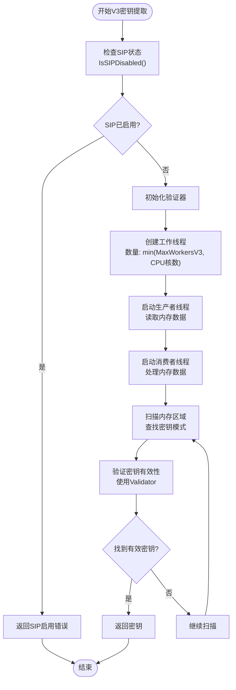
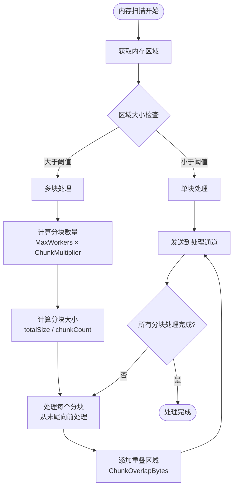

# macOS 平台密钥提取

<cite>
**本文档引用的文件**
- [v3.go](file://internal/wechat/key/darwin/v3.go)
- [v4.go](file://internal/wechat/key/darwin/v4.go)
- [glance.go](file://internal/wechat/key/darwin/glance/glance.go)
- [sip.go](file://internal/wechat/key/darwin/glance/sip.go)
- [vmmap.go](file://internal/wechat/key/darwin/glance/vmmap.go)
- [extractor.go](file://internal/wechat/key/extractor.go)
- [detector.go](file://internal/wechat/process/darwin/detector.go)
- [wechat_errors.go](file://internal/errors/wechat_errors.go)
- [v3.go](file://internal/wechat/decrypt/darwin/v3.go)
- [v4.go](file://internal/wechat/decrypt/darwin/v4.go)
- [common.go](file://internal/wechat/decrypt/common/common.go)
</cite>

## 目录
1. [简介](#简介)
2. [项目结构](#项目结构)
3. [核心组件](#核心组件)
4. [架构概览](#架构概览)
5. [详细组件分析](#详细组件分析)
6. [依赖关系分析](#依赖关系分析)
7. [性能考虑](#性能考虑)
8. [故障排除指南](#故障排除指南)
9. [结论](#结论)

## 简介

本文档详细介绍了在 macOS 平台下实现微信密钥提取的技术方案，涵盖了 V3 和 V4 版本的不同实现策略。该系统通过内存扫描技术、虚拟内存映射分析和系统安全机制绕过来实现密钥提取功能。

## 项目结构

项目采用模块化设计，主要包含以下关键模块：

**图表来源**
- [v3.go](file://internal/wechat/key/darwin/v3.go#L1-L193)
- [v4.go](file://internal/wechat/key/darwin/v4.go#L1-L366)
- [glance.go](file://internal/wechat/key/darwin/glance/glance.go#L1-L386)

**章节来源**
- [v3.go](file://internal/wechat/key/darwin/v3.go#L1-L193)
- [v4.go](file://internal/wechat/key/darwin/v4.go#L1-L366)
- [extractor.go](file://internal/wechat/key/extractor.go#L1-L40)

## 核心组件

### 密钥提取器接口

系统提供了统一的密钥提取器接口，支持不同平台和版本的密钥提取：

**图表来源**
- [extractor.go](file://internal/wechat/key/extractor.go#L13-L23)
- [v3.go](file://internal/wechat/key/darwin/v3.go#L29-L38)
- [v4.go](file://internal/wechat/key/darwin/v4.go#L40-L53)
- [glance.go](file://internal/wechat/key/darwin/glance/glance.go#L27-L32)

### 内存扫描器

内存扫描器负责从目标进程内存中读取数据并进行模式匹配：

**图表来源**
- [v3.go](file://internal/wechat/key/darwin/v3.go#L40-L112)
- [glance.go](file://internal/wechat/key/darwin/glance/glance.go#L135-L154)

**章节来源**
- [extractor.go](file://internal/wechat/key/extractor.go#L13-L40)
- [v3.go](file://internal/wechat/key/darwin/v3.go#L29-L193)
- [v4.go](file://internal/wechat/key/darwin/v4.go#L40-L366)

## 架构概览

系统采用分层架构设计，确保了良好的可扩展性和维护性：

**图表来源**
- [detector.go](file://internal/wechat/process/darwin/detector.go#L24-L95)
- [glance.go](file://internal/wechat/key/darwin/glance/glance.go#L231-L385)

## 详细组件分析

### V3 版本密钥提取器

V3 版本的密钥提取器针对早期版本的微信实现了专门的提取策略：

#### 关键特性

1. **内存扫描策略**：使用多线程并发扫描内存区域
2. **模式匹配算法**：基于预定义的字节模式进行密钥定位
3. **SIP 状态检查**：强制要求系统完整性保护(SIP)处于禁用状态

#### 实现流程

**图表来源**
- [v3.go](file://internal/wechat/key/darwin/v3.go#L40-L112)
- [v3.go](file://internal/wechat/key/darwin/v3.go#L124-L188)

**章节来源**
- [v3.go](file://internal/wechat/key/darwin/v3.go#L18-L193)

### V4 版本密钥提取器

V4 版本的密钥提取器支持更复杂的密钥类型和提取策略：

#### 多密钥支持

V4 提取器能够同时提取两种类型的密钥：
- **数据密钥**：32字节，用于普通消息数据库解密
- **图片密钥**：16字节，用于图片资源解密

#### 高级扫描算法

**图表来源**
- [v4.go](file://internal/wechat/key/darwin/v4.go#L55-L147)
- [v4.go](file://internal/wechat/key/darwin/v4.go#L159-L214)

**章节来源**
- [v4.go](file://internal/wechat/key/darwin/v4.go#L18-L366)

### 内存扫描器

内存扫描器是整个系统的核心组件，负责与操作系统交互以读取目标进程的内存：

#### 虚拟内存映射分析

**图表来源**
- [vmmap.go](file://internal/wechat/key/darwin/glance/vmmap.go#L23-L33)
- [glance.go](file://internal/wechat/key/darwin/glance/glance.go#L27-L32)

#### 内存读取策略

系统采用流式内存读取策略，通过以下步骤实现高效的数据提取：

1. **内存映射获取**：使用 `vmmap` 命令获取进程内存布局
2. **区域过滤**：根据 Darwin 版本选择合适的内存区域类型
3. **流式读取**：使用 LLDB 调试器进行并行内存读取
4. **数据分块**：将大内存区域分割为小块以提高处理效率

**章节来源**
- [glance.go](file://internal/wechat/key/darwin/glance/glance.go#L18-L386)
- [vmmap.go](file://internal/wechat/key/darwin/glance/vmmap.go#L14-L187)

### 系统安全机制处理

#### SIP 状态检测

系统通过 `IsSIPDisabled()` 函数检测系统完整性保护(SIP)的状态：

**图表来源**
- [sip.go](file://internal/wechat/key/darwin/glance/sip.go#L10-L37)

**章节来源**
- [sip.go](file://internal/wechat/key/darwin/glance/sip.go#L1-L38)

### 进程检测和管理

系统提供了完整的进程检测功能，能够识别和管理微信进程：

#### 进程发现机制

**图表来源**
- [detector.go](file://internal/wechat/process/darwin/detector.go#L32-L95)

**章节来源**
- [detector.go](file://internal/wechat/process/darwin/detector.go#L24-L165)

## 依赖关系分析

系统各组件之间的依赖关系如下：

**图表来源**
- [extractor.go](file://internal/wechat/key/extractor.go#L13-L40)
- [glance.go](file://internal/wechat/key/darwin/glance/glance.go#L1-L386)
- [wechat_errors.go](file://internal/errors/wechat_errors.go#L1-L66)

**章节来源**
- [extractor.go](file://internal/wechat/key/extractor.go#L1-L40)
- [wechat_errors.go](file://internal/errors/wechat_errors.go#L1-L66)

## 性能考虑

### 内存扫描优化

系统采用了多种优化策略来提高内存扫描的性能：

1. **并行处理**：使用多个工作线程同时处理不同的内存区域
2. **流式读取**：避免一次性加载所有内存数据到内存中
3. **智能分块**：根据内存大小动态调整分块策略
4. **重叠边界**：在分块之间添加重叠区域确保模式匹配的完整性

### 内存管理策略

**图表来源**
- [glance.go](file://internal/wechat/key/darwin/glance/glance.go#L157-L228)

## 故障排除指南

### 常见问题及解决方案

#### SIP 未禁用错误

当系统报告 SIP 已启用时，需要先禁用 SIP 才能进行内存扫描：

1. 重启到恢复模式
2. 打开终端并执行 `csrutil disable`
3. 重启系统后再次尝试密钥提取

#### 内存读取超时

如果出现内存读取超时错误，可以尝试：

1. 检查目标进程是否仍在运行
2. 确认有足够的系统资源
3. 尝试在系统负载较低时重试

#### 密钥验证失败

如果密钥提取但验证失败：

1. 确认微信版本与提取器版本匹配
2. 检查密钥是否来自正确的数据库文件
3. 验证数据库文件是否完整且未被修改

**章节来源**
- [wechat_errors.go](file://internal/errors/wechat_errors.go#L1-L66)

## 结论

该系统为 macOS 平台下的微信密钥提取提供了完整的解决方案。通过精心设计的内存扫描算法、系统安全机制绕过和多线程处理策略，实现了高效可靠的密钥提取功能。

### 主要优势

1. **跨版本支持**：同时支持 V3 和 V4 版本的微信
2. **系统兼容性**：针对不同 Darwin 版本的内存区域类型进行了适配
3. **性能优化**：采用流式处理和并行计算提高扫描效率
4. **错误处理**：完善的错误检测和处理机制

### 技术特点

- 使用 LLDB 调试器进行内存读取，确保了稳定性和可靠性
- 通过 SIP 状态检测确保系统安全要求得到满足
- 实现了智能的内存区域过滤和分块处理策略
- 提供了完整的密钥验证机制保证提取结果的准确性

该系统为后续的数据库解密和数据恢复工作奠定了坚实的基础，是 macOS 平台下微信数据提取的重要工具。