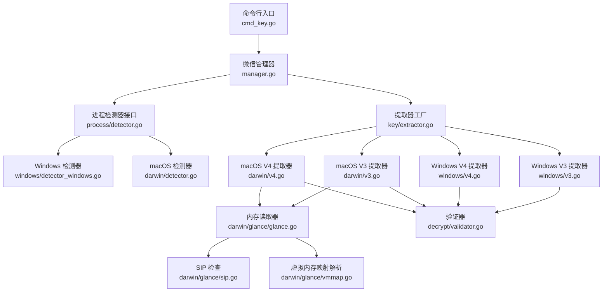
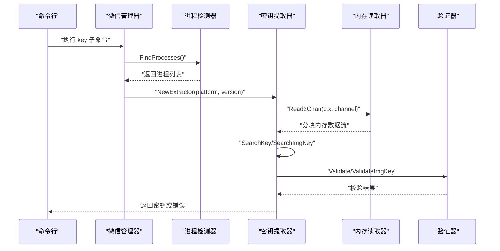
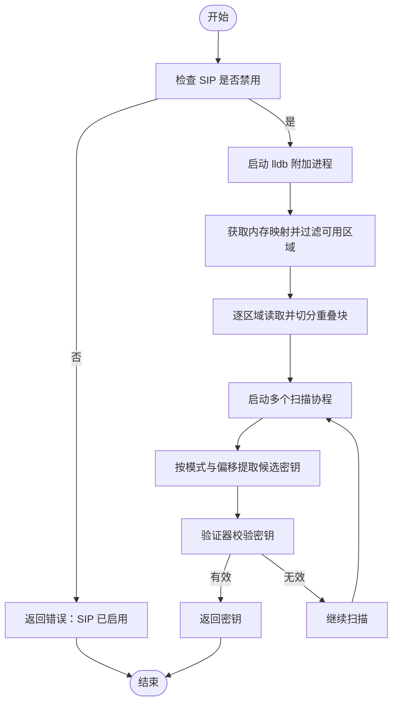
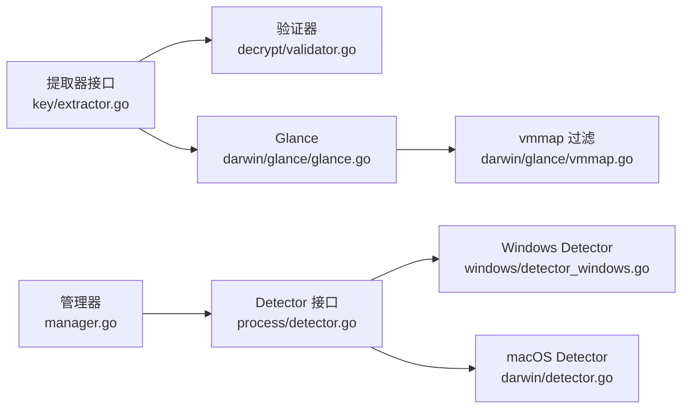

# 平台密钥提取

<cite>
**本文档引用的文件**
- [cmd/chatlog/cmd_key.go](file://cmd/chatlog/cmd_key.go)
- [internal/wechat/key/extractor.go](file://internal/wechat/key/extractor.go)
- [internal/wechat/key/windows/v3.go](file://internal/wechat/key/windows/v3.go)
- [internal/wechat/key/windows/v4.go](file://internal/wechat/key/windows/v4.go)
- [internal/wechat/key/darwin/v3.go](file://internal/wechat/key/darwin/v3.go)
- [internal/wechat/key/darwin/v4.go](file://internal/wechat/key/darwin/v4.go)
- [internal/wechat/key/darwin/glance/glance.go](file://internal/wechat/key/darwin/glance/glance.go)
- [internal/wechat/key/darwin/glance/sip.go](file://internal/wechat/key/darwin/glance/sip.go)
- [internal/wechat/key/darwin/glance/vmmap.go](file://internal/wechat/key/darwin/glance/vmmap.go)
- [internal/wechat/decrypt/validator.go](file://internal/wechat/decrypt/validator.go)
- [internal/wechat/process/detector.go](file://internal/wechat/process/detector.go)
- [internal/wechat/process/windows/detector_windows.go](file://internal/wechat/process/windows/detector_windows.go)
- [internal/wechat/process/darwin/detector.go](file://internal/wechat/process/darwin/detector.go)
- [internal/wechat/manager.go](file://internal/wechat/manager.go)
</cite>

## 目录
1. [简介](#简介)
2. [项目结构](#项目结构)
3. [核心组件](#核心组件)
4. [架构总览](#架构总览)
5. [详细组件分析](#详细组件分析)
6. [依赖关系分析](#依赖关系分析)
7. [性能考量](#性能考量)
8. [故障排除指南](#故障排除指南)
9. [结论](#结论)
10. [附录](#附录)

## 简介
本文件系统化阐述该仓库中的平台密钥提取机制，覆盖 Windows 与 macOS 两大平台。内容包括：
- 平台特定的密钥获取算法与内存扫描技术
- 进程注入/附加方法（基于外部工具链）
- 密钥存储位置、内存布局与提取策略
- 平台兼容性矩阵、性能对比与最佳实践
- 具体实现示例的代码片段路径与常见问题解决方案

## 项目结构
该项目围绕“微信进程检测 → 密钥提取器选择 → 内存扫描与密钥验证”的主流程组织，关键模块如下：
- 命令入口：提供 key 子命令以触发密钥提取
- 进程检测：按平台选择对应 Detector 实现
- 密钥提取：根据平台与版本选择 V3/V4 提取器
- 内存扫描：macOS 使用 lldb + 自定义 Glance 流式读取；Windows 当前占位未实现
- 验证器：基于数据库首页校验密钥有效性

图表来源
- [cmd/chatlog/cmd_key.go](file://cmd/chatlog/cmd_key.go#L24-L36)
- [internal/wechat/manager.go](file://internal/wechat/manager.go#L42-L76)
- [internal/wechat/process/detector.go](file://internal/wechat/process/detector.go#L13-L25)
- [internal/wechat/process/windows/detector_windows.go](file://internal/wechat/process/windows/detector_windows.go#L13-L48)
- [internal/wechat/process/darwin/detector.go](file://internal/wechat/process/darwin/detector.go#L32-L94)
- [internal/wechat/key/extractor.go](file://internal/wechat/key/extractor.go#L25-L39)
- [internal/wechat/key/windows/v3.go](file://internal/wechat/key/windows/v3.go#L1-L25)
- [internal/wechat/key/windows/v4.go](file://internal/wechat/key/windows/v4.go#L1-L25)
- [internal/wechat/key/darwin/v3.go](file://internal/wechat/key/darwin/v3.go#L40-L112)
- [internal/wechat/key/darwin/v4.go](file://internal/wechat/key/darwin/v4.go#L55-L147)
- [internal/wechat/key/darwin/glance/glance.go](file://internal/wechat/key/darwin/glance/glance.go#L132-L154)
- [internal/wechat/key/darwin/glance/sip.go](file://internal/wechat/key/darwin/glance/sip.go#L8-L37)
- [internal/wechat/key/darwin/glance/vmmap.go](file://internal/wechat/key/darwin/glance/vmmap.go#L35-L141)
- [internal/wechat/decrypt/validator.go](file://internal/wechat/decrypt/validator.go#L19-L49)

章节来源
- [cmd/chatlog/cmd_key.go](file://cmd/chatlog/cmd_key.go#L1-L37)
- [internal/wechat/manager.go](file://internal/wechat/manager.go#L1-L111)
- [internal/wechat/process/detector.go](file://internal/wechat/process/detector.go#L1-L37)

## 核心组件
- 命令行入口：注册 key 子命令，支持 PID、强制模式、显示 XOR 密钥等参数，并调用管理器执行密钥提取。
- 提取器工厂：根据平台与版本号返回对应提取器实例。
- 提取器接口：统一定义 Extract、SearchKey、SetValidate 方法。
- macOS 提取器（V3/V4）：使用 Glance 流式读取内存，多协程并行扫描，基于预设模式偏移定位密钥，再由验证器校验。
- Windows 提取器（V3/V4）：接口已定义但尚未实现具体逻辑（占位）。
- 验证器：加载对应版本数据库首页，校验候选密钥是否有效；V4 同时支持图片密钥校验。
- 进程检测器：按平台选择实现，解析进程状态、数据目录、账户名等信息。

章节来源
- [cmd/chatlog/cmd_key.go](file://cmd/chatlog/cmd_key.go#L12-L36)
- [internal/wechat/key/extractor.go](file://internal/wechat/key/extractor.go#L13-L39)
- [internal/wechat/key/darwin/v3.go](file://internal/wechat/key/darwin/v3.go#L29-L38)
- [internal/wechat/key/darwin/v4.go](file://internal/wechat/key/darwin/v4.go#L40-L53)
- [internal/wechat/key/windows/v3.go](file://internal/wechat/key/windows/v3.go#L9-L24)
- [internal/wechat/key/windows/v4.go](file://internal/wechat/key/windows/v4.go#L9-L24)
- [internal/wechat/decrypt/validator.go](file://internal/wechat/decrypt/validator.go#L10-L49)
- [internal/wechat/process/detector.go](file://internal/wechat/process/detector.go#L9-L25)

## 架构总览
下图展示从命令到密钥提取的关键调用序列，重点体现 macOS 平台的内存扫描与验证流程。

图表来源
- [cmd/chatlog/cmd_key.go](file://cmd/chatlog/cmd_key.go#L27-L34)
- [internal/wechat/manager.go](file://internal/wechat/manager.go#L51-L76)
- [internal/wechat/process/detector.go](file://internal/wechat/process/detector.go#L13-L25)
- [internal/wechat/key/extractor.go](file://internal/wechat/key/extractor.go#L25-L39)
- [internal/wechat/key/darwin/v3.go](file://internal/wechat/key/darwin/v3.go#L40-L112)
- [internal/wechat/key/darwin/v4.go](file://internal/wechat/key/darwin/v4.go#L55-L147)
- [internal/wechat/key/darwin/glance/glance.go](file://internal/wechat/key/darwin/glance/glance.go#L132-L154)
- [internal/wechat/decrypt/validator.go](file://internal/wechat/decrypt/validator.go#L51-L60)

## 详细组件分析

### macOS 平台密钥提取（V3/V4）
- 平台要求：必须禁用 SIP（System Integrity Protection），否则无法读取目标进程内存。
- 内存扫描：通过 lldb 将进程内存以二进制形式写入命名管道，Glance 逐区域读取并切分为固定数量的重叠块，避免跨边界漏检。
- 并发模型：生产者（单个 lldb 进程）读取多个内存区域，消费者（多个 goroutine）并行扫描块数据，使用通道传递候选密钥，首个有效密钥即返回。
- 模式匹配：V3 使用固定字节模式与偏移，V4 对数据密钥与图片密钥分别维护不同模式集合，且对零填充进行对齐处理。
- 校验策略：候选密钥经验证器与数据库首页比对，确保正确性；V4 图片密钥额外使用专用校验器。

图表来源
- [internal/wechat/key/darwin/v3.go](file://internal/wechat/key/darwin/v3.go#L40-L112)
- [internal/wechat/key/darwin/v4.go](file://internal/wechat/key/darwin/v4.go#L55-L147)
- [internal/wechat/key/darwin/glance/glance.go](file://internal/wechat/key/darwin/glance/glance.go#L132-L154)
- [internal/wechat/key/darwin/glance/sip.go](file://internal/wechat/key/darwin/glance/sip.go#L8-L37)
- [internal/wechat/decrypt/validator.go](file://internal/wechat/decrypt/validator.go#L51-L60)

章节来源
- [internal/wechat/key/darwin/v3.go](file://internal/wechat/key/darwin/v3.go#L18-L188)
- [internal/wechat/key/darwin/v4.go](file://internal/wechat/key/darwin/v4.go#L18-L356)
- [internal/wechat/key/darwin/glance/glance.go](file://internal/wechat/key/darwin/glance/glance.go#L18-L228)
- [internal/wechat/key/darwin/glance/sip.go](file://internal/wechat/key/darwin/glance/sip.go#L8-L37)
- [internal/wechat/key/darwin/glance/vmmap.go](file://internal/wechat/key/darwin/glance/vmmap.go#L122-L141)

### Windows 平台密钥提取（V3/V4）
- 当前状态：V3/V4 提取器接口已定义，但具体实现为占位（返回未实现提示）。因此，Windows 平台暂不支持密钥提取功能。
- 可扩展方向：可参考 macOS 的模式匹配与验证流程，在 Windows 上实现相应的内存扫描与密钥校验逻辑。

章节来源
- [internal/wechat/key/windows/v3.go](file://internal/wechat/key/windows/v3.go#L17-L24)
- [internal/wechat/key/windows/v4.go](file://internal/wechat/key/windows/v4.go#L17-L24)

### 验证器与数据库文件
- 验证器根据平台与版本选择对应数据库文件（如消息数据库首页），并构造解密器进行密钥校验。
- V4 版本同时支持图片密钥校验器，用于校验图片相关密钥的有效性。

章节来源
- [internal/wechat/decrypt/validator.go](file://internal/wechat/decrypt/validator.go#L19-L75)

### 进程检测与管理
- 管理器根据运行时操作系统选择对应 Detector 实现，枚举微信进程并解析其状态、数据目录与账户名。
- Windows 检测器通过进程打开文件路径判断版本与数据目录；macOS 检测器通过 lsof 获取打开文件并解析路径。

章节来源
- [internal/wechat/manager.go](file://internal/wechat/manager.go#L42-L76)
- [internal/wechat/process/detector.go](file://internal/wechat/process/detector.go#L13-L25)
- [internal/wechat/process/windows/detector_windows.go](file://internal/wechat/process/windows/detector_windows.go#L13-L48)
- [internal/wechat/process/darwin/detector.go](file://internal/wechat/process/darwin/detector.go#L32-L164)

## 依赖关系分析
- 组件耦合：
  - 提取器依赖验证器进行密钥校验，依赖平台特定的内存读取器（macOS）。
  - macOS 提取器依赖 Glance 的流式读取能力与 vmmap 过滤逻辑。
  - 进程检测器与管理器负责提供进程上下文（PID、数据目录、版本等）给提取器。
- 外部依赖：
  - macOS：lldb 用于内存读取；vmmap/lsof 用于内存映射与打开文件枚举；SIP 状态查询。
  - Windows：当前未实现，预留接口以便后续扩展。

图表来源
- [internal/wechat/key/extractor.go](file://internal/wechat/key/extractor.go#L13-L39)
- [internal/wechat/decrypt/validator.go](file://internal/wechat/decrypt/validator.go#L19-L49)
- [internal/wechat/key/darwin/glance/glance.go](file://internal/wechat/key/darwin/glance/glance.go#L132-L154)
- [internal/wechat/key/darwin/glance/vmmap.go](file://internal/wechat/key/darwin/glance/vmmap.go#L122-L141)
- [internal/wechat/manager.go](file://internal/wechat/manager.go#L42-L76)
- [internal/wechat/process/detector.go](file://internal/wechat/process/detector.go#L13-L25)
- [internal/wechat/process/windows/detector_windows.go](file://internal/wechat/process/windows/detector_windows.go#L13-L48)
- [internal/wechat/process/darwin/detector.go](file://internal/wechat/process/darwin/detector.go#L32-L94)

## 性能考量
- 并发与流水线：
  - macOS 提取器采用“单 lldb 生产者 + 多扫描消费者”的并发模型，结合固定数量的内存块切分，提升吞吐。
  - 重叠边界（ChunkOverlapBytes）确保跨边界模式命中率。
- I/O 与超时：
  - lldb 读取内存存在超时控制，避免长时间阻塞；vmmap 解析与过滤减少无关区域扫描。
- 可扩展性：
  - Windows 提取器目前未实现，建议复用 macOS 的模式匹配与验证框架，按需适配 Windows 内存布局与权限模型。

[本节为通用性能讨论，无需列出具体文件来源]

## 故障排除指南
- SIP 已启用导致无法读取内存：
  - 现象：提取器直接返回 SIP 相关错误。
  - 处理：关闭 SIP 或以具备足够权限的方式运行。
  - 参考：[sip.go](file://internal/wechat/key/darwin/glance/sip.go#L8-L37)
- 无可用内存区域：
  - 现象：vmmap 解析后无可用区域，读取失败。
  - 处理：确认目标进程确实在运行且有可写内存区域。
  - 参考：[vmmap.go](file://internal/wechat/key/darwin/glance/vmmap.go#L35-L141)
- lldb 命令执行失败或超时：
  - 现象：内存读取阶段报错或超时。
  - 处理：检查 lldb 可用性与系统权限；适当增大超时时间。
  - 参考：[glance.go](file://internal/wechat/key/darwin/glance/glance.go#L85-L130)
- 未设置验证器：
  - 现象：提取器返回验证器未设置错误。
  - 处理：在提取前调用 SetValidate 设置验证器。
  - 参考：[darwin/v3.go](file://internal/wechat/key/darwin/v3.go#L190-L192)、[darwin/v4.go](file://internal/wechat/key/darwin/v4.go#L358-L360)
- Windows 平台不可用：
  - 现象：调用返回未实现提示。
  - 处理：等待后续实现或自行扩展。
  - 参考：[windows/v3.go](file://internal/wechat/key/windows/v3.go#L17-L20)、[windows/v4.go](file://internal/wechat/key/windows/v4.go#L17-L20)

章节来源
- [internal/wechat/key/darwin/glance/sip.go](file://internal/wechat/key/darwin/glance/sip.go#L8-L37)
- [internal/wechat/key/darwin/glance/vmmap.go](file://internal/wechat/key/darwin/glance/vmmap.go#L35-L141)
- [internal/wechat/key/darwin/glance/glance.go](file://internal/wechat/key/darwin/glance/glance.go#L85-L130)
- [internal/wechat/key/darwin/v3.go](file://internal/wechat/key/darwin/v3.go#L190-L192)
- [internal/wechat/key/darwin/v4.go](file://internal/wechat/key/darwin/v4.go#L358-L360)
- [internal/wechat/key/windows/v3.go](file://internal/wechat/key/windows/v3.go#L17-L20)
- [internal/wechat/key/windows/v4.go](file://internal/wechat/key/windows/v4.go#L17-L20)

## 结论
- macOS 平台已实现完整的密钥提取流程：进程检测、内存扫描、模式匹配与密钥验证，具备良好的并发与容错设计。
- Windows 平台当前处于接口预留阶段，尚未实现具体提取逻辑，建议复用现有架构在 Windows 上落地。
- 最佳实践包括：先检查 SIP 状态、合理配置并发与块大小、优先使用验证器快速收敛候选密钥、为未来扩展预留接口。

[本节为总结性内容，无需列出具体文件来源]

## 附录

### 平台兼容性矩阵
- macOS
  - V3：支持（实现完整）
  - V4：支持（实现完整）
- Windows
  - V3：不支持（占位）
  - V4：不支持（占位）

章节来源
- [internal/wechat/key/extractor.go](file://internal/wechat/key/extractor.go#L25-L39)
- [internal/wechat/key/darwin/v3.go](file://internal/wechat/key/darwin/v3.go#L18-L20)
- [internal/wechat/key/darwin/v4.go](file://internal/wechat/key/darwin/v4.go#L17-L20)
- [internal/wechat/key/windows/v3.go](file://internal/wechat/key/windows/v3.go#L17-L24)
- [internal/wechat/key/windows/v4.go](file://internal/wechat/key/windows/v4.go#L17-L24)

### 代码示例（片段路径）
- 启动密钥提取（命令行）
  - [cmd_key.go](file://cmd/chatlog/cmd_key.go#L27-L34)
- 创建提取器（按平台与版本）
  - [extractor.go](file://internal/wechat/key/extractor.go#L25-L39)
- macOS V3 提取流程
  - [darwin/v3.go](file://internal/wechat/key/darwin/v3.go#L40-L112)
- macOS V4 提取流程
  - [darwin/v4.go](file://internal/wechat/key/darwin/v4.go#L55-L147)
- 内存读取与分块
  - [darwin/glance/glance.go](file://internal/wechat/key/darwin/glance/glance.go#L132-L228)
- SIP 检查
  - [darwin/glance/sip.go](file://internal/wechat/key/darwin/glance/sip.go#L8-L37)
- 进程检测（macOS）
  - [darwin/detector.go](file://internal/wechat/process/darwin/detector.go#L32-L94)
- 进程检测（Windows）
  - [windows/detector_windows.go](file://internal/wechat/process/windows/detector_windows.go#L13-L48)